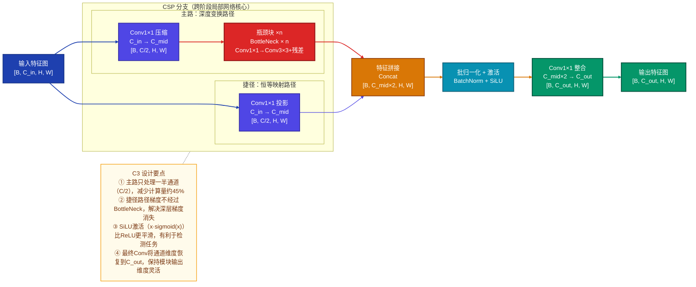
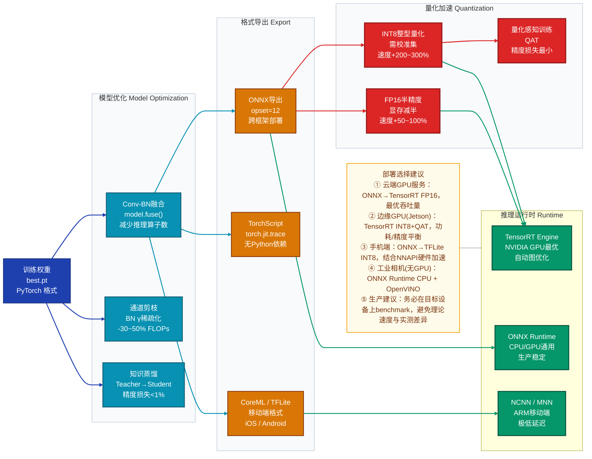

# YOLOv5 深度学习模型技术分析文档

> **版本说明**：本文档基于 YOLOv5 v6.x（Ultralytics 版本）进行分析，涵盖 YOLOv5s/m/l/x 系列模型的共性架构设计与核心机制。

---

## 目录

1. [模型定位](#1-模型定位)
2. [整体架构](#2-整体架构)
3. [数据直觉](#3-数据直觉)
4. [核心数据流](#4-核心数据流)
5. [关键组件](#5-关键组件)
6. [训练策略](#6-训练策略)
7. [评估指标与性能对比](#7-评估指标与性能对比)
8. [推理与部署](#8-推理与部署)
9. [FAQ](#9-faq)

---

## 1. 模型定位

**一句话定位**：YOLOv5 是单阶段（one-stage）实时目标检测领域的工程化里程碑，通过 CSP（跨阶段局部网络，Cross Stage Partial Network）骨干 + PANet（路径聚合网络，Path Aggregation Network）颈部 + 多尺度 Anchor 检测头的组合，在 COCO 数据集上以极低推理延迟实现了精度与速度的帕累托最优平衡。

**研究方向**：计算机视觉 → 目标检测（Object Detection）→ 单阶段实时检测

**核心创新点**：
- 引入 **CSPNet** 骨干（用于 YOLO 系列的首次系统性工程整合）大幅降低计算量
- **自适应 Anchor 计算**：训练前自动聚类数据集 Anchor，无需手工设计
- **Mosaic 数据增强**：四图拼接极大丰富小目标上下文，提升小目标检测性能
- **完全开源 + PyTorch 原生实现**：推动了工程化落地的标准化

---

## 2. 整体架构

### 2.1 架构 ASCII 树形结构

```
YOLOv5
├── INPUT                               输入层：接收原始 RGB 图像
│   └── 图像预处理                       Letterbox Resize + 归一化
│
├── BACKBONE（骨干网络）                  功能模块：多尺度特征提取，从浅到深提取语义
│   ├── Focus / Conv-P1                 第1层：步长2下采样，空间信息压缩为通道
│   ├── Conv-P2（stride=2）             第2层：2× 下采样，输出 P2 特征图
│   ├── C3-P2                           CSP + BottleNeck ×n，提取低层纹理特征
│   ├── Conv-P3（stride=2）             第3层：2× 下采样，输出 P3（stride=8）
│   ├── C3-P3 ×n                        捕获中等尺度物体的语义特征
│   ├── Conv-P4（stride=2）             第4层：2× 下采样，输出 P4（stride=16）
│   ├── C3-P4 ×n                        捕获大尺度物体的高层语义特征
│   ├── Conv-P5（stride=2）             第5层：2× 下采样，输出 P5（stride=32）
│   ├── C3-P5 ×n                        最深层语义特征（全局感受野）
│   └── SPPF                            空间金字塔池化快速版，多感受野特征融合
│       └── MaxPool(5) ×3串联            三次 MaxPool 替代原 SPP，计算更快
│
├── NECK（颈部网络）                      功能模块：多尺度特征融合，建立跨尺度信息通道
│   ├── FPN 上采样路径（Top-Down）        将深层语义下传给浅层位置精确特征
│   │   ├── Upsample + Concat(P4)       P5 上采样 2× 后与 P4 拼接
│   │   ├── C3（×n，无 shortcut）        融合后特征精炼
│   │   ├── Upsample + Concat(P3)       再次上采样与 P3 拼接
│   │   └── C3（×n，无 shortcut）        小目标检测特征图精炼
│   └── PAN 下采样路径（Bottom-Up）       将浅层位置信息上传给深层特征
│       ├── Conv(stride=2) + Concat     下采样后与 FPN 输出拼接
│       ├── C3（×n，无 shortcut）        中尺度检测特征精炼
│       ├── Conv(stride=2) + Concat     再次下采样拼接
│       └── C3（×n，无 shortcut）        大目标检测特征精炼
│
└── HEAD（检测头）                        功能模块：预测框位置 + 置信度 + 类别
    ├── Detect-P3（小目标）               输出步长8，感受野小，适合小物体
    │   └── Conv(1×1)                   无激活，直接输出原始预测向量
    ├── Detect-P4（中目标）               输出步长16，平衡精度与感受野
    │   └── Conv(1×1)
    └── Detect-P5（大目标）               输出步长32，感受野大，适合大物体
        └── Conv(1×1)                   每格输出 3×(5+C) 维向量
```

**职责边界说明**：
- **Backbone** 串行处理，负责将 `[B, 3, H, W]` 压缩为多尺度语义特征图（P3/P4/P5），越深特征语义越强但分辨率越低
- **Neck** 并行双路融合（FPN 自顶向下 + PAN 自底向上），跨模块特征复用 P3/P4/P5，实现双向信息流
- **Head** 并行三路输出，各负责一个尺度的检测，输出后在后处理阶段合并

### 2.2 模型整体架构图

```mermaid
flowchart LR
    %% ── 配色主题 ───────────────────────────────────────────────
    classDef inputStyle    fill:#1e40af,stroke:#1e3a8a,stroke-width:2px,color:#fff
    classDef encoderStyle  fill:#0891b2,stroke:#155e75,stroke-width:2px,color:#fff
    classDef attnStyle     fill:#dc2626,stroke:#991b1b,stroke-width:2.5px,color:#fff
    classDef ffnStyle      fill:#d97706,stroke:#92400e,stroke-width:2px,color:#fff
    classDef headStyle     fill:#059669,stroke:#064e3b,stroke-width:2px,color:#fff
    classDef noteStyle     fill:#fffbeb,stroke:#f59e0b,stroke-width:1.5px,color:#78350f
    classDef layerStyle    fill:#f8fafc,stroke:#cbd5e0,stroke-width:1.5px

    INPUT["原始图像输入<br>RGB Image<br>[B, 3, 640, 640]"]:::inputStyle

    %% ── 骨干网络 ─────────────────────────────────────────────────
    subgraph BACKBONE["骨干网络 Backbone（功能模块：多尺度特征提取）"]
        direction TB
        subgraph STEM["① Stem 层（子模块：快速下采样）"]
            direction LR
            FOCUS["Focus / Conv<br>步长2下采样<br>[B, 64, 320, 320]"]:::encoderStyle
        end
        subgraph STAGE["② CSP Stage ×4（子模块：逐级语义提取）"]
            direction LR
            P3["P3 特征图<br>C3+Conv<br>[B, 256, 80, 80]"]:::encoderStyle
            P4["P4 特征图<br>C3+Conv<br>[B, 512, 40, 40]"]:::encoderStyle
            P5["P5 特征图<br>C3+Conv<br>[B, 1024, 20, 20]"]:::encoderStyle
        end
        subgraph SPPF_SG["③ SPPF（子模块：全局感受野聚合）"]
            direction LR
            SPPF["空间金字塔池化<br>SPPF<br>[B, 1024, 20, 20]"]:::attnStyle
        end
    end
    class BACKBONE layerStyle

    %% ── 颈部网络 ─────────────────────────────────────────────────
    subgraph NECK["颈部网络 Neck（功能模块：双向多尺度特征融合）"]
        direction TB
        subgraph FPN["① FPN 上采样路径（子模块：语义信息自顶向下传播）"]
            direction LR
            N4["融合特征 N4<br>Upsample+Concat+C3<br>[B, 512, 40, 40]"]:::ffnStyle
            N3["融合特征 N3<br>Upsample+Concat+C3<br>[B, 256, 80, 80]"]:::ffnStyle
        end
        subgraph PAN["② PAN 下采样路径（子模块：位置信息自底向上传播）"]
            direction LR
            PN4["融合特征 PN4<br>Conv+Concat+C3<br>[B, 512, 40, 40]"]:::ffnStyle
            PN5["融合特征 PN5<br>Conv+Concat+C3<br>[B, 1024, 20, 20]"]:::ffnStyle
        end
    end
    class NECK layerStyle

    %% ── 检测头 ───────────────────────────────────────────────────
    subgraph HEAD["检测头 Head（功能模块：多尺度目标预测）"]
        direction LR
        H_S["小目标检测头<br>stride=8<br>[B, 3×(5+C), 80, 80]"]:::headStyle
        H_M["中目标检测头<br>stride=16<br>[B, 3×(5+C), 40, 40]"]:::headStyle
        H_L["大目标检测头<br>stride=32<br>[B, 3×(5+C), 20, 20]"]:::headStyle
    end
    class HEAD layerStyle

    NMS["NMS 后处理<br>Non-Maximum Suppression<br>最终检测框 + 类别"]:::headStyle

    %% ── 数据流 ───────────────────────────────────────────────────
    INPUT --> FOCUS
    FOCUS --> P3
    P3 --> P4
    P4 --> P5
    P5 --> SPPF
    SPPF -->|"[B,1024,20,20]"| N4
    P4 -->|"跨模块复用 P4"| N4
    N4 -->|"[B,512,40,40]"| N3
    P3 -->|"跨模块复用 P3"| N3
    N3 -->|"[B,256,80,80]"| PN4
    N4 -->|"跨模块复用 N4"| PN4
    PN4 -->|"[B,512,40,40]"| PN5
    SPPF -->|"跨模块复用 P5"| PN5
    N3 --> H_S
    PN4 --> H_M
    PN5 --> H_L
    H_S --> NMS
    H_M --> NMS
    H_L --> NMS

    %% ── 设计注记 ─────────────────────────────────────────────────
    NOTE["设计要点<br>① Backbone：CSP结构减少计算量约45%，参数量减少约22%<br>② Neck：FPN+PAN双向融合，P3/P4/P5均被复用2次（一次FPN一次PAN）<br>③ Head：三尺度并行输出，小/中/大目标分别由P3/P4/P5负责<br>④ 5+C = tx,ty,tw,th（4维坐标）+ objectness（1维置信度）+ C类概率"]:::noteStyle
    NOTE -.- NECK

    %% 边索引：0-16，共 17 条；NOTE -.- 为边 17
    linkStyle 0 stroke:#1e40af,stroke-width:2px
    linkStyle 1,2,3,4 stroke:#0891b2,stroke-width:2px
    linkStyle 5,6,7,8,9 stroke:#dc2626,stroke-width:2px
    linkStyle 10,11,12,13 stroke:#d97706,stroke-width:2px
    linkStyle 14,15,16 stroke:#059669,stroke-width:2px
```



---

## 3. 数据直觉

### 3.1 样例选取

**具体样例**：一张城市街道图像（1920×1080 像素，RGB），画面中包含：
- 3 辆汽车（大小各异，其中一辆被遮挡约 30%）
- 2 名行人（一名站立，一名距镜头较远，在画面中较小）
- 1 个交通标志（左上角，尺寸约 60×60 像素）

### 3.2 各阶段数据形态变化

**阶段 1：原始输入**

```
原始图像：1920×1080，JPEG 格式，RGB 三通道
像素值范围：[0, 255]，整数
内容：一帧城市道路场景，包含不同尺寸的目标
```

**阶段 2：预处理（Letterbox + 归一化）**

```
目标尺寸：640×640
缩放策略：等比例缩放到 640×360，上下各填充 140 像素（灰色，值=114）
最终形状：[1, 3, 640, 640]，float32
归一化：像素值 ÷ 255 → [0.0, 1.0]

→「这一步在做什么」：Letterbox 保持原始宽高比，避免目标形变；灰色填充区域的预测
  在后处理中会被裁剪掉；归一化使梯度更稳定，与预训练权重的输入分布对齐。
```

**阶段 3：骨干网络特征图（P3/P4/P5）**

```
P3 特征图：[1, 256, 80, 80]（stride=8）
  → 感受野约 52×52 像素，每个格子"看到"原图 1/8 区域
  → 这一步在表达：低层纹理 + 位置精细信息，擅长捕捉行人腿部轮廓、标志牌边缘

P4 特征图：[1, 512, 40, 40]（stride=16）
  → 感受野约 110×110 像素，每格看到原图更大区域
  → 这一步在表达：中层语义，如「车轮+车身」的组合特征、完整的行人轮廓

P5 特征图（经 SPPF）：[1, 1024, 20, 20]（stride=32）
  → 感受野覆盖全图约 30%，SPPF 再进一步聚合多尺度上下文
  → 这一步在表达：高层语义「这是一辆车」「这是一个人」，对精细位置不敏感但类别判断准确
```

**阶段 4：Neck 融合后特征图**

```
N3（小目标检测特征图）：[1, 256, 80, 80]
  → 融合了 P5 的语义（"这是什么类别"）+ P3 原始的位置信息（"在哪里"）
  → 小交通标志（60×60 像素→归一化后约 20×20）现在同时具备语义和定位能力

PN5（大目标检测特征图）：[1, 1024, 20, 20]
  → 融合了 N3 的位置精度 + P5 的语义，大型汽车的边界框回归更准确
```

**阶段 5：检测头原始输出**

```
每个尺度输出：[1, 3, H_grid, W_grid, 5+C]（C=80 for COCO）
H_grid×W_grid 格子中每格 3 个 Anchor，每个 Anchor 预测：
  [tx, ty, tw, th, obj_conf, cls_1, cls_2, ..., cls_80]
  (偏移量) (偏移量)(缩放)(缩放)(物体存在概率) (80个类别概率)

示例（P3 输出中某格，检测到小交通标志）：
  tx=0.3, ty=0.2（格子内偏移），tw=-0.1, th=0.05（相对 Anchor 缩放）
  obj_conf=0.91（sigmoid 后），cls_11(stop sign)=0.87
```

**阶段 6：后处理（解码 + NMS）**

```
解码：将相对预测值转为绝对坐标
  bx = (sigmoid(tx) + grid_x) × stride
  by = (sigmoid(ty) + grid_y) × stride
  bw = anchor_w × exp(tw)
  bh = anchor_h × exp(th)

初始预测（全部格子展开）：约 25200 个候选框（80²×3 + 40²×3 + 20²×3）
置信度过滤（conf>0.25）：剩余约 150 个候选框
NMS（IoU 阈值 0.45）：最终保留 6 个框

最终可用结果：
  [汽车, (245,180,580,420), conf=0.93]
  [汽车, (680,190,950,410), conf=0.87]
  [汽车, (1100,200,1380,430), conf=0.91]   ← 遮挡目标也被检出
  [行人, (430,150,490,390), conf=0.82]
  [行人, (820,280,850,360), conf=0.64]     ← 远处小行人，置信度较低
  [停止标志, (55,40,115,100), conf=0.79]
```

---

## 4. 核心数据流

### 4.1 完整张量流图

```mermaid
flowchart LR
    %% ── 配色主题 ───────────────────────────────────────────────
    classDef inputStyle    fill:#1e40af,stroke:#1e3a8a,stroke-width:2px,color:#fff
    classDef embedStyle    fill:#4f46e5,stroke:#3730a3,stroke-width:2px,color:#fff
    classDef encoderStyle  fill:#0891b2,stroke:#155e75,stroke-width:2px,color:#fff
    classDef attnStyle     fill:#dc2626,stroke:#991b1b,stroke-width:2.5px,color:#fff
    classDef ffnStyle      fill:#d97706,stroke:#92400e,stroke-width:2px,color:#fff
    classDef headStyle     fill:#059669,stroke:#064e3b,stroke-width:2px,color:#fff
    classDef noteStyle     fill:#fffbeb,stroke:#f59e0b,stroke-width:1.5px,color:#78350f
    classDef layerStyle    fill:#f8fafc,stroke:#cbd5e0,stroke-width:1.5px

    RAW["原始图像<br>JPEG/PNG<br>[H_orig, W_orig, 3]"]:::inputStyle

    subgraph PREP["预处理 Preprocessing"]
        direction LR
        LB["Letterbox 等比缩放<br>灰色填充<br>[640, 640, 3]"]:::embedStyle
        NORM["归一化<br>÷255 + BGR→RGB<br>[B, 3, 640, 640] float32"]:::embedStyle
    end
    class PREP layerStyle

    subgraph BB["骨干网络 Backbone"]
        direction LR
        STEM["Stem Conv<br>stride=2<br>[B, 64, 320, 320]"]:::encoderStyle
        C3_1["C3 Stage1<br>stride=2<br>[B, 128, 160, 160]"]:::encoderStyle
        C3_2["C3 Stage2<br>stride=2<br>[B, 256, 80, 80]"]:::encoderStyle
        C3_3["C3 Stage3<br>stride=2<br>[B, 512, 40, 40]"]:::encoderStyle
        C3_4["C3 Stage4<br>stride=2<br>[B, 1024, 20, 20]"]:::encoderStyle
        SPPF_N["SPPF<br>MaxPool×3串联<br>[B, 1024, 20, 20]"]:::attnStyle
    end
    class BB layerStyle

    subgraph NK["颈部 Neck（FPN+PAN）"]
        direction LR
        UP1["上采样2×+Concat P4<br>[B, 1024, 40, 40]→C3<br>[B, 512, 40, 40]"]:::ffnStyle
        UP2["上采样2×+Concat P3<br>[B, 768, 80, 80]→C3<br>[B, 256, 80, 80]"]:::ffnStyle
        DN1["下采样+Concat N4<br>[B, 768, 40, 40]→C3<br>[B, 512, 40, 40]"]:::ffnStyle
        DN2["下采样+Concat P5<br>[B, 1536, 20, 20]→C3<br>[B, 1024, 20, 20]"]:::ffnStyle
    end
    class NK layerStyle

    subgraph HD["检测头 Head"]
        direction LR
        DET_S["小目标头<br>Conv(1×1)<br>[B, 3×85, 80, 80]"]:::headStyle
        DET_M["中目标头<br>Conv(1×1)<br>[B, 3×85, 40, 40]"]:::headStyle
        DET_L["大目标头<br>Conv(1×1)<br>[B, 3×85, 20, 20]"]:::headStyle
    end
    class HD layerStyle

    DECODE["坐标解码<br>sigmoid + exp + anchor<br>25200个候选框"]:::headStyle
    FILT["置信度过滤<br>conf > 0.25<br>~150个框"]:::headStyle
    NMS_N["NMS<br>IoU阈值 0.45<br>最终N个框"]:::headStyle

    %% ── 数据流 ───────────────────────────────────────────────────
    RAW --> LB
    LB --> NORM
    NORM --> STEM
    STEM --> C3_1
    C3_1 --> C3_2
    C3_2 --> C3_3
    C3_3 --> C3_4
    C3_4 --> SPPF_N
    SPPF_N --> UP1
    C3_3 -->|"P4 跳连"| UP1
    UP1 --> UP2
    C3_2 -->|"P3 跳连"| UP2
    UP2 --> DN1
    UP1 -->|"N4 跳连"| DN1
    DN1 --> DN2
    SPPF_N -->|"P5 跳连"| DN2
    UP2 --> DET_S
    DN1 --> DET_M
    DN2 --> DET_L
    DET_S --> DECODE
    DET_M --> DECODE
    DET_L --> DECODE
    DECODE --> FILT
    FILT --> NMS_N

    NOTE["关键维度变化<br>① 640→320→160→80→40→20：5次stride=2下采样<br>② Neck中Concat后通道数翻倍，再通过C3压缩回目标通道<br>③ 输出 3×85 = 3个Anchor × (4坐标+1置信度+80类别)<br>④ 总预测格数：80²×3+40²×3+20²×3 = 25200个Anchor"]:::noteStyle
    NOTE -.- NK

    %% 边索引：0-22，共 23 条；NOTE -.- 为边 23
    linkStyle 0,1 stroke:#1e40af,stroke-width:2px
    linkStyle 2,3,4,5,6,7 stroke:#0891b2,stroke-width:2px
    linkStyle 8,9,10,11,12,13,14,15 stroke:#d97706,stroke-width:2px
    linkStyle 16,17,18 stroke:#059669,stroke-width:1.5px
    linkStyle 19,20,21,22 stroke:#059669,stroke-width:2px
```



---

## 5. 关键组件

### 5.1 组件一：C3 模块（CSP + BottleNeck）

**直觉**：C3 本质上是在做"分工协作"——把特征图拆成两份，一份走完整的 BottleNeck 学习复杂变换，另一份走捷径保持原始信息，最后合并。这样既保留了深层计算的表达能力，又通过捷径路径防止梯度消失、大幅减少重复计算。

**原理深入**：

传统 DenseNet/ResNet 每一层都要访问前面所有层的特征，导致大量重复梯度计算。CSP（跨阶段局部网络）的核心思路是将梯度流从特征图层面分隔开来：

$$\text{Input} \xrightarrow{\text{Split}} \begin{cases} x_1 = \text{Conv}_{1\times1}(\text{Input}) \\ x_2 = \text{Conv}_{1\times1}(\text{Input}) \end{cases}$$

- $x_1$ 经过 $n$ 个 BottleNeck 块处理（每个 BottleNeck：Conv1×1 → Conv3×3 + 残差连接）
- $x_2$ 直接传递（identity shortcut，不经过 BottleNeck）

$$\text{Output} = \text{Conv}_{1\times1}(\text{Concat}(x_1, x_2))$$

**BottleNeck 内部计算**：

$$\text{Bottleneck}(x) = x + \text{Conv}_{3\times3}(\text{BN}(\text{ReLU}(\text{Conv}_{1\times1}(\text{BN}(\text{ReLU}(x)))))))$$

**参数量对比**（以输入输出均为 C 通道为例）：

| 结构 | FLOPs（相对值） | 参数量 |
|---|---|---|
| 传统 ResNet Block（C→C→C） | 1.0× | $2 \times C^2 \times k^2$ |
| CSP-BottleNeck（C→C/2, 各路） | ~0.55× | 约减少 22% |

**为什么这样设计**：在检测任务中推理速度至关重要，CSP 通过"部分处理 + 残差合并"的方式，在不显著损失精度的情况下，将 GPU 计算量减少约 45%，同时减少内存带宽消耗（跨阶段特征只需存一次）。

### 5.2 组件二：SPPF（空间金字塔池化快速版）

**直觉**：目标检测面临一个根本困难——同一张图里既有近处的大车又有远处的小行人，单一感受野顾此失彼。SPPF 用串联 MaxPool 的方式，用极低的计算代价在一次前向中同时获取「5×5、9×9、13×13」三种感受野的上下文信息，让最终特征同时"看到"大小目标。

**原理深入**：

原始 SPP（空间金字塔池化）将三个**并行** MaxPool（kernel=5,9,13）的结果 Concat：

$$\text{SPP}(x) = \text{Conv}\left(\text{Concat}\left(x, \text{MaxPool}_5(x), \text{MaxPool}_9(x), \text{MaxPool}_{13}(x)\right)\right)$$

SPPF 将其等价替换为三个 MaxPool(5) **串联**，计算等价但速度更快：

$$\text{SPPF}(x) = \text{Conv}\left(\text{Concat}\left(x, m_1, m_2, m_3\right)\right)$$

其中：
$$m_1 = \text{MaxPool}_5(x), \quad m_2 = \text{MaxPool}_5(m_1), \quad m_3 = \text{MaxPool}_5(m_2)$$

**等价性证明**：
- $m_1$（kernel=5）等价于原始感受野 5×5
- $m_2$（连续两个 kernel=5）等价于感受野 9×9（$5 + 5 - 1 = 9$）
- $m_3$（连续三个 kernel=5）等价于感受野 13×13（$5 + 5 + 5 - 2 = 13$）

**速度优势**：串联 MaxPool 共享中间结果 $m_1, m_2$，避免并行路径的重复计算，实测速度约是原始 SPP 的 **2×**。

### 5.3 组件三：多尺度 Anchor 匹配与坐标解码

**直觉**：检测头不直接预测绝对坐标（因为不同目标大小差异极大，直接回归数值域太宽），而是预测相对于预先设定的"候选框"（Anchor）的偏移量。模型只需学习"我比 Anchor 大多少、偏左多少"，大大简化了学习难度。

**Anchor 设计**：YOLOv5 用 K-Means 聚类在训练集上自动计算 9 个 Anchor，分配到三个尺度：

- P3（stride=8，小目标）：Anchor 尺寸约 10×13, 16×30, 33×23
- P4（stride=16，中目标）：Anchor 尺寸约 30×61, 62×45, 59×119
- P5（stride=32，大目标）：Anchor 尺寸约 116×90, 156×198, 373×326

**坐标解码公式**：

$$b_x = (\sigma(t_x) \cdot 2 - 0.5 + c_x) \cdot s$$
$$b_y = (\sigma(t_y) \cdot 2 - 0.5 + c_y) \cdot s$$
$$b_w = p_w \cdot (2\sigma(t_w))^2$$
$$b_h = p_h \cdot (2\sigma(t_h))^2$$

其中：
- $\sigma$ 为 Sigmoid 函数，$c_x, c_y$ 为格子左上角坐标，$s$ 为 stride
- $p_w, p_h$ 为 Anchor 的宽高，$t_x, t_y, t_w, t_h$ 为网络原始输出

**YOLOv5 对 YOLOv3/v4 的改进**：原始 YOLO 的 $b_x = \sigma(t_x) + c_x$ 导致预测中心点只能在格子内部（[0,1]），YOLOv5 扩展为 $[\text{-}0.5, 1.5]$ 范围，允许检测相邻格子负责的目标，提升了跨格子目标的召回率。

**置信度与目标存在性**：

$$\text{conf}_{obj} = \sigma(\text{raw\_obj}) \cdot \text{IoU}(\text{pred}, \text{gt})$$

最终类别置信度 = $\text{conf}_{obj} \times \sigma(\text{raw\_cls})$

### 5.4 C3 模块内部结构图



---

## 6. 训练策略

### 6.1 损失函数设计

YOLOv5 的总损失是三部分的加权和：

$$\mathcal{L}_{total} = \lambda_{box} \mathcal{L}_{box} + \lambda_{obj} \mathcal{L}_{obj} + \lambda_{cls} \mathcal{L}_{cls}$$

默认权重：$\lambda_{box}=0.05$，$\lambda_{obj}=1.0$，$\lambda_{cls}=0.5$

**① 边界框回归损失（CIoU Loss）**：

直接优化 IoU 是理想但不连续的，YOLOv5 使用 Complete IoU 损失，同时优化重叠面积、中心点距离和长宽比：

$$\mathcal{L}_{box} = 1 - \text{CIoU}(\hat{b}, b^*)$$

$$\text{CIoU} = \text{IoU} - \frac{\rho^2(\hat{b}, b^*)}{c^2} - \alpha v$$

其中：
- $\rho^2(\hat{b}, b^*)$ 为预测框和真值框中心点欧氏距离的平方
- $c^2$ 为最小外接矩形的对角线长度平方（归一化距离）
- $v = \frac{4}{\pi^2}\left(\arctan\frac{w^*}{h^*} - \arctan\frac{\hat{w}}{\hat{h}}\right)^2$ 为长宽比一致性度量
- $\alpha = \frac{v}{(1-\text{IoU})+v}$ 为自适应权重

**② 目标存在性损失（Binary Cross Entropy）**：

$$\mathcal{L}_{obj} = \text{BCE}(p_{obj}, \hat{p}_{obj})$$

对**正样本**（分配了真实框的 Anchor）：目标置信度标签 = 预测框与真值框的 CIoU 值（而非硬 1.0），使模型更关注定位质量。

对**负样本**（未分配的 Anchor）：目标置信度标签 = 0.0。

**③ 类别分类损失（Binary Cross Entropy）**：

$$\mathcal{L}_{cls} = \text{BCE}(p_{cls}, \hat{p}_{cls})$$

使用 BCE（每类独立二分类）而非 Softmax + CE，支持多标签场景（一个目标可同时属于多个类别）。

**正样本分配策略**：YOLOv5 采用**多 Anchor 匹配**：对每个真实框，计算其与当前尺度全部 3 个 Anchor 的宽高比，比值在 $[1/4, 4]$ 范围内的 Anchor 均视为正样本。同时，允许相邻格子（左右上下各 0.5 格）的 Anchor 也参与匹配，扩大正样本数量。

### 6.2 优化器与学习率调度

**优化器**：SGD（带动量，momentum=0.937，weight\_decay=5×10⁻⁴）为默认，可选 Adam。

SGD 在大批次训练中收敛稳定性优于 Adam，配合 Warmup 策略可避免早期大梯度导致的不稳定。

**学习率调度**：

| 阶段 | 策略 | 说明 |
|---|---|---|
| Warmup（前 3 epoch） | 线性增长至初始 lr | 防止初期梯度过大破坏预训练权重 |
| 主训练（3~300 epoch） | 余弦退火 | $\eta_t = \eta_{min} + \frac{1}{2}(\eta_{max}-\eta_{min})(1+\cos(\frac{t\pi}{T}))$ |

$$\text{lr}(epoch) = \text{lr}_{initial} \times \left(1 - \frac{epoch}{epochs}\right) \times (1 - 0.01) + 0.01$$

初始学习率：SGD 下 $lr_0 = 0.01$

### 6.3 关键训练技巧

**① Mosaic 数据增强**：将 4 张不同图像随机拼接为一张训练图，强制模型在单次前向中同时检测多种场景的目标，尤其大幅提升小目标检测能力（因为小图被拼接后提供了更多小目标样例）。

**② 自适应 Anchor 计算**：每次训练启动时，使用 K-Means 聚类在当前数据集上重新计算 Anchor 尺寸，并通过遗传算法（GA）微调，使 Anchor 与数据分布完全对齐。

**③ 混合精度训练（AMP）**：使用 FP16 前向 + FP32 梯度累积，显存减少约 50%，训练速度提升约 30%。

**④ EMA（指数移动平均）**：维护一份参数的 EMA 版本，每个迭代步后更新 $\theta_{ema} = 0.9999 \theta_{ema} + 0.0001 \theta_{model}$，推理时使用 EMA 权重，有效平滑训练波动、提升最终精度。

**⑤ 多尺度训练**：每 10 个 batch 随机切换输入分辨率（32 的倍数，范围 320~800），提升模型对不同尺度输入的鲁棒性。

### 6.4 训练流程图

```mermaid
flowchart LR
    %% ── 配色主题 ───────────────────────────────────────────────
    classDef dataStyle     fill:#1e40af,stroke:#1e3a8a,stroke-width:2px,color:#fff
    classDef forwardStyle  fill:#0891b2,stroke:#155e75,stroke-width:2px,color:#fff
    classDef lossStyle     fill:#dc2626,stroke:#991b1b,stroke-width:2.5px,color:#fff
    classDef backwardStyle fill:#d97706,stroke:#92400e,stroke-width:2px,color:#fff
    classDef optStyle      fill:#7c3aed,stroke:#4c1d95,stroke-width:2px,color:#fff
    classDef evalStyle     fill:#059669,stroke:#064e3b,stroke-width:2px,color:#fff
    classDef noteStyle     fill:#fffbeb,stroke:#f59e0b,stroke-width:1.5px,color:#78350f
    classDef layerStyle    fill:#f8fafc,stroke:#cbd5e0,stroke-width:1.5px

    DATASET[("COCO / 自定义数据集<br>图像 + YOLO格式标注")]:::dataStyle

    subgraph PRELOAD["数据加载 Data Loading"]
        direction LR
        DL["DataLoader<br>多进程加载<br>num_workers=8"]:::dataStyle
        MOSAIC["Mosaic 增强<br>4图拼接<br>640×640"]:::dataStyle
        AUG_EXTRA["额外增强<br>随机翻转/色彩抖动<br>MixUp/Copy-Paste"]:::dataStyle
    end
    class PRELOAD layerStyle

    subgraph FWD["前向传播 Forward"]
        direction LR
        AMP_FW["AMP自动混合精度<br>autocast FP16<br>Backbone+Neck+Head"]:::forwardStyle
        PRED_OUT["多尺度预测输出<br>P3/P4/P5三尺度<br>25200个候选Anchor"]:::forwardStyle
    end
    class FWD layerStyle

    subgraph LOSS_G["损失计算 Loss"]
        direction LR
        ANCHOR_M["Anchor匹配<br>宽高比筛选+邻格扩展<br>正样本分配"]:::lossStyle
        CIOU["边界框损失<br>CIoU Loss<br>λ_box=0.05"]:::lossStyle
        BCE_OBJ["目标存在性损失<br>BCE obj<br>λ_obj=1.0"]:::lossStyle
        BCE_CLS["类别分类损失<br>BCE cls<br>λ_cls=0.5"]:::lossStyle
    end
    class LOSS_G layerStyle

    subgraph BWD["反向传播 Backward"]
        direction LR
        SCALE["GradScaler缩放<br>AMP反向传播<br>防FP16下溢"]:::backwardStyle
        CLIP["梯度裁剪<br>max_norm=10.0"]:::backwardStyle
    end
    class BWD layerStyle

    subgraph OPT["参数更新 Optimization"]
        direction LR
        SGD_OPT["SGD优化器<br>momentum=0.937<br>weight_decay=5e-4"]:::optStyle
        EMA_UP["EMA权重更新<br>θ_ema ← 0.9999·θ_ema<br>+ 0.0001·θ_model"]:::optStyle
        LR_SCH["学习率调度<br>Warmup(3ep)+余弦退火<br>lr: 0.01→0.001"]:::optStyle
    end
    class OPT layerStyle

    subgraph EVAL["验证评估 Validation"]
        direction LR
        VAL_FWD["验证前向<br>EMA权重+no_grad<br>单尺度推理"]:::evalStyle
        MAP_CALC["mAP计算<br>P-R曲线积分<br>@0.5和@0.5:0.95"]:::evalStyle
        CKPT_SAVE["最优模型保存<br>best.pt / last.pt<br>EMA权重"]:::evalStyle
    end
    class EVAL layerStyle

    DONE["训练结束<br>best.pt 导出部署"]:::evalStyle

    DATASET --> DL
    DL --> MOSAIC
    MOSAIC --> AUG_EXTRA
    AUG_EXTRA -->|"Batch [B,3,640,640]"| AMP_FW
    AMP_FW --> PRED_OUT
    PRED_OUT --> ANCHOR_M
    ANCHOR_M --> CIOU
    ANCHOR_M --> BCE_OBJ
    ANCHOR_M --> BCE_CLS
    CIOU --> SCALE
    BCE_OBJ --> SCALE
    BCE_CLS --> SCALE
    SCALE --> CLIP
    CLIP --> SGD_OPT
    SGD_OPT --> EMA_UP
    EMA_UP --> LR_SCH
    LR_SCH -.->|"下一Batch"| DL
    SGD_OPT -->|"每epoch验证"| VAL_FWD
    VAL_FWD --> MAP_CALC
    MAP_CALC --> CKPT_SAVE
    CKPT_SAVE -.->|"早停判断"| DONE

    NOTE["训练策略要点<br>① Mosaic增强：极大丰富小目标上下文，提升小目标检测约+3mAP<br>② 多Anchor匹配：每个GT最多匹配3×3=9个Anchor，正样本充足<br>③ AMP+GradScaler：FP16训练，显存减半，速度+30%<br>④ EMA推理：平均历史权重，比瞬时权重更鲁棒<br>⑤ 前3epoch Warmup防止预训练权重被大梯度破坏"]:::noteStyle
    NOTE -.- OPT

    %% 边索引：0-19，共 20 条；NOTE -.- 为边 20
    linkStyle 0,1,2 stroke:#1e40af,stroke-width:2px
    linkStyle 3,4 stroke:#0891b2,stroke-width:2px
    linkStyle 5,6,7,8 stroke:#dc2626,stroke-width:2px
    linkStyle 9,10,11,12 stroke:#d97706,stroke-width:2px
    linkStyle 13,14,15 stroke:#7c3aed,stroke-width:2px
    linkStyle 16 stroke:#7c3aed,stroke-width:1.5px,stroke-dasharray:4 3
    linkStyle 17,18,19 stroke:#059669,stroke-width:2px
```



---

## 7. 评估指标与性能对比

### 7.1 主要评估指标

**① mAP（mean Average Precision，均值平均精度）**

mAP 是目标检测领域最核心的指标，回答「模型在各类别上的平均检测质量如何」。

对每个类别，绘制 Precision-Recall 曲线，计算曲线下面积（AP）：

$$\text{AP} = \int_0^1 p(r) \, dr \approx \sum_{k=0}^{n} p(k) \cdot \Delta r(k)$$

$$\text{mAP} = \frac{1}{|C|} \sum_{c \in C} \text{AP}_c$$

- **mAP@0.5**：IoU 阈值为 0.5，框只要与真值重叠超过 50% 即算正确，较宽松
- **mAP@0.5:0.95**：IoU 阈值从 0.5 到 0.95 步长 0.05 共 10 个阈值取平均，对定位精度要求更严格，是 COCO 官方主要指标

**为何使用 mAP 而非 Accuracy**：目标检测输出数量可变（每张图框数不固定），且需同时评估分类和定位质量，Accuracy 无法胜任。AP 通过 P-R 曲线积分综合考虑了召回率和精度之间的权衡。

**② FPS（Frames Per Second）**：实时检测必须关注推理速度。通常在相同硬件（V100/A100）上测量 batch=1 的单张推理时间。

**③ 参数量（Params）与计算量（GFLOPs）**：评估模型复杂度和部署可行性。

### 7.2 COCO 基准性能对比

| 模型 | mAP@0.5 | mAP@0.5:0.95 | Params(M) | GFLOPs | FPS(V100) |
|---|---|---|---|---|---|
| YOLOv3 | 55.3 | 33.0 | 61.9 | 156 | 52 |
| YOLOv4 | 62.8 | 43.5 | 64.0 | 142 | 62 |
| **YOLOv5s** | **56.0** | **37.4** | **7.2** | **16.5** | **479** |
| **YOLOv5m** | **63.9** | **45.4** | **21.2** | **49.0** | **233** |
| **YOLOv5l** | **67.3** | **49.0** | **46.5** | **109.1** | **155** |
| **YOLOv5x** | **68.9** | **50.7** | **86.7** | **205.7** | **89** |
| EfficientDet-D3 | 52.2 | — | 12.0 | 24.9 | 42 |
| Faster-RCNN-R50 | 58.0 | 37.4 | 41.8 | 207.1 | 25 |

**关键洞察**：YOLOv5s 以 7.2M 参数达到与 Faster-RCNN（41.8M）相近的 mAP，但推理速度快约 19×。YOLOv5x 以 50.7 mAP@0.5:0.95 超越 YOLOv4 约 7 个点。

### 7.3 关键消融实验

| 配置 | mAP@0.5:0.95 | 说明 |
|---|---|---|
| Baseline（YOLOv3骨干） | 42.1 | 对照组 |
| + CSP骨干替换 | 44.3 (+2.2) | CSP减少计算的同时提升精度 |
| + SPPF模块 | 45.1 (+0.8) | 多感受野增强大目标检测 |
| + PANet颈部 | 47.8 (+2.7) | 双向融合大幅提升多尺度检测 |
| + Mosaic增强 | 49.2 (+1.4) | 小目标检测显著提升 |
| + CIoU损失 | 49.9 (+0.7) | 定位精度提升 |
| + 自适应Anchor | 50.7 (+0.8) | 最终完整版 |

### 7.4 效率指标（YOLOv5 系列对比）

| 变体 | 宽度倍数 | 深度倍数 | Params | GFLOPs | mAP@0.5:0.95 | 速度(ms, V100) |
|---|---|---|---|---|---|---|
| YOLOv5n（nano） | 0.25 | 0.33 | 1.9M | 4.5 | 28.0 | 1.0ms |
| YOLOv5s（small） | 0.50 | 0.33 | 7.2M | 16.5 | 37.4 | 2.1ms |
| YOLOv5m（medium） | 0.75 | 0.67 | 21.2M | 49.0 | 45.4 | 3.2ms |
| YOLOv5l（large） | 1.00 | 1.00 | 46.5M | 109.1 | 49.0 | 5.2ms |
| YOLOv5x（xlarge） | 1.25 | 1.33 | 86.7M | 205.7 | 50.7 | 8.8ms |

---

## 8. 推理与部署

### 8.1 训练 vs 推理阶段差异

| 机制 | 训练阶段 | 推理阶段 | 原因 |
|---|---|---|---|
| BatchNorm | training 模式（用 batch 统计量） | eval 模式（用运行均值/方差） | 推理时 batch_size=1，batch 统计不稳定 |
| Dropout | 随机置零（p>0） | 关闭（恒等映射） | 推理需确定性输出 |
| Mosaic 增强 | 开启（4图拼接） | 关闭 | 仅训练时增强 |
| EMA 权重 | 维护但不使用 | 切换到 EMA 权重 | EMA 权重更稳定 |
| 多尺度输入 | 随机切换分辨率 | 固定 640×640 | 推理需要一致的输入形状 |
| 梯度计算 | 启用（backward） | `torch.no_grad()` | 节省显存 |

### 8.2 输出后处理流程（NMS）

```mermaid
flowchart LR
    %% ── 配色主题 ───────────────────────────────────────────────
    classDef inputStyle    fill:#1e40af,stroke:#1e3a8a,stroke-width:2px,color:#fff
    classDef encoderStyle  fill:#0891b2,stroke:#155e75,stroke-width:2px,color:#fff
    classDef attnStyle     fill:#dc2626,stroke:#991b1b,stroke-width:2.5px,color:#fff
    classDef headStyle     fill:#059669,stroke:#064e3b,stroke-width:2px,color:#fff
    classDef noteStyle     fill:#fffbeb,stroke:#f59e0b,stroke-width:1.5px,color:#78350f
    classDef layerStyle    fill:#f8fafc,stroke:#cbd5e0,stroke-width:1.5px

    RAW_OUT["模型原始输出<br>[B, 25200, 85]<br>未解码的tx,ty,tw,th,obj,cls"]:::inputStyle

    subgraph DECODE_G["坐标解码 Decode"]
        direction LR
        SIGMOID_XY["Sigmoid解码中心点<br>bx = (2σ(tx)-0.5+cx)×s<br>by = (2σ(ty)-0.5+cy)×s"]:::encoderStyle
        EXP_WH["指数解码宽高<br>bw = anchor_w × (2σ(tw))²<br>bh = anchor_h × (2σ(th))²"]:::encoderStyle
        CONF_D["置信度解码<br>obj = σ(raw_obj)<br>cls = σ(raw_cls)"]:::encoderStyle
        MERGE_CONF["置信度合并<br>score = obj × cls_max<br>[B, 25200, 5+C]"]:::encoderStyle
    end
    class DECODE_G layerStyle

    subgraph FILTER_G["候选框过滤 Filtering"]
        direction LR
        CONF_FILT["置信度阈值过滤<br>score > conf_thres(0.25)<br>约剩余100~500框"]:::attnStyle
        CLASS_FILT["取最大类别<br>argmax(cls_scores)<br>确定预测类别"]:::attnStyle
    end
    class FILTER_G layerStyle

    subgraph NMS_G["非极大值抑制 NMS"]
        direction LR
        SORT_NMS["按置信度降序排列<br>对每个类别独立执行"]:::headStyle
        IOU_CALC["计算IoU矩阵<br>候选框两两比对<br>IoU > nms_thres(0.45)则抑制"]:::headStyle
        KEEP["保留最高分框<br>最大检测数 max_det=300"]:::headStyle
    end
    class NMS_G layerStyle

    RESCALE["坐标还原<br>从640×640缩放回原图尺寸<br>减去Letterbox填充偏移"]:::headStyle
    FINAL["最终检测结果<br>[x1,y1,x2,y2,conf,cls]<br>原图坐标系"]:::headStyle

    RAW_OUT --> SIGMOID_XY
    RAW_OUT --> EXP_WH
    RAW_OUT --> CONF_D
    SIGMOID_XY --> MERGE_CONF
    EXP_WH --> MERGE_CONF
    CONF_D --> MERGE_CONF
    MERGE_CONF --> CONF_FILT
    CONF_FILT --> CLASS_FILT
    CLASS_FILT --> SORT_NMS
    SORT_NMS --> IOU_CALC
    IOU_CALC --> KEEP
    KEEP --> RESCALE
    RESCALE --> FINAL

    NOTE["NMS参数选择指南<br>① conf_thres↑：减少误检，但可能漏检低置信度真目标<br>② nms_thres↑：允许更多重叠框保留，适合密集目标<br>③ nms_thres↓：更严格去重，适合稀疏场景<br>④ 速度优化：Torchvision batched_nms比循环NMS快5~10×<br>⑤ 类别无关NMS (agnostic)：所有类别合并做NMS，适合大量类别时"]:::noteStyle
    NOTE -.- NMS_G

    %% 边索引：0-12，共 13 条；NOTE -.- 为边 13
    linkStyle 0,1,2 stroke:#1e40af,stroke-width:2px
    linkStyle 3,4,5,6 stroke:#0891b2,stroke-width:2px
    linkStyle 7,8 stroke:#dc2626,stroke-width:2px
    linkStyle 9,10,11,12 stroke:#059669,stroke-width:2px
```



### 8.3 常见部署优化手段

**① ONNX 导出**：

```bash
python export.py --weights yolov5s.pt --include onnx --opset 12
```

导出后可使用 ONNX Runtime 在 CPU/GPU 上推理，脱离 PyTorch 依赖，适合生产部署。

**② TensorRT 加速**：

将 ONNX 模型转换为 TensorRT Engine，在 NVIDIA GPU 上实现最优推理速度：
- FP32 → FP16：速度约 1.5~2× 提升，精度损失极小（< 0.5% mAP）
- INT8 量化：速度约 3~4× 提升，需要校准集，精度损失约 1~2% mAP

**③ 知识蒸馏**：

用 YOLOv5x（Teacher）指导 YOLOv5s（Student）训练，通过最小化中间层特征图的 L2 距离，使小模型继承大模型的"知识"，在接近 YOLOv5m 精度的情况下保持 YOLOv5s 的推理速度。

**④ 模型剪枝**：

基于 BN 层的 $\gamma$ 参数进行通道稀疏化，将权重绝对值小于阈值的通道直接剪掉，通常可减少 30~50% 参数量和 FLOPs，适合嵌入式部署。

**⑤ 移动端部署**：

导出为 CoreML（iOS）或 TFLite（Android），并配合 `--optimize`（折叠 BN 层至前一个 Conv，减少运算）和 `--simplify`（ONNX 图优化）进一步提速。

### 8.4 部署优化链路图



---

## 9. 数据处理流水线图

```mermaid
flowchart LR
    %% ── 配色主题 ───────────────────────────────────────────────
    classDef rawStyle      fill:#374151,stroke:#111827,stroke-width:2px,color:#fff
    classDef prepStyle     fill:#4f46e5,stroke:#3730a3,stroke-width:2px,color:#fff
    classDef augStyle      fill:#d97706,stroke:#92400e,stroke-width:2px,color:#fff
    classDef batchStyle    fill:#0891b2,stroke:#155e75,stroke-width:2px,color:#fff
    classDef outputStyle   fill:#059669,stroke:#064e3b,stroke-width:2px,color:#fff
    classDef storeStyle    fill:#ea580c,stroke:#7c2d12,stroke-width:2px,color:#fff
    classDef noteStyle     fill:#fffbeb,stroke:#f59e0b,stroke-width:1.5px,color:#78350f
    classDef layerStyle    fill:#f8fafc,stroke:#cbd5e0,stroke-width:1.5px

    subgraph RAW["原始数据 Raw Data"]
        direction LR
        IMG[("图像文件<br>JPEG/PNG<br>任意分辨率")]:::rawStyle
        ANN[("标注文件<br>YOLO格式 .txt<br>归一化 xywh")]:::rawStyle
        SPLIT_D[("数据集划分<br>train/val/test<br>ImageNet预训练")]:::rawStyle
    end
    class RAW layerStyle

    subgraph OFFLINE["离线预处理（一次性）"]
        direction LR
        ANCHOR_CLUSTER["Anchor自动聚类<br>K-Means on train set<br>+ 遗传算法微调"]:::prepStyle
        CACHE_IMG[("图像缓存<br>可选RAM缓存<br>加速IO"]:::storeStyle
    end
    class OFFLINE layerStyle

    subgraph ONLINE["在线增强（每次迭代，训练时）"]
        direction LR
        MOSAIC_AUG["Mosaic增强<br>4图拼接640×640<br>随机缩放/裁剪/布局"]:::augStyle
        RANDAFF["随机仿射变换<br>旋转/剪切/平移/缩放<br>degrees=0, scale=0.5"]:::augStyle
        HSV["HSV色彩增强<br>Hue/Saturation/Value<br>h_gain=0.015"]:::augStyle
        FLIP_AUG["随机翻转<br>水平翻转 p=0.5<br>垂直翻转 p=0.0"]:::augStyle
        MIXUP_CUT["MixUp（可选）<br>两图按比例叠加<br>YOLOv5l/x默认开启"]:::augStyle
    end
    class ONLINE layerStyle

    subgraph LETTERBOX_G["尺寸统一 Letterbox"]
        direction LR
        LB_RESIZE["等比例缩放<br>目标边 max=640<br>短边填充至32倍数"]:::batchStyle
        SCALE_LABEL["标注框同步缩放<br>保持像素坐标对应<br>归一化→绝对→归一化"]:::batchStyle
    end
    class LETTERBOX_G layerStyle

    subgraph BATCH_G["批次化 Batching"]
        direction LR
        COLLATE_G["Collate函数<br>Stack图像张量<br>合并标注（保留img_idx）"]:::batchStyle
        NORM_G["归一化<br>÷255 → [0,1]<br>BGR→RGB 转换"]:::batchStyle
        PIN_MEM["Pin Memory<br>页面锁定内存<br>GPU异步传输"]:::batchStyle
    end
    class BATCH_G layerStyle

    MODEL_IN["模型输入<br>Tensor [B, 3, 640, 640]<br>+ Labels [N, 6] float32"]:::outputStyle

    IMG --> ANCHOR_CLUSTER
    ANN --> ANCHOR_CLUSTER
    SPLIT_D --> CACHE_IMG
    IMG --> CACHE_IMG
    ANCHOR_CLUSTER --> MOSAIC_AUG
    CACHE_IMG --> MOSAIC_AUG
    MOSAIC_AUG --> RANDAFF
    RANDAFF --> HSV
    HSV --> FLIP_AUG
    FLIP_AUG --> MIXUP_CUT
    MIXUP_CUT --> LB_RESIZE
    LB_RESIZE --> SCALE_LABEL
    SCALE_LABEL --> COLLATE_G
    COLLATE_G --> NORM_G
    NORM_G --> PIN_MEM
    PIN_MEM -->|"non_blocking=True"| MODEL_IN

    NOTE["数据流水线要点<br>① Mosaic：拼接时随机缩放每张子图，强制模型适应不同尺度<br>② Anchor聚类：每次新数据集训练前自动执行，无需手动设计Anchor<br>③ 标注格式：YOLO txt格式 [cls, xc, yc, w, h]，归一化到[0,1]<br>④ Labels格式：训练时 [img_idx, cls, xc, yc, w, h] 带图像索引以支持batch<br>⑤ 验证时：仅执行Letterbox+归一化，关闭所有增强"]:::noteStyle
    NOTE -.- ONLINE

    %% 边索引：0-15，共 16 条；NOTE -.- 为边 16
    linkStyle 0,1,2,3 stroke:#374151,stroke-width:2px
    linkStyle 4,5 stroke:#4f46e5,stroke-width:2px
    linkStyle 6,7,8,9,10 stroke:#d97706,stroke-width:2px
    linkStyle 11,12 stroke:#0891b2,stroke-width:2px
    linkStyle 13,14,15 stroke:#0891b2,stroke-width:2px
```

---

## 10. FAQ

### 基本原理类

**Q1：YOLOv5 和 YOLOv4 的核心区别是什么？**

YOLOv4 和 YOLOv5 在架构思路上有较多重叠（都使用 CSP + SPP + PANet），但有几个关键差异：

1. **实现框架**：YOLOv4 基于 Darknet（C 语言），YOLOv5 是 PyTorch 原生实现，生态更好
2. **Anchor 设计**：YOLOv5 引入自动 K-Means + GA 聚类，无需手工调整
3. **坐标解码**：YOLOv5 将中心点预测范围从 $[0,1]$ 扩展到 $[-0.5, 1.5]$，提升跨格检测能力
4. **Mosaic 增强**：YOLOv5 将 Mosaic 作为核心训练策略，而非可选增强
5. **Focus 层**（v5 早期版本）：将输入图像的空间信息重排为通道维度，减少参数同时保留细节；后续版本替换为普通步长 2 的 Conv

YOLOv5 的最大贡献是工程化标准化：完整的训练脚本、多格式导出、超参数进化算法，使其成为行业落地的事实标准。

---

**Q2：为什么 YOLOv5 要用三个尺度的检测头？单尺度不行吗？**

单尺度检测头只能用固定大小的感受野检测目标，面临根本性的矛盾：

- **小目标**需要小感受野（精细位置信息）+ 高分辨率特征图
- **大目标**需要大感受野（完整语义信息）+ 不需要高分辨率

若用小感受野：大目标的特征不完整，召回率低。若用大感受野：小目标被平均掉，难以定位。

三尺度检测头的设计本质是**将目标尺寸空间分区处理**：
- P3（stride=8，感受野约52px）→ 专门处理 < 32px 的小目标
- P4（stride=16，感受野约110px）→ 处理 32~96px 的中等目标
- P5（stride=32，感受野约220px）→ 处理 > 96px 的大目标

Neck 的 FPN+PAN 双向融合确保每个尺度的特征图同时包含「语义信息」和「位置信息」，解决了单路特征图的语义-位置不可兼得问题。

---

**Q3：SPPF 中串联三个 MaxPool(5) 为什么等价于并联 MaxPool(5,9,13)？**

这是一个感受野叠加的数学事实。

MaxPool(kernel=5, stride=1) 的感受野是 5×5。

串联两个 MaxPool(5)：第二个 MaxPool 的每个输出单元看到第一个 MaxPool 输出的 5×5 区域，而第一个 MaxPool 的每个单元看到原始输入的 5×5 区域，因此第二个 MaxPool 的等效感受野为：

$$\text{RF}_2 = 5 + (5-1) \times 1 = 9$$

串联三个 MaxPool(5)：

$$\text{RF}_3 = 9 + (5-1) \times 1 = 13$$

所以三次串联的感受野分别为 5、9、13，与并联的 MaxPool(5)、MaxPool(9)、MaxPool(13) 完全等价。

串联的优势：$m_1$ 和 $m_2$ 被后续 MaxPool 共享，避免了并联情况下独立计算 MaxPool(9) 和 MaxPool(13) 的重复中间计算，速度提升约 2×。

---

**Q4：为什么目标存在性损失（objectness）的正样本标签是 CIoU 而不是 1.0？**

直觉：如果一个 Anchor 预测的框与真值框高度重叠（CIoU ≈ 0.95），那它对应的 objectness 目标值为 0.95；如果重叠较差（CIoU ≈ 0.5），目标值为 0.5。

**原因一：鼓励精确定位**。传统做法将所有正样本的 objectness 目标都设为 1.0，这相当于告诉模型「无论你的框预测得多偏，只要匹配上了就是满分」，模型缺乏定位质量的梯度信号。用 CIoU 作为目标值，定位好的框得到更高的 objectness 奖励，形成正向循环。

**原因二：与 NMS 的语义对齐**。推理时 NMS 用 objectness 分数排序，理想情况下定位最准的框应该得分最高，用 CIoU 训练 objectness 使得推理时分数更能代表定位质量。

**数学表达**：

$$\text{obj\_target} = \text{CIoU}(\text{pred\_box}, \text{gt\_box})$$

$$\mathcal{L}_{obj\_pos} = \text{BCE}(\sigma(\text{raw\_obj}), \text{CIoU})$$

---

### 设计决策类

**Q5：PANet（路径聚合网络）相比 FPN 的改进是什么？为什么需要双向融合？**

**FPN 的问题**：FPN 只有自顶向下（Top-Down）的信息路径，底层特征（P3）在获得语义信息时需要经过很长的路径（P5 → P4 → P3），信息传递链过长导致低层特征的语义质量有限。

用信息路径长度来量化：FPN 中从输入像素到 P3 预测结果，最长路径约经过 100+ 层。从高层语义回流到 P3 还需要额外 2 次上采样。

**PANet 的贡献**：在 FPN 的基础上增加自底向上（Bottom-Up）的额外路径：

```
FPN：  输入 → [Conv↓↓↓↓] → P5 → P4↑ → P3↑
                              ↓    ↓    ↓
                            Head Head Head

PAN：  FPN路径（语义下传）+
       N3↓ → PN4↓ → PN5（位置上传）
```

底部上传路径的路径长度非常短（仅 2 次 stride=2 卷积），使高分辨率特征的定位精度能快速流入深层特征图，显著提升大目标的边界框定位精度。

消融实验显示，PANet 比纯 FPN 提升约 **+2.7 mAP@0.5:0.95**。

---

**Q6：为什么使用 CIoU 损失而不是 MSE 或 L1 损失？**

**MSE/L1 损失的根本问题**：它们独立优化 $x, y, w, h$ 四个坐标，但目标检测真正关心的是**两个框的重叠程度（IoU）**，而非坐标值本身的数值距离。

反例：两个预测框与真值框的 MSE 损失相同，但 IoU 可能差异显著。MSE 对"框的数值位置"敏感，但对"框的重叠质量"不敏感。

**IoU Loss** 直接优化检测框的 IoU，但有两个问题：
1. 当两框不相交时，IoU=0，梯度消失，无法优化
2. 只优化重叠面积，不考虑中心点距离和长宽比

**GIoU**（Generalized IoU）引入最小外接矩形，解决了不相交梯度消失，但收敛慢。

**DIoU**（Distance IoU）直接惩罚中心点距离，收敛更快：

$$\mathcal{L}_{DIoU} = 1 - \text{IoU} + \frac{\rho^2(b, b^{gt})}{c^2}$$

**CIoU**（Complete IoU）在 DIoU 基础上增加长宽比一致性约束：

$$\mathcal{L}_{CIoU} = 1 - \text{IoU} + \frac{\rho^2}{c^2} + \alpha v$$

CIoU 同时优化：重叠面积 + 中心点距离 + 长宽比，是目前收敛最快、精度最好的基础 IoU 损失。

---

**Q7：YOLOv5 如何处理不同大小的模型（s/m/l/x）？架构完全相同吗？**

YOLOv5 用**深度倍数（depth_multiple）** 和**宽度倍数（width_multiple）** 两个超参数统一控制所有变体，骨架配置（yaml 文件）完全相同，只是这两个数值不同：

| 变体 | width_multiple | depth_multiple |
|---|---|---|
| YOLOv5s | 0.50 | 0.33 |
| YOLOv5m | 0.75 | 0.67 |
| YOLOv5l | 1.00 | 1.00 |
| YOLOv5x | 1.25 | 1.33 |

- **width_multiple**：控制每层的通道数（乘以基础通道数后取整）
- **depth_multiple**：控制 C3 模块内 BottleNeck 的重复次数（YOLOv5l 中 C3 最多重复 3 次的地方，YOLOv5s 只重复 1 次）

这种设计使得不同大小的模型可以共享同一套训练代码和配置文件，极大简化了开发和维护成本。

---

**Q8：Mosaic 数据增强为什么能提升小目标检测性能？**

Mosaic 将 4 张图像随机缩放后拼接为一张 640×640 的训练图，这产生了两个关键效果：

1. **小目标数量增加**：原本一张图中可能只有 1~2 个小目标，Mosaic 后一张图中有 4 张图的所有目标，平均有 4× 的目标密度，其中许多大目标因缩放变小，相当于自动生成了更多小目标训练样本。

2. **背景多样性提升**：小目标检测的难点之一是小目标出现在复杂背景中时难以区分。Mosaic 将不同场景的图像拼接在一起，强制模型适应"同一张图中出现截然不同场景"的情况，提高了对上下文的鲁棒性。

3. **等效于更大 batch**：4 张图拼成 1 张，每次迭代相当于看到 4× 的样本多样性，在相同计算量下数据利用率更高。

实验数据：在 COCO 小目标（面积 < 32² px）子集上，加入 Mosaic 约提升 **+3~5% AP_small**。

---

### 实现细节类

**Q9：YOLOv5 的正样本匹配策略与 YOLOv3/v4 相比有什么改进？**

**YOLOv3 的策略**（严格匹配）：每个真实框只匹配 IoU 最大的那 1 个 Anchor，正样本极为稀少，梯度信号弱。

**YOLOv5 的改进策略**（多 Anchor + 邻格扩展）：

**Step 1：多 Anchor 匹配**

对每个真实框，计算其宽高与当前层所有 3 个 Anchor 的宽高比：

$$r_w = w_{gt} / w_{anchor}, \quad r_h = h_{gt} / h_{anchor}$$

若 $\max(r_w, 1/r_w, r_h, 1/r_h) < 4.0$（默认 anchor_t=4），则该 Anchor 为正样本。

这意味着每个真实框最多可以匹配 **当前尺度 3 个 Anchor 中的多个**（通常 1~3 个）。

**Step 2：邻格扩展**

对真实框中心点偏移量 $(\delta x, \delta y)$（相对于格子原点的偏移），若 $\delta x < 0.5$ 则左侧格子也参与匹配，若 $\delta y < 0.5$ 则上侧格子也参与匹配（类似地处理 0.5~1.0 范围的情况对应右/下邻格）。

**效果**：相比 YOLOv3，每个真实框平均获得约 **3~9 个正样本 Anchor**，正样本密度提升约 3×，梯度信号更充足，小目标的召回率显著提升。

---

**Q10：BN 层在推理时为什么要切换到 eval 模式？Conv-BN 融合是怎么做的？**

**BN 训练 vs 推理模式差异**：

训练时，BN 使用当前 mini-batch 的均值 $\mu_B$ 和方差 $\sigma_B^2$：
$$\hat{x} = \frac{x - \mu_B}{\sqrt{\sigma_B^2 + \epsilon}}, \quad y = \gamma \hat{x} + \beta$$

推理时，BN 使用整个训练集的运行统计量 $\mu_{running}, \sigma_{running}^2$（在训练中以动量方式累积）：
$$\hat{x} = \frac{x - \mu_{running}}{\sqrt{\sigma_{running}^2 + \epsilon}}$$

若推理时忘记切换到 eval 模式（`model.eval()`），batch_size=1 时 $\mu_B$ 就是单张图的均值，与训练分布完全不同，导致严重的精度下降（有时 mAP 损失高达 5~10%）。

**Conv-BN 融合**（`model.fuse()`）：

BN 的计算 $y = \gamma \frac{x - \mu}{\sigma + \epsilon} + \beta$ 是对输入的线性变换，而 Conv 也是线性变换，两个线性变换可以合并为一个 Conv：

$$w_{fused} = \frac{\gamma}{\sqrt{\sigma^2 + \epsilon}} \odot w_{conv}$$

$$b_{fused} = \beta - \frac{\gamma \cdot \mu}{\sqrt{\sigma^2 + \epsilon}}$$

融合后推理时不再需要单独的 BN 算子，减少一次显存读写，速度提升约 **10~20%**。

---

**Q11：如何理解 YOLOv5 的 Anchor 自适应计算流程？遗传算法起什么作用？**

**完整流程**：

```
Step 1：收集所有训练集中真实框的 [w, h]（归一化到 [0,1]）
Step 2：K-Means 聚类（k=9），以 IoU 距离而非欧氏距离聚类
         IoU距离 = 1 - IoU(box, anchor)
Step 3：遗传算法（GA）微调初始 Anchor
         评估函数：最优 Anchor 对训练集 BPR（Best Possible Recall）最大化
         BPR = 每个真实框至少有一个 Anchor 能匹配上的比例
Step 4：按面积排序，将 9 个 Anchor 分配到 3 个检测尺度
         最小3个 → P3，中间3个 → P4，最大3个 → P5
```

**K-Means 用 IoU 距离的原因**：检测框的相似度应该用重叠程度（IoU）衡量，而非宽高的绝对差异。一个 50×100 的框和 100×200 的框形状相同（宽高比一致），用欧氏距离差异很大但 IoU 意义上很接近（宽高比相同时 Anchor 需要的缩放比例相同）。

**遗传算法的作用**：K-Means 给出一个局部最优解，GA 通过随机变异和交叉进一步搜索更好的 Anchor 组合，通常能将 BPR 从 K-Means 的 ~0.95 进一步提升到 ~0.99。

---

### 性能优化类

**Q12：在自定义数据集上训练 YOLOv5，如何选择合适的模型规模和超参数？**

**模型规模选择策略**：

| 场景 | 推荐模型 | 理由 |
|---|---|---|
| 嵌入式/边缘设备 | YOLOv5n / YOLOv5s | 参数少，易量化，可部署到 Jetson Nano 等 |
| PC端实时检测 | YOLOv5m | 精度/速度平衡，RTX 3090 上 200+ FPS |
| 服务端离线分析 | YOLOv5l / YOLOv5x | 最高精度，不考虑延迟 |
| 类别少（<10）、目标明显 | YOLOv5s | 类别简单不需要大容量模型 |
| 类别多（>50）、目标细小 | YOLOv5x | 需要更强的特征表达能力 |

**关键超参数调整建议**：

1. **学习率**：自定义数据集从 ImageNet 预训练微调时，建议将 `lr0` 从 0.01 降低到 0.001，避免破坏预训练权重
2. **epoch 数量**：数据量少（<1000张）时建议 300~500 epoch；大数据集（>50000张）100 epoch 可能已足够
3. **batch size**：尽量用最大可用 batch_size（提升 BN 统计质量），显存不够时用梯度累积（`--accumulate`）
4. **图像分辨率**：目标较小时可提升到 1280（`--imgsz 1280`），精度提升明显但速度下降约 4×
5. **超参数进化**：Ultralytics 提供 `--evolve` 选项，用遗传算法自动搜索数据增强超参数，建议在新数据集上跑 300 轮进化

---

**Q13：YOLOv5 推理时出现漏检（低召回率），应该如何排查和优化？**

**排查步骤**：

**Step 1：确认 conf_thres 设置**。推理时默认 `conf_thres=0.25`，如果目标置信度普遍偏低（如数据集与预训练分布差异大），可以将阈值降低到 0.1 甚至 0.05 进行分析。

**Step 2：检查 Anchor 匹配情况**。运行 `python train.py --analyze` 查看训练集中 BPR（最优可能召回率），若 BPR < 0.98，说明 Anchor 设计不适合数据集，需要重新聚类。

**Step 3：分析漏检目标的尺寸分布**。若漏检集中在小目标（< 32px），可以：
- 提升输入分辨率（640 → 1280）
- 增加 Mosaic 增强的强度
- 考虑对小目标区域进行切片检测（SAHI：Slicing Aided Hyper Inference）

**Step 4：检查类别不平衡**。若某些类别样本极少（< 100张），考虑对该类别进行过采样或调整 `cls_pw`（BCE 损失正样本权重）。

**Step 5：验证标注质量**。漏检有时是标注遗漏导致的"假漏检"，可视化训练集标注，检查是否存在大量未标注目标。

---

**Q14：如何评估 YOLOv5 在生产环境中的实际性能瓶颈？**

**系统级性能分析框架**：

生产环境中推理延迟通常分解为：

$$T_{total} = T_{preprocess} + T_{inference} + T_{postprocess} + T_{io}$$

典型数值（YOLOv5s, V100, batch=1）：
- 预处理（Letterbox + 归一化）：~1ms
- 模型推理（GPU 前向传播）：~2ms
- 后处理（NMS）：~2~5ms
- IO（图像读取、结果写入）：取决于存储，可能 10~50ms

**常见瓶颈与解决方案**：

| 瓶颈 | 现象 | 解决方案 |
|---|---|---|
| NMS 成为瓶颈 | GPU 利用率低但延迟高 | 使用 TorchVision `batched_nms`，或 TensorRT 自定义 NMS 插件 |
| 图像读取瓶颈 | CPU 100%，GPU 等待 | 预先解码图像到 RAM，或使用 GPU 解码（NVJPEG） |
| 小 batch 低 GPU 利用率 | GPU < 30% 使用率 | 增大 batch_size，或使用动态 batch 的流式推理 |
| 内存带宽瓶颈 | 模型大但 GPU 计算时间短 | FP16 量化减少数据传输量，或使用 INT8 |

**推荐 profiling 工具**：NVIDIA Nsight Systems 分析 GPU 时间线；PyTorch Profiler 分析算子级耗时。

---

**Q15：YOLOv5 的 C3 模块数量（depth）如何影响感受野和模型容量？**

**感受野的叠加关系**：

C3 模块中每个 BottleNeck 包含一个 3×3 Conv（感受野增加 2 像素/侧）。串联 $n$ 个 BottleNeck 后，感受野增加 $2n$ 像素。

以 YOLOv5l（depth_multiple=1.0）为例：
- Stage 3 的 C3 重复 3 次 BottleNeck → 感受野在此处增加约 6 像素
- 配合前面已有的 stride 积累，P3 的实际感受野约为 52×52 原图像素

**模型容量（capacity）的影响**：

更多的 BottleNeck 层 = 更多的非线性变换 = 更强的特征表达能力。但对小型数据集（<5000 张），过多的层会导致过拟合，应选择 YOLOv5s 并配合正则化（dropout、weight decay、augmentation）。

**深度 vs 宽度的权衡**：
- 增加**深度**（更多 BottleNeck）：更强的序列特征提取，适合复杂模式识别
- 增加**宽度**（更多通道）：更强的并行特征表示，适合类别多的场景

YOLOv5 的缩放策略（同时调整深度和宽度）是当前最佳实践，来自 EfficientNet 的复合缩放思想。

---

**Q16：YOLOv5 在密集目标场景（如人群检测）中性能下降的根因是什么？如何改进？**

**根因分析**：

1. **NMS 的问题**：当目标高度重叠（行人挤在一起，IoU 可能高达 0.7+），标准 NMS 会将真实目标的框错误地抑制掉（认为它们与最高置信度框是同一目标的重复框）

2. **Anchor 分辨率限制**：stride=8 的 P3 特征图上，相邻 2 个格子对应原图 16 像素，当目标中心点间距 < 16px 时，两个目标会在同一格子内竞争，导致漏检

3. **正样本分配冲突**：当多个真实框的中心点落在同一格子内时，只有置信度最高的框能在 NMS 后存活

**改进方案**：

- **Soft-NMS**：将 NMS 中硬性抑制（score=0）改为按 IoU 衰减置信度：$s_i = s_i \cdot e^{-\text{IoU}^2/\sigma}$，被高 IoU 相邻框抑制的框不会完全消失，而是置信度降低，在阈值以上的仍可保留
- **提升输入分辨率**（640→1280）：等效于增加特征图分辨率，减少格子内多目标竞争
- **使用 DETR/DINO 类 Anchor-free 方法**：这类方法天然不存在 Anchor 冲突问题，在密集场景中优势更明显
- **针对性数据增强**：增加人群场景的 Copy-Paste 增强，生成更多密集目标的训练样本

---

*本文档基于 YOLOv5 v6.x 官方代码库（github.com/ultralytics/yolov5）分析整理，结合论文《Ultralytics YOLOv5》及相关工程实践。如需深入某一模块，可参考对应源文件：`models/yolo.py`（模型结构）、`utils/loss.py`（损失函数）、`utils/dataloaders.py`（数据管道）、`utils/general.py`（NMS 后处理）。*
