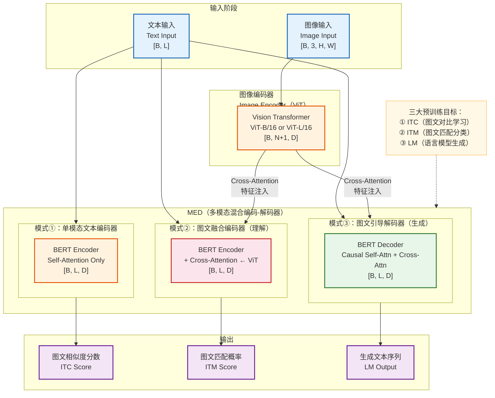
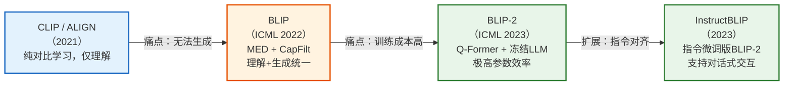
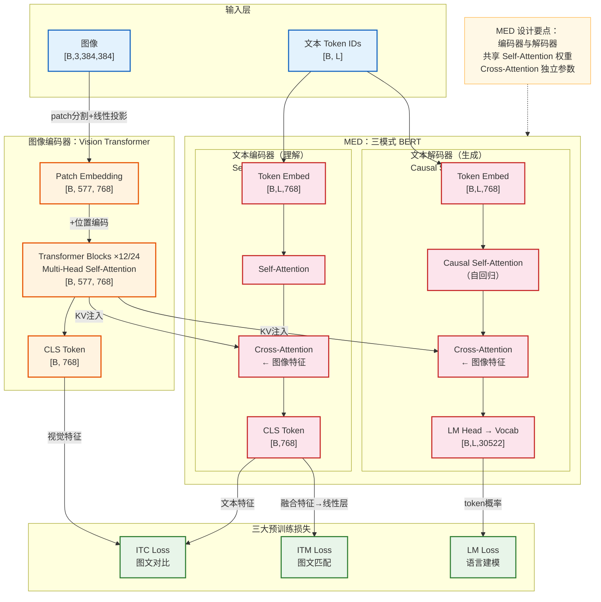
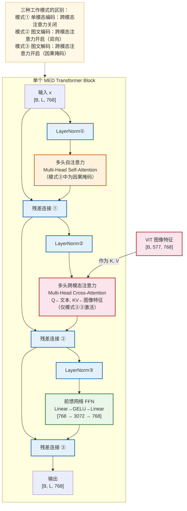
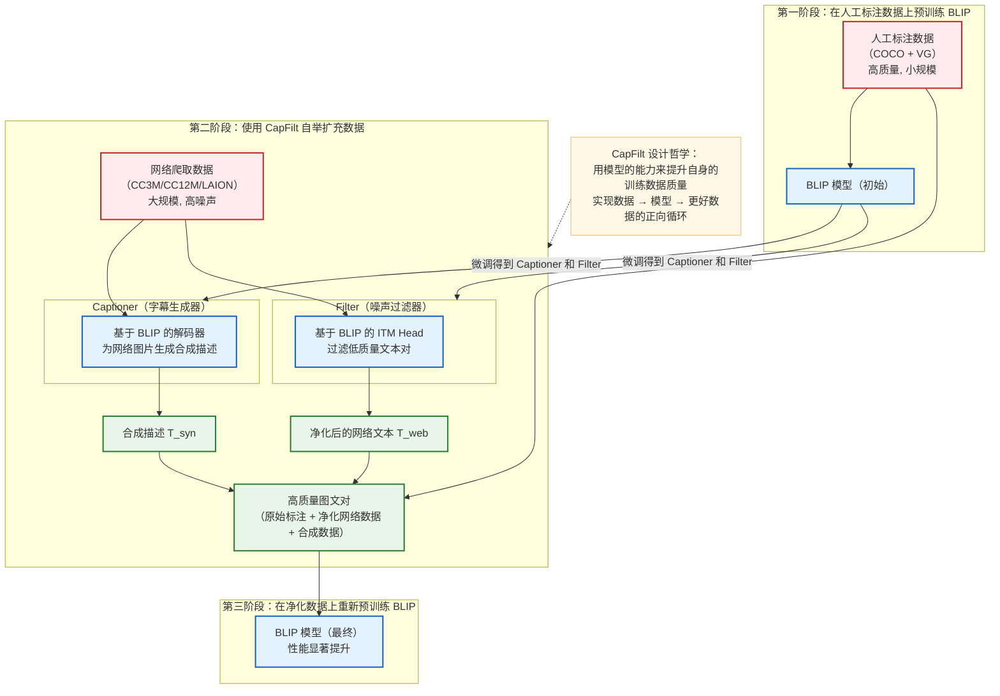
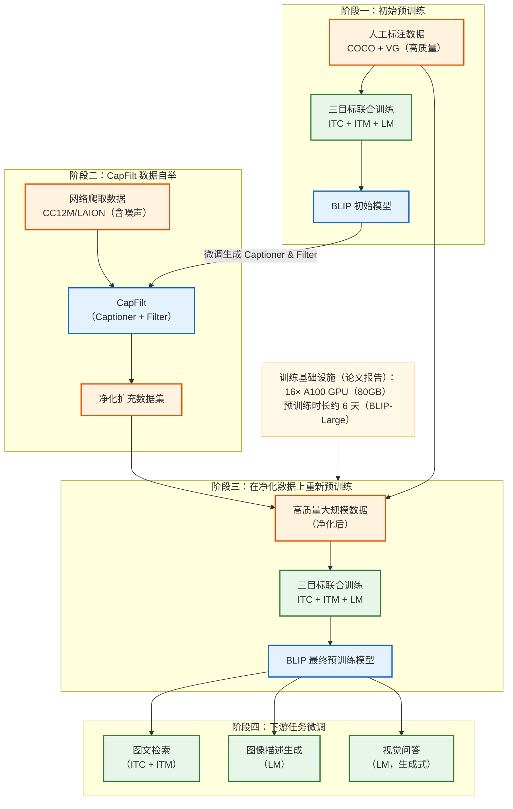
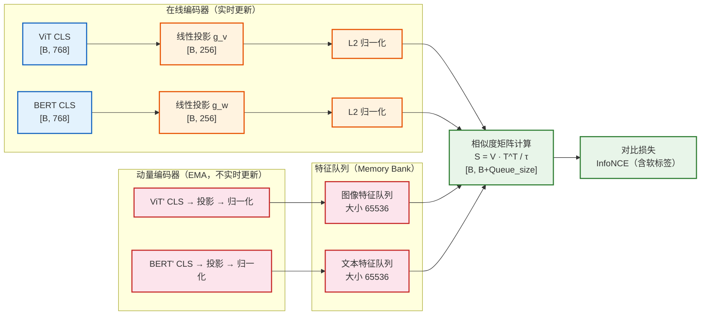
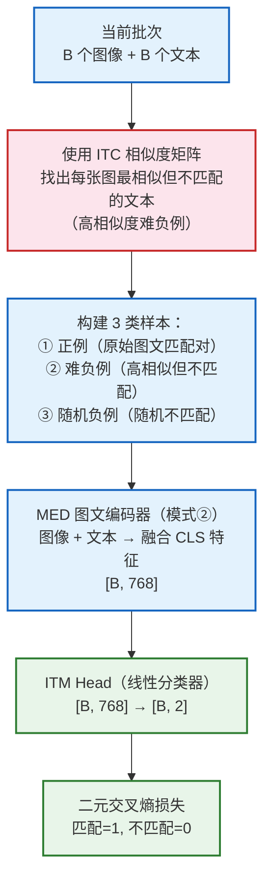

# BLIP 模型架构深度解析

> **论文**：BLIP: Bootstrapping Language-Image Pre-training for Unified Vision-Language Understanding and Generation
> **机构**：Salesforce Research
> **发表**：ICML 2022
> **作者**：Junnan Li, Dongxu Li, Caiming Xiong, Steven Hoi

---

## 目录

1. [模型架构概览](#一模型架构概览)
2. [模型架构详情](#二模型架构详情)
3. [关键组件深度拆解](#三关键组件深度拆解)
4. [面试常见问题 FAQ](#四面试常见问题-faq)

---

## 一、模型架构概览

### 1.1 模型定位

**BLIP**（Bootstrapping Language-Image Pre-training）是一个面向**视觉-语言预训练（VLP）**领域的统一多模态框架，由 Salesforce Research 于 2022 年提出。

| 维度 | 描述 |
|------|------|
| 研究领域 | 视觉-语言预训练（Vision-Language Pre-training） |
| 核心价值 | 用单一模型同时支持理解类和生成类多模态任务 |
| 典型应用 | 图文检索、图像描述生成、视觉问答（VQA）、视觉推理 |
| 关键差异点 | 首次引入 **CapFilt 数据自举机制**，从噪声网络数据中提炼高质量训练样本 |

**与同领域代表性模型的定位对比：**

| 模型 | 优势 | 局限 |
|------|------|------|
| CLIP | 强大的图文对齐，零样本迁移能力强 | 仅支持理解类任务，不能生成文本 |
| DALL-E / CoCa | 生成能力强 | 需要大量专有数据，架构较复杂 |
| **BLIP** | **理解 + 生成统一**，数据自举提升质量 | 计算成本较高，依赖较大规模预训练 |

---

### 1.2 核心思想与创新点

BLIP 的两大核心创新：

#### 创新一：MED（Multimodal mixture of Encoder-Decoder）

BLIP 设计了一种新颖的**多模态混合编码器-解码器**架构，通过共享权重，使单一模型能以三种模式工作：
- **单模态编码器**（Unimodal Encoder）：独立处理图像或文本
- **图像引导文本编码器**（Image-Grounded Text Encoder）：用于理解类任务（检索、VQA）
- **图像引导文本解码器**（Image-Grounded Text Decoder）：用于生成类任务（图像描述生成）

这解决了此前模型**要么只能做理解、要么只能做生成**的二元分离痛点。

#### 创新二：CapFilt（Captioner and Filter）数据自举

网络爬取的图文数据（如 LAION、CC）存在大量噪声标注。BLIP 提出 CapFilt 机制：
1. **Captioner（字幕生成器）**：为噪声图像自动生成高质量描述
2. **Filter（过滤器）**：剔除低质量的原始噪声文本和 Captioner 产生的错误描述

这一自举（Bootstrapping）机制显著提升了数据质量，以更少、更干净的数据实现更好效果。

---

### 1.3 整体架构概览



**学习范式**：自监督预训练 + 有监督微调（SSL Pre-training + Supervised Fine-tuning）

---

### 1.4 输入输出示例

**示例任务：图像问答（VQA）**

| 阶段 | 数据示例 |
|------|---------|
| **图像输入** | 一张狗在草地上奔跑的 RGB 图片，尺寸 `384×384×3` |
| **文本输入** | `"What is the dog doing?"` → tokenized 为 `[CLS, What, is, the, dog, doing, ?, SEP]` |
| **模型输出** | `"running on the grass"` → 自回归生成的词序列 |

**示例任务：图文检索（Image-Text Retrieval）**

| 阶段 | 数据示例 |
|------|---------|
| **图像输入** | 图片特征向量 `[B, 197, 768]`（197 = 196 个 patch + 1 个 CLS token） |
| **文本输入** | `"A dog runs across a green field"` → `[B, 12, 768]` |
| **模型输出** | 相似度得分 `0.92`（图文匹配度高），用于排序检索 |

---

### 1.5 关键模块一览

| 模块 | 职责 | 数据流向 |
|------|------|---------|
| **Image Encoder (ViT)** | 将图像切分为 Patch，提取视觉特征 | 图像 → 图像特征序列 |
| **Text Encoder (MED模式①②)** | 编码文本语义，支持跨模态注意力 | 文本 + 图像特征 → 融合表示 |
| **Text Decoder (MED模式③)** | 自回归生成文本序列 | 图像特征 → 文本描述 |
| **ITC Head** | 对比学习对齐图文表示空间 | 图文 CLS 特征 → 相似度矩阵 |
| **ITM Head** | 二分类判断图文是否匹配 | 融合特征 → 匹配概率 |
| **CapFilt（训练阶段）** | 自举生成和过滤高质量训练数据 | 噪声图文对 → 净化图文对 |

---

### 1.6 性能表现与评估概览

**图像描述生成（COCO Captioning, CIDEr 指标）：**

| 模型 | CIDEr | BLEU@4 |
|------|-------|--------|
| VinVL | 130.8 | 41.0 |
| BLIP-Base | 136.7 | 43.1 |
| **BLIP-Large** | **138.1** | **43.7** |

**视觉问答（VQA v2 Test-Dev）：**

| 模型 | VQA Score |
|------|-----------|
| SimVLM-Large | 77.87 |
| BLIP-Base | 77.54 |
| **BLIP-Large** | **78.25** |

**图文检索（COCO，Recall@1）：**

| 模型 | TR@1 | IR@1 |
|------|------|------|
| ALIGN | 77.0 | 59.9 |
| **BLIP-Large** | **82.4** | **65.1** |

**模型规模：**

| 变体 | Image Encoder | 参数量 |
|------|---------------|--------|
| BLIP-Base | ViT-B/16 | ~250M |
| BLIP-Large | ViT-L/16 | ~570M |

---

### 1.7 模型家族与演进脉络



---

## 二、模型架构详情

### 2.1 数据集构成与数据示例

#### 预训练数据集

| 数据集 | 规模 | 数据类型 | 来源 |
|--------|------|---------|------|
| COCO | 113K 图片，5 条/图描述 | 人工标注图文对 | MS-COCO 数据集 |
| Visual Genome | 100K 图片 | 人工标注区域描述 | VG 数据集 |
| CC3M | 3.3M | 网络爬取图文对（有噪声） | Google Conceptual Captions |
| CC12M | 12M | 网络爬取图文对（有噪声） | 扩展版 CC |
| LAION-115M | 115M | 大规模网络图文（含大量噪声） | LAION 开源数据集 |

> 注：网络爬取数据（CC3M/CC12M/LAION）存在大量噪声文本，这是 CapFilt 机制被提出的直接动因。

#### 微调数据集

| 下游任务 | 数据集 | 规模 |
|---------|--------|------|
| 图像描述生成 | COCO / NoCaps | 113K / 166K |
| 视觉问答 | VQA v2 | 1.1M 问答对 |
| 图文检索 | COCO / Flickr30K | 113K / 31K |
| 视觉推理 | NLVR2 | 86K 句子对 |

#### 数据样例（一条训练样本）

```
原始图像：一张 JPEG 图片（宽1024×高768，RGB 三通道）
原始标注文本："A golden retriever playing fetch on the beach"

→ 数据流阶段变化：

① 原始数据
   image: numpy array [768, 1024, 3], dtype=uint8
   text:  "A golden retriever playing fetch on the beach"

② 图像预处理后
   image: tensor [3, 384, 384], dtype=float32  # resize + normalize
   # 均值=[0.485,0.456,0.406], 标准差=[0.229,0.224,0.225]

③ ViT Patch Embedding 后
   image_features: tensor [1, 577, 768]  # [B, N_patches+1, D]
   # 577 = 24×24 patches + 1 CLS token（384/16=24）

④ 文本 Tokenize 后
   input_ids: [101, 1037, 3585, 28237, 2652, 7699, 2006, 1996, 3509, 102]
   # [CLS=101, ..., SEP=102], 长度 L=10
   attention_mask: [1, 1, 1, 1, 1, 1, 1, 1, 1, 1]

⑤ MED 融合编码后（模式②，用于 ITM）
   fused_feature: tensor [1, 10, 768]  # 文本侧经跨模态注意力后的特征

⑥ 模型输出
   ITM logit: tensor [1, 2]  → softmax → [0.04, 0.96]（匹配概率 96%）
```

---

### 2.2 数据处理与输入规范

#### 图像预处理

```python
# 训练阶段
transform_train = transforms.Compose([
    transforms.RandomResizedCrop(384, scale=(0.5, 1.0)),  # 随机裁剪
    transforms.RandomHorizontalFlip(),                      # 随机水平翻转
    transforms.ToTensor(),
    transforms.Normalize(mean=[0.485, 0.456, 0.406],
                         std=[0.229, 0.224, 0.225]),
])

# 推理阶段
transform_eval = transforms.Compose([
    transforms.Resize((384, 384)),   # 直接 resize，不裁剪
    transforms.ToTensor(),
    transforms.Normalize(...),
])
```

#### 文本预处理

- Tokenizer：使用 BERT 的 WordPiece tokenizer（词汇表 30522 词）
- 特殊 token：`[CLS]`（分类/对齐）、`[SEP]`（句子分隔）、`[ENC]`（编码模式标记）
- 最大长度：通常截断或填充至 `L=35`（描述生成）或 `L=512`（VQA）
- 对于 LM 训练：文本右移一位（teacher forcing），以 `[BOS]` 开头

---

### 2.3 架构全景与数据流



---

### 2.4 核心模块深入分析

#### 2.4.1 Image Encoder：Vision Transformer（ViT）

ViT 将图像切分为固定大小的 Patch（BLIP 使用 16×16），每个 Patch 通过线性投影映射为向量，并拼接一个可学习的 `[CLS]` token。


**关键设计：**
- BLIP 使用**带绝对位置编码**的标准 ViT，未采用相对位置编码
- 图像编码器参数在预训练中从 ImageNet-21k 预训练的 ViT 权重初始化
- CLS token 的输出作为全局图像表示，用于 ITC 对比学习

---

#### 2.4.2 MED：多模态混合编码器-解码器

MED 是 BLIP 最核心的设计。它在标准 BERT 架构基础上，在每个 Transformer Block 中插入**跨模态注意力层（Cross-Attention）**，并通过三种不同的前向传播模式处理不同任务。



**权重共享策略：**

| 层类型 | 编码器（模式①②）| 解码器（模式③）| 是否共享 |
|--------|--------------|--------------|---------|
| Self-Attention | ✅ | ✅（+因果掩码） | **共享** |
| Cross-Attention | 独立参数 | 独立参数 | **不共享** |
| FFN | ✅ | ✅ | **共享** |

共享 Self-Attention 权重的设计大幅减少了参数量，同时利用了理解与生成任务在底层语义表示上的共通性。

---

#### 2.4.3 CapFilt：数据自举机制



---

### 2.5 维度变换路径

以 BLIP-Base（ViT-B/16，BERT-Base）、输入图像 384×384、文本长度 L=10 为例：

| 阶段 | 操作 | 输出维度 | 说明 |
|------|------|---------|------|
| 原始图像 | — | `[B, 3, 384, 384]` | RGB 图像 |
| Patch Embedding | 16×16 切块 + 线性投影 | `[B, 576, 768]` | 576=24×24 |
| + CLS Token | 拼接可学习向量 | `[B, 577, 768]` | 头部插入 CLS |
| + Position Embedding | 可学习绝对位置编码 | `[B, 577, 768]` | 维度不变 |
| ViT Blocks ×12 | Multi-Head Self-Attention + FFN | `[B, 577, 768]` | 维度保持 |
| 图像 CLS 特征 | 取第 0 位 token | `[B, 768]` | 全局图像表示 |
| 图像 ITC 投影 | 线性层 | `[B, 256]` | 低维对比空间 |
| 文本 Embedding | Token Embed + 位置编码 | `[B, 10, 768]` | — |
| Self-Attention ×12 | Multi-Head Self-Attn | `[B, 10, 768]` | 维度不变 |
| Cross-Attention | Q=文本, KV=图像 | `[B, 10, 768]` | 图像信息注入 |
| 文本 CLS 特征（ITC）| 取第 0 位 token + 线性 | `[B, 256]` | 与图像对齐 |
| ITM Head | 线性层 | `[B, 2]` | 二分类 |
| LM Head | 线性层 | `[B, 10, 30522]` | 词汇表大小 |

---

### 2.6 数学表达与关键公式

#### ITC（图文对比学习）

受 CLIP 启发，ITC 将图像和文本映射到同一低维空间，最大化匹配对的相似度：

$$s(I, T) = \frac{g_v(v_{cls})^\top g_w(t_{cls})}{|g_v(v_{cls})| \cdot |g_w(t_{cls})|}$$

其中 \( g_v \)、\( g_w \) 为线性投影头，\( v_{cls} \)、\( t_{cls} \) 为各自的 CLS 特征。

对比损失（对称交叉熵）：

$$\mathcal{L}_{ITC} = -\frac{1}{2}\left[\log \frac{\exp(s_{ii}/\tau)}{\sum_j \exp(s_{ij}/\tau)} + \log \frac{\exp(s_{ii}/\tau)}{\sum_j \exp(s_{ji}/\tau)}\right]$$

其中 \( \tau \) 为可学习的温度参数，\( i \) 为第 \( i \) 个图文对。

> BLIP 在此基础上引入了**动量编码器（Momentum Encoder）**和**软标签队列**，避免假负样本问题（即同一批次中实际匹配但被判定为负例的情况）。

#### ITM（图文匹配分类）

$$\mathcal{L}_{ITM} = -\left[y \log p_{match} + (1-y) \log (1-p_{match})\right]$$

其中 \( y \in \{0, 1\} \) 为匹配标签，\( p_{match} \) 由 MED 编码器的 CLS 输出经线性层 + Softmax 计算。

**难负例挖掘（Hard Negative Mining）**：在同一批次中，利用 ITC 相似度分数，选取相似但不匹配的样本作为难负例，提升 ITM 训练效果：

$$p_{\text{hard-neg}}(T^-|I) \propto \exp(s(I, T^-)/\tau)$$

#### LM（语言模型生成）

$$\mathcal{L}_{LM} = -\sum_{t=1}^{L} \log P(y_t | y_{<t}, I)$$

模型以图像特征为条件，自回归生成每个 token，使用因果注意力掩码确保每步只能看到历史 token。

#### 总损失

$$\mathcal{L}_{total} = \mathcal{L}_{ITC} + \mathcal{L}_{ITM} + \mathcal{L}_{LM}$$

三个损失等权相加，共同优化。

---

### 2.7 损失函数与优化策略

| 损失项 | 作用 | 类型 |
|--------|------|------|
| \(\mathcal{L}_{ITC}\) | 拉近匹配图文对，推远不匹配对 | 对比损失（InfoNCE） |
| \(\mathcal{L}_{ITM}\) | 精细辨别图文对匹配性（难负例增强） | 二元交叉熵 |
| \(\mathcal{L}_{LM}\) | 使模型具备文本生成能力 | 负对数似然 |

**优化器配置：**

```
优化器：AdamW
学习率：1e-4（预训练），1e-5（微调）
权重衰减：0.05
学习率调度：带预热的余弦退火（Cosine Annealing with Warmup）
批次大小：512（预训练），128（微调）
梯度裁剪：最大梯度范数 1.0
```

---

### 2.8 训练流程与策略



**模型初始化：**
- Image Encoder：ViT 从 **ImageNet-21k** 预训练权重初始化
- Text Encoder/Decoder：从 **BERT-base** 预训练权重初始化
- Cross-Attention 层：随机初始化

---

### 2.9 推理与预测流程

#### 图像描述生成（Captioning）完整示例

```
1. 原始输入
   image: PIL Image (640×480, RGB)
   prompt: [BOS]  （仅输入 BOS token，触发自回归生成）

2. 图像预处理
   image → resize(384,384) → normalize → tensor [1, 3, 384, 384]

3. ViT 编码
   image_tensor → ViT → image_features [1, 577, 768]

4. 自回归生成（Beam Search, beam_size=5）
   step1: [BOS] → cross-attn(image_features) → P(next_token) → "A"
   step2: [BOS, A] → P(next_token) → "golden"
   step3: [BOS, A, golden] → P(next_token) → "retriever"
   ...
   stepN: [...] → P(next_token) → [EOS]（终止生成）

5. 后处理
   token_ids → decode → "A golden retriever playing on the beach"

6. 最终输出
   "A golden retriever playing on the beach"
```

#### 推理与训练的主要差异

| 差异点 | 训练阶段 | 推理阶段 |
|--------|---------|---------|
| 文本输入方式 | Teacher Forcing（给定真实 token） | 自回归生成（用预测 token 作为下一输入） |
| Dropout | 开启（正则化） | 关闭 |
| 批归一化 | 训练模式 | 评估模式 |
| ITM 负例 | 动态在线挖掘 | 不需要 |
| CapFilt | 参与 | 不参与 |

---

### 2.10 评估指标与实验分析

#### 图像描述生成（COCO Karpathy Split）

| 模型 | B@4 | METEOR | CIDEr | SPICE |
|------|-----|--------|-------|-------|
| VinVL | 41.0 | 31.1 | 130.8 | 23.4 |
| SimVLM | 40.6 | 33.7 | 143.3 | 25.4 |
| BLIP-Base | 43.1 | 33.5 | 136.7 | 24.4 |
| **BLIP-Large** | **43.7** | **34.1** | **138.1** | **24.9** |

#### 消融实验（论文 Table 5，COCO CIDEr）

| 配置 | CIDEr |
|------|-------|
| 仅 ITC | 118.2 |
| ITC + ITM | 124.6 |
| ITC + ITM + LM（完整 MED） | 133.3 |
| + CapFilt（完整 BLIP） | **136.7** |

**结论：**
- LM 目标对生成任务至关重要（+8.7 CIDEr）
- CapFilt 数据自举带来显著的额外提升（+3.4 CIDEr）

#### 效率指标（BLIP-Base）

| 指标 | 数值 |
|------|------|
| 总参数量 | ~250M |
| 图像编码器参数 | ~86M（ViT-B/16） |
| MED 参数 | ~164M（BERT-Base + Cross-Attn） |
| 推理速度（图像描述）| ~0.2s/张（V100 GPU） |

---

### 2.11 设计亮点与思考

**亮点①：MED 实现「一模型多能力」**

通过在同一架构内共享参数、切换工作模式，BLIP 避免了维护多个专用模型的复杂性，三种训练目标还形成了互补的监督信号（对比 + 分类 + 生成）。

**亮点②：CapFilt 体现了数据中心 AI 的精髓**

相比一味堆砌更大模型或更多数据，BLIP 的 CapFilt 机制展示了"更干净的数据"比"更多的数据"更有价值。这一思路在后来的 LLM 数据处理（如 Phi 系列模型的 textbook-quality 数据）中得到广泛应用。

**权衡与取舍：**

| 取舍维度 | BLIP 的选择 | 代价 |
|---------|-----------|------|
| 统一性 vs 专用性 | 选择统一架构（MED） | 单任务性能略逊于专用模型 |
| 数据质量 vs 数据规模 | 重视质量（CapFilt 过滤） | 可用数据量减少 |
| 理解 vs 生成 | 两者兼顾 | 架构较复杂，训练成本高 |

**局限性：**
- 预训练成本较高，难以在小规模资源下复现
- 图像编码器仍使用固定输入分辨率（384×384），对细粒度视觉信息有限
- 模型规模（~250M~570M）相比后来的大规模 VLP 模型（如 Flamingo 80B）仍偏小，开放域泛化能力有限

---

## 三、关键组件深度拆解

### 3.1 ITC（图文对比学习）模块

#### 组件定位

ITC 解决的核心问题：**如何让图像和文本特征在同一表示空间中对齐？**

它位于 BLIP 预训练的第一道对齐关卡，为后续的 ITM 和 LM 提供良好的初始特征空间。

#### 内部结构



**动量编码器更新规则：**

$$\theta'_v \leftarrow m \cdot \theta'_v + (1-m) \cdot \theta_v, \quad m = 0.995$$

动量编码器确保负例特征的一致性，避免直接从当前批次取负例导致的不稳定性。

#### 软标签策略

不同于原始 CLIP 使用 0/1 硬标签，BLIP 将动量编码器的输出相似度分布作为**软标签**，允许语义相似但非精确匹配的图文对贡献正向梯度：

$$y^{i2t}_j = \frac{\exp(s'_{ij}/\tau')}{\sum_k \exp(s'_{ik}/\tau')}, \quad \text{（动量编码器产生）}$$

#### 代码级参考

```python
# 核心 ITC 计算（简化版）
image_feat = F.normalize(self.vision_proj(image_embeds[:, 0, :]), dim=-1)  # [B, 256]
text_feat  = F.normalize(self.text_proj(text_embeds[:, 0, :]), dim=-1)    # [B, 256]

# 全局相似度矩阵（含队列中的历史样本）
sim_i2t = image_feat @ torch.cat([text_feat.T, self.text_queue.clone().detach()], dim=1) / self.temp
sim_t2i = text_feat  @ torch.cat([image_feat.T, self.image_queue.clone().detach()], dim=1) / self.temp

# 对称交叉熵损失（使用软标签）
loss_i2t = -torch.sum(F.softmax(sim_i2t_momentum, dim=1) * F.log_softmax(sim_i2t, dim=1), dim=1).mean()
loss_t2i = -torch.sum(F.softmax(sim_t2i_momentum, dim=1) * F.log_softmax(sim_t2i, dim=1), dim=1).mean()
loss_itc  = (loss_i2t + loss_t2i) / 2
```

---

### 3.2 ITM（图文匹配）模块

#### 组件定位

ITM 在 ITC 粗粒度对齐的基础上，提供**细粒度**的图文匹配判断。它强迫模型深入理解图文内容的语义关联，而非仅靠全局特征相似度判断。

#### 难负例挖掘机制



**为什么需要难负例？**

如果只用随机负例（随机配对的不相关图文），模型很容易区分，学不到精细的语义匹配能力。难负例（如「一只黑色的狗」vs「一只白色的猫在草地上」）迫使模型关注细节差异。

---

### 3.3 CapFilt 组件

#### 组件定位

CapFilt 不参与推理，只在预训练**数据准备阶段**发挥作用。它本质上是：
- **Captioner** = 微调后的 BLIP **解码器**（LM 模式）
- **Filter** = 微调后的 BLIP **编码器**（ITM 模式）

#### 变体与演进

| 版本 | CapFilt 策略 | 效果 |
|------|------------|------|
| BLIP | 单轮自举（一次过滤） | CIDEr +3.4（vs 无 CapFilt） |
| BLIP-2 | 改用 Q-Former，不再使用 CapFilt | 用更强的架构设计代替 |
| 后续工作 | 类似思路被 DataComp、Phi-1 等采纳 | 验证了数据质量优先的普适性 |

#### 关键实现细节

```python
# Captioner：为每张网络图片生成 10 条合成描述（nucleus sampling）
captions = model.generate(
    image=web_image,
    sample=True,
    top_p=0.9,
    num_captions=10,
    max_length=30
)

# Filter：计算每对 (image, text) 的 ITM 分数，阈值过滤
for text in [original_web_text] + captions:
    itm_score = model.compute_itm(image=web_image, text=text)
    if itm_score > 0.65:   # 阈值（论文设定）
        keep(web_image, text)
```

---

## 四、面试常见问题 FAQ

---

### Q1：BLIP 相比 CLIP，核心优势是什么？为什么不直接用 CLIP？

**A：** CLIP 是纯粹的**理解模型**（判断图文是否匹配），其架构天然不支持生成文本。而 BLIP 通过 MED 架构同时具备三种能力：

| 能力 | CLIP | BLIP |
|------|------|------|
| 图文特征对齐（检索） | ✅ | ✅ |
| 精细图文匹配判断 | ❌ | ✅（ITM） |
| 文本生成（描述/VQA） | ❌ | ✅（LM） |

此外，BLIP 通过 CapFilt 解决了网络数据噪声问题，而 CLIP 直接使用 4 亿嘈杂网络图文对。**选择 CLIP 还是 BLIP 取决于任务类型**：纯检索场景 CLIP 足够且轻量；需要文本生成的场景必须用 BLIP 或类似架构。

---

### Q2：MED 中 Self-Attention 权重为什么可以在编码器和解码器之间共享？

**A：** 核心原因有两点：

1. **语义基础相同**：无论是理解（编码）还是生成（解码），模型处理的底层语义单元（词的语义关系、句法结构）本质相同，Self-Attention 学到的词间关系具有通用性。

2. **区分靠掩码而非权重**：编码器使用**双向注意力**（每个 token 可看到所有位置），解码器使用**因果掩码注意力**（每个 token 只能看历史位置）。两者的行为差异由**注意力掩码矩阵**控制，而非权重本身。

而 **Cross-Attention 层不共享**，因为编码器和解码器在与图像特征交互时有本质差异：编码器需要双向理解图像语境，解码器需要顺序生成并在每步查询图像特征。

---

### Q3：CapFilt 中的 Filter 为什么能过滤噪声？它如何判断文本是否"噪声"？

**A：** Filter 使用的是 BLIP 的 **ITM（图文匹配）能力**。它为每对 `(image, text)` 计算一个 0~1 的匹配概率：
- 匹配概率 > 阈值（如 0.65）→ 保留（认为文本描述了图像内容）
- 匹配概率 ≤ 阈值 → 丢弃（认为文本与图像无关，是噪声）

**它能有效工作的原因**：Filter 在人工标注的高质量数据（COCO + VG）上微调过，学会了判断"什么样的文本真正描述了图像"。网络爬取数据中常见的噪声类型（SEO 关键词堆砌、无关广告文案、错误关联的图文）都会得到低 ITM 分数。

**潜在局限**：Filter 本身的性能上限受限于 BLIP 模型的 ITM 能力，存在假阳性（过滤掉实际正确的描述）和假阴性（保留了实际噪声）。

---

### Q4：BLIP 的三个预训练目标（ITC/ITM/LM）是否会相互冲突？如何协同？

**A：** 三个目标从不同角度监督模型，整体是**互补而非冲突**的关系：

| 目标 | 作用层次 | 监督信号 |
|------|---------|---------|
| ITC | 全局粗粒度对齐 | CLS 特征相似度 |
| ITM | 局部细粒度匹配 | 跨模态交互后的整体判断 |
| LM | 条件生成 | 给定图像生成文本 |

**协同机制**：ITC 对齐的特征空间为 ITM 提供了好的初始化，ITM 的精细匹配能力又为 LM 提供了更好的跨模态对齐基础。消融实验显示三者缺一不可（单独 ITC 的 CIDEr 只有 118，完整三目标达 133）。

**潜在冲突**：LM 是生成式目标，使用因果掩码，与 ITM 的双向注意力存在训练范式差异。BLIP 的解决方案是为解码器模式使用独立的 Cross-Attention 权重，并在每个批次中交替以不同模式前向传播。

---

### Q5：在实际部署中，如何用 BLIP 实现图文检索？推理流程是什么？

**A：** 图文检索分两阶段（Recall + Rerank）：

**阶段一：粗筛（基于 ITC，离线索引）**
```python
# 离线：预先编码数据库中所有图像
image_features = []
for image in database:
    feat = model.encode_image(image)   # [1, 256]，L2 归一化
    image_features.append(feat)
image_features = torch.stack(image_features)  # [N, 256]

# 在线：编码查询文本，计算余弦相似度
query_feat = model.encode_text(query_text)     # [1, 256]
sim_scores = query_feat @ image_features.T     # [1, N]
top_k_indices = sim_scores.topk(k=128).indices  # 取 top-128 候选
```

**阶段二：精排（基于 ITM）**
```python
# 对 top-128 候选做精细匹配
for idx in top_k_indices:
    itm_score = model.compute_itm(
        image=database[idx],
        text=query_text
    )  # [0~1] 匹配概率
# 按 ITM 分数重排，返回 top-k 结果
```

这种两阶段设计是效率与精度的平衡：ITC 快速（向量内积）但粗糙，ITM 精确但需要编码器前向传播（较慢）。

---

### Q6：BLIP 和 BLIP-2 的核心区别是什么？什么时候应该用 BLIP-2？

**A：** 核心区别在于**参数效率**和**是否冻结大模型**：

| 维度 | BLIP | BLIP-2 |
|------|------|--------|
| 图像编码器 | ViT，参与训练 | EVA-ViT-G，**冻结** |
| 语言模型 | BERT-scale MED | OPT/FlanT5 等大型 LLM，**冻结** |
| 桥接模块 | 无（直接 Cross-Attn） | **Q-Former**（轻量可训练桥接） |
| 可训练参数 | ~250M（全部） | ~188M（仅 Q-Former） |
| 零样本 VQA | 较弱 | 显著更强（受益于 LLM 知识） |

**选用建议：**
- 资源有限、需要快速微调特定下游任务 → **BLIP**
- 需要零样本/少样本能力、需要与 LLM 集成、追求极致参数效率 → **BLIP-2**
- 需要对话式图像理解（如 LLaVA 风格）→ **InstructBLIP（BLIP-2 + 指令微调）**

---

### Q7：如何将 BLIP 用于自定义数据集的视觉问答任务？微调时需要注意什么？

**A：**

**微调步骤：**

```python
from transformers import BlipForQuestionAnswering, BlipProcessor

# 加载预训练模型
processor = BlipProcessor.from_pretrained("Salesforce/blip-vqa-base")
model = BlipForQuestionAnswering.from_pretrained("Salesforce/blip-vqa-base")

# 数据格式
inputs = processor(
    images=pil_image,
    text=question,      # "What color is the car?"
    return_tensors="pt"
)
labels = processor(text=answer, return_tensors="pt").input_ids  # "red"

# 微调（生成式 VQA，开放式答案）
outputs = model(**inputs, labels=labels)
loss = outputs.loss
loss.backward()
```

**关键注意事项：**

1. **任务格式选择**：BLIP 的 VQA 是**生成式**（自回归输出答案文本），不同于 ViLBERT 等的分类式 VQA（从固定答案集选择）。生成式更灵活但对短答案可能过于复杂。

2. **学习率**：图像编码器使用较小学习率（1e-5），文本模块可使用稍大学习率（3e-5），避免破坏预训练特征。

3. **输入分辨率**：默认 384×384，若改变分辨率需重新插值位置编码。

4. **答案长度控制**：生成时设置 `max_length` 避免冗余输出，VQA 通常设置 10~20 token。

5. **数据量要求**：BLIP 预训练权重质量高，即使只有几千条自定义数据也能取得不错效果。

---

### Q8：BLIP 中的动量编码器（Momentum Encoder）具体解决了什么问题？可以去掉吗？

**A：** 动量编码器源自 MoCo 的设计，在 BLIP 中解决了 ITC 对比学习中的**假负样本**和**特征不一致**问题：

**问题①：批次内假负样本**

在同一批次中，图片 A 的某条文本 B' 可能实际上也描述了图片 A（语义相近但非标注匹配对），但 InfoNCE 会将其作为负例惩罚。动量编码器产生的软标签允许这种情况贡献部分正向梯度。

**问题②：特征队列一致性**

大批次对比学习需要大量负例。若直接使用历史批次的在线编码器特征（参数在不断更新），会导致队列中不同位置的特征来自不同参数状态的模型，特征不一致。动量编码器参数更新缓慢（EMA），队列中特征来自近似一致的模型，稳定性更好。

**能否去掉？** 技术上可以，但效果会下降。简化版实现（如直接使用批内负例）在小批量时效果明显变差。若 GPU 内存充足、批量极大（如 TPU 训练），动量编码器的收益会降低。

---

### Q9：BLIP 在处理细粒度视觉理解（如精确计数、文字识别）时表现如何？局限是什么？

**A：** BLIP 在细粒度任务上存在明显局限：

| 细粒度任务 | BLIP 表现 | 原因 |
|-----------|----------|------|
| 精确计数（"图中有几只鸟？"） | 较差 | ViT Patch 粒度较粗，细节信息损失 |
| OCR / 文字识别 | 很差 | 预训练数据缺乏文字-语义配对；图像分辨率 384×384 对小文字不够清晰 |
| 精确空间关系（"左边的 vs 右边的"）| 一般 | 位置编码是全局的，不擅长相对空间推理 |
| 属性绑定（"红色的球 vs 蓝色的球"）| 一般 | 跨模态注意力可能混淆多实体属性 |

**根本原因**：ViT 将图像切为固定大小的 Patch，对细粒度视觉信息（小物体、文字、精确数量）的建模能力有限。后续的 LLaVA-HD、InternVL 等通过**高分辨率图像切片**策略改善了这一问题。

---

### Q10：实际工程中，如何评估 BLIP 生成的图像描述的质量？BLEU/CIDEr 够用吗？

**A：** 自动评估指标和人工评估各有优劣：

**自动指标的局限：**

| 指标 | 优点 | 局限 |
|------|------|------|
| BLEU | 计算简单，与人工评估有一定相关性 | 过于依赖 n-gram 匹配，忽略语义 |
| CIDEr | 考虑 TF-IDF 权重，更关注信息量 | 依赖参考描述，数量不足时不稳定 |
| METEOR | 考虑词形变化和同义词 | 计算较慢 |
| SPICE | 基于场景图语义 | 计算昂贵 |

**实际工程建议：**

1. **训练/验证阶段**：使用 CIDEr 作为主要指标（与人工评分相关性最高）
2. **上线前**：必须进行**人工评估**，重点检查：
   - 幻觉（Hallucination）：描述了图中不存在的物体
   - 事实错误（Factual Error）：颜色、数量、关系错误
   - 流利度（Fluency）：语法是否自然
3. **生产环境监控**：可用基于 LLM 的自动评估（如 GPT-4V 打分）作为补充

**简洁结论**：BLEU/CIDEr 用于开发阶段快速迭代是足够的，但**不能**作为上线质量的唯一判断标准，人工评估不可缺少。

---

*文档撰写参考：BLIP 原始论文（Li et al., 2022）、Salesforce Research 官方代码库（[github.com/salesforce/BLIP](https://github.com/salesforce/BLIP)）、HuggingFace Transformers BLIP 文档*
