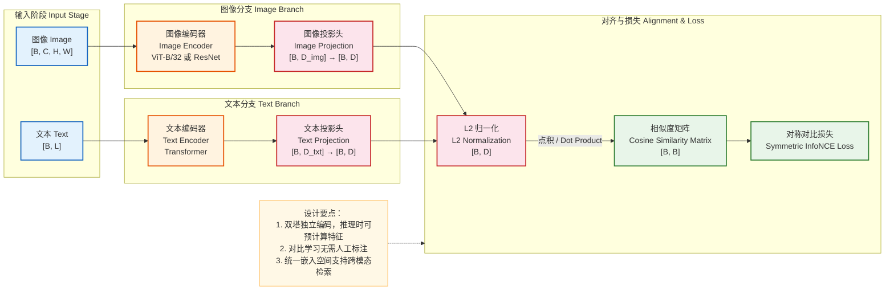
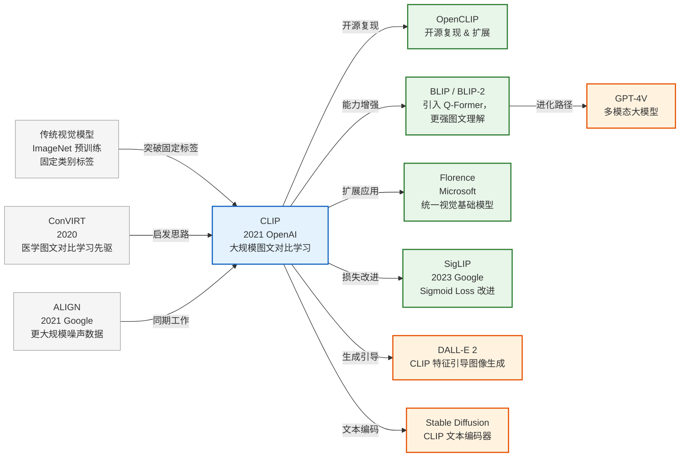
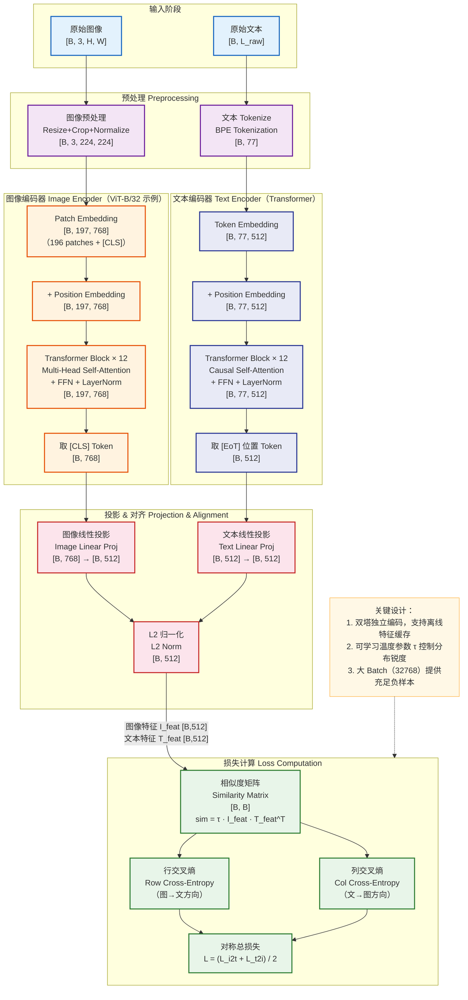
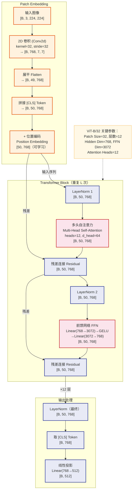
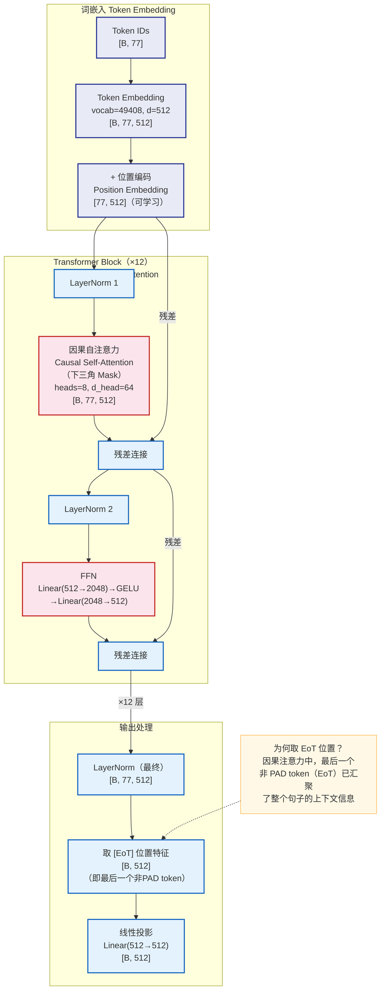
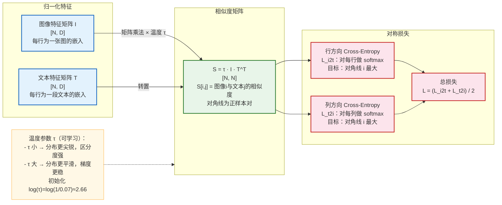
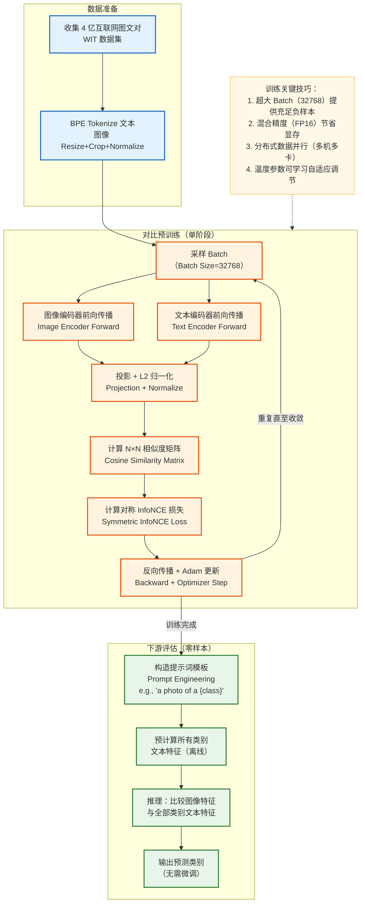
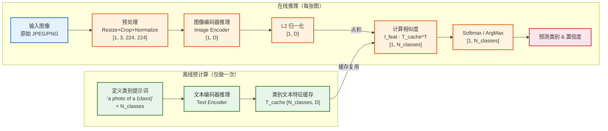
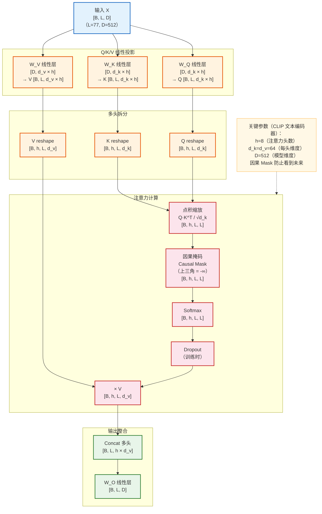
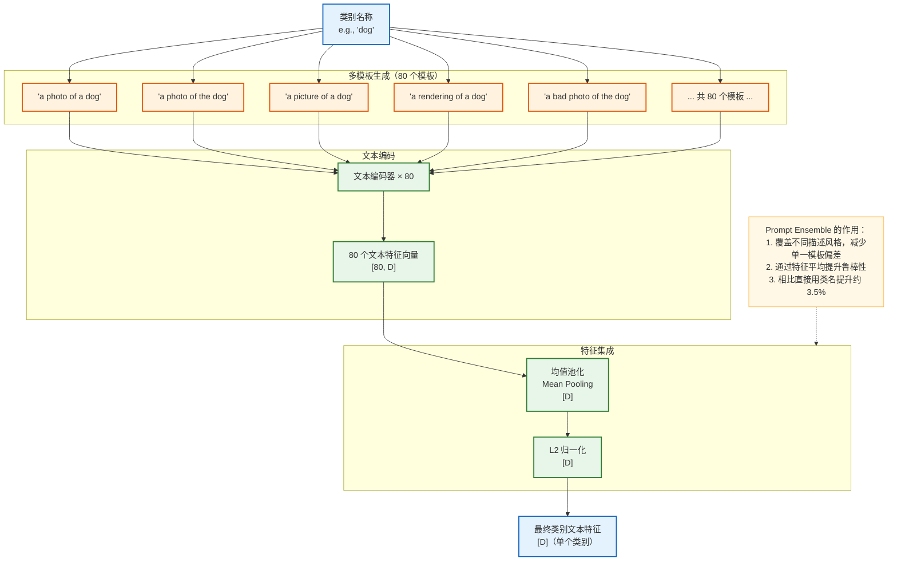

# CLIP 模型架构深度解析

> **论文**：Learning Transferable Visual Models From Natural Language Supervision
> **作者**：Alec Radford 等（OpenAI）
> **发布时间**：2021 年 1 月
> **论文链接**：https://arxiv.org/abs/2103.00020

---

## 一、模型架构概览

### 1. 模型定位

**CLIP（Contrastive Language-Image Pre-Training）** 是 OpenAI 于 2021 年提出的多模态视觉-语言预训练模型。它属于 **跨模态表征学习** 领域，核心目标是通过海量图文对数据，在一个统一的嵌入空间中对齐图像和文本的语义表示。

| 维度 | 说明 |
|------|------|
| 研究领域 | 多模态学习、视觉-语言预训练、零样本迁移 |
| 核心价值 | 无需任务标注数据，利用自然语言监督训练视觉模型，实现强大的零样本泛化能力 |
| 典型应用 | 零样本图像分类、图文检索、图像描述生成、视觉问答（VQA）、AI 生成内容（AIGC）引导 |

**与同领域代表性模型对比：**

| 模型 | 特点 | 与 CLIP 的差异 |
|------|------|--------------|
| ImageNet 预训练 ResNet/ViT | 依赖大量人工标注的固定类别标签 | CLIP 用自然语言替代固定标签，泛化性更强 |
| ViLBERT / UNITER | 融合视觉-语言用于下游理解任务 | CLIP 专注对比学习的双塔结构，推理效率更高 |
| ALIGN（Google） | 同期类似工作，使用更大规模噪声数据 | CLIP 数据清洗更严格，平衡了规模与质量 |
| DALL-E | 生成式多模态模型 | CLIP 是判别式模型，专注特征对齐而非生成 |

---

### 2. 核心思想与创新点

**最关键的设计思路：用自然语言作为监督信号，通过对比学习对齐图像与文本嵌入。**

```
核心公式思路：
给定一个 Batch 中的 N 对 (图像, 文本) 样本，
CLIP 训练图像编码器和文本编码器，使得：
  - 配对的 (图像_i, 文本_i) 相似度 → 最大化
  - 非配对的 (图像_i, 文本_j, i≠j) 相似度 → 最小化
```

**相比前序工作解决的痛点：**

1. **打破固定标签瓶颈**：传统图像分类依赖手工标注的离散标签（如 ImageNet 的 1000 类），泛化能力受限于训练类别。CLIP 直接将类别映射为自然语言描述，理论上支持无限类别。
2. **数据效率突破**：传统有监督学习需要昂贵的人工标注，CLIP 直接利用互联网上天然配对的图文数据（4 亿对），极大降低了数据采集成本。
3. **零样本迁移能力**：CLIP 在完全没有下游任务训练样本的情况下，通过 "提示词工程（Prompt Engineering）" 即可完成分类，在多项基准上超越有监督基线。

---

### 3. 整体架构概览

CLIP 采用 **双塔（Dual-Encoder）** 架构，两个独立编码器分别处理图像和文本，通过对比损失在同一嵌入空间中对齐。



**学习范式**：自监督对比学习（Self-Supervised Contrastive Learning）

---

### 4. 输入输出示例

**输入示例（零样本图像分类任务）：**

```
图像输入：
  - 一张猫的 JPEG 图片，尺寸 640×480，RGB 格式
  - 预处理后变为 Tensor [1, 3, 224, 224]

文本输入（候选类别描述）：
  - "a photo of a cat"
  - "a photo of a dog"
  - "a photo of a bird"
  共 N 条文本，Tokenize 后为 [N, 77]（77 为最大序列长度）
```

**输出示例：**

```
图像嵌入：[1, 512]  ← 归一化后的图像特征向量
文本嵌入：[N, 512]  ← 归一化后的文本特征矩阵

相似度分数：[1, N] = [0.87, 0.06, 0.07]
                       猫    狗    鸟

预测结果：第 0 类（a photo of a cat），置信度 87%
```

**直观理解**：CLIP 接收一张图片和一组文字描述，计算图片与每条文字的语义相似度，相似度最高的文字即为预测类别——无需任何微调，纯粹靠预训练知识完成分类。

---

### 5. 关键模块一览

| 模块 | 职责 | 主要实现 |
|------|------|---------|
| **图像编码器** | 将输入图片转换为高维特征向量 | ViT-B/32、ViT-L/14、ResNet-50/101/50×4/50×16/50×64 |
| **文本编码器** | 将输入文本转换为高维特征向量 | 类 GPT-2 的 Transformer，最大序列长度 77 |
| **投影头** | 将各自编码器输出投影到统一维度的共享嵌入空间 | 线性层（Linear Projection） |
| **L2 归一化** | 将特征向量归一化到单位超球面，余弦相似度等价于点积 | L2-Norm |
| **相似度矩阵** | 计算 Batch 内所有图文对的两两余弦相似度，构成 N×N 矩阵 | 缩放点积（含可学习温度参数） |
| **对比损失** | 对称 InfoNCE 损失，同时对行（图→文）和列（文→图）做交叉熵 | Symmetric Cross-Entropy |

**模块数据流**：`图像/文本 → 各自编码器 → 投影头 → L2 归一化 → 相似度矩阵 → 对比损失`

---

### 6. 性能表现与评估概览

**主要评估指标**：

| 指标 | 含义 |
|------|------|
| Zero-Shot Top-1 Accuracy | 零样本分类的 Top-1 准确率（无任何微调） |
| Linear Probe Accuracy | 冻结 CLIP 特征后仅训练线性分类头的准确率 |
| R@K（Recall at K） | 图文检索中前 K 个结果的召回率 |

**ImageNet 零样本分类关键结果：**

| 模型 | ImageNet Top-1 | 参数量 |
|------|---------------|-------|
| ResNet-50（有监督） | 76.2% | 25M |
| **CLIP ViT-B/32（零样本）** | **63.2%** | **151M** |
| **CLIP ViT-L/14（零样本）** | **75.5%** | **427M** |
| CLIP ViT-L/14@336px（零样本） | 76.2% | 427M |

> CLIP 零样本性能接近/超越 ResNet-50 有监督训练，跨越了"零样本 vs 有监督"的传统鸿沟。

**训练规模**：
- 训练数据：4 亿图文对（WIT，WebImageText，内部数据集）
- 训练时长：最大模型（ViT-L/14@336px）在 592 块 V100 GPU 上训练约 2 周

---

### 7. 模型家族与演进脉络



**CLIP 变体版本对比：**

| 版本 | 图像编码器 | 图像嵌入维度 | 文本嵌入维度 | 参数量 |
|------|-----------|------------|------------|-------|
| CLIP-RN50 | ResNet-50 | 1024 | 512 | ~102M |
| CLIP-ViT-B/32 | ViT-B（Patch=32） | 512 | 512 | ~151M |
| CLIP-ViT-B/16 | ViT-B（Patch=16） | 512 | 512 | ~150M |
| CLIP-ViT-L/14 | ViT-L（Patch=14） | 768 | 768 | ~427M |
| CLIP-ViT-L/14@336 | ViT-L（输入336×336） | 768 | 768 | ~427M |

---

## 二、模型架构详情

### 1. 数据集构成与数据示例

#### 数据集：WIT（WebImageText）

| 属性 | 说明 |
|------|------|
| 名称 | WIT（WebImageText），OpenAI 内部数据集 |
| 规模 | ~4 亿（400M）图文对 |
| 数据类型 | 互联网图片 + 配对的 ALT-text、标题、描述等文本 |
| 标注方式 | 无人工标注，利用图片的天然文字描述作为弱监督信号 |
| 来源 | 互联网网页（类似 Common Crawl），经过质量过滤 |

**数据构建流程：**

1. 定义 50 万个查询词（涵盖 WikiPedia 高频词汇 + 已有视觉数据集的类别名称）
2. 通过搜索引擎查询，收集与每个查询词相关的图文对，每个查询词最多保留 2 万条
3. 过滤低质量数据（过短文本、无效图片等），最终得到约 4 亿对

**数据划分：**

| 集合 | 用途 |
|------|------|
| 训练集 | 约 4 亿图文对，用于对比预训练 |
| 验证/测试 | 使用各下游公开基准（ImageNet、MS-COCO 等），不做专门验证集 |

**典型训练数据样例：**

```
原始图片：  [互联网图片] 一张金毛猎犬在草地上奔跑的照片（640×480，JPEG）
原始文本：  "Golden retriever running in the park on a sunny day"

↓ 数据处理后 ↓

图像输入：  Tensor [3, 224, 224]，值域 [-1, 1]（归一化后）
文本输入：  [49406, 2751, 11624, 2734, 530, 518, 3226, 588, 320, 4902, 1110, 49407, 0, ..., 0]
            <|startoftext|> Golden retriever ... day <|endoftext|> [PAD, ..., PAD]
            Token 序列，长度固定为 77
```

**数据在关键处理阶段的形态变化：**

```
原始图片 (640×480, JPEG)
  ↓ Resize + CenterCrop
调整后图片 (224×224, RGB)
  ↓ ToTensor + Normalize (mean=[0.481, 0.457, 0.408], std=[0.268, 0.261, 0.275])
图像 Tensor [3, 224, 224], 值域 ≈ [-2, 2]
  ↓ ViT Patch Embedding
Patch 序列 [196+1, 768] （196 个 patch + 1 个 [CLS] token）
  ↓ 12 层 Transformer Block
上下文特征 [197, 768]
  ↓ 取 [CLS] token + Linear Projection
图像嵌入 [512], L2 归一化后 ‖v‖ = 1
```

---

### 2. 数据处理与输入规范

#### 图像预处理流程

```python
# CLIP 官方图像预处理（以 ViT-B/32 为例）
transform = Compose([
    Resize(224, interpolation=BICUBIC),   # 短边缩放到 224
    CenterCrop(224),                       # 中心裁剪 224×224
    ToTensor(),                            # [H,W,C] → [C,H,W], 值域 [0,1]
    Normalize(                             # 基于 CLIP 训练数据统计
        mean=(0.48145466, 0.4578275, 0.40821073),
        std=(0.26862954, 0.26130258, 0.27577711)
    )
])
```

**训练时增强**：训练阶段使用 RandomResizedCrop（从随机缩放和裁剪），推理时使用 CenterCrop。

#### 文本预处理流程

```python
# Tokenization（BPE，类 GPT-2 词表）
tokens = clip.tokenize(["a photo of a cat"])
# 输出：[49406, 320, 1125, 539, 320, 2368, 49407, 0, ..., 0]
#        <SoT>   a   photo  of   a    cat   <EoT>  PAD ... PAD
# 形状：[1, 77]  （固定长度 77，不足补 PAD，超出截断）
```

| 参数 | 值 |
|------|---|
| 词表大小 | 49,408（BPE 子词） |
| 最大序列长度 | 77 tokens |
| 特殊 token | `<|startoftext|>` (49406)，`<|endoftext|>` (49407) |
| 超长处理 | 截断到 77 个 token |

**批处理策略**：
- 训练 Batch Size：32,768（分布式大 Batch，对比学习的关键超参数）
- 大 Batch 确保每个样本有足够多的负样本用于对比，提升训练信号质量

---

### 3. 架构全景与数据流



---

### 4. 核心模块深入分析

#### 4.1 图像编码器（以 ViT-B/32 为例）

ViT（Vision Transformer）将图像切分为固定大小的 Patch，展平后作为序列输入 Transformer。



> **注意**：CLIP 中 ViT 的 LayerNorm 位于注意力层**前**（Pre-Norm），与原始 ViT 论文（Post-Norm）不同，训练更稳定。

#### 4.2 文本编码器

CLIP 文本编码器基于 GPT-2 风格的 Transformer，使用**因果自注意力（Causal Self-Attention）**，但目的是提取特征而非自回归生成。



#### 4.3 对比学习机制（InfoNCE Loss）

这是 CLIP 最核心的训练机制，通过构造 N×N 相似度矩阵进行对比学习。



---

### 5. 维度变换路径

以 **CLIP ViT-B/32** 为例，完整追踪图像分支的维度变化：

| 步骤 | 操作 | 输入维度 | 输出维度 | 说明 |
|------|------|---------|---------|------|
| 0 | 原始图像 | [B, 3, H, W] | [B, 3, H, W] | 任意尺寸输入 |
| 1 | Resize + Crop | [B, 3, H, W] | [B, 3, 224, 224] | 统一输入尺寸 |
| 2 | Conv2d (Patch Embed) | [B, 3, 224, 224] | [B, 768, 7, 7] | kernel=stride=32，7=224/32 |
| 3 | Flatten | [B, 768, 7, 7] | [B, 49, 768] | 7×7=49 个 patch |
| 4 | 拼接 [CLS] | [B, 49, 768] | [B, 50, 768] | 前置全局语义 token |
| 5 | + 位置编码 | [B, 50, 768] | [B, 50, 768] | 可学习绝对位置编码 |
| 6 | × 12 Transformer Block | [B, 50, 768] | [B, 50, 768] | 特征交互，维度不变 |
| 7 | 取 [CLS] Token | [B, 50, 768] | [B, 768] | 全局语义聚合 |
| 8 | Linear Projection | [B, 768] | [B, 512] | 投影到共享嵌入空间 |
| 9 | L2 归一化 | [B, 512] | [B, 512] | ‖v‖₂ = 1，单位超球面 |

文本分支维度变化：

| 步骤 | 操作 | 输入维度 | 输出维度 |
|------|------|---------|---------|
| 0 | 原始文本 | 字符串 | — |
| 1 | BPE Tokenize | — | [B, 77]（整数 token ids） |
| 2 | Token Embedding | [B, 77] | [B, 77, 512] |
| 3 | + 位置编码 | [B, 77, 512] | [B, 77, 512] |
| 4 | × 12 Transformer Block | [B, 77, 512] | [B, 77, 512] |
| 5 | 取 [EoT] Token | [B, 77, 512] | [B, 512] |
| 6 | Linear Projection | [B, 512] | [B, 512] |
| 7 | L2 归一化 | [B, 512] | [B, 512] |

---

### 6. 数学表达与关键公式

#### 6.1 注意力计算

多头自注意力（Multi-Head Self-Attention）的核心计算：

$$\text{Attention}(Q, K, V) = \text{softmax}\left(\frac{QK^T}{\sqrt{d_k}}\right) V$$

其中：
- $Q = XW_Q \in \mathbb{R}^{N \times d_k}$：查询矩阵
- $K = XW_K \in \mathbb{R}^{N \times d_k}$：键矩阵
- $V = XW_V \in \mathbb{R}^{N \times d_v}$：值矩阵
- $d_k$：每个注意力头的维度（ViT-B 中为 64）
- $\sqrt{d_k}$：缩放因子，防止点积过大导致 softmax 梯度消失

多头注意力将 $h$ 个注意力头的输出拼接：

$$\text{MultiHead}(Q,K,V) = \text{Concat}(\text{head}_1, ..., \text{head}_h) W_O$$

#### 6.2 对比损失（InfoNCE / NT-Xent）

设 Batch 中有 $N$ 对图文对，图像特征 $\mathbf{I} \in \mathbb{R}^{N \times D}$，文本特征 $\mathbf{T} \in \mathbb{R}^{N \times D}$，均已 L2 归一化，$\tau$ 为可学习温度参数：

**相似度矩阵：**

$$S_{ij} = \tau \cdot \mathbf{I}_i \cdot \mathbf{T}_j^T, \quad S \in \mathbb{R}^{N \times N}$$

**图像到文本方向损失（行方向）：**

$$\mathcal{L}_{i \to t} = -\frac{1}{N} \sum_{i=1}^{N} \log \frac{\exp(S_{ii})}{\sum_{j=1}^{N} \exp(S_{ij})}$$

**文本到图像方向损失（列方向）：**

$$\mathcal{L}_{t \to i} = -\frac{1}{N} \sum_{i=1}^{N} \log \frac{\exp(S_{ii})}{\sum_{j=1}^{N} \exp(S_{ji})}$$

**对称总损失：**

$$\mathcal{L}_{CLIP} = \frac{\mathcal{L}_{i \to t} + \mathcal{L}_{t \to i}}{2}$$

#### 6.3 零样本推理

给定图像 $\mathbf{x}$ 和 $C$ 个类别的提示词文本 $\{t_1, t_2, ..., t_C\}$：

$$P(\text{class} = c | \mathbf{x}) = \frac{\exp(\cos(\mathbf{I}(\mathbf{x}), \mathbf{T}(t_c)) / \tau)}{\sum_{j=1}^{C} \exp(\cos(\mathbf{I}(\mathbf{x}), \mathbf{T}(t_j)) / \tau)}$$

---

### 7. 损失函数与优化策略

#### 损失函数设计

| 损失项 | 作用 | 权重 |
|--------|------|------|
| $\mathcal{L}_{i \to t}$（图→文） | 使每张图的嵌入与对应文本最近 | 0.5 |
| $\mathcal{L}_{t \to i}$（文→图） | 使每段文本的嵌入与对应图像最近 | 0.5 |
| 总损失 $\mathcal{L}_{CLIP}$ | 对称约束，同时优化两个方向 | — |

**温度参数 $\tau$ 的作用**：

- $\tau$ 是可学习的标量参数，初始化为 $\exp(\log(1/0.07)) \approx 14.3$
- 论文中对 $\log \tau$ 设置了上界 $\log(100)$，防止训练不稳定
- $\tau$ 越小，对比损失越"硬"，强迫特征之间有更清晰的边界

#### 优化器配置

| 参数 | 值 |
|------|---|
| 优化器 | Adam（$\beta_1=0.9$，$\beta_2=0.98$，$\epsilon=10^{-6}$） |
| 学习率调度 | Cosine Annealing（余弦退火），无 Warmup Restart |
| Warmup 步数 | 2000 步线性 Warmup |
| 权重衰减 | 0.2 |
| 梯度裁剪 | Gradient Clipping（norm=1.0） |
| 精度 | 混合精度训练（FP16） |

---

### 8. 训练流程与策略

**学习范式**：自监督对比学习（Self-Supervised Contrastive Learning）

CLIP 学习的目标是：**给定海量互联网图文对，学习一个通用的跨模态语义对齐函数**，使得语义相关的图文对在嵌入空间中相互靠近。



**训练基础设施：**

| 模型版本 | GPU 数量 | GPU 型号 | 训练时长 |
|---------|---------|---------|---------|
| ResNet-50 | 256 | V100 32GB | ~18 天 |
| ViT-B/32 | 256 | V100 32GB | ~18 天 |
| ViT-L/14@336 | 592 | V100 32GB | ~2 周（推测） |

**关键超参数影响分析：**

| 超参数 | 典型值 | 影响 |
|--------|-------|------|
| Batch Size | 32,768 | 最关键！更大 Batch → 更多负样本 → 更强对比信号 |
| 温度 $\tau$ | 可学习（初始≈0.07） | 控制嵌入空间的聚合紧密程度 |
| 嵌入维度 D | 512 / 768 | 影响特征容量和推理速度 |
| Transformer 层数 | 12 | 特征提取深度，更深→更强表征 |

---

### 9. 推理与预测流程

#### 零样本图像分类推理流程



**完整预测示例：**

```
输入：一张柴犬图片（shiba_inu.jpg）

类别列表（使用提示词模板 "a photo of a {}"）：
  - "a photo of a cat"
  - "a photo of a dog"
  - "a photo of a shiba inu"
  - "a photo of a golden retriever"

Step 1：图像预处理
  shiba_inu.jpg (800×600) → Resize → CenterCrop → Normalize
  → Tensor [1, 3, 224, 224]

Step 2：图像编码
  [1, 3, 224, 224] → ViT-B/32 → [1, 768] → Linear Proj → [1, 512]
  → L2 Norm → image_feat [1, 512]

Step 3：文本编码（离线缓存）
  4 条文本 → Tokenize → Transformer → Proj → L2 Norm
  → text_feats [4, 512]

Step 4：相似度计算
  scores = image_feat @ text_feats.T × τ
  → [0.12, 0.31, 0.89, 0.18]

Step 5：Softmax → 概率
  → [0.04, 0.10, 0.78, 0.08]

最终输出：类别 "shiba inu"，置信度 78%  ✓
```

**推理与训练阶段差异：**

| 方面 | 训练阶段 | 推理阶段 |
|------|---------|---------|
| Dropout | 开启 | 关闭 |
| BatchNorm | 训练模式 | 评估模式（固定均值/方差） |
| 图像增强 | RandomResizedCrop | CenterCrop |
| 文本编码 | 每步重新计算 | 可预缓存（提效关键） |
| Batch Size | 32768（对比训练） | 1 或更小（按需） |

---

### 10. 评估指标与实验分析

#### 主要评估指标

| 指标 | 说明 | 使用场景 |
|------|------|---------|
| **Zero-Shot Top-1** | 零样本分类准确率（无微调） | 图像分类基准 |
| **Zero-Shot Top-5** | 前 5 个预测中正确的比例 | 图像分类基准 |
| **Linear Probe** | 固定特征+线性分类头的准确率 | 评估特征质量 |
| **R@1/5/10** | 图文检索 Recall@K | MS-COCO / Flickr30k |

#### 零样本分类性能（27 个数据集）

| 数据集 | CLIP ViT-B/32 | CLIP ViT-L/14 | 有监督 SOTA |
|--------|-------------|-------------|-----------|
| ImageNet | 63.4% | 75.5% | 88.4%（BiT-L） |
| CIFAR-10 | 90.8% | 95.7% | 99.0% |
| CIFAR-100 | 65.1% | 77.9% | 91.3% |
| STL-10 | 99.3% | 99.5% | 98.2% |
| Food-101 | 88.1% | 93.8% | 93.8% |
| Caltech-101 | 86.6% | 91.9% | 95.8% |

> 在 27 个数据集中，CLIP 零样本性能在 16 个数据集上超过了此前的有监督基线。

#### 图文检索性能（MS-COCO 5K Test Set）

| 模型 | I→T R@1 | I→T R@5 | T→I R@1 | T→I R@5 |
|------|---------|---------|---------|---------|
| CLIP ViT-B/32 | 56.4% | 79.5% | 36.5% | 61.2% |
| CLIP ViT-L/14 | 65.4% | 86.1% | 45.1% | 71.5% |

#### 消融实验

CLIP 论文中的关键消融结论：

| 消融项 | 发现 |
|--------|------|
| 训练数据规模 | 从 15M → 400M，零样本准确率提升约 4× |
| Batch Size | 8k → 32k，性能提升 ~3%，对比学习极度依赖大 Batch |
| 图像编码器选择 | ViT-L/14 优于 ResNet-50×64，且计算效率更高 |
| 提示词工程 | "a photo of a {class}" 比直接用类名提升 3.5% |
| 提示词集成（多模板） | 使用 80 个模板取均值，比单模板提升 3.5% |

#### 效率指标

| 模型 | 参数量 | 图像编码 FLOPs | ImageNet Zero-Shot |
|------|-------|-------------|------------------|
| CLIP-RN50 | ~102M | ~4.1 GFLOPs | 59.6% |
| CLIP-ViT-B/32 | ~151M | ~4.4 GFLOPs | 63.4% |
| CLIP-ViT-L/14 | ~427M | ~81 GFLOPs | 75.5% |

---

### 11. 设计亮点与思考

#### 值得学习的设计模式

1. **双塔解耦结构（Dual-Encoder）**
   - 图像和文本分支完全独立，推理时可分别预计算特征并缓存，极大提升检索效率
   - 相比 Cross-Encoder（全局注意力融合），牺牲了精度但换来了 O(N) 而非 O(N²) 的检索复杂度

2. **大 Batch 对比学习**
   - CLIP 天才地将 Batch 内所有非配对样本都作为负样本，Batch=32768 意味着每个正样本对应 32767 个负样本
   - 负样本数量直接影响对比学习的区分能力，这是 CLIP 成功的关键工程决策

3. **自然语言作为标签空间**
   - 用文本描述替代 one-hot 类别标签，本质上是将标签空间从离散有限集扩展到了连续无限的自然语言空间
   - 这赋予了模型内在的零样本能力，无需重新训练即可处理新类别

4. **可学习温度参数**
   - 将温度 $\tau$ 作为可学习参数而非固定超参数，让模型自适应地调整嵌入空间的"紧密程度"，减少了人工调参负担

#### 设计权衡

| 权衡维度 | CLIP 的选择 | 代价 |
|---------|-----------|------|
| 精度 vs 效率 | 双塔独立编码（牺牲精细交互） | 细粒度理解任务（如 VQA）效果差于 Cross-Encoder |
| 通用性 vs 专用性 | 大规模通用预训练 | 在特定领域（医疗、卫星图像）性能不如专门模型 |
| 数据规模 vs 质量 | 海量弱标注数据 | 对低频罕见概念效果差；包含社会偏见 |
| 对比学习 vs 生成 | 判别式对比 | 不具备生成能力，需与 DALL-E 等配合使用 |

#### 已知局限性

1. **细粒度任务**：CLIP 对"数物体的个数"、"理解空间关系"（左右、大小）等细粒度视觉推理任务表现差
2. **抽象概念**：对抽象概念（情感、艺术风格）的理解能力有限
3. **罕见类别**：训练数据中罕见的类别（如特定树种、品种）零样本性能差
4. **社会偏见**：互联网数据中的偏见会被模型学习并放大
5. **OCR 能力弱**：对图片中文字的理解能力不如专门的 OCR 模型

---

## 三、关键组件架构

### 组件 1：多头因果自注意力（文本编码器中）

#### 组件定位与职责

文本编码器中的因果多头自注意力是区别于图像编码器（双向注意力）的关键组件。它确保每个 token 只能"看到"前面的 token，这一设计源自 GPT-2，使 CLIP 的文本编码器能直接加载预训练语言模型权重。

#### 内部结构拆解



#### 计算流程与维度变换

```
输入 X：[B, 77, 512]

① Q/K/V 线性投影：
   Q = X @ W_Q  →  [B, 77, 512]
   K = X @ W_K  →  [B, 77, 512]
   V = X @ W_V  →  [B, 77, 512]

② 多头拆分（h=8，d_k=64）：
   Q → [B, 8, 77, 64]
   K → [B, 8, 77, 64]
   V → [B, 8, 77, 64]

③ 缩放点积注意力：
   scores = Q @ K.transpose(-2,-1) / sqrt(64)  →  [B, 8, 77, 77]
   mask = 上三角全为 -inf 的矩阵               →  [B, 8, 77, 77]
   scores = scores + mask                      →  [B, 8, 77, 77]
   attn = softmax(scores, dim=-1)              →  [B, 8, 77, 77]

④ 加权求和：
   out = attn @ V  →  [B, 8, 77, 64]

⑤ 拼接 + 投影：
   out = out.transpose(1,2).reshape(B, 77, 512)  →  [B, 77, 512]
   out = out @ W_O                                →  [B, 77, 512]
```

#### 代码级参考

```python
import torch
import torch.nn as nn
import torch.nn.functional as F
import math

class CausalMultiHeadAttention(nn.Module):
    def __init__(self, d_model=512, n_heads=8):
        super().__init__()
        self.n_heads = n_heads
        self.d_k = d_model // n_heads  # 64

        self.w_qkv = nn.Linear(d_model, 3 * d_model)  # 合并 Q/K/V 投影
        self.w_o = nn.Linear(d_model, d_model)

    def forward(self, x):
        B, L, D = x.shape
        # ① Q/K/V 投影 + 拆分头
        qkv = self.w_qkv(x)  # [B, L, 3D]
        q, k, v = qkv.chunk(3, dim=-1)  # 各 [B, L, D]
        q = q.view(B, L, self.n_heads, self.d_k).transpose(1, 2)  # [B, h, L, d_k]
        k = k.view(B, L, self.n_heads, self.d_k).transpose(1, 2)
        v = v.view(B, L, self.n_heads, self.d_k).transpose(1, 2)

        # ② 缩放点积 + 因果掩码
        scores = (q @ k.transpose(-2, -1)) / math.sqrt(self.d_k)  # [B, h, L, L]
        causal_mask = torch.triu(torch.full((L, L), float('-inf')), diagonal=1)
        scores = scores + causal_mask.to(x.device)

        # ③ Softmax + 加权求和
        attn = F.softmax(scores, dim=-1)
        out = attn @ v  # [B, h, L, d_k]

        # ④ 拼接 + 输出投影
        out = out.transpose(1, 2).contiguous().view(B, L, D)  # [B, L, D]
        return self.w_o(out)
```

---

### 组件 2：Prompt Engineering（提示词工程）

#### 组件定位与职责

Prompt Engineering 是 CLIP 零样本推理的关键桥梁组件。它将类别标签（如 "dog"）转换为更自然的句子描述（如 "a photo of a dog"），显著提升零样本分类性能。

#### 设计细节与技巧



**CLIP 使用的部分提示词模板：**

```python
imagenet_templates = [
    'a bad photo of a {}.',
    'a photo of many {}.',
    'a sculpture of a {}.',
    'a photo of the hard to see {}.',
    'a low resolution photo of the {}.',
    'a rendering of a {}.',
    'graffiti of a {}.',
    'a bad photo of the {}.',
    'a cropped photo of the {}.',
    'a tattoo of a {}.',
    'the embroidered {}.',
    'a photo of a hard to see {}.',
    'a bright photo of a {}.',
    'a photo of a clean {}.',
    'a photo of a dirty {}.',
    'a dark photo of the {}.',
    'a drawing of a {}.',
    'a photo of my {}.',
    'the plastic {}.',
    'a photo of the cool {}.',
    # ... 共 80 个
    'a photo of a {}.',  # 最常用的基础模板
]
```

---

## 四、面试常见问题（FAQ）

### 基础概念

**Q1：CLIP 的全称是什么？它解决了什么核心问题？**

**A：** CLIP 全称 **Contrastive Language-Image Pre-Training**（对比语言-图像预训练）。它解决了传统视觉模型依赖大量人工标注固定类别标签的问题。CLIP 利用互联网上天然配对的图文数据，通过对比学习在同一嵌入空间中对齐图像和文本的语义，从而实现了强大的零样本迁移能力——无需针对特定下游任务收集标注数据，仅通过文字描述就能完成图像分类。

---

**Q2：CLIP 为什么能做零样本分类？其推理过程是怎样的？**

**A：** CLIP 能做零样本分类的核心原因是：**它学习的是开放式的语义嵌入空间，而非固定类别的映射**。

推理过程：
1. 将候选类别转化为提示词（如 "a photo of a {class}"）
2. 用文本编码器将每个类别提示词编码为特征向量，并离线缓存
3. 将输入图像用图像编码器编码为特征向量
4. 计算图像特征与所有类别文本特征的余弦相似度
5. 相似度最高的类别即为预测结果

只要类别名能用自然语言描述，CLIP 就能推断，因此理论上支持无限类别，真正实现了"零样本"。

---

**Q3：CLIP 的对比损失（InfoNCE）是如何计算的？为什么要用对称损失？**

**A：** 对于 Batch 中 $N$ 对图文样本，CLIP 先计算 $N \times N$ 的余弦相似度矩阵（乘以可学习温度参数 $\tau$），然后：

- **图→文方向**：对矩阵的每一行做交叉熵，目标是对角线元素最大（第 $i$ 张图最匹配第 $i$ 段文本）
- **文→图方向**：对矩阵的每一列做交叉熵，目标也是对角线元素最大
- **对称总损失** = 两个方向损失的平均值

使用对称损失的原因是：图文对齐是双向的，"图和文"的匹配关系要求既能从图找到文，也能从文找到图。单方向损失可能导致嵌入空间的不对称性，影响双向检索的效果。

---

**Q4：CLIP 中温度参数 τ 的作用是什么？**

**A：** 温度参数 $\tau$ 是相似度矩阵的缩放因子，控制 softmax 输出分布的"尖锐程度"：

- **$\tau$ 小（分布尖锐）**：正样本和负样本之间差异被放大，模型更"强硬"地区分正负样本，有助于学习更清晰的决策边界
- **$\tau$ 大（分布平滑）**：梯度更平稳，但区分能力下降

CLIP 中 $\tau$ 是可学习参数（而非固定超参数），初始化为 $1/0.07 \approx 14.3$，训练过程中自适应调节。为防止过小导致训练不稳定，对 $\log \tau$ 设置了上界 $\log(100)$。

---

**Q5：CLIP 的图像编码器和文本编码器分别用了什么架构？**

**A：**

- **图像编码器**：提供了两类选择：
  - **ViT 系列**（推荐）：ViT-B/32、ViT-B/16、ViT-L/14，将图像切分为固定大小的 Patch，作为序列输入 Transformer，取 `[CLS]` token 的特征作为全局表示
  - **ResNet 系列**：ResNet-50/101/50×4/50×16/50×64，增加了注意力池化（Attention Pooling）替代原来的全局平均池化

- **文本编码器**：类 GPT-2 的 Transformer，使用**因果自注意力**（上三角掩码），取序列末尾 `[EoT]` 位置的特征作为句子表示

---

### 工程与实践

**Q6：CLIP 为什么需要这么大的 Batch Size（32768）？如果 GPU 显存不足怎么办？**

**A：** 对比学习的核心是"负样本"——Batch 内所有非配对的图文对都作为负样本。Batch Size 越大，每个正样本对应的负样本数越多，对比信号越丰富，模型越能学到细粒度的语义区别。CLIP 论文中实验表明，Batch Size 从 8K 增大到 32K 有明显的性能提升。

**显存不足的解决方案：**

1. **梯度累积（Gradient Accumulation）**：将大 Batch 拆分为多个小 Batch 累积梯度后再更新，等效模拟大 Batch
2. **分布式训练**：通过多机多卡（NCCL/DDP）将样本分散到多卡，all-gather 后组成大 Batch 计算对比损失
3. **MoCo 风格的负样本队列**：维护一个动态负样本队列，解耦 Batch Size 和负样本数量
4. **GradCache**：在计算对比损失时分块计算梯度，减少峰值显存占用（开源实现可用）

---

**Q7：如何在自定义数据集上微调 CLIP？有哪些常见策略？**

**A：** 主要有三种微调策略：

| 策略 | 方法 | 适用场景 | 优缺点 |
|------|------|---------|--------|
| **零样本（Zero-shot）** | 不修改模型，只做 Prompt Engineering | 数据极少 | 快，但性能上限低 |
| **线性探针（Linear Probe）** | 冻结 CLIP，只训练一层线性分类头 | 少量标注数据 | 平衡效果和效率 |
| **全量微调（Full Fine-tune）** | 解冻所有参数，端到端微调 | 充足标注数据 | 效果最好，但容易灾难遗忘 |
| **参数高效微调（PEFT）** | 使用 LoRA / Adapter 在关键层注入少量可学习参数 | 资源受限场景 | 节省显存，防止过拟合 |

**最佳实践**：优先尝试提示词集成（Prompt Ensemble），若效果不足再做线性探针，如数据足够再考虑全量微调（配合较小学习率和早停）。

---

**Q8：Prompt Engineering 对 CLIP 性能的影响有多大？如何设计好的提示词？**

**A：** 影响显著。CLIP 论文中：
- 直接使用类别名（如 "dog"）vs "a photo of a dog"：性能提升约 **3.5%**（ImageNet）
- 使用 80 个模板的集成 vs 单模板：再提升约 **3.5%**

**设计好提示词的原则：**

1. **匹配训练数据分布**：CLIP 训练数据主要是网页图文，"a photo of a {class}" 符合 ALT-text 的自然表达习惯
2. **领域特化**：卫星图像用 "a satellite photo of {}"，医疗图像用 "a medical scan showing {}"
3. **去歧义**：对多义词加上领域限定，如 "apple" → "a photo of an apple fruit"
4. **使用集成**：多模板取均值降低单模板的偏差
5. **上下文信息**：如需要，加入图片来源、质量等描述（"a high resolution photo of {}"）

---

**Q9：CLIP 的 Linear Probe 和 Zero-Shot 性能哪个更好？什么情况下用哪个？**

**A：** 总体上 **Linear Probe > Zero-Shot**（需要少量标注数据），但差距因任务而异：

- 对于 CLIP **熟悉的通用视觉任务**（ImageNet、CIFAR 等），零样本性能已相当接近 Linear Probe
- 对于 **专业/罕见领域**（卫星图像、医疗影像、工业质检），零样本性能差，Linear Probe 提升显著

**选择建议：**
- 无任何标注数据 → 零样本 + Prompt Engineering
- 有少量标注（100~1000条） → Linear Probe（几乎不会过拟合）
- 有充足标注（10K+） → 微调（全量或 LoRA）

---

**Q10：CLIP 是如何被用于图像生成的（如 Stable Diffusion）？**

**A：** CLIP 在图像生成模型中主要有两种用途：

1. **文本条件编码（Stable Diffusion 等）**：
   - 用 CLIP 的文本编码器将用户输入的文字 Prompt 编码为特征向量
   - 该特征向量通过交叉注意力（Cross-Attention）注入扩散模型的 U-Net，引导图像生成方向
   - 例如 Stable Diffusion v1.x 默认使用 CLIP-ViT-L/14 的文本编码器

2. **CLIP 引导采样（CLIP-Guided Diffusion）**：
   - 在扩散模型的每个去噪步骤后，计算当前生成图像与目标文本的 CLIP 相似度梯度
   - 将该梯度加入下一步去噪，使生成图像逐步向目标文本语义靠拢
   - 用于 DALL-E 2 的 Prior 模型（从文本嵌入预测图像嵌入）

---

### 进阶与演进

**Q11：CLIP 有哪些主要的改进工作？各自解决了什么问题？**

**A：**

| 改进工作 | 机构 | 核心改进 | 解决的问题 |
|---------|------|---------|---------|
| **ALIGN** | Google（2021） | 更大规模（18 亿）噪声数据训练 | 验证数据规模的重要性 |
| **DeCLIP** | 旷视（2021） | 引入图像内部自监督信号 | 提升数据利用效率 |
| **BLIP** | Salesforce（2022） | 引入 Captioner + Filter，结合生成式和对比学习 | 数据噪声问题 + 细粒度理解 |
| **BLIP-2** | Salesforce（2023） | Q-Former 轻量连接图像编码器和 LLM | 高效连接 CLIP 特征与大语言模型 |
| **SigLIP** | Google（2023） | 将 Softmax 对比损失改为 Sigmoid 损失 | 去除大 Batch 依赖，训练更高效 |
| **OpenCLIP** | LAION 社区 | 开源复现 + 更大规模数据（LAION-400M/5B） | CLIP 的开源可复现版本 |
| **MetaCLIP** | Meta（2023） | 精细化数据清洗策略（平衡分布） | 提升数据质量而非堆量 |

---

**Q12：SigLIP 和 CLIP 的 InfoNCE 损失有什么区别？为什么 SigLIP 不需要大 Batch？**

**A：**

- **CLIP（InfoNCE）**：对相似度矩阵的每一行做 Softmax，本质是一个 $N$ 分类问题——对于一张图，需要在整个 Batch 的 $N$ 个文本中找到正确的那一个。**这要求 $N$ 足够大（负样本足够多）**，否则任务太容易，学不到有意义的特征。

- **SigLIP（Sigmoid Loss）**：将每个图文对独立地做二分类——这对图文对匹配吗（是/否）？每对的损失互相独立，不依赖 Batch 中的其他样本。这样 **小 Batch 也能稳定训练**，分布式实现也更简单。

**代价**：Sigmoid Loss 在小 Batch 时训练初期较慢（缺少来自负样本的密集梯度信号），通常需要更多训练步数收敛。

---

**Q13：CLIP 提取的特征适合直接用于哪些下游任务？有什么局限？**

**A：**

**适合的任务（直接用或简单微调）：**
- 图像分类（零样本 / 线性探针）
- 图文跨模态检索（Text-to-Image / Image-to-Text）
- 图像描述评分（评估生成文本与图像的匹配程度）
- 图像聚类（利用高质量语义特征）
- 开放词汇目标检测（如 OWL-ViT、GLIP）
- AIGC 引导（Stable Diffusion 的文本编码器）

**局限性任务（效果差）：**
- **细粒度计数**：CLIP 不擅长"图中有几只狗"这类计数任务
- **空间关系理解**："左边的红色方块"等位置关系理解不准确
- **视觉问答（VQA）**：需要细粒度视觉推理的问答任务，需配合 Q-Former 等模块（如 BLIP-2）
- **专业领域**：医疗影像、卫星图像等分布外数据，零样本性能差，需要领域专属预训练

---

**Q14：如何评估 CLIP 特征的质量？除了 Zero-Shot 和 Linear Probe，还有什么方法？**

**A：** 常用的多维度评估方法：

1. **Zero-Shot 分类**：在多个数据集（ImageNet、CIFAR、Food101 等）测试零样本 Top-1 准确率
2. **Linear Probe**：冻结特征 + 线性分类头，反映特征的线性可分性
3. **图文检索（Retrieval）**：在 MS-COCO 和 Flickr30k 上测试 I→T 和 T→I 的 R@1/5/10
4. **特征一致性（Feature Consistency）**：对同一目标的不同视角图片，特征余弦相似度越高越好
5. **分布外泛化（OOD）**：在与训练分布差异较大的数据集（如 ImageNet-R、ImageNet-Sketch）上测试，评估泛化能力
6. **公平性评估**：检查模型在不同人口统计群体的图片上是否存在性别、种族等偏见

---

**Q15：在实际工业场景中部署 CLIP 时，有哪些常见的优化手段？**

**A：**

| 优化方向 | 具体手段 | 效果 |
|---------|---------|------|
| **模型压缩** | 知识蒸馏（用大 CLIP 蒸馏小模型）| 参数量↓5-10×，精度损失<2% |
| **量化** | INT8 / FP16 量化，TensorRT 加速 | 推理速度↑2-4×，显存↓2× |
| **特征缓存** | 离线预计算所有类别/文档的文本特征 | 消除推理时的文本编码开销 |
| **近似最近邻** | FAISS / Milvus 等向量数据库替代暴力搜索 | 大规模检索延迟从 O(N) → O(logN) |
| **动态批处理** | 服务端使用 batch inference，提升 GPU 利用率 | 吞吐量↑3-5× |
| **ONNX/TorchScript** | 导出静态图，消除 Python 开销 | 部署更灵活，延迟降低 |
| **Prompt 缓存** | 固定类别集合的文本特征持久化到磁盘 | 冷启动时间从 s 级降至 ms 级 |

---

*文档撰写参考：CLIP 原始论文（Radford et al., 2021）、OpenAI 官方代码库（https://github.com/openai/CLIP）、OpenCLIP 项目（https://github.com/mlfoundations/open_clip）*
