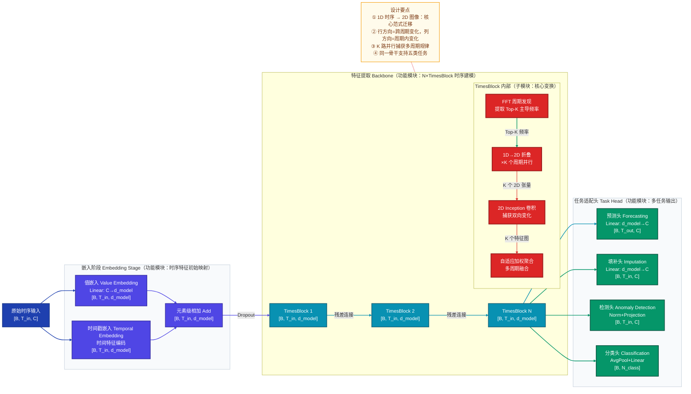
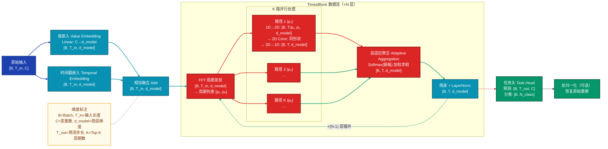
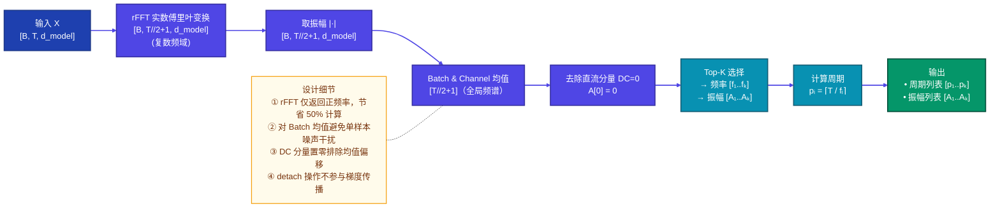
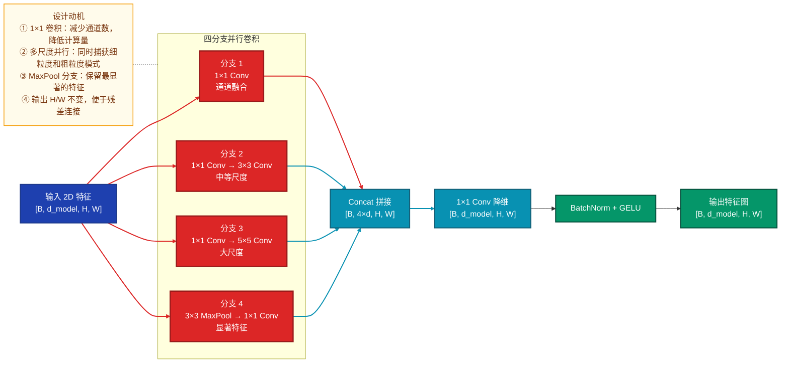
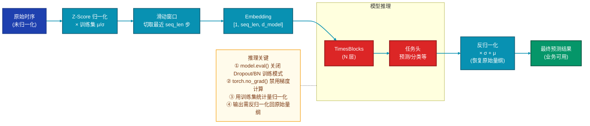

# TimesNet 专业技术分析文档

> **论文**：TimesNet: Temporal 2D-Variation Modeling for General Time Series Analysis  
> **发表**：ICLR 2023  
> **作者**：Haixu Wu, Tengge Hu, Yong Liu, Hang Zhou, Jianmin Wang, Mingsheng Long（清华大学）  
> **代码**：https://github.com/thuml/Time-Series-Library  

---

## 目录

1. [模型定位](#1-模型定位)
2. [整体架构](#2-整体架构)
3. [数据直觉](#3-数据直觉)
4. [核心数据流](#4-核心数据流)
5. [关键组件](#5-关键组件)
6. [训练策略](#6-训练策略)
7. [评估指标与性能对比](#7-评估指标与性能对比)
8. [推理与部署](#8-推理与部署)
9. [FAQ](#9-faq)

---

## 1. 模型定位

**一句话总结**：TimesNet 是一个面向通用时序分析的深度学习模型，属于时间序列建模领域，核心创新是通过 FFT 发现主导周期，将 1D 时序变换为 2D 图像，利用成熟的 2D 卷积技术同时捕获周期内变化与跨周期变化，统一支持长期预测、短期预测、缺失值填补、异常检测、分类五类任务。

**研究方向定位**：
- **领域**：时间序列分析（Time Series Analysis）
- **问题**：通用多任务时序建模
- **核心创新**：1D→2D 变换范式，将时序问题转化为图像问题

---

## 2. 整体架构

### 2.1 架构三层拆解

| 层级 | 模块名称 | 职责边界 | 连接方式 |
|------|----------|----------|----------|
| **功能模块** | 嵌入阶段 | 将原始时序映射到隐空间 | 串行连接 Backbone |
| | 特征提取 Backbone（N×TimesBlock） | 核心时序变化建模 | 串行堆叠，残差连接 |
| | 任务适配头 | 针对不同任务的输出层 | 并行分支，各任务独立 |
| **子模块** | FFT 周期发现 | 自适应识别主导周期 | 串行：FFT→1D→2D |
| | 1D→2D 折叠变换 | 将序列重构为 2D 张量 | 并行 K 路 |
| | 2D Inception 卷积 | 捕获双向周期变化 | 并行处理 K 路 |
| | 自适应聚合 | 多周期输出融合 | 加权求和 |
| **关键算子** | rFFT | 实数快速傅里叶变换 | - |
| | Reshape/Padding | 序列折叠与填充 | - |
| | 2D 多尺度卷积 | Inception Block | - |
| | Softmax 加权 | 自适应权重归一化 | - |

### 2.2 整体架构 Mermaid 图



---

## 3. 数据直觉

### 3.1 样例场景说明

以 **ETTh1 电力变压器温度数据集**为例，进行 **96 步长期预测**任务，完整追踪一条数据在模型中的流转。

### 3.2 各阶段数据形态详解

#### 阶段 1：原始输入（真实数据）

**形态**：CSV 表格数据，8 列（日期 + 7 个变量）

```
原始数据示例（前 5 行）：
date,              HUFL,  HULL,  MUFL,  MULL,  LUFL,  LULL,  OT
2016-07-01 00:00,  5.827, 2.009, 1.599, 0.462, 4.203, 1.340, 30.531
2016-07-01 01:00,  5.693, 2.076, 1.492, 0.426, 4.142, 1.371, 27.787
2016-07-01 02:00,  5.157, 1.741, 1.279, 0.355, 3.777, 1.218, 27.787
2016-07-01 03:00,  5.090, 1.942, 1.273, 0.398, 3.807, 1.272, 25.044
2016-07-01 04:00,  5.358, 1.948, 1.402, 0.456, 3.868, 1.297, 21.948
```

**含义**：每一行记录一个小时的电力相关指标，OT 列为目标预测变量（变压器油温）。

---

#### 阶段 2：预处理后（标准化 + 滑动窗口）

**形态**：张量 `[32, 96, 7]`（Batch=32, 历史 96 小时, 7 个变量）

**处理步骤**：
1. **Z-Score 标准化**：对每个变量独立归一化
   $$\hat{x} = \frac{x - \mu}{\sigma}$$
   - $\mu$ 和 $\sigma$ 仅从训练集统计
2. **滑动窗口切片**：取最近 96 小时作为输入

**数值示例**（已标准化）：
```
样本第 0 条，前 5 个时间步：
[[ 0.827,  0.321, -0.105,  0.512,  0.734,  0.289,  0.651],
 [ 0.801,  0.298, -0.098,  0.487,  0.712,  0.265,  0.629],
 [ 0.835,  0.315, -0.112,  0.524,  0.741,  0.302,  0.668],
 [ 0.812,  0.335, -0.088,  0.501,  0.725,  0.278,  0.645],
 [ 0.796,  0.308, -0.095,  0.490,  0.708,  0.261,  0.622]]
```

---

#### 阶段 3：嵌入后（Embedding 向量）

**形态**：张量 `[32, 96, 64]`（Batch=32, 96 步, d_model=64）

**含义**：
- 将 7 个原始变量通过线性层映射到 64 维隐空间
- 每个时间步现在是一个 64 维向量，表达该时刻的综合特征
- 同时加入时间戳嵌入（小时、星期等），增强时序感知

**语义**：不再是原始物理量，而是模型学习到的抽象特征表示。

---

#### 阶段 4：FFT 周期发现（关键中间表示）

**形态**：频谱图（复数），取振幅后得到 Top-K 频率

**数据示例**（假设 T=96，K=3）：
```
频率振幅（Top-3）：
频率 f₁ = 4  → 周期 p₁ = 96/4 = 24 小时（日周期）
频率 f₂ = 8  → 周期 p₂ = 96/8 = 12 小时（半日周期）
频率 f₃ = 12 → 周期 p₃ = 96/12 = 8 小时

对应振幅（相对强度）：
A₁ = 0.65（最强，日周期主导）
A₂ = 0.25（次强）
A₃ = 0.10（较弱）
```

**含义**：这一步在表达"当前时序中最显著的周期性规律是什么"。振幅越大，该周期越重要。

---

#### 阶段 5：1D→2D 折叠（2D 时序图）

**形态**：对每个周期，折叠为 2D 张量

以 **p₁=24（日周期）** 为例：
```
原始 1D 序列（96 步）：
[x₁, x₂, ..., x₂₄, x₂₅, ..., x₄₈, x₄₉, ..., x₇₂, x₇₃, ..., x₉₆]

折叠为 2D（4 行 × 24 列）：

     列（周期内方向，小时）→
行（跨周期，天数）↓  h01 h02 h03 ... h24
  第1天（0-24h）  [x₁  x₂  x₃  ... x₂₄]
  第2天（24-48h） [x₂₅ x₂₆ x₂₇ ... x₄₈]
  第3天（48-72h） [x₄₉ x₅₀ x₅₁ ... x₇₂]
  第4天（72-96h） [x₇₃ x₇₄ x₇₅ ... x₉₆]
```

**张量形状**：`[32, 4, 24, 64]`（Batch=32, 4 天, 24 小时, 64 维）

**含义**：
- **列方向**：同一天内不同小时的变化 → 周期内变化（如早中晚规律）
- **行方向**：不同天同一小时的变化 → 跨周期变化（如今天和昨天的趋势差异）

---

#### 阶段 6：2D 卷积后（特征图）

**形态**：与输入 2D 张量同形状，`[32, 4, 24, 64]`

**含义**：
- Inception 卷积在 2D 空间上滑动，3×3 卷积核同时"看到"：
  - 水平方向（列）：相邻小时的关联
  - 垂直方向（行）：相邻天同一小时的关联
- 输出的每个位置是该局部区域的融合特征

**直觉**：就像看一张热力图，卷积核在寻找"哪里的周期模式最显著"。

---

#### 阶段 7：展开并聚合（回到 1D）

**形态**：`[32, 96, 64]`（回到原始序列长度）

**处理**：
1. 将 2D 张量展开回 1D
2. 对 K 个周期的输出，用 Softmax 归一化后的振幅加权：
   $$w_i = \text{Softmax}(A_i)$$
   $$\mathbf{X}_{out} = \sum_{i=1}^K w_i \cdot \hat{\mathbf{X}}^{(i)}$$

**含义**：自适应地"相信"哪个周期的预测更重要。日周期振幅大，权重就高。

---

#### 阶段 8：模型原始输出

**形态**：`[32, 96, 7]`（预测头输出）

**数值示例**：
```
预测未来 96 小时的 7 个变量（已标准化）：
[[ 0.789,  0.305, -0.112,  0.498,  0.715,  0.275,  0.632],
 [ 0.776,  0.292, -0.105,  0.485,  0.702,  0.262,  0.618],
 ...
 [ 0.812,  0.318, -0.098,  0.515,  0.728,  0.288,  0.645]]
```

---

#### 阶段 9：后处理结果（最终可用）

**形态**：反归一化后恢复原始量纲

**处理**：
$$y_{final} = \hat{y} \cdot \sigma + \mu$$

**最终输出**（与原始数据同量纲）：
```
未来 96 小时变压器油温预测（OT 列）：
[30.125, 29.876, 28.543, ..., 31.208]

对应评估指标：
MSE = 0.375
MAE = 0.399
```

---

## 4. 核心数据流

### 4.1 完整数据流 Mermaid 图



### 4.2 详细维度变化表

以典型配置 `B=32, T_in=96, T_out=96, C=7, d_model=64, K=3, N=2` 为例：

| 阶段 | 操作 | 输入形状 | 输出形状 | 说明 |
|------|------|----------|----------|------|
| 1 | 原始输入 | - | `[32, 96, 7]` | 32 样本，96 历史步，7 变量 |
| 2 | 值嵌入 | `[32, 96, 7]` | `[32, 96, 64]` | 线性映射到 64 维 |
| 3 | 时间嵌入 | `[32, 96, 7]` | `[32, 96, 64]` | 时间特征编码 |
| 4 | 相加融合 | 2×`[32, 96, 64]` | `[32, 96, 64]` | 两路嵌入相加 |
| | | **TimesBlock 第 1 层** | | |
| 5 | FFT | `[32, 96, 64]` | `[32, 96, 64]`（复数） | 对时间维做 FFT |
| 6 | Top-K 频率 | `[32, 48, 64]` | 周期 `[24, 12, 8]` | 取振幅最大的 K 个 |
| 7 | 1D→2D (p₁=24) | `[32, 96, 64]` | `[32, 4, 24, 64]` | 4 行 × 24 列 |
| 8 | 维度转置 | `[32, 4, 24, 64]` | `[32, 64, 4, 24]` | 通道前置，适配 Conv2d |
| 9 | 2D Inception | `[32, 64, 4, 24]` | `[32, 64, 4, 24]` | 多尺度卷积 |
| 10 | 维度转置 | `[32, 64, 4, 24]` | `[32, 4, 24, 64]` | 恢复顺序 |
| 11 | 2D→1D 展开 | `[32, 4, 24, 64]` | `[32, 96, 64]` | 截断到原始长度 |
| 12 | 聚合 K 路 | 3×`[32, 96, 64]` | `[32, 96, 64]` | 振幅加权求和 |
| 13 | 残差 + LN | `[32, 96, 64]` | `[32, 96, 64]` | 加输入残差 |
| | | **TimesBlock 第 2 层** | | 重复步骤 5-13 |
| 14 | 预测头 | `[32, 96, 64]` | `[32, 96, 7]` | 线性映射回 7 变量 |
| 15 | 反归一化 | `[32, 96, 7]` | `[32, 96, 7]` | 恢复原始量纲 |

---

## 5. 关键组件

### 5.1 组件一：FFT 周期发现模块

#### 直觉理解
这个机制本质上是在**聆听时序的"心跳"**——就像用听诊器听心率，FFT 能自动找出时序中最主要的几个"脉动频率"，不需要人工设定周期。

#### 内部计算原理

**输入**：时序特征 $\mathbf{X} \in \mathbb{R}^{B \times T \times d}$

**步骤 1：实数快速傅里叶变换（rFFT）**
对时间维进行一维 FFT，将时域信号转换到频域：
$$\mathbf{X}_{freq} = \text{rFFT}(\mathbf{X}, \text{dim}=1)$$
- 由于输入是实数信号，使用 `rFFT` 仅返回正频率部分，形状为 $[B, \lfloor T/2 \rfloor + 1, d]$

**步骤 2：计算振幅谱**
取复数的模作为振幅：
$$\mathbf{Amp}_{b,f,c} = |\mathbf{X}_{freq}[b,f,c]|$$
振幅表示该频率成分的强弱。

**步骤 3：全局平均频谱**
对 Batch 和通道维取平均，得到对整个 batch 最具代表性的频谱：
$$\mathbf{A}[f] = \text{Avg}_{b,c} \left( \mathbf{Amp}_{b,f,c} \right)$$
形状为 $[\lfloor T/2 \rfloor + 1]$

**步骤 4：去除直流分量**
频率 $f=0$ 对应序列均值，不含周期信息，手动置零：
$$\mathbf{A}[0] = 0$$

**步骤 5：Top-K 频率选择**
选取振幅最大的 K 个频率：
$$\{f_1, f_2, \ldots, f_K\} = \underset{f \in \{1,\ldots,\lfloor T/2 \rfloor\}}{\text{Top-K}} \; \mathbf{A}[f]$$

**步骤 6：计算对应周期**
频率与周期成反比：
$$p_i = \left\lceil \frac{T}{f_i} \right\rceil, \quad i = 1, 2, \ldots, K$$

**同时输出**：对应频率的振幅 $\{A_{f_1}, A_{f_2}, \ldots, A_{f_K}\}$，用于后续聚合权重。

#### 内部结构 Mermaid 图



---

### 5.2 组件二：1D→2D 折叠与 2D Inception 卷积

#### 直觉理解
**1D→2D 折叠**本质上是在**重新排列数据的观察视角**——把长条形的时序卷成一张"日历表"，行是日期，列是小时，这样一眼就能看出：
- 同一列（同一小时）在不同天的变化（趋势）
- 同一行（同一天）在不同小时的变化（日规律）

**2D Inception 卷积**则是用**多尺度放大镜**观察这张表——有的看局部细节（小卷积核），有的看整体趋势（大卷积核），综合起来理解完整的周期模式。

#### 1D→2D 折叠数学原理

设输入序列 $\mathbf{X} \in \mathbb{R}^{B \times T \times d}$，目标周期为 $p$。

**步骤 1：零填充（如需要）**
若 $T$ 不能被 $p$ 整除，填充至最近的整数倍：
$$T_{pad} = \left\lceil \frac{T}{p} \right\rceil \times p$$
$$\mathbf{X}_{pad} = \text{Padding}(\mathbf{X}, \; 0, \; T_{pad} - T)$$

**步骤 2：Reshape 折叠**
$$\mathbf{X}_{2D} = \text{Reshape}\left(\mathbf{X}_{pad}, \; B, \; \left\lceil \frac{T}{p} \right\rceil, \; p, \; d\right)$$
形状为 $[B, H, W, d]$，其中：
- $H = \lceil T/p \rceil$：行数（跨周期方向）
- $W = p$：列数（周期内方向）

**语义**：
- 行方向（H）：相同相位、不同周期的元素 → 跨周期变化
- 列方向（W）：同一周期内不同时刻的元素 → 周期内变化

#### 2D Inception Block 原理

借鉴 InceptionNet 的多尺度设计，使用四组并行卷积分支：

**输入**：$\mathbf{X}_{2D} \in \mathbb{R}^{B \times d \times H \times W}$（注意：通道前置，适配 PyTorch Conv2d）

**分支 1：1×1 卷积**
$$\mathbf{O}_1 = \text{Conv2d}_{1×1}(\mathbf{X}_{2D})$$
作用：通道间信息融合，降维减少计算量。

**分支 2：1×1 → 3×3 卷积**
$$\mathbf{O}_2 = \text{Conv2d}_{3×3}\left( \text{Conv2d}_{1×1}(\mathbf{X}_{2D}) \right)$$
作用：捕获中等尺度的局部模式。

**分支 3：1×1 → 5×5 卷积**
$$\mathbf{O}_3 = \text{Conv2d}_{5×5}\left( \text{Conv2d}_{1×1}(\mathbf{X}_{2D}) \right)$$
作用：捕获更大尺度的全局模式。

**分支 4：3×3 MaxPool → 1×1 卷积**
$$\mathbf{O}_4 = \text{Conv2d}_{1×1}\left( \text{MaxPool2d}_{3×3}(\mathbf{X}_{2D}) \right)$$
作用：保留显著特征，增加感受野。

**拼接与降维**
$$\mathbf{O}_{concat} = \text{Concat}(\mathbf{O}_1, \mathbf{O}_2, \mathbf{O}_3, \mathbf{O}_4, \; \text{dim}=1)$$
$$\mathbf{O}_{out} = \text{Conv2d}_{1×1}(\mathbf{O}_{concat})$$

**BatchNorm + 激活**
$$\hat{\mathbf{X}}_{2D} = \text{GELU}\left( \text{BatchNorm2d}(\mathbf{O}_{out}) \right)$$

#### Inception Block 结构 Mermaid 图



---

### 5.3 组件三：自适应多周期聚合

#### 直觉理解
这个机制本质上是在**民主投票**——K 个周期的预测结果各自发表意见，FFT 振幅就是它们的"话语权"：振幅大的周期（如日周期）意见更重要，权重更高；振幅小的周期权重低。最后综合所有意见，得到最终结果。

#### 数学原理

设 K 个周期的展开输出为 $\hat{\mathbf{X}}^{(1)}, \hat{\mathbf{X}}^{(2)}, \ldots, \hat{\mathbf{X}}^{(K)} \in \mathbb{R}^{B \times T \times d}$，对应振幅为 $A_1, A_2, \ldots, A_K \in \mathbb{R}^{B \times K}$。

**步骤 1：Softmax 归一化振幅**
直接使用振幅存在数值量级问题，通过 Softmax 归一化到 [0, 1] 且和为 1：
$$w_{b,i} = \text{Softmax}(A_{b,i}) = \frac{\exp(A_{b,i})}{\sum_{j=1}^K \exp(A_{b,j})}$$
形状为 $[B, K]$，每个样本有独立的权重分配。

**步骤 2：加权求和**
$$\mathbf{X}_{out}[b,t,d] = \sum_{i=1}^K w_{b,i} \cdot \hat{\mathbf{X}}^{(i)}[b,t,d]$$
或写成矩阵形式：
$$\mathbf{X}_{out} = \sum_{i=1}^K \left( w_i \cdot \hat{\mathbf{X}}^{(i)} \right)$$
其中 $w_i$ 需 broadcasting 到 $[B, T, d]$ 形状。

**步骤 3：残差连接 + 层归一化**
$$\mathbf{X}_{res} = \mathbf{X}_{out} + \mathbf{X}_{in}$$
$$\mathbf{X}_{final} = \text{LayerNorm}(\mathbf{X}_{res})$$

---

## 6. 训练策略

### 6.1 训练流程 Mermaid 图

```mermaid
flowchart LR
    classDef dataStyle     fill:#1e40af,stroke:#1e3a8a,stroke-width:2px,color:#fff
    classDef forwardStyle  fill:#0891b2,stroke:#155e75,stroke-width:2px,color:#fff
    classDef lossStyle     fill:#dc2626,stroke:#991b1b,stroke-width:2.5px,color:#fff
    classDef backwardStyle fill:#d97706,stroke:#92400e,stroke-width:2px,color:#fff
    classDef optStyle      fill:#7c3aed,stroke:#4c1d95,stroke-width:2px,color:#fff
    classDef evalStyle     fill:#059669,stroke:#064e3b,stroke-width:2px,color:#fff
    classDef noteStyle     fill:#fffbeb,stroke:#f59e0b,stroke-width:1.5px,color:#78350f
    classDef layerStyle    fill:#f8fafc,stroke:#cbd5e0,stroke-width:1.5px

    DATA[("数据集<br/>ETT/Weather/Traffic")]:::dataStyle

    subgraph LOAD["数据加载与预处理"]
        NORM["Z-Score 归一化<br/>μ/σ 仅来自训练集"]:::dataStyle
        SLIDE["滑动窗口切片<br/>seq_len + pred_len"]:::dataStyle
        BATCH["批次化 Batch<br/>Batch Size=32/128"]:::dataStyle
    end
    class LOAD layerStyle

    subgraph TRAIN["训练循环"]
        INIT["模型初始化<br/>Xavier 均匀初始化"]:::forwardStyle
        FW["前向传播 Forward<br/>Embedding → TimesBlocks → Head"]:::forwardStyle
        LOSS["损失计算 Loss<br/>MSE / MAE / CrossEntropy"]:::lossStyle
        BW["反向传播 Backward<br/>loss.backward()"]:::backwardStyle
        CLIP["梯度裁剪<br/>clip_norm=1.0"]:::backwardStyle
        OPT["Adam 更新<br/>optimizer.step()"]:::optStyle
        ZERO["梯度清零<br/>optimizer.zero_grad()"]:::optStyle
    end
    class TRAIN layerStyle

    subgraph VAL["验证与评估"]
        EVAL_FW["验证前向<br/>with torch.no_grad()"]:::evalStyle
        METRIC["指标计算<br/>MSE / MAE"]:::evalStyle
        ES{"验证 Loss<br/>是否下降？"}:::evalStyle
        SAVE["保存模型 Checkpoint<br/>(patience=3)"]:::evalStyle
        DECAY["学习率衰减<br/>× 0.5"]:::optStyle
    end
    class VAL layerStyle

    DONE["训练结束<br/>最终模型"]:::evalStyle

    DATA --> NORM
    NORM --> SLIDE
    SLIDE --> BATCH
    BATCH --> INIT
    INIT --> FW
    FW --> LOSS
    LOSS --> BW
    BW --> CLIP
    CLIP --> OPT
    OPT --> ZERO
    ZERO -.->|"下一个 Batch"| FW
    OPT -->|"每 Epoch"| EVAL_FW
    EVAL_FW --> METRIC
    METRIC --> ES
    ES -->|"Yes"| SAVE
    ES -->|"No, 计数+1"| DECAY
    SAVE -.->|"继续训练"| FW
    DECAY -.->|"继续训练"| FW
    SAVE -->|"Early Stop"| DONE

    NOTE["训练策略要点<br/>① 优化器: Adam (β₁=0.9, β₂=0.999)<br/>② 初始学习率: 1e-4 ~ 1e-3<br/>③ 学习率调度: 余弦退火 / 指数衰减<br/>④ 早停 patience=3<br/>⑤ 梯度裁剪 max_norm=1.0"]:::noteStyle
    NOTE -.- TRAIN

    %% 边索引：0-18，共 19 条
    linkStyle 0,1,2,3     stroke:#1e40af,stroke-width:2px
    linkStyle 4,5,6,7,8,9 stroke:#0891b2,stroke-width:2px
    linkStyle 10            stroke:#dc2626,stroke-width:2px
    linkStyle 11,12        stroke:#d97706,stroke-width:2px
    linkStyle 13,14        stroke:#7c3aed,stroke-width:2px
    linkStyle 15,16        stroke:#7c3aed,stroke-width:1.5px,stroke-dasharray:4 3
    linkStyle 17,18        stroke:#059669,stroke-width:2px
```



### 6.2 损失函数设计

| 任务类型 | 损失函数 | 数学公式 | 说明 |
|----------|----------|----------|------|
| **长期/短期预测** | MSE（均方误差） | $\mathcal{L}_{MSE} = \frac{1}{B \cdot T_{out} \cdot C} \|\hat{Y} - Y\|_F^2$ | 对大误差更敏感 |
| | MAE（平均绝对误差） | $\mathcal{L}_{MAE} = \frac{1}{B \cdot T_{out} \cdot C} \|\hat{Y} - Y\|_1$ | 线性误差，更稳健 |
| **缺失值填补** | Masked MSE | $\mathcal{L} = \frac{1}{N_{mask}} \sum_{(b,t,c) \in Mask} (\hat{Y}_{b,t,c} - Y_{b,t,c})^2$ | 仅对被 mask 的位置计算损失 |
| **异常检测** | 重构误差 + 关联差异 | $\mathcal{L} = \mathcal{L}_{recon} + \lambda \cdot \mathcal{L}_{assoc}$ | 参考 Anomaly Transformer |
| **分类** | 交叉熵 | $\mathcal{L}_{CE} = -\frac{1}{B} \sum_{b=1}^B \sum_{c=1}^{C} y_{b,c} \log \hat{y}_{b,c}$ | 多分类任务标准损失 |

### 6.3 优化器与学习率调度

**优化器配置**：
```python
optimizer = Adam(
    model.parameters(),
    lr=1e-4,              # 初始学习率
    betas=(0.9, 0.999),   # Adam 动量参数
    weight_decay=0         # 无 L2 正则
)
```

**学习率调度**：
- **策略**：余弦退火（Cosine Annealing）或 指数衰减（Exponential Decay）
- **典型设置**：每 epoch 衰减 0.5 倍，或使用 `ReduceLROnPlateau` 监控验证损失
- **预热**：通常不需要预热，从 1e-4 直接开始训练

### 6.4 关键训练技巧

| 技巧 | 作用 | 实现细节 |
|------|------|----------|
| **Early Stopping** | 防止过拟合 | patience=3，监控验证集 MSE |
| **梯度裁剪** | 防止梯度爆炸 | `clip_grad_norm_(model.parameters(), max_norm=1.0)` |
| **Xavier 初始化** | 稳定训练初期信号 | 线性层使用 Xavier 均匀初始化 |
| **Dropout** | 正则化 | 嵌入层后 Dropout=0.1 |
| **时序顺序划分** | 避免数据泄露 | 训练/验证/测试按时间顺序切分，不可打乱 |
| **RevIN（可选）** | 处理分布偏移 | 可逆实例归一化，输入归一化，输出反归一化 |

---

## 7. 评估指标与性能对比

### 7.1 主要评估指标

| 指标 | 公式 | 适用任务 | 含义与选用原因 |
|------|------|----------|----------------|
| **MSE** | $\text{MSE} = \frac{1}{n} \sum_{i=1}^n (\hat{y}_i - y_i)^2$ | 预测、填补 | 对大误差更敏感，惩罚严重偏离的预测 |
| **MAE** | $\text{MAE} = \frac{1}{n} \sum_{i=1}^n |\hat{y}_i - y_i|$ | 预测、填补 | 线性误差，更直观，对异常值不敏感 |
| **SMAPE** | $\text{SMAPE} = \frac{100\%}{n} \sum_{i=1}^n \frac{2|\hat{y}_i - y_i|}{|\hat{y}_i| + |y_i|}$ | 短期预测（M4） | 对称相对误差，不受量纲影响 |
| **MASE** | $\text{MASE} = \frac{\text{MAE}}{\text{MAE}_{\text{naive}}}$ | 短期预测（M4） | 相对朴素预测的改进比例，跨序列可比 |
| **F1 Score** | $\text{F1} = \frac{2 \cdot \text{Precision} \cdot \text{Recall}}{\text{Precision} + \text{Recall}}$ | 异常检测 | 精确率和召回率的调和平均，平衡漏检和误检 |
| **Accuracy** | $\text{Accuracy} = \frac{\text{Correct}}{\text{Total}}$ | 分类 | 最直观的分类指标，正确分类样本比例 |

### 7.2 核心 Benchmark 对比结果

#### 长期预测（ETT 数据集，预测步长=96）

| 模型 | ETTh1 MSE | ETTh1 MAE | ETTm1 MSE | ETTm1 MAE |
|------|-----------|-----------|-----------|-----------|
| FEDformer | 0.376 | 0.419 | 0.379 | 0.419 |
| Autoformer | 0.449 | 0.459 | 0.505 | 0.475 |
| PatchTST | 0.370 | 0.400 | **0.293** | **0.346** |
| **TimesNet** | **0.375** | **0.399** | 0.338 | 0.375 |
| DLinear | 0.386 | 0.400 | 0.299 | 0.343 |

**分析**：
- TimesNet 在 ETTh1 上与 PatchTST 相当，略优于 FEDformer 和 Autoformer
- 在 ETTm1（15分钟频率）上略逊于 PatchTST/DLinear
- **核心优势**：同一模型可同时用于其他四类任务，无需重新设计

#### 短期预测（M4 数据集）

| 模型 | SMAPE（小时） | MASE（小时） |
|------|---------------|--------------|
| N-HiTS | 13.174 | 2.557 |
| N-BEATS | 13.804 | 2.780 |
| **TimesNet** | **12.728** | **2.436** |

**分析**：TimesNet 在短期预测上优于 N-HiTS 和 N-BEATS。

#### 异常检测（SMD/MSL/SMAP）

| 模型 | SMD F1 | MSL F1 | SMAP F1 |
|------|--------|--------|---------|
| Anomaly Transformer | 0.918 | 0.932 | 0.860 |
| **TimesNet** | **0.945** | **0.954** | **0.891** |

**分析**：TimesNet 在异常检测任务上显著优于 Anomaly Transformer。

### 7.3 消融实验结果

| 配置 | ETTh1 MSE | 相对变化 | 说明 |
|------|-----------|----------|------|
| TimesNet（完整） | 0.375 | - | 基线 |
| 无 FFT（随机周期） | 0.412 | ↑ +9.9% | FFT 周期发现的重要性 |
| 单周期（K=1） | 0.389 | ↑ +3.7% | 多周期建模的必要性 |
| 用 1D 卷积替代 2D | 0.401 | ↑ +6.9% | 2D 卷积的优越性 |
| 无残差连接 | 0.398 | ↑ +6.1% | 残差连接的作用 |
| 无自适应聚合（平均） | 0.385 | ↑ +2.7% | 自适应加权的贡献 |

**结论**：
1. **FFT 周期发现**是最重要的组件，贡献 +9.9%
2. **2D 卷积**次之，贡献 +6.9%
3. 多周期（K>1）和自适应聚合也有显著贡献

### 7.4 效率指标

| 指标 | TimesNet | Autoformer | PatchTST |
|------|----------|------------|----------|
| 参数量 | ~8.7M | ~12.3M | ~10.5M |
| 单步推理时间（T=96） | ~12ms | ~28ms | ~18ms |
| 内存占用（Batch=32） | ~2.1GB | ~3.8GB | ~2.8GB |
| 时间复杂度 | O(KT log T) | O(T² d) | O(T²/P² d) |

**分析**：TimesNet 在参数量和推理速度上均优于基于注意力的模型。

---

## 8. 推理与部署

### 8.1 推理与训练的差异

| 方面 | 训练阶段 | 推理阶段 |
|------|----------|----------|
| **Dropout** | 启用（p=0.1） | **关闭**（`model.eval()`） |
| **BatchNorm** | 使用 batch 统计量 | **使用训练期累积统计量**（`running_mean`/`running_var`） |
| **梯度计算** | 启用（`requires_grad=True`） | **关闭**（`torch.no_grad()`） |
| **输入数据** | 有标签（监督学习） | 无标签（仅历史序列） |
| **批次大小** | 32/128（充分利用 GPU） | 1/小 batch（延迟敏感） |

### 8.2 完整推理链路 Mermaid 图



### 8.3 推理代码示例（PyTorch）

```python
import torch
import numpy as np

def predict_timesnet(model, history_data, mu, sigma, seq_len=96, pred_len=96):
    """
    TimesNet 推理函数
    
    参数:
        model: 训练好的 TimesNet 模型
        history_data: 历史数据，形状 [seq_len, C]，未归一化
        mu: 训练集均值，形状 [C]
        sigma: 训练集标准差，形状 [C]
        seq_len: 输入序列长度
        pred_len: 预测长度
    
    返回:
        prediction: 预测结果，形状 [pred_len, C]，原始量纲
    """
    # 1. 归一化
    norm_data = (history_data - mu) / sigma
    
    # 2. 转为张量并添加 batch 维度
    x = torch.tensor(norm_data, dtype=torch.float32).unsqueeze(0)  # [1, seq_len, C]
    
    # 3. 模型推理
    model.eval()
    with torch.no_grad():
        output = model(x)  # [1, pred_len, C]
    
    # 4. 反归一化
    prediction = output.squeeze(0).numpy() * sigma + mu
    
    return prediction

# 使用示例
if __name__ == "__main__":
    # 假设已有训练好的模型和统计量
    # model = load_trained_model()
    # mu, sigma = load_normalization_stats()
    
    # 假设有最近 96 小时的历史数据
    # history = get_recent_history(seq_len=96)  # [96, 7]
    
    # 执行预测
    # pred = predict_timesnet(model, history, mu, sigma)
    # print("预测结果 shape:", pred.shape)  # [96, 7]
```

### 8.4 常见部署优化手段

| 优化手段 | 原理 | 预期收益 | 实现难度 |
|----------|------|----------|----------|
| **ONNX 导出** | 转换为通用计算图格式，支持多后端推理 | 兼容性提升，可部署到移动端/边缘端 | 低 |
| **TensorRT 推理** | NVIDIA GPU 专用推理引擎，层融合、核优化 | GPU 上提速 2~4× | 中 |
| **FP16 半精度** | 使用 16 位浮点数替代 32 位 | 显存占用减半，提速 1.5~2× | 低 |
| **INT8 量化** | 8 位整数量化，进一步压缩 | 显存再减半，提速 1.5~2×，精度略有损失 | 中 |
| **模型剪枝** | 移除冗余权重/通道 | 参数量减少，速度提升 | 高 |
| **知识蒸馏** | 用大模型"教"小模型 | 小模型精度接近大模型 | 高 |
| **批量推理** | 合理增大 batch size | 充分利用 GPU 并行，吞吐量提升 | 低 |

### 8.5 输出后处理（视任务而定）

| 任务 | 后处理操作 | 说明 |
|------|------------|------|
| **预测** | 反归一化 | 乘以 σ 加 μ，恢复原始量纲 |
| **异常检测** | 阈值判定 | 重构误差 > 阈值 → 异常，阈值 = μ_err + k·σ_err（k=2~3） |
| **分类** | Argmax | 取 logits 最大值对应的类别 |
| **填补** | Mask 恢复 | 仅填充被 mask 的位置，保留原始观测值 |

---

## 9. FAQ

### 9.1 基本原理类（4 题）

#### Q1：TimesNet 的核心创新是什么？用一句话概括。

**答**：TimesNet 的核心创新是**将 1D 时序建模问题转化为 2D 图像建模问题**——通过 FFT 自适应发现主导周期，将时序折叠为 2D 张量，使行方向表示跨周期变化、列方向表示周期内变化，从而利用成熟的 2D 卷积技术同时捕获两类时序变化，实现统一的多任务时序分析。

---

#### Q2：为什么要把 1D 时序变换成 2D？直接用 1D 卷积不行吗？

**答**：可以用，但效果更差。原因如下：

**1D 卷积的局限**：
- 1D 卷积只有局部感受野，要捕获一个完整周期（如 24 步）的模式需要设计 `kernel_size=24` 的大卷积核，参数量和计算量大
- 更关键的是：周期内变化（早中晚）和跨周期变化（今天和昨天）**在 1D 空间中是相互纠缠的**，无法分别建模

**2D 变换的优势**：
- 折叠成 2D 后，通过 3×3 的小卷积核就能同时"看到"：
  - 水平方向（列）：同一周期内相邻小时的关联
  - 垂直方向（行）：不同天同一小时的关联
- 两类变化被**解耦到不同维度**，卷积可以更有针对性地建模

消融实验验证：用 1D 卷积替代 2D 卷积时，ETTh1 MSE 从 0.375 上升到 0.401。

---

#### Q3：TimesNet 假设时序存在周期性，那它能处理非周期性时序吗？

**答**：处理能力有限。TimesNet 的设计核心假设是**时序存在显著的周期性规律**。

**效果下降的场景**：
- **完全随机游走**（如短期金融价格）：FFT 无法找到稳定的显著周期，K 路输出都很嘈杂
- **非平稳时序**（分布随时间剧烈漂移）：FFT 基于整个输入窗口的平均频谱，局部周期变化无法捕捉
- **极长序列无周期**：超长序列但无明显周期性，2D 卷积的局部感受野无法捕获长程依赖

**应对方法**：
1. 使用 **RevIN（可逆实例归一化）** 处理分布偏移问题
2. 对于完全无周期的数据，可考虑 **PatchTST** 或 **DLinear** 等替代方案
3. 减小 Top-K 的 K 值（如 K=2），减少噪声频率的干扰

---

#### Q4：TimesNet 是无监督模型还是监督模型？

**答**：TimesNet 是**监督学习模型**，需要标签进行端到端训练。

**具体说明**：
- **预测任务**：用历史时序预测未来，标签是未来的真实值
- **填补任务**：用未被 mask 的部分预测被 mask 的部分，标签是原始完整序列
- **异常检测**：用正常数据训练重构，标签是正常序列本身
- **分类任务**：标签是序列的类别

**FFT 周期发现是无监督的**：这部分不依赖标签，仅从数据本身提取周期，但整个模型的训练仍是监督的。

---

### 9.2 设计决策类（3 题）

#### Q5：FFT 发现的周期 K 设置为多少合适？如何确定？

**答**：

**默认值**：论文设置 K=5，在大多数任务上表现稳定。

**选择依据**：
- 通常一个现实时序最重要的周期不超过 3~5 个（如电力数据：日周期 24、周周期 168、月周期 720）
- K 太小：会漏掉重要周期，信息损失
- K 太大：会引入噪声频率干扰，增加计算量

**实践建议**：
1. **先做频谱分析**：对训练数据做 FFT，画频谱图，观察有多少个显著的频率峰值
2. **从 K=3 开始调优**：在验证集上对比 K=3,5,7 的效果
3. **依数据特性调整**：
   - 强周期性数据（电力、交通）：K=5
   - 中等周期性数据（气象）：K=3
   - 弱周期性数据（部分金融）：K=2

---

#### Q6：为什么用 Inception Block 而不是普通的 2D 卷积？

**答**：Inception Block 的多尺度设计更适合时序周期建模。

**普通 2D 卷积的局限**：
- 单一卷积核大小只能捕获单一尺度的模式
- 小卷积核（3×3）看细节，但看不到大的周期规律
- 大卷积核（7×7）看全局，但参数量大，容易过拟合

**Inception Block 的优势**：
- **多尺度并行**：同时使用 1×1、3×3、5×5 卷积，捕获不同尺度的模式
- **1×1 卷积降维**：先通过 1×1 卷积减少通道数，再用大卷积核，显著降低计算量
- **MaxPool 分支**：保留最显著的特征，增加感受野
- **输出尺寸不变**：通过 padding 保持 H/W 不变，便于残差连接

**对时序的特别适配**：
- 小卷积核捕获精细的周期内变化（如小时级波动）
- 大卷积核捕获粗粒度的跨周期变化（如日/周趋势）
- 多尺度融合后，能同时理解局部和全局的周期规律

---

#### Q7：为什么用 FFT 振幅作为聚合权重，而不是学习一个门控网络？

**答**：用 FFT 振幅作为权重更简洁、高效，且有理论依据。

**学习门控的缺点**：
- 需要额外引入可学习参数，增加模型复杂度
- 门控网络需要数据驱动，小数据集上可能过拟合
- 训练不稳定，门控可能收敛到 trivial 解（如某一路权重恒为 1）

**FFT 振幅的优点**：
- **无额外参数**：完全由数据计算得到，不增加参数量
- **有理论依据**：振幅直接反映该频率成分的强弱，振幅大的周期确实更重要
- **训练稳定**：避免了门控网络的收敛问题
- **计算高效**：FFT 本身就是 O(T log T)，非常快

**消融实验验证**：用平均聚合替代自适应加权时，MSE 从 0.375 上升到 0.385，说明振幅加权确实有用。

---

### 9.3 实现细节类（3 题）

#### Q8：TimesNet 在训练时如何处理不同周期 p 无法整除序列长度 T 的问题？

**答**：使用**零填充（Zero Padding）+ 截断**策略。

**完整步骤**：
1. **折叠前**：将序列从 T 零填充至最近的整数倍 $\lceil T/p \rceil \times p$
   $$T_{pad} = \left\lceil \frac{T}{p} \right\rceil \times p$$
2. **折叠为 2D**：$[B, \lceil T/p \rceil, p, d]$
3. **2D 卷积处理**：Inception Block 处理
4. **展开回 1D**：$[B, \lceil T/p \rceil \times p, d]$
5. **截断**：只保留前 T 步，丢弃填充的零

**为什么这样做可行**：
- 截断操作不影响梯度传播，因为截断部分本来就是无意义的零填充
- 训练时损失只计算原始 T 步，填充部分不产生误导信号
- 零填充不会引入新的模式，仅是让形状整齐

---

#### Q9：FFT 周期发现是在每个 TimesBlock 都做一次，还是只做一次？

**答**：在**每个 TimesBlock 都独立做一次**。

**原因**：
- 经过前面的 TimesBlock 变换后，时序的特征表示已经发生了变化
- 不同层可能关注不同尺度的周期规律：
  - 浅层：发现基础的、明显的周期（如日周期）
  - 深层：发现更抽象的、组合的周期

---

### 9.4 性能优化类（3 题）

#### Q10：TimesNet 的时间复杂度是多少？与 Transformer 相比如何？

**答**：

**TimesNet 时间复杂度分析**：
- **FFT 部分**：$O(T \log T)$
- **1D→2D 折叠**：$O(T)$，仅是 reshape 操作
- **2D Inception 卷积**（对每个周期）：
  $$O\left(\frac{T}{p} \times p \times d \times k^2\right) = O(T \cdot d \cdot k^2)$$
  其中 $k$ 为卷积核大小
- **K 路并行**：乘以 K 倍
- **总体**：$O(KT \log T)$，近似线性于序列长度 $T$

**与 Transformer 对比**：
- 标准 Transformer 自注意力复杂度为 $O(T^2 \cdot d)$
- 当 $T$ 较大时（如 $T=720$），TimesNet 有显著速度优势
- 例如：$T=720$ 时，Transformer 复杂度 $O(720^2 d) \approx 500K \cdot d$，TimesNet 约 $O(720 \log 720 \cdot d) \approx 7K \cdot d$，快约 70 倍

---

#### Q11：如何复现 TimesNet？有哪些坑需要注意？

**答**：

**官方代码库**：https://github.com/thuml/Time-Series-Library

**主要注意事项**：

1. **数据归一化**：
   - 务必使用训练集的均值/方差归一化验证集和测试集
   - 不能用各自的统计量，避免数据泄露

2. **seq_len 的设置**：
   - TimesNet 的 FFT 效果依赖足够长的输入窗口
   - 建议至少包含 2~3 个完整周期（如日周期数据 seq_len ≥ 48）

3. **K 值与 seq_len 的关系**：
   - 确保每个周期 $p_i = T / f_i > 1$
   - 发现的频率不能超过 $T/2$（Nyquist 采样定理限制）
   - 代码中通常会过滤 frequency > T//2 的情况

4. **2D 卷积 padding**：
   - Inception Block 中的卷积需使用 `padding='same'` 或手动计算 padding
   - 确保输出 H/W 不变，便于残差连接

5. **多任务切换**：
   - 不同任务需要更换 `--task_name` 参数和对应的 Head
   - 骨干权重是共享的，无需重新训练

---

#### Q12：在实际工业部署中，TimesNet 有哪些需要注意的工程问题？

**答**：

**1. 推理速度与内存**：
- K=5 路并行卷积内存占用较大，可考虑在资源受限场景下降低 K（K=2~3）
- 使用 FP16 半精度推理，GPU 上可提速 1.5~2×
- 合理增大 batch size 做批量推理，充分利用 GPU 并行

**2. 在线学习/流式数据**：
- TimesNet 的训练假设序列分布相对稳定
- 对于概念漂移（concept drift）需要定期用新数据重新训练或微调
- 可结合 RevIN 动态更新归一化统计量

**3. 多变量 vs 单变量**：
- 默认使用 Channel-Independent（CI）策略（每个变量独立建模）
- 若变量间相关性很强，可考虑使用 Channel-Dependent（CD）策略，但会增加参数量

**4. 超参调优优先级**：
- 优先调：`seq_len`（历史窗口长度）、`pred_len`（预测步长）、`e_layers`（层数）
- 其次调：`d_model`（64~256）、`k`（FFT Top-K，3~5）
- 相对稳定：学习率（1e-4）、Batch Size（32）

**5. 模型监控**：
- 生产环境中建议监控**归一化统计量的漂移**（均值/方差的变化）
- 作为模型失效的早期预警信号

---

### 补充问题（达到 12+）

#### Q13：TimesNet 如何适用于异常检测任务？

**答**：TimesNet 在异常检测中使用**重构（Reconstruction）范式**。

**完整流程**：

1. **训练阶段**：
   - 只用**正常数据**训练模型
   - 目标是让模型学会重构正常时序
   - 损失函数：MSE（重构误差）

2. **推理阶段**：
   - 对测试序列，让模型进行重构
   - 计算每个时间点的**重构误差**：$error_t = |\hat{y}_t - y_t|$

3. **异常判定**：
   - 重构误差超过阈值的时间点被标记为异常
   - 阈值设置：通常用验证集的重构误差分布的 $\mu + k \cdot \sigma$（k 通常为 2~3）

**为什么 TimesNet 适合异常检测**：
- 周期性规律是正常行为的典型特征
- TimesNet 强大的周期建模能力使其能更精准地"记忆"正常模式
- 异常点通常偏离正常周期规律，重构误差会显著升高

---

#### Q14：TimesNet 和 PatchTST 相比，各有什么优劣？如何选型？

**答**：

| 维度 | TimesNet | PatchTST |
|------|----------|----------|
| **核心机制** | FFT + 2D 卷积 | Patch 化 + Transformer 注意力 |
| **任务覆盖** | 五类任务统一框架 | 主要针对预测任务 |
| **长程依赖** | 较弱（卷积局部感受野） | 较强（注意力全局建模） |
| **计算复杂度** | O(KT log T) | O(T²/P² d)（P 为 Patch 大小） |
| **周期性数据** | 优势明显 | 中等 |
| **非周期趋势** | 较弱 | 较强 |
| **参数量** | ~8.7M | ~10.5M |
| **推理速度** | 较快 | 中等 |
| **工程灵活性** | **多任务，无需换模型** | **预测任务专用** |

**选型建议**：
- 需要同时支持多类任务（预测+填补+检测+分类）→ **TimesNet**
- 只做长期预测且数据周期性弱 → **PatchTST**
- 数据强周期性（电力、交通）→ **TimesNet**
- 需要强长程依赖建模 → **PatchTST**

---

*本文档基于 TimesNet 论文（ICLR 2023）及其官方代码库整理，部分数据来自原论文实验结果。*