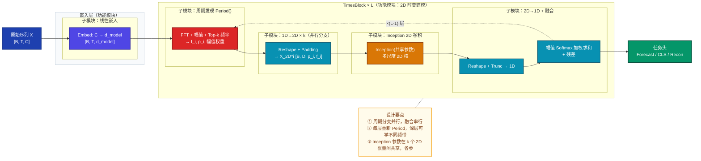
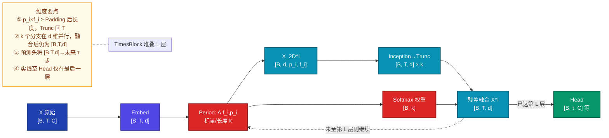
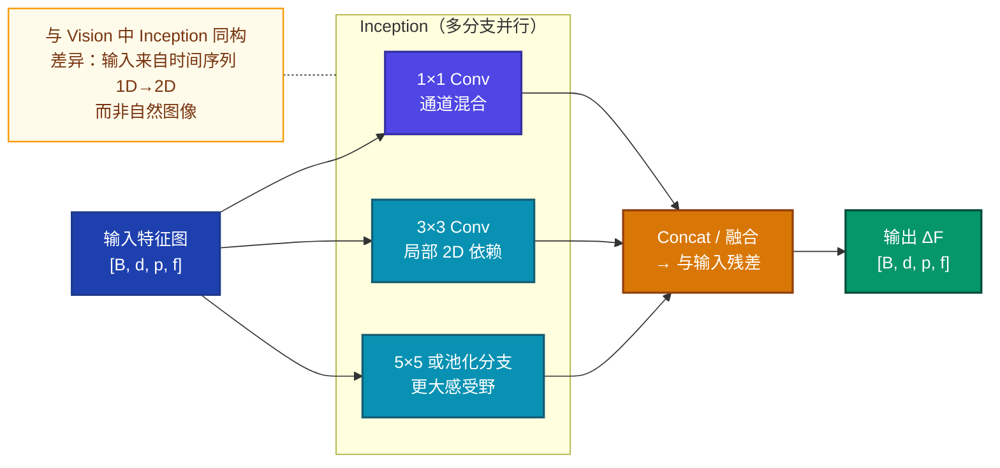
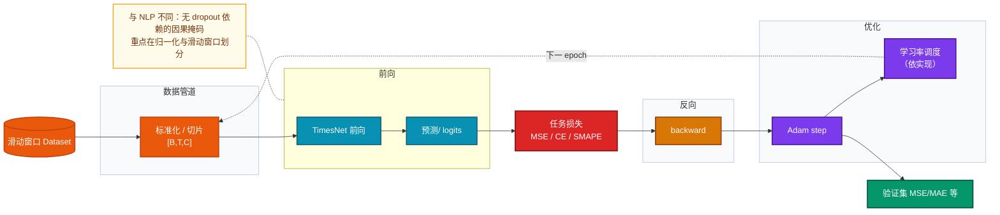

# TimesNet 技术分析文档

> **论文**：Wu et al., *TimesNet: Temporal 2D-Variation Modeling for General Time Series Analysis*, ICLR 2023  
> **代码**：[`thuml/TimesNet`](https://github.com/thuml/TimesNet) / [`thuml/Time-Series-Library`](https://github.com/thuml/Time-Series-Library)（`models/TimesNet.py`）

---

## 1. 模型定位

**一句话**：TimesNet 面向**通用时间序列分析**（预测、插补、分类、异常检测），将多周期下的**周期内变化（intraperiod）**与**周期间变化（interperiod）**统一嵌入二维张量，用**二维卷积类骨干**显式建模「时间上的二维变化」，从而突破纯一维序列对复杂时变模式的表达瓶颈。

- **研究方向**：时间序列深度学习、表示学习、时域–频域联合建模（FFT 周期发现 + 2D 结构先验）。
- **核心创新**：
  1. **多周期假设**：真实序列常由多个可分离周期叠加，FFT 幅值谱提供**数据驱动的周期选择**（Top-$k$ 频率）。
  2. **1D→2D 重排**：按周期 $p_i$ 将长度为 $T$ 的序列 reshape 为 $p_i \times f_i$ 的网格，使**列方向**对应单周期内波形、**行方向**对应跨周期演变。
  3. **TimesBlock**：每层在**深度特征**上重复「周期估计 → 2D 变换 → Inception 提取 → 截断回 1D → 幅值加权融合」，并以残差连接堆叠，形成**任务无关的通用骨干**。

---

## 2. 整体架构：功能模块 → 子模块 → 关键算子

### 2.1 职责边界与连接关系

| 层级 | 模块 | 职责 | 与上下游关系 |
|------|------|------|----------------|
| **功能模块** | 输入嵌入 | 将原始 $C$ 维多变量序列映射到 $d_{\text{model}}$ 维隐空间 | 串行：原始输入 → 嵌入 |
| **功能模块** | TimesBlock ×$L$ | 周期发现、2D 表示、二维卷积、多周期融合、残差更新 | 串行堆叠；块内对 $k$ 个周期**并行**生成 $k$ 条 2D 分支，再**汇聚**为一条 1D |
| **功能模块** | 任务头 | 预测头 / 分类头 / 重构头等 | 串行：最后一层隐状态 → 任务损失 |

**跨模块特征复用**：每一层的周期估计与 2D 变换都作用在**当前层**的 1D 深度特征 $\mathbf{X}^{l-1}_{\text{1D}}$ 上，而非仅对原始输入做一次变换——浅层与深层可关注不同频带，等价于**层级化的多周期表示**。

### 2.2 整体架构 Mermaid

---

## 3. 数据直觉：一条 ETTh1 多变量样例

以下用 **ETTh1**（电力变压器小时级多变量：油温、负载等，$C=7$）、常见设置 **$T=96$**（回看窗口）、**预测步长 96** 作为主线（具体数值为示意，便于建立直觉）。

| 阶段 | 内容 | 「在表达什么」 |
|------|------|----------------|
| **原始输入** | 过去 96 个时刻、7 个变量的实数矩阵 | 真实物理过程在采样网格上的记录，含日周期、趋势与噪声。 |
| **预处理** | 按数据集统计量做 **instance normalization**（减均值除标准差，在 Time-Series-Library 等实现中常见）；滑动窗口切片得到样本 $\mathbf{X}\in\mathbb{R}^{T\times C}$ | 降低量纲与分布偏移，让优化更稳；**不**改变时间顺序。 |
| **嵌入** | $\mathbf{X}^0_{\text{1D}}=\text{Embed}(\mathbf{X})\in\mathbb{R}^{T\times d_{\text{model}}}$ | 将标量通道升为高维，使后续 FFT 与卷积在**统一隐空间**操作。 |
| **周期发现** | 对 $\mathbf{X}^{l-1}_{\text{1D}}$ 做 FFT，取幅值最大的 Top-$k$ 个频率 $f_i$，得 $p_i=\lceil T/f_i\rceil$ | 模型自动回答「当前片段里哪些节律最强」——例如日周期对应较小 $f_i$、较大 $p_i$。 |
| **2D 张量** | 每个 $i$：Padding 后 reshape 为 $p_i\times f_i$（多通道为 $p_i\times f_i\times d_{\text{model}}$ 形式进入 Inception） | **列**：一周内同一相位；**行**：周与周之间的缓慢漂移。 |
| **Inception 输出** | 二维卷积混合局部邻域 → 再展平并 **Trunc** 回长度 $T$ | 在「伪图像」上做空间建模，等价于同时利用**沿时间折叠**出的两个结构化维度。 |
| **融合** | $\hat{A}_{f_i}=\text{Softmax}(A_{f_1},\ldots,A_{f_k})$，$\mathbf{X}^l=\sum_i \hat{A}_{f_i}\hat{\mathbf{X}}^{l,i}_{\text{1D}}+\mathbf{X}^{l-1}$ | 幅值大的周期分支权重大，抑制随机高频噪声分支。 |
| **任务头输出** | 长期预测：常对接 **线性层** 输出未来 $\tau$ 步、$C$ 维；分类：序列池化 + 全连接 | 原始 logits 或归一化空间中的预测。 |
| **后处理** | **反归一化** 回到原始物理单位；业务上再算 MAE/MSE | 得到可与真实表计对比的数值或类别标签。 |

---

## 4. 核心数据流（张量维度）

**约定**：$B$ 批次，$T$ 历史长度，$C$ 输入变量数，$d$ 为 $d_{\text{model}}$，$k$ 为 Top-$k$ 周期数，$\tau$ 为预测长度（预测任务）。

**文字版路径与形状小结**：

1. $\mathbf{X}\in\mathbb{R}^{B\times T\times C}$  
2. $\mathbf{X}^0\in\mathbb{R}^{B\times T\times d}$  
3. 对每层：$\mathbf{A},\{f_i,p_i\}_{i=1}^k=\text{Period}(\mathbf{X}^{l-1})$（$\mathbf{A}$ 用于融合权重）  
4. $\mathbf{X}^{l,i}_{\text{2D}}\in\mathbb{R}^{B\times d\times p_i\times f_i}$（实现中常等价于通道为 $d$ 的 2D 特征图）  
5. $\hat{\mathbf{X}}^{l,i}_{\text{1D}}\in\mathbb{R}^{B\times T\times d}$  
6. $\mathbf{X}^l\in\mathbb{R}^{B\times T\times d}$  
7. 预测：$\hat{\mathbf{Y}}\in\mathbb{R}^{B\times \tau\times C}$（具体因 head 实现略有差异，以代码为准）

---

## 5. 关键组件（直觉 → 原理 → 公式）

### 5.1 FFT 驱动的周期发现 `Period(·)`

**直觉**：把序列看成多个正弦分量的叠加，**幅值谱峰值**对应主导周期；只保留 Top-$k$ 是为了抑制噪声频段。

**原理**：对嵌入后的 1D 特征做 FFT，在 $[1,\lfloor T/2\rfloor]$ 上选幅值最大的 $k$ 个频率索引 $f_i$，周期长度取 $p_i=\lceil T/f_i\rceil$。

**公式**（与论文一致）：

$$
\mathbf{A} = \text{Avg}\left(\text{Amp}\left(\text{FFT}(\mathbf{X}_{\text{1D}})\right)\right),\quad \{f_1,\ldots,f_k\} = \mathop{\text{argTopk}}_{f\in\{1,\ldots,\lfloor T/2\rfloor\}}(\mathbf{A})
$$

$$
p_i = \left\lceil \frac{T}{f_i} \right\rceil,\quad i=1,\ldots,k
$$

**为何这样设计**：周期长度由当前片段的频域能量分布**自适应**决定，避免手工指定季节项；$k$ 在精度与效率间折中（论文对预测/短预测常取 $k=5$，插补/分类/异常取 $k=3$）。

---

### 5.2 1D→2D 重排与「周期内 / 周期间」语义

**直觉**：固定 $p_i$ 后，把序列切成「长度为 $p_i$ 的片段」并排成矩阵：**同一列**是同一相位上的采样（周期内），**同一行**是相邻周期同一相位（周期间）。

**原理**：对 Padding 后的序列按 $(p_i,f_i)$ reshape；若总长度不足则零填充。

**公式**：

$$
\mathbf{X}^{i}_{\text{2D}} = \text{Reshape}_{p_i,f_i}\left(\text{Padding}(\mathbf{X}_{\text{1D}})\right)
$$

**Trunc** 将展平长度裁回 $T$，与原始时间索引对齐。

---

### 5.3 TimesBlock 内 Inception + 幅值加权融合

**直觉**：二维卷积在「行、列」两个方向同时做局部聚合，恰好对应**跨相位**与**跨周期**两类局部性；多分支 Inception 以不同感受野捕获多尺度 2D 模式。

**原理**：$k$ 个周期产生 $k$ 个 2D 张量，**共享一套 Inception 参数**（parameter-efficient），降低参数量；融合时用 FFT 幅值经 Softmax 得到权重，强调主周期。

**公式**（第 $l$ 层）：

$$
\hat{\mathbf{X}}^{l,i}_{\text{2D}} = \text{Inception}\left(\mathbf{X}^{l,i}_{\text{2D}}\right),\quad
\hat{\mathbf{A}}^{l-1}_{f_i} = \text{Softmax}\left(A^{l-1}_{f_1},\ldots,A^{l-1}_{f_k}\right)
$$

$$
\mathbf{X}^{l}_{\text{1D}} = \sum_{i=1}^{k} \hat{A}^{l-1}_{f_i}\cdot \hat{\mathbf{X}}^{l,i}_{\text{1D}} + \mathbf{X}^{l-1}_{\text{1D}}
$$

### 5.4 关键组件内部结构（Inception 示意）

---

## 6. 训练策略

论文 **Table 7** 给出统一配置（所有任务 **Adam**，$\beta_1=0.9,\beta_2=0.999$）：

| 任务 | $k$ | 层数 | $d_{\min}$ | $d_{\max}$ | 初始学习率 | 损失 | Batch | Epochs |
|------|-----|------|------------|------------|------------|------|-------|--------|
| 长期预测 | 5 | 2 | 32 | 512 | $10^{-4}$ | MSE | 32 | 10 |
| 短期（M4） | 5 | 2 | 16 | 64 | $10^{-3}$ | SMAPE 等 | 16 | 10 |
| 插补 | 3 | 2 | 64 | 128 | $10^{-3}$ | MSE | 16 | 10 |
| 分类 | 3 | 2 | 32 | 64 | $10^{-3}$ | 交叉熵 | 16 | 30 |
| 异常检测 | 3 | 3 | 32 | 128 | $10^{-4}$ | MSE | 128 | 10 |

**隐维规则**：$d_{\text{model}}=\min\left(\max\left(2^{\lceil\log_2 C\rceil},d_{\min}\right),d_{\max}\right)$，使通道数 $C$ 与模型宽度匹配。

**关键技巧**：

- **多任务共用骨干、仅换头**：同一 TimesBlock  backbone 适配不同损失，体现「通用时序 foundation」定位。  
- **每层重复 1D→2D**：消融表明若仅在原始输入做一次变换，异常检测 F1 从 **85.49%** 降至 **84.85%**（论文 Table 9），说明**深度多周期建模**必要。  
- **幅值 Softmax 融合**：优于直接求和或无 Softmax（论文 Table 10）。

### 6.1 训练流程 Mermaid

---

## 7. 评估指标与性能对比

### 7.1 指标含义与选用原因

| 指标 | 含义 | 选用原因 |
|------|------|----------|
| **MSE** | 均方误差，惩罚大误差 | 长期预测主表通用，可微、与优化一致 |
| **MAE** | 平均绝对误差，鲁棒 | 与 MSE 互补，反映平均偏差幅度 |
| **SMAPE / MASE / OWA** | M4 短预测标准指标 | 与 M4 竞赛协议对齐，跨序列可比 |
| **Accuracy** | 分类正确率 | UEA 多数据集平均，衡量高层语义 |
| **F1** | 异常检测综合查准查全 | 工业场景类别极不均衡 |

### 7.2 代表性结果（摘自论文表格）

**长期预测（Table 2）**：输入长度 ILI 为 36，其余为 **96**；预测长度 ILI 为 $\{24,36,48,60\}$，其余为 $\{96,192,336,720\}$；表中数字为 **4 个预测长度平均**。

| 数据集 | TimesNet MSE | TimesNet MAE | DLinear | FEDformer | Autoformer | Informer |
|--------|--------------|--------------|---------|-----------|------------|----------|
| ETTh1 | **0.458** | **0.450** | 0.456 / 0.452 | 0.491 / 0.479 | 0.570 / 0.537 | 1.040 / 0.795 |
| Electricity | **0.192** | **0.295** | 0.212 / 0.300 | 0.229 / 0.329 | 0.227 / 0.338 | 0.311 / 0.397 |
| Weather | **0.259** | **0.287** | 0.265 / 0.317 | 0.261 / 0.312 | 0.338 / 0.382 | 0.634 / 0.548 |

**说明**：在 **ETTh1** 上 TimesNet 与 **DLinear** 极为接近（0.458 vs 0.456），论文强调在 **80%+** 设定下仍领先（见附录 Table 13 分 horizon 全表）。这提示：**强基线（如 DLinear）在部分数据集极轻量且有效**，对比需看全数据集与多任务。

**短预测 M4（Table 3）**：TimesNet **SMAPE 11.829**、**MASE 1.585**、**OWA 0.851**，优于表中 N-HiTS、N-BEATS、ETSformer 等。

**插补（Table 4，多 mask 比例平均）**：ETTh1 上 TimesNet **MSE 0.078 / MAE 0.187**，优于多数 Transformer 基线。

**分类（Figure 5 / 正文）**：UEA 10 子集平均准确率 **73.6%**，高于 Rocket 72.5% 与 Flowformer 73.0%。

**异常检测（Table 5，Inception 版本）**：五数据集平均 F1 **85.49%**，优于 FEDformer 84.97%、Autoformer 84.26% 等。

### 7.3 消融（组件贡献，节选）

- **2D 骨干**：将 Inception 换为 ResNeXt、Swin、ConvNeXt 等可略提 F1，但参数与延迟上升（Figure 4 右、Table 8）。  
- **+ Autoformer 式分解**：未带来提升（Table 9），作者解释为强周期片段下 2D 已足够；弱周期时主频退化为 1，趋势由周期内建模覆盖。  
- **仅对原始输入做 2D 变换**：性能明显下降（见 6 节）。  
- **融合**：Softmax 幅值加权优于直接求和（Table 10）。

### 7.4 效率（论文 Figure 4 / Appendix Table 11 思路）

Inception **共享参数**版约 **0.067MB、43.2ms/iter**（论文图中与 ResNet、Swin 等对比），**独立参数**版更大更慢。实际吞吐与实现、硬件强相关，部署请以 Profiling 为准。

---

## 8. 推理与部署

| 维度 | 训练 | 推理 |
|------|------|------|
| **Dropout** | 若实现中含 Dropout，推理应 `eval()` 关闭 | 与常规一致 |
| **BN** | 本架构以 **LayerNorm / Conv-BN** 依实现而定 | `eval()` 下用滑动统计或固定统计 |
| **FFT 与 Top-k** | 与推理相同 | 前向唯一路径，无随机性（无采样头时） |
| **损失** | 有监督目标 | 去掉，仅前向 |

**后处理（预测）**：

1. 输出在 **归一化空间** → **反归一化**到原单位。  
2. 若需区间预测，需训练阶段带分位数头或蒙特卡洛 Dropout 等（非原版 TimesNet 必备）。

**部署优化**：

- **ONNX / TorchScript**：导出前固定 `T、k、C`，注意动态 $p_i,f_i$ 随输入变化仍可在图中保留，但部分编译器更偏好固定形状。  
- **量化**：二维卷积部分对 INT8 友好；FFT 需在框架中确认整型支持或使用 FP16。  
- **蒸馏**：用大骨干（ResNeXt/Swin）教师蒸馏轻量 Inception 学生，论文已暗示 2D 骨干可替换。

---

## 9. FAQ（14 问）

### Q1：TimesNet 是 Transformer 吗？

**答**：**不是**。核心时序建模单元是 **2D 卷积（Inception）** 与 **FFT**，无自注意力 $O(T^2)$；与 Informer/Autoformer 路线不同，更接近「频域先验 + 视觉骨干」。

### Q2：为什么要把时间序列变成「图像」？

**答**：多周期叠加后，一维相邻点可能跨越不同物理相位；按主导周期折叠成 $p_i\times f_i$ 网格后，**行列语义分离**，二维核可同时利用两种局部性，表达力更强。

### Q3：$p_i=\lceil T/f_i\rceil$ 中 $f_i$ 是频率还是周期长度？

**答**：论文中 $f_i$ 是 **FFT 频谱上的离散频率索引**（正频率部分），再由 $T$ 与 $f_i$ 推出 **周期长度** $p_i$。实现时需与库中 FFT 输出索引约定一致。

### Q4：Padding 会不会引入虚假边界？

**答**：零填充会引入边界效应，但后续 **Trunc** 对齐原长，且 Top-$k$ 抑制高频噪声；长序列下影响相对有限，若敏感可采用镜像填充等变体（属工程扩展）。

### Q5：为何要在每一层 TimesBlock 都做一次 Period？

**答**：浅层更接近原始幅值周期，深层可能更关注趋势与残差周期；**层级化多周期** 在消融中显著优于只做输入层一次变换。

### Q6：共享 Inception 参数在 $k$ 个周期之间不会冲突吗？

**答**：不同周期对应不同 reshape 的几何结构，**同一套卷积核**作用在不同「折叠方式」的 2D 面上，类似多视图共享权重；冲突由 **幅值加权融合** 缓解，且显著省参。

### Q7：与 DLinear 相比，TimesNet 何时更值得用？

**答**：DLinear 在部分预测集上极轻量且有竞争力（如 ETTh1 平均与 TimesNet 接近）；TimesNet 在 **插补、分类、异常** 等需 **二维局部与多尺度** 的任务上优势更明显，更适合作为 **统一骨干**。

### Q8：损失函数为何长期预测用 MSE？

**答**：可微、与点预测匹配；若业务更关心相对误差可改用 MAPE 类，但需处理分母接近 0 的问题。

### Q9：$k$ 选太大有什么问题？

**答**：更多分支增加计算与噪声频段风险；论文对高阶任务（分类/插补）用 **$k=3$** 平衡鲁棒性。

### Q10：异常检测里为何用重构误差？

**答**：与部分基线公平对比（论文注：将 Anomaly Transformer 的联合准则换为重构误差）；思想是正常模式易重构、异常难重构。

### Q11：FFT 复杂度是否瓶颈？

**答**：FFT 为 $O(T\log T)$，通常轻于注意力 $O(T^2)$；主要开销往往在 **$k$ 次 2D 卷积**。

### Q12：能否替换 Inception 为 ConvNeXt？

**答**：可以，论文 Table 8 显示 **ConvNeXt** 等可提升 F1，但模型更大更慢，适合精度优先场景。

### Q13：多变量通道 $C$ 很大时怎么办？

**答**：依论文规则升维 $d_{\text{model}}$ 至上限 $d_{\max}$；超大 $C$ 时可先做通道压缩或因子分解（属扩展工作）。

### Q14：推理结果如何与业务阈值联动？

**答**：反归一化后，在原始单位设告警阈值；异常检测可先 **点级分数** 再滑动窗口聚合，阈值需用验证集标定。

---

## 10. 参考文献与延伸阅读

- Wu et al., ICLR 2023, [OpenReview](https://openreview.net/pdf?id=ju_Uqw384Oq)  
- Time-Series-Library 教程：[`tutorial/TimesNet_tutorial.ipynb`](https://github.com/thuml/Time-Series-Library/blob/main/tutorial/TimesNet_tutorial.ipynb)

---

*文档中的实验数字均可在原论文 Table 2–5、7–10 及 Figure 4–5 中溯源；复现实验请以官方脚本与随机种子为准。*
