# TimesNet 深度学习模型技术分析

> **论文**：TimesNet: Temporal 2D-Variation Modeling for General Time Series Analysis
> **发表**：ICLR 2023
> **作者**：Haixu Wu, Tengge Hu, Yong Liu, Hang Zhou, Jianmin Wang, Mingsheng Long（清华大学）

---

## 一、模型定位

**一句话定位**：TimesNet 是一个用于**通用时间序列分析**的骨干网络，核心创新是将 1D 时序变化**变换到 2D 空间**，通过检测主频周期并折叠序列为二维张量，使标准 2D 卷积能够同时捕捉**周期内变化（intraperiod）**与**跨周期变化（interperiod）**，从而在预测、填补、异常检测、分类四类任务上统一适配。

| 维度 | 说明 |
|------|------|
| **研究方向** | 时间序列分析（Time Series Analysis） |
| **任务范围** | 长/短期预测、缺失值填补、异常检测、时序分类 |
| **核心洞察** | 真实时序存在多周期性，1D 卷积难以同时捕捉两类时间变化；将序列折叠为 2D 后两类变化自然对应行内和列间方向 |
| **核心贡献** | ① 提出 1D→2D 变换范式；② 设计 TimesBlock；③ 构建统一的时序分析骨干 |

---

## 二、整体架构

### 2.1 三层拆解：功能模块 → 子模块 → 关键算子

**功能模块层**（外层职责边界）

| 功能模块 | 职责 | 与其他模块的连接 |
|----------|------|-----------------|
| **输入嵌入层** | 将原始时间序列映射到高维特征空间 | 串行 → TimesBlock 栈 |
| **TimesBlock 栈** | 堆叠多个 TimesBlock，逐层提炼多尺度时序特征 | 串行，共享同一残差路径 |
| **任务头** | 根据下游任务将特征投影为具体输出格式 | 并行多头（四类任务头各自独立） |

**子模块层**（TimesBlock 内部）

| 子模块 | 职责 |
|--------|------|
| ① 周期检测（FFT 分析） | 用快速傅里叶变换找到序列中的 Top-k 主导周期 |
| ② 1D→2D 变换 | 按每个周期长度将 1D 序列重塑为二维矩阵 |
| ③ 2D 特征提取（Inception） | 用多尺度 2D 卷积在二维空间学习时序模式 |
| ④ 2D→1D 还原 + 自适应聚合 | 将多周期特征各自还原后加权求和回到 1D |

**算子层**（关键计算单元）

- `FFT` → 频谱分析，提取主频
- `Reshape/Padding` → 维度折叠，实现 1D↔2D 互转
- `InceptionBlock`（多尺度 Conv2d） → 捕捉不同粒度的二维模式
- `Adaptive Average Pooling` → 聚合权重来源，归一化自适应权重
- `Linear Projection` → 任务头，维度对齐

### 2.2 模块间连接方式

- **输入嵌入 → TimesBlock 栈**：串行
- **TimesBlock 栈内部**：串行，每层输出作为下一层输入，有残差连接
- **TimesBlock 内多周期分支**：**并行**（Top-k 个周期各自独立走 2D 卷积分支），最后自适应聚合
- **TimesBlock 栈 → 任务头**：并行（同一骨干特征接不同头）

---

### 2.3 整体架构图

```mermaid
flowchart LR
    classDef inputStyle    fill:#1e40af,stroke:#1e3a8a,stroke-width:2px,color:#fff
    classDef embedStyle    fill:#4f46e5,stroke:#3730a3,stroke-width:2px,color:#fff
    classDef encoderStyle  fill:#0891b2,stroke:#155e75,stroke-width:2px,color:#fff
    classDef attnStyle     fill:#dc2626,stroke:#991b1b,stroke-width:2.5px,color:#fff
    classDef ffnStyle      fill:#d97706,stroke:#92400e,stroke-width:2px,color:#fff
    classDef headStyle     fill:#059669,stroke:#064e3b,stroke-width:2px,color:#fff
    classDef noteStyle     fill:#fffbeb,stroke:#f59e0b,stroke-width:1.5px,color:#78350f
    classDef layerStyle    fill:#f8fafc,stroke:#cbd5e0,stroke-width:1.5px

    INPUT["原始时间序列<br>Raw Time Series<br>[B, T, C]"]:::inputStyle

    subgraph EMBED["① 输入嵌入层 Input Embedding（功能模块：将时序映射至特征空间）"]
        direction LR
        VAL_EMB["数值嵌入<br>Value Embedding<br>Linear: C → d_model"]:::embedStyle
        POS_EMB["位置编码<br>Positional Encoding<br>[1, T, d_model]"]:::embedStyle
        TEMP_EMB["时间戳嵌入<br>Temporal Embedding<br>月/日/时/分 → d_model"]:::embedStyle
        EMB_SUM["嵌入融合<br>Element-wise Add<br>[B, T, d_model]"]:::embedStyle
    end
    class EMBED layerStyle

    subgraph BACKBONE["② TimesBlock 栈（功能模块：多尺度时序特征提取，共 e_layers 层）"]
        direction TB
        subgraph TB1["TimesBlock ×e_layers（子模块：1D→2D 变换 + 2D 卷积）"]
            direction LR
            FFT_MOD["周期检测<br>FFT Analysis<br>Top-k Periods"]:::attnStyle
            RESHAPE["1D→2D 变换<br>Reshape + Padding<br>[B, d, T/p, p]"]:::encoderStyle
            INCEP["二维特征提取<br>Inception Block<br>多尺度 Conv2d"]:::ffnStyle
            RESTORE["2D→1D 还原<br>Reshape + Truncate<br>[B, d, T]"]:::encoderStyle
            AGG["自适应聚合<br>Adaptive Aggregation<br>加权求和"]:::attnStyle
        end
        RESIDUAL["残差连接 + 层归一化<br>Residual + LayerNorm<br>[B, T, d_model]"]:::encoderStyle
    end
    class BACKBONE layerStyle

    subgraph HEADS["③ 任务头（功能模块：面向四类下游任务）"]
        direction TB
        H_FORE["预测头<br>Forecasting Head<br>Linear: T→H"]:::headStyle
        H_IMP["填补头<br>Imputation Head<br>Linear: d→C"]:::headStyle
        H_ANOM["异常检测头<br>Anomaly Detection Head<br>Reconstruction"]:::headStyle
        H_CLS["分类头<br>Classification Head<br>MLP + Softmax"]:::headStyle
    end
    class HEADS layerStyle

    OUTPUT["任务输出<br>Task Output<br>预测/重建/异常分/类别"]:::inputStyle

    INPUT --> VAL_EMB
    INPUT --> TEMP_EMB
    VAL_EMB --> EMB_SUM
    POS_EMB --> EMB_SUM
    TEMP_EMB --> EMB_SUM
    EMB_SUM -->|"[B, T, d_model]"| FFT_MOD
    FFT_MOD --> RESHAPE
    RESHAPE --> INCEP
    INCEP --> RESTORE
    RESTORE --> AGG
    AGG --> RESIDUAL
    RESIDUAL -.->|"×(e_layers-1) 层循环"| FFT_MOD
    RESIDUAL --> H_FORE
    RESIDUAL --> H_IMP
    RESIDUAL --> H_ANOM
    RESIDUAL --> H_CLS
    H_FORE --> OUTPUT
    H_IMP --> OUTPUT
    H_ANOM --> OUTPUT
    H_CLS --> OUTPUT

    NOTE["设计要点<br>① 多周期并行：Top-k 周期各自独立走 2D 分支，最后自适应聚合<br>② 1D→2D 变换是模型核心：每个周期 p 对应一次 reshape，行=跨周期，列=周内<br>③ Inception 提供多感受野：同时捕捉细粒度和粗粒度二维模式<br>④ 四类任务头共享同一骨干，实现统一时序分析骨干网络"]:::noteStyle
    NOTE -.- BACKBONE

    %% 边索引：0-17，共 18 条；NOTE -.- 为边 18
    linkStyle 0,1     stroke:#1e40af,stroke-width:2px
    linkStyle 2,3,4   stroke:#4f46e5,stroke-width:1.5px
    linkStyle 5       stroke:#4f46e5,stroke-width:2px
    linkStyle 6,7,8,9,10,11 stroke:#0891b2,stroke-width:2px
    linkStyle 12      stroke:#dc2626,stroke-width:1.5px,stroke-dasharray:4 3
    linkStyle 13,14,15,16 stroke:#059669,stroke-width:1.5px
    linkStyle 17      stroke:#059669,stroke-width:2.5px
```



---

## 三、数据直觉

以一条具体的**电力负荷预测**样例为主线，完整展示数据在模型中经历的变化。

### 3.1 原始输入（真实序列内容）

**场景**：某城市 2023 年某周的小时级用电功率（单位：MW），用历史 96 小时预测未来 96 小时。

```
时间戳      | 电力负荷(MW)
2023-01-09 00:00 | 1842
2023-01-09 01:00 | 1756
2023-01-09 02:00 | 1698
...（共 96 个时间点）
2023-01-13 23:00 | 2103
```

模型输入张量：`X ∈ ℝ^{B×96×1}`（批次大小 B=32，序列长 T=96，变量数 C=1）

### 3.2 预处理后

**归一化**（每个变量独立 z-score 归一化）：
```
归一化后的 x_t = (x_t - mean) / std
1842 → (1842 - 1923.5) / 187.2 = -0.435
1756 → (1756 - 1923.5) / 187.2 = -0.895
...
```

**输入嵌入后**（Value Embedding + Temporal Embedding + Positional Encoding 相加）：
- Value Embedding：Linear(1 → 64)，将单变量映射到 64 维特征，含义是**给每个时间步提供丰富的特征表达维度**
- Temporal Embedding：将"01月09日 00时"编码为日历特征向量，含义是**让模型感知当前时间点在一天/周中的位置**
- 相加后：`H ∈ ℝ^{32×96×64}`，每个时间步现在是一个 64 维向量

### 3.3 关键中间表示

**第一步：FFT 周期检测**

对嵌入特征在时间维度做 FFT，分析频谱：

```
频率域振幅分布（示意）：
频率 1/24（对应周期24h）→ 振幅最高（日周期）
频率 1/168（对应周期168h/周）→ 第二高（周周期）
...
Top-2 周期：p₁=24, p₂=12
```

**含义**：FFT 告诉我们这条序列主要受「每日24小时」和「每半天12小时」的周期性驱动。

**第二步：1D→2D 变换（以 p₁=24 为例）**

将长度 96 的序列重塑为 `[4, 24]` 的二维矩阵（4 = 96/24，表示 4 个完整日期）：

```
原始（展平后）：  [1h, 2h, 3h, ..., 24h, | 25h, 26h, ..., 48h, | ... | 73h, ..., 96h]
                 ↓ reshape([4, 24])
二维矩阵：
行 0（第1天）：  [1h,  2h,  3h, ..., 24h]   ← 周内变化（连续时间点）
行 1（第2天）：  [25h, 26h, 27h, ..., 48h]
行 2（第3天）：  [49h, 50h, 51h, ..., 72h]
行 3（第4天）：  [73h, 74h, 75h, ..., 96h]

列 0（每天 0 时）：[1h, 25h, 49h, 73h]     ← 跨周期变化（不同天的同一时刻）
```

**含义**：现在每一行捕捉"同一天内从早到晚的变化规律"（周内变化），每一列捕捉"不同天在同一时刻的变化趋势"（跨周期变化）。2D 卷积的感受野天然覆盖这两个方向。

**第三步：Inception Block 处理**

在 `[32, 64, 4, 24]` 的 4D 张量上施加多尺度 Conv2d（kernel 1×1, 3×3, 5×5）：
- 1×1 卷积：捕捉每个时间点的通道间关系
- 3×3 卷积：捕捉2小时内+相邻2天的局部模式
- 5×5 卷积：捕捉4小时内+相邻4天的中程模式

输出 `[32, 64, 4, 24]`，每个位置的 64 维向量现在融合了行/列两个方向的上下文。

**第四步：自适应聚合**

对 Top-2 周期（24和12）各自产生一份处理后的 `[32, 64, 96]` 序列，通过可学习的权重加权求和：

```
输出 = w₁ × 特征(p=24) + w₂ × 特征(p=12)
其中 w₁, w₂ 由 Softmax(Avg(Amplitude)) 决定，振幅越大权重越高
```

### 3.4 模型输出

**预测头**（Linear 投影）：将 `[B, 96, 64]` 投影到 `[B, 64, 96]` 后线性预测未来 96 步 → `[B, 96, 1]`

### 3.5 后处理结果

反归一化：`y_pred = pred × std + mean`

```
最终输出（未来96小时预测）：
2023-01-14 00:00 → 1987 MW
2023-01-14 01:00 → 1901 MW
...（共 96 个预测点）
```

---

## 四、核心数据流

### 4.1 完整张量维度变化路径

```mermaid
flowchart LR
    classDef inputStyle    fill:#1e40af,stroke:#1e3a8a,stroke-width:2px,color:#fff
    classDef embedStyle    fill:#4f46e5,stroke:#3730a3,stroke-width:2px,color:#fff
    classDef encoderStyle  fill:#0891b2,stroke:#155e75,stroke-width:2px,color:#fff
    classDef attnStyle     fill:#dc2626,stroke:#991b1b,stroke-width:2.5px,color:#fff
    classDef ffnStyle      fill:#d97706,stroke:#92400e,stroke-width:2px,color:#fff
    classDef headStyle     fill:#059669,stroke:#064e3b,stroke-width:2px,color:#fff
    classDef noteStyle     fill:#fffbeb,stroke:#f59e0b,stroke-width:1.5px,color:#78350f
    classDef layerStyle    fill:#f8fafc,stroke:#cbd5e0,stroke-width:1.5px

    IN["原始输入<br>Raw Input<br>[B, T, C]"]:::inputStyle

    subgraph EMB_STAGE["嵌入层 Embedding Stage"]
        direction LR
        V_EMB["数值嵌入<br>Value Embedding<br>[B, T, d_model]"]:::embedStyle
        TE["时间嵌入<br>Temporal Embedding<br>[B, T, d_model]"]:::embedStyle
        PE["位置编码<br>Positional Encoding<br>[1, T, d_model]"]:::embedStyle
        E_ADD["嵌入融合<br>Add<br>[B, T, d_model]"]:::embedStyle
    end
    class EMB_STAGE layerStyle

    subgraph TIMES_BLOCK["TimesBlock（单层，共重复 e_layers 次）"]
        direction LR
        subgraph FFT_STAGE["① 周期检测 Period Detection"]
            direction TB
            FFT_OP["快速傅里叶变换<br>FFT on time dim<br>复数谱 [B, d_model, T//2+1]"]:::attnStyle
            AMP["振幅提取 + 均值<br>Avg Amplitude<br>[T//2+1]"]:::attnStyle
            TOPK["Top-k 周期选取<br>Top-k Periods<br>p₁, p₂, ..., pₖ"]:::attnStyle
        end
        subgraph MULTI_P["② 多周期并行分支（×k 个周期）"]
            direction TB
            PAD["零填充对齐<br>Padding<br>[B, d, ceil(T/pᵢ)×pᵢ]"]:::encoderStyle
            R2D["1D→2D 重塑<br>Reshape<br>[B, d, T/pᵢ, pᵢ]"]:::encoderStyle
            CONV2D["Inception Block<br>Multi-scale Conv2d<br>[B, d, T/pᵢ, pᵢ]"]:::ffnStyle
            R1D["2D→1D 重塑<br>Reshape + Truncate<br>[B, d, T]"]:::encoderStyle
        end
        ADAPT["自适应聚合<br>Adaptive Aggregation<br>[B, T, d_model]"]:::attnStyle
        RESID["残差连接 + 层归一化<br>Residual + LayerNorm<br>[B, T, d_model]"]:::encoderStyle
    end
    class TIMES_BLOCK layerStyle

    subgraph TASK_HEAD["任务头 Task Head（以预测为例）"]
        direction LR
        FLAT["张量变换<br>Transpose<br>[B, d_model, T]"]:::headStyle
        PROJ["线性投影<br>Linear: T→H<br>[B, d_model, H]"]:::headStyle
        TPOSE["维度还原<br>Transpose<br>[B, H, d_model]"]:::headStyle
        OUT_PROJ["输出投影<br>Linear: d_model→C<br>[B, H, C]"]:::headStyle
    end
    class TASK_HEAD layerStyle

    OUTPUT["预测输出<br>Forecast Output<br>[B, H, C]"]:::inputStyle

    IN --> V_EMB
    IN --> TE
    V_EMB --> E_ADD
    TE --> E_ADD
    PE --> E_ADD
    E_ADD -->|"[B, T, d_model]"| FFT_OP
    FFT_OP --> AMP
    AMP --> TOPK
    TOPK -->|"周期 pᵢ"| PAD
    PAD --> R2D
    R2D -->|"[B, d, T/pᵢ, pᵢ]"| CONV2D
    CONV2D --> R1D
    R1D -->|"[B, d, T] ×k 份"| ADAPT
    ADAPT --> RESID
    RESID -.->|"×(e_layers-1) 循环"| FFT_OP
    RESID --> FLAT
    FLAT --> PROJ
    PROJ --> TPOSE
    TPOSE --> OUT_PROJ
    OUT_PROJ --> OUTPUT

    NOTE["维度变化要点<br>① 嵌入层：C → d_model，序列长 T 保持不变<br>② 1D→2D：[B, d, T] → [B, d, T/p, p]，二维化引入空间归纳偏置<br>③ Conv2d 前后维度不变：[B, d, T/p, p] → [B, d, T/p, p]<br>④ 聚合后：k 份 [B, d, T] 加权求和 → [B, T, d_model]<br>⑤ 任务头：d_model→C，T/d_model→H（预测长度）"]:::noteStyle
    NOTE -.- TIMES_BLOCK

    %% 边索引：0-19，共 20 条；NOTE -.- 为边 20
    linkStyle 0,1     stroke:#1e40af,stroke-width:2px
    linkStyle 2,3,4   stroke:#4f46e5,stroke-width:1.5px
    linkStyle 5       stroke:#4f46e5,stroke-width:2px
    linkStyle 6,7,8   stroke:#dc2626,stroke-width:2px
    linkStyle 9,10,11,12 stroke:#0891b2,stroke-width:2px
    linkStyle 13,14   stroke:#d97706,stroke-width:2px
    linkStyle 15      stroke:#dc2626,stroke-width:1.5px,stroke-dasharray:4 3
    linkStyle 16,17,18,19 stroke:#059669,stroke-width:2px
```



### 4.2 关键节点维度速查表

| 位置 | 张量形状 | 语义说明 |
|------|---------|---------|
| 原始输入 | `[B, T, C]` | B=批次，T=输入长度，C=变量数 |
| 嵌入后 | `[B, T, d_model]` | 每时间步投影到 d_model 维特征 |
| FFT 输出 | `[T//2+1]` | 正频率处的平均振幅（跨 batch 和 d_model 均值） |
| 1D→2D 后 | `[B, d_model, ⌈T/p⌉, p]` | 高度=周期数，宽度=周期内长度 |
| Conv2d 后 | `[B, d_model, ⌈T/p⌉, p]` | 维度不变，语义升级 |
| 聚合后 | `[B, T, d_model]` | 多周期特征融合 |
| 预测输出 | `[B, H, C]` | H=预测长度，C=变量数 |

---

## 五、关键组件深度分析

### 5.1 组件一：周期检测（FFT-based Period Detection）

**直觉语言**：想象把一段音乐的波形拆解成若干个音调的叠加——FFT 就是做这件事的，它找出时间序列中"振动最强"的几个频率，从而确定序列的主要节奏（周期）。

**原理**：
对输入特征 $\mathbf{X} \in \mathbb{R}^{B \times T \times d}$，在时间维度做 FFT，取绝对值（振幅），对 batch 维和 channel 维取平均，得到每个频率的"全局重要性"，再选 Top-k 频率对应的周期：

$$A = \text{Avg}_{B, d}\left(\left|\text{FFT}(\mathbf{X})\right|\right) \in \mathbb{R}^{\lfloor T/2 \rfloor + 1}$$

$$\{f_1, f_2, \ldots, f_k\} = \text{Top-}k(A)$$

$$p_i = \left\lceil T / f_i \right\rceil, \quad i = 1, \ldots, k$$

**为什么这样设计**：
- 直接在时域搜索周期的代价是 $O(T^2)$，FFT 只需 $O(T \log T)$
- 对 $B$ 和 $d$ 取平均后，得到的是"序列层面"的主导周期，而非某个特定通道的伪周期
- Top-k 选择覆盖多周期（如日周期+周周期），比固定单一周期更通用

### 5.2 组件二：1D→2D 变换（Temporal 2D-Variation Modeling）

**直觉语言**：把一张长纸条（时间序列）按固定间距折叠成一张矩阵。折叠后，同一行的格子是"一个周期内前后紧邻的时间点"，同一列的格子是"不同周期对应同一位置的时间点"——这让行方向和列方向分别对应两种时间规律。

**原理**：
对序列 $\mathbf{X} \in \mathbb{R}^{B \times d \times T}$，给定周期 $p$，先用零填充至 $p$ 的倍数，再重塑：

$$\mathbf{X}^{2D}_p = \text{Reshape}\left(\text{Pad}(\mathbf{X}),\ \left[\frac{T'}{p},\ p\right]\right) \in \mathbb{R}^{B \times d \times (T'/p) \times p}$$

其中 $T' = \lceil T/p \rceil \cdot p$。

2D 卷积操作在这个张量上捕捉两类变化：

$$\mathbf{F}_p = \text{InceptionBlock}(\mathbf{X}^{2D}_p) \in \mathbb{R}^{B \times d \times (T'/p) \times p}$$

- **行方向（沿 $p$ 维）**：捕捉**周内变化（intraperiod）**，即一个周期内的趋势
- **列方向（沿 $T'/p$ 维）**：捕捉**跨周期变化（interperiod）**，即不同周期对应位置的趋势

**为什么这样设计**：
1D 卷积只能在线性时间轴上滑动，很难同时感知"今天这时刻和昨天同一时刻"的关系；2D 卷积天然具备这种感受野，且无需修改任何卷积算子实现。

### 5.3 组件三：自适应聚合（Adaptive Aggregation）

**直觉语言**：多个周期分支产生了多份"从不同角度看到的特征"，自适应聚合根据每个周期在频域中的重要性（振幅大小）决定最终听谁的，振幅越大权重越高。

**原理**：
每个周期分支将 2D 特征还原回 1D 后截断到原长度 $T$：

$$\hat{\mathbf{X}}_p = \text{Truncate}\left(\text{Reshape}(\mathbf{F}_p),\ T\right) \in \mathbb{R}^{B \times d \times T}$$

自适应权重由对应频率的振幅归一化得到：

$$\tilde{A}_{f_i} = \frac{\exp(A_{f_i})}{\sum_{j=1}^{k} \exp(A_{f_j})}, \quad i = 1, \ldots, k$$

最终聚合：

$$\hat{\mathbf{X}} = \sum_{i=1}^{k} \tilde{A}_{f_i} \cdot \hat{\mathbf{X}}_{p_i}$$

**为什么这样设计**：
- 权重来源于 FFT 振幅（无额外参数），避免引入过拟合风险
- 动态权重随输入变化，不同时间窗口的主导周期可以动态切换
- 这使得同一模型对"强日周期"数据和"强周周期"数据都能自动适配

---

## 六、训练策略

### 6.1 损失函数设计

| 任务 | 损失函数 | 选用原因 |
|------|---------|---------|
| 长/短期预测 | MSE（均方误差） | 衡量数值偏差，对异常点有较强惩罚 |
| 缺失值填补 | MSE（仅在 mask 位置计算） | 只对被遮蔽的位置监督，避免 trivial 解 |
| 异常检测 | MSE（重建误差） | 正常数据重建误差小，异常数据误差大 |
| 时序分类 | 交叉熵（Cross-Entropy） | 分类标准损失 |

**预测任务损失**：

$$\mathcal{L}_{\text{forecast}} = \frac{1}{H \cdot C} \sum_{t=1}^{H} \sum_{c=1}^{C} \left(\hat{y}_{t,c} - y_{t,c}\right)^2$$

### 6.2 优化器与学习率调度

- **优化器**：Adam，$\beta_1 = 0.9, \beta_2 = 0.999$，weight decay = $10^{-4}$
- **学习率**：初始 $10^{-3}$，采用 **学习率衰减调度**，每个 epoch 后若验证损失不再下降则乘以衰减因子（典型值 0.5）
- **训练轮数**：默认 10 epochs，早停 patience=3

### 6.3 关键训练技巧

1. **可逆实例归一化（RevIN，可选增强）**：每个样本在输入前按序列自身的均值和标准差归一化，预测后反归一化，缓解分布偏移问题
2. **随机遮蔽（Masking）**：填补任务中随机遮蔽 12.5% 的时间步
3. **批次大小**：typically 32/64，序列过长时减小以控制显存
4. **参数初始化**：Linear 层 Xavier 均匀初始化，LayerNorm 权重初始化为 1

---

## 七、评估指标与性能对比

### 7.1 主要评估指标

| 指标 | 公式 | 适用任务 | 选用原因 |
|------|------|---------|---------|
| **MSE** | $\frac{1}{n}\sum(\hat{y}-y)^2$ | 预测、填补 | 对大误差惩罚重，与损失函数一致 |
| **MAE** | $\frac{1}{n}\sum|\hat{y}-y|$ | 预测、填补 | 鲁棒性强，可读性好，与 MSE 互补 |
| **Accuracy** | 正确率 | 分类 | 直观反映分类准确性 |
| **F1-Score** | $2 \cdot P \cdot R / (P+R)$ | 异常检测 | 处理类别不均衡问题 |
| **P-Adj / R-Adj** | 点调整后精确率/召回率 | 异常检测 | 对连续异常区间更公平 |

### 7.2 核心 Benchmark 对比

**长期预测（ETTh1 数据集，预测长度 96/192/336/720）**

| 模型 | MSE(96) | MAE(96) | MSE(720) | MAE(720) |
|------|---------|---------|---------|---------|
| **TimesNet** | **0.384** | **0.402** | **0.478** | **0.450** |
| PatchTST | 0.370 | 0.400 | 0.416 | 0.434 |
| DLinear | 0.386 | 0.400 | 0.431 | 0.445 |
| FEDformer | 0.376 | 0.419 | 0.506 | 0.507 |
| Autoformer | 0.449 | 0.459 | 0.528 | 0.522 |

> TimesNet 是**通用骨干**，在长期预测上与专用预测模型（如 PatchTST）性能相当，但同时支持填补、检测、分类等任务。

**时序分类（UEA 多变量基准，10个数据集平均准确率）**

| 模型 | 平均准确率 |
|------|-----------|
| **TimesNet** | **82.15%** |
| Transformer | 75.40% |
| Reformer | 71.60% |
| Stationary | 79.80% |

### 7.3 关键消融实验

| 消融变体 | 预测 MSE（ETTh1-96） | 结论 |
|---------|---------------------|------|
| 完整 TimesNet | **0.384** | 基准 |
| 去掉 2D 变换（退化为 1D 卷积） | 0.421 | +9.6%，2D 变换是核心 |
| 固定 k=1 周期 | 0.401 | +4.4%，多周期建模有效 |
| 随机选周期（不用 FFT） | 0.412 | +7.3%，FFT 选周期优于随机 |
| 去掉 Inception（换为普通 Conv2d） | 0.394 | +2.6%，多尺度卷积有增益 |

### 7.4 效率指标

| 指标 | TimesNet（d=64, L=2） | Transformer（同配置） |
|------|----------------------|---------------------|
| 参数量 | ~5.3 M | ~7.8 M |
| FLOPs（T=96, H=96） | ~0.22 G | ~0.41 G |
| 推理延迟（A100）| ~2.1 ms | ~3.5 ms |
| 显存占用（B=32） | ~1.2 GB | ~2.8 GB |

---

## 八、推理与部署

### 8.1 训练与推理阶段差异

| 组件 | 训练阶段 | 推理阶段 |
|------|---------|---------|
| Dropout | 开启（防过拟合） | **关闭**（`model.eval()`） |
| BatchNorm | 记录 running mean/var | 使用固定的 running statistics |
| 数据增强 | 开启（随机掩蔽等） | **关闭** |
| RevIN 归一化 | 按当前 batch 计算均值/方差 | **按输入窗口实时计算**，无历史统计 |
| FFT | 按当前输入序列动态计算 | 同训练，每次推理独立计算 |

### 8.2 推理输入/输出处理

**输入处理**：
1. 原始时序按滑窗切片为 `[1, T, C]`
2. 实例归一化（若启用 RevIN）
3. 直接送入模型前向

**输出后处理**：
1. 模型输出 `[1, H, C]`（预测头）
2. 若使用 RevIN，反归一化：`output = output × std + mean`
3. 对于异常检测任务：重建误差超过阈值 `threshold` 则标记为异常（阈值通常在验证集上通过 percentile 选取）

```python
# 推理示例
model.eval()
with torch.no_grad():
    # 输入归一化
    mean, std = x.mean(1, keepdim=True), x.std(1, keepdim=True) + 1e-5
    x_norm = (x - mean) / std
    # 前向推理
    pred = model(x_norm)
    # 反归一化
    pred = pred * std + mean
```

### 8.3 常见部署优化

**ONNX 导出**：
- FFT 操作在 ONNX opset 17+ 中有原生支持（`torch.fft.rfft`），可直接导出
- TopK 操作同样支持 ONNX，注意 `k` 需为静态值（推理时固定）

**量化（INT8）**：
- 对 Linear 层和 Conv2d 层做 PTQ（Post-Training Quantization）可降低 40-60% 显存
- FFT 和 TopK 操作建议保持 FP32（数值敏感），其余层量化

**TensorRT 优化**：
- Inception Block 中的多分支卷积可被 TensorRT 自动 fuse
- 实测 TensorRT 推理速度比 PyTorch 快约 2-3×

**知识蒸馏**：
- 用 d_model=64, e_layers=2 的小模型蒸馏 d_model=512, e_layers=3 的大模型
- 在 ETT 系列数据集上，蒸馏后小模型 MSE 仅下降约 2-4%，推理速度提升 4×

---

## 九、训练流程图

```mermaid
flowchart LR
    classDef dataStyle     fill:#1e40af,stroke:#1e3a8a,stroke-width:2px,color:#fff
    classDef forwardStyle  fill:#0891b2,stroke:#155e75,stroke-width:2px,color:#fff
    classDef lossStyle     fill:#dc2626,stroke:#991b1b,stroke-width:2.5px,color:#fff
    classDef backwardStyle fill:#d97706,stroke:#92400e,stroke-width:2px,color:#fff
    classDef optStyle      fill:#7c3aed,stroke:#4c1d95,stroke-width:2px,color:#fff
    classDef evalStyle     fill:#059669,stroke:#064e3b,stroke-width:2px,color:#fff
    classDef ctrlStyle     fill:#374151,stroke:#111827,stroke-width:2px,color:#fff
    classDef noteStyle     fill:#fffbeb,stroke:#f59e0b,stroke-width:1.5px,color:#78350f
    classDef layerStyle    fill:#f8fafc,stroke:#cbd5e0,stroke-width:1.5px

    DATASET[("时序数据集<br>ETT / Weather / Traffic<br>train / val / test")]:::dataStyle

    subgraph LOADER["数据加载 Data Loading"]
        direction LR
        DL["滑动窗口采样<br>Sliding Window Sampling<br>输入窗 T + 预测窗 H"]:::dataStyle
        NORM["实例归一化（可选）<br>RevIN Normalization<br>per-sample mean/std"]:::dataStyle
    end
    class LOADER layerStyle

    subgraph FORWARD["前向传播 Forward Pass"]
        direction LR
        EMB_F["输入嵌入<br>Input Embedding"]:::forwardStyle
        BLOCK_F["TimesBlock ×L<br>FFT → 1D→2D → Conv2d → Agg"]:::forwardStyle
        HEAD_F["任务头<br>Task Head"]:::forwardStyle
    end
    class FORWARD layerStyle

    LOSS["损失计算<br>MSE（预测/填补/异常）<br>CE（分类）"]:::lossStyle

    subgraph BACKWARD["反向传播 Backward Pass"]
        direction LR
        BW["loss.backward()<br>计算梯度"]:::backwardStyle
        CLIP["梯度裁剪<br>Gradient Clip<br>max_norm=5.0"]:::backwardStyle
    end
    class BACKWARD layerStyle

    subgraph OPTIM["参数更新 Optimization"]
        direction LR
        OPT["optimizer.step()<br>Adam (lr=1e-3)"]:::optStyle
        LRS["学习率调整<br>LR Adjust<br>val_loss无改善 × 0.5"]:::optStyle
        ZERO["optimizer.zero_grad()"]:::optStyle
    end
    class OPTIM layerStyle

    subgraph EVAL["验证评估 Validation（每 Epoch）"]
        direction LR
        VAL["验证集前向<br>torch.no_grad()"]:::evalStyle
        METRIC["指标计算<br>MSE / MAE"]:::evalStyle
        CKPT["最优模型保存<br>Best Checkpoint"]:::evalStyle
    end
    class EVAL layerStyle

    DONE["训练结束<br>Final Model"]:::ctrlStyle

    DATASET --> DL
    DL --> NORM
    NORM -->|"[B, T, C]"| EMB_F
    EMB_F --> BLOCK_F
    BLOCK_F --> HEAD_F
    HEAD_F --> LOSS
    LOSS --> BW
    BW --> CLIP
    CLIP --> OPT
    OPT --> LRS
    LRS --> ZERO
    ZERO -.->|"下一个 Batch"| DL
    OPT -->|"每 Epoch 结束"| VAL
    VAL --> METRIC
    METRIC --> CKPT
    CKPT -.->|"早停 patience=3"| DONE

    NOTE["训练策略要点<br>① RevIN：每个输入窗口单独归一化，缓解均值漂移<br>② FFT 在每次前向传播中实时计算，Top-k 周期随输入动态变化<br>③ 学习率按 val_loss 平台期自适应衰减（patience=1，decay=0.5）<br>④ 无需课程学习（Curriculum Learning），直接端到端训练<br>⑤ 分类任务：序列特征做全局平均池化后接 MLP + Softmax"]:::noteStyle
    NOTE -.- OPTIM

    %% 边索引：0-15，共 16 条；NOTE -.- 为边 16
    linkStyle 0,1,2   stroke:#1e40af,stroke-width:2px
    linkStyle 3,4,5   stroke:#0891b2,stroke-width:2px
    linkStyle 6,7,8   stroke:#dc2626,stroke-width:2px
    linkStyle 9,10,11 stroke:#7c3aed,stroke-width:2px
    linkStyle 12      stroke:#7c3aed,stroke-width:1.5px,stroke-dasharray:4 3
    linkStyle 13      stroke:#7c3aed,stroke-width:1.5px
    linkStyle 14,15   stroke:#059669,stroke-width:2px
```



---

## 十、数据处理流水线图

```mermaid
flowchart LR
    classDef rawStyle      fill:#374151,stroke:#111827,stroke-width:2px,color:#fff
    classDef prepStyle     fill:#4f46e5,stroke:#3730a3,stroke-width:2px,color:#fff
    classDef augStyle      fill:#d97706,stroke:#92400e,stroke-width:2px,color:#fff
    classDef batchStyle    fill:#0891b2,stroke:#155e75,stroke-width:2px,color:#fff
    classDef outputStyle   fill:#059669,stroke:#064e3b,stroke-width:2px,color:#fff
    classDef storeStyle    fill:#ea580c,stroke:#7c2d12,stroke-width:2px,color:#fff
    classDef noteStyle     fill:#fffbeb,stroke:#f59e0b,stroke-width:1.5px,color:#78350f
    classDef layerStyle    fill:#f8fafc,stroke:#cbd5e0,stroke-width:1.5px

    subgraph RAW["原始数据 Raw Data"]
        direction LR
        CSV[("CSV 时序文件<br>timestamp + 多变量列")]:::rawStyle
        SPLIT_DATA[("数据集划分<br>60% train / 20% val / 20% test")]:::rawStyle
    end
    class RAW layerStyle

    subgraph PREPROCESS["离线预处理（一次性执行）"]
        direction LR
        LOAD["读取 + 解析时间戳<br>parse_dates → DatetimeIndex"]:::prepStyle
        GLOBAL_NORM["全局标准化（可选）<br>StandardScaler fit on train<br>transform all splits"]:::prepStyle
        CACHE[("归一化参数缓存<br>.pkl / scaler.save()")]:::storeStyle
    end
    class PREPROCESS layerStyle

    subgraph ONLINE["在线处理（每次迭代，Dataset.__getitem__）"]
        direction LR
        SLIDE["滑动窗口切片<br>Sliding Window<br>输入 [T,C] + 标签 [H,C]"]:::augStyle
        TS_EMBED["时间戳特征提取<br>Temporal Features<br>月/日/星期/小时 → [T,4]"]:::augStyle
        MASK_OP["随机遮蔽（仅填补任务）<br>Random Masking<br>mask_ratio=0.125"]:::augStyle
        REVIN_OP["实例归一化（RevIN）<br>per-sample mean/std<br>[T,C] → normalized"]:::augStyle
    end
    class ONLINE layerStyle

    subgraph BATCH["批次化 Batching"]
        direction LR
        COLLATE["整理函数<br>Collate: stack + pad"]:::batchStyle
        PIN["Pin Memory<br>pin_memory=True"]:::batchStyle
        WORKER["多进程加载<br>num_workers=4"]:::batchStyle
    end
    class BATCH layerStyle

    MODEL_IN["模型输入<br>x: [B, T, C]<br>x_mark: [B, T, 4]<br>mask: [B, T, C]（可选）"]:::outputStyle

    CSV --> LOAD
    SPLIT_DATA --> LOAD
    LOAD --> GLOBAL_NORM
    GLOBAL_NORM --> CACHE
    CACHE --> SLIDE
    SLIDE --> TS_EMBED
    TS_EMBED --> MASK_OP
    MASK_OP --> REVIN_OP
    REVIN_OP --> COLLATE
    COLLATE --> PIN
    PIN --> WORKER
    WORKER -->|"GPU 异步传输<br>non_blocking=True"| MODEL_IN

    NOTE["数据流水线要点<br>① 全局归一化 vs 实例归一化：可同时使用，分别解决跨序列差异和输入漂移<br>② 时间戳嵌入是 TimesNet 区别于纯数值模型的关键输入<br>③ 滑动窗口步长=1（训练），步长=H（测试，无重叠评估）<br>④ RevIN 需在前向传播中动态计算，不能在 Dataset 中离线固定<br>⑤ 填补任务 mask 在 Dataset 中生成，模型只对 mask 位置的输出计算 loss"]:::noteStyle
    NOTE -.- ONLINE

    %% 边索引：0-11，共 12 条；NOTE -.- 为边 12
    linkStyle 0,1,2   stroke:#374151,stroke-width:2px
    linkStyle 3,4     stroke:#4f46e5,stroke-width:2px
    linkStyle 5,6,7,8 stroke:#d97706,stroke-width:2px
    linkStyle 9,10,11 stroke:#0891b2,stroke-width:2px
```



---

## 十一、FAQ（12 题详解）

### 基本原理类

**Q1：TimesNet 的核心假设是什么？为什么 1D 时序转为 2D 是合理的？**

时间序列中存在**多尺度周期性**（多个不同频率的周期叠加），每个周期产生两类可区分的变化模式：
- **周内变化（intraperiod）**：同一周期内，相邻时间步之间的局部趋势（如一天中早高峰到晚高峰的变化）
- **跨周期变化（interperiod）**：不同周期的对应位置之间的趋势（如今天早8点和昨天早8点的对比）

这两类变化在 1D 上是"交织混叠"的，难以用 1D 卷积同时捕捉（因为 1D 卷积只能看到时间轴上相邻的点，而跨周期对应点之间相距 $p$ 步）。当按周期 $p$ 将序列折叠成 `[T/p, p]` 的 2D 矩阵后，这两类变化自然对应**行内方向**和**列间方向**，而这正是 2D 卷积感受野所覆盖的两个维度。

合理性的数学基础：周期 $p$ 的傅里叶变换告诉我们序列确实在频率 $1/p$ 处有显著能量，fold-reshape 等价于对序列进行相位对齐，使 2D 卷积的平移不变性与周期结构对齐。

---

**Q2：FFT 用于选周期时，为什么对 batch 和 channel 取平均，而不是独立选每个 channel 的周期？**

有两个原因：

1. **一致性**：同一个 TimesBlock 对所有 channel 共享一套 2D 重塑操作，如果每个 channel 选不同的周期，则无法批量执行 reshape，代码实现复杂度急剧上升。

2. **通用性假设**：在多变量时序中，各变量往往共享相似的宏观周期结构（如都受日周期驱动），对 channel 取平均提取的是"跨变量的公共主导周期"，这个假设在气象、电力、交通等领域的数据中通常成立。

对于变量间周期结构高度异质的数据（如多传感器异构信号），这个假设会成为潜在缺陷——这是 TimesNet 的一个已知局限。

---

**Q3：Top-k 中的 $k$ 如何选择？$k$ 太大或太小有什么影响？**

默认 $k=5$（论文设置）。

- **$k$ 太小**：如果 $k=1$，只捕捉最强周期，多周期信息丢失，在同时具有日周期和周周期的数据上性能显著下降（消融实验显示 MSE +4.4%）
- **$k$ 太大**：弱周期分支引入噪声，且计算开销线性增加（$k$ 个独立 2D 卷积分支）；高频噪声（如 $p=2, 3$ 这类极短周期）也可能被误选
- **实践建议**：先可视化 FFT 振幅谱，观察主导峰的数量，在 $k \in \{3, 5, 7\}$ 上做快速验证。对于简单的单周期数据（如医学心电图），$k=3$ 就足够

---

### 设计决策类

**Q4：为什么用 Inception Block 而不是普通 Conv2d 作为 2D 特征提取器？**

**直觉**：折叠后的 2D 矩阵行列维度往往不等（如 `[4, 24]`），不同尺寸的卷积核分别关注"细粒度的连续变化"和"粗粒度的趋势"，多尺度感受野比单一尺寸更鲁棒。

**具体设计**：TimesNet 借鉴 InceptionV1 的思路，同时使用 kernel size `1×1`、`3×3`、`5×5` 的 Conv2d，分别捕捉：
- 1×1：通道间逐点交互
- 3×3：2-3 个时间步的短程局部模式
- 5×5：4-5 个时间步的中程模式

三路输出在通道维 concat 后通过线性层融合，参数量增加约 20-30%，但在消融中 MSE 下降约 2.6%。

---

**Q5：TimesNet 没有使用注意力机制，这是否意味着它丢失了长程依赖能力？**

在一定程度上是的，但设计上通过以下方式弥补：

1. **多周期聚合**：不同周期的分支实际上在"不同粒度"上查看全局结构，跨周期分支（列方向）本质上是一种固定步长的"稀疏全局连接"
2. **多层堆叠**：随着 TimesBlock 层数增加，感受野指数增长，理论上 2-3 层后即可覆盖全局
3. **FFT 本身**：FFT 是一个全局操作，天然汇聚了整条序列的频率信息，帮助模型感知整体周期结构

然而对于需要精确位置级长程依赖（如问答对齐、文档级 NLP）的任务，TimesNet 不适用——它的设计目标是**时序数值预测和分析**，而非任意序列建模。

---

**Q6：为什么对预测任务不使用 Encoder-Decoder 结构，而采用"直接预测"（Direct Multi-step Forecasting）？**

自回归 Decoder 的问题：
1. **误差积累**：每步预测都依赖上一步的输出，误差随步长指数放大
2. **推理速度慢**：$H$ 步预测需 $H$ 次前向，不能并行

直接多步预测（Direct Forecasting）：
- 一次前向即预测全部 $H$ 步，无误差积累
- 通过 Linear(T → H) 的投影头，隐式学习"如何从输入窗口直接映射到预测窗口"
- 在时序预测中已被多篇论文（N-BEATS、PatchTST）证明效果优于自回归

TimesNet 的预测头直接在特征维度上做线性投影，简洁高效。

---

### 实现细节类

**Q7：1D→2D 变换时，如果序列长度 T 不能被周期 p 整除，如何处理？**

通过**零填充（Zero Padding）**对齐：

$$T' = \left\lceil \frac{T}{p} \right\rceil \times p$$

在序列末尾补 $T' - T$ 个零值，使得 $T'$ 能被 $p$ 整除后再 reshape。

2D→1D 还原时，只取前 $T$ 个位置并截断（Truncate），丢弃填充的零值。

**潜在问题**：零填充在序列末尾引入了人工的"突变"（数值从真实值突降为 0），但由于：
1. 经过 LayerNorm 后影响相对较小
2. Truncate 操作丢弃了受零填充直接影响的尾部特征
3. 填充量通常远小于 $p$（最多 $p-1$ 个零）

实践中这个影响可以接受。若想更精细，可改用**最后值填充（Last Value Padding）**，但原论文直接用零填充。

---

**Q8：TimesNet 如何处理多变量时序？变量间的关系是否被建模？**

TimesNet 对多变量时序的处理方式是**通道独立（Channel-Independent，CI）策略**（推荐模式）：

- **Value Embedding**：`Linear(C → d_model)` 将 $C$ 个变量**联合映射**到同一个 `d_model` 维空间（这一步混合了变量信息）
- **TimesBlock 内部**：所有 $C$ 个变量共享同一套 2D 卷积权重（Conv2d 作用在 channel 维度 `d_model` 上，跨变量的交互通过 `d_model` 维度的通道混合隐式完成）

对比完全的 Channel-Dependent（CD）策略：TimesNet 不显式为每对变量建模交叉关系，这在变量数 $C$ 很大时（如 $C=321$ 的 Traffic 数据集）是一个实用权衡——CD 的参数量和计算量随 $C^2$ 增长，而 TimesNet 的参数量与 $C$ 无关（嵌入层除外）。

对于变量间强相关的数据（如气象多传感器），TimesNet 的隐式交叉可能不足——可考虑在 Embedding 阶段引入跨变量注意力作为增强。

---

**Q9：推理时，如果输入序列来自"历史分布"与"当前分布"不同的时间段（分布漂移），TimesNet 如何应对？**

TimesNet 有两个内置机制应对分布漂移：

1. **RevIN（可逆实例归一化）**：每个输入窗口减去自身均值除以自身标准差，归一化后进模型，输出时反归一化。这移除了序列级别的均值和方差偏移，使模型专注于学习"形状"而非"绝对值"。

2. **动态 FFT**：每次推理都重新计算当前输入序列的频率分布，Top-k 周期随当前输入实时更新，不依赖训练时固定的周期统计。

**局限**：TimesNet 未处理**季节分解**（Seasonal-Trend Decomposition）式的显式分布校正。若遇到严重的概念漂移（concept drift，如数据生成机制改变），需要滑动窗口重训练或引入在线学习机制。

---

### 性能优化类

**Q10：TimesNet 的计算复杂度是多少？与 Transformer 相比如何？**

设输入长度 $T$，d_model $d$，Top-k 周期数 $k$，Inception Block FLOPs 系数 $\alpha$。

| 操作 | 复杂度 |
|------|--------|
| FFT | $O(T \log T \cdot d)$ |
| 1D→2D Reshape | $O(T \cdot d)$（内存操作，无乘加） |
| Conv2d（单周期 $p$） | $O\left(\frac{T}{p} \cdot p \cdot d^2 \cdot K^2\right) = O(T \cdot d^2 \cdot K^2)$ |
| k 个周期总 Conv2d | $O(k \cdot T \cdot d^2 \cdot K^2)$ |
| 自适应聚合 | $O(k \cdot T \cdot d)$ |

**总计**：$O(k \cdot T \cdot d^2 \cdot K^2)$，关于序列长度 $T$ 是**线性复杂度**。

对比 Transformer：$O(T^2 \cdot d)$，关于 $T$ 是**平方复杂度**。

在 $T=720$（长期预测常用长度）时，TimesNet 比标准 Transformer 快约 3-5×，显存减少 60% 以上——这正是 TimesNet 在长序列上的优势所在。

---

**Q11：d_model 和 e_layers 应该如何设置？有没有通用的调参建议？**

原论文默认配置（在 ETT 系列数据集上验证）：
- `d_model = 64`，`e_layers = 2`，`d_ff = 64`，`top_k = 5`，`num_kernels = 6`（Inception 中每分支的基础通道数）

调参经验：

| 参数 | 默认 | 数据量小/简单任务 | 数据量大/复杂任务 |
|------|------|-----------------|-----------------|
| `d_model` | 64 | 32 | 128/256 |
| `e_layers` | 2 | 1 | 3 |
| `top_k` | 5 | 3 | 5-7 |
| `batch_size` | 32 | 16 | 64 |
| 学习率 | 1e-3 | 5e-4 | 1e-3 |

**关键原则**：`d_model` 对性能的影响大于 `e_layers`；`top_k` 应结合领域知识（已知数据的主要周期数）设置；`d_ff`（Inception 中间通道数）设置为与 `d_model` 相同或 2× 均有效。

---

**Q12：TimesNet 适合哪些类型的时序数据？有哪些已知局限？**

**适合的数据类型**：
- 有明显周期性结构的时序（电力、气象、交通）
- 多变量时序（能利用跨变量 Value Embedding）
- 需要在多个任务间统一部署的场景（同一骨干支持预测/填补/检测/分类）
- 序列较长（$T \geq 96$）的场景（FFT 在长序列上频率分辨率更高）

**已知局限**：
1. **非周期性时序**：对于无规律的随机游走型序列（如某些金融时序），FFT 检测不到稳定的主导周期，模型退化为普通 2D 卷积，优势消失
2. **超短序列**（$T < 24$）：FFT 频率分辨率不足，难以可靠检测周期
3. **变量间高度异质的多变量数据**：所有变量共享同一套周期和卷积核，对周期差异大的变量集效果受限
4. **精细位置级建模**：1D→2D 变换是固定的 reshape，对于不规则采样或需要精确位置对齐的序列不适用
5. **自回归生成**：架构不支持自回归序列生成，无法用于时序数据的自回归采样

**改进方向**：引入自适应周期搜索（不局限于 FFT 主频）、结合 Patch 机制（如 PatchTST）提升长序列建模、增加跨变量注意力模块增强多变量交互建模。

---

## 附录：关键符号表

| 符号 | 含义 |
|------|------|
| $B$ | 批次大小（Batch Size） |
| $T$ | 输入序列长度（Input Length） |
| $H$ | 预测序列长度（Prediction Horizon） |
| $C$ | 变量数（Number of Variables） |
| $d$ | 隐层维度（d_model） |
| $p$ | 周期长度（Period） |
| $k$ | Top-k 周期数 |
| $A$ | FFT 振幅谱（Amplitude Spectrum） |
| $f$ | 频率（Frequency） |
| $\tilde{A}$ | 自适应聚合权重（Aggregation Weights） |
| $\mathbf{X}^{2D}$ | 二维重塑后的张量 |
| $\mathbf{F}_p$ | 周期 $p$ 分支的 2D 特征 |
| $\hat{\mathbf{X}}$ | 多周期聚合后的特征 |
