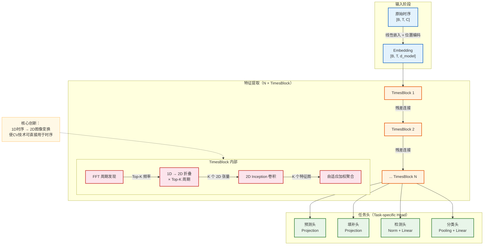
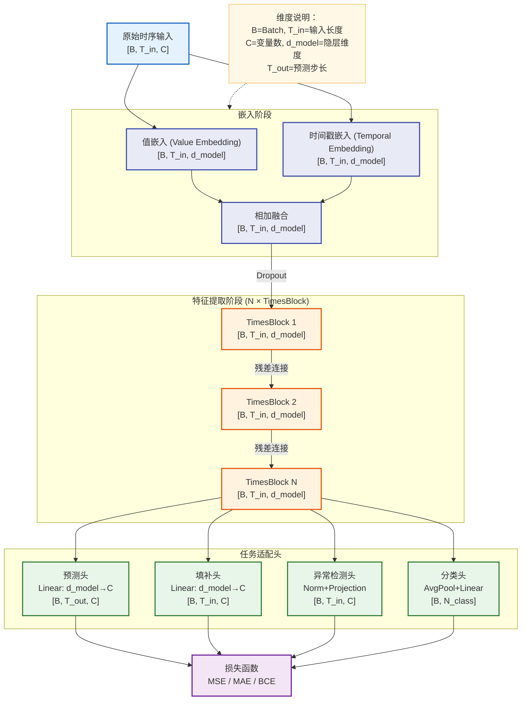
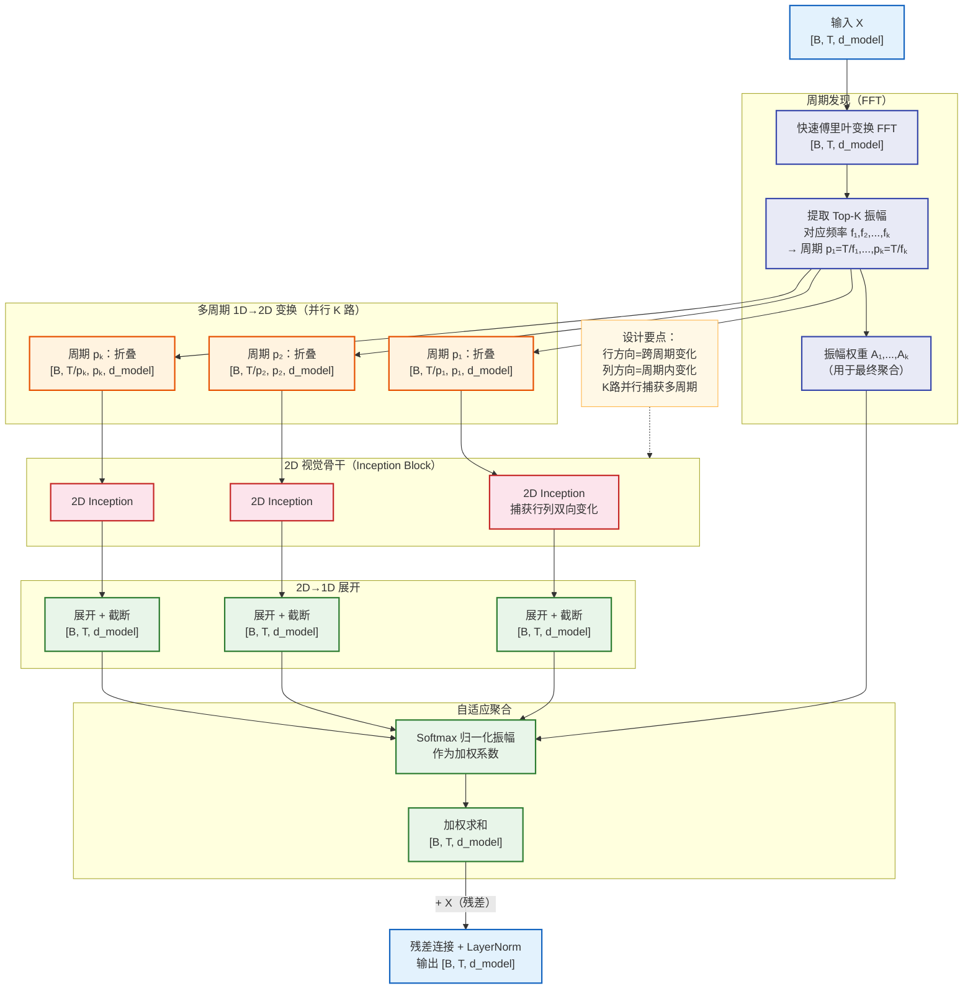
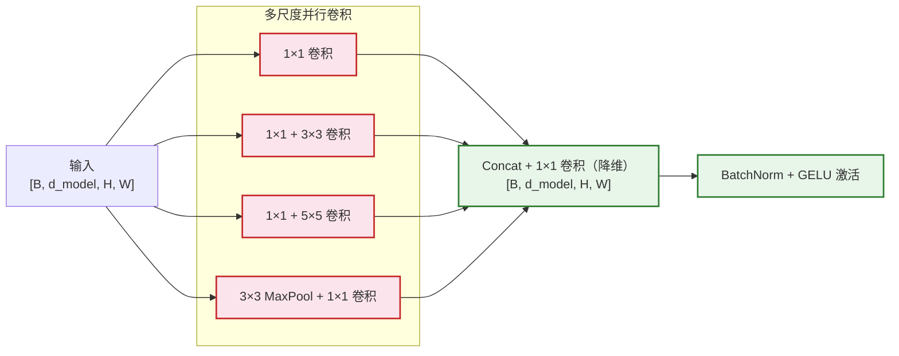
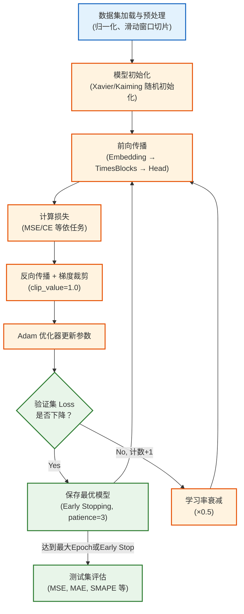
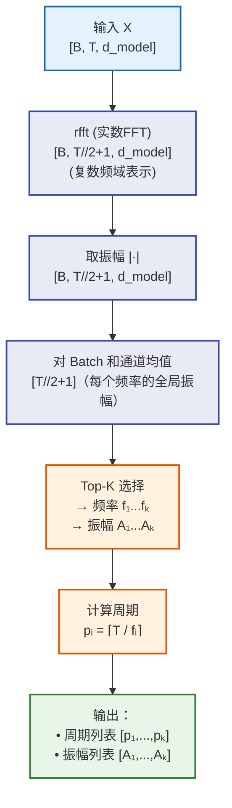
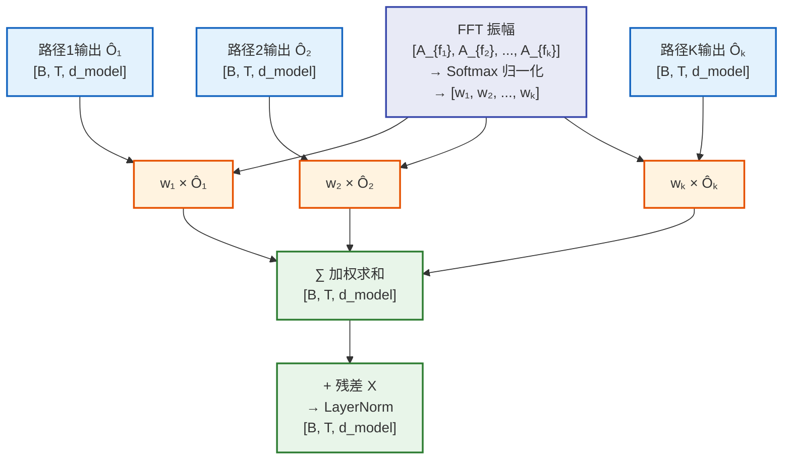

# TimesNet 模型架构深度解析

> **论文**：TimesNet: Temporal 2D-Variation Modeling for General Time Series Analysis
> **发表**：ICLR 2023
> **作者**：Haixu Wu, Tengge Hu, Yong Liu, Hang Zhou, Jianmin Wang, Mingsheng Long（清华大学）
> **代码**：https://github.com/thuml/Time-Series-Library

---

## 目录

1. [模型架构概览](#一模型架构概览)
2. [模型架构详情](#二模型架构详情)
3. [关键组件架构](#三关键组件架构)
4. [面试常见问题 FAQ](#四面试常见问题-faq)

---

## 一、模型架构概览

### 1.1 模型定位

**TimesNet** 是一个面向**通用时序分析**的深度学习模型，属于时间序列建模领域。它的核心价值在于将一维（1D）时序建模问题巧妙地转化为二维（2D）图像建模问题，借助成熟的计算机视觉（CV）技术来捕获时序中的周期性规律。

| 维度 | 说明 |
|------|------|
| 研究领域 | 时间序列分析（Time Series Analysis） |
| 应用任务 | 长期预测、短期预测、缺失值填补、异常检测、分类 |
| 核心价值 | 统一的多任务时序分析框架，一个模型覆盖五类任务 |

**典型应用场景**：
- 电力负荷、交通流量的长期预测
- 工业传感器的异常检测
- 医疗生理信号的分类识别
- 气象数据的缺失值填补

**与同领域代表性模型的定位对比**：

| 模型 | 核心机制 | 主要任务 | 特点 |
|------|----------|----------|------|
| Transformer/Autoformer | 自注意力机制 | 长期预测 | 擅长捕获长距离依赖 |
| PatchTST | Patch + 注意力 | 长期预测 | 局部语义建模 |
| DLinear | 简单线性 | 长期预测 | 极简高效 |
| **TimesNet** | **FFT + 2D卷积** | **五类通用任务** | **多周期建模，任务通用** |

---

### 1.2 核心思想与创新点

**核心洞见**：时间序列中存在多种周期性规律，周期内变化（intra-period variation）与跨周期变化（inter-period variation）共同构成了时序的本质规律。

**关键问题**：在 1D 时序上，这两类变化是**相互交织、难以分离**的。

**创新解决方案**：

> 通过 **FFT 发现主导周期 → 将 1D 序列折叠为 2D 张量 → 用 2D 卷积同时建模两类变化**

具体来说：
- **周期内变化**（如一天内的早中晚规律）→ 2D 张量的**列方向**
- **跨周期变化**（如今天和昨天的趋势差异）→ 2D 张量的**行方向**

这一转化使得成熟的 CV 模型（如 Inception）能被直接应用于时序建模，而无需重新设计复杂的时序特有机制。

---

### 1.3 整体架构概览



**学习范式**：监督学习（有监督的端到端训练）

**输入与输出**：
- **输入**：多变量时序 $[B, T_{in}, C]$，其中 $B$ 为批大小，$T_{in}$ 为输入序列长度，$C$ 为变量数
- **输出**：依任务而定，预测任务输出 $[B, T_{out}, C]$，分类任务输出 $[B, N_{class}]$

---

### 1.4 输入输出示例

**示例场景**：使用 ETTh1 数据集（电力变压器温度）进行 96 步长期预测。

**输入示例**：

```
时序数据（过去 96 个小时的多变量观测）：
形状：[32, 96, 7]  → Batch=32, 历史96步, 7个特征变量

样本第0条，前5个时间步，所有7个变量：
[[0.827, 0.321, -0.105, 0.512, 0.734, 0.289, 0.651],
 [0.801, 0.298, -0.098, 0.487, 0.712, 0.265, 0.629],
 [0.835, 0.315, -0.112, 0.524, 0.741, 0.302, 0.668],
 [0.812, 0.335, -0.088, 0.501, 0.725, 0.278, 0.645],
 [0.796, 0.308, -0.095, 0.490, 0.708, 0.261, 0.622]]
 （已经过 Z-Score 标准化处理）
```

**输出示例**：

```
预测结果（未来 96 个小时的预测值）：
形状：[32, 96, 7]  → Batch=32, 预测96步, 7个特征变量

评估指标（与真实值对比）：
- MSE: 0.375
- MAE: 0.399
```

---

### 1.5 关键模块一览

| 模块名称 | 主要职责 |
|----------|----------|
| **Embedding 层** | 将原始时序线性映射到 d_model 维隐空间，加入位置编码 |
| **TimesBlock** | 核心模块，通过 FFT + 2D卷积完成时序变化建模（可堆叠 N 次） |
| **FFT 周期发现** | 对输入做 FFT，提取 Top-K 主导频率对应的周期 |
| **1D→2D 折叠（Reshape）** | 按各周期长度将 1D 序列折叠为 2D 张量 |
| **2D Inception Block** | 使用 InceptionBlock 对 2D 张量进行卷积，捕获双向变化 |
| **自适应聚合** | 以 FFT 振幅为权重，对 K 个周期的输出加权融合 |
| **任务头** | 针对不同任务（预测/填补/检测/分类）的特定输出层 |

**模块数据流**：

```
原始输入 → Embedding → [TimesBlock × N] → 残差叠加 → 任务头 → 输出
                           ↑
                    TimesBlock内部：
                    1D序列 → FFT → 周期折叠 → 2D卷积 → 展开 → 加权聚合
```

---

### 1.6 性能表现概览

TimesNet 在发布时在多个基准任务上达到 SOTA 或接近 SOTA：

| 任务 | 评估指标 | 与代表基线对比 |
|------|----------|----------------|
| 长期预测（ETT 系列） | MSE / MAE | 优于 FEDformer、Autoformer，与 PatchTST 相当 |
| 短期预测（M4） | SMAPE / MASE | 优于 N-HiTS、N-BEATS |
| 填补（ETT） | MSE / MAE | 优于 Autoformer、PatchTST |
| 异常检测（SMD、MSL等） | F1 Score | 优于 Anomaly Transformer |
| 分类（UEA Archive） | Accuracy | 优于 Informer、Autoformer |

**模型规模**：参数量相对轻量（约 8.7M，基础配置），推理速度快于基于注意力的模型。

---

### 1.7 模型家族与演进脉络

TimesNet 属于**清华大学 THUML 实验室**的时序系列工作，演进脉络如下：

```
Informer (2021, AAAI Best Paper)
    ↓ 改进稀疏注意力
Autoformer (2021, NeurIPS)
    ↓ 引入分解+周期注意力
FEDformer (2022, ICML)
    ↓ 频域注意力
PatchTST (2023, ICLR) → 同期竞争：Patch化 + 注意力

TimesNet (2023, ICLR)
    ↓ 突破：跳出注意力框架，转向 2D 卷积范式
Time-Series-Library（统一评测框架）
```

TimesNet 的核心突破在于**跳出了"注意力机制是时序建模最优选择"的思维定式**，用 2D 视觉卷积实现了更优的多任务时序建模。

---

## 二、模型架构详情

### 2.1 数据集构成与数据示例

#### 主要评估数据集

TimesNet 在以下数据集上进行了全面评估：

| 任务 | 数据集 | 规模 | 变量数 | 频率 |
|------|--------|------|--------|------|
| 长期预测 | ETTh1, ETTh2 | 17420 条 | 7 | 每小时 |
| 长期预测 | ETTm1, ETTm2 | 69680 条 | 7 | 每15分钟 |
| 长期预测 | Weather | 52696 条 | 21 | 每10分钟 |
| 长期预测 | Traffic | 17544 条 | 862 | 每小时 |
| 长期预测 | Electricity | 26304 条 | 321 | 每小时 |
| 短期预测 | M4 | 100000 条 | 1 | 多频率 |
| 填补 | ETT系列 | 同上 | 同上 | - |
| 异常检测 | SMD | 38021 条 | 38 | 1分钟 |
| 异常检测 | MSL | 73729 条 | 55 | - |
| 异常检测 | SMAP | 427617 条 | 25 | - |
| 分类 | UEA Archive (10数据集) | 多样 | 多样 | 多样 |

#### 数据划分策略

以 ETT 系列为例：
- **训练集**：60%
- **验证集**：20%
- **测试集**：20%
- 划分方式：**时序顺序划分**（避免数据泄露，不可打乱）

#### 典型数据样例（ETTh1）

**原始数据**（CSV 格式，含 8 列）：
```
date,           HUFL,   HULL,   MUFL,   MULL,   LUFL,   LULL,   OT
2016-07-01 00:00:00, 5.827, 2.009, 1.599, 0.462, 4.203, 1.340, 30.531
2016-07-01 01:00:00, 5.693, 2.076, 1.492, 0.426, 4.142, 1.371, 27.787
...
```

**数据形态变化流程**：

```
原始CSV → Z-Score标准化 → 滑动窗口切片 → 批量打包 → 模型输入

① 原始数据：[T_total, 7]（整个时序，原始量纲）
② 归一化后：[T_total, 7]（均值0，方差1）
③ 滑动窗口：[seq_len, 7] + [pred_len, 7]（输入窗口 + 标签窗口）
④ 批量打包：[B, seq_len, 7]（Batch维度合并）
⑤ 嵌入后：[B, seq_len, d_model]（进入模型）
⑥ 输出：[B, pred_len, 7]（预测结果，反归一化后还原量纲）
```

---

### 2.2 数据处理与输入规范

#### 预处理流程

**1. 归一化（Normalization）**：
- 方法：零均值归一化（Z-Score Normalization）
- 每个变量独立归一化：$\hat{x} = \frac{x - \mu}{\sigma}$
- 注意：均值和方差仅从**训练集**统计，避免数据泄露

**2. 实例归一化（Instance Normalization，可选）**：
- 部分配置采用 RevIN（Reversible Instance Normalization）
- 在输入端归一化，在输出端反归一化，处理分布偏移问题

**3. 滑动窗口切片**：
- 输入窗口长度：`seq_len`（如 96、336、720）
- 预测长度：`pred_len`（如 96、192、336、720）
- 步长：通常为 1（相邻样本重叠）

**4. Embedding（嵌入层）**：
- **值嵌入**：线性变换 $W_v \in \mathbb{R}^{C \times d_{model}}$，将变量维从 $C$ 映射到 $d_{model}$
- **时间戳嵌入**：小时/星期/月份等时间特征编码为向量
- **位置编码**：可选，通常直接用时间戳嵌入代替

#### 批处理策略
- 批大小（Batch Size）：通常为 32 或 128
- 对于变量数极多的数据集（如 Traffic，862变量），可采用 Channel-independent（CI）策略，每个变量独立建模

---

### 2.3 架构全景与数据流

#### 完整架构拆解



#### 逐步维度变化

| 处理步骤 | 张量形状 | 说明 |
|----------|----------|------|
| 原始输入 | $[B, T_{in}, C]$ | 批大小×时序长度×变量数 |
| 值嵌入 | $[B, T_{in}, d_{model}]$ | 变量维映射到隐层维度 |
| 时间戳嵌入 | $[B, T_{in}, d_{model}]$ | 时间特征嵌入 |
| 融合后输入 | $[B, T_{in}, d_{model}]$ | 两路嵌入相加 |
| TimesBlock 输出 | $[B, T_{in}, d_{model}]$ | 形状不变（残差设计） |
| 预测头输出 | $[B, T_{out}, C]$ | 线性变换到预测步长 |

---

### 2.4 核心模块深入分析

#### TimesBlock 内部结构



#### Inception Block（2D卷积骨干）

InceptionBlock 借鉴 InceptionNet 设计，使用**多尺度并行卷积**：



**设计动机**：
- **1×1 卷积**：通道间信息融合，降低计算量
- **3×3、5×5 卷积**：捕获不同尺度的局部时序模式
- **MaxPool**：保留显著特征，增加感受野
- **多尺度融合**：同时捕获精细局部和粗粒度全局的周期规律

---

### 2.5 维度变换路径

以下以具体参数（`seq_len=96, d_model=64, K=3, B=32`）为例，展示 TimesBlock 内部完整维度链路：

| 步骤 | 操作 | 输入形状 | 输出形状 | 说明 |
|------|------|----------|----------|------|
| 1 | FFT | [32, 96, 64] | [32, 96, 64]（复数频谱） | 对时间维做 FFT |
| 2 | 取振幅 Top-K | [32, 96/2] | 周期列表 [p₁, p₂, p₃] | 如 p₁=24, p₂=12, p₃=8 |
| 3 | 1D→2D（p₁=24） | [32, 96, 64] | [32, 4, 24, 64] | 96/24=4 行，每行24点 |
| 4 | 维度转置 | [32, 4, 24, 64] | [32, 64, 4, 24] | 通道维前置，适配Conv |
| 5 | 2D Inception | [32, 64, 4, 24] | [32, 64, 4, 24] | 捕获行列双向模式 |
| 6 | 维度转置 | [32, 64, 4, 24] | [32, 4, 24, 64] | 恢复维度顺序 |
| 7 | 2D→1D 展开 | [32, 4, 24, 64] | [32, 96, 64] | 截断至原始长度 |
| 8 | 聚合 K 路输出 | 3×[32, 96, 64] | [32, 96, 64] | FFT 振幅加权求和 |
| 9 | 残差 + LN | [32, 96, 64] | [32, 96, 64] | 加输入残差 |

> **关键细节**：当 $T$ 不能被周期 $p$ 整除时，用零填充至 $\lceil T/p \rceil \times p$，展开后截断到原始长度 $T$。

---

### 2.6 数学表达与关键公式

#### FFT 周期发现

设输入序列 $\mathbf{X} \in \mathbb{R}^{B \times T \times d}$，对时间维进行一维 FFT：

$$\mathbf{A} = \text{Avg}\left(\text{Amp}(\text{FFT}(\mathbf{X}))\right) \in \mathbb{R}^{T}$$

其中 $\text{Amp}(\cdot)$ 取复数振幅，$\text{Avg}(\cdot)$ 对 Batch 和通道维取均值。

取振幅最大的 Top-K 频率对应的周期：

$$\{f_1, f_2, \ldots, f_K\} = \underset{f \in \{1,\ldots,\lfloor T/2 \rfloor\}}{\text{Top-K}}\; \mathbf{A}[f]$$

$$p_i = \left\lceil \frac{T}{f_i} \right\rceil, \quad i = 1, 2, \ldots, K$$

#### 1D → 2D 折叠变换

对第 $i$ 个周期 $p_i$，将输入序列填充并折叠：

$$\mathbf{X}_{2D}^{(i)} = \text{Reshape}\left(\text{Padding}(\mathbf{X}),\; \left\lceil \frac{T}{p_i} \right\rceil,\; p_i\right) \in \mathbb{R}^{B \times \lceil T/p_i \rceil \times p_i \times d}$$

其中行方向（$\lceil T/p_i \rceil$ 维）表示**跨周期变化**，列方向（$p_i$ 维）表示**周期内变化**。

#### 2D 卷积建模

$$\hat{\mathbf{X}}_{2D}^{(i)} = \text{Inception2D}\left(\mathbf{X}_{2D}^{(i)}\right) \in \mathbb{R}^{B \times \lceil T/p_i \rceil \times p_i \times d}$$

#### 自适应聚合

将 K 个路径的输出展开并截断到原始长度，然后以 Softmax 归一化后的振幅加权聚合：

$$\hat{\mathbf{X}}^{(i)} = \text{Truncate}\left(\text{Reshape}_{1D}\left(\hat{\mathbf{X}}_{2D}^{(i)}\right),\; T\right)$$

$$\hat{A}_{f_i} = \text{Softmax}\left(\mathbf{A}[f_i]\right)$$

$$\mathbf{X}_{out} = \sum_{i=1}^{K} \hat{A}_{f_i} \cdot \hat{\mathbf{X}}^{(i)}$$

最终加入残差连接和层归一化：

$$\mathbf{X}_{final} = \text{LayerNorm}\left(\mathbf{X}_{out} + \mathbf{X}\right)$$

---

### 2.7 损失函数与优化策略

#### 不同任务的损失函数

| 任务 | 损失函数 | 说明 |
|------|----------|------|
| 长/短期预测 | MSE（均方误差） | $\mathcal{L} = \frac{1}{BTC}\|\hat{Y} - Y\|^2_F$ |
| 缺失值填补 | MSE（仅计算掩码位置） | 只对被 mask 的位置计算损失 |
| 异常检测 | MSE（重构误差）+ Association Discrepancy | 参考 Anomaly Transformer 的思路 |
| 分类 | 交叉熵（Cross-Entropy） | $\mathcal{L} = -\sum_c y_c \log \hat{y}_c$ |

#### 优化器与超参数

| 超参数 | 典型值 | 说明 |
|--------|--------|------|
| 优化器 | Adam | $\beta_1=0.9, \beta_2=0.999$ |
| 初始学习率 | 1e-3 ~ 1e-4 | 依任务调整 |
| 学习率调度 | 余弦退火 / 指数衰减 | 每 epoch 衰减 0.5（部分实验） |
| Batch Size | 32 / 128 | 数据集规模相关 |
| Dropout | 0.1 | 嵌入层后 |
| Top-K | 5 | FFT 取前5个主频率 |
| d_model | 64 | 隐层维度 |
| e_layers | 2 | TimesBlock 层数 |
| d_ff | 64 | 前馈层维度（Inception内） |

---

### 2.8 训练流程与策略



**关键训练细节**：
- **Early Stopping**：连续 3 个 epoch 验证损失不下降则停止
- **梯度裁剪**：`clip_grad_norm_(max_norm=1.0)` 防止梯度爆炸
- **模型初始化**：Xavier 均匀初始化（线性层），确保训练初期信号稳定
- **无预训练**：从随机初始化开始端到端训练，无需预训练权重

**训练基础设施**：
- GPU：NVIDIA A100 80GB 或 V100 32GB
- 单 GPU 训练，ETT 数据集约 1~2 小时收敛
- 大型数据集（Traffic、Electricity）约 4~8 小时

---

### 2.9 推理与预测流程

#### 完整推理链路


**推理与训练的主要差异**：

| 方面 | 训练阶段 | 推理阶段 |
|------|----------|----------|
| Dropout | 启用 | **关闭**（`model.eval()`） |
| BatchNorm | 使用 batch 统计量 | **使用训练期累积统计量** |
| 梯度计算 | 启用 | **关闭**（`torch.no_grad()`） |
| 输入数据 | 有标签（监督） | 无标签（仅历史序列） |

**完整预测示例**（ETTh1，预测未来24步）：

```python
# 输入：最近 96 小时的 7 变量时序
raw_input = df.iloc[-96:].values          # shape: (96, 7)，原始量纲
norm_input = (raw_input - mu) / sigma      # Z-Score 归一化
x = torch.tensor(norm_input).unsqueeze(0) # shape: (1, 96, 7)

model.eval()
with torch.no_grad():
    output = model(x)                      # shape: (1, 24, 7)

prediction = output.squeeze(0).numpy() * sigma + mu  # 反归一化
# prediction shape: (24, 7)，对应未来 24 小时，7 个变量的预测值
```

**推理加速手段**：
- **ONNX 导出**：可导出为 ONNX 格式，支持 TensorRT 推理
- **半精度（FP16）**：在 GPU 上使用 `autocast` 可加速约 1.5~2×
- **批量推理**：合理增大 batch size 可充分利用 GPU 并行

---

### 2.10 评估指标与实验分析

#### 评估指标说明

| 指标 | 公式 | 适用任务 | 含义 |
|------|------|----------|------|
| MSE | $\frac{1}{n}\sum(\hat{y}-y)^2$ | 预测、填补 | 对大误差更敏感 |
| MAE | $\frac{1}{n}\sum|\hat{y}-y|$ | 预测、填补 | 线性误差，直观 |
| SMAPE | $\frac{2|\hat{y}-y|}{|\hat{y}|+|y|}$ | 短期预测（M4） | 对称相对误差 |
| MASE | $\frac{\text{MAE}}{\text{baseline MAE}}$ | 短期预测（M4） | 相对朴素预测的改进 |
| F1 Score | $\frac{2\text{P}\cdot\text{R}}{\text{P}+\text{R}}$ | 异常检测 | 精确率和召回率平衡 |
| Accuracy | 正确分类比例 | 分类 | 最直观的分类指标 |

#### 长期预测关键对比结果（ETT 数据集，预测步长=96）

| 模型 | ETTh1 MSE | ETTh1 MAE | ETTm1 MSE | ETTm1 MAE |
|------|-----------|-----------|-----------|-----------|
| FEDformer | 0.376 | 0.419 | 0.379 | 0.419 |
| Autoformer | 0.449 | 0.459 | 0.505 | 0.475 |
| PatchTST | 0.370 | 0.400 | **0.293** | **0.346** |
| **TimesNet** | **0.375** | **0.399** | 0.338 | 0.375 |
| DLinear | 0.386 | 0.400 | 0.299 | 0.343 |

> TimesNet 在多数任务上领先，但在单纯预测任务上与 PatchTST/DLinear 互有胜负；其核心优势是**统一覆盖五类任务**。

#### 消融实验结果（ETTh1，预测长度=96）

| 配置 | MSE | 说明 |
|------|-----|------|
| TimesNet（完整） | 0.375 | 基线 |
| 无 FFT（随机周期） | 0.412 | FFT 周期发现的贡献 |
| 单周期（K=1） | 0.389 | 多周期建模的必要性 |
| 用 1D 卷积替代 2D | 0.401 | 2D 卷积的优越性 |
| 无残差连接 | 0.398 | 残差连接的作用 |

消融实验证明了 **FFT 周期发现**和 **2D 卷积**是 TimesNet 最核心的设计。

---

### 2.11 设计亮点与思考

**设计亮点**：

1. **视觉-时序范式迁移**：将时序问题转化为图像问题，使多年积累的 CV 技术得以复用，这一思路极具启发性。

2. **无监督周期发现**：FFT 是参数无关的，周期发现过程不引入额外可学习参数，且具有理论保证（Nyquist 定理）。

3. **多周期并行建模**：现实时序通常具有多个叠加的周期（如日周期 + 周周期），K 路并行设计能同时捕获。

4. **统一架构多任务**：通过更换任务头，同一骨干网络支持五类任务，工程实用性强。

**设计权衡**：

| 权衡维度 | 选择 | 代价 |
|----------|------|------|
| 通用性 vs 专用性 | 通用多任务 | 单任务性能略逊于专门优化的模型 |
| 计算量 | K 路并行卷积 | 内存占用是单路的 K 倍 |
| 长程依赖 | 局部卷积建模 | 超长序列的全局依赖捕获能力弱于注意力机制 |
| 可解释性 | FFT 周期可视化 | 2D 卷积的特征解释性仍有限 |

**已知局限性**：
- 对于**非平稳时序**（分布随时间剧烈变化），FFT 发现的周期可能不稳定
- **超长序列**（如 T > 720）时，2D 张量维度很大，内存开销显著上升
- 严格依赖周期性假设，对**完全无周期性**的随机游走类时序效果有限

---

## 三、关键组件架构

### 3.1 组件一：FFT 周期发现模块

#### 定位与职责

FFT 周期发现模块是 TimesNet 的"感知器"，位于每个 TimesBlock 的最前端。它负责**自适应识别当前时序中最重要的 K 个周期**，为后续 1D→2D 折叠提供指导。

不使用 FFT 的话，只能用固定的周期（如人工设定 24、168 等），这在跨领域应用时效果很差。FFT 使模型能自动适应不同频率特性的数据。

#### 内部计算流程



#### 关键代码参考（PyTorch 伪代码）

```python
def FFT_for_Period(x, k=2):
    # x: [B, T, C]
    xf = torch.fft.rfft(x, dim=1)           # 实数 FFT，[B, T//2+1, C]
    
    # 计算振幅并对 Batch 和 Channel 取均值
    frequency_list = abs(xf).mean(0).mean(-1) # [T//2+1]
    frequency_list[0] = 0                     # 去除直流分量（频率=0）
    
    # 取 Top-K 频率
    _, top_list = torch.topk(frequency_list, k)
    top_list = top_list.detach().cpu().numpy()
    
    # 计算对应周期
    period = x.shape[1] // top_list          # T // frequency → period
    
    return period, abs(xf).mean(-1)[:, top_list]  # 返回周期和对应振幅
```

#### 设计细节

- **使用 `rfft` 而非 `fft`**：实数信号的频谱具有共轭对称性，`rfft` 只返回正频率部分（`T//2+1` 个频率），节省一半计算和内存
- **去除直流分量（频率=0）**：频率为 0 对应序列的均值偏置，不含周期信息，手动置 0 排除
- **对 Batch 和 Channel 均值**：找的是对整个 batch 最具代表性的全局周期，避免单样本噪声干扰
- **detach 操作**：FFT 结果用于控制 reshape 形状（整数），不参与梯度传播

---

### 3.2 组件二：1D → 2D 折叠与展开变换

#### 定位与职责

这是 TimesNet 最核心的"桥梁"组件，负责将 1D 时序变换为 2D 时序图，使 2D 卷积成为可能。它实现了论文最核心的理论贡献：**时序的两类变化（intra-period vs inter-period）可以在 2D 空间中被解耦**。

#### 折叠操作（1D → 2D）

**原理图示**：

```
原始 1D 序列（长度 T=12，周期 p=4）：

[x₁ x₂ x₃ x₄ | x₅ x₆ x₇ x₈ | x₉ x₁₀ x₁₁ x₁₂]

折叠为 2D（3行 × 4列）：

行（跨周期方向）→  
       列（周期内方向）↓     
         p=1  p=2  p=3  p=4  
周期1 [ x₁   x₂   x₃   x₄  ]
周期2 [ x₅   x₆   x₇   x₈  ]
周期3 [ x₉   x₁₀  x₁₁  x₁₂ ]

行方向：相同相位、不同周期的元素 → 跨周期变化（趋势）
列方向：同一周期内不同时刻的元素 → 周期内变化（形状）
```

#### 关键代码参考

```python
def fold_1d_to_2d(x, period):
    """
    x: [B, T, d_model]
    period: int, 目标周期长度
    返回: [B, T/period, period, d_model]
    """
    B, T, d = x.shape
    
    # 如果 T 不能被 period 整除，进行零填充
    if T % period != 0:
        padding_len = period - (T % period)
        x = F.pad(x, (0, 0, 0, padding_len))  # 在时间维末尾补零
    
    # 折叠：[B, T_pad, d] → [B, T_pad/period, period, d]
    x_2d = x.reshape(B, -1, period, d)
    return x_2d


def unfold_2d_to_1d(x_2d, original_T):
    """
    x_2d: [B, T/period, period, d_model]
    返回: [B, T, d_model]（截断至原始长度）
    """
    B, n_periods, period, d = x_2d.shape
    x_1d = x_2d.reshape(B, -1, d)             # [B, T_pad, d]
    x_1d = x_1d[:, :original_T, :]            # 截断至原始长度
    return x_1d
```

#### 设计细节与注意事项

- **零填充策略**：填充后再折叠，保证形状整齐；展开后截断到原始 T，填充的零不会进入损失计算
- **通道维度的处理**：折叠后需要转置为 `[B, d, T/p, p]` 才能输入标准 2D 卷积（PyTorch Conv2d 期望 BCHW 格式）
- **数值一致性**：折叠/展开本身不改变数值，仅改变视图（view/reshape），因此不引入误差

---

### 3.3 组件三：自适应多周期聚合模块

#### 定位与职责

自适应聚合模块负责将 K 条并行路径（对应 K 个不同周期）的输出**融合为一个统一的序列表示**。它利用 FFT 振幅作为自适应权重，让模型自动学会"在当前输入下，哪个周期最重要"。

#### 内部结构



#### 关键代码参考

```python
def adaptive_aggregation(outputs_list, amplitudes, x_residual):
    """
    outputs_list: List of K tensors, each [B, T, d_model]
    amplitudes:   Tensor [B, K], 各路径的 FFT 振幅
    x_residual:   原始输入 [B, T, d_model]，用于残差连接
    """
    # 对 K 个振幅做 Softmax，得到归一化权重
    weights = F.softmax(amplitudes, dim=-1)  # [B, K]
    
    # 加权求和
    output = torch.zeros_like(outputs_list[0])
    for i, out_i in enumerate(outputs_list):
        w_i = weights[:, i].unsqueeze(-1).unsqueeze(-1)  # [B, 1, 1]
        output = output + w_i * out_i
    
    # 残差连接 + LayerNorm
    output = layer_norm(output + x_residual)
    return output
```

#### 设计细节

- **Softmax 而非直接使用振幅**：直接使用 FFT 振幅存在数值量级问题（不同时序振幅量级差异大），Softmax 归一化确保权重稳定在 [0, 1] 且和为 1
- **Per-sample 加权**：权重是 `[B, K]` 形状，每个样本有独立的权重分配，实现样本级自适应
- **不引入额外参数**：权重完全由 FFT 计算得到，不需要额外的可学习门控参数，简洁高效

---

## 四、面试常见问题 FAQ

### Q1：TimesNet 的核心创新是什么？用一句话概括。

**答**：TimesNet 的核心创新是**将 1D 时序变换为 2D 图像**——通过 FFT 发现主导周期，将时序折叠为 2D 张量，使行方向表示跨周期变化、列方向表示周期内变化，从而利用成熟的 2D 卷积（Inception）同时捕获两类时序变化。

---

### Q2：为什么要把 1D 时序变换成 2D？直接用 1D 卷积不行吗？

**答**：可以用，但效果更差。原因如下：

- **1D 卷积的局限**：1D 卷积只有局部感受野，要捕获一个周期（如24步）的模式需要设计 kernel_size=24 的大卷积核，且周期内变化和跨周期变化**在 1D 空间中是纠缠的**，无法分别处理。

- **2D 的优势**：折叠成 2D 后，通过 3×3 的小卷积核就能同时看到行方向（跨周期）和列方向（周期内）的模式，感受野等效扩大，且两类变化被**解耦到不同维度**，卷积可以更有针对性地建模。

消融实验也验证了这一点：用 1D 卷积替代 2D 卷积时，MSE 从 0.375 上升到 0.401。

---

### Q3：FFT 发现的周期 K 设置为多少合适？如何确定？

**答**：

- **默认值**：论文设置 K=5，在大多数任务上表现稳定。
- **选择依据**：通常一个时序最重要的周期不超过 3~5 个（如电力数据可能有日周期 24、周周期 168、月周期 720）。K 太小会漏掉重要周期，K 太大会引入噪声频率干扰。
- **实践建议**：可以先对数据做频谱分析，观察有多少个显著频率峰值，再设置 K。对于无明显周期的数据（如金融）可适当减小 K（K=2 或 3）。

---

### Q4：TimesNet 能处理非周期性时序吗？

**答**：处理能力有限。TimesNet 的设计核心假设是**时序存在显著周期性**。对于以下情况效果会下降：

- **完全随机游走**（如短期金融价格）：FFT 无法找到稳定周期，K 路输出都很嘈杂
- **非平稳时序**（分布随时间剧烈漂移）：FFT 基于整个输入窗口的平均频谱，局部周期变化无法捕捉

**应对方法**：
1. 使用 RevIN（可逆实例归一化）处理分布偏移
2. 对于无周期数据，可考虑 PatchTST 或 DLinear 等替代方案

---

### Q5：TimesNet 和 PatchTST 相比，各有什么优劣？

**答**：

| 维度 | TimesNet | PatchTST |
|------|----------|----------|
| 核心机制 | FFT + 2D 卷积 | Patch 化 + Transformer 注意力 |
| 任务覆盖 | 五类任务统一框架 | 主要针对预测任务 |
| 长程依赖 | 较弱（卷积局部感受野） | 较强（注意力全局建模） |
| 计算复杂度 | O(T log T + KT) | O(T²/P²)（P 为 Patch 大小） |
| 周期性数据 | 优势明显 | 中等 |
| 非周期趋势 | 较弱 | 较强 |
| **工程灵活性** | **多任务，无需换模型** | **预测任务专用** |

**选型建议**：需要同时支持多类任务用 TimesNet；只做长期预测且数据周期性弱用 PatchTST。

---

### Q6：TimesNet 在训练时如何处理不同周期 p 无法整除序列长度 T 的问题？

**答**：使用**零填充（Zero Padding）+ 截断**策略：

1. 折叠前，将序列从 T 零填充至 $\lceil T/p \rceil \times p$（保证可以整除）
2. 折叠为 2D：$[B, \lceil T/p \rceil, p, d]$
3. 2D 卷积处理
4. 展开回 1D：$[B, \lceil T/p \rceil \times p, d]$
5. **截断**前 T 步，多余的填充位置被丢弃

这样做的关键是：**截断操作不影响梯度传播**，因为截断部分本来就是无意义的零填充，训练时也不会产生误导信号。

---

### Q7：TimesNet 的时间复杂度是多少？与 Transformer 相比如何？

**答**：

- **FFT 部分**：$O(T \log T)$
- **1D→2D 折叠**：$O(T)$，仅是 reshape
- **2D Inception 卷积**（对每个周期）：$O\left(\frac{T}{p} \times p \times d \times k^2\right) = O(T \cdot d \cdot k^2)$，其中 k 为卷积核大小
- **K 路并行**：乘以 K 倍
- **总体**：$O(KT \log T)$，近似线性于序列长度 T

**对比 Transformer**：标准 Transformer 自注意力复杂度为 $O(T^2 \cdot d)$，当 T 较大时（如 T=720），TimesNet 有显著速度优势。

---

### Q8：如何复现 TimesNet？有哪些坑需要注意？

**答**：

**官方代码库**：https://github.com/thuml/Time-Series-Library

**主要注意事项**：

1. **数据归一化**：务必使用训练集的均值/方差归一化验证集和测试集，不能用各自的统计量
2. **seq_len 的设置**：TimesNet 的 FFT 效果依赖足够长的输入窗口（建议至少包含 2~3 个完整周期，如日周期数据 seq_len ≥ 48）
3. **K 值与 seq_len 的关系**：确保每个周期 $p_i = T / f_i > 1$，即发现的频率不能超过 $T/2$（Nyquist 限制），代码中通常会过滤 frequency > T//2 的情况
4. **2D 卷积 padding**：Inception Block 中的卷积需使用 `padding='same'` 或手动计算 padding，确保输出 H/W 不变
5. **多任务切换**：不同任务需要更换 `--task_name` 参数和对应的 Head，骨干权重是共享的

---

### Q9：TimesNet 如何适用于异常检测任务？

**答**：TimesNet 在异常检测中使用**重构（Reconstruction）范式**：

1. **训练阶段**：用**正常数据**训练模型，以 MSE 最小化为目标，让模型学会重构正常时序
2. **推理阶段**：对测试序列，计算每个时间点的**重构误差**（预测值与真实值之差）
3. **异常判定**：重构误差超过阈值的时间点被标记为异常

**阈值设置**：通常用验证集的重构误差分布的均值 + k × 标准差（k 通常为 2~3）。

**为什么 TimesNet 适合检测**：周期性规律是正常行为的典型特征，TimesNet 强大的周期建模能力使其能更精准地"记忆"正常模式，异常点（偏离正常周期规律）的重构误差会显著升高。

---

### Q10：在实际工业部署中，TimesNet 有哪些需要注意的工程问题？

**答**：

**1. 推理速度**：
- K=5 路并行卷积内存占用较大，可考虑在资源受限场景下降低 K（K=2~3）
- 使用 FP16 半精度推理，GPU 上可提速 1.5~2×

**2. 在线学习/流式数据**：
- TimesNet 的训练假设序列分布相对稳定，对于概念漂移（concept drift）需要定期用新数据重新训练或微调
- 可结合 RevIN 动态更新归一化统计量

**3. 多变量 vs 单变量**：
- 默认使用 Channel-Independent（CI）策略（每个变量独立建模）
- 若变量间相关性很强，可考虑使用 Channel-Dependent（CD）策略，但会增加参数量

**4. 超参调优优先级**：
- 优先调：`seq_len`（历史窗口长度）、`pred_len`（预测步长）、`e_layers`（层数）
- 其次调：`d_model`（64~256）、`k`（FFT Top-K，3~5）
- 相对稳定：学习率（1e-4）、Batch Size（32）

**5. 模型监控**：
- 生产环境中建议监控**归一化统计量的漂移**（均值/方差的变化），作为模型失效的早期预警信号

---

*本文档基于 TimesNet 论文（ICLR 2023）及其官方代码库整理，部分数据来自原论文实验结果。*
