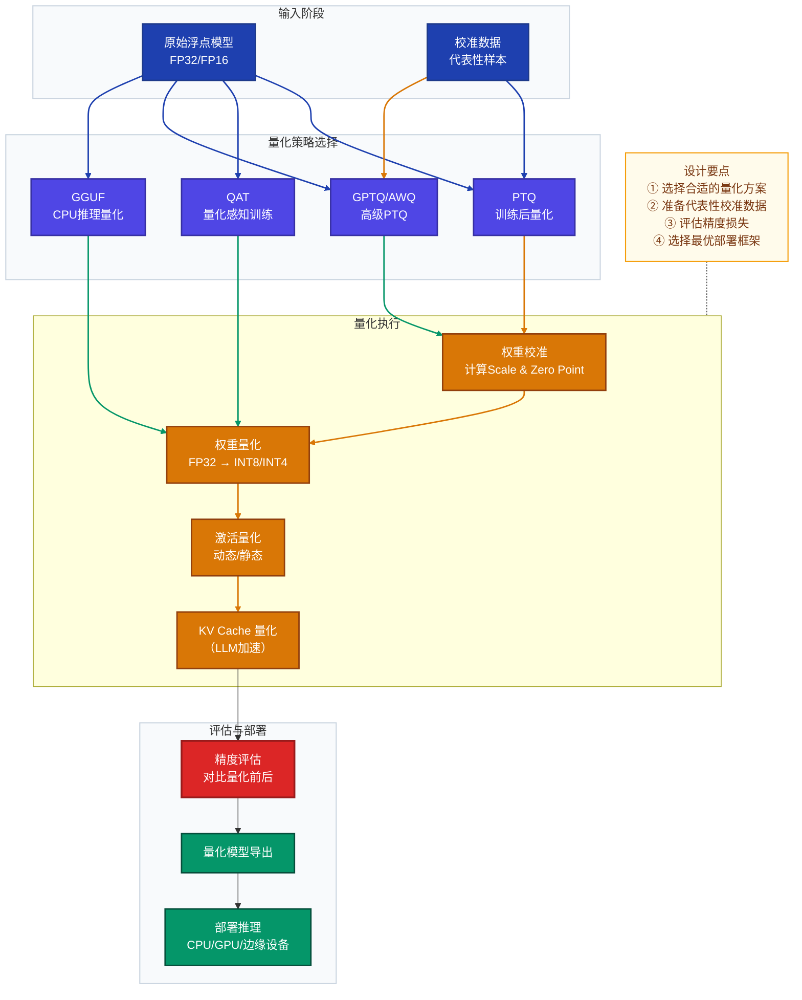

# 模型量化原理与实践指南

> **适用读者**：具备基础深度学习知识，希望了解模型量化技术的工程师与研究者。
> **文档结构**：涵盖量化原理、应用方法、常见问题、注意事项、完整流程和面试FAQ，并配有Mermaid流程图辅助理解。

---

## 目录

1. [模型量化的原理及其应用方法](#1-模型量化的原理及其应用方法)
2. [模型量化中常见问题及解决方案](#2-模型量化中常见问题及解决方案)
3. [模型量化中注意事项](#3-模型量化中注意事项)
4. [完整的模型量化流程](#4-完整的模型量化流程)
5. [面试常见问题（FAQ）](#5-面试常见问题faq)

---

## 1. 模型量化的原理及其应用方法

### 1.1 基本概念与原理

**模型量化**是将浮点数（通常为 FP32 或 FP16）表示的模型权重和激活值，映射到低比特整数（INT8、INT4、INT2 等）表示的过程，从而减少内存占用和推理延迟，同时尽量保持模型精度。

#### 核心数学原理

量化的核心操作是线性映射（仿射量化）：

$$x_q = \text{round}\left(\frac{x}{\Delta}\right) + z$$

$$x_{\text{dequant}} = \Delta \cdot (x_q - z)$$

其中：
- $\Delta$（Scale）：缩放因子，$\Delta = \frac{x_{\max} - x_{\min}}{2^b - 1}$
- $z$（Zero Point）：零点偏移
- $b$：量化比特数
- 量化误差：$\epsilon = x - x_{\text{dequant}}$

#### 量化方案对比

| 方案 | 时机 | 精度损失 | 计算开销 | 适用场景 |
|------|------|---------|---------|----------|
| PTQ（训练后量化） | 推理前，无需训练 | 中等 | 极低（无需 GPU）| 快速部署、资源受限场景 |
| QAT（量化感知训练） | 训练中模拟量化 | 最低 | 高（需重新训练）| 精度要求极高场景 |
| GPTQ（逐层二阶量化） | PTQ，逐层二阶优化 | 低 | 中等 | LLM 显存受限场景 |
| AWQ（激活感知权重量化） | PTQ，激活感知权重量化 | 低 | 中等 | 生产级 LLM 部署 |
| GGUF/GGML | 面向 CPU 推理的 k-quant | 可调 | 极低 | 边缘设备、本地推理 |

### 1.2 模型量化流程图



### 1.3 应用方法与示例

#### 1.3.1 PTQ（训练后量化）示例

**适用场景**：快速部署、资源受限、无时间重新训练的场景。

**示例代码**：使用 `bitsandbytes` 进行 INT8 量化

```python
import torch
from transformers import AutoModelForCausalLM, AutoTokenizer, BitsAndBytesConfig

# 1. 配置 INT8 量化参数
quantization_config = BitsAndBytesConfig(
    load_in_8bit=True,           # 启用 INT8 量化
    llm_int8_threshold=6.0,      # 离群值阈值（超过此值保留 FP16）
    llm_int8_has_fp16_weight=False,
)

model_name = "meta-llama/Llama-2-7b-hf"

# 2. 加载量化模型（自动完成 PTQ）
tokenizer = AutoTokenizer.from_pretrained(model_name)
model = AutoModelForCausalLM.from_pretrained(
    model_name,
    quantization_config=quantization_config,
    device_map="auto",
)

# 3. 查看量化效果（内存对比）
print(f"量化后模型内存: {model.get_memory_footprint() / 1e9:.2f} GB")
# FP16 约 14GB → INT8 约 7GB

# 4. 正常推理（接口与原始模型完全相同）
inputs = tokenizer("请解释什么是量化：", return_tensors="pt").to("cuda")
with torch.no_grad():
    outputs = model.generate(**inputs, max_new_tokens=200)
print(tokenizer.decode(outputs[0], skip_special_tokens=True))
```

#### 1.3.2 GPTQ 量化示例

**适用场景**：LLM 显存严重不足、追求极致压缩比的 GPU 部署场景。

**示例代码**：使用 `auto-gptq` 进行 INT4 量化

```python
from auto_gptq import AutoGPTQForCausalLM, BaseQuantizeConfig
from transformers import AutoTokenizer
from datasets import load_dataset

model_name = "Qwen/Qwen2.5-7B-Instruct"
tokenizer = AutoTokenizer.from_pretrained(model_name)

# 1. 准备校准数据（128 条样本）
calibration_dataset = load_dataset("wikitext", "wikitext-2-raw-v1", split="train")
calibration_data = [
    tokenizer(text, return_tensors="pt", max_length=512, truncation=True)["input_ids"]
    for text in calibration_dataset["text"][:128]
    if len(text.strip()) > 50
]

# 2. 配置量化参数
quantize_config = BaseQuantizeConfig(
    bits=4,             # INT4 量化
    group_size=128,     # 每 128 个权重共享一组 scale
    damp_percent=0.01,  # GPTQ 阻尼系数
    desc_act=False,     # 是否按激活值排序
)

# 3. 加载原始模型
model = AutoGPTQForCausalLM.from_pretrained(
    model_name,
    quantize_config=quantize_config,
)

# 4. 执行量化（利用校准数据）
model.quantize(calibration_data)

# 5. 保存量化模型
model.save_quantized("./qwen2.5-7b-gptq-int4")
tokenizer.save_pretrained("./qwen2.5-7b-gptq-int4")
print("GPTQ INT4 量化完成！")
```

#### 1.3.3 AWQ 量化示例

**适用场景**：生产级 LLM GPU 部署，追求精度与速度的平衡。

**示例代码**：使用 `autoawq` 进行 INT4 量化

```python
from awq import AutoAWQForCausalLM
from transformers import AutoTokenizer

model_path = "Qwen/Qwen2.5-7B-Instruct"
quant_path = "./qwen2.5-7b-awq-int4"

# 1. 加载模型并量化
tokenizer = AutoTokenizer.from_pretrained(model_path)
model = AutoAWQForCausalLM.from_pretrained(
    model_path,
    torch_dtype="float16",
    device_map="auto"
)

# 2. 执行 AWQ 量化
model.quantize(tokenizer, quant_config={
    "zero_point": True,
    "q_group_size": 128,
    "w_bit": 4,
    "version": "GEMM"
})

# 3. 保存量化模型
model.save_quantized(quant_path)
tokenizer.save_pretrained(quant_path)
print("AWQ INT4 量化完成！")
```

#### 1.3.4 GGUF 量化示例

**适用场景**：本地开发、个人使用、CPU 推理、边缘端部署。

**示例代码**：使用 `llama.cpp` 量化为 GGUF 格式

```bash
# 克隆 llama.cpp 并编译
git clone https://github.com/ggerganov/llama.cpp
cd llama.cpp && make -j8

# 将 HuggingFace 模型转换为 GGUF 格式
python convert_hf_to_gguf.py /path/to/model --outfile model-f16.gguf

# 执行 Q4_K_M 量化（平衡精度与速度的推荐方案）
./llama-quantize model-f16.gguf model-q4_k_m.gguf Q4_K_M

# 量化后大小对比：7B 模型
# FP16: ~14 GB → Q4_K_M: ~4.1 GB（缩小约 70%）

# 运行量化模型推理
./llama-cli -m model-q4_k_m.gguf -p "量化是什么？" -n 256
```

---

## 2. 模型量化中常见问题及解决方案

### 2.1 精度损失过大

**问题描述**：量化后模型精度显著下降，超出可接受范围。

**可能原因**：
- 激活值分布极度长尾，存在大量离群值
- 校准数据不具代表性，无法覆盖真实数据分布
- 量化比特度过低（如 INT2/INT3）
- 模型架构对量化不友好（如某些特殊激活函数）

**解决方案**：
1. **升级量化方案**：从 PTQ 升级到 GPTQ/AWQ，或使用 QAT
2. **优化校准数据**：使用更多样、更具代表性的校准样本（128-512 条）
3. **调整量化参数**：
   - 对于 PTQ：调整 `llm_int8_threshold` 阈值
   - 对于 GPTQ/AWQ：调整 `group_size`（通常 128 效果较好）
4. **混合精度量化**：对关键层保留 FP16，仅对其他层进行低比特量化
5. **使用更高级的量化算法**：如 GPTQ 的 `desc_act=True` 选项

### 2.2 推理速度未达预期

**问题描述**：量化后推理速度提升不明显，甚至变慢。

**可能原因**：
- 未使用硬件加速的量化内核（如 CUDA 核心）
- 量化模型加载时间过长
- 推理框架对量化模型支持不完善
- 模型本身较小，量化带来的开销超过收益

**解决方案**：
1. **选择合适的推理框架**：
   - GPU：vLLM、TGI、ExLlamaV2（支持 GPTQ/AWQ）
   - CPU：llama.cpp、Ollama（支持 GGUF）
2. **启用内核融合**：如 AWQ 的 Fused Modules
3. **优化批处理大小**：根据硬件调整 batch size
4. **使用量化专用硬件**：如 INT8/INT4 加速的 GPU
5. **对于小模型**：考虑仅量化权重，不量化激活

### 2.3 内存节省未达预期

**问题描述**：量化后模型内存占用减少不明显。

**可能原因**：
- 模型中的非权重参数（如嵌入层）未量化
- KV Cache 占用大量内存
- 推理框架的额外内存开销
- 量化精度设置过高（如 INT8 而非 INT4）

**解决方案**：
1. **量化 KV Cache**：启用 KV Cache 量化（如 vLLM 的 `--kv-cache-dtype int8`）
2. **选择更激进的量化方案**：如 INT4 而非 INT8
3. **优化推理框架**：使用内存效率更高的推理框架
4. **模型剪枝**：结合模型剪枝进一步减少参数量

### 2.4 部署兼容性问题

**问题描述**：量化模型在某些环境下无法正常部署。

**可能原因**：
- 推理框架版本不兼容
- 硬件平台不支持特定量化格式
- 量化模型格式与部署环境不匹配
- 缺少必要的依赖库

**解决方案**：
1. **选择广泛支持的量化格式**：如 GGUF（CPU）、GPTQ（GPU）
2. **使用容器化部署**：确保环境一致性
3. **测试不同硬件平台**：在目标部署环境上进行充分测试
4. **保留 FP16 备份**：作为量化失败时的 fallback 方案

### 2.5 训练与推理不一致

**问题描述**：量化模型在训练时表现良好，但推理时性能下降。

**可能原因**：
- QAT 训练时的模拟量化与实际推理时的量化不一致
- 推理框架的量化实现与训练框架不同
- 批量归一化层的统计信息未正确处理

**解决方案**：
1. **使用同一框架进行训练和推理**：如 PyTorch → TorchScript
2. **确保 QAT 与推理量化参数一致**：包括 bit 宽度、group size 等
3. **正确处理批量归一化**：在量化前融合 BN 层
4. **使用校准数据验证**：在量化后使用校准数据进行验证

---

## 3. 模型量化中注意事项

### 3.1 数据相关注意事项

1. **校准数据质量**：
   - 校准数据应具有代表性，覆盖模型的典型输入分布
   - 建议使用 128-512 条样本进行校准
   - 避免使用纯随机数据或噪声数据作为校准样本

2. **数据预处理一致性**：
   - 量化和推理时的数据预处理步骤必须完全一致
   - 包括分词、归一化、特征提取等操作

3. **数据类型处理**：
   - 注意输入数据的 dtype，确保与量化模型的期望一致
   - 处理好边界情况，如极端值和异常输入

### 3.2 模型相关注意事项

1. **模型架构兼容性**：
   - 并非所有模型架构都适合低比特量化
   - 某些特殊层（如 LayerNorm）可能需要保持 FP16
   - 复杂的自定义操作可能不被量化框架支持

2. **参数敏感性**：
   - 不同层对量化的敏感性不同，关键层可能需要更高精度
   - 注意力层和输出层通常对量化更敏感

3. **模型版本控制**：
   - 保存量化前后的模型版本，便于对比和回滚
   - 记录量化参数和配置，确保可重现性

### 3.3 硬件与部署注意事项

1. **硬件兼容性**：
   - 不同硬件对量化的支持程度不同
   - 检查目标硬件是否支持特定的量化格式
   - 考虑硬件的内存带宽和计算能力

2. **部署环境**：
   - 确保部署环境安装了必要的依赖库
   - 配置适当的环境变量和系统设置
   - 考虑容器化部署以确保环境一致性

3. **监控与维护**：
   - 部署后监控模型性能和精度
   - 建立量化模型的评估基准
   - 定期检查量化模型的性能变化

### 3.4 性能评估注意事项

1. **评估指标**：
   - 使用与实际应用相关的评估指标
   - 同时评估精度和速度指标
   - 考虑端到端的推理延迟，而非仅模型本身

2. **评估方法**：
   - 使用标准化的基准测试套件
   - 在相同硬件和环境下对比量化前后的性能
   - 测试不同输入长度和批量大小的性能

3. **结果解释**：
   - 理解量化带来的精度-速度权衡
   - 考虑实际应用场景的需求
   - 避免过度优化单一指标

---

## 4. 完整的模型量化流程

### 4.1 量化流程概览

```mermaid
flowchart TD
    %% ── 配色主题：深色系，按流程阶段区分 ─────────────────────
    classDef prepStyle     fill:#1e40af,stroke:#1e3a8a,stroke-width:2px,color:#fff
    classDef selectStyle   fill:#4f46e5,stroke:#3730a3,stroke-width:2px,color:#fff
    classDef quantStyle    fill:#d97706,stroke:#92400e,stroke-width:2px,color:#fff
    classDef evalStyle     fill:#dc2626,stroke:#991b1b,stroke-width:2.5px,color:#fff
    classDef deployStyle   fill:#059669,stroke:#064e3b,stroke-width:2px,color:#fff
    classDef noteStyle     fill:#fffbeb,stroke:#f59e0b,stroke-width:1.5px,color:#78350f
    classDef layerStyle    fill:#f8fafc,stroke:#cbd5e0,stroke-width:1.5px

    %% ── 准备阶段 ─────────────────────────────────────────────────────
    subgraph PrepStage["准备阶段"]
        A["选择目标模型"]:::prepStyle
        B["准备校准数据"]:::prepStyle
        C["设置评估基准"]:::prepStyle
    end
    class PrepStage layerStyle

    %% ── 策略选择 ─────────────────────────────────────────────────────
    subgraph SelectStage["策略选择"]
        D{"模型规模？"}:::selectStyle
        E{"硬件环境？"}:::selectStyle
        F{"精度要求？"}:::selectStyle
        G["确定量化方案"]:::selectStyle
    end
    class SelectStage layerStyle

    %% ── 量化执行 ─────────────────────────────────────────────────────
    subgraph QuantStage["量化执行"]
        H["配置量化参数"]:::quantStyle
        I["执行量化操作"]:::quantStyle
        J["保存量化模型"]:::quantStyle
    end
    class QuantStage layerStyle

    %% ── 评估验证 ─────────────────────────────────────────────────────
    subgraph EvalStage["评估验证"]
        K["评估精度指标"]:::evalStyle
        L["评估速度指标"]:::evalStyle
        M["评估内存占用"]:::evalStyle
        N{"是否达标？"}:::evalStyle
    end
    class EvalStage layerStyle

    %% ── 部署阶段 ─────────────────────────────────────────────────────
    subgraph DeployStage["部署阶段"]
        O["选择推理框架"]:::deployStyle
        P["优化部署配置"]:::deployStyle
        Q["上线部署"]:::deployStyle
        R["监控与维护"]:::deployStyle
    end
    class DeployStage layerStyle

    %% ── 流程连接 ─────────────────────────────────────────────────────
    A --> B --> C --> D
    D --> E --> F --> G
    G --> H --> I --> J
    J --> K --> L --> M --> N
    N -->|"是"| O --> P --> Q --> R
    N -->|"否"| G

    %% ── 设计注记 ─────────────────────────────────────────────────────
    NOTE["关键步骤<br>① 选择合适的量化方案<br>② 准备代表性校准数据<br>③ 全面评估性能指标<br>④ 选择最优推理框架"]:::noteStyle
    NOTE -.- QuantStage

    linkStyle 0,1,2,3,4,5,6,7,8,9,10,11,12,13,14,15,16 stroke:#666,stroke-width:2px
    linkStyle 17 stroke:#dc2626,stroke-width:2px,stroke-dasharray:4 3
```



### 4.2 详细步骤说明

#### Step 1：准备阶段

1. **选择目标模型**：
   - 确定需要量化的模型，包括模型架构、参数量和原始精度
   - 了解模型的计算密集型部分和内存密集型部分

2. **准备校准数据**：
   - 收集 128-512 条具有代表性的样本
   - 样本应覆盖模型的典型输入分布
   - 对于 LLM，建议使用多样化的文本样本

3. **设置评估基准**：
   - 在原始 FP32/FP16 模型上运行评估
   - 记录精度指标、推理速度和内存占用
   - 建立量化后需要达到的目标

#### Step 2：策略选择

1. **根据模型规模选择**：
   - 小模型（< 1B 参数）：PTQ INT8 或 QAT
   - 中模型（1B-7B 参数）：GPTQ/AWQ INT4
   - 大模型（> 7B 参数）：GPTQ/AWQ INT4 或 GGUF

2. **根据硬件环境选择**：
   - GPU 部署：GPTQ/AWQ
   - CPU 部署：GGUF
   - 边缘设备：GGUF 或 INT8 PTQ

3. **根据精度要求选择**：
   - 精度要求极高：QAT
   - 精度要求中等：GPTQ/AWQ
   - 精度要求较低：PTQ 或 GGUF

4. **确定最终量化方案**：
   - 综合考虑模型规模、硬件环境和精度要求
   - 选择最适合的量化算法和比特宽度

#### Step 3：量化执行

1. **配置量化参数**：
   - 对于 PTQ：设置校准参数、量化范围等
   - 对于 GPTQ：设置 bits、group_size、damp_percent 等
   - 对于 AWQ：设置 w_bit、q_group_size 等
   - 对于 GGUF：选择合适的量化级别（如 Q4_K_M）

2. **执行量化操作**：
   - 运行量化脚本或使用量化库
   - 监控量化过程，确保无错误
   - 记录量化时间和资源消耗

3. **保存量化模型**：
   - 保存量化后的模型权重和配置
   - 确保模型格式与目标推理框架兼容
   - 备份原始模型，以便需要时回滚

#### Step 4：评估验证

1. **评估精度指标**：
   - 在标准基准测试上运行量化模型
   - 对比量化前后的精度差异
   - 确保精度损失在可接受范围内

2. **评估速度指标**：
   - 测量推理延迟和吞吐量
   - 对比量化前后的速度提升
   - 测试不同输入长度和批量大小的性能

3. **评估内存占用**：
   - 测量模型加载和推理时的内存使用
   - 对比量化前后的内存节省
   - 确保在目标硬件上能够正常运行

4. **判断是否达标**：
   - 根据评估结果判断量化模型是否满足要求
   - 如果不达标，调整量化参数或更换量化方案
   - 重复量化和评估过程，直到达到目标

#### Step 5：部署阶段

1. **选择推理框架**：
   - GPU：vLLM、TGI、ExLlamaV2
   - CPU：llama.cpp、Ollama
   - 边缘设备：TensorRT、ONNX Runtime

2. **优化部署配置**：
   - 根据硬件特性调整推理参数
   - 启用批处理、内核融合等优化
   - 配置内存管理和缓存策略

3. **上线部署**：
   - 将量化模型部署到生产环境
   - 确保部署流程的可重复性
   - 建立回滚机制，以防出现问题

4. **监控与维护**：
   - 监控模型性能和精度变化
   - 定期评估量化模型的表现
   - 根据实际使用情况调整部署策略

### 4.3 完整示例：LLM 量化流程

**场景**：将 7B 参数的 LLM 量化为 INT4 格式，用于 GPU 部署。

**步骤**：

1. **准备阶段**：
   - 模型：Qwen2.5-7B-Instruct
   - 校准数据：128 条来自 wikitext 的文本样本
   - 评估基准：MMLU 准确率和推理速度

2. **策略选择**：
   - 模型规模：7B（中大型）
   - 硬件环境：GPU 服务器
   - 精度要求：中等（允许 1-2% 精度损失）
   - 最终方案：AWQ INT4

3. **量化执行**：
   - 配置：w_bit=4, q_group_size=128
   - 执行：使用 autoawq 库进行量化
   - 保存：./qwen2.5-7b-awq-int4

4. **评估验证**：
   - 精度：MMLU 准确率下降 1.2%（可接受）
   - 速度：推理速度提升 3.5x
   - 内存：从 14GB 减少到 4.2GB

5. **部署阶段**：
   - 推理框架：vLLM
   - 配置：--quantization awq --model ./qwen2.5-7b-awq-int4
   - 上线：部署到生产 GPU 集群
   - 监控：设置性能监控和告警

**代码示例**：

```python
# 完整的 LLM 量化流程示例

# 1. 准备阶段
from datasets import load_dataset
from transformers import AutoTokenizer

model_name = "Qwen/Qwen2.5-7B-Instruct"
tokenizer = AutoTokenizer.from_pretrained(model_name)

# 准备校准数据
calibration_dataset = load_dataset("wikitext", "wikitext-2-raw-v1", split="train")
calibration_data = [
    tokenizer(text, return_tensors="pt", max_length=512, truncation=True)["input_ids"]
    for text in calibration_dataset["text"][:128]
    if len(text.strip()) > 50
]

# 2. 执行 AWQ 量化
from awq import AutoAWQForCausalLM

model = AutoAWQForCausalLM.from_pretrained(
    model_name,
    torch_dtype="float16",
    device_map="auto"
)

# 量化配置
quant_config = {
    "zero_point": True,
    "q_group_size": 128,
    "w_bit": 4,
    "version": "GEMM"
}

# 执行量化
model.quantize(tokenizer, quant_config=quant_config)

# 保存量化模型
quant_path = "./qwen2.5-7b-awq-int4"
model.save_quantized(quant_path)
tokenizer.save_pretrained(quant_path)
print("量化完成，模型保存到:", quant_path)

# 3. 评估量化模型
import torch
from transformers import AutoModelForCausalLM

# 加载量化模型
quantized_model = AutoModelForCausalLM.from_pretrained(
    quant_path,
    torch_dtype=torch.float16,
    device_map="auto"
)

# 测试推理
inputs = tokenizer("什么是模型量化？", return_tensors="pt").to("cuda")
with torch.no_grad():
    outputs = quantized_model.generate(**inputs, max_new_tokens=200)
print("量化模型输出:", tokenizer.decode(outputs[0], skip_special_tokens=True))

# 4. 部署配置示例（vLLM）
# 命令行: python -m vllm.entrypoints.api_server --model ./qwen2.5-7b-awq-int4 --quantization awq --port 8000
```

---

## 5. 面试常见问题（FAQ）

### 5.1 原理类问题

**Q1：什么是模型量化？它的核心原理是什么？**

**A1**：模型量化是将浮点数表示的模型权重和激活值映射到低比特整数表示的过程。核心原理是通过线性映射（仿射量化）将浮点范围压缩到整数范围，计算公式为：

$$x_q = \text{round}\left(\frac{x}{\Delta}\right) + z$$

其中 $\Delta$ 是缩放因子，$z$ 是零点偏移。量化可以减少内存占用和推理延迟，同时尽量保持模型精度。

**Q2：PTQ 和 QAT 有什么区别？各自的优缺点是什么？**

**A2**：
- **PTQ（训练后量化）**：在模型训练完成后进行量化，无需重新训练。优点是操作简单、计算开销低；缺点是精度损失相对较大。
- **QAT（量化感知训练）**：在训练过程中模拟量化效果，通过反向传播优化模型参数以适应量化。优点是精度损失最小；缺点是需要重新训练，计算开销高。

**Q3：GPTQ 和 AWQ 有什么不同？它们为什么比传统 PTQ 效果更好？**

**A3**：
- **GPTQ**：采用逐层二阶优化算法，通过最小化量化误差来优化权重。
- **AWQ**：采用激活感知权重量化，识别并保留对激活值影响较大的权重。

它们比传统 PTQ 效果更好的原因是：
1. 考虑了权重之间的相关性
2. 针对 LLM 的特性进行了优化
3. 采用了更精细的量化策略

**Q4：GGUF 格式有什么特点？它适用于什么场景？**

**A4**：GGUF（GPT-Generated Unified Format）是 llama.cpp 生态系统中的量化格式，特点包括：
- 支持多种量化级别（Q2-Q8）
- 针对 CPU 推理优化
- 支持混合精度量化
- 体积小，适合边缘设备

适用于本地开发、个人使用、CPU 推理和边缘端部署场景。

### 5.2 应用类问题

**Q5：如何选择合适的量化方案？**

**A5**：选择量化方案需要考虑以下因素：
1. **模型规模**：小模型适合 PTQ INT8，大模型适合 GPTQ/AWQ INT4
2. **硬件环境**：GPU 部署选择 GPTQ/AWQ，CPU 部署选择 GGUF
3. **精度要求**：精度要求高选择 QAT，要求中等选择 GPTQ/AWQ，要求低选择 PTQ
4. **工程成本**：时间紧张选择 PTQ，有时间优化选择 QAT

**Q6：量化对模型精度的影响有哪些？如何评估量化后的模型性能？**

**A6**：量化对模型精度的影响主要表现为：
- 数值精度损失：浮点数到整数的映射误差
- 激活值分布变化：可能影响模型的输出分布
- 极端值处理：离群值可能被过度量化

评估量化后模型性能的方法：
1. 使用标准基准测试（如 MMLU、HellaSwag 等）
2. 测量推理延迟和吞吐量
3. 对比量化前后的内存占用
4. 在实际应用场景中测试端到端性能

**Q7：如何处理量化过程中的精度损失问题？**

**A7**：处理量化精度损失的方法包括：
1. **选择更高级的量化算法**：从 PTQ 升级到 GPTQ/AWQ
2. **优化校准数据**：使用更具代表性的校准样本
3. **调整量化参数**：如 group_size、damp_percent 等
4. **混合精度量化**：对关键层保留更高精度
5. **使用 QAT**：通过训练适应量化误差

**Q8：量化模型在部署时需要注意什么？**

**A8**：量化模型部署时需要注意：
1. **推理框架兼容性**：确保部署环境支持所选量化格式
2. **硬件支持**：检查目标硬件是否支持特定的量化指令
3. **性能优化**：启用批处理、内核融合等优化
4. **监控与维护**：建立性能监控和回滚机制
5. **版本控制**：保存量化前后的模型版本

### 5.3 实践类问题

**Q9：请描述一个完整的模型量化流程。**

**A9**：完整的模型量化流程包括：
1. **准备阶段**：选择目标模型、准备校准数据、设置评估基准
2. **策略选择**：根据模型规模、硬件环境和精度要求选择量化方案
3. **量化执行**：配置量化参数、执行量化操作、保存量化模型
4. **评估验证**：评估精度、速度和内存占用，判断是否达标
5. **部署阶段**：选择推理框架、优化部署配置、上线部署、监控与维护

**Q10：在实际项目中，你会如何权衡量化带来的精度损失和性能提升？**

**A10**：在实际项目中，我会通过以下方式权衡精度损失和性能提升：
1. **明确业务需求**：了解应用场景对精度和速度的要求
2. **建立评估基准**：量化前在标准测试集上评估模型性能
3. **渐进式量化**：从高比特（INT8）开始，逐步尝试低比特（INT4）
4. **A/B 测试**：在生产环境中对比量化前后的用户体验
5. **动态调整**：根据实际反馈调整量化策略

**Q11：如何处理量化模型的推理速度未达预期的问题？**

**A11**：处理量化模型推理速度未达预期的问题：
1. **检查推理框架**：确保使用了支持量化加速的框架（如 vLLM、llama.cpp）
2. **优化硬件利用**：调整批处理大小、启用 GPU 加速
3. **检查模型加载**：优化模型加载时间，考虑使用模型缓存
4. **分析瓶颈**：使用 profiling 工具找出性能瓶颈
5. **调整量化参数**：如增大 group_size 以提高速度

**Q12：量化技术在未来的发展趋势是什么？**

**A12**：量化技术的未来发展趋势包括：
1. **混合精度量化**：更精细的精度分配策略
2. **硬件-软件协同设计**：针对特定硬件的量化优化
3. **自动化量化**：自动搜索最优量化参数
4. **低比特量化**：探索 INT2/INT1 等极低比特量化
5. **与其他优化技术结合**：如模型剪枝、知识蒸馏等
6. **端到端量化**：从训练到部署的全流程量化支持

---

## 结语

模型量化是一种有效的模型优化技术，可以显著减少模型内存占用和推理延迟，同时保持可接受的精度。随着硬件对低比特计算的支持不断增强，以及量化算法的持续改进，量化技术在边缘设备部署、实时推理等场景中的应用将越来越广泛。

通过本文的介绍，希望读者能够理解模型量化的原理、掌握常见的量化方法、了解量化过程中的注意事项，并能够在实际项目中应用量化技术来优化模型性能。