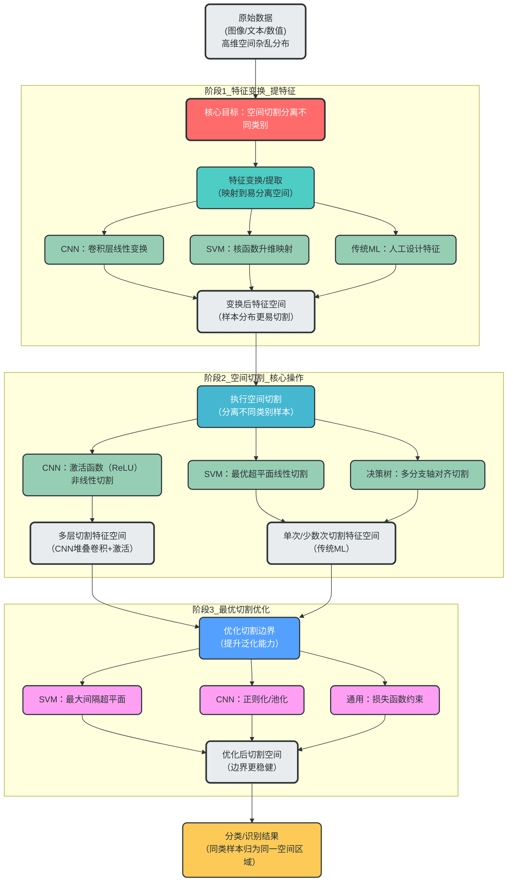
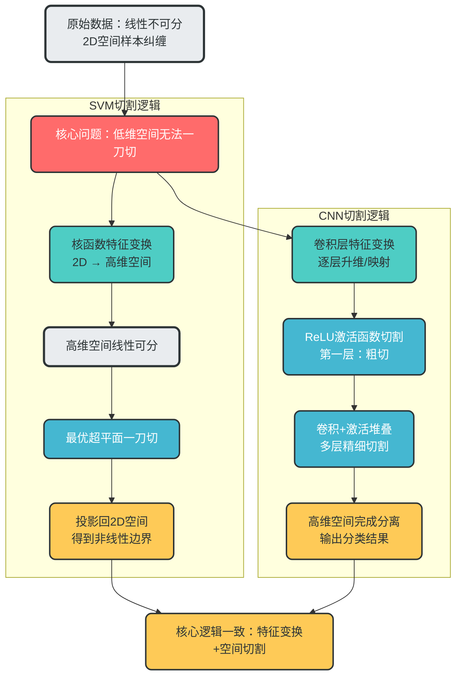
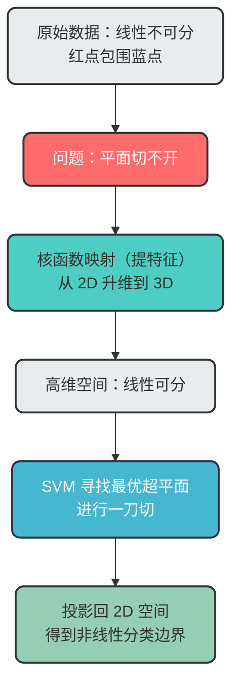
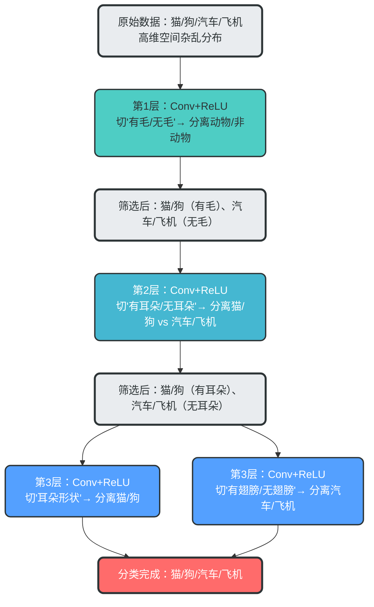
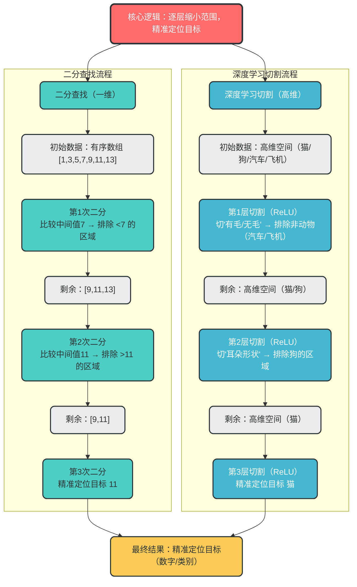
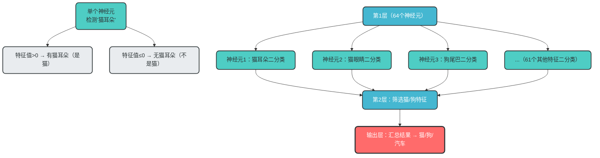

# 空间切割理论：从SVM到CNN的深度学习本质

## 一、引言

机器学习与深度学习的核心目标是什么？如何理解各种模型的工作原理？本文将通过「空间切割理论」这一统一框架，从传统机器学习（如SVM）到深度学习（如CNN），系统阐述分类模型的本质，帮助你建立起对机器学习的底层认知。

## 二、空间切割理论基础

### 1. 核心本质

机器学习/深度学习的**核心目标**是：将高维数据空间中的不同类别样本，通过「特征变换+空间切割」实现有效分离，最终完成分类/识别任务。

### 2. 关键概念对应

| 核心操作      | 本质作用                                   | 典型实现                                |
| ------------- | ------------------------------------------ | --------------------------------------- |
| 特征提取/变换 | 把数据映射到更易分离的高维空间（摆好位置） | 卷积层（CNN）、核函数（SVM）、全连接层  |
| 空间切割      | 对变换后的特征空间做划分（切分样本）       | 激活函数（ReLU）、SVM超平面、决策树分支 |
| 多层迭代切割  | 逐步细化切割边界，适配复杂数据分布         | CNN的「卷积→激活」堆叠、集成学习        |
| 最优切割      | 让切割边界离样本足够远，提升泛化能力       | SVM最大间隔超平面、正则化约束           |

### 3. 不同模型的切割逻辑差异

- **传统机器学习（SVM/决策树）**：人工/核函数做特征变换，单次/少数次切割（SVM最优超平面、决策树多分支切割）；
- **深度学习（CNN/Transformer）**：自动逐层做特征变换，通过激活函数完成多层非线性切割，最终形成复杂决策边界；
- **强化学习**：无直接“分类切割”，但核心逻辑一致——通过奖励反馈调整“动作空间”的最优划分。

## 三、空间切割理论全流程

### 1. 全流程 Mermaid 流程图（含数据流）



## 四、SVM 与 CNN 切割逻辑对比

### 1. 对比 Mermaid 流程图



### 2. 核心差异总结

| 模型 | 特征变换方式   | 切割方式               | 边界类型                   | 适用场景                     |
| ---- | -------------- | ---------------------- | -------------------------- | ---------------------------- |
| SVM  | 核函数升维     | 单次最优超平面切割     | 高维线性边界（低维非线性） | 中小规模数据集，特征维度适中 |
| CNN  | 卷积层自动学习 | 多层激活函数非线性切割 | 复杂非线性边界             | 大规模数据集，图像等复杂数据 |

## 五、SVM 如何完美诠释"切割理论"

### 1. 硬间隔 SVM：最简单的"一刀切"

**适用场景**：数据线性可分（如一堆蓝点，一堆红点）

- **空间**：数据所在的二维/高维空间
- **切割**：寻找一个超平面（Hyperplane）
- **目标**：不仅要分开数据，还要让超平面距离两边最近的点（支持向量）距离最大

> **人话**：SVM 不满足于"切开"，而是要找最中间的位置下刀，这样容错率最高，模型最稳定。

### 2. 核函数 SVM：提特征 + 高维切割

**适用场景**：数据线性不可分（如红点包围蓝点）

**核心步骤**：

1. **提特征（升维）**：通过核函数（Kernel），把数据从低维映射到高维空间
2. **切割**：在高维空间中用超平面（一刀）切开数据
3. **降维**：投影回低维空间，得到非线性分类边界

> **完美印证切割理论**：提特征的目的，就是为了在新的空间里，能用更简单的"一刀切"来解决问题。

### 3. SVM 的"切割逻辑"可视化



## 六、深度学习的多次切割原理

### 1. 为什么需要多次切割？

深度学习不是"找一个超平面切一次"，而是**用多把"小刀"（激活函数）做"多次精细切割"**，最终在高维空间里拼出一个"复杂边界"——单次切割只能分简单数据，多次切割才能分复杂数据（比如图像、文本）。

### 2. "这把刀"的本质：激活函数（ReLU）

深度学习里的"刀"，就是**激活函数**（最常用ReLU），它的"切割规则"极其简单：

- 规则：`输出 = max(0, 输入)` → 小于0的特征直接"切掉"（置0），大于0的保留；
- 本质：在特征维度上做"一维切割"（比如对"边缘特征"这个维度，只保留强响应、切掉弱响应）；
- 关键：每一层有**成百上千个维度**（比如卷积层输出32/64通道），相当于一次切"成百上千刀"（每个维度切一次）。

### 3. 多层切割的完整逻辑



### 4. 为什么多次切割能解决复杂问题？

从数学本质看：

1. **单次切割（线性超平面）**：只能表示"线性边界"（比如直线、平面），无法分开"缠绕在一起"的数据（比如圆形分布的样本）；
2. **多次切割（非线性叠加）**：每一层激活函数的"非线性切割"叠加后，能形成**任意复杂的非线性边界**（比如曲线、曲面、不规则形状）——这就是"万能近似定理"的核心：足够多的层+足够多的神经元，能拟合任意复杂的分类边界。

## 七、深度学习与二分查找的类比

### 1. 核心对应关系

| 二分查找       | 深度学习空间切割     |
| -------------- | -------------------- |
| 有序数组       | 高维特征空间         |
| 中间值比较     | 激活函数（ReLU）     |
| 每次排除一半   | 每次切掉无效特征区域 |
| 不断缩小范围   | 不断缩小样本所在空间 |
| 最终找到目标值 | 最终找到所属类别     |

### 2. 可视化对比



### 3. 为什么要"多层"？

因为：
- **二分查找只需要 log2(n) 步**
- **深度学习也只需要 log(类别数量) 级别的层数**

层数越多，能区分的东西越精细：
- 2 层 → 区分 4 类
- 3 层 → 区分 8 类
- 10 层 → 区分成千上万类

## 八、深度学习中的二分类与多分类

### 1. 微观：单个神经元的切割 = 纯纯的二分类

深度学习里的**单个神经元/单个特征维度**的激活（ReLU），就是标准的"二分类切割"：

- 规则：`特征值 > 0 → 保留（类别A），特征值 ≤ 0 → 丢弃（类别B）`
- 例子：
    - 检测"有没有猫耳朵"的神经元：值>0 → "有猫耳朵"（是猫），值≤0 → "无猫耳朵"（不是猫）；
    - 检测"有没有狗尾巴"的神经元：值>0 → "有狗尾巴"（是狗），值≤0 → "无狗尾巴"（不是狗）。

### 2. 宏观：一层神经元的切割 = 多维度并行二分类

深度学习的一层卷积/全连接层，不是只有1个神经元，而是有**成百上千个神经元**（比如Conv层输出64通道=64个神经元）：

- 第1个神经元：切割"有没有猫耳朵"（二分类）；
- 第2个神经元：切割"有没有猫眼睛"（二分类）；
- 第3个神经元：切割"有没有狗尾巴"（二分类）；
- ……
- 第64个神经元：切割"有没有汽车轮子"（二分类）。

**一层切割 = 64次并行的二分类**——不是"把整体分成两类"，而是"对64个特征维度各自做二分类筛选"，最终输出一个"64维的筛选结果"（哪些特征有效、哪些无效）。

### 3. 从单神经元二分类到多分类



### 4. 代码示例：简单的CNN模型实现

```python
import tensorflow as tf
from tensorflow.keras.models import Sequential
from tensorflow.keras.layers import Conv2D, MaxPooling2D, Flatten, Dense

# 创建一个简单的CNN模型
model = Sequential([
    # 第一层：卷积+激活（第一次切割）
    Conv2D(32, (3, 3), activation='relu', input_shape=(28, 28, 1)),
    MaxPooling2D((2, 2)),

    # 第二层：卷积+激活（第二次切割）
    Conv2D(64, (3, 3), activation='relu'),
    MaxPooling2D((2, 2)),

    # 第三层：卷积+激活（第三次切割）
    Conv2D(64, (3, 3), activation='relu'),

    # 展平并输出
    Flatten(),
    Dense(64, activation='relu'),
    Dense(10, activation='softmax')  # 10分类
])

# 编译模型
model.compile(optimizer='adam',
              loss='sparse_categorical_crossentropy',
              metrics=['accuracy'])

# 模型摘要
model.summary()
```

## 九、切割理论的统一框架

### 1. 传统机器学习（SVM）

- **特征提取**：人类手动选择特征或使用核函数
- **切割方式**：模型寻找最优超平面（一刀）
- **核心思想**：在高维空间中找到最优切割边界

### 2. 深度学习（CNN）

- **特征提取**：模型通过卷积层自动学习特征
- **切割方式**：通过激活函数（ReLU）层层切割
- **核心思想**：在极高维空间中通过多层非线性变换实现复杂切割

### 3. 两者的关系

**SVM 是"切割理论"的线性极致**：通过核函数映射到高维空间，用线性超平面实现最优切割。

**深度学习是"切割理论"的非线性组合极致**：通过多层卷积和激活，在极高维空间中实现复杂的非线性切割。

## 十、知识体系的闭环

从 CNN 的微观操作（激活=切割），到传统算法的宏观思想（SVM=最优切割），核心逻辑完全贯通：

1. **提特征**：通过变换将数据映射到更易切割的空间
2. **切割**：在新空间中分离不同类别的数据
3. **降维**：（可选）将高维结果投影回低维以便观察

这种统一性展示了机器学习的本质：**通过特征变换，让数据变得可切割**。

## 十一、总结

1. **核心本质**：所有分类类机器学习模型，本质都是「特征变换（摆位置）+ 空间切割（分样本）」，只是变换/切割的方式、次数不同；
2. **SVM 是切割理论的线性极致**：通过核函数映射到高维空间，用线性超平面实现最优切割；
3. **CNN 是切割理论的非线性组合极致**：通过多层卷积和激活函数实现复杂的多层切割；
4. **深度学习与二分查找的类比**：深度学习就是在高维空间里进行逐层的二分判断，不断缩小范围，最终精准定位到目标类别；
5. **二分类与多分类的关系**：单个神经元的切割是二分类，一层神经元的切割是多维度并行二分类，多层叠加后实现多分类。

通过「空间切割理论」这一统一框架，我们可以更清晰地理解从传统机器学习到深度学习的演进过程，以及各种模型的本质区别与联系。这不仅有助于我们选择合适的模型解决实际问题，也为我们设计和优化模型提供了指导思想。
