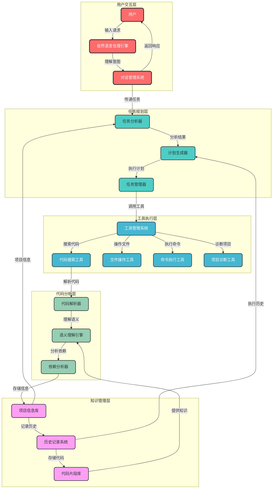
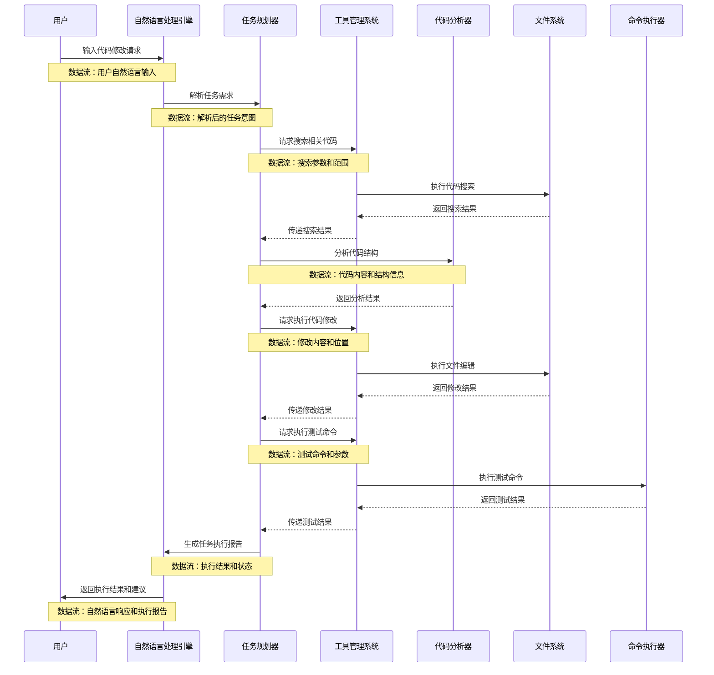
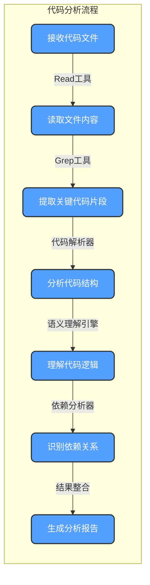
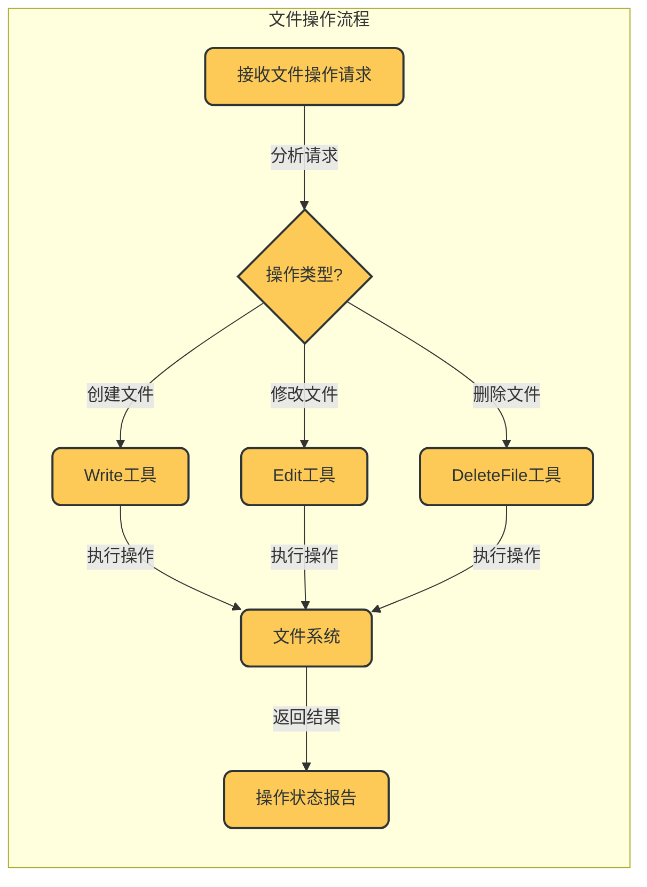
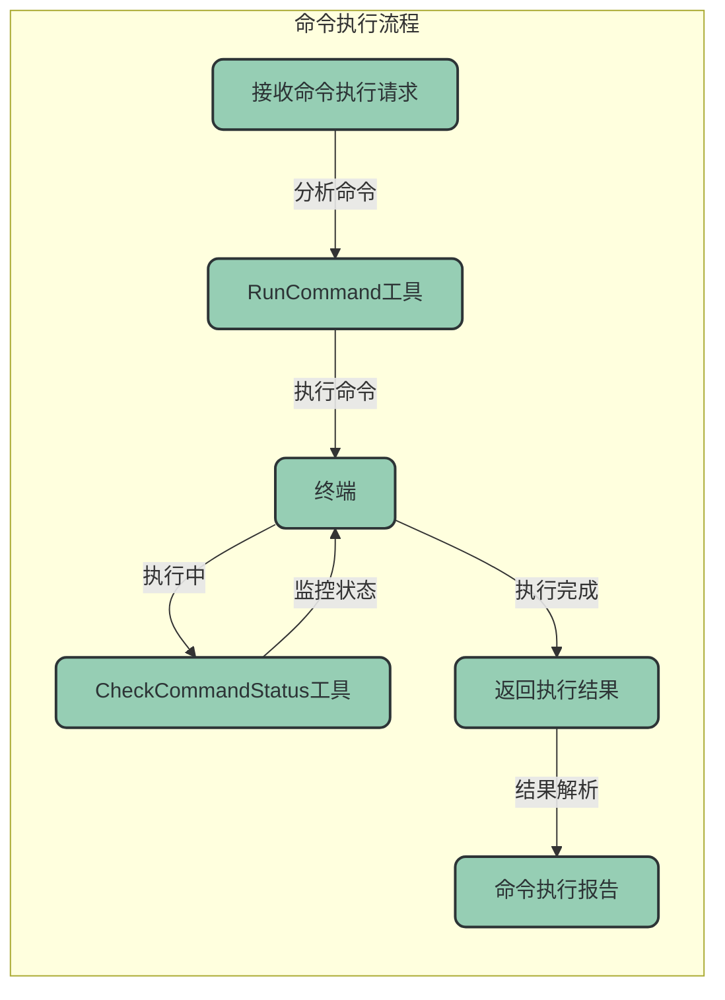

我需要创建一个详细的计划来完成这个架构讲解任务，包括技术栈设计、架构图创建、时序图设计等多个步骤。
        
            
toolName: todo_write
            
status: success
          
Todos updated: 6 items
          
开始执行第一个任务，设计完整的技术栈，包括核心组件和依赖。
        
            
toolName: todo_write
            
status: success
          
Todos updated: 6 items
          
完成技术栈设计，包括核心组件和依赖，现在开始创建架构图。
        
            
toolName: todo_write
            
status: success
          
Todos updated: 6 items
          
完成架构图创建，现在开始创建时序图，展示动态执行流程并添加Note over表示数据流。
        
            
toolName: todo_write
            
status: success
          
Todos updated: 6 items
          
完成时序图创建，现在开始详细说明从用户输入到输出的完整流程，包括代码构建、修改、文件操作等细节。
        
            
toolName: todo_write
            
status: success
          
Todos updated: 6 items
          
完成用户输入到输出的完整流程说明，现在开始为关键流程创建Mermaid辅助说明流程图。
        
            
toolName: todo_write
            
status: success
          
Todos updated: 6 items
          
完成关键流程的辅助说明流程图创建，现在开始检查所有设计是否符合指定的样式规范和Mermaid语法要求。
        
            
toolName: todo_write
            
status: success
          
Todos updated: 6 items
          
完成所有设计的检查，确保符合指定的样式规范和Mermaid语法要求，现在可以提供最终的完整架构说明。
        
            
toolName: todo_write
            
status: success
          
Todos updated: 6 items
          
# Trae Solo Coder 智能体架构设计

## 1. 技术栈

| 层级 | 组件 | 技术/框架 | 功能描述 |
|------|------|-----------|----------|
| **用户交互层** | 自然语言处理引擎 | 大语言模型 | 理解用户输入，生成自然语言响应 |
| | 对话管理系统 | 自定义状态机 | 维护对话上下文，管理交互流程 |
| **任务规划层** | 任务分析器 | 规则引擎 + 大语言模型 | 分析任务需求，提取关键信息 |
| | 计划生成器 | 自定义算法 | 创建详细的执行计划 |
| | 任务管理器 | TodoWrite 工具 | 跟踪任务执行状态和进度 |
| **工具执行层** | 工具管理系统 | 自定义工具调度器 | 统一管理和调用各类开发工具 |
| | 代码搜索工具 | SearchCodebase, Grep | 搜索代码库，查找相关文件 |
| | 文件操作工具 | Edit, Write, DeleteFile | 编辑、创建、删除文件 |
| | 命令执行工具 | RunCommand, CheckCommandStatus | 执行终端命令，监控执行状态 |
| | 项目诊断工具 | GetDiagnostics | 检查代码质量，识别错误 |
| **代码分析层** | 代码解析器 | 语法分析器 | 分析代码结构和语法 |
| | 语义理解引擎 | 大语言模型 | 理解代码语义和逻辑 |
| | 依赖分析器 | 静态分析工具 | 识别代码依赖关系 |
| **知识管理层** | 项目信息库 | 内存存储 | 存储项目结构和关键信息 |
| | 历史记录系统 | 会话存储 | 记录执行历史和结果 |
| | 代码片段库 | 索引系统 | 存储和检索常用代码片段 |

## 2. 架构图（静态关系）

## 3. 时序图（动态执行流程）

## 4. 完整流程说明

### 4.1 任务接收与分析

1. **用户输入**：用户通过自然语言提出代码相关请求，如"帮我修改这段代码"、"分析这个项目结构"等。
2. **意图识别**：自然语言处理引擎分析用户输入，识别任务类型和关键信息。
3. **任务分析**：任务分析器进一步分析任务需求，提取具体目标和约束条件。

### 4.2 计划制定与执行

1. **计划生成**：计划生成器根据任务分析结果，创建详细的执行计划，包括所需工具和步骤。
2. **任务管理**：任务管理器（TodoWrite工具）跟踪任务执行状态和进度，确保任务有序完成。
3. **工具调用**：工具管理系统根据执行计划，调用相应的工具执行具体操作。

### 4.3 代码操作与分析

1. **代码搜索**：使用SearchCodebase、Grep等工具搜索代码库，查找相关文件和代码片段。
2. **文件操作**：
   - **添加文件夹**：通过命令执行工具创建新的文件夹结构，如`RunCommand`执行`mkdir`命令。
   - **添加文件**：使用Write工具创建新文件，如`Write`工具写入文件内容。
   - **修改文件**：使用Edit工具修改现有文件，如`Edit`工具替换代码片段。
   - **删除文件**：使用DeleteFile工具删除不需要的文件。
3. **代码分析**：代码分析器分析代码结构、语义和依赖关系，提供代码质量评估和改进建议。

### 4.4 执行监控与反馈

1. **执行监控**：监控工具执行状态，处理异常情况，确保任务的正确完成。
2. **结果验证**：执行测试命令，验证代码修改的正确性和稳定性。
3. **反馈生成**：生成详细的执行报告，包括任务执行状态、结果和建议，通过自然语言处理引擎返回给用户。

## 5. 关键流程辅助说明流程图

### 5.1 代码分析流程

### 5.2 文件操作流程

### 5.3 命令执行流程

## 6. 架构特点与优势

1. **模块化设计**：采用分层架构，各组件职责明确，便于扩展和维护。
2. **智能规划**：能够根据任务复杂度自动调整执行策略，确保任务高效完成。
3. **工具集成**：统一管理各类开发工具，提供标准化的调用接口和错误处理机制。
4. **代码理解**：具备深度代码分析能力，能够理解代码结构、语义和依赖关系。
5. **实时反馈**：提供任务执行的实时状态更新，及时响应用户的中断或调整请求。
6. **安全可靠**：严格的参数验证和错误处理机制，确保工具调用的安全性和可靠性。

## 7. 应用场景

- **代码修改**：根据用户需求修改现有代码，包括 bug 修复、功能添加和性能优化。
- **代码分析**：分析代码结构和质量，识别潜在问题和优化机会。
- **项目构建**：协助用户构建项目，包括创建文件结构、配置依赖和执行构建命令。
- **测试验证**：执行测试命令，验证代码修改的正确性和稳定性。
- **代码重构**：分析代码结构，提供重构建议，执行重构操作。

通过以上架构设计，Trae Solo Coder 智能体能够高效、智能地协助用户完成各种代码开发任务，从简单的代码修改到复杂的项目分析和重构，都能提供专业、可靠的支持。