# 模型微调技术完全指南

> **文档定位**：本文面向有一定深度学习基础的工程师与研究人员，系统讲解模型微调的原理、方法、完整实践流程、常见问题及部署上线，并附 FAQ 供面试备考参考。
>
> **阅读路径**：核心原理 → 方法选型 → 完整流程 → 实战示例 → 避坑指南 → FAQ

---

## 目录

1. [微调核心原理](#一微调核心原理)
2. [主流微调方法](#二主流微调方法)
3. [完整微调流程](#三完整微调流程)
4. [实战示例](#四实战示例)
5. [常见问题与解决方案](#五常见问题与解决方案)
6. [关键注意事项](#六关键注意事项)
7. [FAQ 面试常见问题](#七faq-面试常见问题)

---

## 一、微调核心原理

### 1.1 什么是模型微调

**微调（Fine-Tuning）** 是迁移学习（Transfer Learning）的核心范式之一：在大规模数据集上预训练好的模型权重基础上，利用较小的领域/任务数据集对模型参数进行有针对性的继续训练，使模型适配特定下游任务。

> **核心思想**：预训练模型已经学习到了通用的语言/视觉表示，微调仅需少量数据让模型"适配"到目标领域，而无需从零开始训练。

**为什么需要微调：**

| 方案 | 优点 | 缺点 |
|------|------|------|
| 从零训练 | 完全定制 | 数据量大、算力成本极高 |
| 直接使用预训练模型 | 零成本 | 无法适配垂直领域 |
| **微调** | **成本低、效果好** | **需要一定领域数据** |
| 提示工程（Prompt Engineering） | 无需训练 | 效果天花板低、不稳定 |

### 1.2 迁移学习与微调的关系

模型微调是**迁移学习**的核心实现手段。其本质是将在大规模数据上预训练好的模型权重作为初始化，在较小的目标任务数据集上继续训练，使模型适配特定任务。

**核心假设**：预训练模型已学到通用的底层特征表示（语义、语法、纹理、边缘等），微调仅需调整高层任务相关参数。

```mermaid
flowchart LR
    %% ── 配色定义 ──────────────────────────────────────────────────
    classDef pretrainStyle  fill:#1e40af,stroke:#1e3a8a,stroke-width:2px,color:#fff
    classDef transferStyle  fill:#7c3aed,stroke:#5b21b6,stroke-width:2px,color:#fff
    classDef finetuneStyle  fill:#d97706,stroke:#92400e,stroke-width:2px,color:#fff
    classDef taskStyle      fill:#059669,stroke:#064e3b,stroke-width:2px,color:#fff
    classDef noteStyle      fill:#fffbeb,stroke:#f59e0b,stroke-width:1.5px,color:#78350f
    classDef layerStyle     fill:#f8fafc,stroke:#cbd5e0,stroke-width:1.5px

    %% ── 预训练阶段 ─────────────────────────────────────────────────
    subgraph PretrainStage["① 预训练阶段（大规模通用数据）"]
        direction LR
        P1["大规模语料/图像<br>ImageNet / Common Crawl"]:::pretrainStyle
        P2[("通用预训练模型<br>BERT / GPT / ResNet")]:::pretrainStyle
    end
    class PretrainStage layerStyle

    %% ── 权重迁移 ────────────────────────────────────────────────────
    subgraph TransferStage["② 知识迁移"]
        direction LR
        T1["冻结低层权重<br>通用特征保留"]:::transferStyle
        T2["解冻高层权重<br>任务特征适配"]:::transferStyle
    end
    class TransferStage layerStyle

    %% ── 微调阶段 ────────────────────────────────────────────────────
    subgraph FinetuneStage["③ 微调阶段（小规模任务数据）"]
        direction LR
        F1["任务专属数据<br>标注 / 指令 / 偏好"]:::finetuneStyle
        F2["目标任务模型<br>适配后的权重"]:::finetuneStyle
    end
    class FinetuneStage layerStyle

    %% ── 任务部署 ────────────────────────────────────────────────────
    subgraph TaskStage["④ 部署应用"]
        direction LR
        T3["下游任务推理<br>分类 / 生成 / 问答"]:::taskStyle
    end
    class TaskStage layerStyle

    %% ── 数据流 ──────────────────────────────────────────────────────
    P1 -->|"自监督 / 监督预训练"| P2
    P2 -->|"加载预训练权重"| T1
    T1 -->|"参数选择性解冻"| T2
    F1 -->|"小学习率继续训练"| F2
    T2 --- F2
    F2 -->|"推理部署"| T3

    %% ── 注记 ───────────────────────────────────────────────────────
    NOTE["核心优势<br>① 大幅减少训练数据需求<br>② 显著缩短训练时间<br>③ 缓解小样本过拟合"]:::noteStyle
    NOTE -.- FinetuneStage
```

### 1.3 微调的数学原理

#### 1.3.1 优化目标

设预训练模型参数为 $\theta_0$，目标领域数据集为 $\mathcal{D} = \{(x_i, y_i)\}_{i=1}^{N}$，微调的目标是求解：

$$\theta^* = \arg\min_{\theta} \mathcal{L}(\theta; \mathcal{D}) + \lambda \cdot \Omega(\theta, \theta_0)$$

其中：
- $\mathcal{L}(\theta; \mathcal{D})$ 是任务损失（如交叉熵）
- $\Omega(\theta, \theta_0)$ 是正则项，约束微调后参数不偏离预训练参数过远
- $\lambda$ 是正则化强度超参数

相较于随机初始化，$\theta_0$ 提供了更好的优化起点，使得：
- **收敛更快**：出发点已在损失曲面的较优区域
- **泛化更好**：预训练权重携带通用归纳偏置（inductive bias）
- **数据需求更低**：参数初始化质量高，不需要海量标注数据

#### 1.3.2 常用损失函数

对于分类任务，常用交叉熵损失：

$$\mathcal{L}_{CE} = -\frac{1}{N} \sum_{i=1}^{N} \sum_{c=1}^{C} y_{ic} \log \hat{p}_{ic}$$

对于语言模型生成任务，常用因果语言建模损失：

$$\mathcal{L}_{CLM} = -\frac{1}{N} \sum_{i=1}^{N} \sum_{t=1}^{T} \log P(x_t^{(i)} | x_{<t}^{(i)}; \theta)$$

#### 1.3.3 梯度更新规则

采用 AdamW 优化器（主流选择），参数更新公式为：

$$\theta_{t+1} = \theta_t - \eta \cdot \frac{\hat{m}_t}{\sqrt{\hat{v}_t} + \epsilon} - \eta \lambda \theta_t$$

其中 $\hat{m}_t$ 为一阶矩估计，$\hat{v}_t$ 为二阶矩估计，$\lambda$ 为权重衰减系数。

### 1.4 特征层次与微调深度

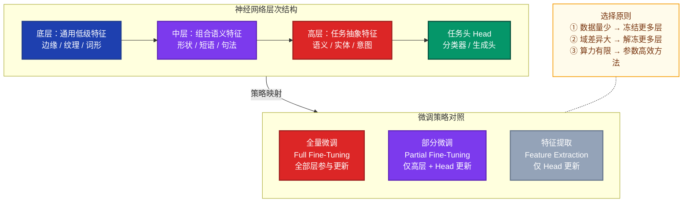

### 1.5 微调方法全景图

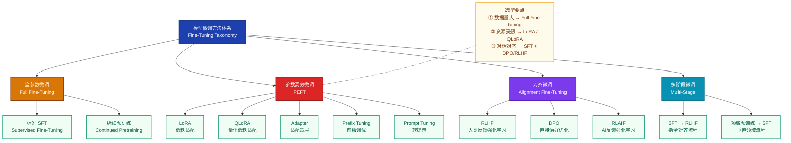

---

## 二、主流微调方法

### 2.1 全参数监督微调（Full SFT）

更新模型所有层的参数，适合数据量充足（>10万条）、算力资源充裕的场景。

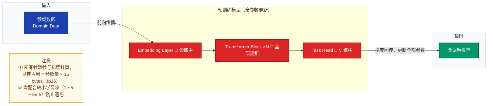

**代码示例（基于 HuggingFace Transformers，情感分类任务）**：

```python
from transformers import AutoTokenizer, AutoModelForSequenceClassification, Trainer, TrainingArguments
from datasets import load_dataset

model_name = "bert-base-chinese"
tokenizer = AutoTokenizer.from_pretrained(model_name)
model = AutoModelForSequenceClassification.from_pretrained(model_name, num_labels=2)

dataset = load_dataset("json", data_files={"train": "train.json", "val": "val.json"})

def preprocess(examples):
    return tokenizer(examples["text"], truncation=True, padding="max_length", max_length=512)

tokenized = dataset.map(preprocess, batched=True)

training_args = TrainingArguments(
    output_dir="./results",
    num_train_epochs=3,
    per_device_train_batch_size=16,
    learning_rate=2e-5,          # 全参微调使用较小学习率
    warmup_ratio=0.1,
    weight_decay=0.01,
    lr_scheduler_type="cosine",
    evaluation_strategy="epoch",
    save_strategy="epoch",
    load_best_model_at_end=True,
    fp16=True,
)

trainer = Trainer(
    model=model,
    args=training_args,
    train_dataset=tokenized["train"],
    eval_dataset=tokenized["val"],
)
trainer.train()
```

### 2.2 参数高效微调（PEFT）

当预训练模型参数量达到百亿甚至千亿级别时，全参数微调的算力成本极高，PEFT 方法通过只更新极小比例参数实现接近全量微调的效果。

#### 2.2.1 LoRA（Low-Rank Adaptation）

LoRA 是目前最主流的 PEFT 方法，**冻结原始权重，仅训练低秩分解矩阵**。

**核心思想**：将权重矩阵的更新量 $\Delta W$ 分解为两个低秩矩阵的乘积：

$$W' = W + \Delta W = W + \frac{\alpha}{r} \cdot BA$$

其中：
- $B \in \mathbb{R}^{d \times r}$，$A \in \mathbb{R}^{r \times k}$，秩 $r \ll \min(d, k)$
- $\alpha$ 是缩放因子（通常设为 $r$ 或 $2r$）
- 初始化：$A \sim \mathcal{N}(0, \sigma^2)$，$B = 0$（确保训练开始时 $\Delta W = 0$）

训练参数量从 $d \times k$ 降低到 $r \times (d + k)$，当 $r = 8, d = k = 4096$ 时，参数量减少约 **256倍**。

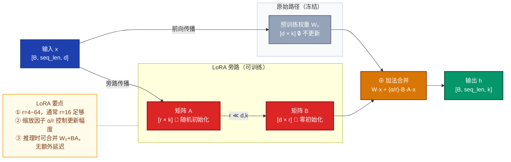

**代码示例（使用 PEFT 库）**：

```python
from peft import LoraConfig, get_peft_model, TaskType
from transformers import AutoModelForCausalLM

model = AutoModelForCausalLM.from_pretrained("Qwen/Qwen2.5-7B", torch_dtype="auto", device_map="auto")

lora_config = LoraConfig(
    task_type=TaskType.CAUSAL_LM,
    r=16,                          # 秩，通常 4~64
    lora_alpha=32,                 # 缩放因子 α，更新幅度 = lora_alpha/r
    target_modules=["q_proj", "k_proj", "v_proj", "o_proj"],
    lora_dropout=0.05,
    bias="none",
)

peft_model = get_peft_model(model, lora_config)
peft_model.print_trainable_parameters()
# 输出示例：trainable params: 20,971,520 || all params: 7,721,324,544 || trainable%: 0.27%
```

#### 2.2.2 QLoRA（量化 + LoRA）

在 LoRA 基础上，将基座模型权重量化为 4-bit（NF4 格式），显著降低显存占用，允许在单张消费级 GPU 上微调 70B 级别模型。

**显存对比（以 7B 模型为例）**：

| 方法 | 精度 | 显存占用 |
|------|------|---------|
| Full Fine-tuning | fp16 | ~112 GB |
| LoRA | fp16 | ~28 GB |
| **QLoRA** | **4-bit** | **~10 GB** |

QLoRA 核心三项技术：
1. **4-bit 量化基础模型**：使用 NF4（Normal Float 4）格式量化，显存降低约 75%
2. **LoRA 微调**：在量化模型上添加 LoRA 适配器，用 BF16 精度训练
3. **双重量化**：对量化常数本身也进行量化，进一步节省显存

```python
from transformers import BitsAndBytesConfig, AutoModelForCausalLM
from peft import LoraConfig, get_peft_model, TaskType
import torch

bnb_config = BitsAndBytesConfig(
    load_in_4bit=True,
    bnb_4bit_quant_type="nf4",              # NormalFloat4 量化
    bnb_4bit_compute_dtype=torch.bfloat16,
    bnb_4bit_use_double_quant=True,         # 双重量化，进一步压缩
)

model = AutoModelForCausalLM.from_pretrained(
    "Qwen/Qwen2.5-7B",
    quantization_config=bnb_config,
    device_map="auto",
)

lora_config = LoraConfig(
    task_type=TaskType.CAUSAL_LM,
    r=16, lora_alpha=32,
    target_modules=["q_proj", "k_proj", "v_proj", "o_proj"],
    lora_dropout=0.05, bias="none",
)
model = get_peft_model(model, lora_config)
```

#### 2.2.3 Adapter

**原理**：在 Transformer 每层的 FFN 后插入小型适配器模块（Bottleneck 结构），只训练 Adapter 参数。

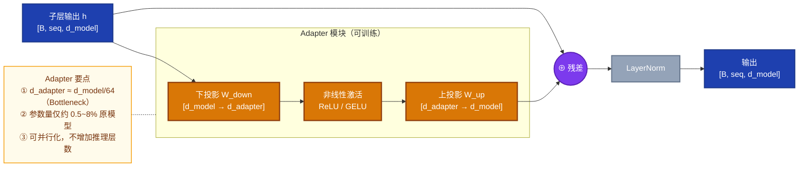

#### 2.2.4 Prefix Tuning / Prompt Tuning

| 方法 | 可训练参数 | 插入位置 | 特点 |
|------|-----------|---------|------|
| **Prefix Tuning** | 虚拟 Token 向量（每层） | 每个 Transformer 层的 KV | 表达能力强，参数稍多 |
| **Prompt Tuning** | 软提示向量 | 仅输入层 | 极简，参数极少，效果稍弱 |
| **P-Tuning v2** | 每层前缀向量 | 每层 | 改进版，适合 NLU 任务 |

### 2.3 对齐微调（SFT + RLHF / DPO）

对齐微调的目标不是任务性能，而是让模型输出符合人类价值观（Helpful / Harmless / Honest）。

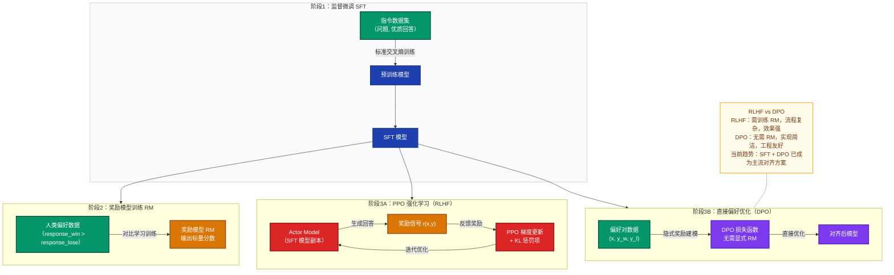

**DPO 损失函数**：

$$\mathcal{L}_{DPO}(\pi_\theta) = -\mathbb{E}_{(x,y_w,y_l)\sim\mathcal{D}} \left[ \log \sigma \left( \beta \log \frac{\pi_\theta(y_w|x)}{\pi_{ref}(y_w|x)} - \beta \log \frac{\pi_\theta(y_l|x)}{\pi_{ref}(y_l|x)} \right) \right]$$

其中 $\pi_{ref}$ 为参考策略（SFT 模型），$\beta$ 控制与参考策略的偏离程度，$y_w$ 为优选回答，$y_l$ 为劣选回答。

---

## 三、完整微调流程

### 3.1 微调全流程总览

#### 3.1.1 六阶段总体视图（Quick Overview）

> 微调项目的**六阶段线性全貌**，每个阶段对应一个颜色色块，颜色编码与下方详细图完全一致，可对照查阅。图中虚线反馈箭头体现了微调的**迭代闭环特性**——评估不达标时返回训练实验阶段重新调整，而非一次性流水线。

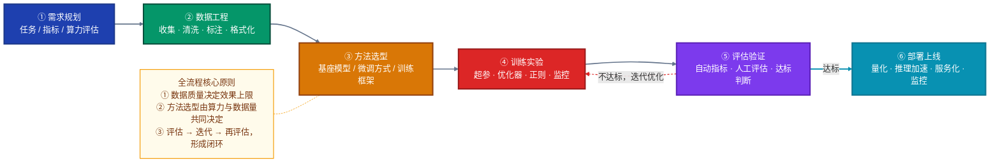

#### 3.1.2 各阶段内部步骤展开（Detailed View）

> 将总体视图的每个阶段**展开为具体操作步骤**，并引入**菱形决策节点**呈现关键分支逻辑。六个阶段的颜色与总体视图完全对应：**③ 方法选型**以数据量和显存为两级判断依据自动导向合适的微调方式；**⑤ 评估验证**的达标判断决定进入最终测试还是返回④重新调参。

```mermaid
flowchart TB
    %% ── 配色：与总体视图六阶段完全一致；菱形决策节点用琥珀色 ────────
    classDef p1Style   fill:#1e40af,stroke:#1e3a8a,stroke-width:2px,color:#fff
    classDef p2Style   fill:#059669,stroke:#064e3b,stroke-width:2px,color:#fff
    classDef p3Style   fill:#d97706,stroke:#92400e,stroke-width:2px,color:#fff
    classDef p4Style   fill:#dc2626,stroke:#991b1b,stroke-width:2px,color:#fff
    classDef p5Style   fill:#7c3aed,stroke:#5b21b6,stroke-width:2px,color:#fff
    classDef p6Style   fill:#0891b2,stroke:#0e7490,stroke-width:2px,color:#fff
    classDef decStyle  fill:#f59e0b,stroke:#d97706,stroke-width:2px,color:#fff
    classDef noteStyle fill:#fffbeb,stroke:#f59e0b,stroke-width:1.5px,color:#78350f
    classDef layerStyle fill:#f8fafc,stroke:#cbd5e0,stroke-width:1.5px

    %% ── ① 需求规划 ─────────────────────────────────────────────────
    subgraph PH1["① 需求规划"]
        direction LR
        PR1["明确任务类型<br>分类 / 生成 / 对话 / 对齐"]:::p1Style
        PR2["确定评估指标<br>F1 / BLEU / 人工评估"]:::p1Style
        PR3["评估可用资源<br>GPU 显存 / 算力 / 数据量"]:::p1Style
        PR1 --> PR2 --> PR3
    end
    class PH1 layerStyle

    %% ── ② 数据工程 ─────────────────────────────────────────────────
    subgraph PH2["② 数据工程"]
        direction LR
        DE1["数据收集与清洗<br>去重 / 质量过滤 / 脱敏"]:::p2Style
        DE2["数据标注<br>人工 / 半自动 / 模型辅助"]:::p2Style
        DE3["数据集划分<br>Train / Val / Test = 8:1:1"]:::p2Style
        DE4["格式化 & Tokenize<br>指令模板 / BPE / 截断填充"]:::p2Style
        DE1 --> DE2 --> DE3 --> DE4
    end
    class PH2 layerStyle

    %% ── ③ 方法选型（含决策树） ──────────────────────────────────────
    subgraph PH3["③ 方法选型"]
        direction TB
        MS1{"数据量 > 10K 条?"}:::decStyle
        MS2["全参数微调<br>SFT / Continued Pretraining"]:::p3Style
        MS3{"GPU 显存充足?"}:::decStyle
        MS4["LoRA / QLoRA<br>参数高效微调，首选"]:::p3Style
        MS5["Adapter / Prefix Tuning<br>极低显存场景"]:::p3Style
        MS1 -->|"是"| MS2
        MS1 -->|"否"| MS3
        MS3 -->|"是"| MS4
        MS3 -->|"否"| MS5
    end
    class PH3 layerStyle

    %% ── ④ 训练实验 ─────────────────────────────────────────────────
    subgraph PH4["④ 训练实验"]
        direction LR
        TR1["超参数配置<br>lr / batch_size / epochs / rank"]:::p4Style
        TR2["优化器配置<br>AdamW + Warmup + Cosine Decay"]:::p4Style
        TR3["正则化策略<br>Dropout / Weight Decay / Grad Clip"]:::p4Style
        TR4["训练监控<br>Loss / Grad Norm / GPU 利用率"]:::p4Style
        TR1 --> TR2 --> TR3 --> TR4
    end
    class PH4 layerStyle

    %% ── ⑤ 评估验证（含达标判断） ────────────────────────────────────
    subgraph PH5["⑤ 评估验证"]
        direction LR
        EV1["验证集评估<br>任务指标 / 损失曲线"]:::p5Style
        EV2{"性能达标?"}:::decStyle
        EV3["超参调整或数据增强<br>返回训练实验重新迭代"]:::p5Style
        EV4["测试集最终评估<br>消融实验 / 对比基线"]:::p5Style
        EV1 --> EV2
        EV2 -->|"否"| EV3
        EV2 -->|"是"| EV4
    end
    class PH5 layerStyle

    %% ── ⑥ 部署上线 ─────────────────────────────────────────────────
    subgraph PH6["⑥ 部署上线"]
        direction LR
        DP1["合并 LoRA 权重<br>merge_and_unload()"]:::p6Style
        DP2["模型量化<br>INT8 / INT4 / GPTQ / AWQ"]:::p6Style
        DP3["推理框架<br>vLLM / TGI / llama.cpp"]:::p6Style
        DP4["服务化部署<br>OpenAI 兼容 API"]:::p6Style
        DP5["线上监控<br>性能指标 / 数据漂移"]:::p6Style
        DP1 --> DP2 --> DP3 --> DP4 --> DP5
    end
    class PH6 layerStyle

    %% ── 阶段间连接 ─────────────────────────────────────────────────
    PR3 --> DE1
    DE4 --> MS1
    MS2 --> TR1
    MS4 --> TR1
    MS5 --> TR1
    TR4 --> EV1
    EV3 -->|"调参后重新训练"| TR1
    EV4 --> DP1

    NOTE["方法选型决策依据<br>数据量 > 10K → 可考虑全参微调<br>数据量 ≤ 10K，显存充足 → LoRA / QLoRA<br>数据量 ≤ 10K，显存不足 → Adapter / Prefix Tuning"]:::noteStyle
    NOTE -.- PH3
```

### 3.2 微调技术发展时间线

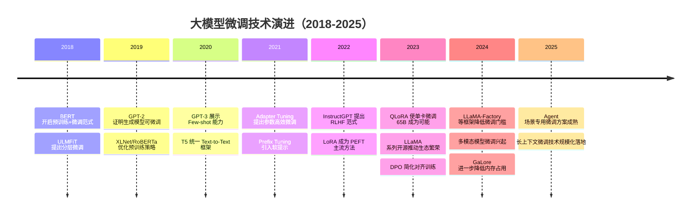

### 3.3 数据处理流程详解

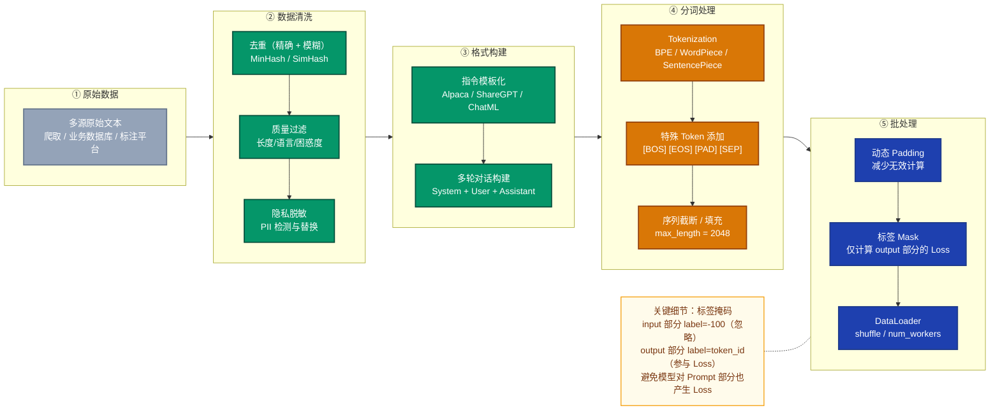

---

## 四、实战示例

### 4.1 使用 LoRA 微调 LLM 实现垂直领域问答

**任务目标**：将通用 LLM（Qwen2.5-7B）微调为医疗领域问答助手

#### 步骤一：数据准备

数据格式（指令微调格式 Alpaca）：

```json
[
  {
    "instruction": "患者出现持续性高烧39.5℃，伴有咳嗽、呼吸急促，可能是什么疾病？",
    "input": "",
    "output": "根据描述，患者可能存在以下情况：\n1. **肺炎**：高烧伴咳嗽和呼吸急促是典型症状...\n2. **流行性感冒重症**：...\n建议立即就医，进行胸部X光和血常规检查。"
  }
]
```

数据清洗脚本：

```python
import json, re

def clean_medical_data(raw_data):
    cleaned = []
    for item in raw_data:
        if len(item["output"]) < 50:
            continue
        if re.search(r'\d{11}|\d{18}', item["output"]):
            continue
        cleaned.append({
            "instruction": item["instruction"].strip(),
            "input": item.get("input", "").strip(),
            "output": item["output"].strip()
        })
    return cleaned
```

#### 步骤二：完整训练脚本

```python
import torch
from datasets import Dataset
from transformers import (
    AutoTokenizer, AutoModelForCausalLM,
    TrainingArguments, DataCollatorForSeq2Seq
)
from peft import LoraConfig, get_peft_model, TaskType
from trl import SFTTrainer
import json

MODEL_NAME  = "Qwen/Qwen2.5-7B-Instruct"
DATA_PATH   = "./medical_qa_train.json"
OUTPUT_DIR  = "./qwen_medical_lora"
MAX_SEQ_LEN = 2048

with open(DATA_PATH, "r", encoding="utf-8") as f:
    raw_data = json.load(f)
dataset = Dataset.from_list(raw_data)

tokenizer = AutoTokenizer.from_pretrained(MODEL_NAME, trust_remote_code=True)
model = AutoModelForCausalLM.from_pretrained(
    MODEL_NAME, torch_dtype=torch.bfloat16,
    device_map="auto", trust_remote_code=True,
)
model.enable_input_require_grads()

lora_config = LoraConfig(
    task_type=TaskType.CAUSAL_LM, r=16, lora_alpha=32,
    target_modules=["q_proj", "k_proj", "v_proj", "o_proj",
                    "gate_proj", "up_proj", "down_proj"],
    lora_dropout=0.05, bias="none",
)
model = get_peft_model(model, lora_config)
model.print_trainable_parameters()

def format_prompt(example):
    messages = [
        {"role": "system",    "content": "你是一位专业的医疗问答助手，提供准确、负责任的医疗知识解答。"},
        {"role": "user",      "content": example["instruction"]},
        {"role": "assistant", "content": example["output"]},
    ]
    return tokenizer.apply_chat_template(messages, tokenize=False, add_generation_prompt=False)

training_args = TrainingArguments(
    output_dir=OUTPUT_DIR, num_train_epochs=3,
    per_device_train_batch_size=2, gradient_accumulation_steps=8,
    learning_rate=2e-4, lr_scheduler_type="cosine", warmup_ratio=0.05,
    weight_decay=0.01, bf16=True, logging_steps=10,
    save_steps=200, eval_steps=200, evaluation_strategy="steps",
    save_total_limit=3, load_best_model_at_end=True,
    gradient_checkpointing=True, report_to="tensorboard",
)

trainer = SFTTrainer(
    model=model, tokenizer=tokenizer, args=training_args,
    train_dataset=dataset, formatting_func=format_prompt,
    max_seq_length=MAX_SEQ_LEN, dataset_num_proc=4,
)
trainer.train()

model.save_pretrained(OUTPUT_DIR)
tokenizer.save_pretrained(OUTPUT_DIR)
```

#### 步骤三：推理验证

```python
from peft import PeftModel
from transformers import AutoTokenizer, AutoModelForCausalLM
import torch

base_model = AutoModelForCausalLM.from_pretrained(
    "Qwen/Qwen2.5-7B-Instruct", torch_dtype=torch.bfloat16, device_map="auto")
model = PeftModel.from_pretrained(base_model, "./qwen_medical_lora")
model = model.merge_and_unload()  # 合并 LoRA 权重，消除推理额外开销
tokenizer = AutoTokenizer.from_pretrained("./qwen_medical_lora")

def inference(question: str) -> str:
    messages = [
        {"role": "system", "content": "你是一位专业的医疗问答助手。"},
        {"role": "user",   "content": question},
    ]
    text = tokenizer.apply_chat_template(messages, tokenize=False, add_generation_prompt=True)
    inputs = tokenizer(text, return_tensors="pt").to(model.device)
    with torch.no_grad():
        outputs = model.generate(**inputs, max_new_tokens=512, temperature=0.7, do_sample=True)
    return tokenizer.decode(outputs[0][inputs.input_ids.shape[1]:], skip_special_tokens=True)

print(inference("糖尿病患者日常饮食需要注意什么？"))
```

### 4.2 使用 LLaMA-Factory 微调 Qwen2.5-7B（客服对话）

**任务目标**：将通用 LLM 微调为中文客服对话助手

#### 步骤一：准备 SFT 数据集（Alpaca 格式）

```json
[
  {
    "instruction": "用户反映订单迟迟未到，请给出专业的客服回复。",
    "input": "我昨天下单了，但显示还在揽件中，什么时候能到？",
    "output": "您好！非常抱歉给您带来了不便。根据您的订单信息，目前包裹处于揽件状态，通常情况下48小时内会更新物流信息。如果超过48小时仍无更新，请提供您的订单号，我们将立即为您联系快递公司核查。感谢您的耐心等待！"
  }
]
```

#### 步骤二：LLaMA-Factory 配置文件

```yaml
# train_config.yaml
model_name_or_path: Qwen/Qwen2.5-7B-Instruct
stage: sft
do_train: true
finetuning_type: lora

lora_rank: 16
lora_alpha: 32
lora_target: q_proj,v_proj,k_proj,o_proj
lora_dropout: 0.05

dataset: customer_service_sft
template: qwen
cutoff_len: 2048
max_samples: 50000

num_train_epochs: 3.0
per_device_train_batch_size: 4
gradient_accumulation_steps: 4
learning_rate: 0.0002
lr_scheduler_type: cosine
warmup_ratio: 0.05

bf16: true
gradient_checkpointing: true
weight_decay: 0.01
max_grad_norm: 1.0

output_dir: ./output/qwen2.5-7b-customer-service
logging_steps: 10
save_steps: 500
eval_steps: 500
```

#### 步骤三：启动训练

```bash
# 单卡训练
CUDA_VISIBLE_DEVICES=0 llamafactory-cli train train_config.yaml

# 多卡分布式训练（4卡 DDP）
torchrun --nproc_per_node 4 \
  $(which llamafactory-cli) train train_config.yaml
```

#### 步骤四：推理与部署

```python
from peft import PeftModel
from transformers import AutoModelForCausalLM, AutoTokenizer
import torch

base_model = AutoModelForCausalLM.from_pretrained(
    "Qwen/Qwen2.5-7B-Instruct", torch_dtype=torch.bfloat16, device_map="auto")
model = PeftModel.from_pretrained(base_model, "./output/qwen2.5-7b-customer-service")
tokenizer = AutoTokenizer.from_pretrained("Qwen/Qwen2.5-7B-Instruct")

def chat(user_message: str) -> str:
    messages = [
        {"role": "system", "content": "你是一名专业的客服代表，请耐心、礼貌地回答用户问题。"},
        {"role": "user", "content": user_message}
    ]
    text = tokenizer.apply_chat_template(messages, tokenize=False, add_generation_prompt=True)
    inputs = tokenizer(text, return_tensors="pt").to(model.device)
    with torch.no_grad():
        outputs = model.generate(
            **inputs, max_new_tokens=512,
            temperature=0.7, top_p=0.9, repetition_penalty=1.1,
        )
    return tokenizer.decode(outputs[0][inputs["input_ids"].shape[1]:], skip_special_tokens=True)

print(chat("我的快递到哪里了？"))

# 合并 LoRA 权重并保存，用于生产部署（推理零额外开销）
merged_model = model.merge_and_unload()
merged_model.save_pretrained("./output/merged-qwen2.5-7b-customer-service")
tokenizer.save_pretrained("./output/merged-qwen2.5-7b-customer-service")

# 使用 vLLM 高效部署
# vllm serve ./output/merged-qwen2.5-7b-customer-service --port 8000
```

### 4.3 训练监控核心指标

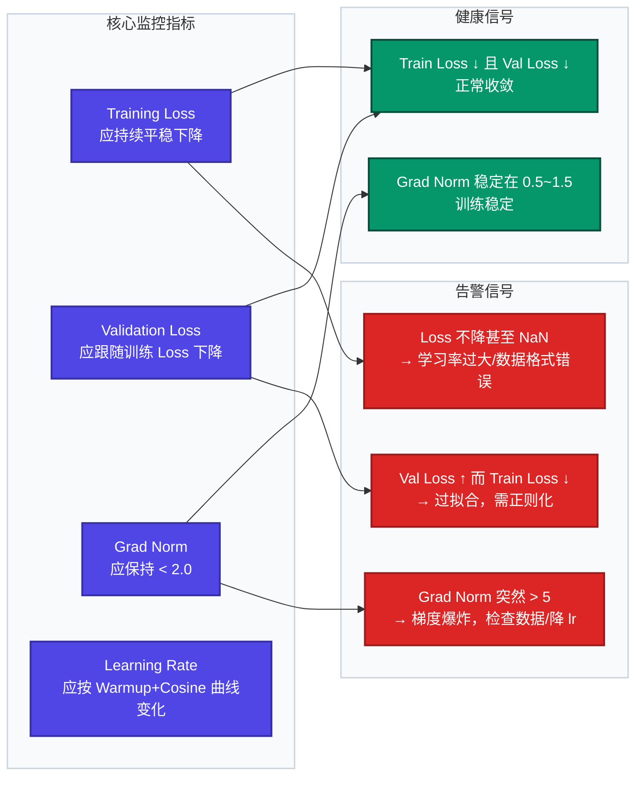

---

## 五、常见问题与解决方案

### 5.1 问题全景图

```mermaid
flowchart TB
    %% ── 配色 ───────────────────────────────────────────────────────
    classDef rootStyle   fill:#1e40af,stroke:#1e3a8a,stroke-width:2.5px,color:#fff
    classDef cat1Style   fill:#dc2626,stroke:#991b1b,stroke-width:2px,color:#fff
    classDef cat2Style   fill:#d97706,stroke:#92400e,stroke-width:2px,color:#fff
    classDef cat3Style   fill:#7c3aed,stroke:#5b21b6,stroke-width:2px,color:#fff
    classDef cat4Style   fill:#0891b2,stroke:#0e7490,stroke-width:2px,color:#fff
    classDef cat5Style   fill:#059669,stroke:#064e3b,stroke-width:2px,color:#fff
    classDef solStyle    fill:#f0fdf4,stroke:#059669,stroke-width:1.5px,color:#065f46

    ROOT["微调常见问题<br>Fine-Tuning Issues"]:::rootStyle
    C1["灾难性遗忘<br>Catastrophic Forgetting"]:::cat1Style
    C2["过拟合<br>Overfitting"]:::cat2Style
    C3["训练不稳定<br>Training Instability"]:::cat3Style
    C4["显存溢出<br>OOM"]:::cat4Style
    C5["性能不及预期<br>Underperformance"]:::cat5Style

    S11["EWC / 弹性权重合并"]:::solStyle
    S12["LoRA 降低更新幅度"]:::solStyle
    S13["混合通用数据重放"]:::solStyle
    S14["分层学习率"]:::solStyle

    S21["增大 Dropout"]:::solStyle
    S22["Weight Decay 正则"]:::solStyle
    S23["Early Stopping"]:::solStyle
    S24["数据增强 / 扩充"]:::solStyle

    S31["降低学习率"]:::solStyle
    S32["Gradient Clipping"]:::solStyle
    S33["Warmup 策略"]:::solStyle
    S34["BF16 替代 FP16"]:::solStyle

    S41["减小 batch_size + 梯度累积"]:::solStyle
    S42["gradient_checkpointing"]:::solStyle
    S43["LoRA / QLoRA"]:::solStyle
    S44["DeepSpeed ZeRO-3"]:::solStyle

    S51["增加数据量/质量"]:::solStyle
    S52["调整 LoRA Rank"]:::solStyle
    S53["换更强基础模型"]:::solStyle
    S54["检查标签掩码"]:::solStyle

    ROOT --> C1 & C2 & C3 & C4 & C5
    C1 --> S11 & S12 & S13 & S14
    C2 --> S21 & S22 & S23 & S24
    C3 --> S31 & S32 & S33 & S34
    C4 --> S41 & S42 & S43 & S44
    C5 --> S51 & S52 & S53 & S54
```

### 5.2 灾难性遗忘（Catastrophic Forgetting）

**现象**：微调后模型在目标任务上性能提升，但在原有通用任务上严重退化。

**根因**：梯度更新覆盖了原有权重中编码的通用知识。

| 解决策略 | 核心思想 | 适用场景 |
|---------|---------|---------|
| **PEFT（LoRA/Adapter）** | 冻结主干，只更新少量参数，首选方案 | 资源受限场景 |
| **EWC（弹性权重合并）** | 对重要参数施加 L2 惩罚，限制其偏移 | 全参微调场景 |
| **数据混合重放** | 在训练集中混入 10%~20% 通用数据 | 需要保持通用能力 |
| **降低学习率** | 用更小的步长减缓知识覆盖速度 | 简单有效的通用手段 |
| **分层学习率** | 底层用更小学习率，顶层用更大学习率 | 全参数微调 |

**EWC 损失函数**：

$$\mathcal{L}_{EWC}(\theta) = \mathcal{L}_{task}(\theta) + \frac{\lambda}{2} \sum_i F_i (\theta_i - \theta_{0,i})^2$$

其中 $F_i$ 为 Fisher 信息矩阵对角项，衡量参数 $\theta_i$ 对原任务的重要性。

**分层学习率代码示例**：

```python
from torch.optim import AdamW

optimizer = AdamW([
    {"params": model.embeddings.parameters(),       "lr": 1e-6},   # 嵌入层：最小
    {"params": model.encoder.layer[:6].parameters(),"lr": 2e-5},   # 底层
    {"params": model.encoder.layer[6:].parameters(),"lr": 5e-5},   # 顶层
    {"params": model.classifier.parameters(),       "lr": 1e-4},   # 分类头：最大
])
```

### 5.3 过拟合（Overfitting）

**现象**：训练 Loss 持续下降，验证 Loss 先降后升，二者差距不断扩大。

**判断条件**：$\mathcal{L}_{val} - \mathcal{L}_{train} > \epsilon$（$\epsilon$ 通常取 0.1~0.3）

**系统性解决方案**（按优先级）：

```python
# 1. 早停（Early Stopping）
from transformers import EarlyStoppingCallback
trainer = Trainer(
    callbacks=[EarlyStoppingCallback(early_stopping_patience=3)]
)

# 2. 权重衰减（L2 正则）+ 正则化配置
from transformers import AutoConfig
config = AutoConfig.from_pretrained(model_name)
config.hidden_dropout_prob = 0.1
config.attention_probs_dropout_prob = 0.1

args = TrainingArguments(
    weight_decay=0.01,           # 常用范围：0.01~0.1
    lr_scheduler_type="cosine",  # 防止后期学习率过大
)

# 3. 数据增强（以文本分类为例）
import nlpaug.augmenter.word as naw
aug = naw.SynonymAug(aug_src="wordnet")
augmented_text = aug.augment(original_text)
```

其他措施：
- **减少 LoRA Rank**：秩 r 越大，可训练参数越多，越容易过拟合
- **减少训练 Epochs**：配合 Early Stopping，当验证指标连续 N 步不提升时停止

### 5.4 训练不稳定（Loss NaN / 梯度爆炸）

**常见原因及解决方案**：

```python
# 问题1：梯度爆炸 → 启用梯度裁剪
training_args = TrainingArguments(max_grad_norm=1.0)

# 问题2：FP16 溢出 → 换用 BF16（数值范围更大，不易溢出）
training_args = TrainingArguments(bf16=True, fp16=False)

# 问题3：学习率过大 → 降低 lr 并启用 Warmup
training_args = TrainingArguments(learning_rate=1e-4, warmup_ratio=0.1)

# 梯度监控（自定义 Callback）
from transformers import TrainerCallback
class GradientMonitorCallback(TrainerCallback):
    def on_step_end(self, args, state, control, model=None, **kwargs):
        total_norm = sum(p.grad.data.norm(2).item() ** 2
                         for p in model.parameters() if p.grad is not None) ** 0.5
        if total_norm > 10:
            print(f"Warning: Large gradient norm {total_norm:.2f} at step {state.global_step}")
```

### 5.5 显存不足（OOM）

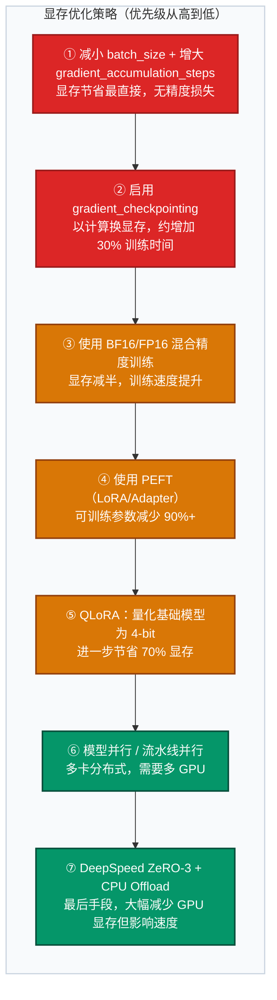

```python
# 梯度检查点 + 梯度累积组合
args = TrainingArguments(
    per_device_train_batch_size=1,
    gradient_accumulation_steps=16,  # 等效 batch_size = 16
    gradient_checkpointing=True,     # 用计算换显存，速度降约30%
    bf16=True,
    max_grad_norm=1.0,
)
```

**实测参考**：单张 RTX 3090（24GB）使用 QLoRA 可微调 Qwen2.5-7B，训练 1000 条数据约需 30 分钟。

### 5.6 数据质量问题

**低质量数据的危害**：模型学会错误模式，泛化能力差，甚至产生有害输出。

**数据清洗 Checklist**：

```python
import re
from collections import Counter

def clean_text(text: str) -> str | None:
    if len(text) < 20 or len(text) > 2048:
        return None
    if re.search(r"[^\u4e00-\u9fa5a-zA-Z0-9\s\.,!?，。！？、]", text):
        non_chinese = len(re.findall(r"[^\u4e00-\u9fa5\s]", text))
        if non_chinese / len(text) > 0.3:
            return None
    sentences = text.split("。")
    if max(Counter(sentences).values()) > 3:
        return None
    return text.strip()
```

### 5.7 性能不及预期

**系统性排查清单**：

| 排查维度 | 检查项目 | 解决方向 |
|---------|---------|---------|
| **数据质量** | 标签是否正确？指令格式是否统一？ | 重新清洗数据，人工抽检 50~100 条 |
| **数据量** | 训练样本是否足够（一般 > 1K 条） | 数据增强、半自动标注、合成数据 |
| **标签掩码** | input 部分是否被正确 mask（label=-100） | 检查 DataCollator 实现 |
| **超参数** | lr 是否合理（SFT: 1e-5~2e-4，LoRA: 1e-4~3e-4） | 做学习率搜索（lr_finder）|
| **基础模型** | 基础模型与任务语言/领域是否匹配 | 换更匹配的基础模型 |
| **评估指标** | 评估指标是否与任务目标一致 | 重新定义评估方案 |

### 5.8 学习率选择

学习率是微调中最关键的超参数，过大导致权重震荡，过小导致收敛缓慢。

**学习率 Warmup + Cosine 调度**（推荐配置）：

$$\eta_t = \eta_{max} \cdot \frac{1}{2}\left(1 + \cos\frac{\pi \cdot (t - t_{warmup})}{T - t_{warmup}}\right), \quad t > t_{warmup}$$

**推荐范围**：

| 场景 | 推荐学习率范围 | 说明 |
|------|-------------|------|
| 全量 SFT（大模型 7B+） | `5e-6 ~ 2e-5` | 过大会破坏预训练知识 |
| 全量 SFT（小模型） | `2e-5 ~ 2e-4` | 参数少，承受更大学习率 |
| LoRA 微调 | `1e-4 ~ 3e-4` | 仅 LoRA 参数，承受更大 lr |
| QLoRA 微调 | `2e-4 ~ 2e-3` | 量化后梯度估计有噪声 |
| Adapter / Prompt Tuning | `1e-4 ~ 5e-4` | 与 LoRA 量级相近 |

**必须使用 Warmup**：前 5%~10% 的步骤线性升温，避免初始大梯度破坏权重。

---

## 六、关键注意事项

### 6.1 数据质量与准备

> **"垃圾进，垃圾出"（Garbage In, Garbage Out）**

- **多样性**：覆盖任务的各种场景、风格和难度层次，避免分布偏态
- **准确性**：标注错误会直接训练出错误行为，建议对训练集进行人工抽检
- **一致性**：相同问题的回答风格、格式、详细程度要统一
- **数量下限**：分类任务 ≥ 500 条/类；生成任务 ≥ 1000 条；对齐任务 ≥ 5000 对
- **数据格式对齐**：不同任务有不同的输入格式（Alpaca / ShareGPT / ChatML），须与模型预训练格式一致
- **训练/验证/测试集比例**：建议 8:1:1，测试集绝对不能参与训练
- **标注质量**：对于有监督数据，建议双人标注 + 一致性检验（Cohen's Kappa ≥ 0.8）
- **数据分布平衡**：各类别样本量差异不超过 5:1，否则需过采样/下采样

### 6.2 不同任务规模下的微调策略选择

```mermaid
flowchart LR
    %% ── 配色 ───────────────────────────────────────────────────────
    classDef recStyle    fill:#059669,stroke:#064e3b,stroke-width:2px,color:#fff
    classDef warnStyle   fill:#dc2626,stroke:#991b1b,stroke-width:2px,color:#fff
    classDef noteStyle   fill:#fffbeb,stroke:#f59e0b,stroke-width:1.5px,color:#78350f
    classDef layerStyle  fill:#f8fafc,stroke:#cbd5e0,stroke-width:1.5px

    subgraph SmallScale["数据 < 1K 条"]
        SS1["策略：Prompt Engineering<br>或 Few-shot 推理"]:::recStyle
        SS2["PEFT：Prefix Tuning<br>最少参数，防过拟合"]:::recStyle
    end
    class SmallScale layerStyle

    subgraph MidScale["数据 1K ~ 100K 条"]
        MS1["推荐：LoRA / QLoRA<br>高效且效果稳定"]:::recStyle
        MS2["可选：Adapter<br>灵活组合多任务"]:::recStyle
    end
    class MidScale layerStyle

    subgraph LargeScale["数据 > 100K 条"]
        LS1["推荐：全量 SFT<br>充分利用数据"]:::recStyle
        LS2["可选：LoRA + 大 Rank<br>r=64~128"]:::recStyle
    end
    class LargeScale layerStyle

    subgraph AlignScale["对齐任务（偏好数据）"]
        AL1["1K~10K 对：DPO<br>简单高效"]:::recStyle
        AL2["> 10K 对：RLHF/PPO<br>效果更强但复杂"]:::recStyle
        AL3["避免：直接 SFT 优质回答<br>忽视负样本信息"]:::warnStyle
    end
    class AlignScale layerStyle

    SmallScale --> MidScale --> LargeScale --> AlignScale

    NOTE["注意：以上为经验规则，实际需结合<br>GPU 资源、基础模型大小、任务复杂度综合决策"]:::noteStyle
    NOTE -.- LargeScale
```

### 6.3 训练过程注意事项

```python
# 关键训练超参配置
args = TrainingArguments(
    seed=42,                          # 固定随机种子，保证可复现
    max_grad_norm=1.0,                # 梯度裁剪，防梯度爆炸
    logging_steps=10,                 # 每10步记录一次
    save_steps=500,                   # 每500步保存一次 checkpoint
    save_total_limit=3,               # 最多保留3个 checkpoint
    report_to="wandb",                # 推荐使用 W&B / TensorBoard 监控
)
```

- **保存 Checkpoint**：每隔固定步数保存，避免中途崩溃前功尽弃
- **监控训练曲线**：Loss、学习率、梯度 norm 都需要监控
- **不只看 Loss**：Loss 降低不等于任务效果好，必须同时看业务指标

### 6.4 评估与测试规范

- **永不在测试集上调参**：超参数调整只能依据验证集，测试集只用于最终报告
- **选择合适的评估指标**：
  - 分类：Accuracy / F1 / AUC（注意宏/微平均）
  - 生成：BLEU / ROUGE / BERTScore
  - 对话：Human Evaluation / LLM-as-Judge（GPT-4 打分）
- **基线对比**：必须与 Zero-shot 基础模型对比，体现微调收益
- **避免数据泄露**：评估数据必须在训练开始前就隔离，不能在 prompt 中出现
- **消融实验**：分析各组件（数据量、LoRA rank、学习率等）对性能的贡献

### 6.5 安全与合规

- **数据隐私**：训练数据中不得含有未脱敏的个人身份信息（PII）
- **版权合规**：确认训练数据来源和基础模型授权许可（商业/研究限制）
- **有害内容过滤**：微调数据需经过安全过滤，防止引入有害偏见
- **模型对齐**：对于面向用户的应用，微调后须进行安全性评估，测试越狱场景
- **水印与溯源**：重要模型建议添加不可见水印，便于后续溯源

---

## 七、FAQ 面试常见问题

### 【原理类】

---

**Q1：微调（Fine-Tuning）和迁移学习（Transfer Learning）的关系是什么？**

**A**：迁移学习是一种学习范式，其核心思路是将从源任务学到的知识迁移到目标任务。微调是迁移学习最主流的实现方式之一——通过加载源任务预训练权重作为初始化，然后在目标任务数据上继续训练（通常是全参或部分参数），使模型适配新任务。两者关系是"范式与实现"的关系，迁移学习还包含特征提取、领域适应、多任务学习等其他实现方式。

---

**Q2：微调和提示工程（Prompt Engineering）的区别？各自适用什么场景？**

**A**：核心区别在于**是否更新模型权重**：

| 维度 | 提示工程 | 微调 |
|------|---------|------|
| 权重更新 | 不更新 | 更新 |
| 成本 | 几乎为零 | 需要 GPU 算力 |
| 效果上限 | 受模型能力限制 | 可突破上限 |
| 数据需求 | 无（或极少） | 数百～数万条 |
| 适用场景 | 快速验证、通用任务 | 专业领域、特定格式、高精度要求 |

**选择原则**：先尝试 Prompt Engineering，效果不满足再考虑微调；微调优先选 LoRA，资源受限选 QLoRA。

---

**Q3：为什么微调比从头训练（Train from Scratch）效果好？**

**A**：主要有三个原因：
1. **更好的初始化**：预训练权重已处于损失曲面的相对优良区域，梯度方向更准确，收敛更快
2. **通用特征复用**：底层参数已编码语法、语义、纹理等通用特征，这些是跨任务共享的
3. **缓解小样本过拟合**：预训练提供了强大的归纳偏置（inductive bias），在数据稀少时防止模型乱拟合

---

**Q4：LoRA 的核心思想是什么？为什么低秩分解是合理的？**

**A**：LoRA 将权重更新量 $\Delta W$ 分解为两个低秩矩阵之积 $\frac{\alpha}{r}BA$（$r \ll d,k$），训练时只优化 $A$ 和 $B$，原始权重 $W_0$ 冻结，推理时合并为 $W' = W_0 + \frac{\alpha}{r}BA$，无额外延迟。

低秩假设的合理性：研究（Aghajanyan et al., 2020）表明，预训练模型在微调过程中权重变化的内在维度（intrinsic dimension）非常低，即真正有效的参数更新发生在一个低维子空间内。因此，用低秩矩阵来近似 $\Delta W$ 可以用极少的参数（约 0.1%）捕获大部分有效更新。

---

**Q5：RLHF 的完整流程是什么？DPO 如何简化了这一流程？**

**A**：

```
预训练基座 → [SFT] → 指令遵循模型 → [RLHF 或 DPO] → 对齐模型
```

**RLHF 流程**（三阶段）：
1. **SFT**：用优质指令数据监督微调基础模型
2. **RM 训练**：用人类偏好对（胜/负回答）训练奖励模型，输出标量分数
3. **PPO 优化**：以 RM 分数为奖励信号，用近端策略优化（PPO）迭代优化 SFT 模型，同时加 KL 惩罚防止偏离太远

**DPO 的简化**：DPO 发现 RLHF 的最优策略有闭式解，可以将奖励建模和策略优化合并为一个有监督的分类损失，直接在偏好对数据上优化策略模型，无需显式训练奖励模型和 PPO 环境，工程实现大幅简化。当前业界趋势：SFT + DPO 组合已成为主流对齐方案。

---

**Q6：什么是灾难性遗忘？LoRA 为什么能缓解它？**

**A**：灾难性遗忘（Catastrophic Forgetting）指神经网络在学习新任务时，梯度更新覆盖了之前学到的知识，导致旧任务性能急剧下降。

**LoRA 缓解灾难性遗忘的原因**：
1. **冻结预训练权重 $W$**：梯度不回传到主干，原始知识完全保留
2. **低秩增量 $\Delta W = \frac{\alpha}{r}BA$**：学习到的是任务特异性的"增量适配"，而非覆盖原始权重
3. **参数量极少**：过拟合风险低，泛化能力保留好

数学上，推理时的最终权重为 $W' = W + \Delta W$，$W$ 始终保持预训练的值不变。

---

### 【实践类】

---

**Q7：如何选择合适的学习率？**

**A**：
- 全参 SFT（大模型）：`5e-6 ~ 2e-5`（比预训练低 1~2 个数量级，防止破坏预训练知识）
- LoRA 微调：`1e-4 ~ 3e-4`（仅更新 LoRA 参数，可承受更大学习率）
- 必须配合 Warmup（前 5%~10% 步骤线性升温）和学习率调度（Cosine Decay 最常用）
- 实践技巧：可用学习率搜索（LR Range Test）找到最优量级；观察 loss 曲线，若早期 loss 振荡则降低 lr，若收敛过慢则升高 lr

---

**Q8：LoRA 的 rank（r）和 alpha 应该如何设置？**

**A**：
- **Rank r**：控制低秩矩阵的秩，即可训练参数量。
  - `r = 4~8`：任务简单、数据少（< 5000 条），优先小秩
  - `r = 16`：绝大多数任务的默认推荐值，精度与参数量平衡最好
  - `r = 32~64`：任务复杂、数据量大（> 10 万条）
  - `r = 128+`：接近全参数微调效果，但参数量增多显著
- **Alpha（α）**：缩放因子，实际更新幅度 = `(alpha/r) * LoRA输出`。通常设置 `alpha = 2*r`（如 r=16, alpha=32）。alpha 越大，LoRA 更新幅度越大，更容易过拟合。
- **经验规则**：`alpha/r` 比值通常保持在 1~2 之间；以 r=16 为基线，通过消融实验对比 r=8 和 r=32 决定最优值。

---

**Q9：如何判断微调数据量是否足够？**

**A**：数据量的判断标准因任务而异：

- **文本分类**：每类 500~2000 条通常足够
- **命名实体识别**：每类实体 1000+ 条
- **指令跟随（SFT）**：1000~50000 条高质量指令对
- **对话微调**：5000~100000+ 条多轮对话

**判断方法**：绘制**学习曲线**——随数据量增加，验证集性能若趋于饱和，说明已足够；若仍线性上升，说明还需更多数据。

---

**Q10：如何判断模型是否过拟合？过拟合后如何处理？**

**A**：

**判断标准**：
- 训练 Loss 持续下降，验证 Loss 先降后升（U 型曲线）
- 验证指标（如 F1）在某个 epoch 后持续下滑
- 训练集性能远高于验证集（差距 > 5%~10% 通常是过拟合信号）

**处理方法**（按优先级）：
1. Early Stopping：监控验证指标，不再提升时停止
2. 增大 Weight Decay（0.01~0.1）
3. 增大 Dropout（0.1~0.3）
4. 数据增强：回译、随机删除、同义词替换
5. 降低 LoRA Rank（减少可训练参数量）

---

**Q11：QLoRA 是什么？它如何在有限显存下训练大模型？**

**A**：QLoRA（Quantized LoRA）结合了两项技术：
1. **4-bit 量化基础模型**：使用 NF4（Normal Float 4）格式将基础模型量化至 4-bit，显存降低约 75%
2. **LoRA 微调**：在量化模型上添加 LoRA 适配器，用 BF16 精度训练 LoRA 参数
3. **双重量化**：对量化常数本身也进行量化，进一步节省显存

效果：可在单张 24GB 显存的 GPU 上微调 65B 参数模型，性能接近全精度 LoRA。代价是训练速度有所降低（量化/反量化开销）。

---

**Q12：全参数微调 vs LoRA，什么情况下选全参数微调？**

**A**：以下场景下全参数微调可能更优：

- 数据量极大（> 100 万条），模型需要大幅适配领域知识
- 目标领域与预训练数据分布差异极大（如专业医学、法律文本）
- 追求最高性能、有充足 A100/H100 算力
- 需要继续预训练（Continued Pre-training）而非任务微调

否则，LoRA 是性价比更高的选择，通常能达到全参数微调 90%+ 的效果。

---

**Q13：指令微调的数据格式有哪些常见选择？**

**A**：

- **Alpaca 格式**：三字段（instruction / input / output），适合单轮指令任务，格式简单
- **ShareGPT / ChatML 格式**：多轮对话格式，包含 system/user/assistant 多角色，适合对话模型
- **OpenAI Messages 格式**：JSON 消息列表，`[{"role": "...", "content": "..."}]`，成为行业标准
- **自定义格式**：针对特定任务（如代码生成、知识问答）可设计结构化格式

**重要原则**：格式须与基础模型的预训练格式或官方微调格式一致，使用错误格式会显著降低微调效果。

---

**Q14：如何评估 LLM 微调效果？**

**A**：分三层评估：

**第一层：自动化指标**
- ROUGE-L / BLEU（生成质量）
- BERTScore（语义相似度）
- Accuracy / F1（分类任务）
- Perplexity（语言模型流畅度）

**第二层：LLM-as-Judge**

```python
judge_prompt = """
请对以下模型回复打分（1-5分），评估维度：准确性、流畅性、有用性。
用户问题：{question}
模型回复：{response}
参考答案：{reference}
请给出分数和理由：
"""
```

**第三层：人工评估**
- 盲测（评估者不知道哪个是微调模型）
- A/B 对比（微调模型 vs 基座/GPT-4）
- 关键失败案例分析

---

**Q15：如何选择基座模型？**

**A**：基座选型考量维度：

| 维度 | 关键问题 | 参考 |
|------|---------|------|
| 许可证 | 是否允许商业使用 | Llama3、Qwen2.5 支持商用 |
| 规模 | 资源能支持多大模型 | 16G 显存 → 7B QLoRA；80G → 70B LoRA |
| 语言 | 目标语言是否覆盖好 | 中文任务优先 Qwen 系列 |
| 上下文长度 | 任务是否需要长上下文 | 最长文档长度 → 选相应 context window |
| 任务匹配 | 对话/代码/多模态 | 按能力选择专门的模型系列 |

---

**Q16：微调后如何高效部署？**

**A**：部署优化路径：

1. **合并 LoRA 权重**：`model.merge_and_unload()` 消除推理时的额外计算
2. **模型量化**：AWQ / GPTQ 4-bit 量化，推理速度提升 2-3x，精度损失极小
3. **推理框架选择**：
   - **vLLM**：最主流，支持连续批处理，吞吐量最高
   - **TGI（Text Generation Inference）**：HuggingFace 官方，生产可用
   - **llama.cpp**：CPU 推理，资源受限场景
4. **服务化**：通过 OpenAI 兼容 API 接口对外提供服务

```bash
# vLLM 部署示例（合并后的模型）
vllm serve ./merged-model \
  --host 0.0.0.0 \
  --port 8000 \
  --dtype bfloat16 \
  --max-model-len 4096 \
  --tensor-parallel-size 2   # 2 卡张量并行
```

---

**Q17：没有大量 GPU 时如何微调 7B 以上的大模型？**

**A**：低资源微调策略组合：

1. **QLoRA**：4-bit 量化 + LoRA，单张 16GB 显卡可微调 13B 模型，24GB 可微调 33B 模型
2. **gradient_checkpointing=True**：牺牲计算换显存（重新计算激活值而不是存储）
3. **小 batch_size + 大 gradient_accumulation**：batch=1，accumulation=32，等效 batch=32
4. **序列长度控制**：将 max_length 从 4096 降到 1024 可减少约 75% 激活显存
5. **CPU Offload（DeepSpeed ZeRO-3）**：将优化器状态和部分参数卸载到 CPU 内存
6. **云 GPU 租用**：利用 AutoDL、Vast.ai 等平台按需租用 A100/H100

实测参考：单张 RTX 3090（24GB）使用 QLoRA 可微调 Qwen2.5-7B，训练 1000 条数据约需 30 分钟。

---

**Q18：如何防止微调后模型产生有害输出？**

**A**：多层防御策略：

1. **训练阶段**：数据清洗过滤有害内容，加入安全指令数据（"拒绝回答"样本）
2. **对齐阶段**：使用 RLHF 或 DPO 明确对"有害输出"惩罚
3. **推理阶段**：接入内容安全过滤器（如 LlamaGuard）
4. **系统设计**：System Prompt 中明确模型行为边界

---

> **文档版本**：v2.0 · 2026-03 · 合并自《模型微调技术详解》与《模型微调完全指南》
>
> **参考文献**：LoRA 论文（Hu et al., 2021）| QLoRA 论文（Dettmers et al., 2023）| DPO 论文（Rafailov et al., 2023）| InstructGPT（Ouyang et al., 2022）
