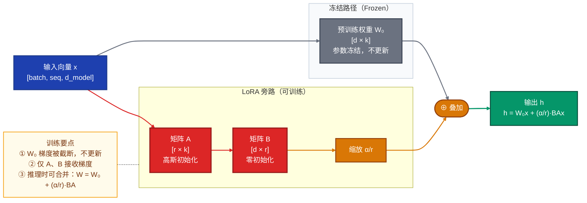
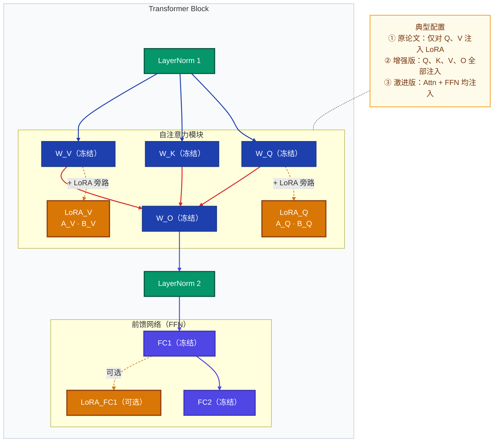
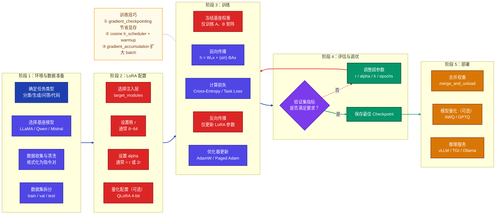
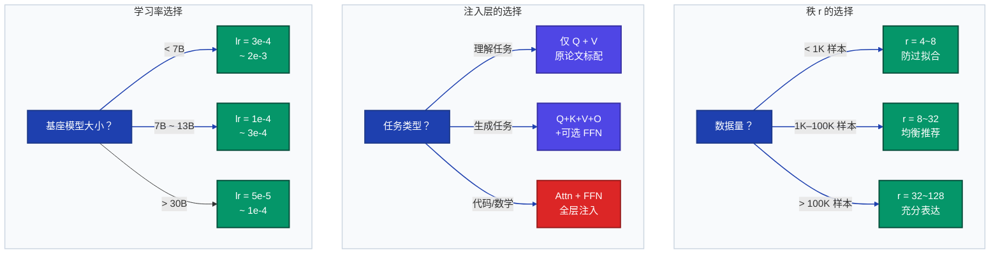

# 模型 LoRA 详解文档

> **Low-Rank Adaptation of Large Language Models**
> 本文档系统讲解 LoRA 的数学原理、应用方法、完整训练流程、常见问题及面试 FAQ。

---

## 目录

1. [LoRA 概述](#1-lora-概述)
2. [数学原理](#2-数学原理)
3. [架构设计与核心组件](#3-架构设计与核心组件)
4. [应用方法与示例](#4-应用方法与示例)
5. [完整训练流程](#5-完整训练流程)
6. [常见问题及解决方案](#6-常见问题及解决方案)
7. [注意事项](#7-注意事项)
8. [面试常见问题 FAQ](#8-面试常见问题-faq)

---

## 1. LoRA 概述

### 1.1 背景与动机

大型预训练模型（如 GPT、LLaMA、BERT）拥有数十亿参数，对其进行全量微调（Full Fine-tuning）需要：

- **显存需求极高**：存储梯度、优化器状态（Adam 需要 2 份动量）约需模型参数量的 4~8 倍显存
- **计算成本巨大**：数百 GPU 小时甚至数千 GPU 小时
- **存储代价高昂**：每个下游任务都需保存一份完整模型副本

**LoRA（Low-Rank Adaptation）** 由 Hu et al.（2021）提出，核心思想是：

> 预训练模型参数在微调过程中的"本征秩"（intrinsic rank）很低，权重更新矩阵可以用两个低秩矩阵的乘积来近似表示。

### 1.2 LoRA 与其他 PEFT 方法对比

| 方法 | 可训练参数 | 推理额外开销 | 适用场景 |
|------|-----------|-------------|---------|
| **全量微调** | 100% | 无 | 资源充足、数据充足 |
| **Adapter** | ~0.5–3% | 有（串联层） | 资源受限 |
| **Prefix Tuning** | ~0.1% | 有（KV 缓存增大） | 生成任务 |
| **Prompt Tuning** | ~0.01% | 有 | 零/少样本 |
| **LoRA** | ~0.1–1% | **无**（合并后） | 通用微调首选 |
| **QLoRA** | ~0.1–1% | 略有（量化解量化） | 消费级 GPU |

---

## 2. 数学原理

### 2.1 全量微调的权重更新

全量微调中，对预训练权重矩阵 $W_0 \in \mathbb{R}^{d \times k}$ 进行更新：

$$W = W_0 + \Delta W$$

其中 $\Delta W \in \mathbb{R}^{d \times k}$，参数量等于 $d \times k$，代价高昂。

### 2.2 LoRA 的低秩分解

LoRA 假设权重更新矩阵 $\Delta W$ 具有**低秩结构**，将其分解为：

$$\Delta W = B \cdot A$$

其中：

- $A \in \mathbb{R}^{r \times k}$：下投影矩阵（Down projection），使用**高斯随机初始化**
- $B \in \mathbb{R}^{d \times r}$：上投影矩阵（Up projection），**初始化为零**
- $r \ll \min(d, k)$：秩（rank），通常取 4、8、16、32、64

**参数量对比：**

$$\text{全量微调参数量} = d \times k$$

$$\text{LoRA 参数量} = r \times k + d \times r = r(d+k) \ll d \times k$$

**压缩比例（以 $d=k=4096,\ r=8$ 为例）：**

$$\frac{r(d+k)}{dk} = \frac{8 \times 8192}{4096 \times 4096} \approx 0.39\%$$

### 2.3 前向传播公式

在前向传播中，LoRA 对原始权重输出进行叠加：

$$h = W_0 x + \Delta W x = W_0 x + B A x$$

为了防止训练初期 $\Delta W$ 对输出造成过大扰动，引入**缩放因子**：

$$h = W_0 x + \frac{\alpha}{r} \cdot B A x$$

其中 $\alpha$ 是超参数（通常与 $r$ 相同或为其倍数），$\frac{\alpha}{r}$ 控制 LoRA 更新的贡献幅度。

### 2.4 为何 B 初始化为零

训练开始时：

$$\Delta W = B \cdot A = 0 \cdot A = 0$$

确保模型在微调初始时的行为与预训练完全一致，避免"冷启动"扰动，梯度能够稳定传播。

### 2.5 推理时的权重合并

推理阶段，可以将 LoRA 权重合并到原始权重，**消除推理额外开销**：

$$W_{\text{merged}} = W_0 + \frac{\alpha}{r} \cdot B A$$

合并后模型结构与原模型完全相同，推理速度不受影响。

---

## 3. 架构设计与核心组件

### 3.1 LoRA 整体架构



### 3.2 LoRA 在 Transformer 中的插入位置



### 3.3 核心超参数说明

| 超参数 | 含义 | 典型值 | 影响 |
|--------|------|--------|------|
| `r`（rank） | 低秩分解的秩 | 4, 8, 16, 32, 64 | 越大→表达能力越强，参数越多 |
| `alpha`（$\alpha$） | 缩放系数 | 通常等于 $r$ 或 2$r$ | 控制 LoRA 更新幅度 |
| `target_modules` | 注入 LoRA 的模块 | `q_proj, v_proj` | 决定微调覆盖范围 |
| `lora_dropout` | LoRA 层的 Dropout | 0.05–0.1 | 防止过拟合 |
| `bias` | 是否训练偏置 | `none` | 通常不训练偏置 |

---

## 4. 应用方法与示例

### 4.1 使用 PEFT 库快速上手

```python
# 安装依赖
# pip install transformers peft accelerate datasets bitsandbytes

from transformers import AutoModelForCausalLM, AutoTokenizer
from peft import LoraConfig, get_peft_model, TaskType

# ── Step 1：加载预训练模型 ────────────────────────────────────────────────
model_name = "meta-llama/Llama-2-7b-hf"
tokenizer = AutoTokenizer.from_pretrained(model_name)
model = AutoModelForCausalLM.from_pretrained(
    model_name,
    torch_dtype=torch.float16,
    device_map="auto",
)

# ── Step 2：配置 LoRA ─────────────────────────────────────────────────────
lora_config = LoraConfig(
    task_type=TaskType.CAUSAL_LM,   # 任务类型：因果语言模型
    r=16,                            # 秩
    lora_alpha=32,                   # 缩放系数 α
    target_modules=[                 # 注入 LoRA 的层名
        "q_proj", "k_proj",
        "v_proj", "o_proj",
    ],
    lora_dropout=0.05,               # Dropout 概率
    bias="none",                     # 不训练偏置
    inference_mode=False,            # 训练模式
)

# ── Step 3：将模型包装为 PEFT 模型 ────────────────────────────────────────
model = get_peft_model(model, lora_config)

# 查看可训练参数量
model.print_trainable_parameters()
# 输出示例：trainable params: 4,194,304 || all params: 6,742,609,920 || trainable%: 0.0622
```

### 4.2 QLoRA：在消费级 GPU 上微调大模型

QLoRA = **量化（4-bit）+ LoRA**，可在 24GB 显存 GPU 上微调 65B 参数模型。

```python
from transformers import BitsAndBytesConfig
import torch

# ── 4-bit 量化配置 ────────────────────────────────────────────────────────
bnb_config = BitsAndBytesConfig(
    load_in_4bit=True,               # 以 4-bit 加载
    bnb_4bit_quant_type="nf4",       # NormalFloat4 量化类型
    bnb_4bit_compute_dtype=torch.bfloat16,  # 计算时反量化为 bfloat16
    bnb_4bit_use_double_quant=True,  # 双重量化进一步压缩
)

model = AutoModelForCausalLM.from_pretrained(
    model_name,
    quantization_config=bnb_config,
    device_map="auto",
)

# 准备模型用于 k-bit 训练（必须调用，否则梯度检查点无法使用）
from peft import prepare_model_for_kbit_training
model = prepare_model_for_kbit_training(model)

# 后续 LoRA 配置与普通 LoRA 相同
lora_config = LoraConfig(
    r=64,
    lora_alpha=128,
    target_modules=["q_proj", "v_proj", "k_proj", "o_proj",
                    "gate_proj", "up_proj", "down_proj"],
    lora_dropout=0.05,
    bias="none",
    task_type=TaskType.CAUSAL_LM,
)
model = get_peft_model(model, lora_config)
```

### 4.3 完整训练示例（指令微调）

```python
from transformers import TrainingArguments, Trainer
from datasets import load_dataset

# ── 数据准备 ──────────────────────────────────────────────────────────────
dataset = load_dataset("tatsu-lab/alpaca", split="train")

def format_instruction(sample):
    """将 Alpaca 格式转换为指令-回答格式"""
    instruction = sample["instruction"]
    input_text = sample.get("input", "")
    output = sample["output"]
    if input_text:
        prompt = f"### Instruction:\n{instruction}\n\n### Input:\n{input_text}\n\n### Response:\n{output}"
    else:
        prompt = f"### Instruction:\n{instruction}\n\n### Response:\n{output}"
    return {"text": prompt}

dataset = dataset.map(format_instruction, remove_columns=dataset.column_names)

# ── Tokenization ──────────────────────────────────────────────────────────
def tokenize(sample):
    result = tokenizer(
        sample["text"],
        truncation=True,
        max_length=512,
        padding="max_length",
    )
    result["labels"] = result["input_ids"].copy()
    return result

tokenized_dataset = dataset.map(tokenize, batched=True)

# ── 训练参数 ──────────────────────────────────────────────────────────────
training_args = TrainingArguments(
    output_dir="./lora-llama2-alpaca",
    num_train_epochs=3,
    per_device_train_batch_size=4,
    gradient_accumulation_steps=4,       # 等效 batch_size = 16
    learning_rate=2e-4,
    fp16=True,
    logging_steps=50,
    save_strategy="epoch",
    warmup_ratio=0.03,
    lr_scheduler_type="cosine",
    report_to="tensorboard",
    gradient_checkpointing=True,         # 节省显存
)

# ── 训练 ──────────────────────────────────────────────────────────────────
trainer = Trainer(
    model=model,
    args=training_args,
    train_dataset=tokenized_dataset,
)
trainer.train()

# ── 保存 LoRA 权重（仅 ~10MB，而非全量模型）────────────────────────────────
model.save_pretrained("./lora-adapter")
tokenizer.save_pretrained("./lora-adapter")
```

### 4.4 推理：加载 LoRA 并合并权重

```python
from peft import PeftModel

# 方式一：保持 LoRA 分离（灵活，可动态切换 adapter）
base_model = AutoModelForCausalLM.from_pretrained(model_name, torch_dtype=torch.float16)
model = PeftModel.from_pretrained(base_model, "./lora-adapter")

# 方式二：合并权重（推理速度最优，消除额外开销）
merged_model = model.merge_and_unload()
merged_model.save_pretrained("./merged-model")

# 推理
inputs = tokenizer("### Instruction:\n介绍一下 LoRA\n\n### Response:\n", return_tensors="pt")
outputs = merged_model.generate(**inputs, max_new_tokens=256, temperature=0.7)
print(tokenizer.decode(outputs[0], skip_special_tokens=True))
```

### 4.5 多任务场景：动态切换 LoRA Adapter

```python
from peft import PeftModel

# 加载多个 LoRA adapter
base_model = AutoModelForCausalLM.from_pretrained(model_name)
model = PeftModel.from_pretrained(base_model, "./lora-code",    adapter_name="code")
model.load_adapter("./lora-math",    adapter_name="math")
model.load_adapter("./lora-medical", adapter_name="medical")

# 动态切换任务
model.set_adapter("code")    # 代码任务
output_code = model.generate(...)

model.set_adapter("math")    # 数学任务
output_math = model.generate(...)
```

---

## 5. 完整训练流程

### 5.1 端到端流程图



### 5.2 超参数选择指南



### 5.3 显存占用估算

对于 7B 参数模型（fp16），各配置的显存需求：

| 配置 | 模型权重 | 梯度 | 优化器 | 激活值 | **合计** |
|------|---------|------|--------|--------|---------|
| 全量微调 | 14 GB | 14 GB | 56 GB | ~4 GB | **~88 GB** |
| LoRA（fp16） | 14 GB | ~0.1 GB | ~0.4 GB | ~4 GB | **~18.5 GB** |
| QLoRA（4-bit） | 3.5 GB | ~0.1 GB | ~0.4 GB | ~4 GB | **~8 GB** |

---

## 6. 常见问题及解决方案

### 问题 1：训练 Loss 不下降

**现象**：训练初始几步后 Loss 维持在较高水平，几乎不下降。

**原因排查与解决：**

```python
# ❌ 错误：忘记将模型置于训练模式
model.eval()

# ✅ 正确：确保训练模式
model.train()

# ❌ 错误：学习率过低
TrainingArguments(learning_rate=1e-6)

# ✅ 推荐学习率范围（LoRA 可以用较大学习率）
TrainingArguments(learning_rate=2e-4)

# ❌ 错误：Labels 未正确设置（对于 CausalLM）
# 导致模型在预测 padding token

# ✅ 正确：将 padding token 位置的 label 设为 -100
def tokenize(sample):
    result = tokenizer(sample["text"], ...)
    labels = result["input_ids"].copy()
    # 忽略 padding 位置的损失
    labels = [l if l != tokenizer.pad_token_id else -100 for l in labels]
    result["labels"] = labels
    return result
```

### 问题 2：过拟合（训练 Loss 低，验证 Loss 高）

**解决方案：**

```python
lora_config = LoraConfig(
    r=4,                    # 降低 rank（减少参数量）
    lora_alpha=8,
    lora_dropout=0.1,       # 增大 Dropout（原来 0.0 → 0.1）
    ...
)

training_args = TrainingArguments(
    num_train_epochs=1,     # 减少 epoch
    weight_decay=0.01,      # 增加权重衰减
    warmup_ratio=0.1,       # 适当预热
    ...
)
```

### 问题 3：CUDA OOM（显存不足）

**分级解决方案（按优先级排序）：**

```python
# 方案 1：开启梯度检查点（以计算换显存，约增加 30% 计算时间）
training_args = TrainingArguments(
    gradient_checkpointing=True,
    ...
)

# 方案 2：增大梯度累积步数，减小实际 batch size
training_args = TrainingArguments(
    per_device_train_batch_size=1,       # 减小到 1
    gradient_accumulation_steps=16,      # 等效 batch = 16
    ...
)

# 方案 3：使用 bf16 或 fp16（避免 fp32 副本）
training_args = TrainingArguments(
    bf16=True,    # A100/H100 推荐
    fp16=True,    # V100/RTX 推荐
    ...
)

# 方案 4：切换到 QLoRA（4-bit 量化）
bnb_config = BitsAndBytesConfig(load_in_4bit=True, bnb_4bit_quant_type="nf4", ...)

# 方案 5：使用 Paged AdamW（防止优化器状态 OOM）
training_args = TrainingArguments(
    optim="paged_adamw_8bit",
    ...
)
```

### 问题 4：模型遗忘原始能力（灾难性遗忘）

**现象**：微调后在新任务上效果好，但通用能力（如指令跟随、常识推理）大幅下降。

**解决方案：**

```python
# 方案 1：使用较小的 rank（减少参数干扰）
lora_config = LoraConfig(r=4, ...)

# 方案 2：降低学习率，缩短训练轮数
training_args = TrainingArguments(
    learning_rate=5e-5,    # 更保守的学习率
    num_train_epochs=1,
    ...
)

# 方案 3：数据中混入少量通用指令数据（5~10%）
# 防止模型忘记通用对话能力

# 方案 4：使用 DoRA（Weight-Decomposed LoRA）
# peft >= 0.9.0 支持
lora_config = LoraConfig(
    use_dora=True,    # 幅度与方向分离，更好保留原始知识
    ...
)
```

### 问题 5：`target_modules` 配置错误

```python
# ❌ 错误：层名不匹配（不同模型的层名不同）
lora_config = LoraConfig(
    target_modules=["query", "value"],  # 这是 BERT 的层名
    ...
)

# ✅ 正确：先查看模型的实际层名
for name, module in model.named_modules():
    if "Linear" in type(module).__name__:
        print(name)
# 输出示例（LLaMA）：
# model.layers.0.self_attn.q_proj
# model.layers.0.self_attn.k_proj
# model.layers.0.self_attn.v_proj
# model.layers.0.self_attn.o_proj
# model.layers.0.mlp.gate_proj
# ...

# ✅ 正确配置（LLaMA 系列）
lora_config = LoraConfig(
    target_modules=["q_proj", "k_proj", "v_proj", "o_proj"],
    ...
)

# ✅ 或使用正则表达式匹配（PEFT 支持）
lora_config = LoraConfig(
    target_modules=r".*\.(q_proj|v_proj)",
    ...
)
```

### 问题 6：推理时 LoRA 权重未生效

```python
# ❌ 错误：直接使用 base_model 推理（未加载 LoRA）
model = AutoModelForCausalLM.from_pretrained(model_name)
output = model.generate(...)

# ✅ 正确方式一：PeftModel 包装
from peft import PeftModel
model = PeftModel.from_pretrained(base_model, "./lora-adapter")
model.eval()  # 重要！切换为推理模式

# ✅ 正确方式二：合并后使用
merged_model = model.merge_and_unload()
merged_model.eval()
```

---

## 7. 注意事项

### 7.1 数据质量优先于数量

LoRA 的高效性意味着它对数据噪声更敏感。原则：

- **宁少勿滥**：1000 条高质量数据 > 10000 条低质量数据
- **格式一致性**：prompt 模板在训练和推理时必须完全一致
- **长度分布合理**：避免大量极短或极长样本，建议截断到 512–2048 tokens

### 7.2 Rank 选择的权衡

$$\text{参数量} \propto r \quad \Rightarrow \quad \text{表达能力} \uparrow \text{但过拟合风险} \uparrow$$

| 场景 | 推荐 r |
|------|--------|
| 数据量 < 1K，任务简单 | 4–8 |
| 数据量 1K–10K，一般任务 | 8–16 |
| 数据量 > 10K，复杂任务 | 16–64 |
| 超大数据集，全面微调 | 64–128 |

### 7.3 `lora_alpha` 与 `r` 的关系

- 缩放系数 $\frac{\alpha}{r}$ 决定 LoRA 更新对原始输出的影响幅度
- **常见经验**：$\alpha = r$（缩放系数为 1）或 $\alpha = 2r$（缩放系数为 2）
- 若训练不稳定，可尝试降低 $\alpha$ 或提高 $r$

### 7.4 不要在量化模型上直接合并

```python
# ❌ 错误：在 4-bit 量化模型上 merge_and_unload（精度损失严重）
qlora_model = PeftModel.from_pretrained(quantized_base, "./lora-adapter")
merged = qlora_model.merge_and_unload()  # 不推荐

# ✅ 正确：先用 fp16/fp32 加载基座，再合并
fp16_base = AutoModelForCausalLM.from_pretrained(model_name, torch_dtype=torch.float16)
peft_model = PeftModel.from_pretrained(fp16_base, "./lora-adapter")
merged = peft_model.merge_and_unload()
merged.save_pretrained("./merged-fp16")
```

### 7.5 检查 Tokenizer 特殊 Token

```python
# 确保 pad_token 已设置（LLaMA 默认无 pad_token）
if tokenizer.pad_token is None:
    tokenizer.pad_token = tokenizer.eos_token
    # 或添加新 token
    tokenizer.add_special_tokens({"pad_token": "[PAD]"})
    model.resize_token_embeddings(len(tokenizer))
```

### 7.6 梯度检查点与 PEFT 的兼容性

```python
# 使用梯度检查点时，需在 get_peft_model 之后调用
model = get_peft_model(model, lora_config)
model.enable_input_require_grads()   # 关键！否则梯度检查点无法正常工作
```

### 7.7 保存与恢复仅保存 LoRA 权重

```python
# ✅ 只保存 LoRA adapter（~几 MB ~ 几百 MB，视 r 和注入层数量而定）
model.save_pretrained("./lora-adapter")
# 保存结构：
# lora-adapter/
# ├── adapter_config.json    # LoRA 配置（r, alpha, target_modules...）
# └── adapter_model.safetensors  # 仅 A、B 矩阵权重

# ✅ 加载时需指定原始基座模型路径
base_model = AutoModelForCausalLM.from_pretrained(original_model_name)
model = PeftModel.from_pretrained(base_model, "./lora-adapter")
```

---

## 8. 面试常见问题 FAQ

### Q1：LoRA 的核心思想是什么？为什么低秩分解是合理的？

**答：**

LoRA 的核心思想是：**预训练模型在特定任务上微调时，权重的更新矩阵 $\Delta W$ 具有低内在秩（low intrinsic rank）**。

其合理性基于两点实验观察：

1. **预训练已编码丰富知识**：对于下游任务，模型只需"调整"少量关键方向，而非重新学习所有参数。Aghajanyan et al.（2021）通过实验证明，微调的本征维度（intrinsic dimensionality）远小于参数空间维度。

2. **矩阵秩约束**：在 $W_0 + \Delta W$ 中，如果 $\Delta W$ 真正具有低秩，则用 $BA$（$r \ll \min(d,k)$）近似是数学上的最优低秩逼近（SVD 理论保证）。

因此，LoRA 用 $r(d+k)$ 个参数近似 $dk$ 个参数的更新，在低秩假设成立时几乎无损失。

---

### Q2：为什么 B 初始化为零，而 A 用高斯初始化？

**答：**

训练开始时，$\Delta W = BA = \mathbf{0} \cdot A = \mathbf{0}$，确保：

- **稳定性**：微调初始时模型输出与预训练完全一致，避免冷启动时的剧烈扰动
- **梯度可传播**：$A$ 用高斯随机初始化，保证 $A$ 非零，从而梯度能通过 $\frac{\partial L}{\partial A} = B^T \frac{\partial L}{\partial (BA)}$ 正常流动

若 $A$ 也初始化为零，则 $\frac{\partial L}{\partial A} = 0$，梯度消失，训练无法进行。

---

### Q3：LoRA 与 Adapter Tuning 有何区别？

**答：**

| 维度 | LoRA | Adapter |
|------|------|---------|
| **结构** | 并行旁路（与 W 并联） | 串行插入（在层内串联） |
| **推理开销** | 合并后**零开销** | 始终有额外的前向计算 |
| **参数效率** | 相近 | 相近 |
| **实现复杂度** | 较低（无需修改层结构） | 较高（需插入新模块） |
| **延迟影响** | 无（合并后） | 有（每层多 2 次 Linear 计算） |

LoRA 在推理延迟方面有显著优势，这是其成为 PEFT 主流方案的关键原因。

---

### Q4：rank（r）如何选择？选太大或太小各有什么问题？

**答：**

- **r 过小**：模型表达能力不足，无法捕捉任务所需的语义变化，欠拟合
- **r 过大**：等价于近似全量微调，参数增多导致过拟合，且失去 LoRA 的轻量优势

**经验法则**：
- 简单任务/小数据集：$r = 4 \sim 8$
- 通用指令微调：$r = 16 \sim 32$
- 复杂多任务/大数据集：$r = 64 \sim 128$

可通过网格搜索（Grid Search）或贝叶斯优化自动选择最优 $r$。

---

### Q5：QLoRA 相比 LoRA 有哪些改进？有什么代价？

**答：**

QLoRA（Dettmers et al., 2023）的三大技术创新：

1. **4-bit NormalFloat（NF4）量化**：针对正态分布权重的最优 4-bit 量化格式，保证量化精度
2. **双重量化（Double Quantization）**：对量化常数再次量化，每参数额外节省约 0.37 bits
3. **Paged Optimizer**：使用 NVIDIA 统一内存分页，防止优化器状态导致 OOM

**代价：**
- 前向传播需将 4-bit 权重反量化为 bfloat16 进行计算，引入约 10–20% 的额外计算时间
- 量化/反量化带来微小的精度损失（通常可忽略）

---

### Q6：如何判断 LoRA 是否注入了正确的层？

**答：**

```python
# 方法一：打印可训练参数
model.print_trainable_parameters()
# 预期输出包含 "lora_A" 和 "lora_B"

# 方法二：遍历模块检查
for name, param in model.named_parameters():
    if param.requires_grad:
        print(f"✅ 可训练: {name}, shape={param.shape}")
# 正确输出示例：
# ✅ 可训练: base_model.model.layers.0.self_attn.q_proj.lora_A.default.weight
# ✅ 可训练: base_model.model.layers.0.self_attn.q_proj.lora_B.default.weight

# 方法三：验证冻结参数
for name, param in model.named_parameters():
    if not param.requires_grad and "lora" not in name:
        assert "W" in name or "weight" in name  # 基座权重应被冻结
```

---

### Q7：LoRA 的权重可以合并到基座模型吗？合并过程的数学原理是什么？

**答：**

可以合并，且合并后推理速度与原模型完全相同。

**数学原理：**

推理时的输出：

$$h = W_0 x + \frac{\alpha}{r} B A x = \left(W_0 + \frac{\alpha}{r} B A\right) x = W_{\text{merged}} \cdot x$$

合并操作等价于在权重空间中做加法，不改变模型结构，合并后 $W_{\text{merged}} \in \mathbb{R}^{d \times k}$ 与原始 $W_0$ 形状完全相同。

```python
# PEFT 一行代码完成合并
merged_model = peft_model.merge_and_unload()
```

---

### Q8：什么是 DoRA？它相比 LoRA 有什么优势？

**答：**

**DoRA（Weight-Decomposed Low-Rank Adaptation，Liu et al., 2024）** 将权重矩阵分解为**幅度（magnitude）** 和 **方向（direction）** 两个分量分别微调：

$$W = m \cdot \frac{V + \Delta V}{\|V + \Delta V\|}$$

其中 $m$ 为可训练标量，$\Delta V$ 用 LoRA 低秩分解近似。

**优势：**
- 更接近全量微调的学习模式（全量微调同时调整幅度和方向，LoRA 主要调整方向）
- 在同等参数量下，DoRA 的下游任务性能通常优于 LoRA
- 特别适合需要保留原始模型知识的场景

---

### Q9：LoRA 在多任务场景下如何部署？

**答：**

三种主要方案：

**方案一：独立 Adapter（推荐）**

```python
# 每个任务保存独立 adapter，推理时动态加载
model.set_adapter("task_name")
```

**方案二：LoRA 权重合并（融合多任务）**

$$W_{\text{merged}} = W_0 + \sum_{i} \lambda_i \frac{\alpha_i}{r_i} B_i A_i$$

通过线性组合多个 LoRA，实现多任务知识融合（LoRAHub、LoRA Merge）。

**方案三：MOELoRA（Mixture of LoRA Experts）**

将多个 LoRA 作为专家，通过路由机制动态选择，兼顾多任务性能与推理效率。

---

### Q10：LoRA 训练稳定性差怎么排查？

**答：**

```
Loss 爆炸/NaN → 检查学习率是否过大（建议 1e-4 ~ 3e-4）
                确认是否开启了 fp16 梯度溢出（改用 bf16）
                检查数据是否存在异常长文本

Loss 震荡大  → 增加 warmup_steps（建议 warmup_ratio=0.03~0.1）
               减小 learning_rate
               增大 gradient_accumulation_steps

Loss 不收敛 → 检查 target_modules 是否正确
              确认 labels 设置正确（非全 -100）
              检查 tokenizer 的 padding 设置
```

---

*文档版本：v1.0 | 最后更新：2026-03-18*
*参考文献：*
- *Hu et al. (2021). LoRA: Low-Rank Adaptation of Large Language Models. ICLR 2022.*
- *Dettmers et al. (2023). QLoRA: Efficient Finetuning of Quantized LLMs. NeurIPS 2023.*
- *Liu et al. (2024). DoRA: Weight-Decomposed Low-Rank Adaptation. ICML 2024.*
