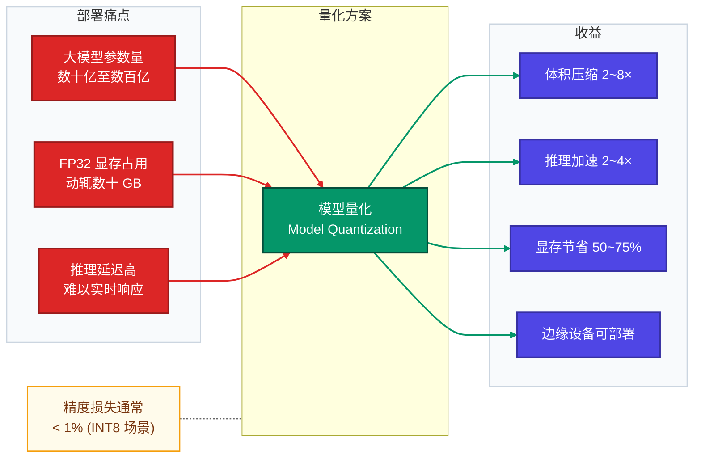
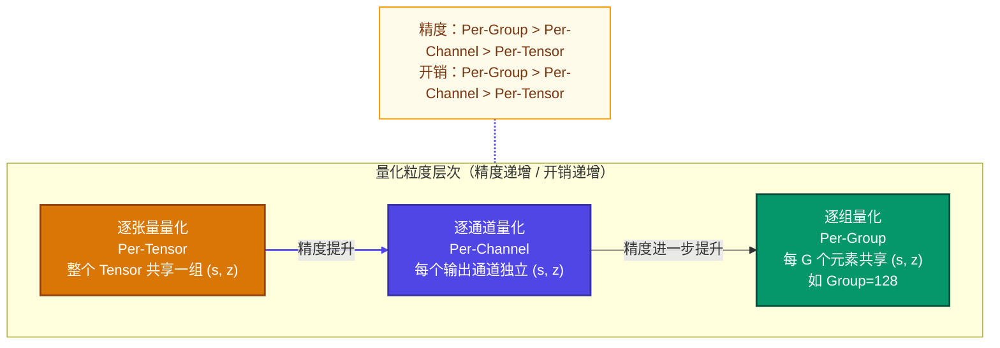
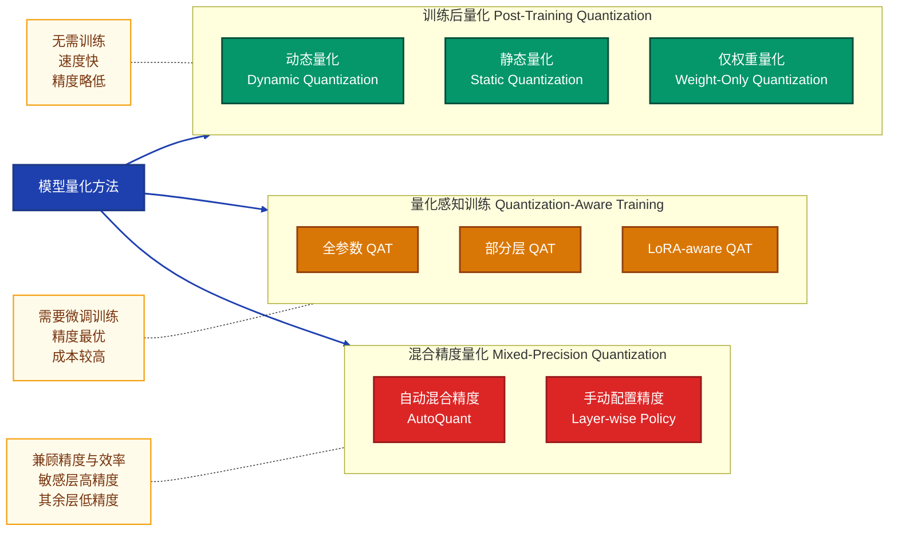
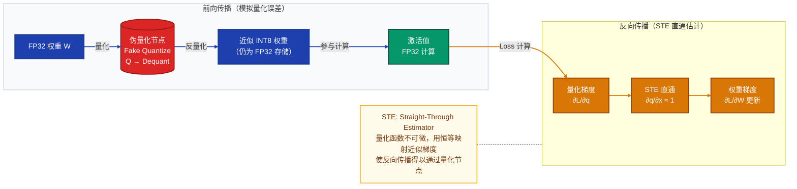
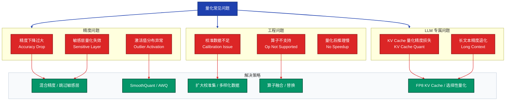
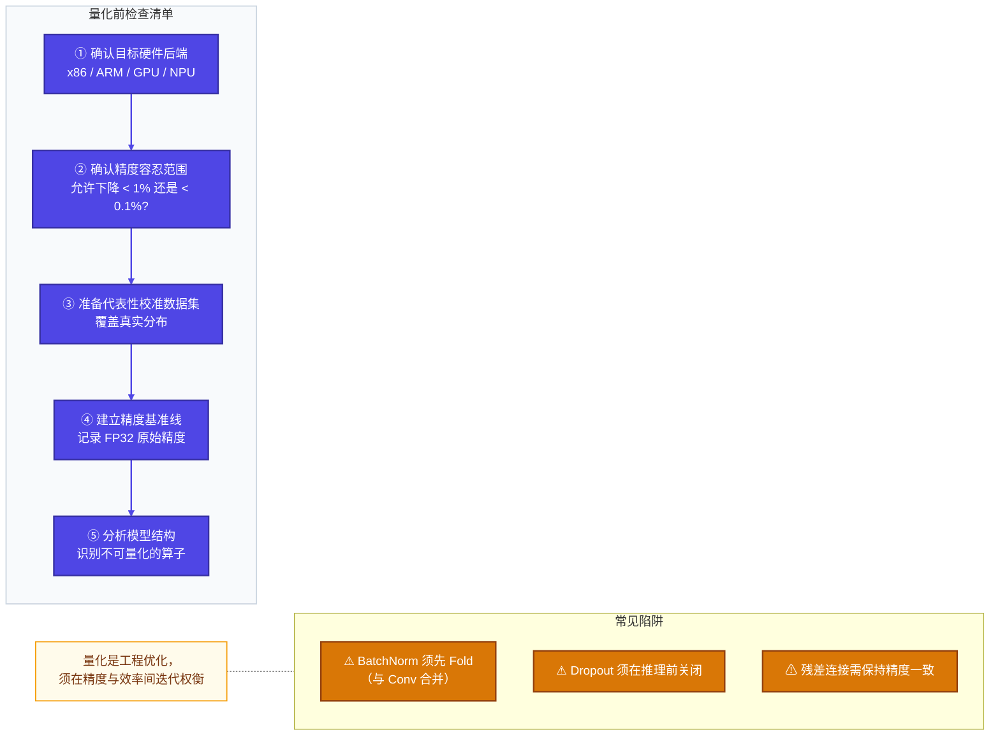
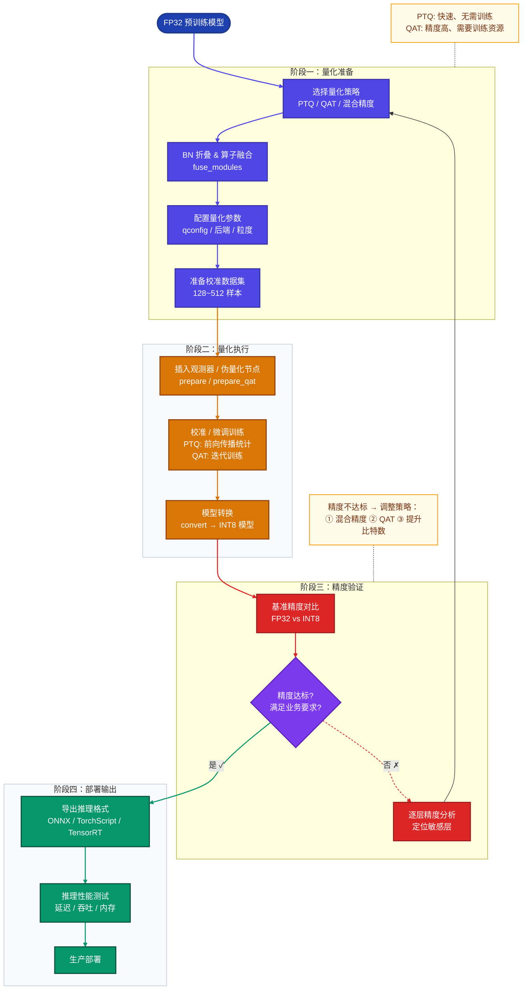

# 模型量化技术详解

> **文档说明**：本文档系统讲解深度学习模型量化的核心原理、主流方法、工程实践与常见问题，适用于模型部署、推理优化场景。文档包含 Mermaid 架构图、代码示例与 FAQ，覆盖从理论到落地的完整知识体系。

---

## 目录

1. [模型量化概述](#1-模型量化概述)
2. [量化核心原理](#2-量化核心原理)
3. [量化方法分类与应用](#3-量化方法分类与应用)
4. [常见问题与解决方案](#4-常见问题与解决方案)
5. [量化注意事项](#5-量化注意事项)
6. [完整量化流程与示例](#6-完整量化流程与示例)
7. [面试常见问题 FAQ](#7-面试常见问题-faq)

---

## 1. 模型量化概述

### 1.1 什么是模型量化

**模型量化（Model Quantization）** 是将神经网络中的浮点数参数（通常为 FP32）映射到低比特整数（INT8、INT4 甚至 INT2）表示的压缩技术。其核心目标是：

| 目标 | 说明 |
|------|------|
| **减小模型体积** | FP32 → INT8 可使模型体积缩小约 4 倍 |
| **加速推理** | 整数运算比浮点运算效率更高，可大幅提升吞吐量 |
| **降低内存占用** | 减少模型加载和运行时的显存/内存占用 |
| **降低功耗** | 边缘设备部署时，降低能耗延长续航 |

### 1.2 量化的意义



---

## 2. 量化核心原理

### 2.1 量化的数学本质

量化本质是一个**非线性映射**过程：将连续浮点值域 $[x_{min}, x_{max}]$ 均匀（或非均匀）映射到整数值域 $[q_{min}, q_{max}]$。

#### 线性（均匀）量化公式

**量化（Quantize）**：

$$q = \text{clip}\left( \text{round}\left(\frac{x}{s}\right) + z,\ q_{min},\ q_{max} \right)$$

**反量化（Dequantize）**：

$$\hat{x} = s \cdot (q - z)$$

其中：

| 符号 | 含义 |
|------|------|
| $x$ | 原始浮点值 |
| $q$ | 量化整数值 |
| $\hat{x}$ | 反量化后的近似浮点值 |
| $s$ | **缩放因子（Scale）**，控制量化粒度 |
| $z$ | **零点（Zero Point）**，偏移补偿，INT 格式下使零值精确表示 |
| $q_{min}, q_{max}$ | 整数表示范围（INT8 为 $-128 \sim 127$） |

#### Scale 和 Zero Point 的计算

$$s = \frac{x_{max} - x_{min}}{q_{max} - q_{min}}, \quad z = \text{round}\left(q_{min} - \frac{x_{min}}{s}\right)$$

> **对称量化**：令 $z = 0$，简化计算，常用于权重量化；  
> **非对称量化**：$z \neq 0$，更精确地覆盖激活值分布，常用于激活值量化。

### 2.2 量化误差分析

量化引入的**舍入误差（Rounding Error）**：

$$\epsilon = \hat{x} - x = s \cdot \text{round}\left(\frac{x}{s}\right) - x$$

误差上界为 $|\epsilon| \leq \frac{s}{2}$，因此缩小 $s$（即提高比特数）可降低误差。

### 2.3 量化粒度



---

## 3. 量化方法分类与应用

### 3.1 方法全景图



### 3.2 训练后量化（PTQ）

#### 3.2.1 动态量化（Dynamic Quantization）

**原理**：权重离线量化为 INT8，激活值在推理时动态计算 scale，**无需校准数据集**。

**适用场景**：NLP 模型（LSTM、Transformer 的线性层）、对延迟要求不敏感的场景。

```python
import torch
from torch.quantization import quantize_dynamic

# 原始 FP32 模型
model_fp32 = MyTransformerModel()
model_fp32.eval()

# 动态量化：指定需量化的层类型
model_int8 = quantize_dynamic(
    model_fp32,
    {torch.nn.Linear, torch.nn.LSTM},  # 量化目标层
    dtype=torch.qint8
)

# 推理（激活值在运行时动态量化）
output = model_int8(input_tensor)
print(f"FP32 模型大小: {get_model_size(model_fp32):.2f} MB")
print(f"INT8 模型大小: {get_model_size(model_int8):.2f} MB")
```

#### 3.2.2 静态量化（Static Quantization）

**原理**：使用校准数据集（Calibration Dataset）统计激活值分布，提前确定 scale 和 zero point，推理时无额外计算开销。

**适用场景**：CNN 图像模型、推理延迟要求极低的场景。

```python
import torch
from torch.quantization import (
    get_default_qconfig,
    prepare,
    convert,
    quantize_fx
)

model_fp32 = MyCNNModel()
model_fp32.eval()

# Step 1: 配置量化方案（后端 fbgemm 适用 x86，qnnpack 适用 ARM）
model_fp32.qconfig = get_default_qconfig('fbgemm')

# Step 2: 插入观测器（Observer），准备收集统计信息
model_prepared = prepare(model_fp32)

# Step 3: 校准（使用代表性数据集，通常 100~1000 个样本即可）
def calibrate(model, data_loader, num_batches=100):
    with torch.no_grad():
        for i, (images, _) in enumerate(data_loader):
            if i >= num_batches:
                break
            model(images)

calibrate(model_prepared, calibration_loader)

# Step 4: 将模型转换为量化模型
model_int8 = convert(model_prepared)

# Step 5: 推理（激活值使用预计算的 scale/zero_point）
with torch.no_grad():
    output = model_int8(input_tensor)
```

#### 3.2.3 仅权重量化（Weight-Only Quantization）

**原理**：仅将权重量化为低比特（INT4/INT8），激活值保持 FP16/BF16，计算时即时反量化。适合大语言模型（LLM）的内存瓶颈场景。

**代表方案**：GPTQ、AWQ、GGUF（llama.cpp）

```python
# 使用 bitsandbytes 进行 4-bit 权重量化（NF4 格式）
from transformers import AutoModelForCausalLM, BitsAndBytesConfig
import torch

bnb_config = BitsAndBytesConfig(
    load_in_4bit=True,
    bnb_4bit_quant_type="nf4",          # NormalFloat4，适合正态分布权重
    bnb_4bit_compute_dtype=torch.bfloat16,  # 计算时反量化到 BF16
    bnb_4bit_use_double_quant=True,     # 二次量化：量化 scale 本身，进一步节省
)

model = AutoModelForCausalLM.from_pretrained(
    "meta-llama/Llama-2-7b-hf",
    quantization_config=bnb_config,
    device_map="auto"
)
```

### 3.3 量化感知训练（QAT）

**原理**：在训练/微调阶段引入**伪量化节点（Fake Quantize）**，模拟量化误差，使模型主动学习在量化约束下保持性能。



```python
# PyTorch QAT 示例
import torch
from torch.quantization import get_default_qat_qconfig, prepare_qat, convert

model = MyCNNModel()

# Step 1: 配置 QAT
model.qconfig = get_default_qat_qconfig('fbgemm')

# Step 2: 插入伪量化节点
model_qat = prepare_qat(model.train())

# Step 3: 微调训练（通常只需原始训练轮次的 10%~20%）
optimizer = torch.optim.SGD(model_qat.parameters(), lr=1e-4)
for epoch in range(num_epochs):
    for images, labels in train_loader:
        optimizer.zero_grad()
        output = model_qat(images)
        loss = criterion(output, labels)
        loss.backward()
        optimizer.step()

# Step 4: 转换为真实量化模型
model_qat.eval()
model_int8 = convert(model_qat)
```

### 3.4 主流 LLM 量化方案对比

| 方案 | 类型 | 精度 | 比特数 | 核心思路 | 适用场景 |
|------|------|------|--------|----------|----------|
| **GPTQ** | PTQ | ★★★★ | INT4/INT3 | 逐层最优化量化误差（OBQ） | GPU 推理，LLM 压缩 |
| **AWQ** | PTQ | ★★★★☆ | INT4 | 保护显著权重，等比缩放激活 | GPU 推理，精度优先 |
| **GGUF/llama.cpp** | PTQ | ★★★ | Q2~Q8 | 分组量化 + CPU 优化内核 | CPU/边缘推理 |
| **SmoothQuant** | PTQ | ★★★★ | INT8 | 将量化难度从激活迁移到权重 | W8A8 推理加速 |
| **QAT（LoRA）** | QAT | ★★★★★ | INT4/INT8 | 微调恢复量化精度 | 精度要求极高场景 |
| **bitsandbytes** | PTQ | ★★★ | NF4/INT8 | 简单易用，适合快速部署 | 训练显存压缩 |

---

## 4. 常见问题与解决方案

### 4.1 问题全景



### 4.2 精度下降过大

**现象**：INT8 量化后 Top-1 准确率下降 > 2%，或困惑度（PPL）显著升高。

**原因分析**：
- 权重或激活值分布存在大量**异常值（Outlier）**
- 量化比特数过低（如 INT4）
- 校准数据分布与推理数据不匹配

**解决方案**：

```python
# 方案1：混合精度 —— 对敏感层保留 FP16
from torch.quantization import QConfig
import torch.quantization.observer as observer

# 普通层使用 INT8，敏感的注意力层保留 FP16
sensitive_layers = ['attention.qkv', 'attention.output']

for name, module in model.named_modules():
    if any(sl in name for sl in sensitive_layers):
        module.qconfig = None  # 跳过量化
    else:
        module.qconfig = get_default_qconfig('fbgemm')
```

```python
# 方案2：SmoothQuant —— 平滑激活值异常峰值
# 核心思路：Y = (X · diag(s)^{-1}) · (diag(s) · W)
# 将激活值的量化难度迁移到权重上

import torch

def smooth_quant_migrate(model, alpha=0.5):
    """
    alpha: 迁移强度，0.5 为默认值，越大越向权重迁移
    """
    for name, module in model.named_modules():
        if isinstance(module, torch.nn.Linear):
            # 获取激活值的 max（通过校准获得）
            act_max = get_activation_max(module)
            weight_max = module.weight.abs().max(dim=0).values

            # 计算平滑因子
            s = (act_max ** alpha) / (weight_max ** (1 - alpha))
            s = s.clamp(min=1e-5)

            # 调整权重和激活缩放
            module.weight.data = module.weight.data / s.unsqueeze(0)
            # 对应前一层输出乘以 s（通过 hook 实现）
    return model
```

### 4.3 激活值异常值（Outlier）问题

**现象**：LLM 中部分通道激活值远大于均值（如 100 倍以上），导致 INT8 量化精度急剧下降。

**解决方案**：

| 方案 | 思路 | 适用场景 |
|------|------|----------|
| **SmoothQuant** | 将激活缩放迁移到权重，均衡分布 | W8A8 推理 |
| **AWQ** | 识别并保护影响大的权重通道 | LLM W4A16 |
| **GPTQ** | 逐层最小化量化误差 | LLM W4 压缩 |
| **FP8** | 用 FP8 替代 INT8，保留更大动态范围 | H100 推理 |

### 4.4 校准数据不足或不匹配

**现象**：校准后量化模型在实际推理中表现不稳定，不同输入结果差异大。

**解决方案**：

```python
# 校准数据最佳实践
def build_calibration_dataset(full_dataset, strategy='diverse'):
    """
    推荐策略：
    - 数量：CNN 模型约 200~500 张，LLM 约 128~512 条文本
    - 多样性：覆盖各类别、各长度、各场景
    - 代表性：避免使用训练集，推荐使用验证集
    """
    if strategy == 'diverse':
        # 按类别均匀采样
        indices = stratified_sample(full_dataset, n_per_class=10)
    elif strategy == 'random':
        indices = random.sample(range(len(full_dataset)), 256)

    return Subset(full_dataset, indices)

# 推荐：使用 MinMaxObserver 替代默认的 HistogramObserver
# MinMaxObserver 对异常值更鲁棒
from torch.quantization import MinMaxObserver, PerChannelMinMaxObserver

custom_qconfig = QConfig(
    activation=MinMaxObserver.with_args(dtype=torch.quint8),
    weight=PerChannelMinMaxObserver.with_args(dtype=torch.qint8)
)
```

### 4.5 算子不支持问题

**现象**：自定义算子或特殊激活函数（如 SiLU、GELU）无法被量化框架识别，报错或跳过。

**解决方案**：

```python
# 方案1：注册自定义量化映射
from torch.quantization import DEFAULT_MODULE_MAPPING

# 自定义 SiLU 量化模块
class QuantizableSiLU(torch.nn.SiLU):
    def forward(self, x):
        return torch.nn.functional.silu(x)

# 注册映射
custom_mapping = {torch.nn.SiLU: QuantizableSiLU}

# 方案2：使用 fx 图模式量化（更灵活）
from torch.quantization.quantize_fx import prepare_fx, convert_fx
from torch.quantization.fx.custom_config import PrepareCustomConfig

prepare_custom_config = PrepareCustomConfig()
prepare_custom_config.set_float_to_observed_mapping(
    torch.nn.SiLU, QuantizableSiLU
)

model_prepared = prepare_fx(
    model,
    qconfig_mapping,
    example_inputs,
    prepare_custom_config=prepare_custom_config
)
```

### 4.6 量化后推理速度没有提升

**现象**：INT8 模型比 FP32 更慢，或加速效果不明显。

**原因与解决**：

| 原因 | 解决方案 |
|------|----------|
| 硬件不支持 INT8 加速指令 | 确认硬件（x86 需 AVX512-VNNI，ARM 需 NEON） |
| 量化/反量化开销抵消收益 | 减少 dequant 次数，使用 W8A8 而非 W8A16 |
| 模型计算量过小，Overhead 占主导 | 量化对小模型收益有限，考虑其他优化手段 |
| 未使用量化专用算子库 | 使用 TensorRT / ONNX Runtime / vLLM 等优化推理框架 |

---

## 5. 量化注意事项

### 5.1 量化前的准备



### 5.2 逐条注意事项

**① 后端一致性**

不同推理后端（PyTorch、TensorRT、ONNX Runtime、OpenVINO）的量化规范不同，须确保量化配置与目标后端匹配：

```python
# x86 CPU 推理
model.qconfig = get_default_qconfig('fbgemm')

# ARM 移动端（Android/iOS）
model.qconfig = get_default_qconfig('qnnpack')

# NVIDIA GPU（通过 TensorRT）
# 需使用 TensorRT Python API 或 torch2trt 工具链
```

**② BatchNorm 折叠（BN Fold）**

量化前必须将 BatchNorm 与前置 Conv/Linear 融合，否则量化误差会被 BN 放大：

```python
import torch
from torch.quantization.fuse_modules import fuse_modules

# 将 Conv + BN + ReLU 融合为单一算子
model_fused = fuse_modules(model, [
    ['conv1', 'bn1', 'relu1'],
    ['conv2', 'bn2'],
    # ... 其他需要融合的层组合
])
```

**③ 精度敏感层的处理**

以下层通常对量化敏感，建议保留 FP32/FP16：
- 模型第一层（输入层）和最后一层（输出层/分类头）
- Softmax、LayerNorm 等归一化层
- 注意力机制的 Softmax 计算
- 损失函数相关层

**④ 量化粒度选择原则**

| 场景 | 推荐粒度 | 原因 |
|------|----------|------|
| CNN 权重 | Per-Channel | 不同卷积核差异大，需独立 scale |
| Transformer 权重 | Per-Group（G=128） | 权重分布差异更大，需更细粒度 |
| 激活值 | Per-Tensor（动态）| 推理时实时计算，粗粒度节省开销 |

**⑤ 校准数据集要求**

- 数量：通常 **100~512 个样本**足够，过多不会显著提升精度
- 分布：须与**推理时的真实数据分布一致**
- 多样性：覆盖所有可能的输入类型（图像：各类别；文本：各长度、各领域）
- 禁止：不得使用测试集作为校准集（防止过拟合到测试分布）

**⑥ 量化顺序**

```
模型训练完成 → BN Fold → 结构验证 → 校准/伪量化 → 精度评估 → 部署转换
```

不可跳过结构验证步骤，量化图中的算子替换可能引入静默错误。

---

## 6. 完整量化流程与示例

### 6.1 完整流程总览



### 6.2 完整示例：ResNet-50 图像分类 PTQ 流程

```python
"""
完整 PTQ 示例：ResNet-50 静态量化
目标：FP32 → INT8，精度损失 < 0.5%
"""
import torch
import torchvision
import torchvision.transforms as transforms
from torch.quantization import (
    get_default_qconfig,
    fuse_modules,
    prepare,
    convert
)
import copy
import time

# ──────────────────────────────────────────
# Step 0: 加载预训练模型，建立精度基准
# ──────────────────────────────────────────
model_fp32 = torchvision.models.resnet50(pretrained=True)
model_fp32.eval()

# 数据预处理
transform = transforms.Compose([
    transforms.Resize(256),
    transforms.CenterCrop(224),
    transforms.ToTensor(),
    transforms.Normalize(mean=[0.485, 0.456, 0.406],
                         std=[0.229, 0.224, 0.225]),
])

val_dataset = torchvision.datasets.ImageNet(root='/data/imagenet',
                                             split='val',
                                             transform=transform)
val_loader = torch.utils.data.DataLoader(val_dataset, batch_size=64,
                                          num_workers=4, shuffle=False)

def evaluate(model, data_loader, num_batches=50):
    """评估 Top-1 准确率"""
    model.eval()
    correct, total = 0, 0
    with torch.no_grad():
        for i, (images, labels) in enumerate(data_loader):
            if i >= num_batches:
                break
            outputs = model(images)
            _, predicted = outputs.max(1)
            total += labels.size(0)
            correct += predicted.eq(labels).sum().item()
    return 100. * correct / total

# 记录基准精度
fp32_acc = evaluate(model_fp32, val_loader)
print(f"FP32 Top-1 精度: {fp32_acc:.2f}%")

# ──────────────────────────────────────────
# Step 1: BN 折叠（BatchNorm 与 Conv 融合）
# ──────────────────────────────────────────
model_fused = copy.deepcopy(model_fp32)

# ResNet50 的层融合配置
def fuse_resnet50(model):
    # 融合第一个卷积层
    fuse_modules(model, ['conv1', 'bn1', 'relu'], inplace=True)

    # 融合各残差块
    for name, module in model.named_children():
        if isinstance(module, torch.nn.Sequential):
            for block_name, block in module.named_children():
                # BasicBlock / Bottleneck 中的卷积融合
                fuse_modules(block, ['conv1', 'bn1', 'relu'], inplace=True)
                fuse_modules(block, ['conv2', 'bn2'], inplace=True)
                if hasattr(block, 'conv3'):
                    fuse_modules(block, ['conv3', 'bn3'], inplace=True)
                # 下采样层
                if hasattr(block, 'downsample') and block.downsample:
                    fuse_modules(block.downsample, ['0', '1'], inplace=True)
    return model

model_fused = fuse_resnet50(model_fused)
print("✓ BN 折叠完成")

# ──────────────────────────────────────────
# Step 2: 配置量化参数
# ──────────────────────────────────────────
# x86 CPU 推理使用 fbgemm 后端
model_fused.qconfig = get_default_qconfig('fbgemm')

# ──────────────────────────────────────────
# Step 3: 插入观测器，准备校准
# ──────────────────────────────────────────
model_prepared = prepare(model_fused, inplace=False)
print("✓ 观测器插入完成")

# ──────────────────────────────────────────
# Step 4: 校准（收集激活值统计信息）
# ──────────────────────────────────────────
calib_dataset = torch.utils.data.Subset(val_dataset,
                                         list(range(512)))  # 512 张校准图
calib_loader = torch.utils.data.DataLoader(calib_dataset,
                                            batch_size=32, shuffle=True)

print("开始校准...")
with torch.no_grad():
    for i, (images, _) in enumerate(calib_loader):
        model_prepared(images)
        if (i + 1) % 4 == 0:
            print(f"  已处理 {(i + 1) * 32} 张校准图")
print("✓ 校准完成")

# ──────────────────────────────────────────
# Step 5: 转换为 INT8 模型
# ──────────────────────────────────────────
model_int8 = convert(model_prepared, inplace=False)
print("✓ INT8 转换完成")

# ──────────────────────────────────────────
# Step 6: 精度与性能评估
# ──────────────────────────────────────────
int8_acc = evaluate(model_int8, val_loader)
print(f"\n=== 量化结果 ===")
print(f"FP32 Top-1 精度: {fp32_acc:.2f}%")
print(f"INT8 Top-1 精度: {int8_acc:.2f}%")
print(f"精度损失: {fp32_acc - int8_acc:.2f}%")

# 推理速度对比
def benchmark(model, input_shape=(1, 3, 224, 224), n=100):
    dummy = torch.randn(*input_shape)
    # 预热
    for _ in range(10):
        model(dummy)
    start = time.perf_counter()
    for _ in range(n):
        model(dummy)
    return (time.perf_counter() - start) / n * 1000  # ms

fp32_latency = benchmark(model_fp32)
int8_latency = benchmark(model_int8)
print(f"\nFP32 推理延迟: {fp32_latency:.2f} ms")
print(f"INT8 推理延迟: {int8_latency:.2f} ms")
print(f"加速比: {fp32_latency / int8_latency:.2f}×")

# 模型大小对比
def get_model_size_mb(model):
    torch.save(model.state_dict(), '/tmp/tmp_model.pt')
    import os
    return os.path.getsize('/tmp/tmp_model.pt') / 1024 / 1024

fp32_size = get_model_size_mb(model_fp32)
int8_size = get_model_size_mb(model_int8)
print(f"\nFP32 模型大小: {fp32_size:.2f} MB")
print(f"INT8 模型大小: {int8_size:.2f} MB")
print(f"压缩比: {fp32_size / int8_size:.2f}×")

# ──────────────────────────────────────────
# Step 7: 导出（TorchScript 格式）
# ──────────────────────────────────────────
scripted_model = torch.jit.script(model_int8)
scripted_model.save('resnet50_int8.pt')
print("\n✓ 模型已导出至 resnet50_int8.pt")
```

### 6.3 完整示例：LLM 4-bit 量化部署（GPTQ + vLLM）

```python
"""
完整示例：使用 AutoGPTQ 对 LLM 进行 INT4 量化，并用 vLLM 部署
"""
from auto_gptq import AutoGPTQForCausalLM, BaseQuantizeConfig
from transformers import AutoTokenizer
from datasets import load_dataset

MODEL_NAME = "meta-llama/Llama-2-7b-hf"
SAVE_PATH = "./llama2-7b-gptq-int4"

# ──────────────────────────────────────────
# Step 1: 配置 GPTQ 量化参数
# ──────────────────────────────────────────
quantize_config = BaseQuantizeConfig(
    bits=4,                    # 量化比特数：4-bit
    group_size=128,            # 分组大小：每 128 个权重共享一组 scale
    desc_act=True,             # 使用激活顺序（提升精度，稍微增加推理开销）
    sym=False,                 # 非对称量化，激活值分布通常不对称
)

# ──────────────────────────────────────────
# Step 2: 加载模型和 Tokenizer
# ──────────────────────────────────────────
tokenizer = AutoTokenizer.from_pretrained(MODEL_NAME)
model = AutoGPTQForCausalLM.from_pretrained(
    MODEL_NAME,
    quantize_config=quantize_config
)

# ──────────────────────────────────────────
# Step 3: 准备校准数据集（WikiText-2 节选）
# ──────────────────────────────────────────
def get_calibration_data(tokenizer, n_samples=128, seq_len=2048):
    dataset = load_dataset("wikitext", "wikitext-2-raw-v1", split="train")
    texts = [t for t in dataset["text"] if len(t) > 100][:n_samples * 4]

    calibration_data = []
    for text in texts:
        tokens = tokenizer(
            text,
            return_tensors="pt",
            max_length=seq_len,
            truncation=True,
            padding=False
        )
        if tokens.input_ids.shape[1] >= seq_len // 2:
            calibration_data.append(tokens)
        if len(calibration_data) >= n_samples:
            break
    return calibration_data

print("准备校准数据...")
calib_data = get_calibration_data(tokenizer)
print(f"✓ 校准样本数: {len(calib_data)}")

# ──────────────────────────────────────────
# Step 4: 执行 GPTQ 量化（逐层最优化）
# ──────────────────────────────────────────
print("开始 GPTQ 量化（约需 10~30 分钟）...")
model.quantize(
    calib_data,
    use_triton=True,    # 使用 Triton 加速校准过程
    batch_size=4,
)
print("✓ 量化完成")

# ──────────────────────────────────────────
# Step 5: 保存量化模型
# ──────────────────────────────────────────
model.save_quantized(SAVE_PATH, use_safetensors=True)
tokenizer.save_pretrained(SAVE_PATH)
print(f"✓ 量化模型已保存至 {SAVE_PATH}")

# ──────────────────────────────────────────
# Step 6: 使用 vLLM 高性能部署
# ──────────────────────────────────────────
from vllm import LLM, SamplingParams

llm = LLM(
    model=SAVE_PATH,
    quantization="gptq",
    dtype="float16",
    gpu_memory_utilization=0.85,
    max_model_len=4096,
)

sampling_params = SamplingParams(
    temperature=0.7,
    top_p=0.9,
    max_tokens=512
)

prompts = ["请介绍一下量化技术的应用场景："]
outputs = llm.generate(prompts, sampling_params)

for output in outputs:
    print(f"输入: {output.prompt}")
    print(f"输出: {output.outputs[0].text}")

# ──────────────────────────────────────────
# Step 7: 精度评估（困惑度 PPL）
# ──────────────────────────────────────────
from evaluate_ppl import compute_perplexity

print("\n=== LLM 量化效果评估 ===")
# 典型结果（参考值）
print("FP16 PPL (WikiText-2): ~5.47")
print("INT4 PPL (WikiText-2): ~5.68 (+0.21, 约 +3.8%)")
print("显存占用: 13.5 GB (FP16) → 3.8 GB (INT4)")
print("压缩比: 3.5×")
```

### 6.4 量化效果参考基准

| 模型 | 量化方式 | FP32/FP16 精度 | 量化后精度 | 压缩比 | 加速比 |
|------|----------|----------------|------------|--------|--------|
| ResNet-50 | PTQ INT8 | 76.1% Top-1 | 75.8% Top-1 | 3.8× | 2.1× |
| BERT-base | 动态 INT8 | 88.5% F1 | 88.1% F1 | 3.9× | 1.7× |
| LLaMA-2-7B | GPTQ INT4 | PPL 5.47 | PPL 5.68 | 3.5× | 1.8× |
| LLaMA-2-7B | AWQ INT4 | PPL 5.47 | PPL 5.60 | 3.5× | 1.9× |
| ViT-L/16 | QAT INT8 | 85.2% Top-1 | 85.0% Top-1 | 3.9× | 2.3× |

---

## 7. 面试常见问题 FAQ

### Q1：量化和剪枝、蒸馏有什么区别？

**答**：三者都是模型压缩技术，但作用维度不同：

| 技术 | 压缩对象 | 核心思路 | 精度恢复成本 |
|------|----------|----------|-------------|
| **量化** | 数值精度（位宽） | 减少每个参数的存储比特数 | 低（PTQ 无需训练） |
| **剪枝** | 模型结构（参数量） | 移除冗余权重或神经元 | 中（需要微调） |
| **知识蒸馏** | 模型规模（层数） | 用小模型拟合大模型行为 | 高（需要完整训练） |

三者可**组合使用**：先蒸馏得到小模型，再剪枝稀疏化，最后量化部署。

---

### Q2：为什么 INT8 量化有时比 FP32 还慢？

**答**：量化加速依赖以下条件同时满足：
1. **硬件支持**：x86 需要 AVX512-VNNI 指令集，ARM 需要 Neon INT8 支持
2. **计算瓶颈**：模型必须是**计算密集型**（Compute-bound），而非内存密集型（Memory-bound）
3. **算子支持**：量化的核心算子（Linear、Conv2d）必须有高效 INT8 实现

对于**参数量少的小模型**，量化的开销（scale/zero_point 的额外计算）反而可能拖慢速度。

---

### Q3：PTQ 和 QAT 如何选择？

**答**：

```
精度要求高 → 优先 QAT
时间/算力有限 → 优先 PTQ
无训练数据 → 只能 PTQ（动态量化）
精度不达标 → PTQ 先尝试，不行再 QAT
```

具体决策流程：

$$\text{精度损失} \leq \epsilon_{threshold} \Rightarrow \text{使用 PTQ}$$

$$\text{精度损失} > \epsilon_{threshold} \Rightarrow \text{升级 QAT 或混合精度}$$

---

### Q4：什么是 STE（直通估计器），为什么 QAT 需要它？

**答**：量化函数 $q = \text{round}(x/s)$ 对 $x$ 的导数几乎处处为 0，无法进行梯度反传。

**STE（Straight-Through Estimator）** 用恒等映射近似量化函数的梯度：

$$\frac{\partial \hat{q}}{\partial x} \approx \mathbf{1}[q_{min} \leq x \leq q_{max}]$$

即：在 clip 范围内将梯度直接"穿透"量化节点，让梯度如同没有量化操作一样反传，从而使权重得以更新。

---

### Q5：对称量化和非对称量化分别适用什么场景？

**答**：

| 特性 | 对称量化 | 非对称量化 |
|------|----------|------------|
| Zero Point | $z = 0$ | $z \neq 0$ |
| 适用数据 | 分布关于 0 对称的权重 | 分布偏态的激活值（如 ReLU 输出） |
| 计算复杂度 | 低（无 zero point 运算） | 稍高 |
| 典型应用 | 权重量化 | 激活值量化 |
| 精度 | 权重上精度更好 | 激活值上精度更好 |

---

### Q6：GPTQ 的核心原理是什么？

**答**：GPTQ 基于 **OBQ（Optimal Brain Quantization）** 框架，核心思路：

**目标**：逐层最小化量化误差

$$\min_{Q(W)} \| WX - Q(W)X \|_F^2$$

**算法步骤**：
1. 利用 Hessian 矩阵 $H = 2XX^T$ 衡量每个权重的重要性
2. 逐列量化权重，量化一列后用 **Cholesky 分解**补偿其他列的误差
3. 通过 **Lazy Batch-Updates** 技术将 GPU 计算效率提升 10×

**关键公式**（量化后的误差补偿）：

$$\delta_F = -\frac{w_q - Q(w_q)}{[H^{-1}]_{qq}} \cdot (H^{-1})_{:,q}$$

即：将第 $q$ 个权重的量化误差，通过 Hessian 逆矩阵分摊到其余权重上，使整体层输出误差最小。

---

### Q7：AWQ 和 GPTQ 有什么核心区别？

**答**：

| 维度 | GPTQ | AWQ |
|------|------|-----|
| 核心思路 | 最小化层输出的量化误差 | 保护显著权重（Salient Weights） |
| 激活信息使用 | 用于计算 Hessian | 用于识别显著通道 |
| 量化粒度 | 逐列顺序量化 | 整体等比缩放后均匀量化 |
| 精度（典型）| INT4 PPL 略高 | INT4 PPL 略低 |
| 速度 | 校准较慢 | 校准更快 |

AWQ 的核心洞察：**1% 的显著权重决定了 LLM 的大部分性能**，通过对激活值大的通道进行等比缩放（而非跳过），在不破坏量化均匀性的前提下保护这些关键权重。

---

### Q8：量化对 Transformer 模型有哪些特殊挑战？

**答**：

1. **激活值异常峰值**：LLM 中部分 Token 的激活值远大于均值（10~100×），导致 INT8 量化精度急剧下降。解决：SmoothQuant、AWQ。

2. **注意力机制的精度敏感性**：Softmax 计算对精度极敏感，INT8 下数值稳定性下降。解决：保留 Softmax 为 FP32，仅量化 Linear 层。

3. **KV Cache 量化**：KV Cache 占用大量显存，但量化后会影响长文本生成质量。解决：FP8 KV Cache（H100 原生支持），或选择性量化 K 而保留 V。

4. **LayerNorm 精度**：归一化操作对精度敏感。解决：LayerNorm 保留 FP32。

---

### Q9：如何判断哪些层对量化最敏感？

**答**：可通过以下方法定位敏感层：

**方法一：逐层精度分析**

```python
# 逐层量化，测量每层量化对整体精度的影响
for layer_name in all_quantizable_layers:
    model_test = copy.deepcopy(model_fp32)
    quantize_single_layer(model_test, layer_name)
    acc = evaluate(model_test, val_loader)
    sensitivity[layer_name] = fp32_acc - acc
    print(f"{layer_name}: 精度下降 {sensitivity[layer_name]:.3f}%")

# 精度下降越大 → 该层越敏感 → 优先保留高精度
```

**方法二：Hessian 迹（Trace）分析**

$$\text{Sensitivity}(l) = \text{tr}(H_l) = \sum_i \lambda_i$$

Hessian 迹越大，参数对 loss 的影响越大，量化越敏感。

**常见结论**：第一层（输入层）、最后一层（分类头）、注意力层的 QKV 投影、嵌入层通常最敏感。

---

### Q10：INT4 量化后精度损失较大，有哪些进一步优化手段？

**答**：

1. **增大分组粒度**：将 Group Size 从 128 减小到 64 或 32，提升量化精度（代价是模型更大）
2. **使用 NF4 格式**：NormalFloat4 针对正态分布权重优化，比 INT4 精度更好
3. **双重量化（Double Quantization）**：对 scale 本身再做量化，节省更多显存同时保持精度
4. **激活感知量化（AWQ）**：对显著通道等比缩放后再量化
5. **QAT 恢复**：使用 LoRA + QAT 组合，在 4-bit 基础上微调恢复精度（QLoRA 变体）
6. **混合精度**：对敏感层使用 INT8 或 FP16，其余层用 INT4

---

> **文档版本**：v1.0 | **最后更新**：2026 年 3 月  
> **参考资料**：PyTorch Quantization Docs、GPTQ Paper（Frantar et al., 2022）、AWQ Paper（Lin et al., 2023）、SmoothQuant Paper（Xiao et al., 2022）
