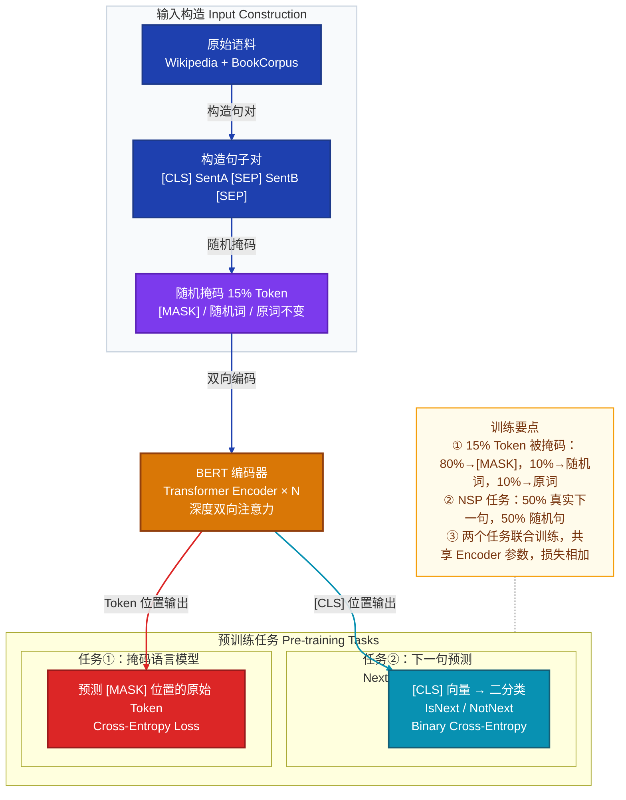
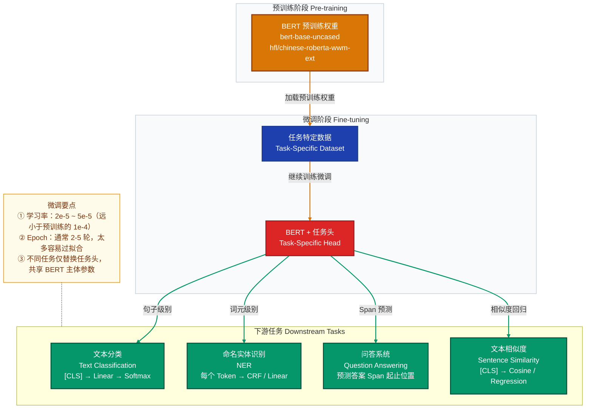

# BERT 模型详解：原理、应用与实践指南

> **适用范围**：本文面向具备基础深度学习知识的读者，系统讲解 BERT 模型的核心原理、微调应用方法、常见问题与解决方案，以及完整实践流程，并附 FAQ 面试题集。

---

## 目录

1. [BERT 模型原理](#一bert-模型原理)
   - 1.1 背景与动机
   - 1.2 整体架构
   - 1.3 输入表示
   - 1.4 自注意力机制
   - 1.5 预训练任务（MLM & NSP）
   - 1.6 模型变体对比
2. [BERT 应用方法](#二bert-应用方法)
   - 2.1 Fine-tuning 策略总览
   - 2.2 文本分类
   - 2.3 命名实体识别（NER）
   - 2.4 问答系统（QA）
   - 2.5 文本相似度
3. [常见问题及解决方案](#三常见问题及解决方案)
4. [注意事项](#四注意事项)
5. [完整 BERT 使用流程](#五完整-bert-使用流程)
6. [FAQ 面试常见问题](#六faq-面试常见问题)

---

## 一、BERT 模型原理

### 1.1 背景与动机

在 BERT 出现之前，NLP 领域的预训练语言模型存在明显局限：

| 模型 | 时间 | 局限性 |
|------|------|--------|
| **ELMo** | 2018 | 基于双向 LSTM，两个方向独立训练，无法实现深度双向交互 |
| **GPT** | 2018 | 单向 Transformer（从左到右），上下文理解受限于单向信息流 |
| **ULMFiT** | 2018 | 同样是单向 LSTM，缺乏深度双向上下文建模 |

**BERT**（Bidirectional Encoder Representations from Transformers）由 Google 于 2018 年提出，核心创新如下：

| 特性 | 说明 |
|------|------|
| **深度双向性** | 利用 Transformer Encoder，同时捕获每个词左右两侧的上下文信息 |
| **预训练 + 微调范式** | 大规模无监督预训练 + 下游任务有监督微调，一套权重适配多种任务 |
| **掩码语言模型（MLM）** | 随机掩码部分词汇并预测，迫使模型真正学习双向上下文 |
| **通用语言表示** | 无需为每个任务设计专用网络结构，仅替换顶层任务头即可 |

---

### 1.2 整体架构

BERT 的主体是**多层 Transformer Encoder 堆叠**，主要有两种规模：

| 配置项 | BERT-Base | BERT-Large |
|--------|-----------|------------|
| Encoder 层数 $L$ | 12 | 24 |
| 隐藏层维度 $H$ | 768 | 1024 |
| 注意力头数 $A$ | 12 | 16 |
| 参数量 | ~110M | ~340M |

#### BERT 整体架构图

```mermaid
flowchart LR
    %% ── 配色主题：深色系，按模型阶段区分层次 ─────────────────────────
    classDef inputStyle    fill:#1e40af,stroke:#1e3a8a,stroke-width:2px,color:#fff
    classDef embedStyle    fill:#4f46e5,stroke:#3730a3,stroke-width:2px,color:#fff
    classDef encoderStyle  fill:#d97706,stroke:#92400e,stroke-width:2px,color:#fff
    classDef attnStyle     fill:#dc2626,stroke:#991b1b,stroke-width:2.5px,color:#fff
    classDef ffnStyle      fill:#b45309,stroke:#78350f,stroke-width:2px,color:#fff
    classDef outputStyle   fill:#059669,stroke:#064e3b,stroke-width:2px,color:#fff
    classDef noteStyle     fill:#fffbeb,stroke:#f59e0b,stroke-width:1.5px,color:#78350f
    classDef layerStyle    fill:#f8fafc,stroke:#cbd5e0,stroke-width:1.5px

    %% ── 输入层 ──────────────────────────────────────────────────────────
    subgraph INPUT["输入层 Input Layer"]
        direction TB
        A["原始文本<br>Raw Text"]:::inputStyle
        B["WordPiece Tokenizer"]:::inputStyle
        C["Token + [CLS] + [SEP]"]:::inputStyle
    end
    class INPUT layerStyle

    %% ── 嵌入层 ──────────────────────────────────────────────────────────
    subgraph EMBED["嵌入层 Embedding Layer"]
        direction TB
        D[("Token Embedding<br>[vocab, 768]")]:::embedStyle
        E[("Segment Embedding<br>[2, 768]")]:::embedStyle
        F[("Position Embedding<br>[512, 768]")]:::embedStyle
        G["输入表示<br>[B, L, 768]"]:::embedStyle
    end
    class EMBED layerStyle

    %% ── 编码器堆叠 ───────────────────────────────────────────────────────
    subgraph ENCODER["编码器堆叠 Transformer Encoder × N"]
        subgraph BLOCK["Encoder Block（× N 次重复）"]
            direction LR
            H["多头自注意力<br>Multi-Head Self-Attention"]:::attnStyle
            I["Add & LayerNorm"]:::encoderStyle
            J["前馈网络<br>Feed-Forward Network"]:::ffnStyle
            K["Add & LayerNorm"]:::encoderStyle
        end
    end
    class ENCODER layerStyle

    %% ── 输出层 ──────────────────────────────────────────────────────────
    subgraph OUTLAY["输出层 Output Layer"]
        direction LR
        L["[CLS] 向量<br>句子级别表示"]:::outputStyle
        M["Token 向量序列<br>词元级别表示"]:::outputStyle
    end
    class OUTLAY layerStyle

    %% ── 数据流（边索引 0-13，共 14 条）──────────────────────────────────
    A -->|"分词"| B
    B -->|"添加特殊 Token"| C
    C -->|"查 Token 表"| D
    C -->|"句子段标识"| E
    C -->|"位置编码"| F
    D -->|"相加"| G
    E -->|"相加"| G
    F -->|"相加"| G
    G -->|"序列输入"| H
    H -->|"残差连接"| I
    I -->|"FFN 输入"| J
    J -->|"残差连接"| K
    K -->|"[CLS] 位置"| L
    K -->|"其余位置"| M

    %% ── 设计注记 ─────────────────────────────────────────────────────────
    NOTE["设计要点<br>① 双向注意力同时捕获左右上下文<br>② N=12(Base) / N=24(Large)<br>③ 三种 Embedding 逐元素相加作为输入"]:::noteStyle
    NOTE -.- ENCODER

    %% 边索引：0-13，共 14 条
    linkStyle 0,1,2,3,4     stroke:#1e40af,stroke-width:2px
    linkStyle 5,6,7          stroke:#4f46e5,stroke-width:2px
    linkStyle 8,9,10,11      stroke:#d97706,stroke-width:2px
    linkStyle 12,13          stroke:#059669,stroke-width:2px
```



---

### 1.3 输入表示

BERT 的输入是三种嵌入的**逐元素相加**：

$$\text{Input} = \text{TokenEmb}(w) + \text{SegmentEmb}(s) + \text{PositionEmb}(p)$$

#### 1.3.1 Token Embedding

使用 **WordPiece** 分词算法将文本切分为子词单元（subword）。序列首部固定插入 `[CLS]`，句子边界插入 `[SEP]`：

```
原始文本：My dog is cute
分词结果：[CLS]  My  dog  is  cute  [SEP]
Token ID：  101  2026 3899 2003 10140  102
```

#### 1.3.2 Segment Embedding

用于区分句子对中**句子 A** 与**句子 B**：

- 句子 A 中所有 Token 对应嵌入向量 $E_A$（索引 0）
- 句子 B 中所有 Token 对应嵌入向量 $E_B$（索引 1）
- 单句任务中全部为 0

#### 1.3.3 Position Embedding

BERT 使用**可学习的绝对位置嵌入**（区别于 Transformer 原始论文的固定正弦编码），最大序列长度为 512，位置嵌入矩阵维度为 $[512, H]$。

---

### 1.4 自注意力机制

#### 1.4.1 Scaled Dot-Product Attention

$$\text{Attention}(Q, K, V) = \text{softmax}\left(\frac{QK^T}{\sqrt{d_k}}\right)V$$

各符号含义：

| 符号 | 形状 | 说明 |
|------|------|------|
| $Q$ | $[L, d_k]$ | 查询矩阵（Query） |
| $K$ | $[L, d_k]$ | 键矩阵（Key） |
| $V$ | $[L, d_v]$ | 值矩阵（Value） |
| $\sqrt{d_k}$ | 标量 | 缩放因子，防止点积过大导致 softmax 梯度消失 |

#### 1.4.2 Multi-Head Attention

$$\text{MultiHead}(Q, K, V) = \text{Concat}(\text{head}_1, \ldots, \text{head}_h)\, W^O$$

$$\text{head}_i = \text{Attention}(QW_i^Q,\; KW_i^K,\; VW_i^V)$$

BERT-Base 参数：$h = 12$ 个注意力头，每头维度 $d_k = d_v = 64$（即 $768 / 12 = 64$）。

#### 1.4.3 Feed-Forward Network

每个 Encoder Block 包含一个两层全连接网络，中间层维度为 $4H$，激活函数为 **GELU**：

$$\text{FFN}(x) = \text{GELU}(xW_1 + b_1)\,W_2 + b_2$$

GELU 激活函数定义：

$$\text{GELU}(x) = x \cdot \Phi(x) \approx 0.5x\left(1 + \tanh\!\left[\sqrt{\frac{2}{\pi}}\left(x + 0.044715\,x^3\right)\right]\right)$$

其中 $\Phi(x)$ 为标准正态分布的累积分布函数。BERT-Base 中 FFN 中间维度为 $768 \times 4 = 3072$。

#### 1.4.4 残差连接与 Layer Normalization

每个子层后均施加残差连接与层归一化：

$$\text{Output} = \text{LayerNorm}(x + \text{Sublayer}(x))$$

---

### 1.5 预训练任务

#### BERT 预训练任务流程图



#### 1.5.1 掩码语言模型（Masked Language Model，MLM）

对输入序列中随机选取 15% 的 Token，按如下比例处理：

| 处理方式 | 比例 | 目的 |
|----------|------|------|
| 替换为 `[MASK]` | 80% | 主要训练信号，让模型预测被掩盖词 |
| 替换为随机词 | 10% | 防止过度依赖 `[MASK]` 标记，减少训推不一致 |
| 保持原词不变 | 10% | 让模型对所有词保持良好表示，不只关注掩码位置 |

MLM 损失函数（仅在掩码位置上计算）：

$$\mathcal{L}_{\text{MLM}} = -\sum_{i \in \mathcal{M}} \log P(w_i \mid \tilde{w}_{1:L})$$

其中 $\mathcal{M}$ 为被掩码的位置集合，$\tilde{w}$ 为经过掩码处理后的输入序列。

#### 1.5.2 下一句预测（Next Sentence Prediction，NSP）

给定句子对 $(S_A, S_B)$，预测 $S_B$ 是否是 $S_A$ 的真实下一句（二分类）：

$$\mathcal{L}_{\text{NSP}} = -\log P(\text{IsNext} \mid h_{[\text{CLS}]})$$

总预训练损失为两个任务之和：

$$\mathcal{L}_{\text{total}} = \mathcal{L}_{\text{MLM}} + \mathcal{L}_{\text{NSP}}$$

---

### 1.6 模型变体对比

| 模型 | 层数 | 隐藏维度 | 参数量 | 核心改进 | 适用场景 |
|------|------|----------|--------|----------|----------|
| **BERT-Base** | 12 | 768 | 110M | 原始版本 | 通用基线 |
| **BERT-Large** | 24 | 1024 | 340M | 更深更宽 | 高精度任务 |
| **RoBERTa** | 12/24 | 768/1024 | 110M/340M | 去掉NSP、动态掩码、更大数据 | 更强通用性能 |
| **ALBERT** | 12/24 | 128→768 | 12M/18M | 参数共享、因子分解 | 参数高效 |
| **DistilBERT** | 6 | 768 | 66M | 知识蒸馏，速度提升60% | 推理加速 |
| **chinese-BERT-wwm** | 12 | 768 | 110M | 全词掩码，中文优化 | 中文NLP |
| **MacBERT** | 12 | 768 | 110M | 用相似词替换代替[MASK] | 中文任务 |
| **Longformer** | 12 | 768 | 148M | 稀疏注意力，支持4096长度 | 长文档理解 |

---

## 二、BERT 应用方法

### 2.1 Fine-tuning 策略总览

BERT 的使用分为两个阶段：**预训练（Pre-training）→ 微调（Fine-tuning）**。

#### Fine-tuning 下游任务架构图



---

### 2.2 文本分类

使用 `[CLS]` Token 的输出向量接线性分类头：

$$P(y \mid x) = \text{Softmax}(W \cdot h_{[\text{CLS}]} + b)$$

微调损失：

$$\mathcal{L}_{\text{cls}} = -\sum_{c=1}^{C} y_c \log \hat{y}_c$$

**示例：中文情感分类**

```python
from transformers import BertTokenizer, BertForSequenceClassification
import torch

model_name = "bert-base-chinese"
tokenizer = BertTokenizer.from_pretrained(model_name)
model = BertForSequenceClassification.from_pretrained(model_name, num_labels=2)

text = "这部电影真的太棒了，强烈推荐！"
inputs = tokenizer(
    text,
    max_length=128,
    padding="max_length",
    truncation=True,
    return_tensors="pt"
)

model.eval()
with torch.no_grad():
    outputs = model(**inputs)
    logits = outputs.logits
    pred = torch.argmax(logits, dim=-1)
    print(f"预测标签：{pred.item()}")  # 0: 负面，1: 正面
```

---

### 2.3 命名实体识别（NER）

对每个 Token 的输出向量独立进行标签预测（序列标注任务）：

$$P(y_i \mid x) = \text{Softmax}(W \cdot h_i + b), \quad \forall\, i \in [1, L]$$

**示例：中文命名实体识别（BIO 标注格式）**

```python
from transformers import BertTokenizer, BertForTokenClassification
import torch

id2label = {0: "O", 1: "B-PER", 2: "I-PER", 3: "B-ORG", 4: "I-ORG", 5: "B-LOC", 6: "I-LOC"}
model_name = "hfl/chinese-bert-wwm-ext"

tokenizer = BertTokenizer.from_pretrained(model_name)
model = BertForTokenClassification.from_pretrained(
    model_name, num_labels=len(id2label)
)

text = "王小明在北京大学学习自然语言处理。"
inputs = tokenizer(text, return_tensors="pt", truncation=True, max_length=128)

model.eval()
with torch.no_grad():
    outputs = model(**inputs)
    predictions = torch.argmax(outputs.logits, dim=-1)[0]
    tokens = tokenizer.convert_ids_to_tokens(inputs["input_ids"][0])
    for token, pred_id in zip(tokens[1:-1], predictions[1:-1]):
        label = id2label[pred_id.item()]
        print(f"{token}\t{label}")
```

---

### 2.4 问答系统（QA）

给定问题 $Q$ 和段落 $P$，预测答案在段落中的起始位置 $s$ 和终止位置 $e$：

$$s^* = \arg\max_i \left(W_s \cdot h_i\right), \quad e^* = \arg\max_i \left(W_e \cdot h_i\right)$$

**示例：抽取式问答（SQuAD 格式）**

```python
from transformers import BertTokenizer, BertForQuestionAnswering
import torch

model_name = "bert-base-uncased"
tokenizer = BertTokenizer.from_pretrained(model_name)
model = BertForQuestionAnswering.from_pretrained(model_name)

question = "What is the capital of China?"
context = "Beijing is the capital of China, with a history of over 3000 years."

inputs = tokenizer(
    question, context,
    return_tensors="pt",
    truncation=True,
    max_length=512
)

model.eval()
with torch.no_grad():
    outputs = model(**inputs)
    start = torch.argmax(outputs.start_logits)
    end = torch.argmax(outputs.end_logits)
    answer_ids = inputs["input_ids"][0][start : end + 1]
    answer = tokenizer.decode(answer_ids, skip_special_tokens=True)
    print(f"答案：{answer}")
```

---

### 2.5 文本相似度

计算两个句子的语义相似度，常用三种方式：

| 方法 | 说明 | 优缺点 |
|------|------|--------|
| **[CLS] 向量余弦相似度** | 直接比较两句的 CLS 向量 | 简单，未经专门相似度训练效果一般 |
| **句子对分类** | 拼接两句输入，CLS 做二分类 | 准确，但每对句子需完整 forward |
| **Sentence-BERT** | 孪生网络 + 对比学习 | 效果最好，支持高效向量检索 |

**示例：余弦相似度计算**

```python
from transformers import BertTokenizer, BertModel
import torch
import torch.nn.functional as F

def get_cls_embedding(text, tokenizer, model):
    inputs = tokenizer(
        text, return_tensors="pt",
        max_length=128, padding="max_length", truncation=True
    )
    with torch.no_grad():
        outputs = model(**inputs)
    return outputs.last_hidden_state[:, 0, :]  # 取 [CLS] 向量

model_name = "bert-base-chinese"
tokenizer = BertTokenizer.from_pretrained(model_name)
model = BertModel.from_pretrained(model_name)
model.eval()

sent1 = "苹果公司发布了新款手机"
sent2 = "iPhone 最新款已经上市"
sent3 = "今天天气很好，适合出去玩"

emb1 = get_cls_embedding(sent1, tokenizer, model)
emb2 = get_cls_embedding(sent2, tokenizer, model)
emb3 = get_cls_embedding(sent3, tokenizer, model)

print(f"句1 vs 句2 相似度：{F.cosine_similarity(emb1, emb2).item():.4f}")  # 期望较高
print(f"句1 vs 句3 相似度：{F.cosine_similarity(emb1, emb3).item():.4f}")  # 期望较低
```

---

## 三、常见问题及解决方案

### 问题 1：显存不足（CUDA OOM）

**症状**：`RuntimeError: CUDA out of memory`

**解决方案**：

| 方法 | 操作 | 说明 |
|------|------|------|
| 减小 batch_size | `32 → 16 → 8 → 4` | 最直接的方式 |
| 梯度累积 | 每 N 步更新一次梯度 | 等效大 batch，不增加显存 |
| 混合精度（FP16） | `autocast + GradScaler` | 显存减约一半 |
| 减小 max_length | `512 → 256 → 128` | 任务允许时优先考虑 |
| 选用更小模型 | DistilBERT / ALBERT | 参数量减少 40%~85% |

```python
from torch.cuda.amp import autocast, GradScaler

scaler = GradScaler()
accumulation_steps = 4
optimizer.zero_grad()

for i, batch in enumerate(train_loader):
    batch = {k: v.to(device) for k, v in batch.items()}
    with autocast():
        outputs = model(**batch)
        loss = outputs.loss / accumulation_steps

    scaler.scale(loss).backward()

    if (i + 1) % accumulation_steps == 0:
        scaler.unscale_(optimizer)
        torch.nn.utils.clip_grad_norm_(model.parameters(), 1.0)
        scaler.step(optimizer)
        scaler.update()
        optimizer.zero_grad()
```

---

### 问题 2：训练损失不下降

**症状**：Loss 长期维持在高水平，准确率无明显提升

| 原因 | 解决方案 |
|------|----------|
| 学习率过大 | 从 5e-5 降至 2e-5 或 1e-5 |
| 未使用 Warmup | 添加线性 Warmup 调度器（前 5-10% steps） |
| 标签映射错误 | 打印样本及预测结果，逐一核查 |
| 模型未正确加载 | 验证 `from_pretrained` 路径，检查是否有 warning |
| 优化器未 step | 检查训练循环中 `optimizer.step()` 是否在循环内 |

```python
from transformers import get_linear_schedule_with_warmup

total_steps = len(train_loader) * num_epochs
warmup_steps = int(0.1 * total_steps)

scheduler = get_linear_schedule_with_warmup(
    optimizer,
    num_warmup_steps=warmup_steps,
    num_training_steps=total_steps
)
```

---

### 问题 3：中文分词效果差

**症状**：文本切分出大量 `##` 子词，语义表达碎片化

**根因**：使用了英文 BERT（`bert-base-uncased`），词表不含中文词汇，中文字被强制拆分为字节子词。

**解决方案**：

```python
# 推荐中文模型（按效果排序）
# 1. 全词掩码 RoBERTa（首选）
tokenizer = BertTokenizer.from_pretrained("hfl/chinese-roberta-wwm-ext")
model = BertModel.from_pretrained("hfl/chinese-roberta-wwm-ext")

# 2. MacBERT（MLM改进版）
tokenizer = BertTokenizer.from_pretrained("hfl/chinese-macbert-base")
model = BertModel.from_pretrained("hfl/chinese-macbert-base")

# 3. 原始中文BERT（简单任务可用）
tokenizer = BertTokenizer.from_pretrained("bert-base-chinese")
model = BertModel.from_pretrained("bert-base-chinese")
```

---

### 问题 4：序列长度超过 512

**症状**：长文本（合同、新闻正文、论文）截断后信息严重丢失

| 策略 | 说明 | 适用场景 |
|------|------|----------|
| **首尾截断** | 保留前 128 + 后 384 个 Token | 文档分类（结论常在末尾） |
| **滑动窗口** | 重叠切片，分别编码后聚合 | QA、阅读理解 |
| **层次化编码** | 先对句子编码，再对句子向量编码 | 超长文档 |
| **Longformer/BigBird** | 稀疏注意力，支持 4096+ 长度 | 长文档专用 |

```python
def sliding_window_pooling(text, tokenizer, model, window=510, stride=256, device="cpu"):
    """滑动窗口编码，输出各片段 [CLS] 向量的均值池化"""
    token_ids = tokenizer.encode(text, add_special_tokens=False)
    cls_id = tokenizer.cls_token_id
    sep_id = tokenizer.sep_token_id
    
    chunk_embeddings = []
    for start in range(0, max(1, len(token_ids)), stride):
        chunk = token_ids[start : start + window]
        input_ids = torch.tensor([[cls_id] + chunk + [sep_id]]).to(device)
        attention_mask = torch.ones_like(input_ids)
        with torch.no_grad():
            output = model(input_ids=input_ids, attention_mask=attention_mask)
        chunk_embeddings.append(output.last_hidden_state[:, 0, :])
        if start + window >= len(token_ids):
            break

    return torch.stack(chunk_embeddings, dim=1).mean(dim=1)  # 均值池化
```

---

### 问题 5：模型过拟合

**症状**：训练集准确率持续上升，验证集准确率停滞甚至下降

```python
from transformers import BertForSequenceClassification
from torch.optim import AdamW

# 1. 增大 Dropout
model = BertForSequenceClassification.from_pretrained(
    "bert-base-chinese",
    num_labels=2,
    hidden_dropout_prob=0.2,           # 默认 0.1
    attention_probs_dropout_prob=0.2   # 默认 0.1
)

# 2. Weight Decay（L2 正则）
optimizer = AdamW(model.parameters(), lr=2e-5, weight_decay=0.01)

# 3. Early Stopping
best_val_f1 = 0
patience_counter = 0
patience = 3

for epoch in range(max_epochs):
    train(...)
    val_f1 = evaluate(...)
    if val_f1 > best_val_f1:
        best_val_f1 = val_f1
        patience_counter = 0
        model.save_pretrained("./best_model")
    else:
        patience_counter += 1
        if patience_counter >= patience:
            print("Early stopping triggered.")
            break
```

---

### 问题 6：推理速度过慢

**症状**：生产环境 QPS 不满足要求，延迟过高

| 优化手段 | 参考加速比 | 说明 |
|----------|-----------|------|
| FP16 推理 | 1.5 ~ 2× | `model.half()` + `torch.cuda.amp` |
| ONNX Runtime | 2 ~ 3× | 跨平台推理优化 |
| TensorRT | 3 ~ 5× | NVIDIA GPU 专用，需 ONNX 转换 |
| 知识蒸馏 | 2 ~ 6× | DistilBERT、TinyBERT、MobileBERT |
| 动态量化（INT8） | 1.5 ~ 2× | 精度损失约 0.5-1% |

```python
# ONNX 导出示例
import torch

dummy_input = {
    "input_ids": torch.ones(1, 128, dtype=torch.long),
    "attention_mask": torch.ones(1, 128, dtype=torch.long),
    "token_type_ids": torch.zeros(1, 128, dtype=torch.long)
}

torch.onnx.export(
    model,
    (dummy_input,),
    "bert_model.onnx",
    input_names=["input_ids", "attention_mask", "token_type_ids"],
    output_names=["logits"],
    dynamic_axes={
        "input_ids": {0: "batch_size", 1: "seq_len"},
        "attention_mask": {0: "batch_size", 1: "seq_len"},
        "token_type_ids": {0: "batch_size", 1: "seq_len"},
        "logits": {0: "batch_size"}
    },
    opset_version=14
)
```

---

## 四、注意事项

### 4.1 数据预处理注意事项

1. **特殊 Token 不可省略**：`[CLS]` 与 `[SEP]` 是 BERT 架构必需的，`transformers` 库默认自动添加，勿手动删除。
2. **attention_mask 必须传入**：Padding 位置 attention_mask 为 0，否则模型会关注无效 Token，损害表示质量。
3. **token_type_ids 按任务设置**：单句任务全为 0；句子对任务中 A 句为 0，B 句为 1。
4. **padding 策略选择**：
   - 批次内动态 padding：`padding="longest"`（推荐，节省计算）
   - 固定长度 padding：`padding="max_length"`（DataLoader shuffle 时推荐）

```python
# 推荐的编码方式（批次动态 padding）
inputs = tokenizer(
    batch_texts,
    max_length=128,
    padding="longest",         # 批次内对齐到最长序列
    truncation=True,
    return_tensors="pt",
    return_token_type_ids=True,
    return_attention_mask=True
)
```

---

### 4.2 模型选择建议

| 场景 | 推荐模型 | 说明 |
|------|----------|------|
| 中文通用任务 | `hfl/chinese-roberta-wwm-ext` | 全词掩码，综合效果最佳 |
| 中文大模型 | `hfl/chinese-roberta-wwm-ext-large` | 更强，但需要更多资源 |
| 英文通用 | `bert-base-uncased` | 大小写不敏感，通用首选 |
| 英文生物医学 | `allenai/scibert_scivocab_uncased` | 领域专用词表 |
| 推理加速优先 | `distilbert-base-uncased` | 6层，速度提升 60% |
| 极端资源受限 | `albert-base-v2` | 12M 参数，跨层参数共享 |

---

### 4.3 超参数设置建议

| 超参数 | 推荐范围 | 注意事项 |
|--------|----------|----------|
| 学习率 | 2e-5 ~ 5e-5 | 太大导致灾难性遗忘，太小收敛慢 |
| Batch Size | 16 ~ 32 | 结合梯度累积等效更大批次 |
| Epoch 数 | 2 ~ 5 | 数据量少时用 2-3，数据量大时可适当增加 |
| Warmup 比例 | 5% ~ 10% | 防止初期梯度震荡 |
| Weight Decay | 0.01 | 一般不对 bias 和 LayerNorm 应用 |
| max_length | 128 / 256 / 512 | 按实际文本长度分布选择，避免浪费 |
| Dropout | 0.1（默认） | 小数据集可适当增大至 0.2-0.3 |

---

### 4.4 训练稳定性注意事项

```python
import random
import numpy as np
import torch

def set_seed(seed: int = 42):
    """固定随机种子，确保实验可复现"""
    random.seed(seed)
    np.random.seed(seed)
    torch.manual_seed(seed)
    torch.cuda.manual_seed_all(seed)
    # 需要完全确定性时开启（可能降低性能）
    # torch.backends.cudnn.deterministic = True

# 梯度裁剪（每次 backward 后）
torch.nn.utils.clip_grad_norm_(model.parameters(), max_norm=1.0)

# 分层学习率（底层使用更小学习率，任务头使用更大学习率）
optimizer_grouped_parameters = [
    {
        "params": [p for n, p in model.bert.named_parameters()
                   if not any(nd in n for nd in ["bias", "LayerNorm.weight"])],
        "lr": 2e-5,
        "weight_decay": 0.01
    },
    {
        "params": [p for n, p in model.bert.named_parameters()
                   if any(nd in n for nd in ["bias", "LayerNorm.weight"])],
        "lr": 2e-5,
        "weight_decay": 0.0
    },
    {
        "params": model.classifier.parameters(),
        "lr": 1e-4,
        "weight_decay": 0.01
    },
]
optimizer = AdamW(optimizer_grouped_parameters)
```

---

## 五、完整 BERT 使用流程

### 5.1 完整流程图

```mermaid
flowchart TB
    %% ── 配色主题 ──────────────────────────────────────────────────────────
    classDef startStyle    fill:#1e40af,stroke:#1e3a8a,stroke-width:2px,color:#fff
    classDef dataStyle     fill:#4f46e5,stroke:#3730a3,stroke-width:2px,color:#fff
    classDef modelStyle    fill:#d97706,stroke:#92400e,stroke-width:2.5px,color:#fff
    classDef trainStyle    fill:#dc2626,stroke:#991b1b,stroke-width:2px,color:#fff
    classDef evalStyle     fill:#059669,stroke:#064e3b,stroke-width:2px,color:#fff
    classDef decisionStyle fill:#0891b2,stroke:#155e75,stroke-width:2px,color:#fff
    classDef noteStyle     fill:#fffbeb,stroke:#f59e0b,stroke-width:1.5px,color:#78350f
    classDef layerStyle    fill:#f8fafc,stroke:#cbd5e0,stroke-width:1.5px

    %% ── 第一步：任务定义 & 数据准备 ─────────────────────────────────────
    subgraph STEP1["第一步：任务定义 & 数据准备"]
        A["明确 NLP 任务类型<br>分类 / NER / QA / 相似度"]:::startStyle
        B["数据收集 & 清洗<br>Data Collection & Cleaning"]:::dataStyle
        C["数据集划分<br>Train / Val / Test = 8:1:1"]:::dataStyle
    end
    class STEP1 layerStyle

    %% ── 第二步：模型选择 & 配置 ─────────────────────────────────────────
    subgraph STEP2["第二步：模型选择 & 配置"]
        D["选择预训练模型<br>Select Pretrained BERT Variant"]:::modelStyle
        E["初始化 Tokenizer<br>BertTokenizer.from_pretrained()"]:::modelStyle
        F["构建模型架构<br>BERT + Task-Specific Head"]:::modelStyle
    end
    class STEP2 layerStyle

    %% ── 第三步：数据编码 & 加载 ─────────────────────────────────────────
    subgraph STEP3["第三步：数据编码 & 加载"]
        G["Tokenize & Encode<br>input_ids / attention_mask<br>token_type_ids / labels"]:::dataStyle
        H["构建 DataLoader<br>batch_size / shuffle / collate_fn"]:::dataStyle
    end
    class STEP3 layerStyle

    %% ── 第四步：训练 & 调优 ─────────────────────────────────────────────
    subgraph STEP4["第四步：训练 & 调优"]
        I["配置优化器 & 调度器<br>AdamW + Linear Warmup"]:::trainStyle
        J["Fine-tuning 训练循环<br>Forward → Loss → Backward → Step"]:::trainStyle
        K{"验证集性能<br>达到目标？"}:::decisionStyle
        L["调整超参数<br>lr / batch / dropout / epoch"]:::trainStyle
    end
    class STEP4 layerStyle

    %% ── 第五步：评估 & 部署 ─────────────────────────────────────────────
    subgraph STEP5["第五步：评估 & 部署"]
        M["测试集最终评估<br>Acc / F1 / AUC / EM"]:::evalStyle
        N["模型导出<br>ONNX / TorchScript / Hugging Face Hub"]:::evalStyle
        O["生产部署<br>FastAPI / Triton Inference Server"]:::evalStyle
    end
    class STEP5 layerStyle

    %% ── 数据流（边索引 0-14，共 15 条）──────────────────────────────────
    A -->|"确定输出格式"| B
    B -->|"标注 & 分割"| C
    C -->|"选择合适变体"| D
    D -->|"初始化分词器"| E
    E -->|"定义输出头"| F
    F -->|"批量编码"| G
    G -->|"封装批次"| H
    H -->|"开始训练"| I
    I -->|"迭代训练"| J
    J -->|"每 Epoch 验证"| K
    K -->|"未达标"| L
    L -->|"重新训练"| J
    K -->|"已达标"| M
    M -->|"格式转换"| N
    N -->|"上线服务"| O

    %% ── 设计注记 ─────────────────────────────────────────────────────────
    NOTE["流程要点<br>① 中文任务优先选 hfl/chinese-roberta-wwm-ext<br>② 验证集 F1 连续 3 轮不提升则 Early Stop<br>③ 显存不足：减 batch_size + 梯度累积 + FP16"]:::noteStyle
    NOTE -.- STEP4

    %% 边索引：0-14，共 15 条
    linkStyle 0,1          stroke:#4f46e5,stroke-width:2px
    linkStyle 2,3,4        stroke:#d97706,stroke-width:2px
    linkStyle 5,6          stroke:#4f46e5,stroke-width:2px
    linkStyle 7,8,9        stroke:#dc2626,stroke-width:2px
    linkStyle 10           stroke:#dc2626,stroke-width:1.5px,stroke-dasharray:4 3
    linkStyle 11           stroke:#dc2626,stroke-width:2px
    linkStyle 12,13,14     stroke:#059669,stroke-width:2px
```



---

### 5.2 完整示例代码（文本分类端到端）

以下示例展示从数据准备到训练评估的完整 BERT 微调流程：

```python
"""
BERT 文本分类完整示例
任务：中文情感分类（正面/负面）
"""
import random
import numpy as np
import torch
from torch.utils.data import Dataset, DataLoader
from transformers import (
    BertTokenizer,
    BertForSequenceClassification,
    AdamW,
    get_linear_schedule_with_warmup
)
from sklearn.metrics import accuracy_score, f1_score, classification_report


# ─────────────────────────────────────────────────────────────────────────────
# 1. 固定随机种子
# ─────────────────────────────────────────────────────────────────────────────
def set_seed(seed: int = 42):
    random.seed(seed)
    np.random.seed(seed)
    torch.manual_seed(seed)
    torch.cuda.manual_seed_all(seed)

set_seed(42)


# ─────────────────────────────────────────────────────────────────────────────
# 2. 自定义 Dataset
# ─────────────────────────────────────────────────────────────────────────────
class SentimentDataset(Dataset):
    def __init__(self, texts, labels, tokenizer, max_length=128):
        self.encodings = tokenizer(
            texts,
            max_length=max_length,
            padding="max_length",
            truncation=True,
            return_tensors="pt"
        )
        self.labels = torch.tensor(labels, dtype=torch.long)

    def __len__(self):
        return len(self.labels)

    def __getitem__(self, idx):
        return {
            "input_ids": self.encodings["input_ids"][idx],
            "attention_mask": self.encodings["attention_mask"][idx],
            "token_type_ids": self.encodings["token_type_ids"][idx],
            "labels": self.labels[idx]
        }


# ─────────────────────────────────────────────────────────────────────────────
# 3. 训练一个 Epoch
# ─────────────────────────────────────────────────────────────────────────────
def train_epoch(model, loader, optimizer, scheduler, device, clip_norm=1.0):
    model.train()
    total_loss = 0.0
    for batch in loader:
        batch = {k: v.to(device) for k, v in batch.items()}
        outputs = model(**batch)
        loss = outputs.loss

        optimizer.zero_grad()
        loss.backward()
        torch.nn.utils.clip_grad_norm_(model.parameters(), clip_norm)
        optimizer.step()
        scheduler.step()
        total_loss += loss.item()

    return total_loss / len(loader)


# ─────────────────────────────────────────────────────────────────────────────
# 4. 验证 / 测试
# ─────────────────────────────────────────────────────────────────────────────
def evaluate(model, loader, device):
    model.eval()
    all_preds, all_labels = [], []
    with torch.no_grad():
        for batch in loader:
            batch = {k: v.to(device) for k, v in batch.items()}
            logits = model(**batch).logits
            preds = torch.argmax(logits, dim=-1).cpu().numpy()
            labels = batch["labels"].cpu().numpy()
            all_preds.extend(preds)
            all_labels.extend(labels)

    acc = accuracy_score(all_labels, all_preds)
    f1 = f1_score(all_labels, all_preds, average="weighted")
    return acc, f1, all_preds, all_labels


# ─────────────────────────────────────────────────────────────────────────────
# 5. 主流程
# ─────────────────────────────────────────────────────────────────────────────
def main():
    # 超参数
    MODEL_NAME   = "bert-base-chinese"
    MAX_LENGTH   = 128
    BATCH_SIZE   = 16
    NUM_EPOCHS   = 3
    LR           = 2e-5
    WEIGHT_DECAY = 0.01
    WARMUP_RATIO = 0.1
    NUM_LABELS   = 2
    PATIENCE     = 3
    DEVICE       = torch.device("cuda" if torch.cuda.is_available() else "cpu")
    print(f"使用设备：{DEVICE}")

    # 示例数据（实际项目中从文件加载）
    train_texts = (
        ["这部电影真的太棒了！"] * 200 +
        ["服务太差了，非常失望"] * 200 +
        ["物超所值，下次还会来"] * 200 +
        ["产品质量很差，不推荐"] * 200
    )
    train_labels = [1, 0, 1, 0] * 200
    val_texts  = ["整体体验不错"] * 50 + ["太贵了性价比低"] * 50
    val_labels = [1] * 50 + [0] * 50
    test_texts  = ["非常满意这次购物"] * 30 + ["完全不值这个价钱"] * 30
    test_labels = [1] * 30 + [0] * 30

    # 初始化分词器与模型
    tokenizer = BertTokenizer.from_pretrained(MODEL_NAME)
    model = BertForSequenceClassification.from_pretrained(
        MODEL_NAME,
        num_labels=NUM_LABELS,
        hidden_dropout_prob=0.1,
        attention_probs_dropout_prob=0.1
    ).to(DEVICE)

    # 数据集 & DataLoader
    train_ds = SentimentDataset(train_texts, train_labels, tokenizer, MAX_LENGTH)
    val_ds   = SentimentDataset(val_texts,   val_labels,   tokenizer, MAX_LENGTH)
    test_ds  = SentimentDataset(test_texts,  test_labels,  tokenizer, MAX_LENGTH)
    train_loader = DataLoader(train_ds, batch_size=BATCH_SIZE, shuffle=True)
    val_loader   = DataLoader(val_ds,   batch_size=BATCH_SIZE, shuffle=False)
    test_loader  = DataLoader(test_ds,  batch_size=BATCH_SIZE, shuffle=False)

    # 优化器（分层学习率：BERT主体 vs 分类头）
    no_decay = ["bias", "LayerNorm.weight"]
    optimizer_grouped_parameters = [
        {"params": [p for n, p in model.bert.named_parameters()
                    if not any(nd in n for nd in no_decay)],
         "lr": LR, "weight_decay": WEIGHT_DECAY},
        {"params": [p for n, p in model.bert.named_parameters()
                    if any(nd in n for nd in no_decay)],
         "lr": LR, "weight_decay": 0.0},
        {"params": model.classifier.parameters(),
         "lr": LR * 5, "weight_decay": WEIGHT_DECAY},
    ]
    optimizer = AdamW(optimizer_grouped_parameters)

    # 学习率调度器（含 Warmup）
    total_steps = len(train_loader) * NUM_EPOCHS
    scheduler = get_linear_schedule_with_warmup(
        optimizer,
        num_warmup_steps=int(WARMUP_RATIO * total_steps),
        num_training_steps=total_steps
    )

    # 训练循环（含 Early Stopping）
    best_val_f1 = 0.0
    patience_counter = 0

    for epoch in range(1, NUM_EPOCHS + 1):
        train_loss = train_epoch(model, train_loader, optimizer, scheduler, DEVICE)
        val_acc, val_f1, _, _ = evaluate(model, val_loader, DEVICE)

        print(f"Epoch {epoch}/{NUM_EPOCHS}  "
              f"train_loss={train_loss:.4f}  "
              f"val_acc={val_acc:.4f}  val_f1={val_f1:.4f}")

        if val_f1 > best_val_f1:
            best_val_f1 = val_f1
            patience_counter = 0
            model.save_pretrained("./best_model")
            tokenizer.save_pretrained("./best_model")
            print(f"  [保存最佳模型] F1={best_val_f1:.4f}")
        else:
            patience_counter += 1
            if patience_counter >= PATIENCE:
                print("Early Stopping 触发，停止训练。")
                break

    # 最终测试评估
    print("\n─── 加载最佳模型进行测试集评估 ───")
    best_model = BertForSequenceClassification.from_pretrained("./best_model").to(DEVICE)
    test_acc, test_f1, test_preds, test_labels_list = evaluate(best_model, test_loader, DEVICE)
    print(f"Test Accuracy : {test_acc:.4f}")
    print(f"Test F1 Score : {test_f1:.4f}")
    print("\n分类报告：")
    print(classification_report(
        test_labels_list, test_preds,
        target_names=["负面", "正面"]
    ))


if __name__ == "__main__":
    main()
```

---

## 六、FAQ 面试常见问题

### Q1：BERT 为什么使用双向 Transformer 而不是单向？

**答**：单向模型（如 GPT）在预测每个词时只能看到左侧上下文，而语言理解任务通常需要同时利用双向信息。例如理解"我把苹果吃了"中"苹果"的含义，需要结合前后文。BERT 利用 Transformer Encoder 天然的双向注意力机制，配合 MLM 训练目标（掩码屏蔽信息泄露），实现了真正的深度双向编码。

---

### Q2：BERT 的 MLM 任务中为什么要设计"10% 随机词 + 10% 原词不变"的策略？

**答**：
- **10% 替换为随机词**：若所有掩码位置都是 `[MASK]`，Fine-tuning 阶段从未见到 `[MASK]`（真实文本中不存在），产生训练—推理分布不一致（pretrain-finetune discrepancy）。随机词替换迫使模型对每个 Token 保持语境感知。
- **10% 保持原词不变**：让模型无法判断哪个位置会被修改，从而对所有 Token 都保持高质量表示，而非只关注被 `[MASK]` 的位置。

---

### Q3：BERT 和 GPT 的核心区别是什么？

| 对比维度 | BERT | GPT |
|----------|------|-----|
| 架构 | Transformer Encoder（双向） | Transformer Decoder（单向因果掩码） |
| 预训练目标 | MLM + NSP | 自回归语言模型（Next Token Prediction） |
| 注意力方向 | 双向（全局自注意力） | 单向（只看左侧，未来位置 mask） |
| 主要用途 | 理解任务（分类、NER、QA） | 生成任务（文本生成、对话、补全） |
| 代表下游任务 | GLUE、SQuAD | GPT-4、ChatGPT |

---

### Q4：BERT 中 `[CLS]` Token 的作用是什么？直接用于语义相似度是否合适？

**答**：`[CLS]` 是序列首部的特殊 Token，经过所有 Encoder 层后其输出向量被设计为**聚合整个序列语义**，用于分类任务（文本分类、NSP）。

然而，**直接用预训练 BERT 的 `[CLS]` 向量做语义相似度效果较差**，原因是预训练目标并非语义相似度，所有句子的 `[CLS]` 向量在高维空间中分布不均匀（各向异性问题）。推荐使用：
- **Sentence-BERT**：专门用对比学习微调，`[CLS]` 向量才具有良好的语义相似度几何性质。
- **均值池化**：对所有 Token 向量取平均，在某些场景优于 `[CLS]`。

---

### Q5：什么是 WordPiece 分词？与 BPE 有何区别？

**答**：

| 特性 | WordPiece（BERT） | BPE（GPT-2/RoBERTa） | SentencePiece（T5/ALBERT） |
|------|------------------|----------------------|--------------------------|
| 合并标准 | 最大化训练数据的对数似然 | 最高频率的字节对 | 基于单字节的统一处理 |
| 子词标记 | 非首子词加 `##` 前缀 | 词首加空格标记 | 语言无关 |
| 特点 | 偏向语言学合理的切分 | 简单高效 | 可直接处理含空格的原始文本 |

WordPiece 示例：`playing → play + ##ing`

---

### Q6：BERT Fine-tuning 时为什么学习率要非常小？什么是"灾难性遗忘"？

**答**：BERT 预训练已经编码了大量语言知识（语法、语义、世界知识）。如果 Fine-tuning 的学习率过大，梯度更新幅度过大，会快速覆盖预训练参数，使模型丢失原有的语言表示能力——这被称为**灾难性遗忘（Catastrophic Forgetting）**。

使用小学习率（2e-5 ~ 5e-5）配合 Warmup 调度，让模型在保留预训练知识的前提下对新任务进行细粒度调整。分层学习率（底层更小，顶层更大）是进一步缓解遗忘的策略。

---

### Q7：BERT 的最大序列长度为 512 的原因是什么？如何处理超长文本？

**答**：512 是 BERT 预训练时使用的最大 Position Embedding 数量，超出范围的 Token 没有对应的位置编码，无法处理。原因是：

1. 自注意力的时间复杂度为 $O(L^2 \cdot d)$，序列越长计算代价呈平方级增长。
2. 预训练语料（Wikipedia、BookCorpus）的平均句子长度远小于 512。

超长文本处理方案：

| 方案 | 实现 | 适用任务 |
|------|------|----------|
| 首尾截断 | 保留前 N + 后 M 个 Token | 文档分类 |
| 滑动窗口 | 重叠分段，分别编码后聚合 | QA、阅读理解 |
| Longformer | 局部滑动窗口 + 全局注意力 | 长文档理解 |
| BigBird | 随机 + 局部 + 全局注意力 | 超长文档 |

---

### Q8：如何评估 BERT 各类下游任务的效果？常用指标有哪些？

| 任务类型 | 首选指标 | 辅助指标 |
|----------|----------|----------|
| 二分类（均衡） | Accuracy、F1 | ROC-AUC |
| 多分类（均衡） | Macro F1 | Accuracy |
| 多分类（不均衡） | Weighted F1 | PR-AUC |
| 命名实体识别 | Entity-level F1（seqeval） | Precision、Recall |
| 抽取式问答 | Exact Match（EM）、Token F1 | — |
| 语义相似度（回归） | Pearson / Spearman 相关系数 | — |
| 摘要生成 | ROUGE-1/2/L | BERTScore |

---

### Q9：Attention Mask 的作用是什么？如果不传会发生什么？

**答**：Attention Mask 是一个 0/1 二值张量，形状为 $[B, L]$。在 Scaled Dot-Product Attention 计算中，Padding 位置（mask=0）的注意力分数被加上 $-\infty$，经 softmax 后接近 0，确保模型完全忽略 Padding Token。

$$\text{Attention Score}_{ij} = \frac{q_i k_j^T}{\sqrt{d_k}} + m_{ij}, \quad m_{ij} = \begin{cases} 0 & \text{if mask}=1 \\ -\infty & \text{if mask}=0 \end{cases}$$

若不传入 attention_mask，模型会对 Padding 位置也分配注意力权重，引入大量噪声，导致表示质量显著下降，尤其在变长批次中问题更严重。

---

### Q10：BERT 和 RoBERTa 的主要区别是什么？RoBERTa 为什么更强？

| 改进点 | BERT | RoBERTa |
|--------|------|---------|
| NSP 任务 | 保留 | 去掉（实验证明对下游任务无益甚至有害） |
| 掩码策略 | 静态掩码（训练前固定） | 动态掩码（每次 Epoch 重新生成） |
| 训练数据 | 16GB（Wiki + BookCorpus） | 160GB（加入CC-News、OpenWebText等） |
| Batch Size | 256 | 8000（更大批次提升训练稳定性） |
| 训练时长 | 1M steps | 更多 steps，训练更充分 |
| 序列长度 | 最大512，但混合短序列 | 仅使用512长度序列 |

RoBERTa 的核心结论：BERT 的预训练**严重欠训练**（undertrained），通过更大数据、更大批次、更长训练时间即可显著提升性能，无需改变模型架构。

---

### Q11：什么是全词掩码（Whole Word Masking, WWM）？为什么对中文尤为重要？

**答**：原始 BERT 按 WordPiece 子词进行掩码，可能只掩盖一个词的部分子词（如 "北" 被掩盖但 "京" 未被掩盖），模型可以轻易通过上下文补全，学习到的语义信息有限。

**全词掩码**改为：只要掩码了某个词的任意子词，该词的所有子词必须同时被掩码。

对中文的重要性：中文 BERT 以**字**为最小单元，字级别掩码（如掩码"北"，保留"京"）难度过低，模型很容易利用周围字预测，无法真正学习词语的完整语义。全词掩码要求同时掩盖"北京"两个字，迫使模型从更广泛的上下文中推断词语语义，显著提升了中文 NLP 任务的效果。

---

### Q12：BERT 能直接用于文本生成任务吗？有哪些限制和替代方案？

**答**：BERT 是纯 Encoder 架构，无自回归生成能力，**不能直接用于文本生成**，原因：

1. 双向注意力使得每个位置都能看到完整上下文，无法逐 Token 自回归生成。
2. 没有语言模型解码（Beam Search、Sampling 等）的训练目标。

**替代方案**：

| 方案 | 说明 | 模型 |
|------|------|------|
| Encoder-Decoder 架构 | BERT 作编码器，Decoder 负责生成 | BERT2BERT、PEGASUS |
| 统一 LM（UniLM） | 混合注意力掩码，同时支持理解和生成 | UniLM、UNILM v2 |
| 专用生成预训练模型 | Encoder-Decoder 架构，端到端预训练 | T5、BART、mT5 |
| 大语言模型 | 纯 Decoder，超强生成能力 | GPT-4、LLaMA、Qwen |

---

### Q13：BERT 的时间与空间复杂度如何？为什么长序列代价高？

**答**：BERT 的核心瓶颈在**自注意力机制**：

- **时间复杂度**：$O(L^2 \cdot d)$，其中 $L$ 为序列长度，$d$ 为隐藏维度
- **空间复杂度**：$O(L^2)$（注意力分数矩阵）

当 $L$ 从 128 增加到 512，自注意力的计算量增加 $4^2 = 16$ 倍，显存占用增加 16 倍。这也是为什么将 max_length 从 512 调整为 128 能大幅提升速度和降低显存占用。

稀疏注意力模型（Longformer、BigBird）将复杂度降至 $O(L \cdot w)$（$w$ 为局部窗口大小），使长序列处理变得可行。

---

*文档版本：v1.0 | 最后更新：2026-03*
