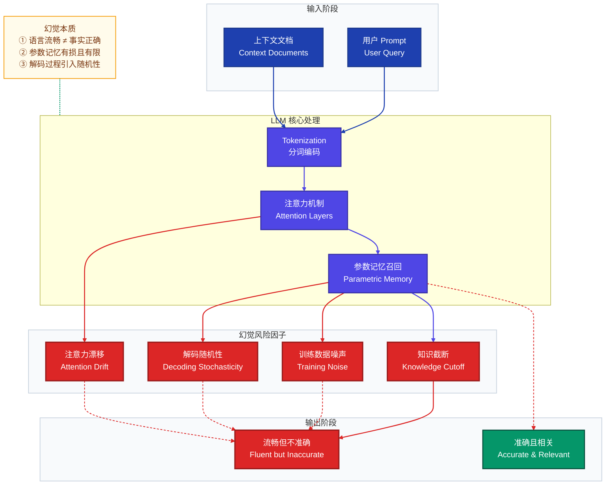
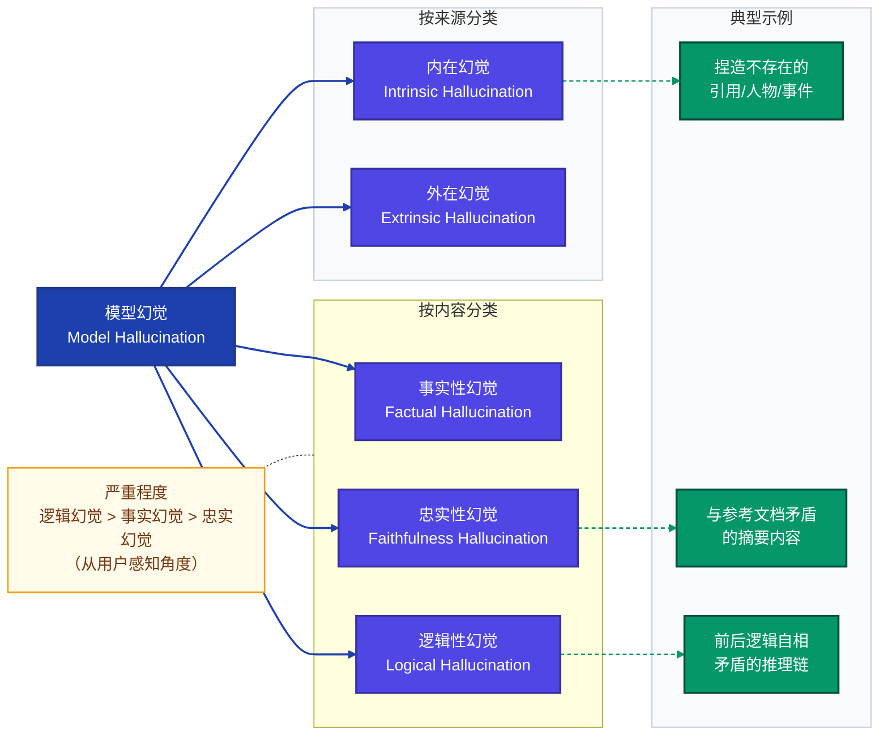
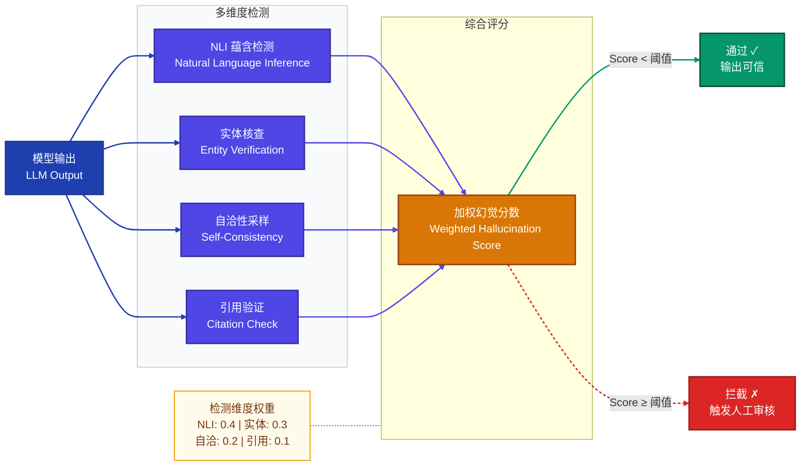
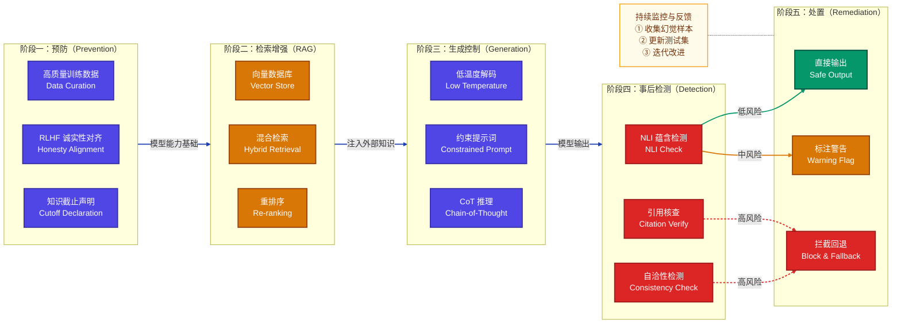
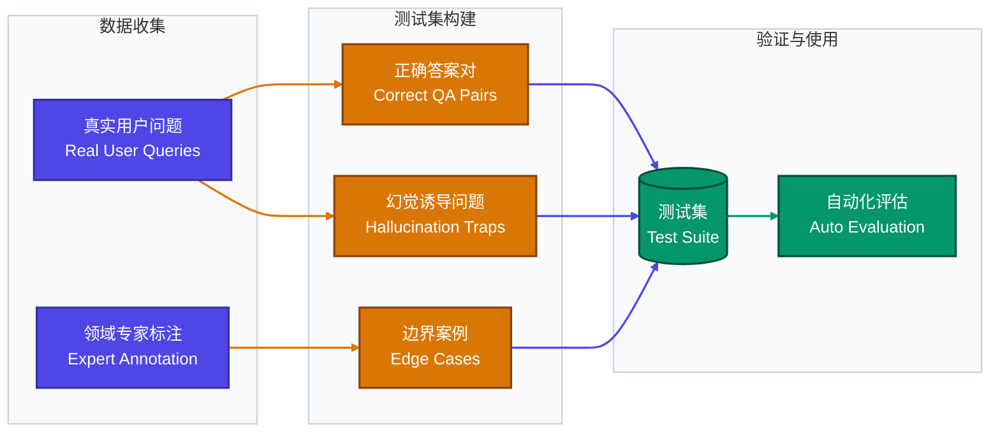

# 模型幻觉（Model Hallucination）详解

> **文档说明**：本文档系统讲解大型语言模型（LLM）幻觉现象的成因、类型、检测方法、缓解策略及完整实践流程，适合 AI 研究人员、工程师及产品团队参考。

---

## 目录

1. [模型幻觉原理与应用方法](#1-模型幻觉原理与应用方法)
2. [幻觉类型分类](#2-幻觉类型分类)
3. [常见问题及解决方案](#3-常见问题及解决方案)
4. [注意事项](#4-注意事项)
5. [完整幻觉治理流程](#5-完整幻觉治理流程)
6. [面试常见问题 FAQ](#6-面试常见问题-faq)

---

## 1. 模型幻觉原理与应用方法

### 1.1 什么是模型幻觉

**模型幻觉（Model Hallucination）** 是指大型语言模型在生成文本时，产生看似合理但实际上与事实不符、凭空捏造或自相矛盾内容的现象。这一现象类比人类的"幻觉"——模型"看到"（生成）了并不存在的内容。

$$
P(\text{幻觉输出}) = P(\text{模型生成} \mid \text{语言流畅}) - P(\text{模型生成} \mid \text{事实正确})
$$

幻觉并非单纯的"错误"，而是模型在**语言概率分布优化**与**事实准确性**之间失衡的系统性表现。

---

### 1.2 幻觉产生的核心原理

#### 1.2.1 训练目标与事实性的天然张力

语言模型的预训练目标是**最大化下一个 Token 的预测概率**：

$$
\mathcal{L}_{\text{LM}} = -\sum_{t=1}^{T} \log P_\theta(x_t \mid x_1, x_2, \ldots, x_{t-1})
$$

这一目标优化的是**语言流畅性**和**统计相关性**，而非**事实准确性**。当训练数据中存在冲突信息或模型未见过某知识点时，模型倾向于生成"听起来合理"的内容，而非如实表达"不知道"。

#### 1.2.2 知识截断与参数记忆限制

模型将世界知识压缩编码进参数矩阵 $W \in \mathbb{R}^{d \times d}$，这种**有损压缩**导致：

- **知识截断**：训练数据有时间截止点，模型不了解最新事实
- **稀疏知识遗忘**：低频知识在参数中编码不稳定，容易被召回错误
- **知识混淆**：相似概念之间的参数空间相互干扰

#### 1.2.3 注意力机制的局部性偏差

在长上下文推理中，注意力权重分布可能产生漂移：

$$
\text{Attention}(Q, K, V) = \text{softmax}\left(\frac{QK^\top}{\sqrt{d_k}}\right)V
$$

当上下文过长时，模型可能对早期关键信息赋予低注意力权重，导致"忘记"用户提供的约束条件，转而依赖参数记忆生成内容，产生与上下文矛盾的幻觉。

#### 1.2.4 解码策略引入的随机性

采样解码策略（Temperature Sampling、Top-p Sampling）在提升多样性的同时，也增加了幻觉风险：

$$
P_{\text{temp}}(x_t) = \frac{\exp(z_t / \tau)}{\sum_j \exp(z_j / \tau)}
$$

当温度 $\tau > 1$ 时，概率分布变平坦，低概率（可能不准确）的 Token 被采样的机会增大。

---

### 1.3 幻觉产生机制总览



---

### 1.4 幻觉的应用识别方法

在实际应用中，识别和利用幻觉现象需要以下方法：

#### 方法一：基于事实核查的检测（Fact-Check Detection）

通过对比模型输出与权威知识库，计算**事实一致性分数**：

$$
\text{FactScore}(y) = \frac{1}{|C|} \sum_{c \in C} \mathbb{1}[\text{supported}(c, \mathcal{K})]
$$

其中 $C$ 为输出中的原子事实集合，$\mathcal{K}$ 为知识库，$\mathbb{1}[\cdot]$ 为支持度指示函数。

**示例**：

```python
# 事实核查示例（伪代码）
def fact_check(model_output: str, knowledge_base: dict) -> float:
    """计算模型输出的事实准确率"""
    atomic_facts = extract_atomic_facts(model_output)  # 提取原子事实
    supported_count = 0
    
    for fact in atomic_facts:
        if is_supported(fact, knowledge_base):
            supported_count += 1
    
    return supported_count / len(atomic_facts)

# 使用示例
output = "爱因斯坦于1905年发表了相对论，并于1922年获得诺贝尔物理学奖。"
score = fact_check(output, physics_knowledge_base)
# score = 0.5（获奖年份应为1921年，非1922年）
```

#### 方法二：自洽性检测（Self-Consistency Check）

多次采样同一问题，统计答案一致性：

$$
\text{Consistency}(q) = \max_{a} \frac{\text{count}(a)}{\sum_{a'} \text{count}(a')}
$$

**示例**：

```python
import collections

def self_consistency_check(model, question: str, n_samples: int = 10) -> dict:
    """
    多次采样检测自洽性
    一致性高 → 可信度高；一致性低 → 幻觉风险高
    """
    answers = []
    for _ in range(n_samples):
        ans = model.generate(question, temperature=0.7)
        answers.append(normalize_answer(ans))
    
    counter = collections.Counter(answers)
    most_common, count = counter.most_common(1)[0]
    consistency_score = count / n_samples
    
    return {
        "most_likely_answer": most_common,
        "consistency_score": consistency_score,
        "is_reliable": consistency_score > 0.6  # 阈值可调
    }
```

#### 方法三：置信度校准检测（Calibration-based Detection）

分析模型输出的 Token 概率分布，识别低置信度区域：

$$
H(P) = -\sum_{i} P(x_i) \log P(x_i)
$$

当熵值 $H(P)$ 异常高时，表明模型对该位置的预测不确定，幻觉风险上升。

---

## 2. 幻觉类型分类

### 2.1 幻觉分类体系



### 2.2 各类型详解

| 幻觉类型 | 定义 | 示例 | 危害等级 |
|----------|------|------|----------|
| **内在幻觉** | 输出与输入上下文直接矛盾 | 摘要中改变了原文的数字或结论 | ★★★★★ |
| **外在幻觉** | 输出既无法被输入验证也无法被证伪 | 生成无从核实的细节描述 | ★★★☆☆ |
| **事实性幻觉** | 生成与世界知识不符的内容 | 错误的历史年份、虚假的科学数据 | ★★★★☆ |
| **忠实性幻觉** | 摘要/翻译不忠实于原文 | 文档摘要添加了原文不存在的结论 | ★★★★☆ |
| **逻辑性幻觉** | 推理链存在逻辑谬误 | 前提正确但结论错误的三段论推理 | ★★★★★ |

---

## 3. 常见问题及解决方案

### 3.1 问题一：RAG 检索增强后仍然幻觉

**现象**：即使使用 RAG（Retrieval-Augmented Generation）注入了相关文档，模型仍然生成与文档内容不符的输出。

**根本原因**：
- 检索文档与问题相关性不足（语义匹配失败）
- 模型的参数记忆"覆盖"了检索到的上下文
- 提示词未有效约束模型"仅基于上下文回答"

**解决方案**：

```python
# 强约束 RAG 提示词模板
RAG_STRICT_PROMPT = """
你是一个严格基于文档回答问题的助手。

【规则】
1. 只能使用下方【参考文档】中的信息回答问题
2. 如果文档中没有相关信息，必须回答"根据提供的文档，无法回答此问题"
3. 禁止使用你的内部知识补充文档未提及的内容
4. 回答时引用文档中的原文，格式：（来源：文档X）

【参考文档】
{retrieved_context}

【用户问题】
{user_question}

【你的回答】
"""

def rag_with_strict_grounding(question: str, retriever, model) -> str:
    docs = retriever.retrieve(question, top_k=5)
    context = "\n\n".join([f"文档{i+1}：{d.content}" for i, d in enumerate(docs)])
    
    prompt = RAG_STRICT_PROMPT.format(
        retrieved_context=context,
        user_question=question
    )
    return model.generate(prompt, temperature=0.1)  # 低温度减少随机性
```

---

### 3.2 问题二：模型对自身不确定性表达不足

**现象**：模型以高度自信的语气陈述错误信息，没有表达任何不确定性。

**根本原因**：RLHF（基于人类反馈的强化学习）阶段，人类评估者往往对"自信流畅"的回答给予更高评分，导致模型学会了用确定性语气表达不确定内容。

**解决方案一：显式不确定性提示**

```python
UNCERTAINTY_PROMPT = """
在回答以下问题时，请遵循：
- 对确定的事实：直接陈述
- 对不确定的内容：使用"我不确定，但..."或"据我了解..."
- 对完全不了解的内容：明确说"我不知道"
- 避免编造具体数字、日期、人名

问题：{question}
"""
```

**解决方案二：校准训练（Calibration Fine-tuning）**

通过构建包含不确定性标注的数据集，微调模型使其置信度与准确率对齐：

$$
\text{ECE} = \sum_{m=1}^{M} \frac{|B_m|}{n} \left| \text{acc}(B_m) - \text{conf}(B_m) \right|
$$

其中 ECE（Expected Calibration Error）越小表示校准越好，目标是使模型在说"我有80%把握"时，实际准确率也在80%左右。

---

### 3.3 问题三：长文档处理中的幻觉激增

**现象**：处理长文档（>8K tokens）时，模型经常"忘记"早期内容，生成与文档开头矛盾的结论。

**根本原因**：注意力机制对长距离 Token 的权重衰减（"Lost in the Middle"问题）。

**解决方案：分层摘要 + 滑动窗口**

```python
def hierarchical_summarization(long_document: str, model, chunk_size: int = 2000):
    """
    分层摘要策略：
    Level 1：将长文档切分为 chunk，分别摘要
    Level 2：将 Level 1 摘要合并再次摘要
    Level 3：最终综合摘要
    """
    # Level 1：分块摘要
    chunks = split_into_chunks(long_document, chunk_size)
    l1_summaries = []
    for i, chunk in enumerate(chunks):
        summary = model.generate(f"请摘要以下文本片段（第{i+1}部分）：\n{chunk}")
        l1_summaries.append(summary)
    
    # Level 2：合并摘要
    combined = "\n\n".join([f"[片段{i+1}摘要]\n{s}" for i, s in enumerate(l1_summaries)])
    if len(combined) > chunk_size * 2:
        return hierarchical_summarization(combined, model, chunk_size)  # 递归
    
    # Level 3：最终摘要
    final = model.generate(f"基于以下各部分摘要，生成整体综合摘要：\n{combined}")
    return final
```

---

### 3.4 问题四：幻觉的自动化检测困难

**现象**：人工核查成本高，需要自动化手段批量检测幻觉。

**解决方案：多维度自动检测流水线**



---

### 3.5 问题五：Chain-of-Thought 推理中的幻觉传播

**现象**：思维链推理中，早期步骤的幻觉会在后续步骤中被放大和传播。

**解决方案：逐步验证的 CoT（Step-verified CoT）**

```python
def step_verified_cot(question: str, model, verifier_model) -> str:
    """
    每个推理步骤生成后立即验证，发现错误则回溯
    """
    reasoning_steps = []
    max_steps = 8
    
    for step_num in range(max_steps):
        # 生成下一推理步骤
        context = "\n".join(reasoning_steps)
        next_step = model.generate(
            f"问题：{question}\n已有推理：{context}\n请给出第{step_num+1}步推理："
        )
        
        # 验证该步骤的逻辑一致性
        verification = verifier_model.generate(
            f"请判断以下推理步骤是否存在逻辑错误或事实错误：\n{next_step}\n"
            f"判断（正确/错误）及原因："
        )
        
        if "错误" in verification:
            # 回溯并重新生成
            next_step = model.generate(
                f"问题：{question}\n已有推理：{context}\n"
                f"上一步推理有误（{verification}），请重新给出正确的第{step_num+1}步："
            )
        
        reasoning_steps.append(next_step)
        
        if is_final_answer(next_step):
            break
    
    return extract_final_answer(reasoning_steps)
```

---

## 4. 注意事项

### 4.1 技术层面注意事项

#### ① 温度参数设置

| 应用场景 | 推荐温度 $\tau$ | 原因 |
|----------|-----------------|------|
| 事实问答、数据提取 | $\tau \in [0, 0.3]$ | 低随机性，减少幻觉 |
| 文本摘要、翻译 | $\tau \in [0.3, 0.7]$ | 平衡准确性与多样性 |
| 创意写作、头脑风暴 | $\tau \in [0.7, 1.2]$ | 允许更高创造性 |
| **严禁**：高风险决策场景 | $\tau > 1.0$ | 幻觉风险极高 |

#### ② 提示词工程的关键原则

- **明确约束边界**：始终告知模型"如果不知道，请说不知道"
- **角色设定要谨慎**：过度强化"专家"角色会降低模型的不确定性表达
- **避免引导性问题**：如"请告诉我爱因斯坦发现了X"会诱导模型确认虚假前提
- **使用结构化输出**：JSON/XML 格式输出比自由文本更易于事后验证

#### ③ 知识边界检测

```python
# 在 Prompt 中嵌入知识边界探测
BOUNDARY_PROBE_PROMPT = """
在回答之前，请先评估：
1. 这个问题是否在你的训练数据覆盖范围内？（是/否/部分）
2. 你对回答的置信度是多少？（1-10分）
3. 如果置信度 < 7，请标注哪些部分不确定

然后再给出回答。
"""
```

---

### 4.2 系统架构层面注意事项

- **绝不单点信任**：高风险场景必须配置人工审核或多模型交叉验证环节
- **版本追踪**：不同版本模型的幻觉特征不同，升级模型后需重新进行幻觉基准测试
- **领域特化测试集**：通用幻觉基准（如 TruthfulQA）不能代替领域专属测试，需构建业务场景幻觉测试集
- **拒绝回答优先于猜测**：在关键场景（医疗、法律、金融）中，"不知道"永远优于"猜测"

### 4.3 业务应用层面注意事项

> **高风险场景清单**（须配置额外验证机制）：
> - 医疗诊断建议
> - 法律条款解释
> - 金融投资分析
> - 实时新闻事件陈述
> - 具体人名与数字的引用

---

## 5. 完整幻觉治理流程

### 5.1 全生命周期治理架构



---

### 5.2 完整实施示例：医疗问答系统的幻觉治理

以下是一个完整的端到端幻觉治理实现示例：

```python
import json
from dataclasses import dataclass
from typing import Optional

@dataclass
class HallucinationCheckResult:
    is_hallucination: bool
    confidence: float
    risk_level: str  # "low" | "medium" | "high"
    flagged_claims: list[str]
    recommendation: str

class MedicalQAHallucinationGuard:
    """医疗问答幻觉防护系统 - 完整流程示例"""
    
    def __init__(self, llm, retriever, nli_model, fact_db):
        self.llm = llm
        self.retriever = retriever
        self.nli_model = nli_model
        self.fact_db = fact_db
    
    # ─── 阶段一：检索增强 ────────────────────────────────────────
    def retrieve_evidence(self, question: str) -> list[str]:
        """从医疗知识库检索相关证据"""
        docs = self.retriever.retrieve(question, top_k=5)
        # 混合检索：语义 + BM25
        docs = self.retriever.rerank(docs, question)
        return [d.content for d in docs[:3]]  # 取前3个最相关文档
    
    # ─── 阶段二：约束生成 ────────────────────────────────────────
    def generate_with_constraints(self, question: str, evidence: list[str]) -> str:
        """基于证据的约束性生成"""
        evidence_text = "\n\n".join(
            [f"[医学证据{i+1}]\n{e}" for i, e in enumerate(evidence)]
        )
        
        prompt = f"""你是一个严谨的医疗信息助手。

【重要规则】
1. 只能基于以下医学证据回答，不得引入证据之外的信息
2. 涉及具体数字（剂量、概率、时间）时必须引用来源
3. 对不确定内容必须明确标注"⚠️ 建议咨询专业医生"
4. 绝对禁止给出诊断结论

【医学证据】
{evidence_text}

【患者问题】
{question}

【回答】（请以 JSON 格式返回）
{{
  "answer": "主要回答内容",
  "cited_evidence": ["引用的证据1", ...],
  "uncertainty_points": ["不确定的点1", ...],
  "requires_doctor": true/false
}}"""
        
        response = self.llm.generate(prompt, temperature=0.1, max_tokens=512)
        return json.loads(response)
    
    # ─── 阶段三：事后检测 ────────────────────────────────────────
    def detect_hallucination(
        self, 
        answer_obj: dict, 
        evidence: list[str]
    ) -> HallucinationCheckResult:
        """多维度幻觉检测"""
        flagged_claims = []
        risk_scores = []
        
        answer_text = answer_obj.get("answer", "")
        
        # 检测1：NLI 蕴含检测（答案是否能被证据蕴含）
        for claim in extract_atomic_claims(answer_text):
            nli_result = self.nli_model.check(
                premise="\n".join(evidence),
                hypothesis=claim
            )
            if nli_result.label == "contradiction":
                flagged_claims.append(f"[矛盾] {claim}")
                risk_scores.append(1.0)
            elif nli_result.label == "neutral":
                flagged_claims.append(f"[无依据] {claim}")
                risk_scores.append(0.5)
            else:
                risk_scores.append(0.0)
        
        # 检测2：医学实体核查
        entities = extract_medical_entities(answer_text)  # 药名、剂量、疾病名
        for entity in entities:
            if not self.fact_db.verify(entity):
                flagged_claims.append(f"[实体存疑] {entity}")
                risk_scores.append(0.8)
        
        # 综合评分
        overall_risk = sum(risk_scores) / len(risk_scores) if risk_scores else 0.0
        
        if overall_risk < 0.2:
            risk_level, recommendation = "low", "可以输出"
        elif overall_risk < 0.5:
            risk_level, recommendation = "medium", "添加警告标注后输出"
        else:
            risk_level, recommendation = "high", "拦截，触发人工审核"
        
        return HallucinationCheckResult(
            is_hallucination=overall_risk >= 0.5,
            confidence=1 - overall_risk,
            risk_level=risk_level,
            flagged_claims=flagged_claims,
            recommendation=recommendation
        )
    
    # ─── 主流程入口 ──────────────────────────────────────────────
    def answer(self, question: str) -> dict:
        """完整幻觉治理流程"""
        # Step 1: 检索证据
        evidence = self.retrieve_evidence(question)
        
        # Step 2: 约束生成
        answer_obj = self.generate_with_constraints(question, evidence)
        
        # Step 3: 幻觉检测
        check_result = self.detect_hallucination(answer_obj, evidence)
        
        # Step 4: 按风险级别处置
        if check_result.risk_level == "high":
            return {
                "status": "blocked",
                "message": "该问题的回答可靠性不足，请咨询专业医生",
                "flagged_claims": check_result.flagged_claims
            }
        elif check_result.risk_level == "medium":
            answer_obj["answer"] += "\n\n⚠️ 以上信息仅供参考，具体情况请咨询专业医生。"
            answer_obj["hallucination_warning"] = check_result.flagged_claims
        
        return {
            "status": "ok",
            "data": answer_obj,
            "risk_level": check_result.risk_level,
            "confidence": check_result.confidence
        }


# ─── 使用示例 ────────────────────────────────────────────────────
if __name__ == "__main__":
    # 初始化系统（示意）
    guard = MedicalQAHallucinationGuard(
        llm=GPT4(),
        retriever=MedicalVectorRetriever(index="pubmed"),
        nli_model=MedNLI(),
        fact_db=MedicalFactDatabase()
    )
    
    # 用户提问
    question = "二甲双胍的标准起始剂量是多少？"
    result = guard.answer(question)
    
    print(f"状态: {result['status']}")
    print(f"置信度: {result.get('confidence', 'N/A'):.1%}")
    print(f"回答: {result.get('data', {}).get('answer', result.get('message'))}")
```

---

### 5.3 常见缓解技术对比

| 技术方案 | 适用场景 | 效果 | 成本 | 实现难度 |
|----------|----------|------|------|----------|
| **RAG 检索增强** | 知识密集型任务 | ★★★★☆ | 中 | ★★★☆☆ |
| **自洽性采样** | 推理类任务 | ★★★☆☆ | 高（多次推理） | ★★☆☆☆ |
| **Chain-of-Thought** | 复杂推理 | ★★★★☆ | 低 | ★★☆☆☆ |
| **RLHF 诚实性对齐** | 全局改善 | ★★★★★ | 极高 | ★★★★★ |
| **提示词约束** | 快速部署 | ★★★☆☆ | 极低 | ★☆☆☆☆ |
| **知识图谱验证** | 结构化知识场景 | ★★★★☆ | 高 | ★★★★☆ |
| **模型集成投票** | 高精度要求 | ★★★★☆ | 极高 | ★★★☆☆ |

---

## 6. 面试常见问题 FAQ

### Q1：什么是模型幻觉？它和模型错误有什么区别？

**A：**

模型幻觉是 LLM 生成**看似合理但事实不符**内容的系统性现象，与普通"模型错误"的关键区别在于：

| 维度 | 普通错误 | 幻觉 |
|------|----------|------|
| 成因 | 推理失误、理解偏差 | 参数记忆的"流畅性优先"偏差 |
| 表现 | 通常有明显逻辑漏洞 | 往往语言流畅、格式正确 |
| 检测难度 | 相对容易 | 需要外部知识核查 |
| 置信度 | 模型可能表达不确定 | 模型通常高度自信 |

幻觉本质上是语言模型**统计学习目标**（预测下一个 Token）与**认知目标**（准确表达世界知识）之间不对齐的产物。

---

### Q2：RAG 能完全解决幻觉问题吗？为什么？

**A：**

不能完全解决，但能显著降低事实性幻觉。RAG 的局限性：

1. **检索失败**：当检索到的文档与问题不相关，模型仍会依赖参数记忆
2. **上下文覆盖失败**：模型的参数记忆有时会"覆盖"检索到的正确内容（尤其是大模型）
3. **无法解决逻辑幻觉**：逻辑推理错误不是知识问题，RAG 无法修复
4. **长上下文注意力漂移**：检索内容过多时，模型可能忽略关键文档

$$
P(\text{幻觉} \mid \text{RAG}) = P(\text{检索失败}) + P(\text{上下文覆盖失败}) + P(\text{推理错误})
$$

完整解决方案需要 RAG + 提示词约束 + 事后检测的组合使用。

---

### Q3：如何评估一个模型的幻觉程度？有哪些基准测试？

**A：**

常见评估方法和基准：

| 基准/方法 | 评估维度 | 说明 |
|-----------|----------|------|
| **TruthfulQA** | 事实性幻觉 | 包含人类常见误解，测试模型是否被引导说假话 |
| **FactScore** | 细粒度事实性 | 将输出分解为原子事实逐一核查 |
| **HaluEval** | 多任务幻觉 | 问答、摘要、对话三个维度 |
| **FEVER** | 事实核查 | 基于维基百科的声明验证 |
| **SelfCheckGPT** | 无参考评估 | 通过多次采样一致性检测幻觉，无需外部知识库 |

评估指标：

$$
\text{Hallucination Rate} = \frac{\text{含幻觉的样本数}}{\text{总样本数}} \times 100\%
$$

$$
\text{FactScore} = \frac{\text{被知识库支持的原子事实数}}{\text{总原子事实数}}
$$

---

### Q4：RLHF 是如何影响幻觉的？它能减少还是加剧幻觉？

**A：**

RLHF 对幻觉的影响具有**双面性**：

**可能减少幻觉的方面：**
- 通过人类反馈教导模型拒绝不确定问题
- 减少有害或明显错误的输出

**可能加剧幻觉的方面：**
- 人类评估者倾向于为"自信流畅"的回答给高分，即使内容有误
- 模型学会了用"权威口吻"表达不确定内容（Sycophancy，即迎合性幻觉）
- RLHF 奖励模型"听起来正确"而非"实际正确"

最新研究（Constitutional AI、RLAIF）尝试通过 AI 反馈代替人类反馈，并在奖励模型中显式加入**诚实性约束**：

$$
r_{\text{total}} = r_{\text{helpfulness}} + \lambda \cdot r_{\text{honesty}} - \beta \cdot r_{\text{hallucination}}
$$

---

### Q5：在生产环境中，如何实时拦截幻觉输出？

**A：**

生产级幻觉拦截通常采用**多层防线**架构：

```
用户输入 → [输入过滤] → LLM生成 → [NLI检测] → [实体核查] → [置信度评估] → 输出
                                         ↓失败          ↓失败          ↓失败
                                      重新生成       添加警告       人工审核
```

实践建议：
1. **延迟 vs 精度权衡**：NLI 检测较慢，高并发场景可使用轻量级规则检测兜底
2. **异步验证**：先输出，后台异步核查，发现问题则推送修正提醒
3. **置信度阈值**：根据业务风险等级设置不同阈值，医疗场景阈值应极低
4. **灰度策略**：对高风险输出先展示"正在核实中..."，核查通过后再展示

---

### Q6：Chain-of-Thought 为什么能减少幻觉？有什么局限？

**A：**

**减少幻觉的原因：**

CoT 通过强制模型逐步推理，将隐式的"一步到位"生成变为显式的推理链，每一步可被独立验证：

$$
P(\text{正确答案} \mid \text{CoT}) \geq P(\text{正确答案} \mid \text{直接生成})
$$

原理在于：CoT 迫使模型将复杂问题分解，减少了模型在单次生成中"跳步猜测"的空间，使得每个中间结论更受前述内容约束。

**局限性：**

1. **错误传播**：早期推理步骤的错误会在后续步骤中被放大
2. **虚假推理链**：模型可能生成听起来合理但逻辑有误的推理步骤（"幻觉推理"）
3. **增加 Token 消耗**：推理链越长，成本越高
4. **不适合简单任务**：对于简单事实查询，CoT 反而可能引入更多出错机会

最佳实践是将 CoT 与**逐步验证**（Step-by-step Verification）结合，对每个推理步骤进行独立核查。

---

### Q7：如何构建一个领域专属的幻觉测试集？

**A：**

构建领域幻觉测试集的步骤：



**关键设计原则：**
- **正负样本平衡**：50% 正常问题 + 50% 幻觉诱导问题（引用虚假前提、询问不存在实体等）
- **难度分层**：Easy / Medium / Hard 三个难度级别
- **定期更新**：随业务发展和模型迭代持续扩充测试集
- **专家验证**：所有标注答案须经领域专家审核确认

---

*文档版本：v1.0 | 最后更新：2026-03-18 | 适用模型：GPT-4、Claude、Gemini 等主流 LLM*
