# 模型微调（Fine-Tuning）技术详解

> **文档定位**：本文面向有一定深度学习基础的工程师与研究人员，系统讲解模型微调的原理、方法、常见问题及完整实践流程，并附 FAQ 供面试备考参考。
>
> **阅读路径**：原理概念 → 方法选型 → 完整流程 → 避坑指南 → FAQ

---

## 目录

1. [微调核心原理](#一微调核心原理)
2. [主流微调方法与示例](#二主流微调方法与示例)
3. [完整微调流程与实战示例](#三完整微调流程与实战示例)
4. [常见问题与解决方案](#四常见问题与解决方案)
5. [关键注意事项](#五关键注意事项)
6. [面试常见问题 FAQ](#六面试常见问题-faq)

---

## 一、微调核心原理

### 1.1 迁移学习与微调的关系

模型微调（Fine-Tuning）是**迁移学习**（Transfer Learning）的核心实现手段。其本质是将在大规模数据上预训练好的模型权重作为初始化，在较小的目标任务数据集上继续训练，使模型适配特定任务。

**核心假设**：预训练模型已学到通用的底层特征表示（语义、语法、纹理、边缘等），微调仅需调整高层任务相关参数。

```mermaid
flowchart LR
    %% ── 配色定义 ──────────────────────────────────────────────────
    classDef pretrainStyle  fill:#1e40af,stroke:#1e3a8a,stroke-width:2px,color:#fff
    classDef transferStyle  fill:#7c3aed,stroke:#5b21b6,stroke-width:2px,color:#fff
    classDef finetuneStyle  fill:#d97706,stroke:#92400e,stroke-width:2px,color:#fff
    classDef taskStyle      fill:#059669,stroke:#064e3b,stroke-width:2px,color:#fff
    classDef noteStyle      fill:#fffbeb,stroke:#f59e0b,stroke-width:1.5px,color:#78350f
    classDef layerStyle     fill:#f8fafc,stroke:#cbd5e0,stroke-width:1.5px

    %% ── 预训练阶段 ─────────────────────────────────────────────────
    subgraph PretrainStage["① 预训练阶段（大规模通用数据）"]
        direction LR
        P1["大规模语料/图像<br>ImageNet / Common Crawl"]:::pretrainStyle
        P2[("通用预训练模型<br>BERT / GPT / ResNet")]:::pretrainStyle
    end
    class PretrainStage layerStyle

    %% ── 权重迁移 ────────────────────────────────────────────────────
    subgraph TransferStage["② 知识迁移"]
        direction LR
        T1["冻结低层权重<br>通用特征保留"]:::transferStyle
        T2["解冻高层权重<br>任务特征适配"]:::transferStyle
    end
    class TransferStage layerStyle

    %% ── 微调阶段 ────────────────────────────────────────────────────
    subgraph FinetuneStage["③ 微调阶段（小规模任务数据）"]
        direction LR
        F1["任务专属数据<br>标注 / 指令 / 偏好"]:::finetuneStyle
        F2["目标任务模型<br>适配后的权重"]:::finetuneStyle
    end
    class FinetuneStage layerStyle

    %% ── 任务部署 ────────────────────────────────────────────────────
    subgraph TaskStage["④ 部署应用"]
        direction LR
        T3["下游任务推理<br>分类 / 生成 / 问答"]:::taskStyle
    end
    class TaskStage layerStyle

    %% ── 数据流 ──────────────────────────────────────────────────────
    P1 -->|"自监督 / 监督预训练"| P2
    P2 -->|"加载预训练权重"| T1
    T1 -->|"参数选择性解冻"| T2
    F1 -->|"小学习率继续训练"| F2
    T2 --- F2
    F2 -->|"推理部署"| T3

    %% ── 注记 ───────────────────────────────────────────────────────
    NOTE["核心优势<br>① 大幅减少训练数据需求<br>② 显著缩短训练时间<br>③ 缓解小样本过拟合"]:::noteStyle
    NOTE -.- FinetuneStage

    linkStyle 0,1 stroke:#1e40af,stroke-width:2px
    linkStyle 2,3 stroke:#7c3aed,stroke-width:2px
    linkStyle 4   stroke:#d97706,stroke-width:1.5px
    linkStyle 5   stroke:#059669,stroke-width:2px
```

### 1.2 微调的数学本质

设预训练模型参数为 $\theta_0$，目标任务损失函数为 $\mathcal{L}_{task}$，微调过程可形式化为：

$$
\theta^* = \arg\min_{\theta} \mathcal{L}_{task}(\theta; \mathcal{D}_{fine})
\quad \text{初始化} \quad \theta = \theta_0
$$

相较于随机初始化，$\theta_0$ 提供了更好的优化起点，使得：
- **收敛更快**：出发点已在损失曲面的较优区域
- **泛化更好**：预训练权重携带通用归纳偏置（inductive bias）
- **数据需求更低**：参数初始化质量高，不需要海量标注数据

### 1.3 特征层次与微调深度

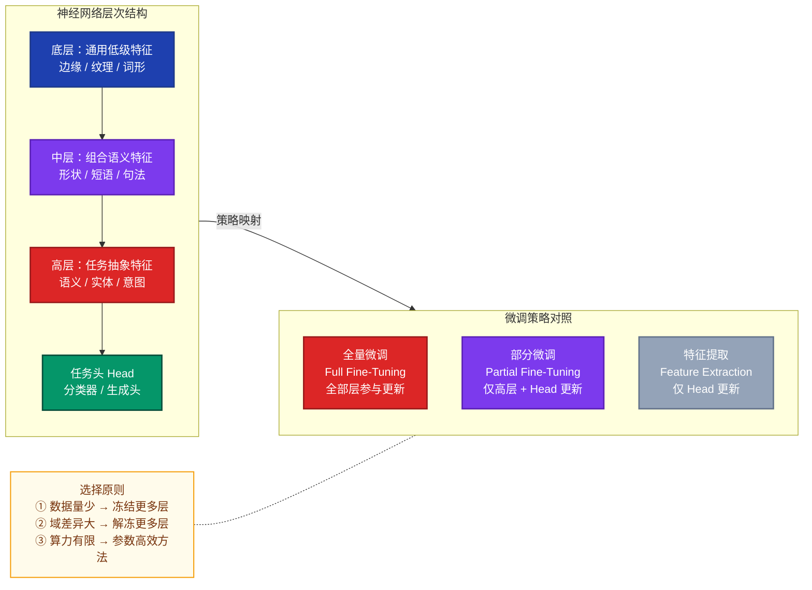

---

## 二、主流微调方法与示例

### 2.1 方法全景概览

```mermaid
flowchart TB
    %% ── 配色 ───────────────────────────────────────────────────────
    classDef rootStyle   fill:#1e40af,stroke:#1e3a8a,stroke-width:2.5px,color:#fff
    classDef cat1Style   fill:#d97706,stroke:#92400e,stroke-width:2px,color:#fff
    classDef cat2Style   fill:#dc2626,stroke:#991b1b,stroke-width:2px,color:#fff
    classDef cat3Style   fill:#7c3aed,stroke:#5b21b6,stroke-width:2px,color:#fff
    classDef cat4Style   fill:#0891b2,stroke:#0e7490,stroke-width:2px,color:#fff
    classDef leafStyle   fill:#f0fdf4,stroke:#059669,stroke-width:1.5px,color:#065f46
    classDef noteStyle   fill:#fffbeb,stroke:#f59e0b,stroke-width:1.5px,color:#78350f

    ROOT["模型微调方法体系<br>Fine-Tuning Taxonomy"]:::rootStyle

    C1["全参数微调<br>Full Fine-Tuning"]:::cat1Style
    C2["参数高效微调<br>PEFT"]:::cat2Style
    C3["对齐微调<br>Alignment Fine-Tuning"]:::cat3Style
    C4["多阶段微调<br>Multi-Stage"]:::cat4Style

    %% 全参数微调
    L11["标准 SFT<br>Supervised Fine-Tuning"]:::leafStyle
    L12["继续预训练<br>Continued Pretraining"]:::leafStyle

    %% PEFT
    L21["LoRA<br>低秩适配"]:::leafStyle
    L22["Adapter<br>适配器层"]:::leafStyle
    L23["Prefix Tuning<br>前缀调优"]:::leafStyle
    L24["Prompt Tuning<br>软提示"]:::leafStyle
    L25["BitFit<br>偏置微调"]:::leafStyle

    %% 对齐微调
    L31["RLHF<br>人类反馈强化学习"]:::leafStyle
    L32["DPO<br>直接偏好优化"]:::leafStyle
    L33["RLAIF<br>AI反馈强化学习"]:::leafStyle

    %% 多阶段
    L41["SFT → RLHF<br>指令对齐流程"]:::leafStyle
    L42["领域预训练 → SFT<br>垂直领域流程"]:::leafStyle

    ROOT --> C1 & C2 & C3 & C4
    C1 --> L11 & L12
    C2 --> L21 & L22 & L23 & L24 & L25
    C3 --> L31 & L32 & L33
    C4 --> L41 & L42
```

### 2.2 全参数监督微调（SFT）

**原理**：使用标注数据对所有模型参数进行梯度更新。适合数据量较充足、算力资源充裕的场景。

**典型应用**：将 BERT 微调用于文本分类；将 GPT 系列微调用于特定领域问答。

**代码示例（基于 HuggingFace Transformers，情感分类任务）**：

```python
from transformers import AutoTokenizer, AutoModelForSequenceClassification, Trainer, TrainingArguments
from datasets import load_dataset

# 1. 加载预训练模型与分词器
model_name = "bert-base-chinese"
tokenizer = AutoTokenizer.from_pretrained(model_name)
model = AutoModelForSequenceClassification.from_pretrained(model_name, num_labels=2)

# 2. 准备数据集
dataset = load_dataset("csv", data_files={"train": "train.csv", "test": "test.csv"})

def preprocess(examples):
    return tokenizer(examples["text"], truncation=True, padding="max_length", max_length=128)

tokenized = dataset.map(preprocess, batched=True)

# 3. 配置训练参数
training_args = TrainingArguments(
    output_dir="./results",
    num_train_epochs=3,
    per_device_train_batch_size=16,
    learning_rate=2e-5,          # 关键：比预训练时小 1~2 个数量级
    warmup_ratio=0.1,
    weight_decay=0.01,
    evaluation_strategy="epoch",
    save_strategy="epoch",
    load_best_model_at_end=True,
    fp16=True,                   # 混合精度训练
)

# 4. 启动训练
trainer = Trainer(
    model=model,
    args=training_args,
    train_dataset=tokenized["train"],
    eval_dataset=tokenized["test"],
)
trainer.train()
```

### 2.3 参数高效微调（PEFT）

当预训练模型参数量达到百亿甚至千亿级别时，全参数微调的算力成本极高，PEFT 方法通过只更新极小比例参数实现接近全量微调的效果。

#### 2.3.1 LoRA（Low-Rank Adaptation）

**核心思想**：将权重矩阵的更新量 $\Delta W$ 分解为两个低秩矩阵的乘积：

$$
W' = W_0 + \Delta W = W_0 + BA, \quad B \in \mathbb{R}^{d \times r},\ A \in \mathbb{R}^{r \times k},\ r \ll \min(d, k)
$$

训练时 $W_0$ 冻结，只优化 $A$ 和 $B$，参数量从 $d \times k$ 降至 $r(d+k)$。

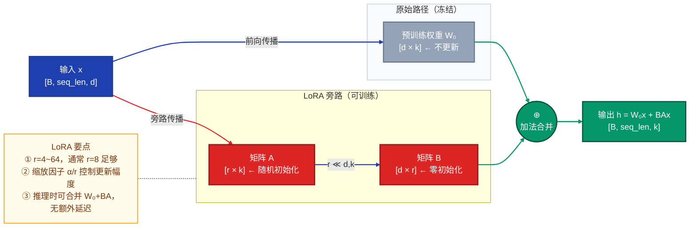

**LoRA 代码示例（使用 PEFT 库）**：

```python
from peft import LoraConfig, get_peft_model, TaskType
from transformers import AutoModelForCausalLM

# 加载基础模型
model = AutoModelForCausalLM.from_pretrained("Qwen/Qwen2.5-7B", torch_dtype="auto")

# 配置 LoRA
lora_config = LoraConfig(
    task_type=TaskType.CAUSAL_LM,
    r=8,                          # 秩，通常 4~64
    lora_alpha=16,                # 缩放因子 α，更新幅度 = lora_alpha/r
    target_modules=["q_proj", "v_proj"],  # 应用 LoRA 的目标模块
    lora_dropout=0.05,
    bias="none",
)

# 包装模型（仅 LoRA 参数可训练）
peft_model = get_peft_model(model, lora_config)
peft_model.print_trainable_parameters()
# 输出示例：trainable params: 4,194,304 || all params: 7,245,488,128 || trainable%: 0.0579
```

#### 2.3.2 Adapter

**原理**：在 Transformer 每层的 FFN 后插入小型适配器模块（Bottleneck 结构），只训练 Adapter 参数。

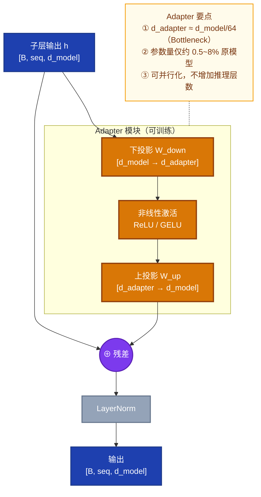

#### 2.3.3 Prefix Tuning / Prompt Tuning

| 方法 | 可训练参数 | 插入位置 | 特点 |
|------|-----------|---------|------|
| **Prefix Tuning** | 虚拟 Token 向量（每层） | 每个 Transformer 层的 KV | 表达能力强，参数稍多 |
| **Prompt Tuning** | 软提示向量 | 仅输入层 | 极简，参数极少，效果稍弱 |
| **P-Tuning v2** | 每层前缀向量 | 每层 | 改进版，适合 NLU 任务 |

### 2.4 对齐微调（Alignment Fine-Tuning）

对齐微调的目标不是任务性能，而是让模型输出符合人类价值观（Helpful / Harmless / Honest）。

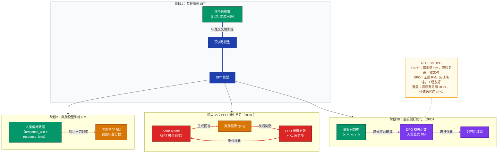

**DPO 损失函数**：

$$
\mathcal{L}_{DPO}(\pi_\theta) = -\mathbb{E}_{(x,y_w,y_l)\sim\mathcal{D}} \left[ \log \sigma \left( \beta \log \frac{\pi_\theta(y_w|x)}{\pi_{ref}(y_w|x)} - \beta \log \frac{\pi_\theta(y_l|x)}{\pi_{ref}(y_l|x)} \right) \right]
$$

其中 $\pi_{ref}$ 为参考策略（SFT 模型），$\beta$ 控制与参考策略的偏离程度。

---

## 三、完整微调流程与实战示例

### 3.1 微调全流程总览

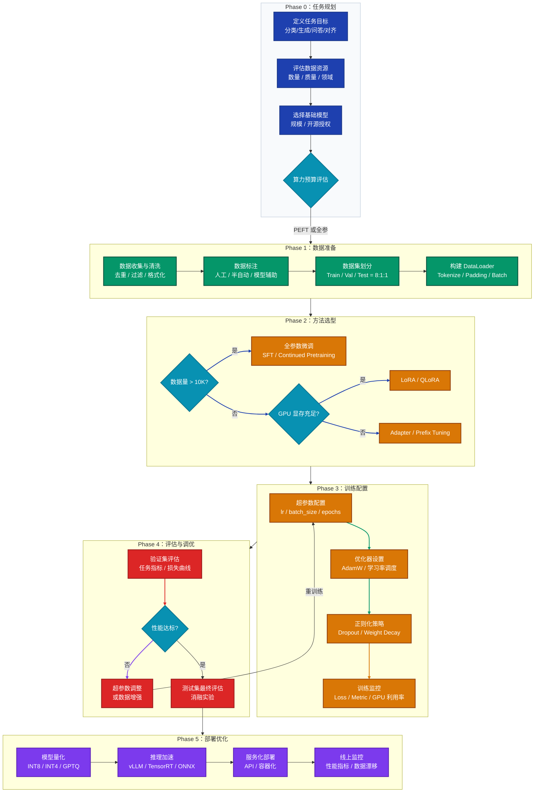

### 3.2 实战示例：使用 LoRA 微调 LLM 实现垂直领域问答

**任务目标**：将通用 LLM（Qwen2.5-7B）微调为医疗领域问答助手

#### 步骤一：数据准备

数据格式（指令微调格式 Alpaca/ShareGPT）：

```json
[
  {
    "instruction": "患者出现持续性高烧39.5℃，伴有咳嗽、呼吸急促，可能是什么疾病？",
    "input": "",
    "output": "根据描述，患者可能存在以下情况：\n1. **肺炎**：高烧伴咳嗽和呼吸急促是典型症状...\n2. **流行性感冒重症**：...\n建议立即就医，进行胸部X光和血常规检查。"
  }
]
```

数据清洗脚本：

```python
import json
import re

def clean_medical_data(raw_data):
    cleaned = []
    for item in raw_data:
        # 过滤过短的回答（质量过低）
        if len(item["output"]) < 50:
            continue
        # 过滤含有个人隐私信息的数据
        if re.search(r'\d{11}|\d{18}', item["output"]):
            continue
        # 统一格式
        cleaned.append({
            "instruction": item["instruction"].strip(),
            "input": item.get("input", "").strip(),
            "output": item["output"].strip()
        })
    return cleaned
```

#### 步骤二：完整训练脚本

```python
import torch
from datasets import Dataset
from transformers import (
    AutoTokenizer, AutoModelForCausalLM,
    TrainingArguments, DataCollatorForSeq2Seq
)
from peft import LoraConfig, get_peft_model, TaskType
from trl import SFTTrainer
import json

# ─── 配置区域 ────────────────────────────────────────────────────────
MODEL_NAME    = "Qwen/Qwen2.5-7B-Instruct"
DATA_PATH     = "./medical_qa_train.json"
OUTPUT_DIR    = "./qwen_medical_lora"
MAX_SEQ_LEN   = 2048

# ─── 1. 加载数据 ────────────────────────────────────────────────────
with open(DATA_PATH, "r", encoding="utf-8") as f:
    raw_data = json.load(f)
dataset = Dataset.from_list(raw_data)

# ─── 2. 加载模型和分词器 ────────────────────────────────────────────
tokenizer = AutoTokenizer.from_pretrained(MODEL_NAME, trust_remote_code=True)
model = AutoModelForCausalLM.from_pretrained(
    MODEL_NAME,
    torch_dtype=torch.bfloat16,   # BF16 节省显存
    device_map="auto",            # 自动分配到可用 GPU
    trust_remote_code=True,
)
model.enable_input_require_grads()  # 启用梯度检查点时必须

# ─── 3. 配置 LoRA ───────────────────────────────────────────────────
lora_config = LoraConfig(
    task_type=TaskType.CAUSAL_LM,
    r=16,
    lora_alpha=32,
    target_modules=["q_proj", "k_proj", "v_proj", "o_proj",
                    "gate_proj", "up_proj", "down_proj"],
    lora_dropout=0.05,
    bias="none",
)
model = get_peft_model(model, lora_config)
model.print_trainable_parameters()

# ─── 4. 数据格式化函数 ───────────────────────────────────────────────
def format_prompt(example):
    """构建 Chat 格式的训练样本"""
    messages = [
        {"role": "system",  "content": "你是一位专业的医疗问答助手，提供准确、负责任的医疗知识解答。"},
        {"role": "user",    "content": example["instruction"]},
        {"role": "assistant","content": example["output"]},
    ]
    return tokenizer.apply_chat_template(messages, tokenize=False, add_generation_prompt=False)

# ─── 5. 训练参数 ─────────────────────────────────────────────────────
training_args = TrainingArguments(
    output_dir=OUTPUT_DIR,
    num_train_epochs=3,
    per_device_train_batch_size=2,
    gradient_accumulation_steps=8,  # 等效 batch_size=16
    learning_rate=2e-4,
    lr_scheduler_type="cosine",
    warmup_ratio=0.05,
    weight_decay=0.01,
    bf16=True,
    logging_steps=10,
    save_steps=200,
    eval_steps=200,
    evaluation_strategy="steps",
    save_total_limit=3,
    load_best_model_at_end=True,
    gradient_checkpointing=True,    # 节省显存（以计算换内存）
    report_to="tensorboard",
)

# ─── 6. 启动训练 ─────────────────────────────────────────────────────
trainer = SFTTrainer(
    model=model,
    tokenizer=tokenizer,
    args=training_args,
    train_dataset=dataset,
    formatting_func=format_prompt,
    max_seq_length=MAX_SEQ_LEN,
    dataset_num_proc=4,
)
trainer.train()

# ─── 7. 保存模型 ─────────────────────────────────────────────────────
model.save_pretrained(OUTPUT_DIR)
tokenizer.save_pretrained(OUTPUT_DIR)
print("训练完成！LoRA 权重已保存至", OUTPUT_DIR)
```

#### 步骤三：推理验证

```python
from peft import PeftModel
from transformers import AutoTokenizer, AutoModelForCausalLM
import torch

# 加载基础模型 + LoRA 权重
base_model = AutoModelForCausalLM.from_pretrained("Qwen/Qwen2.5-7B-Instruct", torch_dtype=torch.bfloat16, device_map="auto")
model = PeftModel.from_pretrained(base_model, "./qwen_medical_lora")
model = model.merge_and_unload()  # 合并 LoRA 权重，消除推理额外开销
tokenizer = AutoTokenizer.from_pretrained("./qwen_medical_lora")

def inference(question: str) -> str:
    messages = [
        {"role": "system", "content": "你是一位专业的医疗问答助手。"},
        {"role": "user",   "content": question},
    ]
    text = tokenizer.apply_chat_template(messages, tokenize=False, add_generation_prompt=True)
    inputs = tokenizer(text, return_tensors="pt").to(model.device)
    with torch.no_grad():
        outputs = model.generate(**inputs, max_new_tokens=512, temperature=0.7, do_sample=True)
    return tokenizer.decode(outputs[0][inputs.input_ids.shape[1]:], skip_special_tokens=True)

# 测试
print(inference("糖尿病患者日常饮食需要注意什么？"))
```

### 3.3 数据处理流程详解

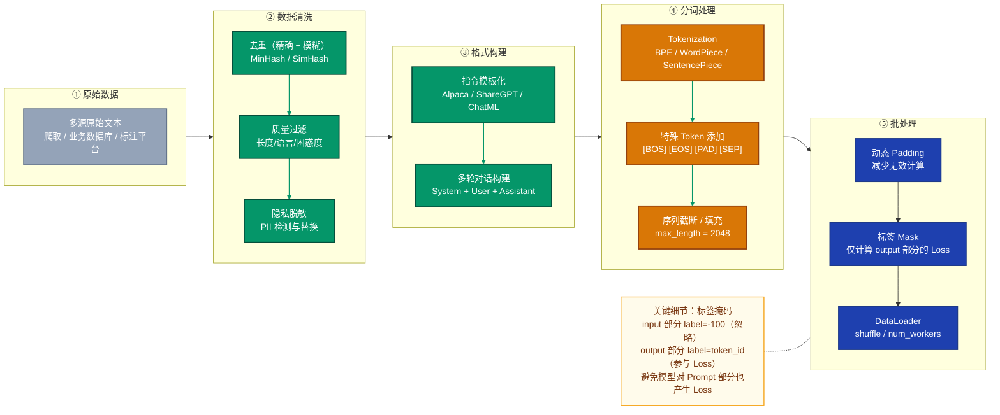

---

## 四、常见问题与解决方案

### 4.1 问题全景图

```mermaid
flowchart TB
    %% ── 配色 ───────────────────────────────────────────────────────
    classDef rootStyle   fill:#1e40af,stroke:#1e3a8a,stroke-width:2.5px,color:#fff
    classDef cat1Style   fill:#dc2626,stroke:#991b1b,stroke-width:2px,color:#fff
    classDef cat2Style   fill:#d97706,stroke:#92400e,stroke-width:2px,color:#fff
    classDef cat3Style   fill:#7c3aed,stroke:#5b21b6,stroke-width:2px,color:#fff
    classDef cat4Style   fill:#0891b2,stroke:#0e7490,stroke-width:2px,color:#fff
    classDef solStyle    fill:#f0fdf4,stroke:#059669,stroke-width:1.5px,color:#065f46

    ROOT["微调常见问题<br>Fine-Tuning Issues"]:::rootStyle
    C1["灾难性遗忘<br>Catastrophic Forgetting"]:::cat1Style
    C2["过拟合<br>Overfitting"]:::cat2Style
    C3["训练不稳定<br>Training Instability"]:::cat3Style
    C4["性能不及预期<br>Underperformance"]:::cat4Style

    S11["EWC / 弹性权重合并"]:::solStyle
    S12["LoRA 降低更新幅度"]:::solStyle
    S13["混合通用数据重放"]:::solStyle

    S21["增大 Dropout"]:::solStyle
    S22["Weight Decay 正则"]:::solStyle
    S23["Early Stopping"]:::solStyle
    S24["数据增强 / 扩充"]:::solStyle

    S31["降低学习率"]:::solStyle
    S32["Gradient Clipping"]:::solStyle
    S33["Warmup 策略"]:::solStyle
    S34["BF16 替代 FP16"]:::solStyle

    S41["增加数据量/质量"]:::solStyle
    S42["调整 LoRA Rank"]:::solStyle
    S43["换更强基础模型"]:::solStyle
    S44["检查标签掩码"]:::solStyle

    ROOT --> C1 & C2 & C3 & C4
    C1 --> S11 & S12 & S13
    C2 --> S21 & S22 & S23 & S24
    C3 --> S31 & S32 & S33 & S34
    C4 --> S41 & S42 & S43 & S44
```

### 4.2 灾难性遗忘（Catastrophic Forgetting）

**现象**：微调后模型在目标任务上性能提升，但在原有通用任务上严重退化。

**根因**：梯度更新覆盖了原有权重中编码的通用知识。

| 解决策略 | 核心思想 | 适用场景 |
|---------|---------|---------|
| **EWC（弹性权重合并）** | 对重要参数施加 L2 惩罚，限制其偏移 | 全参微调场景 |
| **LoRA/Adapter** | 通过旁路结构隔离任务参数，原权重不变 | 资源受限场景 |
| **数据混合重放** | 在训练集中混入一定比例通用数据 | 需要保持通用能力 |
| **降低学习率** | 用更小的步长减缓知识覆盖速度 | 简单有效的通用手段 |

**EWC 损失函数**：

$$
\mathcal{L}_{EWC}(\theta) = \mathcal{L}_{task}(\theta) + \frac{\lambda}{2} \sum_i F_i (\theta_i - \theta_{0,i})^2
$$

其中 $F_i$ 为 Fisher 信息矩阵对角项，衡量参数 $\theta_i$ 对原任务的重要性。

### 4.3 过拟合（Overfitting）

**现象**：训练 Loss 持续下降，验证 Loss 先降后升，二者差距不断扩大。

**诊断代码**：

```python
import matplotlib.pyplot as plt

def plot_training_curves(train_losses, val_losses):
    fig, ax = plt.subplots(figsize=(10, 4))
    ax.plot(train_losses, label="Train Loss", color="#1e40af")
    ax.plot(val_losses,   label="Val Loss",   color="#dc2626")
    ax.set_xlabel("Steps")
    ax.set_ylabel("Loss")
    ax.legend()
    # 过拟合信号：val_loss 曲线右段明显上翘
    plt.savefig("training_curves.png", dpi=150)

# 解决方案示例：添加正则化
training_args = TrainingArguments(
    weight_decay=0.01,          # L2 正则
    lr_scheduler_type="cosine", # 防止后期学习率过大
    # early_stopping_patience=3, # 需配合 EarlyStoppingCallback
)
```

**系统性解决方案**：

1. **减少微调轮数（Epochs）**：使用 Early Stopping，当验证指标连续 N 步不提升时停止
2. **增大 Dropout**：在 Adapter 或新增 Head 中设置 Dropout=0.1~0.3
3. **数据扩充**：回译、同义词替换、EDA（Easy Data Augmentation）
4. **降低 LoRA Rank**：秩 r 越大，可训练参数越多，越容易过拟合

### 4.4 训练不稳定（Loss NaN / 梯度爆炸）

**常见原因及排查**：

```python
# 问题1：梯度爆炸 → 启用梯度裁剪
training_args = TrainingArguments(
    max_grad_norm=1.0,  # 梯度范数裁剪阈值
)

# 问题2：FP16 溢出 → 换用 BF16
training_args = TrainingArguments(
    bf16=True,   # BF16 数值范围更大，不易溢出
    fp16=False,
)

# 问题3：学习率过大 → 降低 lr 并启用 Warmup
training_args = TrainingArguments(
    learning_rate=1e-4,  # 尝试降低 10 倍
    warmup_ratio=0.1,
)

# 监控梯度范数（自定义 Callback）
from transformers import TrainerCallback
class GradientMonitorCallback(TrainerCallback):
    def on_step_end(self, args, state, control, model=None, **kwargs):
        total_norm = 0
        for p in model.parameters():
            if p.grad is not None:
                total_norm += p.grad.data.norm(2).item() ** 2
        total_norm = total_norm ** 0.5
        if total_norm > 10:
            print(f"Warning: Large gradient norm {total_norm:.2f} at step {state.global_step}")
```

### 4.5 显存不足（OOM - Out of Memory）

**显存优化优先级排序**：

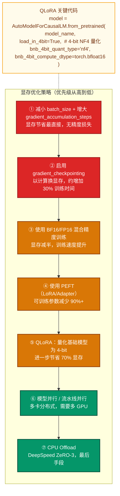

### 4.6 性能不及预期

**系统性排查清单**：

| 排查维度 | 检查项目 | 解决方向 |
|---------|---------|---------|
| **数据质量** | 标签是否正确？指令格式是否统一？ | 重新清洗数据，人工抽检 50~100 条 |
| **数据量** | 训练样本是否足够（一般 > 1K 条） | 数据增强、半自动标注、合成数据 |
| **标签掩码** | input 部分是否被正确 mask（label=-100） | 检查 DataCollator 实现 |
| **超参数** | lr 是否合理（SFT: 1e-5~2e-4，LoRA: 1e-4~3e-4） | 做学习率搜索（lr_finder）|
| **基础模型** | 基础模型与任务语言/领域是否匹配 | 换更匹配的基础模型 |
| **评估指标** | 评估指标是否与任务目标一致 | 重新定义评估方案 |

---

## 五、关键注意事项

### 5.1 数据质量是第一优先级

> **"垃圾进，垃圾出"（Garbage In, Garbage Out）**

- **多样性**：覆盖任务的各种场景、风格和难度层次，避免分布偏态
- **准确性**：标注错误会直接训练出错误行为，建议对训练集进行人工抽检
- **一致性**：相同问题的回答风格、格式、详细程度要统一
- **数量下限**：分类任务 ≥ 500 条/类；生成任务 ≥ 1000 条；对齐任务 ≥ 5000 对

### 5.2 学习率选择

学习率是微调中最敏感的超参数之一：

| 场景 | 推荐学习率范围 | 说明 |
|------|-------------|------|
| 全量 SFT（大模型） | `1e-5 ~ 5e-5` | 过大会破坏预训练知识 |
| 全量 SFT（小模型） | `2e-5 ~ 2e-4` | 参数少，承受更大学习率 |
| LoRA 微调 | `1e-4 ~ 3e-4` | 仅 LoRA 参数，承受更大 lr |
| QLoRA 微调 | `2e-4 ~ 2e-3` | 量化后梯度估计有噪声 |
| Adapter 微调 | `1e-4 ~ 5e-4` | 同 LoRA 量级 |

**必须使用 Warmup**：前 5%~10% 的步骤线性升温，避免初始大梯度破坏权重。

### 5.3 不同任务规模下的微调策略选择

```mermaid
flowchart LR
    %% ── 配色 ───────────────────────────────────────────────────────
    classDef scaleStyle  fill:#1e40af,stroke:#1e3a8a,stroke-width:2px,color:#fff
    classDef recStyle    fill:#059669,stroke:#064e3b,stroke-width:2px,color:#fff
    classDef warnStyle   fill:#dc2626,stroke:#991b1b,stroke-width:2px,color:#fff
    classDef noteStyle   fill:#fffbeb,stroke:#f59e0b,stroke-width:1.5px,color:#78350f
    classDef layerStyle  fill:#f8fafc,stroke:#cbd5e0,stroke-width:1.5px

    subgraph SmallScale["数据 < 1K 条"]
        SS1["策略：Prompt Engineering<br>或 Few-shot 推理"]:::recStyle
        SS2["PEFT：Prefix Tuning<br>最少参数，防过拟合"]:::recStyle
    end
    class SmallScale layerStyle

    subgraph MidScale["数据 1K ~ 100K 条"]
        MS1["推荐：LoRA / QLoRA<br>高效且效果稳定"]:::recStyle
        MS2["可选：Adapter<br>灵活组合多任务"]:::recStyle
    end
    class MidScale layerStyle

    subgraph LargeScale["数据 > 100K 条"]
        LS1["推荐：全量 SFT<br>充分利用数据"]:::recStyle
        LS2["可选：LoRA + 大 Rank<br>r=64~128"]:::recStyle
    end
    class LargeScale layerStyle

    subgraph AlignScale["对齐任务（偏好数据）"]
        AL1["1K~10K 对：DPO<br>简单高效"]:::recStyle
        AL2["> 10K 对：RLHF/PPO<br>效果更强但复杂"]:::recStyle
        AL3["避免：直接 SFT 优质回答<br>忽视负样本信息"]:::warnStyle
    end
    class AlignScale layerStyle

    SmallScale --> MidScale --> LargeScale --> AlignScale

    NOTE["注意：以上为经验规则，实际需结合<br>GPU 资源、基础模型大小、任务复杂度综合决策"]:::noteStyle
    NOTE -.- LargeScale
```

### 5.4 评估与测试规范

- **永不在测试集上调参**：超参数调整只能依据验证集，测试集只用于最终报告
- **选择合适的评估指标**：
  - 分类：Accuracy / F1 / AUC
  - 生成：BLEU / ROUGE / BERTScore
  - 对话：Human Evaluation / GPT-4 Evaluation
- **基线对比**：必须与 Zero-shot 基础模型对比，体现微调收益
- **消融实验**：分析各组件（数据量、LoRA rank、学习率等）对性能的贡献

### 5.5 安全与合规

- **数据隐私**：训练数据中不得含有未脱敏的个人身份信息（PII）
- **版权合规**：确认训练数据来源和基础模型授权许可（商业/研究限制）
- **模型对齐**：对于面向用户的应用，微调后须进行安全性评估，测试越狱场景
- **水印与溯源**：重要模型建议添加不可见水印，便于后续溯源

---

## 六、面试常见问题 FAQ

### 【原理类】

---

**Q1：微调（Fine-Tuning）和迁移学习（Transfer Learning）的关系是什么？**

**A**：迁移学习是一种学习范式，其核心思路是将从源任务学到的知识迁移到目标任务。微调是迁移学习最主流的实现方式之一——通过加载源任务预训练权重作为初始化，然后在目标任务数据上继续训练（通常是全参或部分参数），使模型适配新任务。两者关系是"范式与实现"的关系，迁移学习还包含特征提取、领域适应、多任务学习等其他实现方式。

---

**Q2：为什么微调比从头训练（Train from Scratch）效果好？**

**A**：主要有三个原因：
1. **更好的初始化**：预训练权重已处于损失曲面的相对优良区域，梯度方向更准确，收敛更快
2. **通用特征复用**：底层参数已编码语法、语义、纹理等通用特征，这些是跨任务共享的
3. **缓解小样本过拟合**：预训练提供了强大的归纳偏置（inductive bias），在数据稀少时防止模型乱拟合

---

**Q3：LoRA 的核心思想是什么？为什么低秩分解是合理的？**

**A**：LoRA 将权重更新量 $\Delta W$ 分解为两个低秩矩阵之积 $BA$（$r \ll d,k$），训练时只优化 $A$ 和 $B$，原始权重 $W_0$ 冻结，推理时合并为 $W' = W_0 + BA$，无额外延迟。

低秩假设的合理性：研究（Aghajanyan et al., 2020）表明，预训练模型在微调过程中权重变化的内在维度（intrinsic dimension）非常低，即真正有效的参数更新发生在一个低维子空间内。因此，用低秩矩阵来近似 $\Delta W$ 可以用极少的参数（约 0.1%）捕获大部分有效更新。

---

**Q4：RLHF 的完整流程是什么？DPO 如何简化了这一流程？**

**A**：

**RLHF 流程**（三阶段）：
1. SFT：用优质指令数据监督微调基础模型
2. RM 训练：用人类偏好对（胜/负回答）训练奖励模型，输出标量分数
3. PPO 优化：以 RM 分数为奖励信号，用近端策略优化（PPO）迭代优化 SFT 模型，同时加 KL 惩罚防止偏离太远

**DPO 的简化**：DPO 发现 RLHF 的最优策略有闭式解，可以将奖励建模和策略优化合并为一个有监督的分类损失，直接在偏好对数据上优化策略模型，无需显式训练奖励模型和 PPO 环境，工程实现大幅简化，但在某些复杂场景下效果略弱于 RLHF。

---

**Q5：什么是灾难性遗忘？有哪些方法可以缓解？**

**A**：灾难性遗忘（Catastrophic Forgetting）指神经网络在学习新任务时，梯度更新覆盖了之前学到的知识，导致旧任务性能急剧下降。

缓解方法：
1. **参数隔离（PEFT）**：LoRA/Adapter 通过旁路结构只更新新增参数，原权重完全不变，从根本上避免遗忘
2. **弹性权重合并（EWC）**：对重要参数添加 L2 惩罚 $\lambda F_i(\theta_i - \theta_{0,i})^2$，Fisher 信息矩阵 $F_i$ 衡量重要性
3. **混合数据重放**：在微调数据中混入原任务数据（通常 5%~20%），保持原有能力
4. **降低学习率**：步长更小，参数更新更缓慢，遗忘速度也更慢

---

### 【实践类】

---

**Q6：微调时如何选择合适的学习率？**

**A**：
- 全参 SFT：`1e-5 ~ 5e-5`（比预训练低 1~2 个数量级，防止破坏预训练知识）
- LoRA 微调：`1e-4 ~ 3e-4`（仅更新 LoRA 参数，可承受更大学习率）
- 必须配合 Warmup（前 5%~10% 步骤线性升温）和学习率调度（Cosine Decay 最常用）
- 实践技巧：可用学习率搜索（LR Range Test）找到最优量级；观察 loss 曲线，若早期 loss 振荡则降低 lr，若收敛过慢则升高 lr

---

**Q7：如何判断模型是否过拟合？过拟合后如何处理？**

**A**：

**判断标准**：
- 训练 Loss 持续下降，验证 Loss 先降后升（U 型曲线）
- 验证指标（如 F1）在某个 epoch 后持续下滑
- 训练集性能远高于验证集（差距 > 5%~10% 通常是过拟合信号）

**处理方法**（按优先级）：
1. Early Stopping：监控验证指标，不再提升时停止
2. 减少训练 Epochs 或使用更少数据（检查是否数据过少导致记忆）
3. 增大 Weight Decay（0.01~0.1）
4. 增大 Dropout（0.1~0.3）
5. 数据增强：回译、随机删除、同义词替换
6. 降低 LoRA Rank（减少可训练参数量）

---

**Q8：LoRA 的 rank（r）和 alpha 应该如何设置？**

**A**：
- **Rank r**：控制低秩矩阵的秩，即可训练参数量。常用值：4、8、16、32、64。数据量少、任务简单时用小 r（4~8）；任务复杂、数据充足时用大 r（32~64）。r=8 是多数场景的安全起点。
- **Alpha（α）**：缩放因子，实际更新幅度 = `(alpha/r) * LoRA输出`。通常设置 `alpha = 2*r`（如 r=8, alpha=16）。alpha 越大，LoRA 更新幅度越大，学习越激进，更容易过拟合。
- **经验规则**：`alpha/r` 比值通常保持在 0.5~2 之间；调整时优先调 r，alpha 跟随调整。

---

**Q9：QLoRA 是什么？它如何在有限显存下训练大模型？**

**A**：QLoRA（Quantized LoRA）结合了两项技术：
1. **4-bit 量化基础模型**：使用 NF4（Normal Float 4）格式将基础模型量化至 4-bit，显存降低约 75%（相比 FP32）
2. **LoRA 微调**：在量化模型上添加 LoRA 适配器，用 BF16 精度训练 LoRA 参数
3. **双重量化**：对量化常数本身也进行量化，进一步节省显存

效果：可在单张 24GB 显存的 GPU 上微调 65B 参数模型，性能接近全精度 LoRA。代价是训练速度有所降低（量化/反量化开销）。

---

**Q10：如何评估微调模型的质量？**

**A**：评估应从多维度进行：

| 评估维度 | 具体方法 |
|---------|---------|
| **任务性能** | 在测试集上计算任务指标（F1/BLEU/Accuracy）并与 Zero-shot 基线对比 |
| **通用能力** | 在通用 Benchmark（MMLU/C-Eval/MT-Bench）上测试是否发生能力退化 |
| **安全性** | 测试越狱 Prompt，检查是否输出有害内容 |
| **人工评估** | 随机抽取 50~100 条输出，人工打分（相关性/准确性/流畅性）|
| **GPT-4 自动评估** | 用 GPT-4 对模型输出进行打分（MT-Bench 方法），作为人工评估的替代 |
| **消融实验** | 对比不同数据量、LoRA rank、学习率的性能，理解各因素影响 |

---

**Q11：指令微调（Instruction Tuning）的数据格式有哪些常见选择？**

**A**：

- **Alpaca 格式**：三字段（instruction / input / output），适合单轮指令任务，格式简单
- **ShareGPT / ChatML 格式**：多轮对话格式，包含 system/user/assistant 多角色，适合对话模型
- **OpenAI Messages 格式**：JSON 消息列表，`[{"role": "...", "content": "..."}]`，成为行业标准
- **自定义格式**：针对特定任务（如代码生成、知识问答）可设计结构化格式

**重要原则**：格式需与基础模型的预训练格式或官方微调格式一致，使用错误格式会显著降低微调效果。

---

**Q12：如何在没有大量 GPU 的情况下微调 7B 以上的大模型？**

**A**：低资源微调策略组合：

1. **QLoRA**：4-bit 量化 + LoRA，单张 16GB 显卡可微调 13B 模型，24GB 可微调 33B 模型
2. **gradient_checkpointing=True**：牺牲计算换显存（重新计算激活值而不是存储）
3. **小 batch_size + 大 gradient_accumulation**：batch=1，accumulation=32，等效 batch=32
4. **序列长度控制**：将 max_length 从 4096 降到 1024 可减少约 75% 激活显存
5. **CPU Offload（DeepSpeed ZeRO-3）**：将优化器状态和部分参数卸载到 CPU 内存
6. **云 GPU 租用**：利用 AutoDL、Vast.ai 等平台按需租用 A100/H100

实测参考：单张 RTX 3090（24GB）使用 QLoRA 可微调 Qwen2.5-7B，训练 1000 条数据约需 30 分钟。

---

> **文档版本**：v1.0 · 2026-03 · 适用于 LLM / NLP 模型微调实践参考
>
> **相关阅读**：LoRA 论文（Hu et al., 2021）| QLoRA 论文（Dettmers et al., 2023）| DPO 论文（Rafailov et al., 2023）| InstructGPT（Ouyang et al., 2022）
