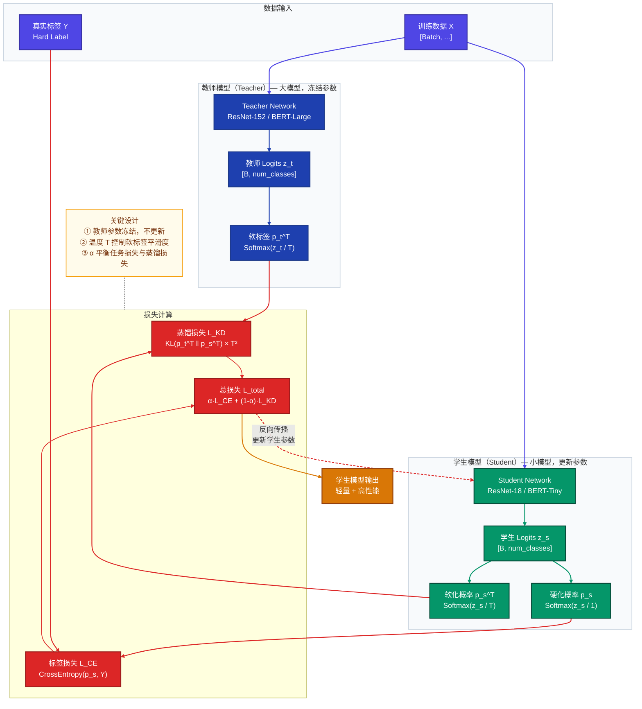
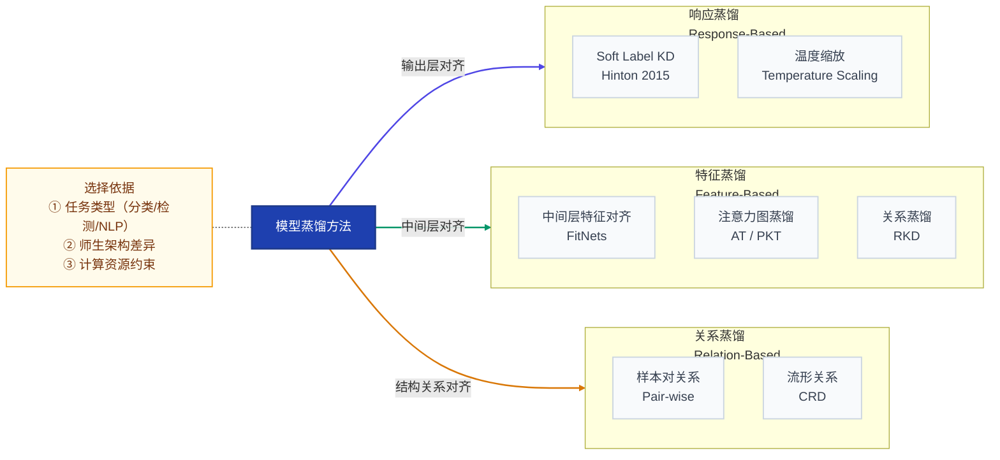
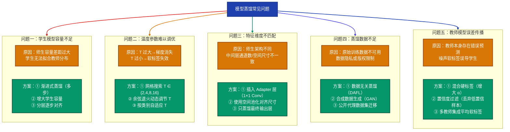
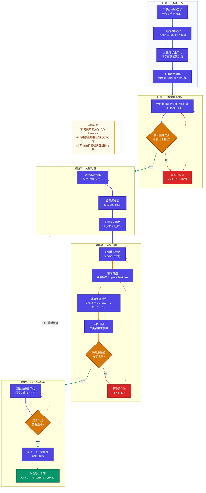

# 模型蒸馏（Knowledge Distillation）详解文档

> **摘要**：模型蒸馏是一种将大型复杂模型（教师模型）的知识迁移到小型轻量模型（学生模型）的技术，兼顾推理效率与性能保留。本文从原理、方法、常见问题、注意事项到完整实践流程进行系统讲解，并附 FAQ 与 Mermaid 辅助图示。

---

## 目录

1. [核心概念与原理](#1-核心概念与原理)
2. [蒸馏方法分类](#2-蒸馏方法分类)
3. [应用方法与示例](#3-应用方法与示例)
4. [常见问题与解决方案](#4-常见问题与解决方案)
5. [注意事项](#5-注意事项)
6. [完整蒸馏流程](#6-完整蒸馏流程)
7. [FAQ 面试常见问题](#7-faq-面试常见问题)

---

## 1. 核心概念与原理

### 1.1 什么是模型蒸馏

模型蒸馏（Knowledge Distillation，KD）由 Hinton 等人于 2015 年在论文 *Distilling the Knowledge in a Neural Network* 中正式提出。其核心思想是：**大模型（教师）所学到的"暗知识"（Dark Knowledge）可以通过软标签传递给小模型（学生），使学生模型在参数量大幅减少的前提下，尽可能保留教师模型的性能**。

### 1.2 软标签与暗知识

传统训练使用**硬标签（Hard Label）**，如 `[0, 0, 1, 0, ...]`，只告诉模型正确类别。

教师模型输出的**软标签（Soft Label）**，如 `[0.01, 0.03, 0.85, 0.07, ...]`，包含了类别间相似度的隐含信息——这就是"暗知识"。

**示例**：在手写数字识别中，数字"7"被误分类为"1"的概率远高于"0"，这说明"7"与"1"在特征空间上更相近。这种类间关系信息就蕴含在软标签中，是硬标签所无法传达的。

### 1.3 温度参数 T（Temperature Scaling）

为了使软标签的概率分布更"平滑"，蒸馏引入了温度参数 $T$：

$$
q_i = \frac{\exp(z_i / T)}{\sum_j \exp(z_j / T)}
$$

- 当 $T = 1$ 时，退化为普通 Softmax；
- 当 $T > 1$ 时，分布更加平滑，类间差异被放大，暗知识更丰富；
- 当 $T \to \infty$ 时，各类概率趋于均匀；
- 当 $T < 1$ 时，分布更尖锐，接近硬标签。

**实践建议**：$T$ 通常取 $3 \sim 10$，具体依任务而定。

### 1.4 蒸馏损失函数

标准蒸馏的总损失由两部分组成：

$$
\mathcal{L}_{total} = \alpha \cdot \mathcal{L}_{CE}(y, p_s) + (1 - \alpha) \cdot T^2 \cdot \mathcal{L}_{KD}(p_t^T, p_s^T)
$$

| 符号 | 含义 |
|------|------|
| $\mathcal{L}_{CE}$ | 学生模型与真实标签的交叉熵损失 |
| $\mathcal{L}_{KD}$ | 学生与教师软标签之间的 KL 散度 |
| $\alpha$ | 两项损失的平衡权重（$0 \le \alpha \le 1$） |
| $T^2$ | 温度缩放的梯度补偿因子 |
| $p_s^T, p_t^T$ | 在温度 $T$ 下学生/教师的软化概率 |

> **为什么要乘以 $T^2$？** 对 KL 散度的梯度进行反向传播时，会产生 $1/T^2$ 的缩放，乘以 $T^2$ 可使两项损失在数值尺度上保持一致。

---

### 蒸馏核心原理流程图



---

## 2. 蒸馏方法分类

### 2.1 按蒸馏对象分类



### 2.2 各方法说明

| 方法类别 | 对齐对象 | 代表方法 | 适用场景 |
|----------|----------|----------|----------|
| **响应蒸馏** | 输出层 Logits | Hinton KD | 分类任务，师生架构差异大 |
| **特征蒸馏** | 中间层特征图 | FitNets、AT | 师生结构相似，需要对齐维度 |
| **注意力蒸馏** | 注意力权重矩阵 | NST、ATKD | Transformer 系列模型 |
| **关系蒸馏** | 样本间几何关系 | RKD、CRD | 度量学习、表示学习 |
| **数据无关蒸馏** | 生成合成数据 | DAFL、DFAD | 无原始训练数据场景 |
| **在线蒸馏** | 多模型互学习 | DML、ONE | 无需预训练教师 |

### 2.3 按训练策略分类

| 策略 | 说明 | 优点 | 缺点 |
|------|------|------|------|
| **离线蒸馏** | 教师预训练完成后再蒸馏学生 | 流程清晰，灵活 | 需存储教师模型 |
| **在线蒸馏** | 教师与学生同步训练 | 无需预训练教师 | 训练复杂度高 |
| **自蒸馏** | 模型自身浅层蒸馏深层 | 无需额外模型 | 提升幅度有限 |

---

## 3. 应用方法与示例

### 3.1 方法一：响应蒸馏（Soft Label KD）

最经典的蒸馏方式，直接对齐输出 Logits。

**完整代码示例（PyTorch）**：

```python
import torch
import torch.nn as nn
import torch.nn.functional as F

class DistillationLoss(nn.Module):
    """
    标准 Hinton 知识蒸馏损失
    L = α * L_CE(student, hard_label) + (1 - α) * T² * L_KD(teacher_soft, student_soft)
    """
    def __init__(self, temperature: float = 4.0, alpha: float = 0.5):
        super().__init__()
        self.T = temperature
        self.alpha = alpha

    def forward(self, student_logits, teacher_logits, labels):
        # 硬标签损失：学生预测 vs 真实标签
        loss_ce = F.cross_entropy(student_logits, labels)

        # 软标签损失：KL 散度（教师软标签 vs 学生软标签）
        student_soft = F.log_softmax(student_logits / self.T, dim=1)
        teacher_soft = F.softmax(teacher_logits / self.T, dim=1)
        loss_kd = F.kl_div(student_soft, teacher_soft, reduction='batchmean') * (self.T ** 2)

        return self.alpha * loss_ce + (1 - self.alpha) * loss_kd


def train_one_epoch(teacher, student, loader, optimizer, criterion, device):
    teacher.eval()   # 教师模型冻结，不更新梯度
    student.train()

    for images, labels in loader:
        images, labels = images.to(device), labels.to(device)

        with torch.no_grad():
            teacher_logits = teacher(images)  # 教师推理，无梯度

        student_logits = student(images)
        loss = criterion(student_logits, teacher_logits, labels)

        optimizer.zero_grad()
        loss.backward()
        optimizer.step()
```

### 3.2 方法二：特征蒸馏（FitNets）

对齐教师与学生的**中间层特征**，帮助学生学习更丰富的内部表示。

```python
class FeatureDistillationLoss(nn.Module):
    """
    特征对齐损失：当师生特征维度不同时，使用适配层（Adapter）对齐
    """
    def __init__(self, student_dim: int, teacher_dim: int):
        super().__init__()
        # 适配层：将学生特征映射到教师特征空间
        self.adapter = nn.Conv2d(student_dim, teacher_dim, kernel_size=1)

    def forward(self, student_feat, teacher_feat):
        # 对齐维度
        student_feat_aligned = self.adapter(student_feat)
        # L2 均方误差损失
        return F.mse_loss(student_feat_aligned, teacher_feat.detach())
```

### 3.3 方法三：注意力蒸馏（Attention Transfer）

用于 Transformer 类模型，对齐注意力权重矩阵。

```python
class AttentionDistillLoss(nn.Module):
    """
    注意力转移损失：对齐注意力图的空间分布
    """
    def attention_map(self, feature):
        # 沿通道维度求和后归一化
        return F.normalize(feature.pow(2).mean(dim=1).view(feature.size(0), -1))

    def forward(self, student_feats: list, teacher_feats: list):
        loss = 0.0
        for s_feat, t_feat in zip(student_feats, teacher_feats):
            s_attn = self.attention_map(s_feat)
            t_attn = self.attention_map(t_feat)
            loss += (s_attn - t_attn).pow(2).mean()
        return loss
```

### 3.4 方法四：NLP 中的蒸馏（DistilBERT 风格）

针对 BERT 等大型语言模型的蒸馏策略。

```python
class BERTDistillationLoss(nn.Module):
    """
    DistilBERT 风格：隐藏层 MSE + 注意力 MSE + MLM 损失
    """
    def __init__(self, alpha=0.5, beta=0.5, temperature=4.0):
        super().__init__()
        self.alpha = alpha
        self.beta = beta
        self.T = temperature

    def forward(self, student_out, teacher_out, labels):
        # 1. Logits 蒸馏（MLM 任务）
        s_logits = student_out.logits
        t_logits = teacher_out.logits.detach()
        loss_logit = F.kl_div(
            F.log_softmax(s_logits / self.T, dim=-1),
            F.softmax(t_logits / self.T, dim=-1),
            reduction='batchmean'
        ) * self.T ** 2

        # 2. 隐藏层特征对齐
        s_hidden = student_out.hidden_states[-1]
        t_hidden = teacher_out.hidden_states[-1].detach()
        loss_hidden = F.mse_loss(s_hidden, t_hidden)

        # 3. 注意力矩阵对齐
        s_attn = student_out.attentions[-1]
        t_attn = teacher_out.attentions[-1].detach()
        loss_attn = F.mse_loss(s_attn, t_attn)

        return self.alpha * loss_logit + self.beta * (loss_hidden + loss_attn)
```

---

## 4. 常见问题与解决方案



### 4.1 问题详述与解决代码

#### 问题一：温度参数调优

```python
import optuna

def objective(trial):
    T = trial.suggest_float('temperature', 1.0, 20.0, log=True)
    alpha = trial.suggest_float('alpha', 0.1, 0.9)
    criterion = DistillationLoss(temperature=T, alpha=alpha)
    # ... 训练并返回验证集准确率
    return val_accuracy

study = optuna.create_study(direction='maximize')
study.optimize(objective, n_trials=50)
print("最优参数：", study.best_params)
```

#### 问题二：特征维度不匹配

```python
class DimensionAdapter(nn.Module):
    """处理师生特征维度不一致问题"""
    def __init__(self, in_channels, out_channels, spatial_size=None):
        super().__init__()
        self.conv = nn.Conv2d(in_channels, out_channels, kernel_size=1, bias=False)
        self.pool = nn.AdaptiveAvgPool2d(spatial_size) if spatial_size else nn.Identity()
        self.bn = nn.BatchNorm2d(out_channels)

    def forward(self, x):
        return self.bn(self.conv(self.pool(x)))
```

#### 问题三：教师误差传播（置信度过滤）

```python
def confidence_filtered_loss(student_logits, teacher_logits, labels,
                              criterion, threshold=0.8):
    """只对教师高置信度样本进行蒸馏"""
    teacher_conf = torch.softmax(teacher_logits, dim=1).max(dim=1).values
    mask = teacher_conf >= threshold

    if mask.sum() == 0:
        return criterion.ce_loss(student_logits, labels)

    return criterion(
        student_logits[mask],
        teacher_logits[mask],
        labels[mask]
    )
```

---

## 5. 注意事项

### 5.1 模型设计注意事项

| 事项 | 说明 | 建议 |
|------|------|------|
| **师生容量比** | 差距过大会导致学生无法学习 | 参数量比控制在 $1:5 \sim 1:20$ 以内 |
| **架构相似性** | 架构差异过大时特征蒸馏失效 | 同系列架构蒸馏效果更好 |
| **教师模型质量** | 弱教师带来噪声知识 | 确保教师准确率显著高于学生 |
| **学生初始化** | 随机初始化收敛慢 | 使用教师部分权重初始化学生 |

### 5.2 训练配置注意事项

| 事项 | 说明 | 建议 |
|------|------|------|
| **温度 T** | 影响软标签信息量 | 初始设 $T=4$，根据验证集调整 |
| **权重 α** | 平衡蒸馏与任务损失 | 初始设 $\alpha=0.5$，分类任务可偏小 |
| **学习率** | 蒸馏训练需更小学习率 | 约为普通训练的 $1/3 \sim 1/5$ |
| **批次大小** | 影响 KL 散度估计质量 | 尽量使用较大批次（$\ge 64$） |
| **训练轮数** | 蒸馏需要更多轮次收敛 | 比标准训练多 $20\% \sim 50\%$ 轮次 |

### 5.3 数据处理注意事项

- **数据增强一致性**：教师与学生应对同一增强后的样本进行推理，避免分布偏移；
- **数据顺序**：打乱顺序对蒸馏效果影响不大，但建议保持一致；
- **无标签数据**：可利用无标签数据让教师生成伪标签进行半监督蒸馏；
- **类别不均衡**：蒸馏时同样需要处理类别不均衡，可对软标签加权。

### 5.4 评估与部署注意事项

- **推理时去掉温度**：部署时学生模型使用 $T=1$（标准 Softmax），温度只在训练时使用；
- **量化兼容性**：蒸馏后的模型可进一步做量化（QAT/PTQ），两者可叠加使用；
- **任务特定评估**：不仅看 Top-1 准确率，也要关注 mAP、F1、延迟等实际指标。

---

## 6. 完整蒸馏流程

### 6.1 流程总览图



### 6.2 完整代码示例：CIFAR-10 图像分类蒸馏

以下是一个从 ResNet-50（教师）蒸馏到 ResNet-18（学生）的完整示例：

```python
import torch
import torch.nn as nn
import torch.optim as optim
import torch.nn.functional as F
from torchvision import datasets, transforms, models
from torch.utils.data import DataLoader

# ─── 1. 超参数配置 ────────────────────────────────────────────────────────────
CONFIG = {
    'temperature': 4.0,
    'alpha': 0.4,          # CE 损失权重（蒸馏权重 = 1 - alpha）
    'lr': 1e-3,
    'batch_size': 128,
    'epochs': 100,
    'device': 'cuda' if torch.cuda.is_available() else 'cpu',
}

# ─── 2. 数据准备 ──────────────────────────────────────────────────────────────
transform_train = transforms.Compose([
    transforms.RandomCrop(32, padding=4),
    transforms.RandomHorizontalFlip(),
    transforms.ToTensor(),
    transforms.Normalize((0.4914, 0.4822, 0.4465), (0.2023, 0.1994, 0.2010)),
])
transform_test = transforms.Compose([
    transforms.ToTensor(),
    transforms.Normalize((0.4914, 0.4822, 0.4465), (0.2023, 0.1994, 0.2010)),
])

train_set = datasets.CIFAR10('./data', train=True, download=True, transform=transform_train)
test_set  = datasets.CIFAR10('./data', train=False, download=True, transform=transform_test)
train_loader = DataLoader(train_set, batch_size=CONFIG['batch_size'], shuffle=True, num_workers=4)
test_loader  = DataLoader(test_set,  batch_size=256, shuffle=False,  num_workers=4)

# ─── 3. 模型构建 ──────────────────────────────────────────────────────────────
def build_teacher(num_classes=10, pretrained_path=None):
    """构建教师模型（ResNet-50）"""
    model = models.resnet50(weights=None)
    model.fc = nn.Linear(2048, num_classes)
    if pretrained_path:
        model.load_state_dict(torch.load(pretrained_path))
    return model

def build_student(num_classes=10):
    """构建学生模型（ResNet-18）"""
    model = models.resnet18(weights=None)
    model.fc = nn.Linear(512, num_classes)
    return model

# ─── 4. 蒸馏损失函数 ──────────────────────────────────────────────────────────
class KnowledgeDistillationLoss(nn.Module):
    def __init__(self, temperature=4.0, alpha=0.4):
        super().__init__()
        self.T = temperature
        self.alpha = alpha

    def forward(self, student_logits, teacher_logits, labels):
        loss_ce = F.cross_entropy(student_logits, labels)
        loss_kd = F.kl_div(
            F.log_softmax(student_logits / self.T, dim=1),
            F.softmax(teacher_logits / self.T, dim=1).detach(),
            reduction='batchmean'
        ) * (self.T ** 2)
        return self.alpha * loss_ce + (1 - self.alpha) * loss_kd

# ─── 5. 训练函数 ──────────────────────────────────────────────────────────────
def train_distillation(teacher, student, train_loader, optimizer, scheduler,
                        criterion, device, epochs):
    teacher.to(device).eval()   # 教师冻结
    student.to(device)

    for epoch in range(1, epochs + 1):
        student.train()
        total_loss, correct, total = 0.0, 0, 0

        for images, labels in train_loader:
            images, labels = images.to(device), labels.to(device)

            with torch.no_grad():
                teacher_logits = teacher(images)

            student_logits = student(images)
            loss = criterion(student_logits, teacher_logits, labels)

            optimizer.zero_grad()
            loss.backward()
            optimizer.step()

            total_loss += loss.item() * images.size(0)
            pred = student_logits.argmax(dim=1)
            correct += pred.eq(labels).sum().item()
            total += labels.size(0)

        scheduler.step()
        train_acc = 100.0 * correct / total
        print(f"Epoch [{epoch:3d}/{epochs}] | Loss: {total_loss/total:.4f} | Train Acc: {train_acc:.2f}%")

# ─── 6. 评估函数 ──────────────────────────────────────────────────────────────
@torch.no_grad()
def evaluate(model, loader, device):
    model.eval()
    correct, total = 0, 0
    for images, labels in loader:
        images, labels = images.to(device), labels.to(device)
        pred = model(images).argmax(dim=1)
        correct += pred.eq(labels).sum().item()
        total += labels.size(0)
    return 100.0 * correct / total

# ─── 7. 主流程 ────────────────────────────────────────────────────────────────
if __name__ == '__main__':
    device = CONFIG['device']

    # 加载已训练好的教师（假设已在 CIFAR-10 上训练至 ~93% 准确率）
    teacher = build_teacher(pretrained_path='teacher_resnet50_cifar10.pth')
    student = build_student()

    criterion = KnowledgeDistillationLoss(
        temperature=CONFIG['temperature'],
        alpha=CONFIG['alpha']
    )
    optimizer = optim.SGD(student.parameters(), lr=CONFIG['lr'],
                          momentum=0.9, weight_decay=5e-4)
    scheduler = optim.lr_scheduler.CosineAnnealingLR(optimizer, T_max=CONFIG['epochs'])

    # 蒸馏训练
    train_distillation(teacher, student, train_loader, optimizer, scheduler,
                       criterion, device, CONFIG['epochs'])

    # 最终评估
    teacher_acc = evaluate(teacher, test_loader, device)
    student_acc = evaluate(student, test_loader, device)
    print(f"\n教师模型准确率: {teacher_acc:.2f}%")
    print(f"学生模型准确率: {student_acc:.2f}%（蒸馏后）")
    print(f"性能保留率: {student_acc/teacher_acc*100:.1f}%")

    # 保存学生模型
    torch.save(student.state_dict(), 'student_resnet18_distilled.pth')
```

### 6.3 预期结果对比

| 模型 | 参数量 | CIFAR-10 Top-1 准确率 | 推理速度（ms/batch） |
|------|--------|----------------------|---------------------|
| ResNet-50（教师） | 25.6M | ~93.5% | 12.3 ms |
| ResNet-18（独立训练） | 11.7M | ~91.2% | 5.8 ms |
| **ResNet-18（蒸馏）** | **11.7M** | **~92.8%** | **5.8 ms** |

> 蒸馏后学生模型在参数量减少 54% 的情况下，准确率从 91.2% 提升至 92.8%，接近教师水平。

---

## 7. FAQ 面试常见问题

### Q1：模型蒸馏的核心思想是什么？与模型剪枝、量化有何区别？

**A**：

模型蒸馏的核心思想是**知识迁移**：利用大模型（教师）输出的软标签（Soft Label）来训练小模型（学生），使学生学到教师所掌握的"暗知识"（类间相似度等隐含信息）。

三种压缩技术的对比：

| 技术 | 操作对象 | 原理 | 是否需要重训练 |
|------|----------|------|----------------|
| **蒸馏** | 知识迁移 | 小模型向大模型学习 | 是（重新训练学生） |
| **剪枝** | 权重结构 | 删除冗余连接/通道 | 是（需微调） |
| **量化** | 数值精度 | FP32 → INT8/INT4 | 可选（QAT需要） |

三者可以叠加使用：先蒸馏→再剪枝→再量化，实现最大压缩比。

---

### Q2：为什么蒸馏损失中要乘以 $T^2$？

**A**：

在计算 KL 散度时，对 $z_s/T$ 求导时梯度中包含 $1/T^2$ 的缩放因子（来自链式法则）。若不补偿，当 $T$ 较大时，蒸馏损失的梯度会变得非常小，远小于 CE 损失的梯度，导致蒸馏信号几乎不起作用。乘以 $T^2$ 后，两项损失的梯度大小趋于一致，$\alpha$ 才能有效地控制两项损失的平衡。

---

### Q3：软标签为什么比硬标签包含更多信息？

**A**：

硬标签如 $[0, 0, 1, 0, 0]$ 只告诉模型"正确答案是第 3 类"，每个样本携带的信息量约为 $\log_2(C)$ bits（$C$ 为类别数）。

软标签如 $[0.01, 0.02, 0.85, 0.08, 0.04]$ 不仅指示正确类别，还揭示了**错误类别之间的相对相似度**（第 4 类比第 1 类更接近第 3 类），这类信息在训练中被称为"暗知识"。每个样本携带的信息量约为 $\sum_i p_i \log(1/p_i)$（软分布的熵），通常显著高于硬标签。

---

### Q4：什么情况下蒸馏效果不明显，甚至不如直接训练？

**A**：

以下场景蒸馏效果有限：

1. **学生容量严重不足**：教师知识超出了学生的"接受能力"，强行学习反而带来噪声；
2. **教师与学生架构差异过大**：如 ViT（Transformer）→ CNN，特征空间完全不同；
3. **数据集规模极小**：软标签的统计意义在小样本下不稳定；
4. **教师质量不高**：弱教师（准确率与学生相当）提供的软标签信噪比低；
5. **任务输出空间极小**：如二分类任务，软标签信息量本身有限。

---

### Q5：在 NLP/大语言模型领域，蒸馏有哪些特殊挑战？

**A**：

1. **词表维度巨大**：GPT 系列词表达 5 万+，Logits 计算 KL 散度代价极高，常用**Top-K Logits 蒸馏**；
2. **层数对齐困难**：BERT-Large（24层）→ BERT-Tiny（4层），中间层一一对应关系不明确；
3. **生成任务的蒸馏**：序列生成需要**逐 Token 蒸馏**（SequenceKD）或**序列级蒸馏**（SeqKD）；
4. **长上下文代价**：自回归模型每个 Token 都需要教师推理，计算成本极高，常预先缓存教师 Logits；
5. **RLHF 对齐后蒸馏**：需保留对齐特性，通常使用 DPO/SFT 结合蒸馏。

---

### Q6：多教师蒸馏是如何工作的，有何优势？

**A**：

多教师蒸馏让学生同时向多个教师学习，聚合方式包括：

$$
p_t^{ensemble} = \frac{1}{K} \sum_{k=1}^{K} \text{Softmax}(z_t^{(k)} / T)
$$

**优势**：
- 集成多个教师的互补知识，软标签更加准确；
- 降低单一教师偏差（Bias）的影响；
- 在数据不均衡任务中，不同专家教师可覆盖不同类别。

**代码示例**：

```python
def ensemble_teacher_logits(teachers, images, temperature):
    """集成多教师软标签"""
    soft_labels = []
    with torch.no_grad():
        for teacher in teachers:
            logits = teacher(images)
            soft_labels.append(F.softmax(logits / temperature, dim=1))
    return torch.stack(soft_labels).mean(dim=0)  # 平均集成
```

---

### Q7：数据无关蒸馏（Data-Free KD）是如何实现的？

**A**：

当原始训练数据不可用时，可用以下方法生成代理数据：

1. **反向生成（Dreaming to Distill）**：通过优化输入图像使教师输出高置信度的特定类别；
2. **GAN 生成（DAFL）**：训练生成器生成能让教师高置信预测的合成样本；
3. **BatchNorm 统计重建（DeepInversion）**：利用教师 BN 层存储的均值/方差统计量重建输入分布。

$$
x^* = \arg\min_x \mathcal{L}_{class}(f_t(x), y) + \lambda \cdot \mathcal{R}_{BN}(f_t, x)
$$

其中 $\mathcal{R}_{BN}$ 为 BatchNorm 统计正则项，约束生成样本满足训练数据的统计特性。

---

### Q8：蒸馏后如何验证知识是否被有效迁移？

**A**：

除标准指标（准确率、F1）外，可从以下维度验证：

1. **特征可视化**：使用 t-SNE 对比教师与学生的特征分布，若分布接近则说明知识迁移充分；
2. **相关矩阵对比**：计算样本间余弦相似度矩阵，对比师生的相关性结构；
3. **校准性（Calibration）**：蒸馏后的模型通常比直接训练的模型具有更好的概率校准（ECE 更低）；
4. **对抗鲁棒性**：蒸馏模型在部分对抗攻击下往往比直接训练的学生更鲁棒。

---

*文档版本：v1.0 | 最后更新：2026-03-18*
