# 模型记忆：原理、架构与工程实践

> **文档版本**：v1.0 | **更新日期**：2026-03-18
> **适用读者**：AI 工程师、产品经理、研究者、技术面试备考者
> **核心目标**：系统性掌握大语言模型（LLM）记忆机制的设计原理、实现方案与工程实践

---

## 目录

1. [长期记忆与短期记忆](#一长期记忆与短期记忆)
2. [记忆类型体系全景](#二记忆类型体系全景)
3. [记忆存储时机与触发条件](#三记忆存储时机与触发条件)
4. [记忆读取时机与检索策略](#四记忆读取时机与检索策略)
5. [记忆全生命周期：一次对话的完整旅程](#五记忆全生命周期一次对话的完整旅程)
6. [多种场景剖析](#六多种场景剖析)
7. [双系统架构对比：向量化 vs 文件化](#七双系统架构对比向量化-vs-文件化)
8. [模型记忆的原理及其应用方法](#八模型记忆的原理及其应用方法)
9. [常见问题及解决方案](#九常见问题及解决方案)
10. [注意事项](#十注意事项)
11. [完整的模型记忆流程](#十一完整的模型记忆流程)
12. [面试常见问题 FAQ](#十二面试常见问题-faq)

---

## 一、长期记忆与短期记忆

### 1.1 基本概念

在大语言模型系统中，记忆机制借鉴了人类认知科学中的记忆分类框架，分为**短期记忆（Short-Term Memory, STM）**和**长期记忆（Long-Term Memory, LTM）**两大类。

| 维度 | 短期记忆（STM） | 长期记忆（LTM） |
|------|----------------|----------------|
| **存储介质** | 上下文窗口（Context Window） | 外部数据库、文件、向量库 |
| **容量限制** | 受 Token 上限约束（通常 4K–200K） | 理论上无上限 |
| **持久性** | 会话结束即消失 | 跨会话持久保存 |
| **访问速度** | 直接访问，延迟极低 | 需检索，有一定延迟 |
| **精确度** | 精确保留原文 | 可能经过压缩/摘要处理 |
| **典型实现** | System Prompt + 对话历史 | Vector DB / SQL / 文件系统 |
| **更新方式** | 对话中自动追加 | 主动写入触发 |

### 1.2 短期记忆的工作机制

短期记忆本质上是模型的**上下文窗口（Context Window）**。当用户与模型交互时，所有消息（System Prompt、用户消息、模型回复）都以 Token 序列的形式填充上下文窗口。

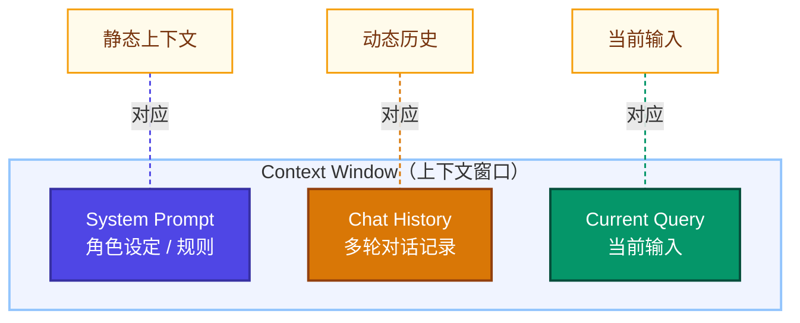

**关键限制**：当对话长度超过上下文窗口时，早期消息被截断丢失——这正是长期记忆必须存在的根本原因。

### 1.3 长期记忆的工作机制

长期记忆通过外部存储系统实现跨会话的信息保留。其核心流程为：

$$\text{信息} \xrightarrow{\text{编码（Encode）}} \text{存储（Store）} \xrightarrow{\text{检索（Retrieve）}} \text{注入上下文（Inject）} \xrightarrow{\text{应用（Apply）}}$$

**编码阶段**：将原始文本转化为向量嵌入（Embedding）或结构化数据  
**存储阶段**：持久化到向量数据库、关系型数据库或文件系统  
**检索阶段**：基于语义相似度或关键词匹配找到相关记忆  
**注入阶段**：将检索到的记忆注入新对话的上下文中

---

## 二、记忆类型体系全景

### 2.1 记忆四象限模型

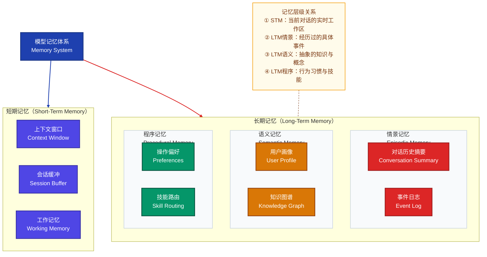

### 2.2 各记忆类型详解

#### 情景记忆（Episodic Memory）

存储具体的交互事件和对话片段，具有时序性。

- **典型内容**：「用户上周询问了 Python 异步编程」、「三天前完成了一份 PPT 修改任务」
- **存储形式**：带时间戳的对话摘要或关键节点记录
- **检索触发**：用户提及历史操作或需要上下文连贯性

#### 语义记忆（Semantic Memory）

存储抽象的事实、用户偏好和领域知识，无需绑定具体事件。

- **典型内容**：「用户是一名后端工程师」、「用户偏好简洁代码风格」、「用户母语是中文」
- **存储形式**：结构化的用户画像（JSON/YAML）或知识图谱节点
- **检索触发**：几乎每次对话开始时均加载

#### 程序记忆（Procedural Memory）

记录用户的操作习惯、工作流偏好和技能路由规则。

- **典型内容**：「用户总是先分析再行动」、「代码回复需要加注释」
- **存储形式**：规则列表或行为模板
- **检索触发**：任务类型匹配时加载对应流程

#### 工作记忆（Working Memory）

当前推理过程中的临时中间结果，类似 CPU 缓存。

- **典型内容**：Chain-of-Thought 的推理链、工具调用的中间输出
- **存储形式**：上下文窗口中的隐式状态
- **生命周期**：仅在单次推理过程中存在

---

## 三、记忆存储时机与触发条件

### 3.1 触发机制分类

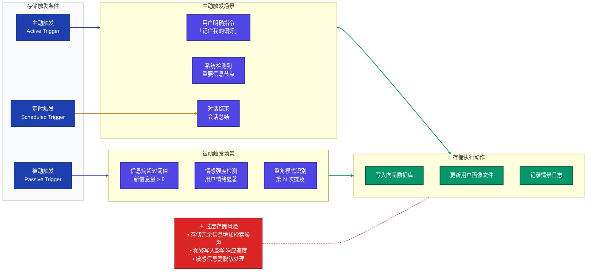

### 3.2 存储触发的判断逻辑

存储决策的核心是**信息价值评估函数**：

$$V(m) = \alpha \cdot \text{Novelty}(m) + \beta \cdot \text{Importance}(m) + \gamma \cdot \text{Frequency}(m) - \delta \cdot \text{Cost}(m)$$

其中：
- $\text{Novelty}(m)$：信息新颖度（与已存储内容的差异程度）
- $\text{Importance}(m)$：重要性评分（基于语义分析或用户显式标记）
- $\text{Frequency}(m)$：出现频率（多次提及意味着重要）
- $\text{Cost}(m)$：存储代价（时间、空间、检索噪声）
- $\alpha, \beta, \gamma, \delta$：权重超参数

当 $V(m) > \theta$（阈值）时，触发存储操作。

### 3.3 主动触发示例

```
用户：「记住，我是一名机器学习工程师，工作语言是 Python。」
↓
系统检测到明确的「记忆指令」关键词
↓
提取结构化信息：{role: "ML Engineer", language: "Python"}
↓
写入用户语义记忆：user_profile.json
```

### 3.4 被动触发示例

```
第1轮：用户提到「我在做推荐系统」
第3轮：用户再次提到「推荐系统的冷启动问题」
第5轮：用户问「协同过滤的实现」

→ 系统识别「推荐系统」主题频率 = 3（超过阈值 2）
→ 自动存储：{domain: "推荐系统", expertise_level: "中级"}
```

---

## 四、记忆读取时机与检索策略

### 4.1 检索时机决策树

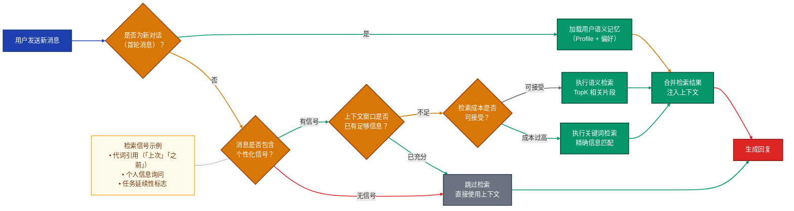

### 4.2 核心检索策略

#### 策略一：语义向量检索（Semantic Search）

将用户查询编码为向量，通过余弦相似度或内积计算找到最相关记忆：

$$\text{score}(q, m_i) = \frac{\vec{q} \cdot \vec{m_i}}{|\vec{q}| \cdot |\vec{m_i}|}$$

**优点**：模糊匹配、语义理解能力强  
**缺点**：精确关键词匹配能力弱，计算成本较高

#### 策略二：关键词过滤（Keyword Filter）

基于 BM25 或 TF-IDF 的传统信息检索：

$$\text{BM25}(q, d) = \sum_{t \in q} \text{IDF}(t) \cdot \frac{f(t,d) \cdot (k_1 + 1)}{f(t,d) + k_1 \cdot (1 - b + b \cdot \frac{|d|}{\text{avgdl}})}$$

**优点**：速度快、精确匹配强  
**缺点**：无法理解语义变体

#### 策略三：混合检索（Hybrid Retrieval）

结合语义检索和关键词过滤的 RRF（Reciprocal Rank Fusion）融合：

$$\text{RRF}(d) = \sum_{r \in R} \frac{1}{k + r(d)}$$

其中 $k = 60$（经验值），$r(d)$ 为文档 $d$ 在排序 $r$ 中的名次。

#### 策略四：时序加权检索（Temporal Weighted）

对近期记忆赋予更高权重：

$$\text{score\_final}(m_i) = \text{score\_semantic}(m_i) \cdot e^{-\lambda \cdot \Delta t}$$

其中 $\Delta t$ 为记忆创建时间距今的天数，$\lambda$ 为衰减系数。

### 4.3 检索结果排序与过滤

```python
# 伪代码：混合检索 + 时序加权的记忆检索器
def retrieve_memories(query: str, user_id: str, top_k: int = 5) -> list[Memory]:
    # Step 1: 向量检索
    semantic_results = vector_db.search(
        embedding=encode(query),
        filter={"user_id": user_id},
        top_k=top_k * 3  # 扩大候选集
    )
    
    # Step 2: 关键词过滤
    keyword_results = bm25_index.search(query, top_k=top_k * 3)
    
    # Step 3: RRF 融合排序
    fused_results = reciprocal_rank_fusion(semantic_results, keyword_results)
    
    # Step 4: 时序衰减加权
    for memory in fused_results:
        days_elapsed = (now() - memory.created_at).days
        memory.final_score *= exp(-0.05 * days_elapsed)
    
    # Step 5: 去重 + 选 TopK
    return deduplicate(sorted(fused_results, key=lambda x: x.final_score))[:top_k]
```

---

## 五、记忆全生命周期：一次对话的完整旅程

### 5.1 生命周期全景图

```mermaid
flowchart LR
    %% ── 配色定义 ────────────────────────────────────────────
    classDef phaseStyle    fill:#1e40af,stroke:#1e3a8a,stroke-width:2.5px,color:#fff
    classDef processStyle  fill:#4f46e5,stroke:#3730a3,stroke-width:2px,color:#fff
    classDef storeStyle    fill:#d97706,stroke:#92400e,stroke-width:2px,color:#fff
    classDef retrieveStyle fill:#059669,stroke:#064e3b,stroke-width:2px,color:#fff
    classDef endStyle      fill:#dc2626,stroke:#991b1b,stroke-width:2px,color:#fff
    classDef noteStyle     fill:#fffbeb,stroke:#f59e0b,stroke-width:1.5px,color:#78350f
    classDef layerStyle    fill:#f8fafc,stroke:#cbd5e0,stroke-width:1.5px

    subgraph Phase1["① 对话初始化"]
        direction TB
        P1A["加载 System Prompt<br>（角色设定）"]:::phaseStyle
        P1B["检索用户长期记忆<br>（Profile + 历史）"]:::retrieveStyle
        P1C["构建增强上下文<br>（记忆注入）"]:::processStyle
    end
    class Phase1 layerStyle

    subgraph Phase2["② 实时交互"]
        direction TB
        P2A["用户输入解析<br>意图识别"]:::phaseStyle
        P2B["工作记忆更新<br>（当前轮信息）"]:::processStyle
        P2C["条件触发检索<br>（按需补充）"]:::retrieveStyle
    end
    class Phase2 layerStyle

    subgraph Phase3["③ 回复生成"]
        direction TB
        P3A["上下文整合<br>（STM + 检索记忆）"]:::processStyle
        P3B["LLM 推理生成<br>（含记忆感知）"]:::phaseStyle
        P3C["输出质量评估<br>（一致性校验）"]:::processStyle
    end
    class Phase3 layerStyle

    subgraph Phase4["④ 记忆更新"]
        direction TB
        P4A["重要信息提取<br>（NER + 分类）"]:::storeStyle
        P4B["差异对比<br>（新信息 vs 已有）"]:::storeStyle
        P4C["写入长期存储<br>（向量库/文件）"]:::storeStyle
    end
    class Phase4 layerStyle

    subgraph Phase5["⑤ 会话终结"]
        direction TB
        P5A["全量对话摘要<br>（情景记忆归档）"]:::endStyle
        P5B["记忆元数据更新<br>（时间戳/访问频次）"]:::endStyle
        P5C["清理工作记忆<br>（上下文释放）"]:::endStyle
    end
    class Phase5 layerStyle

    Phase1 --> Phase2
    Phase2 --> Phase3
    Phase3 --> Phase4
    Phase4 --> Phase2
    Phase4 --> Phase5

    NOTE["关键设计要点<br>① Phase4→Phase2 形成实时记忆更新循环<br>② 每轮对话都可触发记忆读写<br>③ Phase5 的摘要是下次对话的种子"]:::noteStyle
    NOTE -.- Phase4

    %% 边索引：0-5，共 6 条
    linkStyle 0,1,2 stroke:#1e40af,stroke-width:2.5px
    linkStyle 3 stroke:#d97706,stroke-width:2px,stroke-dasharray:4 3
    linkStyle 4 stroke:#dc2626,stroke-width:2px
    linkStyle 5 stroke:#78350f,stroke-width:1px,stroke-dasharray:4 3
```

### 5.2 单轮对话的微观流程

以「用户询问推荐系统冷启动」为例：

| 时间点 | 系统动作 | 记忆操作 |
|--------|----------|----------|
| T+0ms | 接收用户消息 | 解析消息，识别「推荐系统」实体 |
| T+10ms | 检索语义记忆 | 查找历史：发现用户曾问过「协同过滤」 |
| T+25ms | 构建上下文 | 注入：「用户是ML工程师，关注推荐系统3次」 |
| T+500ms | LLM 生成回复 | 生成针对专业工程师的深度回答 |
| T+520ms | 提取新信息 | 识别新主题「冷启动」，评估存储价值 |
| T+530ms | 写入记忆 | 更新：{topic: "冷启动", mention_count: 1} |

---

## 六、多种场景剖析

### 场景一：用户编造多个身份时的记忆处理

#### 问题描述

用户在不同会话（甚至同一会话）中声称不同身份，例如：

- 第1轮：「我是一名医生，请帮我分析这份报告」
- 第5轮：「其实我是数据科学家，不是医生」
- 第9轮：「我只是个学生，帮我写作业」

#### 记忆冲突检测与处理流程

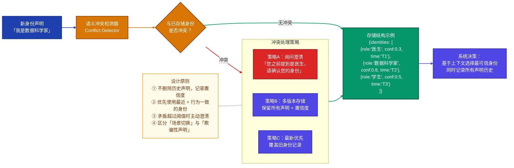

#### 推荐处理策略

**多版本存储 + 置信度加权**是最鲁棒的方案：

```json
{
  "user_id": "u001",
  "identity_history": [
    {"role": "医生", "confidence": 0.3, "timestamp": "2026-01-01", "evidence": "用户自述"},
    {"role": "数据科学家", "confidence": 0.8, "timestamp": "2026-01-02", "evidence": "问题内容+自述"},
    {"role": "学生", "confidence": 0.5, "timestamp": "2026-01-03", "evidence": "用户自述"}
  ],
  "active_identity": "数据科学家",
  "conflict_count": 2,
  "clarification_needed": true
}
```

---

### 场景二：用户要求「忘记」特定记忆

#### 问题描述

用户请求系统删除某段历史记忆，例如：「请忘记我之前说过的所有关于我公司的信息。」

#### 处理方案

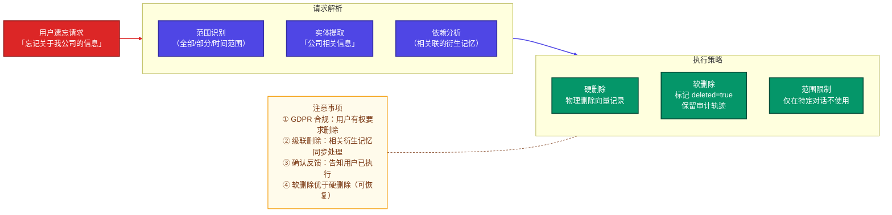

**关键实现细节**：

```python
def handle_forget_request(user_id: str, scope: str) -> ForgetResult:
    # 1. 解析遗忘范围
    target_memories = vector_db.search(
        query=scope,
        filter={"user_id": user_id},
        top_k=100  # 大范围候选
    )
    
    # 2. 软删除（推荐）：保留审计轨迹
    for memory in target_memories:
        memory.is_deleted = True
        memory.deleted_at = now()
        memory.deletion_reason = "user_request"
        vector_db.update(memory)
    
    # 3. 从检索索引中移除（不再被检索到）
    vector_db.remove_from_index([m.id for m in target_memories])
    
    return ForgetResult(deleted_count=len(target_memories), status="success")
```

---

### 场景三：长对话中的记忆压缩与遗忘

#### 问题描述

当对话长度接近上下文窗口上限时，需要对历史对话进行压缩，同时决定哪些信息值得保留到长期记忆。

#### 压缩策略对比

| 策略 | 原理 | 优点 | 缺点 | 适用场景 |
|------|------|------|------|----------|
| **滑动窗口** | 保留最近 N 轮 | 简单高效 | 丢失早期上下文 | 短期任务 |
| **递归摘要** | 将旧对话摘要化后压缩 | 保留语义 | 摘要可能失真 | 长期助手 |
| **重要性筛选** | 按信息价值保留关键片段 | 保真度高 | 计算复杂 | 高价值对话 |
| **外部记忆卸载** | 关键信息存入长期记忆 | 真正持久化 | 需额外基础设施 | 企业级产品 |

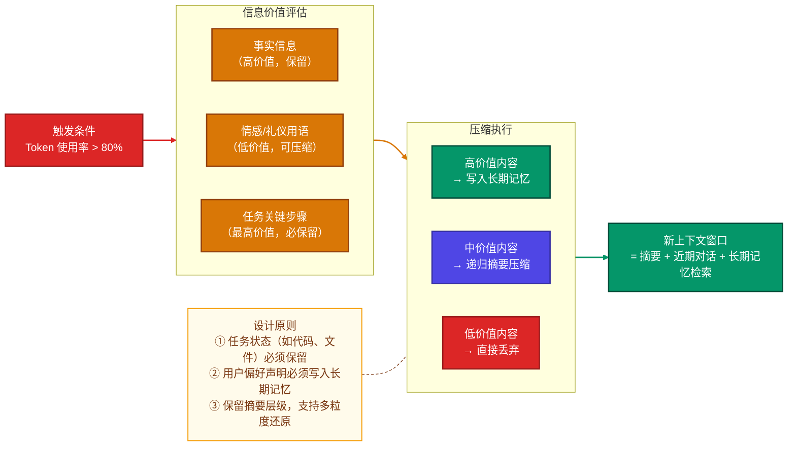

---

## 七、双系统架构对比：向量化 vs 文件化

### 7.1 架构全景对比图

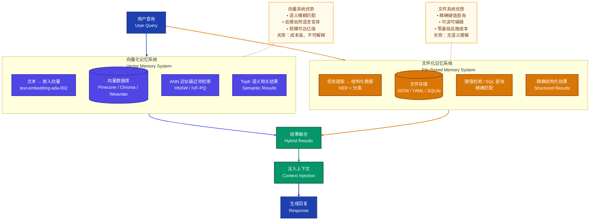

### 7.2 详细对比矩阵

| 对比维度 | 向量化系统 | 文件化系统 |
|----------|-----------|-----------|
| **检索方式** | 语义相似度（ANN） | 精确键值 / SQL |
| **查询语言** | 自然语言 | 结构化查询 |
| **更新粒度** | 向量级别（重新嵌入） | 字段级别（原地修改） |
| **存储成本** | 高（向量 + 元数据） | 低（纯文本/JSON） |
| **基础设施** | 需向量数据库服务 | 本地文件系统即可 |
| **可解释性** | 低（黑盒检索） | 高（人可直接阅读） |
| **扩展性** | 亿级别 | 万级别（超过性能下降） |
| **适合记忆类型** | 情景记忆、自由文本 | 语义记忆、结构化画像 |
| **延迟** | 10-100ms（含嵌入） | 1-10ms |
| **典型实现** | LangChain Memory + Pinecone | mem0 文件后端 / 自定义 JSON |

### 7.3 混合架构推荐方案

实际生产系统中，**向量化 + 文件化的混合架构**是最优解：

```
┌─────────────────────────────────────────────────┐
│              混合记忆架构                         │
│                                                   │
│  结构化层（文件化）          语义层（向量化）       │
│  ┌──────────────────┐      ┌──────────────────┐  │
│  │ user_profile.json│      │ episode_vectors  │  │
│  │ preferences.yaml │  +   │ (Chroma/Pinecone)│  │
│  │ skills_log.json  │      │ summary_vectors  │  │
│  └──────────────────┘      └──────────────────┘  │
│         ↓                          ↓              │
│  ┌──────────────────────────────────────────┐    │
│  │         统一检索接口 (Unified API)         │    │
│  │  retrieve(query, user_id, memory_types)  │    │
│  └──────────────────────────────────────────┘    │
└─────────────────────────────────────────────────┘
```

---

## 八、模型记忆的原理及其应用方法

### 8.1 核心原理

#### 原理一：RAG 增强记忆（Retrieval-Augmented Generation）

将外部记忆库与 LLM 推理过程结合：

$$\text{P}(y | x) = \text{P}_{LLM}(y | x, \text{Retrieve}(x, \mathcal{M}))$$

其中 $\mathcal{M}$ 为记忆库，$\text{Retrieve}$ 为检索函数。

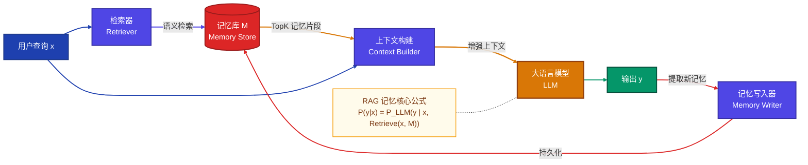

#### 原理二：记忆嵌入（Memory Embedding）

文本记忆通过预训练编码器转化为高维向量：

$$\vec{m} = \text{Encoder}(t_m) \in \mathbb{R}^d$$

相似度计算：

$$\text{sim}(q, m) = \frac{\vec{q} \cdot \vec{m}}{|\vec{q}| \cdot |\vec{m}|} \in [-1, 1]$$

当 $\text{sim}(q, m) > \theta$ 时，记忆 $m$ 被视为相关记忆并注入上下文。

#### 原理三：记忆蒸馏（Memory Distillation）

通过摘要和抽象将原始对话压缩为高价值记忆：

$$m^* = \text{Summarize}(d_{1:T}) \quad \text{s.t.} \quad \text{Info}(m^*) \approx \text{Info}(d_{1:T})$$

### 8.2 应用方法与示例

#### 应用场景一：个性化助手

**目标**：让助手记住用户偏好，提供个性化回复

**实现步骤**：
1. 会话开始时加载用户 Profile
2. 对话中实时提取偏好信息
3. 会话结束后更新 Profile

**示例**：

```
[第一次对话 - 1月1日]
用户：帮我写一个快速排序算法
助手：[生成 Python 代码，添加详细注释]
→ 系统记录：{language: "Python", style: "注释详细"}

[第二次对话 - 1月15日]  
用户：帮我实现二叉树遍历
→ 系统加载记忆：用户偏好 Python + 详细注释
助手：[自动使用 Python，添加详细注释，无需用户再次说明]
```

#### 应用场景二：多会话任务追踪

**目标**：在多次对话中持续跟踪一个长期项目

```
[对话1 - 需求分析]
用户：帮我设计一个电商网站的数据库
助手：[设计 ER 图，确定表结构]
→ 记忆存储：{project: "电商网站", phase: "数据库设计", tables: [...]}

[对话2 - 三天后]
用户：继续上次的项目
→ 系统检索：找到 "电商网站" 相关记忆
助手：「上次我们完成了数据库ER图设计，包含用户表、商品表等。
      今天我们要继续哪个部分？」
```

#### 应用场景三：情感记忆与关系建立

```
[对话1]
用户：今天面试失败了，很沮丧
→ 记忆：{event: "面试失败", emotion: "沮丧", date: "2026-01-01"}

[对话30 - 一个月后]
用户：我终于找到工作了！
→ 系统检索：发现一个月前的面试失败记录
助手：「太棒了！我记得一个月前你面试受挫，那段时间一定很难熬。
      恭喜你坚持下来，这个结果是对你努力的最好回报！」
```

---

## 九、常见问题及解决方案

### 9.1 记忆幻觉（Memory Hallucination）

**问题**：模型错误地「记住」了从未发生过的信息，或将相似用户的记忆混用。

**根本原因**：
- 嵌入向量相似度阈值设置过低，检索到不相关记忆
- 缺少严格的用户隔离（记忆命名空间混用）
- 摘要生成时引入了不存在的细节

**解决方案**：

| 措施 | 具体实现 |
|------|----------|
| 提高检索阈值 | 将余弦相似度阈值从 0.7 提升至 0.85 |
| 用户命名空间隔离 | 所有记忆索引必须携带 `user_id` 过滤 |
| 来源标注 | 每条记忆记录原始对话 ID，支持溯源验证 |
| 置信度显示 | 低置信度记忆注入时添加不确定性声明 |

```python
# 防止记忆幻觉：严格的用户隔离 + 阈值过滤
def safe_retrieve(query: str, user_id: str) -> list[Memory]:
    results = vector_db.search(
        embedding=encode(query),
        filter={"user_id": user_id},  # 强制用户隔离
        score_threshold=0.85,          # 高阈值过滤
        top_k=5
    )
    # 验证每条记忆的来源
    return [m for m in results if m.source_user_id == user_id]
```

---

### 9.2 记忆过载（Memory Overload）

**问题**：随着时间推移，记忆库不断膨胀，导致检索噪声增大、响应变慢。

**解决方案**：

**定期记忆整合（Memory Consolidation）**

```python
def consolidate_memories(user_id: str, days_threshold: int = 30):
    """合并旧记忆，压缩低价值记忆"""
    old_memories = db.get_memories(
        user_id=user_id,
        older_than_days=days_threshold,
        min_access_count=0  # 从未被访问的记忆
    )
    
    # 聚类相似记忆
    clusters = cluster_by_topic(old_memories)
    
    for cluster in clusters:
        # 生成聚类摘要，替换原始条目
        summary = llm.summarize(cluster.memories)
        db.replace_cluster_with_summary(cluster.ids, summary)
```

**记忆 TTL（Time-to-Live）策略**：

$$\text{TTL}(m) = \text{base\_ttl} \times \text{access\_freq}(m) \times \text{importance}(m)$$

| 记忆类型 | 基础 TTL | 重要性系数 |
|----------|---------|----------|
| 用户画像 | 永久 | 1.0 |
| 对话摘要 | 180天 | 0.5-1.0 |
| 任务记录 | 90天 | 0.3-0.8 |
| 闲聊记录 | 30天 | 0.1-0.3 |

---

### 9.3 隐私泄露与记忆安全

**问题**：敏感信息（密码、身份证号、医疗信息）被不当存储或泄露。

**防护措施**：

```python
# 敏感信息检测与脱敏
SENSITIVE_PATTERNS = {
    "phone": r"1[3-9]\d{9}",
    "id_card": r"\d{18}",
    "credit_card": r"\d{4}[\s-]?\d{4}[\s-]?\d{4}[\s-]?\d{4}",
    "password": r"(?i)(password|passwd|pwd)\s*[:=]\s*\S+"
}

def sanitize_before_store(text: str) -> str:
    """存储前脱敏处理"""
    for category, pattern in SENSITIVE_PATTERNS.items():
        text = re.sub(pattern, f"[REDACTED_{category.upper()}]", text)
    return text

def check_pii_before_store(memory: Memory) -> bool:
    """PII 检测：包含敏感信息则拒绝存储"""
    return not any(re.search(p, memory.content) 
                   for p in SENSITIVE_PATTERNS.values())
```

---

### 9.4 记忆一致性冲突

**问题**：同一用户在不同时间点提供了矛盾的信息，新旧记忆冲突。

**解决方案：CRDT（Conflict-free Replicated Data Type）思想**

对每条记忆维护版本向量和时间戳，采用「最后写入胜出（LWW）」或「人工仲裁」策略：

```python
class Memory:
    content: str
    created_at: datetime
    updated_at: datetime
    version: int
    confidence: float  # 置信度 0.0-1.0
    
    def update(self, new_content: str, new_confidence: float):
        """更新记忆，保留历史版本"""
        self.history.append({
            "content": self.content,
            "version": self.version,
            "timestamp": self.updated_at
        })
        self.content = new_content
        self.confidence = new_confidence
        self.version += 1
        self.updated_at = now()
```

---

### 9.5 检索延迟过高

**问题**：在响应延迟敏感的场景中，记忆检索引入了不可接受的延迟。

**优化策略**：

| 优化手段 | 效果 | 实现复杂度 |
|----------|------|----------|
| **预加载缓存** | 对话开始时批量加载用户画像 | 低 |
| **异步检索** | 检索与用户输入解析并行执行 | 中 |
| **记忆分层** | 热记忆（Redis）+ 冷记忆（向量库） | 高 |
| **近似检索** | HNSW 代替精确 ANN，速度提升 10x | 低 |
| **记忆压缩** | 减少候选记忆数量 | 中 |

---

## 十、注意事项

### 10.1 记忆设计的核心原则

```mermaid
flowchart TB
    %% ── 配色定义 ────────────────────────────────────────────
    classDef principleStyle fill:#1e40af,stroke:#1e3a8a,stroke-width:2px,color:#fff
    classDef detailStyle    fill:#4f46e5,stroke:#3730a3,stroke-width:2px,color:#fff
    classDef warnStyle      fill:#dc2626,stroke:#991b1b,stroke-width:2px,color:#fff
    classDef goodStyle      fill:#059669,stroke:#064e3b,stroke-width:2px,color:#fff
    classDef noteStyle      fill:#fffbeb,stroke:#f59e0b,stroke-width:1.5px,color:#78350f
    classDef layerStyle     fill:#f8fafc,stroke:#cbd5e0,stroke-width:1.5px

    ROOT["记忆设计核心原则"]:::principleStyle

    subgraph Privacy["隐私安全"]
        direction TB
        PR1["最小化存储原则<br>只存必要信息"]:::goodStyle
        PR2["明确告知用户<br>哪些信息被记忆"]:::goodStyle
        PR3["提供遗忘机制<br>用户可清除记忆"]:::goodStyle
    end
    class Privacy layerStyle

    subgraph Accuracy["准确性"]
        direction TB
        AC1["来源可追溯<br>每条记忆带源头标注"]:::detailStyle
        AC2["置信度加权<br>避免低质量记忆误导"]:::detailStyle
        AC3["定期验证<br>主动确认关键记忆"]:::detailStyle
    end
    class Accuracy layerStyle

    subgraph Performance["性能"]
        direction TB
        PF1["分层存储<br>热/冷数据分离"]:::detailStyle
        PF2["异步写入<br>不阻塞主流程"]:::detailStyle
        PF3["记忆压缩<br>定期整合冗余"]:::detailStyle
    end
    class Performance layerStyle

    subgraph Robustness["鲁棒性"]
        direction TB
        RB1["冲突处理机制<br>多版本+置信度"]:::warnStyle
        RB2["降级策略<br>记忆服务故障时的回退"]:::warnStyle
        RB3["用户隔离<br>严格的命名空间隔离"]:::warnStyle
    end
    class Robustness layerStyle

    ROOT --> Privacy
    ROOT --> Accuracy
    ROOT --> Performance
    ROOT --> Robustness

    %% 边索引：0-3，共 4 条
    linkStyle 0 stroke:#059669,stroke-width:2px
    linkStyle 1 stroke:#4f46e5,stroke-width:2px
    linkStyle 2 stroke:#4f46e5,stroke-width:2px
    linkStyle 3 stroke:#dc2626,stroke-width:2px
```

### 10.2 关键注意事项清单

#### 存储阶段注意事项

- **不要存储原始敏感信息**：密码、银行卡号、身份证等必须在存储前脱敏或拒绝存储
- **不要无差别存储所有对话**：只存储有价值的信息，避免噪声污染记忆库
- **注意记忆老化问题**：用户情况随时间变化，过时记忆可能误导模型（如职业变更）
- **设置合理的记忆容量上限**：防止单用户记忆无限增长导致检索性能下降

#### 检索阶段注意事项

- **始终验证用户 ID**：任何检索操作必须带 `user_id` 过滤，防止跨用户泄露
- **设置合理的相似度阈值**：过低阈值会引入无关记忆（幻觉风险），过高则漏掉相关记忆
- **注意检索结果的时效性**：优先使用近期记忆，对过时记忆降权
- **避免检索结果冗余**：对语义相近的结果去重，防止同一信息重复注入占用 Token

#### 注入阶段注意事项

- **记忆注入要有明确的位置标记**：告知模型哪些是记忆信息（防止模型与上下文混淆）
- **控制注入量**：记忆注入不应超过上下文窗口的 20-30%，保留足够空间给当前对话
- **注入时注明记忆来源和时间**：帮助模型判断记忆的可信度和时效性

#### 更新阶段注意事项

- **采用异步更新**：记忆写入应在回复生成后异步执行，不影响响应速度
- **实现幂等性**：同一信息多次写入不应产生重复记忆条目
- **记录更新历史**：保留记忆的修改历史，支持回滚和审计

---

## 十一、完整的模型记忆流程

### 11.1 端到端流程架构图

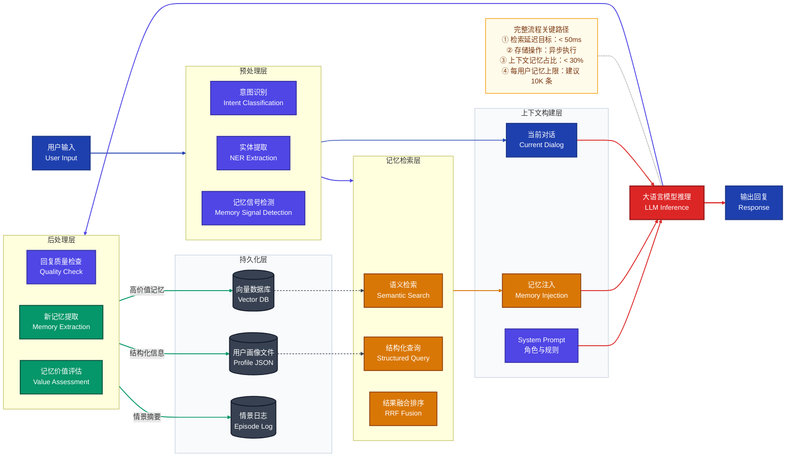

### 11.2 完整流程代码示例

以下是一个生产级记忆系统的完整实现骨架：

```python
from dataclasses import dataclass, field
from datetime import datetime
from typing import Optional
import json

# ── 数据结构定义 ────────────────────────────────────────────────

@dataclass
class Memory:
    id: str
    user_id: str
    content: str
    memory_type: str  # "episodic" | "semantic" | "procedural"
    confidence: float
    created_at: datetime
    last_accessed: datetime
    access_count: int = 0
    is_deleted: bool = False
    metadata: dict = field(default_factory=dict)


@dataclass
class ConversationContext:
    user_id: str
    session_id: str
    messages: list[dict]
    injected_memories: list[Memory]
    system_prompt: str


# ── 核心记忆管理器 ────────────────────────────────────────────────

class MemoryManager:
    def __init__(self, vector_db, file_store, llm_client):
        self.vector_db = vector_db
        self.file_store = file_store
        self.llm = llm_client

    # ── Step 1: 初始化对话上下文（记忆加载） ──────────────────────
    def initialize_context(self, user_id: str, first_message: str) -> ConversationContext:
        # 1a. 加载结构化用户画像（文件化）
        profile = self.file_store.load_profile(user_id)
        
        # 1b. 语义检索相关情景记忆（向量化）
        relevant_memories = self.retrieve_memories(
            query=first_message,
            user_id=user_id,
            top_k=5
        )
        
        # 1c. 构建增强 System Prompt
        system_prompt = self._build_system_prompt(profile, relevant_memories)
        
        return ConversationContext(
            user_id=user_id,
            session_id=generate_session_id(),
            messages=[],
            injected_memories=relevant_memories,
            system_prompt=system_prompt
        )

    # ── Step 2: 记忆检索 ───────────────────────────────────────────
    def retrieve_memories(
        self, query: str, user_id: str, top_k: int = 5
    ) -> list[Memory]:
        # 向量检索
        semantic_results = self.vector_db.search(
            embedding=self._encode(query),
            filter={"user_id": user_id, "is_deleted": False},
            top_k=top_k * 3
        )
        # 时序加权
        for m in semantic_results:
            days = (datetime.now() - m.created_at).days
            m.score *= (0.95 ** days)  # 5% 日衰减
        
        # 排序 + TopK
        results = sorted(semantic_results, key=lambda x: x.score, reverse=True)[:top_k]
        
        # 更新访问记录
        for m in results:
            m.last_accessed = datetime.now()
            m.access_count += 1
            self.vector_db.update(m)
        
        return results

    # ── Step 3: 生成回复（记忆感知推理） ───────────────────────────
    def generate_response(
        self, context: ConversationContext, user_message: str
    ) -> str:
        # 追加用户消息
        context.messages.append({"role": "user", "content": user_message})
        
        # 构建完整消息列表
        messages = [
            {"role": "system", "content": context.system_prompt}
        ] + context.messages
        
        # LLM 推理
        response = self.llm.chat(messages)
        context.messages.append({"role": "assistant", "content": response})
        
        # 异步触发记忆更新（不阻塞主流程）
        self._async_update_memory(context, user_message, response)
        
        return response

    # ── Step 4: 记忆提取与存储 ─────────────────────────────────────
    def _extract_and_store_memories(
        self, user_id: str, user_message: str, assistant_response: str
    ):
        # 使用 LLM 提取新记忆
        extraction_prompt = f"""
从以下对话中提取值得长期记忆的信息，以JSON格式输出：
用户：{user_message}
助手：{assistant_response}

输出格式：
{{"memories": [{{"content": "...", "type": "semantic/episodic/procedural", "confidence": 0.0-1.0}}]}}
        """
        extracted = json.loads(self.llm.complete(extraction_prompt))
        
        for item in extracted.get("memories", []):
            # 价值评估
            if item["confidence"] < 0.6:
                continue  # 低置信度不存储
            
            # 敏感信息检测
            if self._contains_pii(item["content"]):
                item["content"] = self._sanitize(item["content"])
            
            # 重复检测
            if self._is_duplicate(user_id, item["content"]):
                continue
            
            # 写入存储
            memory = Memory(
                id=generate_id(),
                user_id=user_id,
                content=item["content"],
                memory_type=item["type"],
                confidence=item["confidence"],
                created_at=datetime.now(),
                last_accessed=datetime.now()
            )
            
            if item["type"] == "semantic":
                self.file_store.update_profile(user_id, memory)
            else:
                self.vector_db.insert(memory)

    # ── Step 5: 会话结束处理 ───────────────────────────────────────
    def finalize_session(self, context: ConversationContext):
        # 生成全量对话摘要
        summary = self.llm.summarize(context.messages)
        
        # 存储情景记忆
        episode_memory = Memory(
            id=generate_id(),
            user_id=context.user_id,
            content=summary,
            memory_type="episodic",
            confidence=0.9,
            created_at=datetime.now(),
            last_accessed=datetime.now(),
            metadata={"session_id": context.session_id, "message_count": len(context.messages)}
        )
        self.vector_db.insert(episode_memory)
        
        # 清理工作记忆（上下文）
        context.messages.clear()
        context.injected_memories.clear()

    # ── 辅助方法 ─────────────────────────────────────────────────
    def _build_system_prompt(self, profile: dict, memories: list[Memory]) -> str:
        memory_text = "\n".join([f"- {m.content}" for m in memories])
        return f"""你是一个有记忆能力的个人助手。

用户画像：
{json.dumps(profile, ensure_ascii=False, indent=2)}

相关历史记忆：
{memory_text}

请基于以上记忆为用户提供个性化的回复。"""

    def _encode(self, text: str) -> list[float]:
        return self.llm.embed(text)

    def _contains_pii(self, text: str) -> bool:
        import re
        patterns = [r"1[3-9]\d{9}", r"\d{18}", r"\d{16}"]
        return any(re.search(p, text) for p in patterns)

    def _sanitize(self, text: str) -> str:
        import re
        text = re.sub(r"1[3-9]\d{9}", "[手机号]", text)
        text = re.sub(r"\d{18}", "[身份证号]", text)
        return text

    def _is_duplicate(self, user_id: str, content: str) -> bool:
        results = self.vector_db.search(
            embedding=self._encode(content),
            filter={"user_id": user_id},
            top_k=1
        )
        return results and results[0].score > 0.95
    
    def _async_update_memory(self, context, user_message, response):
        import threading
        thread = threading.Thread(
            target=self._extract_and_store_memories,
            args=(context.user_id, user_message, response)
        )
        thread.daemon = True
        thread.start()
```

### 11.3 完整对话示例

**场景**：用户是一名 ML 工程师，正在进行第三次对话

```
━━━━━━━━━━━━━━━━━━━━━━━━━━━━━━━━━━━━━━━━━━━━━━━━━━━
【系统后台：第三次对话初始化】

加载用户画像（文件化存储）：
{
  "user_id": "u001",
  "name": "张工",
  "occupation": "ML Engineer",
  "preferred_language": "Python",
  "expertise_level": "senior",
  "code_style": "详细注释"
}

检索相关情景记忆（向量检索）：
- [记忆1, 相似度0.91] 上次对话中实现了推荐系统的召回层（ALS算法）
- [记忆2, 相似度0.87] 用户在使用 PyTorch + CUDA 11.8 环境

构建 System Prompt：
「你是张工的技术助手。张工是一名高级ML工程师，
 使用Python，上次正在实现推荐系统...」
━━━━━━━━━━━━━━━━━━━━━━━━━━━━━━━━━━━━━━━━━━━━━━━━━━━

用户：继续上次的推荐系统，现在要实现排序层

助手：好的，张工！上次我们完成了基于 ALS 的召回层实现。
     现在进入排序层，在您的 PyTorch + CUDA 11.8 环境下，
     我推荐使用 LightGBM 或 Wide & Deep 模型...
     
     [提供针对高级工程师的深度代码实现，带详细注释]

━━━━━━━━━━━━━━━━━━━━━━━━━━━━━━━━━━━━━━━━━━━━━━━━━━━
【系统后台：异步记忆更新】
提取新记忆：
- "用户正在实现推荐系统的排序层，使用 Wide & Deep 模型"
- 置信度: 0.88 → 写入向量数据库
更新画像：last_topic = "推荐系统排序层"
━━━━━━━━━━━━━━━━━━━━━━━━━━━━━━━━━━━━━━━━━━━━━━━━━━━
```

---

## 十二、面试常见问题 FAQ

### 基础原理类

---

**Q1：什么是模型记忆？它与上下文窗口有什么区别？**

**A**：模型记忆是指 AI 系统在多次对话或跨会话场景中保留和利用历史信息的能力。

**上下文窗口**是模型的短期记忆，是一次推理中所有输入 Token 的总和（包括系统提示、对话历史、当前输入），其大小受模型架构限制（如 GPT-4 的 128K Token）。当对话结束，上下文窗口清空，信息完全丢失。

**模型记忆**是通过外部存储系统实现的长期记忆，可以跨会话持久保存。两者关系为：

$$\text{有效信息} = \text{上下文窗口（短期）} + \text{检索记忆（长期）}$$

| 维度 | 上下文窗口 | 长期记忆 |
|------|-----------|---------|
| 持久性 | 会话内 | 跨会话永久 |
| 容量 | 有限（Token上限） | 理论无限 |
| 访问方式 | 直接 | 需检索 |

---

**Q2：向量数据库在记忆系统中扮演什么角色？如何工作？**

**A**：向量数据库是长期记忆系统的核心存储引擎，负责存储和检索记忆的语义向量表示。

**工作原理**：

1. **存储阶段**：将记忆文本通过嵌入模型（如 `text-embedding-ada-002`）转化为高维向量（通常 768-3072 维），连同元数据（用户ID、时间戳等）存入数据库

2. **检索阶段**：将用户查询同样编码为向量，通过 ANN（近似最近邻）算法（如 HNSW）在向量空间中找到余弦相似度最高的 TopK 记忆

$$\text{similarity}(q, m) = \frac{\vec{q} \cdot \vec{m}}{|\vec{q}||\vec{m}|}$$

**常见实现**：Pinecone（云端）、Chroma（本地）、Weaviate（混合）、Milvus（高性能）

---

**Q3：如何防止记忆幻觉（Memory Hallucination）？**

**A**：记忆幻觉主要来自三个来源：检索噪声、用户隔离失效、摘要失真。预防措施：

1. **提高检索阈值**：将余弦相似度阈值设置为 ≥ 0.85（而非默认的 0.7）
2. **强制用户隔离**：所有检索操作必须携带 `user_id` 过滤条件，防止跨用户记忆污染
3. **置信度标注**：低置信度记忆在注入时附加不确定性声明（「您曾提到...，但我不完全确定」）
4. **来源溯源**：每条记忆记录来源对话ID，支持验证
5. **摘要质量控制**：对生成的摘要进行事实一致性检验（通过 LLM 自我验证）

---

**Q4：RAG 记忆与 Fine-tuning 记忆有什么本质区别？**

**A**：这是两种根本不同的记忆实现路径：

| 维度 | RAG 记忆 | Fine-tuning 记忆 |
|------|---------|----------------|
| **存储位置** | 外部数据库 | 模型权重参数 |
| **更新成本** | 低（直接写入） | 高（需重新训练） |
| **更新频率** | 实时 | 离线批量 |
| **可解释性** | 高（可查看原文） | 低（黑盒权重） |
| **隐私风险** | 中（外部存储可控） | 高（信息编码于权重难以删除） |
| **遗忘能力** | 容易（删除记录） | 困难（灾难性遗忘问题） |
| **适用场景** | 个人化、实时更新 | 领域知识、通用能力 |

**实际系统**通常两者结合：Fine-tuning 注入领域知识，RAG 提供个性化和实时信息。

---

**Q5：什么是记忆的冷启动问题？如何解决？**

**A**：**冷启动问题**指新用户没有任何历史记忆，系统无法提供个性化服务的困境。

**解决方案**：

1. **显式引导**：在初次对话时主动询问用户偏好
   ```
   「欢迎！为了更好地为您服务，能告诉我您的职业和主要使用场景吗？」
   ```

2. **隐式推断**：从用户的首次查询中推断基本信息（如提问语言 → 母语；技术深度 → 专业程度）

3. **群体协同**：基于相似用户的记忆作为初始参考（需隐私处理）

4. **渐进式学习**：前3-5轮对话快速建立基础 Profile，逐步丰富记忆

---

**Q6：如何评估记忆系统的效果？有哪些关键指标？**

**A**：记忆系统的评估维度包括：

| 指标类别 | 具体指标 | 计算方法 |
|---------|---------|---------|
| **检索质量** | Recall@K | 相关记忆在 TopK 中的召回率 |
| **检索质量** | MRR | 第一个相关记忆的排名倒数均值 |
| **响应质量** | 个性化得分 | 人工评估记忆利用的准确性 |
| **系统性能** | P99 延迟 | 99%请求的检索延迟 |
| **存储效率** | 记忆利用率 | 被检索到的记忆占总记忆的比例 |
| **一致性** | 矛盾率 | 注入记忆与上下文矛盾的比例 |

---

**Q7：记忆系统如何处理 GDPR 等数据隐私法规？**

**A**：GDPR 合规要求记忆系统实现以下能力：

1. **数据最小化**：只收集服务所必需的最少信息
2. **明确同意**：用户必须明确授权记忆功能（可选择退出）
3. **访问权**：用户可随时查看自己的所有记忆数据
4. **删除权（被遗忘权）**：
   - 提供 `/forget` 接口支持用户请求删除
   - 软删除 + 定期硬删除（推荐30天缓冲期）
   - 级联删除：删除相关衍生记忆
5. **数据可移植**：支持用户导出自己的记忆数据（JSON格式）
6. **安全存储**：记忆数据加密存储，严格访问控制

---

**Q8：多智能体系统中，记忆如何共享与隔离？**

**A**：多 Agent 系统的记忆架构设计是核心挑战：

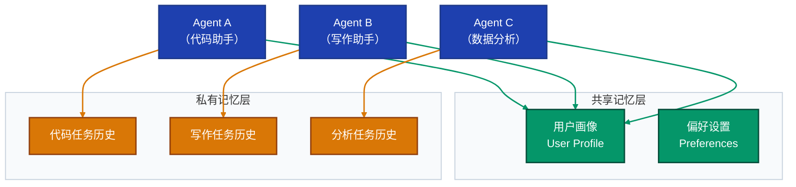

**设计原则**：
- **共享层**：用户 Profile、偏好、全局知识 → 所有 Agent 可读
- **私有层**：每个 Agent 维护领域专属的任务历史 → 隔离存储
- **通信层**：Agent 间通过结构化消息传递记忆，而非直接共享存储
- **权限控制**：Agent A 不能写入 Agent B 的私有记忆

---

**Q9：如何解决记忆检索的「语义漂移」问题？**

**A**：**语义漂移**指用户用不同表达方式描述同一概念，导致检索遗漏。例如：「机器学习」vs「ML」vs「人工智能训练」。

**解决方案**：

1. **查询扩展（Query Expansion）**：
   ```python
   # 使用 LLM 生成查询的多个变体
   variants = llm.expand_query("机器学习工程师")
   # 输出: ["ML工程师", "AI工程师", "人工智能工程师", "深度学习工程师"]
   ```

2. **同义词字典**：维护领域同义词映射（专业术语 ↔ 通俗表达）

3. **多向量存储**：对同一记忆存储多个角度的嵌入（内容嵌入 + 关键词嵌入）

4. **HyDE（假设文档嵌入）**：先让 LLM 生成一个假设的理想答案，用该答案的嵌入来检索，而非用原始查询

---

**Q10：记忆系统在生产环境中最常见的性能瓶颈是什么？如何优化？**

**A**：生产环境中最常见的三大瓶颈及优化方案：

**瓶颈一：Embedding 计算延迟（30-100ms）**

$$\text{优化}：\begin{cases} \text{缓存常用查询的 Embedding} \\ \text{使用更小的嵌入模型（如 text-embedding-3-small）} \\ \text{批量预计算用户画像的 Embedding} \end{cases}$$

**瓶颈二：向量检索延迟（10-50ms at scale）**

$$\text{优化}：\begin{cases} \text{HNSW 索引参数调优（ef\_search, M 值）} \\ \text{按用户分片（Sharding）减少检索范围} \\ \text{多级缓存：Redis 缓存热点记忆} \end{cases}$$

**瓶颈三：记忆库规模膨胀导致精度下降**

$$\text{优化}：\begin{cases} \text{定期记忆整合（聚类 + 摘要压缩）} \\ \text{TTL 策略淘汰低价值旧记忆} \\ \text{分级存储：热/温/冷记忆分层} \end{cases}$$

---

> **文档结束语**
>
> 模型记忆技术是构建真正「有温度」的 AI 助手的核心基础设施。从短期的上下文窗口到长期的向量存储，从精确的文件化系统到语义丰富的向量化系统，每一个设计决策都在精确度、隐私、性能和用户体验之间寻求最优平衡。
>
> 随着大模型上下文窗口不断扩展（从 4K 到 2M Token），短期记忆与长期记忆的边界正在模糊——但外部记忆系统的核心价值（持久性、可编辑性、隐私控制）始终不会被纯粹的上下文扩展所取代。

---

*本文档基于截至 2026 年 3 月的公开技术资料整理，核心技术参考：LangChain Memory、mem0、MemGPT、GraphRAG 等开源项目。*
