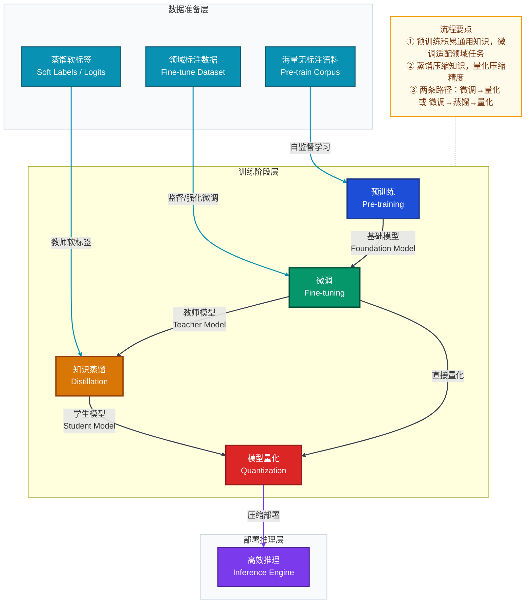
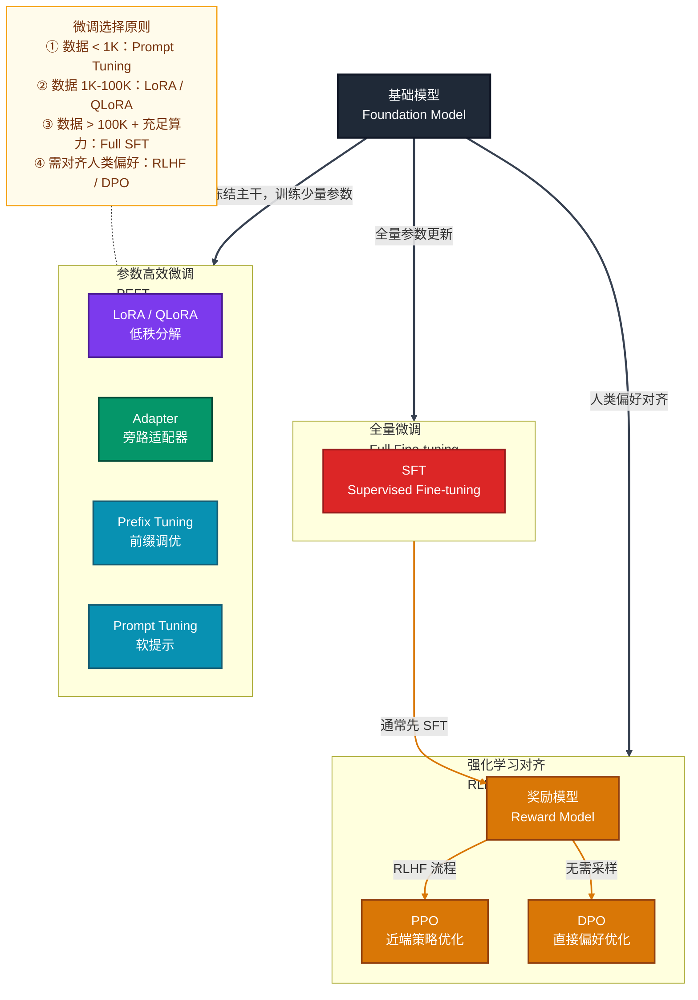
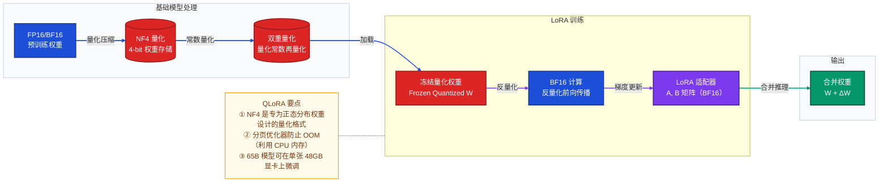
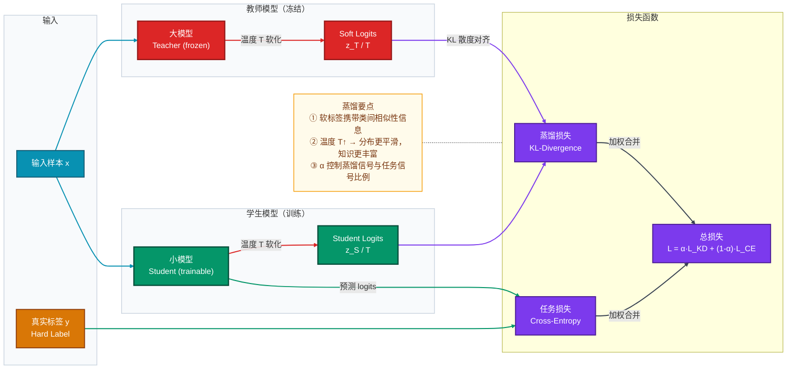
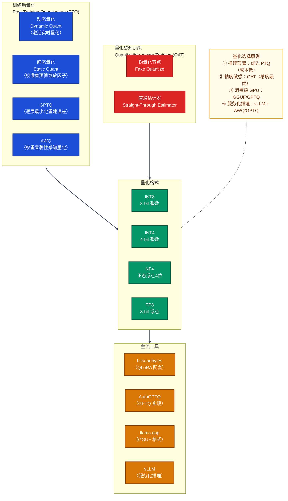
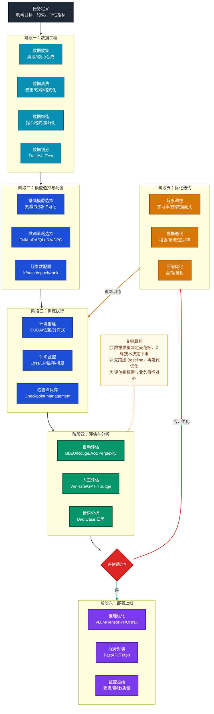
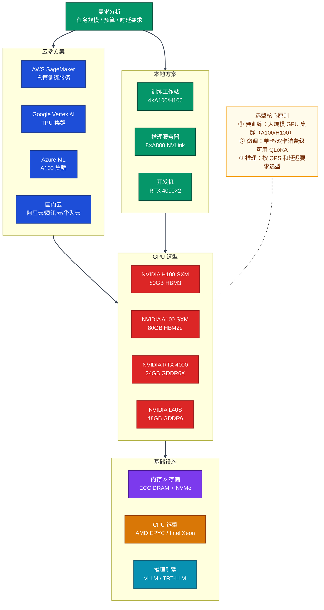

# 模型调优完全指南：预训练 → 微调 → 蒸馏 → 量化与硬件环境

> **目标读者**：AI/ML 工程师、算法研究员、面试备考者  
> **适用场景**：大语言模型（LLM）/ 视觉模型的工程落地与面试准备  
> **数学公式约定**：行内公式使用 `$...$`，块级公式使用 `$$...$$`

---

## 目录

1. [核心概念总览](#1-核心概念总览)
2. [预训练（Pre-training）](#2-预训练pre-training)
3. [微调（Fine-tuning）](#3-微调fine-tuning)
4. [知识蒸馏（Knowledge Distillation）](#4-知识蒸馏knowledge-distillation)
5. [模型量化（Quantization）](#5-模型量化quantization)
6. [完整调优流程](#6-完整调优流程)
7. [常见问题与解决方案](#7-常见问题与解决方案)
8. [注意事项](#8-注意事项)
9. [硬件环境选择](#9-硬件环境选择)
10. [面试常见问题 FAQ](#10-面试常见问题-faq)

---

## 1. 核心概念总览

### 1.1 四大阶段关系



### 1.2 各阶段核心对比

| 阶段 | 目标 | 数据规模 | 计算量 | 输出 |
|------|------|----------|--------|------|
| **预训练** | 学习通用语言/视觉表征 | TB 级语料 | 极大（万卡·天） | 基础模型 |
| **微调** | 适配下游特定任务 | MB～GB 级标注数据 | 中等（单卡·小时） | 任务模型 |
| **蒸馏** | 压缩模型，保留性能 | 与微调相当或更多 | 中等 | 轻量模型 |
| **量化** | 降低精度，减少内存 | 少量校准数据 | 小 | 压缩模型 |

---

## 2. 预训练（Pre-training）

### 2.1 原理

预训练的本质是在大规模无标注数据上学习通用表征。核心思想：**用自监督任务迫使模型理解数据的内在结构**。

#### 2.1.1 语言模型预训练目标

**自回归语言模型（GPT 系列）**——Next Token Prediction：

$$\mathcal{L}_{AR} = -\sum_{t=1}^{T} \log P(x_t \mid x_1, x_2, \ldots, x_{t-1}; \theta)$$

**掩码语言模型（BERT 系列）**——Masked Language Modeling：

$$\mathcal{L}_{MLM} = -\sum_{i \in \mathcal{M}} \log P(x_i \mid x_{\backslash \mathcal{M}}; \theta)$$

其中 $\mathcal{M}$ 为随机掩码的 token 集合，通常占全部 token 的 15%。

**前缀语言模型（T5/GLM 系列）**——Span Corruption：

$$\mathcal{L}_{Span} = -\sum_{s \in \mathcal{S}} \log P(\text{span}_s \mid x_{\backslash \mathcal{S}}; \theta)$$

#### 2.1.2 视觉模型预训练目标

| 方法 | 代表模型 | 任务 |
|------|----------|------|
| 对比学习 | CLIP, SimCLR | 正负样本对 Pull/Push |
| MAE | MAE, VideoMAE | 随机掩码图像块重建 |
| DINO | DINOv2 | Self-distillation |

### 2.2 缩放定律（Scaling Law）

Chinchilla 缩放定律（Hoffmann et al., 2022）给出最优训练 token 数：

$$N_{opt} \approx \frac{C}{6},\quad D_{opt} \approx \frac{C}{6}$$

简化记忆版：**模型参数量 $N$ 与训练 token 数 $D$ 应等比例增长，最优比约为 $D / N \approx 20$**（即 7B 模型对应 ~140B tokens）。

损失随计算量 $C$ 的缩放：

$$L(C) = \frac{A}{C^{\alpha}} + \frac{B}{C^{\beta}} + L_{\infty}$$

### 2.3 关键技术组件

```mermaid
flowchart LR
    %% ── 配色 ──────────────────────────────────────────────────────────
    classDef archStyle   fill:#1d4ed8,stroke:#1e3a8a,stroke-width:2px,color:#fff
    classDef optStyle    fill:#059669,stroke:#064e3b,stroke-width:2px,color:#fff
    classDef dataStyle   fill:#0891b2,stroke:#155e75,stroke-width:2px,color:#fff
    classDef techStyle   fill:#7c3aed,stroke:#4c1d95,stroke-width:2px,color:#fff
    classDef noteStyle   fill:#fffbeb,stroke:#f59e0b,stroke-width:1.5px,color:#78350f
    classDef layerStyle  fill:#f8fafc,stroke:#cbd5e0,stroke-width:1.5px

    subgraph ARCH["模型架构"]
        direction TB
        A1["Transformer<br>自注意力机制"]:::archStyle
        A2["RoPE / ALiBi<br>位置编码"]:::archStyle
        A3["GQA / MQA<br>注意力优化"]:::archStyle
    end
    class ARCH layerStyle

    subgraph OPT["优化策略"]
        direction TB
        O1["AdamW<br>优化器"]:::optStyle
        O2["Cosine LR Decay<br>学习率调度"]:::optStyle
        O3["Gradient Clipping<br>梯度裁剪"]:::optStyle
    end
    class OPT layerStyle

    subgraph DATA["数据工程"]
        direction TB
        DT1["数据去重<br>MinHash / Bloom"]:::dataStyle
        DT2["质量过滤<br>困惑度/规则过滤"]:::dataStyle
        DT3["数据配比<br>Domain Mixing"]:::dataStyle
    end
    class DATA layerStyle

    subgraph TECH["训练技术"]
        direction TB
        TC1["混合精度<br>BF16 / FP16"]:::techStyle
        TC2["ZeRO / FSDP<br>分布式策略"]:::techStyle
        TC3["Flash Attention<br>显存优化"]:::techStyle
    end
    class TECH layerStyle

    ARCH --> OPT
    OPT --> DATA
    DATA --> TECH

    NOTE["预训练核心<br>① 架构决定表达能力上限<br>② 数据质量 > 数据数量<br>③ 优化稳定性影响最终收敛"]:::noteStyle
    NOTE -.- OPT

    %% 边索引：0-2，共 3 条
    linkStyle 0,1,2 stroke:#374151,stroke-width:2px
```



---

## 3. 微调（Fine-tuning）

### 3.1 微调方式全景



### 3.2 LoRA（Low-Rank Adaptation）

#### 3.2.1 原理

LoRA 的核心假设：大模型权重矩阵的更新量 $\Delta W$ 是**低秩的**。

对于预训练权重 $W_0 \in \mathbb{R}^{d \times k}$，LoRA 将增量参数化为两个低秩矩阵之积：

$$W = W_0 + \Delta W = W_0 + BA$$

其中 $B \in \mathbb{R}^{d \times r}$，$A \in \mathbb{R}^{r \times k}$，秩 $r \ll \min(d, k)$。

前向传播变为：

$$h = W_0 x + \frac{\alpha}{r} BAx$$

- 初始化：$A \sim \mathcal{N}(0, \sigma^2)$，$B = 0$（训练开始时 $\Delta W = 0$）
- $\alpha$ 为缩放超参数，通常 $\alpha = r$ 或 $\alpha = 2r$

**参数量对比**：

| 方法 | 可训练参数 | 7B 模型示例 |
|------|-----------|-------------|
| Full Fine-tuning | $d \times k$ | ~7B |
| LoRA (r=8) | $r(d+k)$ | ~数十M（约 0.1%） |
| LoRA (r=64) | $r(d+k)$ | ~数百M（约 1%） |

#### 3.2.2 QLoRA

QLoRA = 4-bit NF4 量化 + LoRA + 双重量化（Double Quantization）+ 分页优化器（Paged Optimizer）

$$\text{显存节省} \approx \frac{16\text{-bit}}{4\text{-bit}} = 4\times$$

**QLoRA 工作流程**：



### 3.3 RLHF 与 DPO

#### 3.3.1 RLHF 三阶段流程

**阶段1 - SFT（监督微调）**：在高质量示范数据上做标准交叉熵训练。

**阶段2 - 奖励模型训练**：给定偏好数据对 $(x, y_w, y_l)$（$y_w$ 优于 $y_l$），最大化：

$$\mathcal{L}_{RM} = -\mathbb{E}_{(x, y_w, y_l)} \left[ \log \sigma(r_\phi(x, y_w) - r_\phi(x, y_l)) \right]$$

**阶段3 - PPO 强化学习**：最大化奖励，同时通过 KL 散度约束防止偏离 SFT 模型过远：

$$\mathcal{L}_{PPO} = \mathbb{E} \left[ r_\phi(x, y) - \beta \cdot \text{KL}[\pi_\theta(y|x) \| \pi_{ref}(y|x)] \right]$$

#### 3.3.2 DPO（直接偏好优化）

DPO 通过数学推导将 RLHF 的三阶段压缩为一步：

$$\mathcal{L}_{DPO} = -\mathbb{E}_{(x, y_w, y_l)} \left[ \log \sigma \left( \beta \log \frac{\pi_\theta(y_w|x)}{\pi_{ref}(y_w|x)} - \beta \log \frac{\pi_\theta(y_l|x)}{\pi_{ref}(y_l|x)} \right) \right]$$

| 对比维度 | RLHF+PPO | DPO |
|----------|----------|-----|
| 训练阶段 | 3 阶段 | 2 阶段（SFT + DPO） |
| 是否需要 RM | 是 | 否 |
| 稳定性 | 低（PPO 超参多） | 高 |
| 计算资源 | 需同时加载 4 个模型 | 需加载 2 个模型 |
| 效果 | 通常更强 | 接近 RLHF，更稳定 |

### 3.4 微调实战示例

**场景**：使用 LLaMA-3-8B 微调一个金融问答模型

```python
# 环境：单卡 A100-80GB，使用 QLoRA
from transformers import AutoModelForCausalLM, AutoTokenizer, BitsAndBytesConfig
from peft import LoraConfig, get_peft_model, TaskType
from trl import SFTTrainer, SFTConfig

# 1. 量化配置（QLoRA）
bnb_config = BitsAndBytesConfig(
    load_in_4bit=True,
    bnb_4bit_use_double_quant=True,   # 双重量化
    bnb_4bit_quant_type="nf4",         # NF4 量化格式
    bnb_4bit_compute_dtype=torch.bfloat16,
)

# 2. 加载基础模型
model = AutoModelForCausalLM.from_pretrained(
    "meta-llama/Meta-Llama-3-8B",
    quantization_config=bnb_config,
    device_map="auto",
)

# 3. LoRA 配置
lora_config = LoraConfig(
    task_type=TaskType.CAUSAL_LM,
    r=16,                    # 秩，平衡性能与参数量
    lora_alpha=32,           # 缩放因子，通常 = 2r
    target_modules=[         # 注入 LoRA 的目标模块
        "q_proj", "k_proj", "v_proj", "o_proj",
        "gate_proj", "up_proj", "down_proj"
    ],
    lora_dropout=0.05,
    bias="none",
)

model = get_peft_model(model, lora_config)
model.print_trainable_parameters()
# 输出: trainable params: 41,943,040 || all params: 8,030,261,248 || trainable%: 0.52%

# 4. 训练配置
training_args = SFTConfig(
    output_dir="./llama3-finance-qlora",
    num_train_epochs=3,
    per_device_train_batch_size=4,
    gradient_accumulation_steps=4,   # 等效 batch=16
    learning_rate=2e-4,
    lr_scheduler_type="cosine",
    warmup_ratio=0.03,
    bf16=True,
    logging_steps=10,
    save_strategy="epoch",
    max_seq_length=2048,
)

trainer = SFTTrainer(
    model=model,
    args=training_args,
    train_dataset=train_dataset,
    dataset_text_field="text",
)
trainer.train()

# 5. 合并并保存
model = model.merge_and_unload()  # 将 LoRA 权重合并回基础模型
model.save_pretrained("./llama3-finance-merged")
```

---

## 4. 知识蒸馏（Knowledge Distillation）

### 4.1 原理

知识蒸馏的核心思想：**让小模型（学生）学习大模型（教师）的"软知识"**，而非仅学习硬标签（one-hot）。



### 4.2 损失函数

**经典 Hinton 蒸馏损失**：

$$\mathcal{L}_{KD} = \alpha \cdot T^2 \cdot \text{KL}\left(\sigma\!\left(\frac{z_T}{T}\right) \Big\| \sigma\!\left(\frac{z_S}{T}\right)\right) + (1-\alpha) \cdot \mathcal{L}_{CE}(z_S, y)$$

其中：
- $T$ 为**温度**（Temperature），$T > 1$ 使 softmax 输出更平滑，$T=1$ 退化为硬标签
- $z_T, z_S$ 分别为教师和学生的 logits
- $\alpha$ 为蒸馏权重，通常取 0.7～0.9
- $T^2$ 缩放因子用于平衡梯度量级

### 4.3 蒸馏类型

| 蒸馏类型 | 监督信号来源 | 代表方法 |
|----------|------------|---------|
| 输出蒸馏（Logit-based） | 教师 logits | Hinton KD, CKD |
| 特征蒸馏（Feature-based） | 中间层特征图 | FitNets, PKD, TinyBERT |
| 关系蒸馏（Relation-based） | 样本间关系矩阵 | RKD, CRD |
| 在线蒸馏 | 多模型互相学习 | DML, MEAL |
| 自蒸馏 | 模型自身深浅层 | Born-Again Networks |

### 4.4 LLM 蒸馏的特殊挑战

**序列级蒸馏（Sequence-Level Distillation）**：

直接对 token-level logits 做 KL 散度（**前向 KL**，mode-averaging）：

$$\mathcal{L}_{FKL} = \mathbb{E}_{x} \left[ \text{KL}(p_T(\cdot|x) \| p_S(\cdot|x)) \right]$$

**反向 KL（mode-seeking，更保守）**：

$$\mathcal{L}_{RKL} = \mathbb{E}_{x} \left[ \text{KL}(p_S(\cdot|x) \| p_T(\cdot|x)) \right]$$

- 前向 KL：学生覆盖教师所有模式，适合多样性任务
- 反向 KL：学生专注教师最高概率模式，适合精确任务

**代表性 LLM 蒸馏框架**：

| 框架 | 教师 | 学生 | 技术 |
|------|------|------|------|
| DistilBERT | BERT-base | 6层 BERT | 层间蒸馏 + CoS loss |
| TinyLLaMA | LLaMA-2-3T tokens | 1.1B | Token-level KD |
| Phi-2/3 | GPT-4 | 2.7B/3.8B | 数据合成 + 蒸馏 |
| MiniCPM | 大型闭源 | 2B | 持续蒸馏 |

---

## 5. 模型量化（Quantization）

### 5.1 原理

量化将浮点数参数映射到低比特整数，核心公式：

**均匀量化（Uniform Quantization）**：

$$x_q = \text{clamp}\!\left(\text{round}\!\left(\frac{x}{s}\right) + z,\; 0,\; 2^b - 1\right)$$

$$x_{deq} = s \cdot (x_q - z)$$

其中 $s$ 为缩放因子（scale），$z$ 为零点（zero point），$b$ 为比特数。

**量化误差（Quantization Error）**：

$$\mathcal{E} = \|W - \hat{W}\|_F^2 \approx \frac{s^2}{12} \cdot N$$

即量化误差与步长 $s^2$ 成正比，与参数个数 $N$ 成正比。

### 5.2 量化方案对比



### 5.3 GPTQ 算法

GPTQ 基于 Optimal Brain Quantization（OBQ），逐层将权重量化，同时最小化重建误差：

$$\min_{\hat{W}} \|WX - \hat{W}X\|_F^2$$

利用 Hessian 矩阵 $H = 2XX^T$ 的逆矩阵指导量化顺序与误差补偿：

$$\delta_F = -\frac{w_F - \text{quant}(w_F)}{[H_F^{-1}]_{FF}} \cdot [H_F^{-1}]_{:,F}$$

即每量化一个权重，通过 Hessian 信息将误差补偿到其余权重上。

### 5.4 AWQ 算法

AWQ（Activation-aware Weight Quantization）观察到：**权重的重要性由对应激活的幅度决定**。

对显著权重通道乘以缩放因子 $s > 1$：

$$W' = W \cdot \text{diag}(s)^{-1},\quad X' = \text{diag}(s) \cdot X$$

通过搜索最优 $s$ 最小化量化误差：

$$s^* = \arg\min_s \|Q(W \cdot s^{-1}) \cdot s \cdot X - WX\|$$

### 5.5 显存与速度对比

| 精度 | 7B 模型显存 | 13B 模型显存 | 推理速度 | 精度损失 |
|------|------------|-------------|---------|---------|
| FP32 | ~28 GB | ~52 GB | 1× | 无 |
| FP16/BF16 | ~14 GB | ~26 GB | ~2× | 极小 |
| INT8 | ~7 GB | ~13 GB | ~2.5× | 小 |
| INT4 | ~3.5 GB | ~6.5 GB | ~3× | 中等 |
| INT3/2 | ~2.5 GB | ~4.5 GB | ~3.5× | 明显 |

---

## 6. 完整调优流程

### 6.1 端到端流程总览



### 6.2 实战示例：从零微调客服机器人

**需求背景**：基于 Qwen2.5-7B-Instruct 微调一个电商客服机器人，要求理解退款流程、商品知识等。

#### Step 1：数据准备

```python
# 数据格式：Alpaca 指令格式
train_data = [
    {
        "instruction": "用户问：我的订单什么时候到？",
        "input": "订单号：2024010112345，下单时间：2024-01-01",
        "output": "您好！根据您的订单信息，您的包裹预计在2024-01-03送达，请注意查收。"
    },
    # ... 更多样本
]

# 转换为 ChatML 格式
def format_chatml(sample):
    return {
        "text": f"<|im_start|>system\n你是一个专业的电商客服助手。<|im_end|>\n"
                f"<|im_start|>user\n{sample['instruction']}\n{sample['input']}<|im_end|>\n"
                f"<|im_start|>assistant\n{sample['output']}<|im_end|>"
    }
```

#### Step 2：训练脚本（使用 LLaMA-Factory）

```bash
# LLaMA-Factory 一行启动微调
llamafactory-cli train \
    --model_name_or_path Qwen/Qwen2.5-7B-Instruct \
    --dataset ecommerce_customer_service \
    --dataset_dir ./data \
    --template qwen \
    --finetuning_type lora \
    --lora_rank 16 \
    --lora_alpha 32 \
    --lora_target q_proj,v_proj,k_proj,o_proj \
    --output_dir ./outputs/qwen25-cs-lora \
    --per_device_train_batch_size 4 \
    --gradient_accumulation_steps 4 \
    --lr_scheduler_type cosine \
    --learning_rate 1e-4 \
    --num_train_epochs 3 \
    --warmup_ratio 0.1 \
    --bf16 \
    --save_steps 100 \
    --logging_steps 10
```

#### Step 3：蒸馏压缩（可选）

```python
# 使用训练好的 7B 模型作为教师，蒸馏到 1.5B 学生模型
from transformers import AutoModelForCausalLM
import torch
import torch.nn.functional as F

teacher = AutoModelForCausalLM.from_pretrained("./qwen25-7b-cs-merged").eval()
student = AutoModelForCausalLM.from_pretrained("Qwen/Qwen2.5-1.5B-Instruct")

temperature = 3.0
alpha = 0.7

def distillation_loss(student_logits, teacher_logits, labels, temperature, alpha):
    # 软标签损失（蒸馏）
    soft_teacher = F.softmax(teacher_logits / temperature, dim=-1)
    soft_student = F.log_softmax(student_logits / temperature, dim=-1)
    kd_loss = F.kl_div(soft_student, soft_teacher, reduction='batchmean') * (temperature ** 2)

    # 硬标签损失（任务）
    ce_loss = F.cross_entropy(student_logits.view(-1, student_logits.size(-1)), labels.view(-1))

    return alpha * kd_loss + (1 - alpha) * ce_loss
```

#### Step 4：量化部署

```bash
# GPTQ 4-bit 量化
python -m auto_gptq.quantize \
    --model_name_or_path ./qwen25-7b-cs-merged \
    --output_dir ./qwen25-7b-cs-gptq-4bit \
    --bits 4 \
    --group_size 128 \
    --desc_act

# 使用 vLLM 部署
python -m vllm.entrypoints.openai.api_server \
    --model ./qwen25-7b-cs-gptq-4bit \
    --quantization gptq \
    --gpu-memory-utilization 0.9 \
    --max-model-len 4096 \
    --port 8000
```

---

## 7. 常见问题与解决方案

### 7.1 问题地图

```mermaid
flowchart TB
    %% ── 配色 ──────────────────────────────────────────────────────────
    classDef probStyle   fill:#dc2626,stroke:#991b1b,stroke-width:2px,color:#fff
    classDef solStyle    fill:#059669,stroke:#064e3b,stroke-width:2px,color:#fff
    classDef catStyle    fill:#1d4ed8,stroke:#1e3a8a,stroke-width:2.5px,color:#fff
    classDef noteStyle   fill:#fffbeb,stroke:#f59e0b,stroke-width:1.5px,color:#78350f
    classDef layerStyle  fill:#f8fafc,stroke:#cbd5e0,stroke-width:1.5px

    subgraph TRAIN_PROB["训练问题"]
        direction TB
        P1["灾难性遗忘<br>Catastrophic Forgetting"]:::probStyle
        P2["过拟合<br>Overfitting"]:::probStyle
        P3["损失不收敛<br>Loss Divergence"]:::probStyle
        P4["梯度爆炸/消失<br>Gradient Issues"]:::probStyle
    end
    class TRAIN_PROB layerStyle

    subgraph TRAIN_SOL["训练解决方案"]
        direction TB
        S1["EWC / LoRA / 低学习率<br>保护原始权重"]:::solStyle
        S2["Dropout / 数据增强<br>早停 / 正则化"]:::solStyle
        S3["降低 LR / 梯度裁剪<br>检查数据质量"]:::solStyle
        S4["梯度裁剪 / LayerNorm<br>残差连接"]:::solStyle
    end
    class TRAIN_SOL layerStyle

    subgraph MEM_PROB["显存问题"]
        direction TB
        M1["OOM<br>显存溢出"]:::probStyle
        M2["显存碎片化<br>Memory Fragmentation"]:::probStyle
    end
    class MEM_PROB layerStyle

    subgraph MEM_SOL["显存解决方案"]
        direction TB
        MS1["梯度检查点 / QLoRA<br>减小 batch / 增大 accum"]:::solStyle
        MS2["定期清理缓存<br>torch.cuda.empty_cache()"]:::solStyle
    end
    class MEM_SOL layerStyle

    subgraph ALIGN_PROB["对齐问题"]
        direction TB
        A1["奖励欺骗<br>Reward Hacking"]:::probStyle
        A2["KL 惩罚失效<br>Over-optimization"]:::probStyle
    end
    class ALIGN_PROB layerStyle

    subgraph ALIGN_SOL["对齐解决方案"]
        direction TB
        AS1["多维度奖励 / 宪法 AI<br>定期人工审核"]:::solStyle
        AS2["调大 β / 使用 DPO<br>增加数据多样性"]:::solStyle
    end
    class ALIGN_SOL layerStyle

    P1 -->|"解决"| S1
    P2 -->|"解决"| S2
    P3 -->|"解决"| S3
    P4 -->|"解决"| S4
    M1 -->|"解决"| MS1
    M2 -->|"解决"| MS2
    A1 -->|"解决"| AS1
    A2 -->|"解决"| AS2

    %% 边索引：0-7，共 8 条
    linkStyle 0,1,2,3   stroke:#374151,stroke-width:1.5px
    linkStyle 4,5       stroke:#374151,stroke-width:1.5px
    linkStyle 6,7       stroke:#374151,stroke-width:1.5px
```



### 7.2 详细问题清单

#### 问题1：灾难性遗忘

**现象**：微调后模型在目标任务表现优异，但通用能力（数学推理、代码等）严重退化。

**原因**：梯度更新覆盖了预训练阶段学到的通用参数。

**解决方案**：

| 方案 | 原理 | 适用场景 |
|------|------|---------|
| LoRA/PEFT | 冻结主干，只更新少量参数 | 首选方案 |
| 数据混合 | 训练集混入通用数据（如 1:5 比例） | 数据充足时 |
| 低学习率 | $lr \leq 1e\text{-}5$ 减小更新幅度 | Full Fine-tuning |
| EWC（弹性权重合并） | 根据 Fisher 信息保护重要参数 | 学术研究 |

#### 问题2：训练损失不收敛/NaN

**排查清单**：

```python
# 1. 检查学习率（最常见原因）
# 过高 → Loss NaN；过低 → 收敛极慢
# 推荐范围：LoRA: 1e-4 ~ 5e-4；Full SFT: 1e-5 ~ 5e-5

# 2. 检查数据格式
# 确保 labels 正确，padding token 的 label 设为 -100
labels[labels == tokenizer.pad_token_id] = -100

# 3. 开启梯度裁剪
training_args = TrainingArguments(max_grad_norm=1.0)

# 4. 检查混合精度
# 对于不稳定的模型，BF16 比 FP16 更稳定
training_args = TrainingArguments(bf16=True)  # 优先 BF16

# 5. 检查数据是否含特殊字符导致 tokenize 异常
def check_data(sample):
    tokens = tokenizer(sample['text'], return_tensors='pt')
    assert tokens['input_ids'].max() < tokenizer.vocab_size
```

#### 问题3：OOM（显存溢出）

**显存优化优先级**：

```
1. 开启梯度检查点（减少 ~50% 激活值显存）
   model.gradient_checkpointing_enable()

2. 使用 QLoRA（4-bit 量化基础模型）
   → 减少 75% 基础模型显存

3. 减小 batch size + 增大 gradient_accumulation_steps
   → 等效 batch 不变，峰值显存降低

4. 使用 Flash Attention 2
   → O(n) 显存复杂度替代 O(n²)
   model = AutoModelForCausalLM.from_pretrained(
       model_name, attn_implementation="flash_attention_2"
   )

5. CPU Offload（ZeRO-3）
   → 将优化器状态卸载到 CPU
```

#### 问题4：量化精度损失过大

| 精度损失程度 | 可能原因 | 解决方案 |
|------------|---------|---------|
| INT4 困惑度上升 > 10% | group_size 过大 | 减小 group_size 至 64 或 32 |
| 特定任务崩溃 | 激活值异常值多 | 使用 AWQ 而非 GPTQ |
| 推理结果错乱 | 量化格式不匹配 | 检查框架版本兼容性 |
| 数学/代码退化严重 | 敏感权重被量化 | 混合精度量化（部分层保留 FP16） |

---

## 8. 注意事项

### 8.1 数据安全与合规

- **隐私保护**：训练数据必须脱敏，不得包含个人可识别信息（PII）
- **版权合规**：确认训练数据的授权许可，避免侵犯版权
- **数据投毒防范**：对爬取数据进行质量过滤，避免恶意样本
- **模型水印**：重要模型建议注入数字水印以追溯侵权

### 8.2 训练稳定性注意事项

```
✅ 推荐做法：
- 使用 BF16 而非 FP16（BF16 动态范围更大，不易 NaN）
- 梯度裁剪设置 max_grad_norm=1.0
- 使用 Warmup（建议 warmup_ratio=0.03~0.1）
- 定期保存 checkpoint（防止中断损失）
- 监控梯度范数（grad_norm），异常则立即停止

❌ 避免做法：
- 首次跑全量数据前不先做 sanity check（先用 1% 数据验证流程）
- 多卡训练不同步随机种子
- 忽略 validation loss（只看 train loss）
- 在验证集上调超参（应使用独立的 dev set）
```

### 8.3 评估注意事项

- **避免数据污染**：评估集绝对不能出现在训练集中
- **多维评估**：不能只看单一指标，需要覆盖目标任务 + 通用能力基准
- **基准选择**：使用标准 benchmark（MMLU/C-Eval/HumanEval）方便横向对比
- **人工评估**：自动指标与人工评估要结合，尤其是开放域对话任务

### 8.4 LoRA 超参调优指南

| 超参 | 推荐范围 | 影响 | 注意 |
|------|---------|------|------|
| `r`（秩） | 4, 8, 16, 32, 64 | r 越大参数越多，过拟合风险越高 | 数据少用 r=4~8 |
| `lora_alpha` | `= r` 或 `= 2r` | 控制 LoRA 更新的缩放 | 通常固定为 2r |
| `target_modules` | 所有注意力 + FFN | 目标模块越多效果越好 | 资源有限优先 q/v |
| `learning_rate` | 1e-4 ~ 5e-4 | LoRA 学习率可比 full ft 大10倍 | 配合 warmup |
| `lora_dropout` | 0.0 ~ 0.1 | 防止过拟合 | 数据多时可设 0 |

---

## 9. 硬件环境选择

### 9.1 硬件选择总览



### 9.2 GPU 选型详细指南

#### 9.2.1 主流 GPU 规格对比

| GPU | 显存 | 显存带宽 | FP16 算力 | NVLink | 适用场景 | 参考价格 |
|-----|------|---------|-----------|--------|---------|---------|
| **H100 SXM** | 80GB HBM3 | 3.35 TB/s | 989 TFLOPS | 900 GB/s | 预训练/大规模推理 | $30k+ |
| **H100 PCIe** | 80GB HBM3 | 2.0 TB/s | 756 TFLOPS | 无 | 推理/微调 | $25k+ |
| **A100 SXM** | 80GB HBM2e | 2.0 TB/s | 312 TFLOPS | 600 GB/s | 预训练/微调 | $15k+ |
| **A100 PCIe** | 80GB HBM2e | 2.0 TB/s | 312 TFLOPS | 无 | 微调/推理 | $12k+ |
| **L40S** | 48GB GDDR6 | 864 GB/s | 362 TFLOPS | 无 | 推理/轻量微调 | $8k+ |
| **RTX 4090** | 24GB GDDR6X | 1008 GB/s | 165 TFLOPS | 无 | 开发/QLoRA微调 | $2k+ |
| **RTX 3090** | 24GB GDDR6X | 936 GB/s | 142 TFLOPS | NVLink | 个人开发 | $1k+ |

> **关键指标说明**：
> - **HBM（High Bandwidth Memory）**：带宽远高于 GDDR，适合显存密集型 LLM 推理
> - **NVLink**：GPU 间高速互联，多卡训练时带宽提升显著
> - **FP16 算力**：决定矩阵乘法速度，直接影响训练/推理吞吐

#### 9.2.2 不同任务的 GPU 需求

| 任务 | 模型规模 | 最低配置 | 推荐配置 | 备注 |
|------|---------|---------|---------|------|
| **预训练** | 7B | 8×A100-80G | 64×H100-80G | 需 InfiniBand 网络 |
| **全量微调** | 7B | 4×A100-80G | 8×A100-80G | 需 NVLink |
| **LoRA 微调** | 7B | 1×A100-40G | 1×A100-80G | 单卡可跑 |
| **QLoRA 微调** | 7B | 1×RTX 4090 | 1×A100-40G | 消费级可用 |
| **QLoRA 微调** | 70B | 2×A100-80G | 4×A100-80G | — |
| **推理（FP16）** | 7B | 1×RTX 4090 | 1×A100-40G | — |
| **推理（INT4）** | 70B | 2×A100-40G | 2×A100-80G | — |

### 9.3 云平台选择

#### 9.3.1 主流云平台对比

| 云平台 | GPU 类型 | 优势 | 劣势 | 推荐场景 |
|--------|---------|------|------|---------|
| **AWS SageMaker** | A100/H100/V100 | 生态最完整，托管训练 | 价格偏高 | 企业级、需托管 |
| **Google Cloud** | A100/TPU v4/v5 | TPU 性价比高，Vertex AI | TPU 学习曲线 | JAX/T5 训练 |
| **Azure ML** | A100/H100 | 与 Azure OpenAI 集成 | 配置复杂 | 企业 Office 集成 |
| **Lambda Labs** | A100/H100 | 价格低，学术友好 | 功能简单 | 研究/中小团队 |
| **RunPod** | 各类 GPU | 按秒计费，灵活 | 稳定性一般 | 短期实验 |
| **阿里云** | A100/V100 | 国内延迟低，合规 | 文档英文少 | 国内业务 |
| **腾讯云** | A100/V100 | 与 HAI 集成 | — | 国内业务 |

#### 9.3.2 云端推荐配置

**预训练（7B 级别）**：
```
实例类型：AWS p4d.24xlarge 或等效
- GPU：8× NVIDIA A100 80GB
- CPU：96 vCPU
- 内存：1152 GB RAM
- 网络：400 Gbps EFA（InfiniBand 等效）
- 存储：8× 1TB NVMe SSD
- 月费用参考：~$32/小时
```

**微调（7B-70B）**：
```
实例类型：AWS p3.8xlarge 或 p4d.xlarge
- GPU：4× NVIDIA V100 16GB（7B SFT）
- 或：1× NVIDIA A100 80GB（7B QLoRA）
- 月费用参考：$3~$12/小时
```

**推理服务**：
```
实例类型：AWS g5.12xlarge
- GPU：4× NVIDIA A10G 24GB
- CPU：48 vCPU
- 内存：192 GB RAM
- 推理吞吐：~500 tokens/s（7B INT8）
```

### 9.4 本地服务器配置

#### 9.4.1 CPU 选型

| 需求 | 推荐型号 | 核心数 | 内存通道 | 说明 |
|------|---------|-------|---------|------|
| **高性能训练** | AMD EPYC 9654 | 96C/192T | DDR5-4800 8通道 | PCIe 5.0 带宽最优 |
| **均衡训练** | Intel Xeon W9-3595X | 60C/120T | DDR5-5600 8通道 | 单路最强 Intel |
| **工作站** | AMD Threadripper PRO 7985WX | 64C/128T | DDR5 8通道 | 个人工作站首选 |
| **推理优先** | AMD EPYC 7742 | 64C/128T | DDR4-3200 8通道 | 性价比高 |

**CPU 在 LLM 工作流中的作用**：
- 数据预处理和 tokenization
- CPU 推理（llama.cpp 纯 CPU 模式）
- 梯度 Offload（ZeRO-3 CPU Offload）
- 系统调度与 IO

#### 9.4.2 内存配置

| 用途 | 最低 | 推荐 | 高配 |
|------|------|------|------|
| 7B 模型推理 | 32 GB DDR4 | 64 GB DDR5 | 128 GB DDR5 |
| 7B 模型微调 | 64 GB DDR4 | 128 GB DDR5 | 256 GB DDR5 |
| 70B 模型推理 | 128 GB DDR4 | 256 GB DDR5 | 512 GB DDR5 |
| 多模型并行 | 256 GB | 512 GB | 1 TB |

> **注意**：ZeRO-3 CPU Offload 时，内存需求是 GPU 显存的 3-5 倍；建议使用 ECC 内存防止训练时比特翻转。

#### 9.4.3 存储配置

| 用途 | 类型 | 容量 | 推荐型号 |
|------|------|------|---------|
| **系统盘** | NVMe SSD Gen4 | 2 TB | Samsung 990 Pro |
| **模型存储** | NVMe SSD Gen4 | 4-8 TB | WD SN850X |
| **训练数据** | NVMe RAID 0 | 16-64 TB | RAID 阵列 |
| **检查点备份** | HDD/对象存储 | 20+ TB | WD Gold / S3 |

> - 大模型 checkpoint 动辄 10-50 GB，需要快速 IO（Gen4 NVMe 读写 7 GB/s）
> - 分布式训练建议使用共享存储（NFS/Lustre/GPFS）

#### 9.4.4 网络配置（多卡/多机）

| 场景 | 网络方案 | 带宽 | 延迟 |
|------|---------|------|------|
| 单机多卡 | NVLink 内部互联 | 600-900 GB/s | μs 级 |
| 多机训练 | InfiniBand HDR | 200 Gbps | μs 级 |
| 多机训练 | RoCE v2 以太网 | 100-400 Gbps | μs 级 |
| 推理集群 | 万兆以太网 | 10-100 Gbps | ms 级 |

### 9.5 推理引擎选择

```mermaid
flowchart LR
    %% ── 配色 ──────────────────────────────────────────────────────────
    classDef engStyle    fill:#1d4ed8,stroke:#1e3a8a,stroke-width:2px,color:#fff
    classDef featStyle   fill:#059669,stroke:#064e3b,stroke-width:2px,color:#fff
    classDef sceneStyle  fill:#d97706,stroke:#92400e,stroke-width:2px,color:#fff
    classDef noteStyle   fill:#fffbeb,stroke:#f59e0b,stroke-width:1.5px,color:#78350f
    classDef layerStyle  fill:#f8fafc,stroke:#cbd5e0,stroke-width:1.5px

    subgraph ENGINES["主流推理引擎"]
        direction TB
        E1["vLLM<br>PagedAttention"]:::engStyle
        E2["TensorRT-LLM<br>NVIDIA 优化"]:::engStyle
        E3["llama.cpp<br>CPU/Metal/CUDA"]:::engStyle
        E4["Ollama<br>本地化封装"]:::engStyle
        E5["DeepSpeed-Inference<br>ZeRO 推理"]:::engStyle
        E6["LMDeploy<br>国产框架"]:::engStyle
    end
    class ENGINES layerStyle

    subgraph FEATURES["核心特性"]
        direction TB
        F1["Continuous Batching<br>动态批处理"]:::featStyle
        F2["KV Cache 管理<br>显存利用率优化"]:::featStyle
        F3["Tensor Parallelism<br>多卡切分"]:::featStyle
        F4["量化支持<br>INT4/INT8/FP8"]:::featStyle
    end
    class FEATURES layerStyle

    subgraph SCENES["推荐场景"]
        direction TB
        SC1["高并发 API 服务<br>→ vLLM"]:::sceneStyle
        SC2["NVIDIA 硬件极致性能<br>→ TRT-LLM"]:::sceneStyle
        SC3["本地/边缘部署<br>→ llama.cpp/Ollama"]:::sceneStyle
        SC4["国内企业<br>→ LMDeploy"]:::sceneStyle
    end
    class SCENES layerStyle

    ENGINES --> FEATURES
    FEATURES --> SCENES

    NOTE["选型建议<br>① 服务化首选 vLLM（社区最活跃）<br>② 追求极致性能选 TRT-LLM<br>③ 本地运行选 Ollama（最易用）<br>④ 国产模型（InternLM/Qwen）选 LMDeploy"]:::noteStyle
    NOTE -.- SCENES

    %% 边索引：0-1，共 2 条
    linkStyle 0,1 stroke:#374151,stroke-width:2px
```



#### 9.5.1 推理引擎关键技术

**vLLM - PagedAttention**

PagedAttention 将 KV Cache 管理类比操作系统的虚拟内存分页：

$$\text{显存利用率} = \frac{\text{实际 KV 数据大小}}{\text{分配的显存块大小}} \approx 96\%$$

传统 KV Cache 存在内存碎片，利用率仅约 20-40%；PagedAttention 几乎消除碎片，吞吐量提升 2-4 倍。

**TensorRT-LLM 核心优化**：
- **In-flight Batching**：请求动态加入/退出批次
- **Speculative Decoding**：草稿模型+验证模型加速
- **Multi-head Latent Attention（MLA）**：KV Cache 压缩
- **FP8 量化**：Hopper 架构原生支持

#### 9.5.2 推理引擎性能对比（7B INT4，A100-80G）

| 引擎 | 吞吐量（tokens/s） | 首 token 延迟 | 量化支持 | 部署难度 |
|------|-------------------|-------------|---------|---------|
| vLLM | ~4000 | ~100ms | GPTQ/AWQ/INT8 | 低 |
| TRT-LLM | ~6000 | ~50ms | FP8/INT4/INT8 | 高 |
| llama.cpp | ~500（CPU） | ~200ms | GGUF all-bits | 极低 |
| LMDeploy | ~3500 | ~80ms | W4A16/W8A8 | 低 |
| DeepSpeed | ~2000 | ~150ms | INT8 | 中 |

### 9.6 完整本地训练服务器推荐配置

#### 配置一：个人开发/学习（预算 ~$5000）

```
GPU：  2× NVIDIA RTX 4090 24GB（NVLink 可选）
CPU：  AMD Ryzen Threadripper PRO 5955WX（16C/32T）
内存：  256 GB DDR4-3200 ECC（8×32GB）
系统盘：2 TB NVMe Gen4 SSD
数据盘：8 TB NVMe Gen4 SSD
电源：  2000W 白金认证
适用：  7B QLoRA 微调，13B INT4 推理
```

#### 配置二：中小企业/研究团队（预算 ~$30,000）

```
GPU：  4× NVIDIA A100 80GB（NVLink）
CPU：  2× AMD EPYC 7742（128C/256T 双路）
内存：  1 TB DDR4-3200 ECC RDIMM
系统盘：4 TB NVMe Gen4 SSD RAID 1
数据盘：16 TB NVMe RAID 0
网络：  100GbE 双口（训练集群互联）
电源：  2× 3000W 冗余电源
适用：  7B-70B Full SFT，百亿级模型推理
```

#### 配置三：大型训练集群节点（预算 ~$300,000/节点）

```
GPU：  8× NVIDIA H100 SXM 80GB（NVSwitch）
CPU：  2× Intel Xeon Platinum 8480+（120C/240T）
内存：  2 TB DDR5-4800 ECC LRDIMM
系统盘：4× 1.92 TB NVMe U.2
数据盘：共享 Lustre / GPFS 文件系统
网络：  4× 400GbE InfiniBand HDR（节点互联）
适用：  预训练，百亿-千亿参数规模
```

---

## 10. 面试常见问题 FAQ

### 基础原理类

**Q1：LoRA 和 Full Fine-tuning 的核心区别是什么？什么时候选择 LoRA？**

**A**：核心区别在于**可训练参数量和灾难性遗忘的风险**。

Full Fine-tuning 更新所有参数（7B 模型约 70 亿个），优点是表达能力最强，缺点是：①显存需求极大（需 4×模型大小的显存存储梯度+优化器状态）；②容易灾难性遗忘通用能力。

LoRA 仅训练秩分解矩阵 $\Delta W = BA$，可训练参数通常仅为全量的 **0.1%～1%**，优点是：①显存友好；②保护原始知识；③训练速度快。

**选择 LoRA 的时机**：
- 资源有限（单卡 24-80GB）
- 数据集中等大小（1K～100K 条）
- 需要快速实验迭代
- 需要保留基础模型通用能力（可通过切换 LoRA adapter 实现多任务）

---

**Q2：解释 RLHF 的完整流程，以及 DPO 是如何改进它的？**

**A**：

**RLHF 三阶段**：
1. **SFT**：在人工示范数据上监督微调，得到 $\pi_{SFT}$
2. **RM 训练**：收集偏好数据对 $(y_w \succ y_l)$，训练奖励模型 $r_\phi$，使用 Bradley-Terry 模型：$P(y_w \succ y_l) = \sigma(r_\phi(y_w) - r_\phi(y_l))$
3. **PPO 优化**：最大化奖励并限制 KL 偏离：$\mathcal{L} = r_\phi(y) - \beta \cdot \text{KL}[\pi_\theta \| \pi_{SFT}]$

**RLHF 痛点**：需要同时维护 4 个模型（Actor/Critic/RM/Reference），训练不稳定，超参多。

**DPO 改进**：通过数学推导证明 RLHF 的最优解可以**直接从偏好数据**学到，无需显式 RM：

$$\mathcal{L}_{DPO} = -\log \sigma\!\left(\beta \log \frac{\pi_\theta(y_w|x)}{\pi_{ref}(y_w|x)} - \beta \log \frac{\pi_\theta(y_l|x)}{\pi_{ref}(y_l|x)}\right)$$

DPO 优势：只需 2 个模型（Policy + Reference），训练稳定，实现简单；代价是在极端复杂任务上效果可能略逊于 PPO。

---

**Q3：知识蒸馏中温度（Temperature）的作用是什么？**

**A**：温度 $T$ 控制 softmax 输出分布的"软硬程度"。

$$p_i^T = \frac{\exp(z_i / T)}{\sum_j \exp(z_j / T)}$$

- $T = 1$：标准 softmax，与 one-hot 标签接近，信息量有限
- $T > 1$：分布趋于均匀，**揭示类间相似性**（如"猫"和"狗"的相似度高于"猫"和"汽车"）
- $T \to \infty$：完全均匀分布，丧失所有信息

**为什么软标签信息更丰富**：以 MNIST 为例，数字"7"的标签不仅告诉学生"这是7"，还传达了"这和1有点像（因为都有竖线），和8不像"，这些**暗知识（Dark Knowledge）**是 one-hot 标签无法传达的。

**温度 $T^2$ 缩放因子**：蒸馏损失中乘以 $T^2$ 是为了补偿梯度缩小效应——软化后的梯度比原始梯度小 $1/T^2$，乘以 $T^2$ 使蒸馏损失和硬标签损失的梯度量级相当。

---

**Q4：GPTQ 和 AWQ 的区别是什么？各自适合什么场景？**

**A**：

**GPTQ（逐层重建误差最小化）**：
- 原理：把权重量化转化为优化问题 $\min \|WX - \hat{W}X\|^2$，用 Hessian 信息逐列量化并补偿残差误差
- 优点：量化精度高，支持极低比特（INT2-4）
- 缺点：量化速度慢（需要校准集前向传播），权重量化忽略激活分布

**AWQ（激活感知权重量化）**：
- 原理：观察到激活值较大的通道对应权重更重要，对这些权重乘以缩放因子保护精度
- 优点：量化速度快，对激活异常值鲁棒，硬件亲和性好（实现简单）
- 缺点：理论精度可能略低于 GPTQ

**选择建议**：
- 追求极致精度：GPTQ（尤其 4-bit 以下）
- 快速量化部署：AWQ（生产推荐）
- 边缘设备：GGUF（llama.cpp）

---

**Q5：什么是 Flash Attention？它解决了什么问题？**

**A**：Flash Attention（Dao et al., 2022）解决了标准自注意力的**IO 瓶颈**。

**标准注意力的问题**：

$$\text{Attention}(Q, K, V) = \text{softmax}\!\left(\frac{QK^T}{\sqrt{d_k}}\right) V$$

计算 $QK^T$ 产生 $O(n^2)$ 的注意力矩阵，当序列长度 $n=4096$ 时，FP16 占用 ~128MB 显存，而 GPU 的 SRAM（L2 Cache）只有几十MB，导致频繁的 HBM 读写，**IO 成为瓶颈而非算术**。

**Flash Attention 解决方案**：
1. **分块计算（Tiling）**：将 $Q, K, V$ 分块，每块完整计算注意力，避免全量 $n \times n$ 矩阵写入 HBM
2. **重计算（Recomputation）**：反向传播时不保存注意力矩阵，而是重新计算，以算力换显存
3. 效果：显存从 $O(n^2)$ 降至 $O(n)$，速度提升 2-4 倍

Flash Attention 2 进一步优化了并行策略，FA 3 针对 Hopper 架构（H100）做了专项优化。

---

**Q6：什么是梯度检查点（Gradient Checkpointing）？代价是什么？**

**A**：

**原理**：训练时正向传播需要保存所有激活值用于反向传播梯度计算。对于 L 层网络，激活值显存 $O(L)$。梯度检查点只保留**部分检查点层**的激活，反向传播时重新计算中间激活值。

**显存收益**：设 $\sqrt{L}$ 层保存一次，则：
- 正常：$O(L)$ 激活显存
- 梯度检查点：$O(\sqrt{L})$ 激活显存

**代价**：每个样本需要进行 **~1.33 次**额外前向传播计算（重计算中间激活），即**用时间换空间**，训练时间增加约 30%。

```python
# PyTorch 启用梯度检查点
model.gradient_checkpointing_enable()
# 等效于 use_reentrant=False，更稳定
model.gradient_checkpointing_enable(gradient_checkpointing_kwargs={"use_reentrant": False})
```

---

### 工程实践类

**Q7：如何判断一个 LLM 微调任务是否需要做 RLHF/DPO？**

**A**：RLHF/DPO 主要解决**对齐（Alignment）**问题，即让模型行为符合人类期望。需要做的场景：

| 场景 | 是否需要 RLHF/DPO | 原因 |
|------|-----------------|------|
| 有毒内容过滤 | **是** | 需要偏好信号约束输出 |
| 通用对话质量提升 | **是** | 流畅度、帮助性需人类偏好 |
| 代码补全（有标准答案） | **否** | SFT + 功能测试已足够 |
| 信息抽取（有确定答案） | **否** | 准确性指标可直接优化 |
| 数学推理（有验证器） | **RLVR** | 可用验证器替代人类偏好（如 DeepSeek-R1） |

**判断标准**：如果任务有**客观评价标准**，优先 SFT；如果需要优化**主观质量**或**安全性**，则需要 RLHF/DPO。

---

**Q8：多卡训练中，数据并行、模型并行和流水线并行的区别是什么？**

**A**：

```
数据并行（Data Parallel, DP）：
每个 GPU 保存完整模型副本，处理不同数据 batch，梯度同步后更新
→ 适合：模型能放进单卡显存
→ 通信：AllReduce 梯度（~模型大小）

张量并行（Tensor Parallel, TP）：
将单个矩阵按行/列切分到多卡，每张卡只保存部分权重
→ 适合：单层太大，无法放单卡
→ 通信：每层需 AllReduce（高通信开销，需 NVLink）

流水线并行（Pipeline Parallel, PP）：
将模型层划分到不同 GPU，形成流水线
→ 适合：极深模型（100+ 层）
→ 通信：层间激活传输（通信量小，但有 bubble time）

ZeRO（Zero Redundancy Optimizer）：
切分优化器状态/梯度/参数，每卡只保存 1/N
→ ZeRO-1：切分优化器状态（显存减少 4×）
→ ZeRO-2：+ 切分梯度（再减）
→ ZeRO-3：+ 切分参数（完全切分，但通信增加）
```

**实际大模型训练常用 3D 并行**：DP + TP + PP 组合。

---

**Q9：如何评估 LLM 微调后的效果？有哪些评估维度？**

**A**：

**自动评估（Automatic Evaluation）**：

| 指标 | 适用任务 | 工具 |
|------|---------|------|
| Perplexity（困惑度） | 语言建模 | HuggingFace |
| BLEU / ROUGE | 翻译、摘要 | sacrebleu |
| Accuracy / F1 | 分类、抽取 | sklearn |
| MMLU / C-Eval | 知识问答 | lm-evaluation-harness |
| HumanEval / MBPP | 代码生成 | EvalPlus |
| MT-Bench | 多轮对话 | fastchat |

**人工/模型评估**：
- **GPT-4 as Judge**：用 GPT-4 对模型输出评分，相关性高
- **Win-rate**：A/B 对比，人工标注哪个回答更好
- **Elo 排名**：多模型竞技场对比（如 LMSYS Chatbot Arena）

**全面评估原则**：
1. 目标任务指标（核心）
2. 通用能力回归（防止灾难性遗忘）
3. 安全性评估（有害内容生成率）
4. 效率指标（延迟、吞吐、显存）

---

**Q10：量化会带来精度损失，如何在精度和性能之间权衡？**

**A**：

**精度损失来源**：量化将连续浮点值映射到离散整数，**舍入误差**逐层累积。

**权衡策略**：

1. **分层量化**（Mixed-Precision Quantization）：
   - 敏感层（第一层、最后一层、注意力输出层）保留 FP16
   - 其余层量化为 INT4
   - 工具：AutoGPTQ 支持 `--desc_act`（按激活显著性决定量化顺序）

2. **量化粒度权衡**：
   - `group_size=128`：精度好，但额外存储 scale 参数多
   - `group_size=1`（逐通道）：精度最好，存储最多
   - `group_size=-1`（逐矩阵）：精度差，存储最少

3. **业务影响评估**：
   - 在实际业务测试集上对比量化前后指标
   - 若关键任务下降 < 3%，通常可接受 INT4
   - 数学/代码任务对量化更敏感，建议使用 INT8

4. **经验规律**：
   - 模型越大，量化损失越小（70B INT4 ≈ 7B INT8 精度）
   - AWQ 量化在保持速度的同时精度优于 GPTQ

---

**Q11：什么是 Scaling Law？它对我们选择模型规模有何指导意义？**

**A**：

**Scaling Law（缩放定律）**描述了模型损失随参数量 $N$、数据量 $D$、计算量 $C$ 的幂律关系：

$$L(N, D) \approx \left(\frac{N_c}{N}\right)^{\alpha_N} + \left(\frac{D_c}{D}\right)^{\alpha_D} + L_{\infty}$$

**Chinchilla 定律**（2022 年最重要发现）：对于给定计算预算 $C = 6ND$：

$$N_{opt} \propto C^{0.5}, \quad D_{opt} \propto C^{0.5}$$

即**模型参数量和训练数据量应等比例增长**，最优比约 $D/N \approx 20$。

**工程指导意义**：

| 场景 | 指导 |
|------|------|
| **选模型规模** | 给定算力预算，7B×140BTokens 比 70B×14BTokens 效果好 |
| **数据收集** | 提前评估能收集多少高质量数据，反推适合的模型规模 |
| **迁移学习** | 基础模型训练量不足时，微调效果会有天花板 |
| **推理优化** | 小模型+大数据预训练 > 大模型+小数据预训练，且推理更快 |

---

**Q12：vLLM 的 PagedAttention 和普通 KV Cache 有什么区别？**

**A**：

**普通 KV Cache 的问题**：
- 推理前需要**预分配最大序列长度**的连续显存（如 max_len=4096 就分配 4096 个 token 的 KV）
- 实际序列往往远短于最大长度，导致**内存碎片和浪费**（利用率仅 20-40%）
- 多请求并发时，每个请求的 KV Cache 必须各自独立，无法共享前缀

**PagedAttention 的创新**：
类比操作系统的**虚拟内存分页机制**：
- 将 KV Cache 分割为固定大小的**Block**（通常 16 个 token）
- 逻辑上连续的 KV 块可以存储在**物理上不连续的显存**中
- 通过**Block Table**（类似页表）映射逻辑块到物理块

**收益**：
1. **内存利用率**：从 20-40% 提升到 ~96%（只有最后一个 block 有内部碎片）
2. **共享前缀**：多个请求共享相同 system prompt 的 KV Cache（Copy-on-Write 机制）
3. **吞吐量**：相比 HuggingFace Transformers 提升 **2-24 倍**（负载越重提升越大）
4. **Continuous Batching**：支持动态请求加入/退出批次，GPU 始终保持高利用率

---

**Q13：预训练数据的质量如何保障？有哪些关键的数据处理步骤？**

**A**：

高质量预训练数据是模型性能的**天花板**，处理流程如下：

```
1. 数据去重
   - 精确去重：MD5/SHA256 哈希，去除完全重复
   - 近似去重：MinHash LSH（局部敏感哈希），去除相似文档
   - 关键参数：Jaccard 相似度阈值 ~0.7

2. 质量过滤
   - 规则过滤：过短/过长文档、特殊字符比例过高
   - 语言过滤：fastText 语言分类器
   - 困惑度过滤：用小型 LM 计算困惑度，过滤低质量文档（CCNet方法）
   - 安全过滤：过滤涉及有害内容的文档

3. 内容过滤
   - PII 检测：识别并删除姓名、电话、邮箱等个人信息
   - 版权内容：过滤授权不明确的内容

4. 数据配比
   - 不同领域（代码/新闻/书籍/维基百科）按比例混合
   - 高质量数据可上采样（如书籍、学术论文）

5. 格式标准化
   - Unicode 归一化
   - HTML/Markdown 转纯文本
   - 编码统一（UTF-8）
```

**代表性数据集**：The Pile、RedPajama、Dolma、FineWeb（含上述所有处理步骤）

---

**Q14：如何在有限计算资源下，设计一个完整的 LLM 微调方案？（面试综合题）**

**A**：以**单张 RTX 4090（24GB 显存），微调 Qwen2.5-7B 用于法律问答**为例：

**Step 1：评估资源约束**
- 7B FP16 模型需 14GB 显存推理，加梯度/优化器状态需 ~56GB → **超出单卡**
- 解决方案：**QLoRA**（4-bit 量化基础模型 + LoRA 适配器）

**Step 2：数据准备（500 条法律问答对）**
```
数据规模：500 条 → 选择 LoRA r=8（小数据防过拟合）
格式：instruction-output 对，使用 ChatML 格式
比例：train:val=8:2
```

**Step 3：训练配置**
```python
# 关键配置
bits = 4                        # NF4 量化
r = 8, lora_alpha = 16          # LoRA 秩
lr = 2e-4                       # LoRA 专用学习率
batch_size = 2                  # 受显存限制
gradient_accumulation = 8       # 等效 batch=16
epochs = 5                      # 小数据集多 epoch
max_seq_length = 1024           # 法律文本通常较长
```

**Step 4：训练监控重点**
- 监控 validation loss，early stopping 防过拟合
- 监控 grad_norm，若 > 1.0 检查数据
- 每 epoch 保存 checkpoint

**Step 5：评估**
- 法律专项测试集（任务准确率）
- MMLU Law 子集（领域知识）
- 通用 benchmark 回归（防止遗忘）

**Step 6：部署**
- 合并 LoRA → GPTQ/AWQ INT4 量化 → vLLM 部署
- 推理时显存约 3.5GB，支持并发

**总结要点**：资源有限 → QLoRA；数据有限 → 小 rank + 多 epoch + 正则；部署优先 → 量化 + vLLM

---

## 附录：关键工具与框架速查

| 类别 | 工具 | 用途 |
|------|------|------|
| **微调框架** | LLaMA-Factory | 一站式微调（SFT/DPO/RLHF），支持100+模型 |
| **微调框架** | axolotl | 配置驱动，支持 LoRA/QLoRA/FSDP |
| **微调框架** | torchtune | PyTorch 官方微调工具 |
| **PEFT 库** | peft（HuggingFace） | LoRA/Prefix/Prompt Tuning 实现 |
| **量化库** | bitsandbytes | QLoRA 配套，INT8/INT4 |
| **量化库** | AutoGPTQ | GPTQ 量化 |
| **量化库** | llm-awq | AWQ 量化 |
| **推理引擎** | vLLM | 高吞吐推理服务 |
| **推理引擎** | llama.cpp | 跨平台 CPU/GPU 推理 |
| **推理引擎** | LMDeploy | 国产高性能推理框架 |
| **评估框架** | lm-evaluation-harness | 标准 benchmark 评测 |
| **实验追踪** | wandb / MLflow | 训练曲线、指标记录 |
| **分布式训练** | DeepSpeed | ZeRO 系列优化 |
| **分布式训练** | FSDP（PyTorch 原生） | 模型并行切分 |

---

*文档版本：v1.0 | 日期：2026-03 | 适用模型：LLaMA / Qwen / InternLM / Mistral 系列*
