# 算力与推理加速：大模型部署与优化实战指南

> **文档目标**：帮助读者系统掌握大模型算力与推理加速相关技术，覆盖国产芯片底层架构、推理优化核心技术、算力调度平台开发，具备独立完成工程落地的能力，胜任相关岗位面试。

---

## 目录

1. [技术全景概述](#1-技术全景概述)
2. [国产芯片底层架构](#2-国产芯片底层架构)
3. [推理加速核心技术](#3-推理加速核心技术)
4. [主流推理框架与工具链](#4-主流推理框架与工具链)
5. [算力调度平台架构](#5-算力调度平台架构)
6. [实战项目经验](#6-实战项目经验)
7. [FAQ：面试常见问题](#7-faq面试常见问题)

---

## 1. 技术全景概述

大模型推理加速是一个涉及**硬件架构、编译优化、系统调度**三个层次的综合工程领域。从岗位要求拆解来看，核心能力矩阵如下：

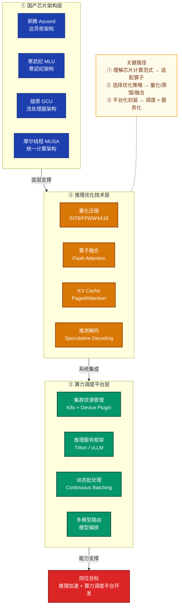

### 1.1 大模型推理的性能瓶颈分析

LLM 推理分为两个阶段，其性能特征截然不同：

| 阶段 | 名称 | 计算特征 | 瓶颈所在 |
|------|------|----------|----------|
| **Prefill** | 预填充（首 token） | 高并行度，矩阵×矩阵 | 计算密集（Compute-bound） |
| **Decode** | 逐 token 生成 | 低并行度，矩阵×向量 | 内存带宽（Memory-bound） |

**关键指标定义**：

- **TTFT（Time To First Token）**：首 token 延迟，衡量 Prefill 效率
- **TPOT（Time Per Output Token）**：每个输出 token 平均耗时，衡量 Decode 效率
- **吞吐量（Throughput）**：单位时间内处理的 token 数，通常以 tokens/s 表示
- **算术强度（Arithmetic Intensity）**：$\text{AI} = \frac{\text{FLOPs}}{\text{Bytes}}$，决定计算还是带宽瓶颈

对于 Decode 阶段，每一步的算术强度约为：

$$\text{AI}_{\text{decode}} = \frac{2 \cdot P}{2 \cdot P} = 1 \text{ FLOPs/Byte}$$

其中 $P$ 为模型参数量。而 A100 的算术强度屋顶约为 208 FLOPs/Byte，这说明 Decode 阶段极度内存带宽受限，优化核心在于**减少内存访问量和提高带宽利用率**。

---

## 2. 国产芯片底层架构

### 2.1 华为昇腾（Ascend）架构

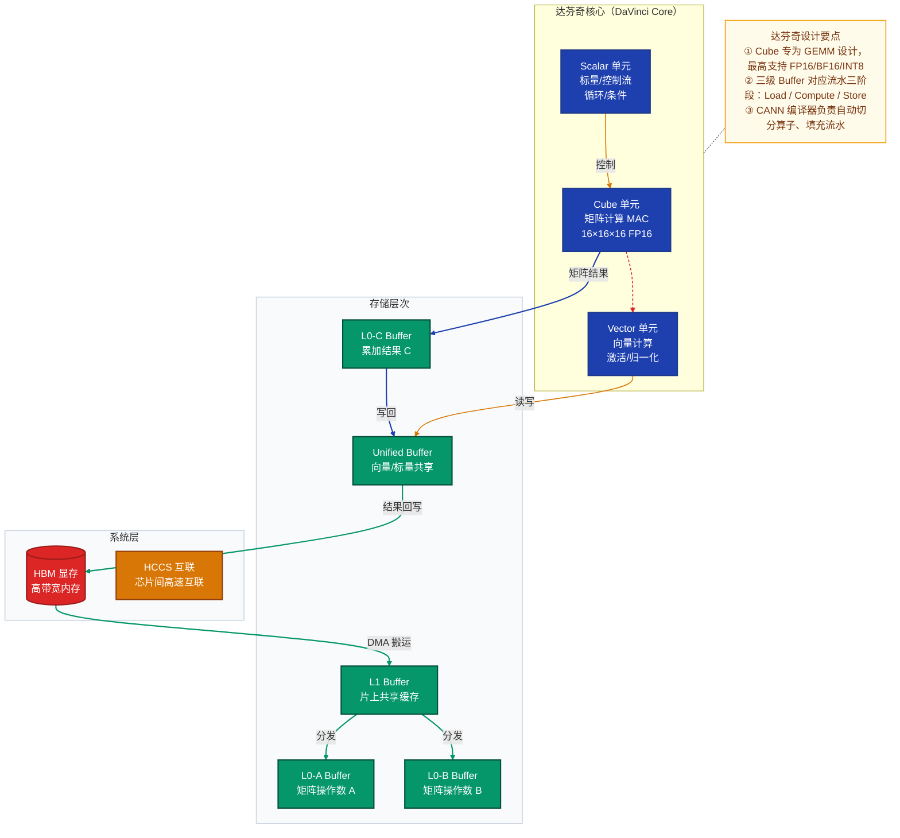

**昇腾关键技术栈**：

| 层次 | 组件 | 说明 |
|------|------|------|
| 芯片 | Ascend 910B/310P | 训练/推理专用型号 |
| 驱动 | Ascend Driver | NPU 驱动，管理设备资源 |
| 运行时 | CANN（Compute Architecture for Neural Networks） | 类比 CUDA，提供算子库与调度 |
| 算子库 | AscendCL / TBE（Tensor Boost Engine） | 高性能算子，支持自定义开发 |
| 框架 | MindSpore / PyTorch-NPU | 训练/推理框架 |
| 推理引擎 | MindIE / ATC 转换工具 | 模型部署与优化 |

**自定义算子开发（TBE 示例）**：

```python
# 昇腾 TBE 自定义算子开发示例
from te import tvm
from te.platform.fusion_manager import fusion_manager
from topi import generic

@fusion_manager.register("custom_relu")
def custom_relu_compute(input_x, output_y, kernel_name="custom_relu"):
    # 使用 TVM DSL 描述计算
    res = tvm.compute(input_x.shape, 
                      lambda *i: tvm.max(input_x(*i), tvm.const(0, input_x.dtype)),
                      name="res")
    return res
```

### 2.2 寒武纪（Cambricon）MLU 架构

寒武纪 MLU（Machine Learning Unit）系列芯片采用**流处理器（Stream Processor）+ 专用张量计算单元**的混合架构：

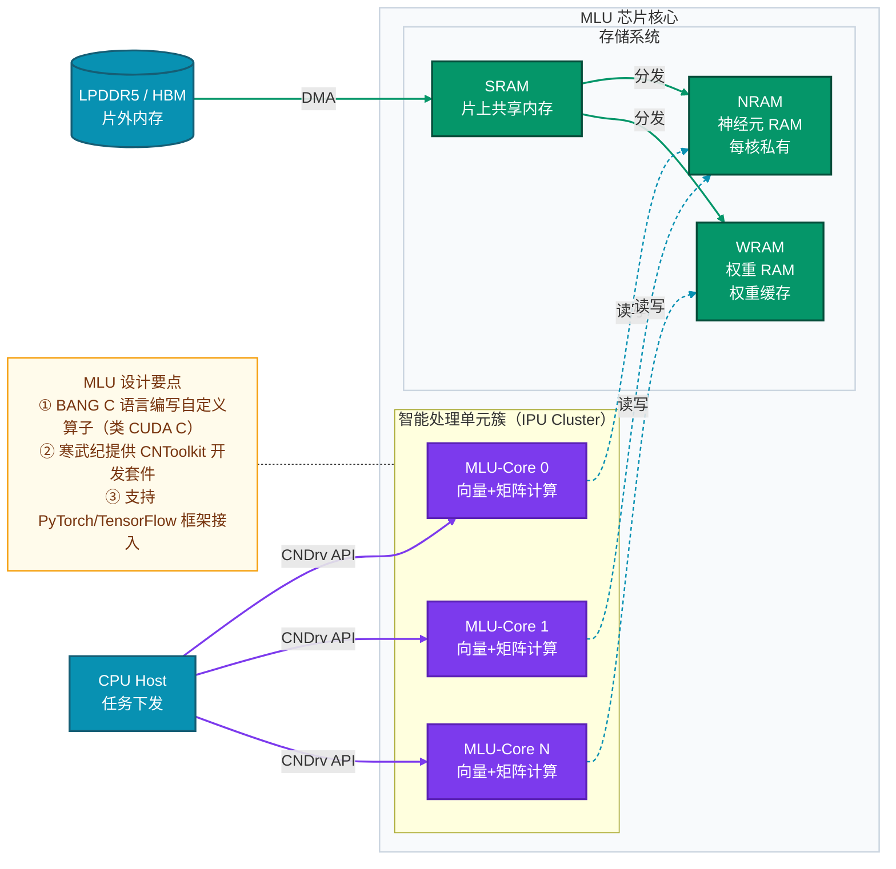

**主流国产芯片横向对比**：

| 厂商 | 芯片系列 | 架构特点 | 编程模型 | 主要场景 |
|------|----------|----------|----------|----------|
| 华为 | Ascend 910B | 达芬奇，Cube+Vector | CANN / AscendCL | 训练+推理 |
| 寒武纪 | MLU-370/590 | MLU-Core 阵列 | BANG C / CNToolkit | 推理+训练 |
| 燧原 | GCU T20/S60 | GCU 流处理 | TopsRider SDK | 训练+推理 |
| 摩尔线程 | MTT S4000 | MUSA 统一架构 | MUSA SDK（兼容 CUDA） | 通用计算+推理 |
| 壁仞 | BR100 | 自研张量核 | BIRAPI | 推理+训练 |
| 海光 | DCU Z100 | 类 RDNA 架构 | DTK（兼容 ROCm） | 高性能计算+AI |

### 2.3 国产芯片适配要点

适配国产芯片时，需重点关注以下差异：

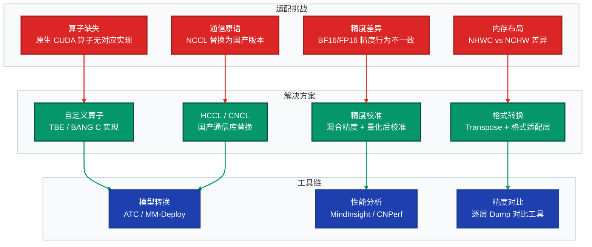

---

## 3. 推理加速核心技术

### 3.1 量化（Quantization）

量化将高精度浮点数映射到低比特整数，核心公式：

$$x_q = \text{round}\left(\frac{x}{s}\right) + z, \quad x_q \in [-2^{b-1}, 2^{b-1}-1]$$

其中 $s$ 为缩放因子（scale），$z$ 为零点（zero point），$b$ 为量化位宽。

反量化：$x \approx s \cdot (x_q - z)$

**主要量化方案对比**：

| 方案 | 精度格式 | 特点 | 适用场景 |
|------|----------|------|----------|
| FP16 / BF16 | 16位浮点 | 无损近似，大多数硬件支持 | 默认推理精度 |
| INT8（W8A8） | 权重+激活均 INT8 | 4× 显存节省，需校准 | 批量推理加速 |
| W4A16 | 权重 INT4，激活 FP16 | 极致压缩，解码速度快 | 内存带宽瓶颈场景 |
| FP8（E4M3） | 8位浮点 | H100/昇腾910B 原生支持 | 训练+推理兼顾 |
| GPTQ | 分组量化 INT4 | 逐层校准，精度损失小 | 离线量化最优解 |
| AWQ | 激活感知量化 | 保护显著权重通道 | 大模型低比特量化 |

**量化流程**：

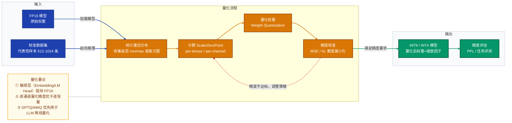

**GPTQ 量化代码实践**：

```python
from transformers import AutoModelForCausalLM, AutoTokenizer
from optimum.gptq import GPTQQuantizer, load_quantized_model
import torch

model_name = "Qwen/Qwen2-7B"
tokenizer = AutoTokenizer.from_pretrained(model_name)
model = AutoModelForCausalLM.from_pretrained(model_name, torch_dtype=torch.float16)

# 配置 GPTQ 量化参数
quantizer = GPTQQuantizer(
    bits=4,               # INT4 量化
    dataset="c4",         # 校准数据集
    block_name_to_quantize="model.layers",
    model_seqlen=2048,
    group_size=128,       # 分组量化，每 128 个权重共享 scale
)

quantized_model = quantizer.quantize_model(model, tokenizer)
quantized_model.save_pretrained("./qwen2-7b-gptq-int4")
```

### 3.2 Flash Attention：注意力算子融合

标准 Self-Attention 的时间与空间复杂度均为 $O(N^2)$，$N$ 为序列长度。Flash Attention 通过**分块计算（Tiling）**将 HBM 访问量降至 $O(N)$：

标准注意力：
$$\text{Attention}(Q, K, V) = \text{softmax}\left(\frac{QK^T}{\sqrt{d_k}}\right) V$$

Flash Attention 的核心创新：

1. **不物化完整的 $N \times N$ 注意力矩阵**，将 Q、K、V 分块加载到 SRAM
2. 使用在线 softmax（Online Softmax）算法，单次扫描完成归一化
3. 将注意力计算和 Dropout/Mask 融合到单个 kernel

**内存访问复杂度对比**：

| 算法 | HBM 读取 | HBM 写入 | 显存峰值 |
|------|----------|----------|----------|
| 标准 Attention | $O(Nd + N^2)$ | $O(Nd + N^2)$ | $O(N^2)$ |
| Flash Attention v1 | $O(N^2 d^2 / M)$ | $O(N^2 d^2 / M)$ | $O(N)$ |
| Flash Attention v2 | 进一步减少非矩阵乘计算 | 同左 | $O(N)$ |
| Flash Attention v3 | 针对 Hopper/GH200 优化 | 同左 | $O(N)$ |

其中 $d$ 为 head dimension，$M$ 为 SRAM 大小。

### 3.3 KV Cache 与 PagedAttention

Decode 阶段每步都需要访问所有历史 token 的 K/V，KV Cache 将其缓存到显存中：

$$\text{KV Cache 显存} = 2 \times L \times N \times d \times \text{bytes\_per\_element}$$

其中 $L$ 为层数，$N$ 为序列长度，$d$ 为 hidden dim。对于 Llama-2-70B（FP16），最大序列长度 4096 时：
$$2 \times 80 \times 4096 \times 8192 \times 2 \approx 8.6 \text{ GB}$$

**PagedAttention** 借鉴操作系统分页内存管理：

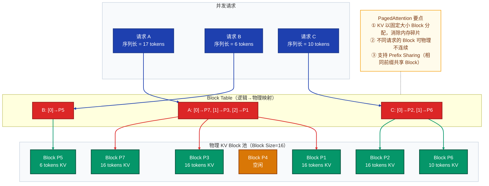

### 3.4 推测解码（Speculative Decoding）

推测解码利用小草稿模型（Draft Model）批量生成候选 token，由目标大模型并行验证，减少大模型串行步骤数：

**接受率推导**：若草稿模型每次生成 $\gamma$ 个 token，大模型验证接受率为 $\alpha$，则平均每次大模型前向推理产出的 token 数：

$$\mathbb{E}[\text{tokens}] = \frac{1 - \alpha^{\gamma+1}}{1 - \alpha}$$

当 $\alpha = 0.8$，$\gamma = 4$ 时：$\mathbb{E}[\text{tokens}] = \frac{1 - 0.8^5}{1 - 0.8} \approx 3.36$，相比标准解码的 1 token，理论加速 **3.36×**。

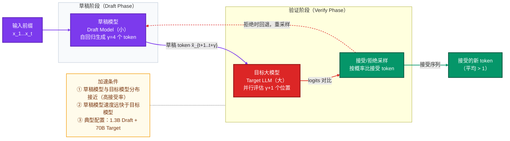

### 3.5 连续批处理（Continuous Batching）

传统静态批处理等待一批请求全部完成才开始下一批，导致 GPU 空转（Bubbles）。连续批处理（也称 Iteration-level Scheduling）在每个推理步骤后动态加入新请求：

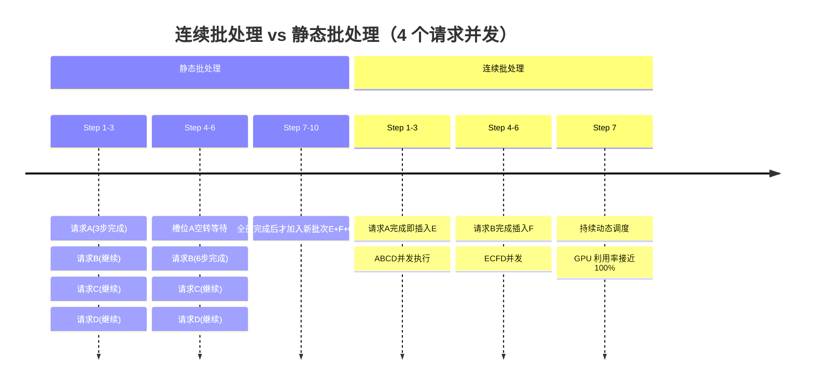

---

## 4. 主流推理框架与工具链

### 4.1 推理框架全景

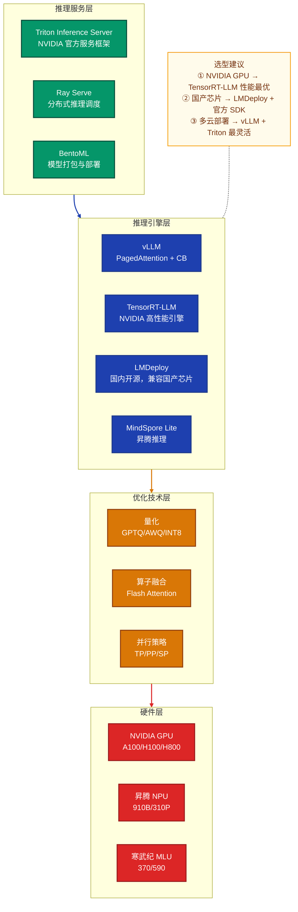

### 4.2 vLLM 架构详解

vLLM 是目前最广泛使用的开源 LLM 推理引擎，核心组件如下：

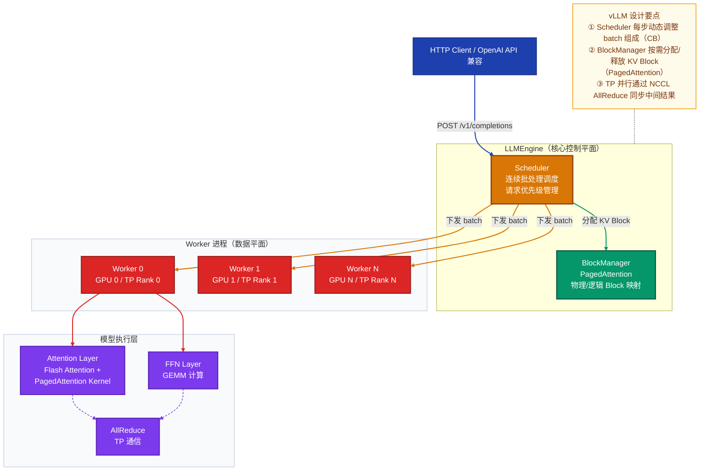

**vLLM 快速部署**：

```python
from vllm import LLM, SamplingParams

# 加载模型，启用 TP=2（张量并行）
llm = LLM(
    model="Qwen/Qwen2.5-72B-Instruct",
    tensor_parallel_size=2,        # 张量并行度
    max_model_len=32768,           # 最大序列长度
    quantization="awq",            # 量化方式
    gpu_memory_utilization=0.90,   # 显存利用率上限
    enable_prefix_caching=True,    # 启用 Prefix KV Cache
)

sampling_params = SamplingParams(
    temperature=0.7,
    top_p=0.9,
    max_tokens=1024,
)

outputs = llm.generate(["你好，请介绍一下自己"], sampling_params)
```

### 4.3 TensorRT-LLM 优化流程

TensorRT-LLM 将模型转换为高度优化的 TRT 引擎：

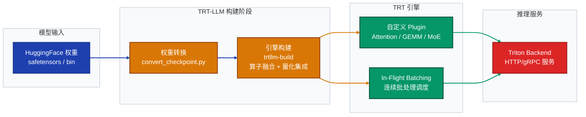

---

## 5. 算力调度平台架构

### 5.1 整体架构设计

算力调度平台是将 GPU/NPU 集群资源统一管理、按需分配给推理服务的核心系统：

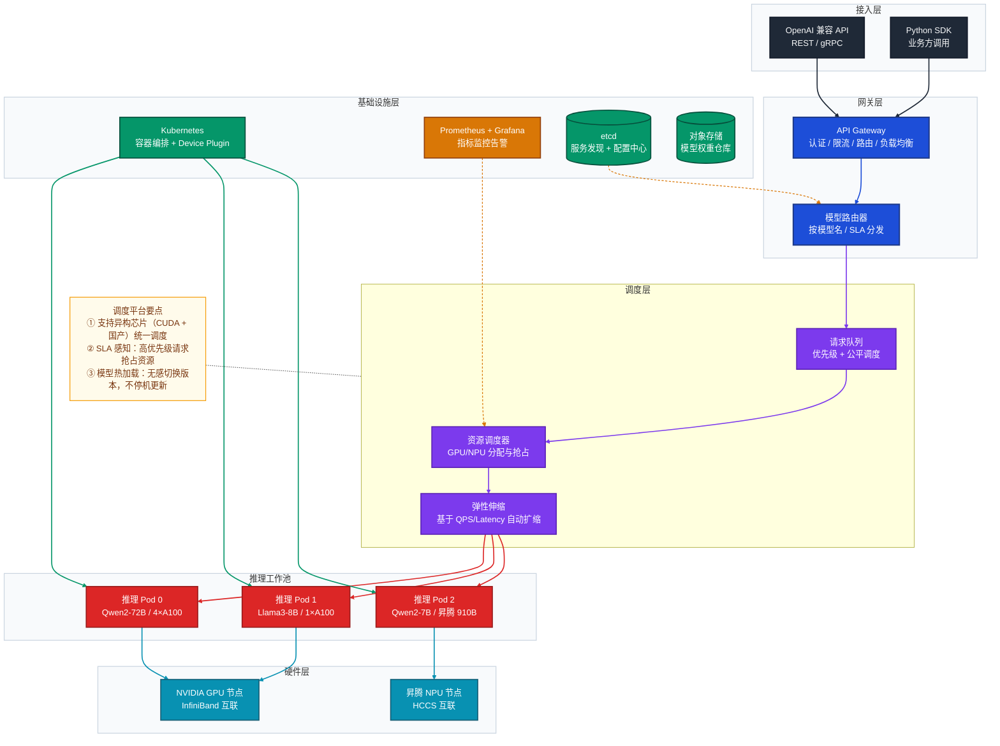

### 5.2 Kubernetes GPU 调度实践

```yaml
# GPU 推理 Pod 配置示例
apiVersion: apps/v1
kind: Deployment
metadata:
  name: qwen2-72b-inference
spec:
  replicas: 2
  template:
    spec:
      containers:
      - name: vllm-server
        image: vllm/vllm-openai:latest
        args:
        - "--model=/models/Qwen2-72B-Instruct"
        - "--tensor-parallel-size=4"
        - "--max-model-len=32768"
        - "--quantization=awq"
        - "--port=8000"
        resources:
          limits:
            nvidia.com/gpu: "4"          # 申请 4 张 GPU
            memory: "200Gi"
          requests:
            nvidia.com/gpu: "4"
            memory: "160Gi"
        volumeMounts:
        - name: model-store
          mountPath: /models
      volumes:
      - name: model-store
        persistentVolumeClaim:
          claimName: model-pvc
      nodeSelector:
        node.kubernetes.io/gpu-type: "A100-80G"
```

### 5.3 并行策略选型

大模型推理的并行策略决定了多卡部署的效率：

| 并行策略 | 原理 | 优势 | 适用场景 |
|----------|------|------|----------|
| **张量并行（TP）** | 将权重矩阵按列/行切分到多卡 | 减少单卡显存，延迟低 | 单机多卡，Decode 加速 |
| **流水线并行（PP）** | 按层切分，不同层在不同卡 | 支持超大模型 | 跨机推理，大批量 |
| **序列并行（SP）** | 将序列维度分布到多卡 | 超长序列支持 | 长文本推理 |
| **专家并行（EP）** | MoE 模型按专家分卡 | 专家利用率提升 | MoE 模型推理 |

**张量并行数学原理**（以线性层为例）：

对于 $Y = XW$，将 $W \in \mathbb{R}^{d \times 4d}$ 按列切分到 $N$ 卡：

$$W = [W_1 | W_2 | \cdots | W_N], \quad W_i \in \mathbb{R}^{d \times \frac{4d}{N}}$$

各卡独立计算 $Y_i = XW_i$，最后 AllGather 汇聚结果，通信量仅 $O(\frac{4d}{N})$。

### 5.4 推理性能监控指标体系

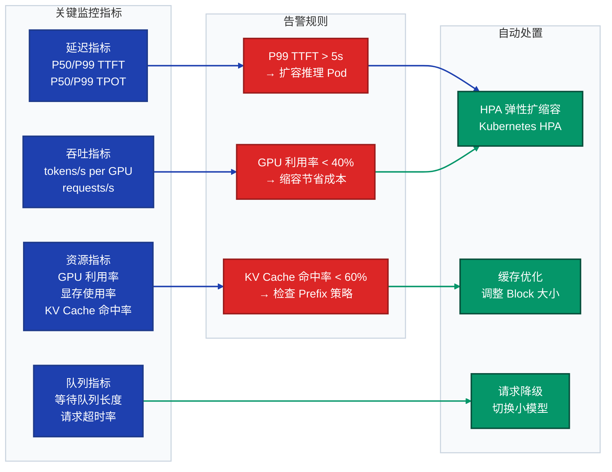

---

## 6. 实战项目经验

### 6.1 项目一：Qwen2-72B 推理服务优化

**背景**：将 Qwen2-72B-Instruct 部署到生产环境，要求 P99 TTFT ≤ 3s，吞吐 ≥ 500 tokens/s，使用 4×A100-80G。

**优化历程**：

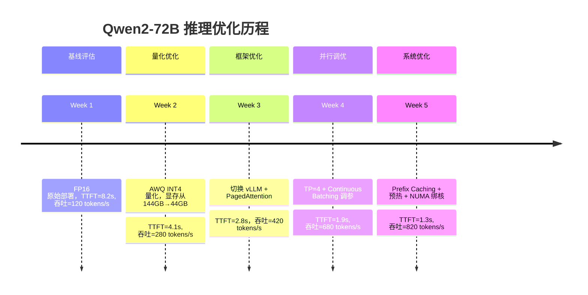

**关键优化代码**：

```python
# 生产环境 vLLM 配置优化
from vllm import AsyncLLMEngine, AsyncEngineArgs

engine_args = AsyncEngineArgs(
    model="Qwen/Qwen2-72B-Instruct",
    tensor_parallel_size=4,
    quantization="awq",
    max_model_len=32768,
    max_num_seqs=256,               # 最大并发序列数
    max_num_batched_tokens=65536,   # 每次批处理最大 token 数
    enable_prefix_caching=True,     # 前缀 KV Cache
    gpu_memory_utilization=0.92,    # 显存利用率
    swap_space=16,                  # CPU Swap 空间（GB）
    enforce_eager=False,            # 使用 CUDAGraph 加速
    max_paddings=256,
)

engine = AsyncLLMEngine.from_engine_args(engine_args)
```

### 6.2 项目二：昇腾 910B 大模型适配

**背景**：将基于 PyTorch 的 Llama-3-8B 适配到昇腾 910B，通过 MindIE 部署。

**适配流程**：

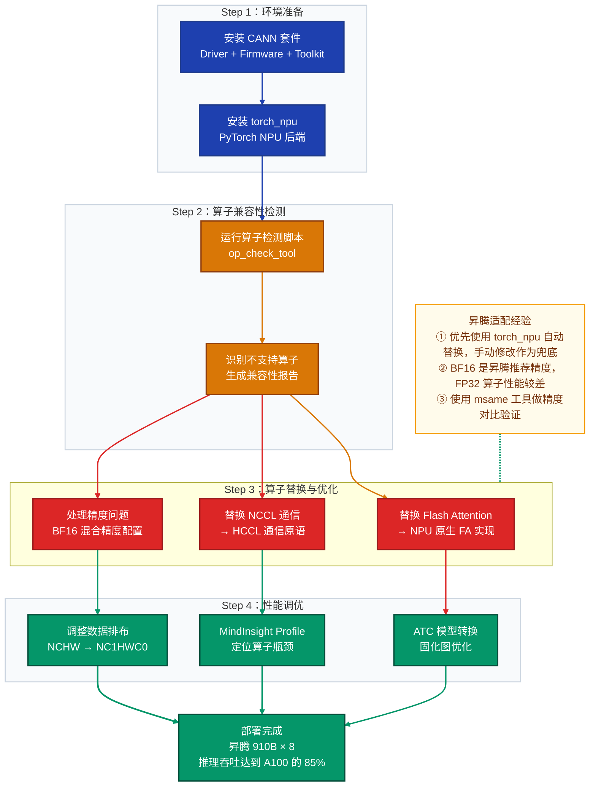

**关键代码（torch_npu 适配）**：

```python
import torch
import torch_npu  # 导入 NPU 后端，自动注册算子

# 设备设置
device = torch.device("npu:0")

# 模型加载时指定 NPU
model = AutoModelForCausalLM.from_pretrained(
    "meta-llama/Llama-3-8B-Instruct",
    torch_dtype=torch.bfloat16,   # 昇腾推荐 BF16
    device_map={"": device},
)

# 启用 Flash Attention NPU 版本
torch_npu.npu.set_compile_mode(jit_compile=False)
with torch_npu.npu.amp.autocast(dtype=torch.bfloat16):
    outputs = model.generate(input_ids, max_new_tokens=512)
```

### 6.3 项目三：算力调度平台关键模块

**请求调度算法（基于优先级队列）**：

```python
import heapq
from dataclasses import dataclass, field
from typing import List, Optional
import time

@dataclass(order=True)
class InferenceRequest:
    priority: int                     # 优先级（越小越高）
    arrival_time: float = field(compare=False)
    request_id: str = field(compare=False)
    prompt_tokens: int = field(compare=False)
    max_tokens: int = field(compare=False)
    sla_deadline: float = field(compare=False)   # SLA 截止时间（秒）

class PriorityScheduler:
    def __init__(self, max_batch_tokens: int = 32768):
        self.queue: List[InferenceRequest] = []
        self.max_batch_tokens = max_batch_tokens
        self.running_requests = {}

    def add_request(self, request: InferenceRequest):
        heapq.heappush(self.queue, request)

    def schedule_batch(self) -> List[InferenceRequest]:
        """
        贪心调度：按优先级选取请求，保证 batch token 预算不超限
        同时考虑 SLA 截止时间，即将超时的请求提升优先级
        """
        current_time = time.time()
        batch, token_count = [], 0

        # 动态调整优先级：距 SLA 不足 30% 时间时，提升为最高优先级
        adjusted = []
        for req in self.queue:
            remaining = req.sla_deadline - current_time
            total = req.sla_deadline - req.arrival_time
            if remaining / total < 0.3:
                req.priority = -9999  # 紧急提升
            adjusted.append(req)

        self.queue = []
        for req in adjusted:
            heapq.heappush(self.queue, req)

        # 按优先级贪心选取
        temp = []
        while self.queue:
            req = heapq.heappop(self.queue)
            needed = req.prompt_tokens + req.max_tokens
            if token_count + needed <= self.max_batch_tokens:
                batch.append(req)
                token_count += needed
            else:
                temp.append(req)
                if token_count > self.max_batch_tokens * 0.8:
                    break

        for req in temp:
            heapq.heappush(self.queue, req)

        return batch
```

---

## 7. FAQ：面试常见问题

### 7.1 国产芯片与 CUDA 生态的差异

**Q1：昇腾 910B 和 NVIDIA A100 在软件栈上有哪些核心区别？**

> **A**：
> - **编程模型**：A100 使用 CUDA + cuBLAS/cuDNN；910B 使用 CANN + AscendCL/TBE，自定义算子通过 TBE（Tensor Boost Engine）用 Python DSL 描述
> - **算子生态**：CUDA 生态极为丰富（几乎所有算子都有高度优化的实现）；CANN 在常用 LLM 算子上已接近 CUDA，但长尾算子需要手动适配
> - **内存管理**：两者均通过显存池管理，但 CANN 的 DMA 搬运需要显式管理 L1/L0/UB 的 Buffer 分级
> - **通信库**：NVIDIA 使用 NCCL；华为使用 HCCL（华为集合通信库），接口相似但需替换依赖
> - **调试工具**：CUDA 有 Nsight Systems/Compute；CANN 有 MindInsight Profiler

**Q2：适配国产芯片时最常见的精度问题是什么，如何排查？**

> **A**：常见精度问题：
> 1. **Softmax 数值溢出**：FP16 的 exp 运算在大值时溢出，需在计算前减去 max（在线 softmax）
> 2. **累加精度**：矩阵乘积累加顺序不同导致浮点误差累积，可用 `atol=1e-3, rtol=1e-3` 放宽容差对比
> 3. **BF16/FP16 行为差异**：国产芯片有时对 NaN/Inf 的处理与 CUDA 不一致
>
> **排查方法**：逐层 Dump 对比（CPU vs NPU），用二分法定位哪一层开始出现偏差，然后检查该算子的实现是否与参考实现等价。

### 7.2 推理加速技术原理

**Q3：INT8 量化为什么能加速推理？它的主要误差来源是什么？**

> **A**：
> - **加速原因**：① INT8 GEMM 比 FP16 GEMM 算力高约 2× 到 4×（A100 INT8 Tensor Core 可达 2000+ TOPS）；② INT8 数据宽度是 FP16 的一半，显存带宽消耗减半，对 Memory-bound 的 Decode 阶段效果显著
> - **误差来源**：① **量化粒度**：per-tensor 误差大于 per-channel；② **激活分布异常**：LLM 激活值存在少量极端值（Outlier），导致量化范围被拉大，大部分值精度损失严重（SmoothQuant/AWQ 专门解决此问题）；③ **累积误差**：多层量化误差叠加，深层网络更敏感

**Q4：Flash Attention 的加速原理是什么？为什么能降低显存占用？**

> **A**：
> - **标准 Attention 的问题**：需要物化完整的 $N \times N$ 注意力矩阵到 HBM（显存），对于 $N=32768$，FP16 矩阵占用 $32768^2 \times 2 = 2$ GB 显存，且需要多次读写 HBM
> - **Flash Attention 方案**：将 Q、K、V 切分为小块（Block），逐块加载到 SRAM 上计算，利用**在线 softmax（Online Softmax）**算法保证数值等价，无需存储完整的注意力矩阵
> - **显存降至 $O(N)$**：只需存储最终输出矩阵 $O \in \mathbb{R}^{N \times d}$，而非中间注意力矩阵 $A \in \mathbb{R}^{N \times N}$
> - **IO 次数减少**：标准 Attention 对每个 block 需要多次读写 HBM；Flash Attention 在 SRAM 内完成全部计算，HBM 访问次数从 $O(N^2)$ 降至 $O(N)$

**Q5：PagedAttention 解决了什么问题？与标准 KV Cache 的区别？**

> **A**：
> - **标准 KV Cache 的问题**：为每个请求预分配连续的最大序列长度显存（如 4096 tokens），但实际生成长度不确定，导致大量**内部碎片**（未用完的预分配空间）；不同请求的内存块无法复用，**外部碎片**严重
> - **PagedAttention 的方案**：借鉴操作系统虚拟内存分页，将 KV Cache 切分为固定大小的 Block（如 16 tokens/block），按需动态分配，通过 Block Table 维护逻辑到物理的映射
> - **优势**：① 内存利用率从约 55% 提升至 95%+；② 支持 Prefix Sharing（相同系统提示词的多个请求共享前缀 Block，无需重复计算）；③ 支持 Beam Search 的高效 Copy-on-Write

**Q6：推测解码（Speculative Decoding）在什么场景下失效？**

> **A**：以下场景加速效果不显著甚至有负收益：
> 1. **低接受率场景**：草稿模型与目标模型分布差异大（如不同语言/领域），频繁拒绝导致回退开销超过收益；接受率 $\alpha < 0.6$ 时通常不建议使用
> 2. **计算密集型场景（Prefill 主导）**：Speculative Decoding 主要加速 Decode，对首 token 延迟无帮助
> 3. **高并发大批量场景**：大批量时目标模型本身已接近算力峰值，加入草稿推理反而引入额外计算开销；更适合低并发、延迟敏感的交互式场景
> 4. **草稿模型本身慢**：草稿模型应比目标模型快 5× 以上，否则节省的验证步骤不足以抵消草稿生成耗时

### 7.3 算力调度平台

**Q7：如何设计一个支持国产芯片与 NVIDIA GPU 混合部署的调度系统？**

> **A**：核心设计要点：
> 1. **设备抽象层**：定义统一的设备接口（Device Abstraction Layer），屏蔽芯片差异；NVIDIA 使用 `nvidia.com/gpu` Device Plugin，昇腾使用 `huawei.com/Ascend910` Device Plugin
> 2. **模型兼容性矩阵**：维护"模型 × 芯片类型"兼容性映射表，调度时过滤不兼容的节点
> 3. **性能归一化**：定义算力单位（如 TFLOPS 归一化），将不同芯片的实际吞吐归一化为可比较的 tokens/s 指标
> 4. **路由策略**：默认将请求路由到可用芯片中性能最优的实例；当 NVIDIA 节点繁忙时自动溢出到国产芯片节点（降级策略需配置 SLA 阈值）
> 5. **健康检测差异**：不同芯片的错误码和健康检测方式不同，需要针对每种芯片实现独立的 HealthChecker

**Q8：Continuous Batching 和 Dynamic Batching 的区别是什么？**

> **A**：
> - **Dynamic Batching（动态批处理）**：等待一定时间窗口内的请求凑成一批，批内所有请求同时开始、同时结束；长序列拖慢整个 batch，短序列浪费等待时间，GPU 利用率约 50-70%
> - **Continuous Batching（连续批处理/迭代级调度）**：每个推理步骤（iteration）后，将已完成的请求从 batch 中移除，立即插入新的等待请求；batch 组成在每个 step 动态变化，GPU 始终满负荷运行，利用率可达 90%+
> - **实现关键**：需要推理引擎支持变长 batch（不同请求处于不同生成步骤），vLLM、TRT-LLM 均原生支持；传统 Triton Dynamic Batching 是前者

**Q9：KV Cache 命中率低，有哪些优化手段？**

> **A**：
> 1. **启用 Prefix Caching**：对固定的 System Prompt 预先计算并缓存 KV，命中后直接从 Prefill 阶段跳过前缀部分（vLLM `enable_prefix_caching=True`）
> 2. **增大 Block 池**：调高 `gpu_memory_utilization`，为 KV Cache 分配更多显存
> 3. **RadixAttention**（SGLang）：将 KV Cache 组织为前缀树（Radix Tree），支持任意公共前缀的精确命中
> 4. **减小 Block Size**：Block Size 过大时尾部 block 浪费（内部碎片），可以适当减小 Block Size（如从 32 降至 16）
> 5. **多级 Cache**：将低优先级 KV Block Swap 到 CPU 内存，请求命中时再加载回 GPU（vLLM 的 swap_space 参数）

**Q10：如何量化评估推理优化的收益？需要关注哪些指标？**

> **A**：评估体系应分三层：
>
> **层次一：延迟指标（用户体验）**
> - TTFT P50/P99：首 token 延迟，影响"响应感"
> - TPOT P50/P99：每个输出 token 耗时，影响"流畅感"
> - E2E Latency：端到端延迟 = TTFT + TPOT × output_tokens
>
> **层次二：吞吐指标（系统效率）**
> - 吞吐量（tokens/s）：单实例每秒输出 token 数
> - QPS（requests/s）：每秒处理请求数
> - GPU 利用率：SM 利用率（非显存利用率），目标 > 80%
>
> **层次三：资源效率（成本）**
> - 单 GPU 吞吐（tokens/s/GPU）：综合性价比指标
> - 显存利用率：KV Cache 占用 vs 参数占用的比例
> - 成本/token（$/million tokens）：最终商业化指标

---

## 技术演进时间线

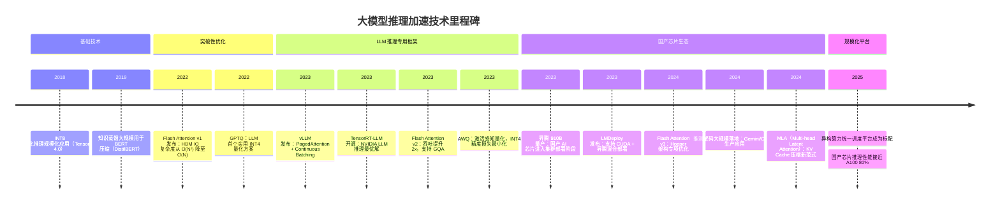

---

*文档版本：v1.0 | 最后更新：2025 年 3 月*
*技术涵盖：昇腾 CANN / 寒武纪 BANG C / vLLM / TensorRT-LLM / Flash Attention / PagedAttention / GPTQ / AWQ / Kubernetes GPU 调度*
