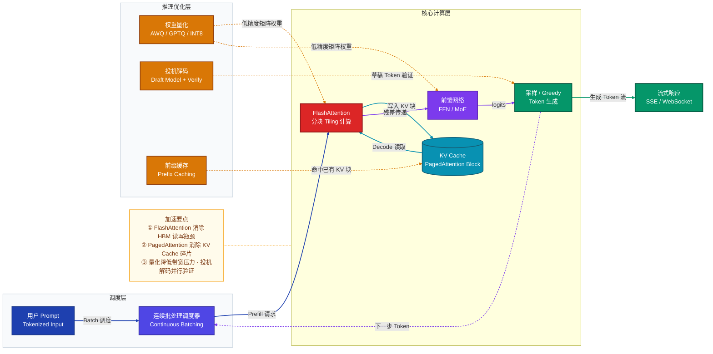
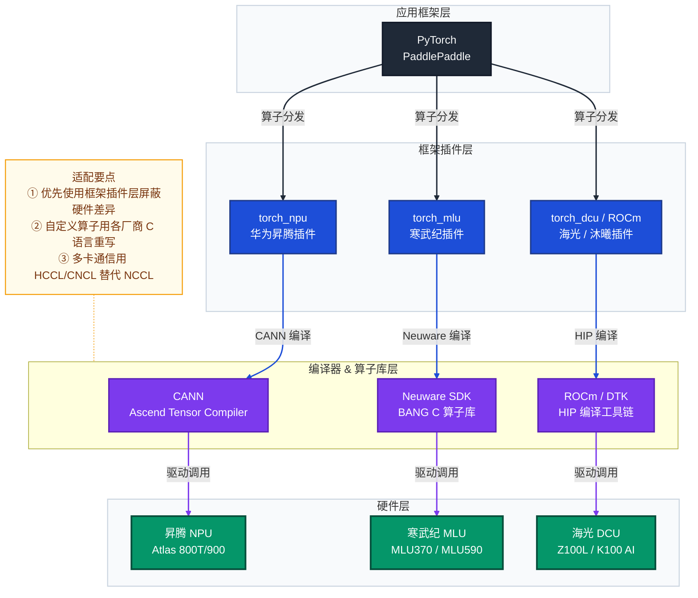
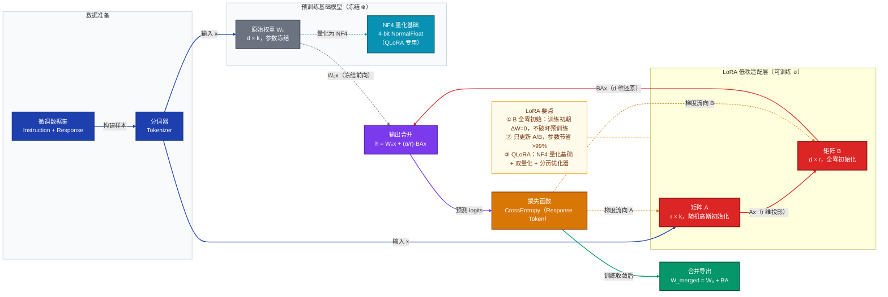
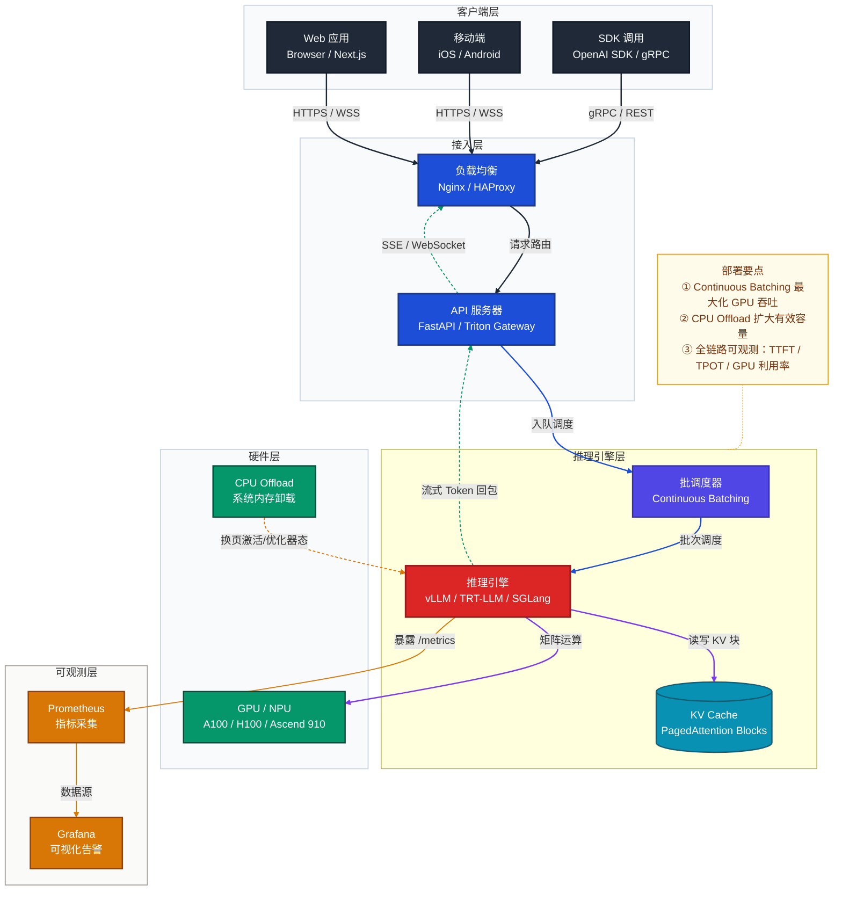

# 算力与推理加速完全指南
> 覆盖：推理引擎 · 国产算力适配 · 大模型微调 · 全栈推理部署 · 全模态工程落地

---

## 目录

1. [核心概念与原理](#一核心概念与原理)
   - 1.1 [推理引擎](#11-推理引擎inference-engine)
   - 1.2 [国产算力适配](#12-国产算力适配)
   - 1.3 [大模型微调](#13-大模型微调fine-tuning)
   - 1.4 [全栈推理部署](#14-全栈推理部署)
   - 1.5 [全模态工程落地](#15-全模态工程落地)
2. [应用方法与示例](#二应用方法与示例)
3. [常见问题与解决方案](#三常见问题与解决方案)
4. [注意事项](#四注意事项)
5. [完整推理部署流程](#五完整推理部署流程)
6. [面试常见问题 FAQ](#六面试常见问题-faq)

---

## 一、核心概念与原理

### 1.1 推理引擎（Inference Engine）

推理引擎是将训练好的模型在生产环境中高效执行的运行时框架，核心目标是在满足**延迟（Latency）**与**吞吐（Throughput）**双重约束的前提下，最大化硬件资源利用率。

#### 1.1.1 FlashAttention：注意力计算加速

原始 Transformer 自注意力的时间与空间复杂度均为 $O(N^2)$（$N$ 为序列长度），其标准计算公式为：

$$\text{Attention}(Q, K, V) = \text{softmax}\left(\frac{QK^T}{\sqrt{d_k}}\right)V$$

**核心瓶颈**：在标准实现中，$N \times N$ 的注意力矩阵需反复在 GPU HBM（高带宽显存）与 SRAM（片上共享内存）之间搬运，带宽而非算力成为瓶颈。

**FlashAttention 原理**：通过分块（Tiling）技术将 $Q$、$K$、$V$ 切分为多个 Block，在 SRAM 内完成注意力计算，无需将完整的 $N \times N$ 矩阵写回 HBM。IO 复杂度从 $O(N^2)$ 降至 $O(N)$，实现 2~4× 的端到端加速，且数值结果与精确注意力严格等价。

| 版本 | 改进点 | 加速比 |
|------|--------|--------|
| FlashAttention v1 | 分块 Tiling + 在线 Softmax | 2~3× |
| FlashAttention v2 | 改进并行策略，减少非矩阵乘操作 | 3~4× |
| FlashAttention v3 | H100 Tensor Core 异步流水 | 4~5× |

#### 1.1.2 KV Cache 与 PagedAttention

**KV Cache**：自回归生成时，每生成一个新 Token 都需与全部历史 Token 的 Key/Value 做注意力。KV Cache 将历史 K/V 张量缓存于显存，避免重复计算。

单请求 KV Cache 显存估算：

$$M_{KV} = 2 \times L \times H \times d_h \times S \times \text{bytes\_per\_element}$$

其中 $L$ 为层数，$H$ 为注意力头数，$d_h$ 为每头维度，$S$ 为序列长度，系数 2 对应 K 和 V 两个张量。

> **示例**：LLaMA-3-70B（$L=80$，$H=64$，$d_h=128$，FP16），每 1000 个 Token 约需 **160 MB** KV Cache 显存。

**PagedAttention（vLLM 核心创新）**：传统 KV Cache 按最大序列长度预分配连续显存，产生大量内部碎片和外部碎片，GPU 显存利用率约 60%。

PagedAttention 借鉴操作系统虚拟内存分页机制，将 KV Cache 切分为固定大小的逻辑 Block（默认 16 个 Token/Block），通过 Block Table 建立逻辑块到物理块的动态映射，实现：
- 按需分配，消除内部碎片
- 不同请求共享相同前缀的物理 Block（Prefix Caching）
- GPU 显存利用率提升至 **95%+**

#### 1.1.3 量化（Quantization）

量化将模型权重/激活从高精度浮点映射到低比特整数，降低显存占用与带宽压力。

**线性（均匀）量化**基本公式：

$$\hat{x} = s \cdot \text{clamp}\left(\text{round}\left(\frac{x}{s}\right) + z,\ -2^{b-1},\ 2^{b-1}-1\right)$$

其中 $s = \frac{x_{\max} - x_{\min}}{2^b - 1}$ 为量化步长（Scale），$z$ 为零点（Zero Point），$b$ 为目标比特宽度。

| 精度格式 | 字节数 | 显存对比 | 主要用途 |
|---------|--------|---------|---------|
| FP32 | 4 B | 基准（100%） | 训练参考 |
| BF16 | 2 B | 50% | 训练 / 推理首选 |
| FP16 | 2 B | 50% | 推理（动态范围较小） |
| INT8 | 1 B | 25% | 云端 / 边缘推理 |
| GPTQ INT4 | 0.5 B | 12.5% | 基于 Hessian 逐列量化 |
| AWQ INT4 | 0.5 B | 12.5% | 激活感知权重量化 |
| NF4 | 0.5 B | 12.5% | 正态分布非线性量化（QLoRA）|

#### 1.1.4 连续批处理（Continuous Batching）

传统**静态批处理**：等待 Batch 内所有请求全部完成后才出队，短请求先完成后 GPU 空闲等待长请求，利用率低。

**连续批处理（Iteration-Level Scheduling）**：在每个推理步（Iteration）粒度动态插入新请求或移除已完成请求，GPU 始终满负荷运行。实践中吞吐量可提升 **10~23×**。

#### 1.1.5 投机解码（Speculative Decoding）

自回归生成的瓶颈在于每步只输出一个 Token，大模型单步开销高。投机解码核心流程：

1. **草稿阶段**：用小草稿模型（参数量约为目标模型的 $1/10$~$1/20$）快速自回归生成 $K$ 个候选 Token
2. **并行验证**：将 $K$ 个 Token 拼成一个序列，送入目标大模型**一次前向传播**并行验证所有位置
3. **接受/拒绝**：按概率比 $\min\left(1,\ \frac{p_{\text{target}}(x)}{p_{\text{draft}}(x)}\right)$ 逐 Token 决定是否接受

在草稿接受率 $\alpha$ 下，期望每次验证接受的 Token 数为 $\frac{1 - \alpha^{K+1}}{1-\alpha}$，实践中可获得 **2~3×** 端到端加速，且输出分布与原始大模型严格等价。

---

### 推理引擎加速技术架构图



---

### 1.2 国产算力适配

#### 主要国产 AI 芯片一览

| 厂商 | 产品系列 | 核心软件栈 | CUDA 兼容性 | 主要应用场景 |
|------|---------|-----------|------------|------------|
| 华为 | 昇腾 Ascend Atlas 800T/900 | CANN + torch_npu + MindSpore | 不兼容，需完整适配 | 云端训练/推理 |
| 寒武纪 | MLU370-X8 / MLU590 | Neuware SDK + torch_mlu | 部分兼容（算子映射） | 云端/边缘推理 |
| 海光 | DCU Z100L / K100 AI | ROCm + DTK + torch_dcu | 高度兼容（HIP/ROCm） | 训练/推理 |
| 沐曦 | MTT S80 / S4000 | MUSA SDK + torch_musa | 高度兼容（接近 CUDA API）| 云端推理 |
| 壁仞 | BR100 / BR104 | BIREND SDK | 部分兼容 | 训练/推理 |
| 燧原 | GCU T20 / T30 | TopsRider | 不兼容，需移植 | 云端推理 |

#### 适配层次模型

国产算力适配本质是在各个层次建立从 PyTorch 生态到国产硬件的映射：

```
┌─────────────────────────────────────────────┐
│   应用层：PyTorch / PaddlePaddle / JAX       │
├──────────┬──────────┬────────────────────────┤
│ torch_npu│ torch_mlu│  torch_musa / torch_dcu │  ← 框架插件层
├──────────┼──────────┼────────────────────────┤
│   CANN   │ Neuware  │    MUSA / ROCm+DTK      │  ← 编译器与算子库
├──────────┼──────────┼────────────────────────┤
│ Ascend   │  MLU     │      DCU / GPU          │  ← 驱动层
│  Driver  │ Driver   │      Driver             │
├──────────┼──────────┼────────────────────────┤
│  Ascend  │  MLU     │   海光 DCU / 沐曦 MTT   │  ← 硬件层
└──────────┴──────────┴────────────────────────┘
```

#### 昇腾（Ascend）适配关键路径

1. **框架插件**：`pip install torch_npu` 后，将 `.cuda()` 改为 `.npu()`，算子调用自动路由到 CANN
2. **自定义算子**：用 **Ascend C（AIC）**重写 CUDA Kernel，或使用 CANN 内置融合算子
3. **模型编译**：使用 **ATC**（Ascend Tensor Compiler）将 ONNX/TorchScript 编译为 `.om` 离线推理格式
4. **多卡通信**：使用 **HCCL**（Huawei Collective Communication Library）替代 NCCL

---

### 国产算力适配架构图



---

### 1.3 大模型微调（Fine-tuning）

#### 1.3.1 LoRA（Low-Rank Adaptation）

**核心思想**：预训练权重矩阵 $W_0 \in \mathbb{R}^{d \times k}$ 在下游任务微调时，权重变化量 $\Delta W$ 具有内在低秩特性，可分解为：

$$W' = W_0 + \Delta W = W_0 + BA$$

其中 $B \in \mathbb{R}^{d \times r}$，$A \in \mathbb{R}^{r \times k}$，秩 $r \ll \min(d, k)$。前向传播中，输出为：

$$h = W_0 x + \Delta W x = W_0 x + BAx$$

**参数节省比**：原始参数量为 $dk$，LoRA 可训练参数量为 $r(d+k)$，节省比为：

$$\text{Saving} = 1 - \frac{r(d + k)}{dk}$$

以 $d = k = 4096$，$r = 16$ 为例：节省约 **99.6%** 的参数量。

**初始化策略**：$A$ 用随机高斯初始化，$B$ 初始化为**全零**，保证训练初始阶段 $\Delta W = BA = 0$，不破坏预训练权重（详见 FAQ Q2）。

**LoRA Scaling**：实际使用时乘以缩放系数 $\frac{\alpha}{r}$，输出为 $h = W_0 x + \frac{\alpha}{r} BAx$，$\alpha$ 通常设为 $2r$，即缩放因子为 2。

#### 1.3.2 QLoRA（Quantized LoRA）

QLoRA 在 LoRA 基础上，将基础模型量化为 **4-bit NormalFloat（NF4）** 格式，显著降低显存占用：

| 微调方法 | LLaMA-7B 所需显存 | 相对 FP16 |
|---------|----------------|----------|
| 全参数 FP16 微调 | ~112 GB | 基准 |
| LoRA（BF16 基础）| ~40 GB | 64% 节省 |
| QLoRA（NF4 基础）| ~10 GB | 91% 节省 |

**三大关键技术**：
- **NF4 量化**：基于正态分布的非均匀量化，相比线性 INT4 精度损失更小
- **双量化（Double Quantization）**：对量化常数本身再次量化，额外节省约 0.37 bits/parameter
- **分页优化器（Paged Optimizer）**：将优化器状态从 GPU 换页到 CPU 内存，支持在 24GB 消费级 GPU 上微调 70B 模型

#### 1.3.3 DPO（Direct Preference Optimization）

DPO 将 RLHF 中独立的奖励建模和 RL 优化合并为单步监督优化，损失函数为：

$$\mathcal{L}_{DPO}(\pi_\theta;\, \pi_{\text{ref}}) = -\mathbb{E}_{(x,y_w,y_l)}\!\left[\log \sigma\!\left(\beta \log \frac{\pi_\theta(y_w|x)}{\pi_{\text{ref}}(y_w|x)} - \beta \log \frac{\pi_\theta(y_l|x)}{\pi_{\text{ref}}(y_l|x)}\right)\right]$$

其中 $y_w$ 为偏好回答，$y_l$ 为非偏好回答，$\beta$ 为 KL 散度惩罚系数（通常取 0.1~0.5）。DPO 无需训练独立奖励模型，训练稳定且资源开销小。

---

### 大模型微调架构图（LoRA/QLoRA）



---

### 1.4 全栈推理部署

全栈推理部署涵盖从模型导出到生产流量承接的完整链路。

#### 推理服务框架选型

| 框架 | 适用场景 | 核心特点 | 典型吞吐 |
|------|---------|---------|---------|
| **vLLM** | LLM 云端高并发 | PagedAttention，连续批处理，最优吞吐 | 2000~5000 tokens/s |
| **TensorRT-LLM** | NVIDIA GPU 极致推理 | NVIDIA 深度内核优化，延迟最低 | 3000~8000 tokens/s |
| **TGI（Text Generation Inference）** | HuggingFace 生态标准化 | 易用，功能完整，生产经验丰富 | 1500~3000 tokens/s |
| **Triton Inference Server** | 通用模型服务 | 多后端（Python/ONNX/TRT），企业级 | 取决于后端 |
| **SGLang** | 复杂多轮对话 / Agent | RadixAttention，结构化生成加速 | 高并发场景出色 |
| **llama.cpp** | CPU / 边缘推理 | 极度轻量，支持多种量化，无 GPU 要求 | 10~80 tokens/s (CPU) |
| **Ollama** | 本地开发调试 | 开箱即用，自动量化，UI 友好 | 开发环境首选 |

#### 模型格式转换链路

```
训练产物（PyTorch .pt/.bin）
    ↓ torch.export / torch.onnx.export
ONNX 格式（跨框架标准）
    ↓ TensorRT / OpenVINO / CANN ATC
特定后端引擎（.plan / .xml / .om）
    ↓ 推理服务框架加载
生产推理服务（REST / gRPC / SSE）
```

---

### 全栈推理部署架构图



---

### 1.5 全模态工程落地

全模态（Multi-modal）系统同时处理文本、图像、音频、视频等多种模态数据。

#### 核心架构模式

**视觉-语言模型（VLM）典型架构**：
```
图像输入 → Vision Encoder（ViT / CLIP）→ Projector（MLP / Cross-Attention）
                                                ↓
文本 Token ──────────────────────────────→ LLM Backbone → 文本输出
```

**主要工程挑战**：

| 挑战 | 描述 | 应对策略 |
|------|------|---------|
| **跨模态对齐** | 图像/音频 Embedding 与文本 Token 空间不一致 | CLIP 对比学习预对齐；Projector 层适配 |
| **图像 Token 膨胀** | 224×224 图像→196 个 Token，导致 KV Cache 激增 | 动态分辨率分块（Slice）；视觉 Token 压缩 |
| **预处理异步化** | 图像解码/Mel 特征提取是 CPU 密集型操作 | 独立 CPU Worker 线程池，与 GPU 推理解耦 |
| **批处理对齐** | 不同分辨率图像使 Batch 内 Token 长度差异大 | Padding 到最大长度；或 Dynamic Shape 推理 |
| **视频帧采样** | 视频推理需大量帧，显存压力极大 | 关键帧采样（均匀 / 基于运动检测）|

---

## 二、应用方法与示例

### 2.1 推理引擎应用

#### 示例 1：vLLM 部署 LLM 推理服务

```bash
# 安装 vLLM（支持 CUDA 12.1+）
pip install vllm

# 启动兼容 OpenAI 协议的推理服务
python -m vllm.entrypoints.openai.api_server \
    --model Qwen/Qwen2.5-72B-Instruct-AWQ \
    --dtype auto \
    --quantization awq \
    --tensor-parallel-size 4 \          # 4 卡 Tensor Parallelism
    --gpu-memory-utilization 0.92 \     # 预留 8% buffer 防 OOM
    --max-model-len 32768 \             # 最大上下文长度
    --max-num-seqs 512 \                # 最大并发请求数
    --enable-prefix-caching \           # 启用前缀缓存
    --port 8000
```

```python
# 客户端调用（兼容 OpenAI SDK）
from openai import OpenAI

client = OpenAI(base_url="http://localhost:8000/v1", api_key="dummy")
response = client.chat.completions.create(
    model="Qwen/Qwen2.5-72B-Instruct-AWQ",
    messages=[{"role": "user", "content": "解释量子纠缠的物理意义"}],
    max_tokens=1024,
    temperature=0.7,
    stream=True,  # 启用流式输出
)
for chunk in response:
    print(chunk.choices[0].delta.content or "", end="", flush=True)
```

#### 示例 2：TensorRT-LLM 构建高性能引擎

```python
import tensorrt_llm
from tensorrt_llm.builder import BuildConfig, build
from tensorrt_llm.models import LLaMAForCausalLM

# 从 HuggingFace 加载并转换
model = LLaMAForCausalLM.from_hugging_face(
    "meta-llama/Meta-Llama-3-8B-Instruct",
    dtype="float16",
    tp_size=2,  # Tensor Parallelism 并行度
)

# 构建 TensorRT 引擎
build_config = BuildConfig(
    max_batch_size=32,
    max_input_len=2048,
    max_seq_len=4096,
    plugin_config={
        "paged_kv_cache": True,
        "use_paged_context_fmha": True,  # Flash Attention with paged KV
        "gemm_swiglu_plugin": "float16", # 融合 FFN + SwiGLU
    },
)
engine = build(model, build_config)
engine.save("./llama3_8b_trt_engine")
print("引擎构建完成，输出目录：./llama3_8b_trt_engine")
```

#### 示例 3：ONNX Runtime 通用推理加速

```python
import onnxruntime as ort
import numpy as np

# 创建 CUDA EP 推理会话
providers = [
    ("CUDAExecutionProvider", {
        "device_id": 0,
        "gpu_mem_limit": 8 * 1024**3,           # 8 GB 显存上限
        "arena_extend_strategy": "kNextPowerOfTwo",
        "cudnn_conv_algo_search": "EXHAUSTIVE",  # 自动搜索最优卷积算法
    }),
    "CPUExecutionProvider",  # 回退到 CPU
]

sess_options = ort.SessionOptions()
sess_options.graph_optimization_level = ort.GraphOptimizationLevel.ORT_ENABLE_ALL
sess_options.intra_op_num_threads = 4

session = ort.InferenceSession("model.onnx", sess_options, providers=providers)

# 执行推理
input_data = np.random.randn(1, 3, 224, 224).astype(np.float32)
outputs = session.run(None, {"input": input_data})
print(f"输出 shape: {outputs[0].shape}, 类别: {outputs[0].argmax()}")
```

---

### 2.2 国产算力适配示例

#### 示例 4：昇腾 NPU 适配（torch_npu）

```bash
# 安装环境（需与 CANN 版本严格对应）
pip install torch==2.1.0 torch_npu==2.1.0.post3
```

```python
import torch
import torch_npu  # 导入后自动注册 NPU 设备

# 设备切换：.cuda() → .npu()
device = torch.device("npu:0")

model = YourModel().to(device)
model.eval()

# 昇腾原生支持 BF16，推荐使用
with torch.no_grad():
    with torch.autocast(device_type="npu", dtype=torch.bfloat16):
        x = torch.randn(1, 3, 224, 224).to(device)
        output = model(x)

print(f"NPU 已用显存: {torch_npu.npu.memory_allocated(0) / 1e9:.2f} GB")
```

```bash
# 使用 ATC 将 ONNX 转为昇腾 OM 格式（离线推理）
atc --model=model.onnx \
    --framework=5 \
    --output=model_ascend \
    --input_shape="input:1,3,224,224" \
    --soc_version=Ascend910B3 \
    --precision_mode=allow_mix_precision  # 混合精度，兼顾速度与精度
```

#### 示例 5：海光 DCU 适配（ROCm / DTK）

```python
import torch
# 海光 DCU 基于 ROCm，torch 设备标识为 "cuda"（兼容层）
device = torch.device("cuda:0")

# DTK 环境检查
print(torch.cuda.get_device_name(0))        # 显示 DCU 型号，如 "Hygon K100 AI"
print(torch.version.hip)                     # 显示 ROCm/HIP 版本

model = YourModel().half().to(device)       # FP16 推理
with torch.no_grad():
    x = torch.randn(1, 3, 224, 224, dtype=torch.float16).to(device)
    output = model(x)
```

---

### 2.3 大模型微调示例

#### 示例 6：PEFT + LoRA 微调 Qwen2.5

```python
from transformers import AutoModelForCausalLM, AutoTokenizer, TrainingArguments
from peft import LoraConfig, get_peft_model, TaskType
from trl import SFTTrainer
import torch

model_id = "Qwen/Qwen2.5-7B"
model = AutoModelForCausalLM.from_pretrained(
    model_id,
    torch_dtype=torch.bfloat16,
    device_map="auto",
)
tokenizer = AutoTokenizer.from_pretrained(model_id)

# LoRA 配置
lora_config = LoraConfig(
    task_type=TaskType.CAUSAL_LM,
    r=16,                    # 低秩维度 r
    lora_alpha=32,           # 缩放系数 α，实际 scale = α/r = 2.0
    target_modules=[         # 注入 LoRA 的目标模块（注意力 + FFN 全覆盖）
        "q_proj", "k_proj", "v_proj", "o_proj",
        "gate_proj", "up_proj", "down_proj",
    ],
    lora_dropout=0.05,
    bias="none",
)
model = get_peft_model(model, lora_config)
model.print_trainable_parameters()
# 输出示例：trainable params: 83,886,080 || all params: 7,783,337,984 || trainable%: 1.08%

training_args = TrainingArguments(
    output_dir="./qwen2.5-7b-lora",
    num_train_epochs=3,
    per_device_train_batch_size=4,
    gradient_accumulation_steps=4,   # 等效 global batch_size = 16
    learning_rate=2e-4,
    lr_scheduler_type="cosine",
    warmup_ratio=0.05,
    bf16=True,
    gradient_checkpointing=True,     # 节省激活值显存（约节省 60% 显存）
    logging_steps=10,
    save_strategy="epoch",
    report_to="tensorboard",
)

trainer = SFTTrainer(
    model=model,
    args=training_args,
    train_dataset=train_dataset,
    dataset_text_field="text",
    max_seq_length=2048,
)
trainer.train()

# 保存 LoRA 权重
model.save_pretrained("./qwen2.5-7b-lora-adapter")

# 合并 LoRA 权重到基础模型（推理部署前执行）
merged_model = model.merge_and_unload()
merged_model.save_pretrained("./qwen2.5-7b-merged", safe_serialization=True)
```

#### 示例 7：LLaMA-Factory QLoRA 微调（命令行）

```bash
# 安装
pip install llamafactory

# 命令行启动 QLoRA 微调
llamafactory-cli train \
    --model_name_or_path Qwen/Qwen2.5-7B \
    --dataset alpaca_zh \
    --template qwen \
    --finetuning_type lora \
    --lora_rank 16 \
    --lora_alpha 32 \
    --quantization_bit 4 \
    --quantization_type nf4 \
    --double_quantization true \
    --output_dir ./output/qwen2.5-7b-qlora \
    --per_device_train_batch_size 2 \
    --gradient_accumulation_steps 8 \
    --num_train_epochs 3 \
    --learning_rate 2e-4 \
    --bf16 true \
    --val_size 0.05 \
    --evaluation_strategy steps \
    --eval_steps 100

# 导出合并模型
llamafactory-cli export \
    --model_name_or_path Qwen/Qwen2.5-7B \
    --adapter_name_or_path ./output/qwen2.5-7b-qlora \
    --template qwen \
    --finetuning_type lora \
    --export_dir ./output/qwen2.5-7b-merged \
    --export_size 4  # 分片大小（GB）
```

---

### 2.4 全栈推理部署示例

#### 示例 8：Docker 容器化部署

```dockerfile
# Dockerfile
FROM nvcr.io/nvidia/cuda:12.1.0-cudnn8-runtime-ubuntu22.04

WORKDIR /app

# 安装 Python 依赖
RUN pip install --no-cache-dir \
    vllm==0.6.3 \
    transformers>=4.44.0 \
    accelerate \
    fastapi uvicorn[standard]

# 复制启动脚本
COPY entrypoint.sh .
RUN chmod +x entrypoint.sh

EXPOSE 8000

HEALTHCHECK --interval=30s --timeout=10s --start-period=120s \
    CMD curl -f http://localhost:8000/health || exit 1

ENTRYPOINT ["./entrypoint.sh"]
```

```yaml
# docker-compose.yml
version: "3.8"
services:
  llm-server:
    image: llm-inference:v1.0
    runtime: nvidia
    environment:
      - NVIDIA_VISIBLE_DEVICES=0,1,2,3
      - CUDA_VISIBLE_DEVICES=0,1,2,3
    volumes:
      - /data/models:/models:ro       # 只读挂载模型
      - /var/log/llm:/var/log/vllm    # 日志持久化
    ports:
      - "8000:8000"
    shm_size: "16g"                   # 共享内存（Tensor Parallel 需要）
    ulimits:
      memlock: -1
      stack: 67108864
    restart: unless-stopped
```

#### 示例 9：Kubernetes HPA 自动扩缩容

```yaml
# deployment.yaml
apiVersion: apps/v1
kind: Deployment
metadata:
  name: llm-server
spec:
  replicas: 2
  selector:
    matchLabels:
      app: llm-server
  template:
    spec:
      containers:
      - name: vllm
        image: llm-inference:v1.0
        resources:
          limits:
            nvidia.com/gpu: 4
          requests:
            nvidia.com/gpu: 4
        readinessProbe:
          httpGet:
            path: /health
            port: 8000
          initialDelaySeconds: 120   # 等待模型加载
          periodSeconds: 10
---
# hpa.yaml - 基于请求队列长度扩缩容
apiVersion: autoscaling/v2
kind: HorizontalPodAutoscaler
metadata:
  name: llm-server-hpa
spec:
  scaleTargetRef:
    apiVersion: apps/v1
    kind: Deployment
    name: llm-server
  minReplicas: 1
  maxReplicas: 8
  metrics:
  - type: External
    external:
      metric:
        name: vllm_num_requests_waiting  # 等待队列长度
      target:
        type: AverageValue
        averageValue: "10"               # 队列 > 10 触发扩容
```

---

### 2.5 全模态推理部署示例

#### 示例 10：vLLM 部署 LLaVA 多模态推理

```python
from vllm import LLM, SamplingParams
from PIL import Image
import requests
from io import BytesIO

# 加载多模态模型
llm = LLM(
    model="llava-hf/llava-1.5-7b-hf",
    dtype="bfloat16",
    gpu_memory_utilization=0.85,
    max_model_len=4096,
    limit_mm_per_prompt={"image": 5},  # 每个 Prompt 最多 5 张图
)

sampling_params = SamplingParams(temperature=0.2, max_tokens=512)

# 加载本地或远程图像
def load_image(url_or_path: str) -> Image.Image:
    if url_or_path.startswith("http"):
        resp = requests.get(url_or_path, timeout=10)
        return Image.open(BytesIO(resp.content)).convert("RGB")
    return Image.open(url_or_path).convert("RGB")

image = load_image("https://example.com/chart.png")

# 构造多模态输入
inputs = {
    "prompt": "<image>\n请分析这张图表中的数据趋势，并给出核心结论。",
    "multi_modal_data": {"image": image},
}

outputs = llm.generate(inputs, sampling_params)
print(outputs[0].outputs[0].text)
```

---

## 三、常见问题与解决方案

### 3.1 推理引擎常见问题

| 问题现象 | 根本原因 | 解决方案 |
|---------|---------|---------|
| **CUDA OOM（显存不足）** | 模型权重 + KV Cache + 激活值总和超出显存 | 降低 `--max-model-len`；使用 AWQ/GPTQ INT4 量化；启用 CPU Offload；减少 `--max-num-seqs` |
| **TTFT（首 Token 延迟）高** | Prefill 阶段计算量大，长 Prompt 尤为明显 | 启用 Chunked Prefill（`--enable-chunked-prefill`）；使用 Prefix Caching 缓存公共前缀 |
| **吞吐低，GPU 利用率 < 60%** | Batch Size 太小，GPU 算力未充分利用 | 启用连续批处理；增大 `--max-num-seqs`；使用异步请求客户端测压 |
| **量化后精度明显下降** | INT4/INT8 量化误差过大，或量化数据集不代表分布 | 使用 AWQ 替代 GPTQ；增大 Group Size（128→256）；对 Embedding/LM Head 跳过量化 |
| **多 GPU 推理同步慢** | All-Reduce 通信成为瓶颈（PCIe 场景） | 确认使用 NVLink 互联；尝试 Pipeline Parallelism 替代 Tensor Parallelism |
| **Flash Attention 安装失败** | CUDA 版本 < 11.8，或 Python/PyTorch 版本不匹配 | 升级 CUDA 至 12.1+；使用 `pip install flash-attn --no-build-isolation`；退而使用 `xformers` |
| **TensorRT 引擎构建失败** | 算子不支持或动态 Shape 配置错误 | 检查 TRT 算子支持列表；配置 `optimization_profile` 覆盖实际输入范围 |
| **输出 Token NaN/Inf** | FP16 上溢，或量化层数值不稳定 | 切换为 BF16；对 Softmax 前加 Clamp；检查量化误差大的层 |

### 3.2 国产算力适配常见问题

| 问题现象 | 根本原因 | 解决方案 |
|---------|---------|---------|
| **自定义 CUDA 算子不可用** | NPU/MLU 不支持 CUDA 扩展 | 用 CANN/BANG C 重写算子；或用框架内置等价算子替换 |
| **BF16 精度不支持** | 早期 NPU（昇腾 910A 等）不支持 BF16 | 使用 FP16 + Loss Scaling；控制梯度裁剪避免 FP16 上溢 |
| **模型转换精度损失 > 1%** | ATC/MagicMind 转换中量化参数估计不准 | 逐层比对精度（cosine similarity）；用代表性数据做量化校准 |
| **多卡 HCCL 通信失败** | rank_table_file 配置错误，或网络接口不通 | 检查 `HCCL_WHITELIST_DISABLE=1`；确认各节点 IP 互联互通 |
| **算子性能低于预期** | 未利用硬件专属融合算子 | 使用 CANN 提供的 FlashAttention 融合算子；检查内存对齐（128B 对齐要求）|

### 3.3 大模型微调常见问题

| 问题现象 | 根本原因 | 解决方案 |
|---------|---------|---------|
| **微调后灾难遗忘** | 学习率过高或微调数据与预训练分布差异大 | 降低学习率至 $[1\times10^{-5}, 5\times10^{-5}]$；使用较小 LoRA Rank（$r \leq 16$）|
| **训练 Loss NaN** | 梯度爆炸或 FP16 上溢 | 添加 `max_grad_norm=1.0` 梯度裁剪；改用 BF16；检查数据中是否有异常长序列 |
| **微调后对话格式混乱** | Chat Template 未正确应用或与基础模型不一致 | 使用 `tokenizer.apply_chat_template()` 显式构建样本；检查 `eos_token` 设置 |
| **LoRA 合并后精度下降** | 合并时在低精度（FP16）下做加法损失精度 | 先 `model.float()` 转 FP32，合并后再 `.half()` 转回目标精度 |
| **训练速度慢** | DataLoader 预处理成为 CPU 瓶颈 | 设置 `num_workers=4~8`；开启 `pin_memory=True`；预先 Tokenize 并缓存 |
| **验证集 Loss 不降** | 数据质量差，或 Instruction 部分未 Mask | 确认 Response Token 才计算 Loss（`DataCollatorForSeq2Seq` 自动处理）；清洗低质数据 |

### 3.4 全栈部署常见问题

| 问题现象 | 根本原因 | 解决方案 |
|---------|---------|---------|
| **服务冷启动慢（> 5 min）** | 模型加载慢，CUDA 编译缓存未预热 | 使用 `safetensors` 格式（内存映射加速加载）；启动后发送 Warm-up 请求 |
| **高并发下 OOM** | 并发请求 KV Cache 总量超限 | 降低 `max-num-seqs`；启用 PagedAttention 精细控制；评估是否需要水平扩展 |
| **流式响应中途断开** | Nginx 超时或 SSE 连接未保活 | 设置 `proxy_read_timeout 300s`；客户端定期发心跳；检查负载均衡超时配置 |
| **多节点推理 NCCL 报错** | 防火墙阻断 NCCL 端口或 ray 地址配置错误 | 开放 NCCL 端口（29500 等）；正确配置 `--ray-address` |
| **模型更新后精度回退** | 新版本模型与服务框架不兼容 | 引入 MLflow 模型版本管理；新版本先做灰度（A/B Test），确认指标后全量 |

---

## 四、注意事项

### 4.1 硬件与环境注意事项

1. **CUDA 版本严格对齐**：vLLM、TensorRT-LLM 对 CUDA 版本极敏感，生产环境统一使用 CUDA 12.1+，避免混用不同版本的推理框架。可用 `nvidia-smi` 确认 Driver 版本后选择对应的 CUDA Runtime。

2. **NVLink vs PCIe 对并行性能影响巨大**：H100 NVLink 带宽高达 900 GB/s，而 PCIe 5.0 × 16 仅 64 GB/s。Tensor Parallelism 中频繁的 All-Reduce 操作在 PCIe 服务器上性能损失可达 40~60%，生产环境优先选用带 NVLink 的 SXM 版本服务器。

3. **国产算力驱动与框架版本绑定**：CANN 版本必须与 `torch_npu` 版本精确对应（如 CANN 7.0 对应 `torch_npu 2.1.0.post3`），跨版本混用会导致隐性精度问题或直接崩溃，务必参照官方版本矩阵。

4. **显存碎片化影响长期稳定性**：服务运行时间越长，显存碎片化越严重，可能导致 OOM。建议 `--gpu-memory-utilization` 不超过 0.93，并为服务配置定期重启（如每 24 小时）或显存监控告警。

### 4.2 量化注意事项

1. **量化前必须评估精度损失**：在业务代表性数据集上运行 Benchmark（GSM8K、MMLU、代码评测等），量化后核心指标下降 > 2% 时需重新评估量化策略，而不是直接上线。

2. **Embedding 和 LM Head 不量化**：这两层对整体精度影响最大，标准做法是保持 FP16，仅对 Transformer Block 内部权重做 INT4/INT8 量化，可显著降低量化误差。

3. **INT8 KV Cache 使用场景限制**：KV Cache INT8 量化（通过 `--kv-cache-dtype fp8`）在长文本（Context > 8K Token）时精度影响较大，短上下文对话场景可安全使用，长上下文 RAG 场景建议谨慎评估。

4. **AWQ 量化校准数据集的重要性**：AWQ 在量化时依赖少量校准数据估计激活分布，校准数据与实际推理数据分布越接近，量化精度越好。使用与业务场景相似的文本作为校准集。

### 4.3 大模型微调注意事项

1. **学习率调度策略**：LoRA 微调推荐 Cosine Warmup，峰值学习率范围 $[1 \times 10^{-4}, 3 \times 10^{-4}]$，`warmup_ratio=0.05`。学习率过高导致过拟合且难以恢复，过低导致收敛慢且训练效果差。

2. **数据质量是第一优先级**：实践证明，1000 条高质量标注数据通常优于 100,000 条低质量数据。微调前必须进行数据清洗：去重、过滤过短/过长样本、检查格式一致性、剔除有害内容。

3. **LoRA Rank 的选择原则**：通用任务对话 $r=8 \sim 16$，专业领域知识密集型任务（如医疗、法律） $r=32 \sim 64$，过大的 $r$ 会引入过拟合风险且参数节省优势减弱，通常从 $r=16$ 开始调试。

4. **梯度检查点（Gradient Checkpointing）**：启用后可节省约 60% 的激活值显存，代价是约 30% 的额外计算（重新计算激活值）。在显存紧张时必须启用，通常得不偿失。

5. **避免目标（Response）泄露**：SFT 训练中 Instruction 部分的 Loss 必须 Mask 掉，只对 Response Token 计算 CrossEntropy。错误地对 Instruction 计算 Loss 会导致模型学会"复述指令"而非"生成回复"。

### 4.4 全栈部署注意事项

1. **预热策略**：推理服务启动后，CUDA JIT 编译和 cuDNN 算法搜索需要首次执行时触发，首请求延迟极高（可达数秒）。正确做法是：服务启动后自动发送若干 Warm-up 请求，Kubernetes `readinessProbe` 等待预热完成后再接入真实流量（`initialDelaySeconds=120`）。

2. **全链路监控关键指标**：
   - **TTFT**（Time To First Token）：反映 Prefill 效率，目标 P99 < 1s（对话场景）
   - **TPOT**（Time Per Output Token）：反映 Decode 效率，目标 P99 < 50ms
   - **GPU 利用率**：目标 > 80%，过低说明 Batch Size 不足
   - **显存利用率**：目标 80%~92%，超过 95% 有 OOM 风险
   - **请求队列深度**：持续 > 50 说明需要扩容

3. **多模态预处理资源隔离**：图像解码、Resize、Normalize 是 CPU/IO 密集型操作，必须使用独立线程池处理，避免占用 GPU 推理主线程的 GIL 或 CUDA 调用时间片。

4. **模型灰度发布策略**：生产环境模型版本更新必须走灰度（Canary Deployment），建议流程：5% 流量灰度 → 观察 1 小时指标 → 20% → 观察 → 100%。任意阶段指标异常立即回滚。

---

## 五、完整推理部署流程

以 **Qwen2.5-72B-Instruct** 在 **4×A100 80GB SXM** 服务器上的生产部署为完整示例：

### 完整流程图

```mermaid
flowchart TB
    %% ── 配色主题 ────────────────────────────────────────────────────────
    classDef stepStyle   fill:#1d4ed8,stroke:#1e3a8a,stroke-width:2px,color:#fff
    classDef checkStyle  fill:#059669,stroke:#064e3b,stroke-width:2px,color:#fff
    classDef warnStyle   fill:#dc2626,stroke:#991b1b,stroke-width:2px,color:#fff
    classDef procStyle   fill:#7c3aed,stroke:#5b21b6,stroke-width:2px,color:#fff
    classDef obsStyle    fill:#d97706,stroke:#92400e,stroke-width:2px,color:#fff
    classDef doneStyle   fill:#059669,stroke:#064e3b,stroke-width:3px,color:#fff
    classDef noteStyle   fill:#fffbeb,stroke:#f59e0b,stroke-width:1.5px,color:#78350f
    classDef layerStyle  fill:#f8fafc,stroke:#cbd5e0,stroke-width:1.5px

    %% ── 模型准备阶段 ─────────────────────────────────────────────────────
    subgraph PREP["① 模型准备"]
        DL["模型下载<br>ModelScope / HuggingFace"]:::stepStyle
        VERIFY["完整性验证<br>sha256 / 配置检查"]:::stepStyle
    end
    class PREP layerStyle

    %% ── 评估与优化阶段 ───────────────────────────────────────────────────
    subgraph OPTIM["② 量化评估"]
        BENCH["精度基准测试<br>GSM8K / MMLU / 业务集"]:::stepStyle
        PASS{"指标达标？<br>精度降幅 < 2%"}:::checkStyle
        RECONFIG["调整量化策略<br>换方法 / 调 Group Size"]:::warnStyle
    end
    class OPTIM layerStyle

    %% ── 引擎构建阶段 ─────────────────────────────────────────────────────
    subgraph BUILD["③ 服务构建"]
        DOCKER["构建 Docker 镜像<br>vLLM + CUDA 环境"]:::procStyle
        SMOKE["冒烟测试<br>单 GPU 功能验证"]:::stepStyle
        PERF["吞吐压测<br>benchmark_throughput"]:::stepStyle
    end
    class BUILD layerStyle

    %% ── 部署阶段 ─────────────────────────────────────────────────────────
    subgraph DEPLOY["④ 生产部署"]
        K8S["Kubernetes 部署<br>Deployment + HPA"]:::procStyle
        WARMUP["预热 Warm-up<br>readinessProbe 就绪后开流量"]:::stepStyle
    end
    class DEPLOY layerStyle

    %% ── 可观测阶段 ───────────────────────────────────────────────────────
    subgraph OBS["⑤ 监控告警"]
        MONITOR["Prometheus 指标采集<br>TTFT / TPOT / GPU 利用率"]:::obsStyle
        ALERT["Grafana 告警规则<br>OOM / 延迟 SLA"]:::obsStyle
    end
    class OBS layerStyle

    %% ── 灰度发布阶段 ─────────────────────────────────────────────────────
    subgraph GRAY_STAGE["⑥ 灰度发布"]
        CANARY["灰度 5% 流量<br>观察 1 小时指标"]:::procStyle
        FULL{"指标正常？"}:::checkStyle
        ROLLBACK["回滚上一版本<br>kubectl rollout undo"]:::warnStyle
        PROD["全量上线<br>100% 流量切换 ✅"]:::doneStyle
    end
    class GRAY_STAGE layerStyle

    %% ── 边声明（独立行）──────────────────────────────────────────────────
    DL       -->|"下载完成"| VERIFY
    VERIFY   -->|"校验通过"| BENCH
    BENCH    -->|"评测结果"| PASS
    PASS     -->|"✅ 达标"| DOCKER
    PASS     -.->|"❌ 不达标"| RECONFIG
    RECONFIG -.->|"重新评测"| BENCH
    DOCKER   -->|"镜像构建完"| SMOKE
    SMOKE    -->|"功能正常"| PERF
    PERF     -->|"性能达标"| K8S
    K8S      -->|"Pod 启动"| WARMUP
    WARMUP   -->|"预热完成"| MONITOR
    MONITOR  -->|"配置告警"| ALERT
    ALERT    -->|"监控就绪"| CANARY
    CANARY   -->|"观察结果"| FULL
    FULL     -->|"✅ 正常"| PROD
    FULL     -.->|"❌ 异常"| ROLLBACK
    ROLLBACK -.->|"回滚后重排"| CANARY

    %% 边索引：0-16，共 17 条
    NOTE["部署要点<br>① 每个阶段设置明确的成功退出标准<br>② 精度、性能、稳定性逐级门控<br>③ 灰度失败必须走回滚，禁止带病上线"]:::noteStyle
    NOTE -.- GRAY_STAGE

    %% 边索引：0-17，共 18 条（含 NOTE -.-）
    linkStyle 0,1,2       stroke:#1d4ed8,stroke-width:2px
    linkStyle 3           stroke:#059669,stroke-width:2px
    linkStyle 4,5         stroke:#dc2626,stroke-width:1.5px,stroke-dasharray:4 3
    linkStyle 6,7,8       stroke:#7c3aed,stroke-width:2px
    linkStyle 9,10        stroke:#7c3aed,stroke-width:2px
    linkStyle 11,12       stroke:#d97706,stroke-width:2px
    linkStyle 13,14       stroke:#059669,stroke-width:2px
    linkStyle 15,16       stroke:#dc2626,stroke-width:1.5px,stroke-dasharray:4 3
    linkStyle 17          stroke:#f59e0b,stroke-width:1px,stroke-dasharray:2 2
```



---

### 5.1 Step 1：模型下载与验证

```bash
# 使用 ModelScope 下载（国内加速）
pip install modelscope
modelscope download \
    --model Qwen/Qwen2.5-72B-Instruct-AWQ \
    --local_dir /data/models/Qwen2.5-72B-Instruct-AWQ

# 验证模型文件完整性
python -c "
from transformers import AutoConfig, AutoTokenizer
import os

model_path = '/data/models/Qwen2.5-72B-Instruct-AWQ'
config = AutoConfig.from_pretrained(model_path)
tokenizer = AutoTokenizer.from_pretrained(model_path)

print(f'模型类型: {config.model_type}')
print(f'Hidden size: {config.hidden_size}')
print(f'层数: {config.num_hidden_layers}')
print(f'注意力头数: {config.num_attention_heads}')
print(f'词表大小: {config.vocab_size}')
print(f'分词器测试: {tokenizer.encode(\"你好\", add_special_tokens=False)}')
"
```

### 5.2 Step 2：量化精度评估

```python
# 使用 lm-evaluation-harness 做精度基准测试
from lm_eval import evaluator
from lm_eval.models.huggingface import HFLM

model = HFLM(
    pretrained="/data/models/Qwen2.5-72B-Instruct-AWQ",
    dtype="auto",          # 自动选择 BF16/FP16
    batch_size=4,
)

results = evaluator.simple_evaluate(
    model=model,
    tasks=["gsm8k", "mmlu", "cmmlu"],  # 英文数学、英文综合、中文综合
    num_fewshot=5,
    limit=500,             # 快速评测取 500 条样本
)
print(evaluator.make_table(results))
# 期望输出：gsm8k > 82%, mmlu > 78%, cmmlu > 75%
```

### 5.3 Step 3：启动推理服务

```bash
# 生产级启动命令
nohup python -m vllm.entrypoints.openai.api_server \
    --model /data/models/Qwen2.5-72B-Instruct-AWQ \
    --served-model-name qwen2.5-72b \
    --dtype auto \
    --quantization awq \
    --tensor-parallel-size 4 \
    --gpu-memory-utilization 0.92 \
    --max-model-len 32768 \
    --max-num-seqs 512 \
    --enable-prefix-caching \
    --enable-chunked-prefill \
    --max-chunked-prefill-tokens 8192 \
    --uvicorn-log-level warning \
    --port 8000 \
    2>&1 | tee /var/log/vllm/server.log &

# 等待服务就绪
until curl -s http://localhost:8000/health | grep -q "OK"; do
    echo "等待服务启动..."
    sleep 5
done
echo "服务已就绪！"
```

### 5.4 Step 4：性能压测

```bash
# 使用 vLLM 内置压测工具
python -m vllm.benchmarks.benchmark_serving \
    --backend vllm \
    --host localhost \
    --port 8000 \
    --model qwen2.5-72b \
    --dataset-name sharegpt \
    --dataset-path /data/ShareGPT_V3_unfiltered_cleaned_split.json \
    --num-prompts 1000 \
    --request-rate 10 \       # 每秒 10 个请求
    --percentile-metrics ttft,tpot,itl,e2el

# 期望结果（4×A100 80GB，AWQ INT4）：
# Throughput: ~2500 tokens/s
# TTFT P50: ~280ms, P99: ~850ms
# TPOT P50: ~22ms, P99: ~35ms
```

### 5.5 Step 5：监控配置

```yaml
# prometheus-rules.yaml - 推理服务告警规则
groups:
- name: vllm_alerts
  rules:
  - alert: VLLMHighTTFT
    expr: histogram_quantile(0.99, vllm:time_to_first_token_seconds_bucket) > 2.0
    for: 5m
    labels:
      severity: warning
    annotations:
      summary: "TTFT P99 超过 2 秒，Prefill 计算过载"

  - alert: VLLMGPUMemCritical
    expr: vllm:gpu_cache_usage_perc > 0.95
    for: 2m
    labels:
      severity: critical
    annotations:
      summary: "KV Cache 使用率超 95%，OOM 风险"

  - alert: VLLMRequestQueueDeep
    expr: vllm:num_requests_waiting > 100
    for: 3m
    labels:
      severity: warning
    annotations:
      summary: "等待队列超 100，建议扩容"
```

### 5.6 Step 6：灰度发布

```bash
# 使用 Nginx 流量切分实现灰度
# nginx.conf 片段
upstream llm_stable {
    server 10.0.0.1:8000 weight=95;   # 旧版本，95% 流量
}

upstream llm_canary {
    server 10.0.0.2:8000 weight=5;    # 新版本，5% 流量
}

# 灰度确认无误后，逐步调整 weight 直至全量
# Kubernetes 滚动更新（逐 Pod 替换，零停机）
kubectl rollout status deployment/llm-server --timeout=10m
kubectl rollout history deployment/llm-server  # 查看版本历史
# 需要回滚时：
kubectl rollout undo deployment/llm-server
```

---

## 六、面试常见问题 FAQ

### Q1：PagedAttention 的原理是什么？它解决了什么问题？

**答**：

**背景问题**：传统 KV Cache 按每个请求的最大序列长度预分配**连续**显存，产生两类浪费：
- **内部碎片**：实际生成长度 < 预分配长度，多余部分空置
- **外部碎片**：不同大小请求释放后留下不连续空洞，无法合并

**PagedAttention 原理**：借鉴操作系统虚拟内存分页机制：
1. 将 KV Cache 物理显存切分为固定大小的 Block（默认 16 Token/Block）
2. 每个请求维护一张**逻辑块 → 物理块**的映射表（Block Table）
3. 按需动态分配物理块，请求结束后归还复用
4. 不同请求可**共享**相同前缀的物理块（Prefix Caching / Beam Search 共享）

**效果**：GPU 显存利用率从约 60% 提升至 **95%+**，系统吞吐量提升 2~4×。

---

### Q2：LoRA 为什么 B 矩阵要初始化为全零？

**答**：

LoRA 的权重更新定义为 $\Delta W = BA$，若 $B$ 初始化为全零：

$$\Delta W \big|_{\text{初始}} = B \cdot A = \mathbf{0} \cdot A = \mathbf{0}$$

这保证训练开始时，添加了 LoRA 的模型**与原始预训练模型完全等价**（$W' = W_0 + 0 = W_0$）。

若 $B$ 也随机初始化，则 $\Delta W \neq 0$，相当于在预训练权重上叠加随机噪声，会破坏预训练获得的知识表示，导致训练初期 Loss 飙升，严重时出现训练发散。

此外，$A$ 用随机高斯初始化确保了 LoRA 路径有多样性，否则 $A$ 全零时无论 $B$ 如何更新，$\Delta W$ 也永远为零，无法学习。

---

### Q3：FP16 和 BF16 的区别是什么？大模型推理应选哪个？

**答**：

| 格式 | 符号位 | 指数位 | 尾数位 | 最大值 | 精度（十进制）|
|------|--------|--------|--------|--------|------------|
| FP32 | 1 | 8 | 23 | $3.4 \times 10^{38}$ | ~7 位 |
| FP16 | 1 | 5 | 10 | **65504** | ~3 位 |
| BF16 | 1 | 8 | 7 | $3.4 \times 10^{38}$ | ~2 位 |

**关键差异**：FP16 指数位少（5 bit），动态范围仅 ±65504，大模型激活值超出此范围时产生 **Inf/NaN**；BF16 指数位与 FP32 相同，动态范围与 FP32 一致，不存在上溢风险。

**选择建议**：大模型推理优先选 **BF16**，原因：
1. 大模型通常以 BF16 训练，权重分布与 BF16 表示范围匹配
2. NVIDIA Ampere（A100）及以后架构对 BF16 矩阵乘法有专用硬件加速
3. 从 FP32 转换为 BF16 只截断尾数，无上溢风险

FP16 仅在必须（如旧硬件不支持 BF16 指令）时使用，且需配合 Loss Scaling。

---

### Q4：Tensor Parallelism 和 Pipeline Parallelism 的区别？如何选择？

**答**：

| 维度 | Tensor Parallelism（TP） | Pipeline Parallelism（PP） |
|------|------------------------|--------------------------|
| **切分粒度** | 单层内：权重矩阵按行/列切分 | 跨层：不同层分配到不同设备 |
| **通信时机** | 每层计算后 All-Reduce | 层边界做 P2P Send/Recv |
| **通信量** | $O(batch \times seq\_len \times d)$，频繁 | 仅传递激活张量，数据量少 |
| **延迟** | 低（每层并行，无等待） | 有 Pipeline Bubble（$\frac{p-1}{p}$ 时间利用率）|
| **适用带宽** | 需要高带宽（NVLink，≥ 600 GB/s） | 适合跨节点（InfiniBand，≥ 200 Gbps） |

**工程选择建议**：
- **单机多卡**（NVLink）：优先 TP，延迟低，对话场景体验好
- **多机多卡**（跨节点 InfiniBand）：外层 PP，内层 TP，即 Megatron 的 **TP + PP + DP** 混合并行
- **极大模型**（> 100B）：必须 PP，单机显存放不下；每机内部用 TP

---

### Q5：投机解码的加速原理？为什么输出与目标模型等价？

**答**：

**加速原理**：自回归生成的瓶颈是内存带宽（每次只需要读取一次权重但只输出一个 Token，算术强度极低）。投机解码让目标大模型做**并行验证**而非串行生成：

1. 小草稿模型（Draft Model）自回归生成 $K$ 个候选 Token $[t_1, ..., t_K]$
2. 将 $[x, t_1, ..., t_K]$ 作为输入，目标大模型**一次前向传播**并行输出 $K+1$ 个位置的概率分布
3. 验证阶段：逐位置按比值 $\min\left(1,\ \frac{p_{\text{target}}(t_i)}{p_{\text{draft}}(t_i)}\right)$ 决定接受还是拒绝

**等价性保证**：接受-拒绝采样（Rejection Sampling）保证接受的 Token 序列的边际分布与目标模型完全一致，即投机解码的输出质量与直接使用目标模型**数学等价**，没有精度损耗。

**加速倍率**：取决于草稿接受率 $\alpha$。实践中当草稿模型与目标模型同系列（如 Qwen2.5-1.5B 草稿 + Qwen2.5-72B 目标）时，$\alpha \approx 0.7$~$0.85$，可实现 **2~3×** 加速。

---

### Q6：国产算力与 NVIDIA GPU 的主要差距在哪里？工程上如何弥补？

**答**：

**主要差距**（截至 2025 年）：

| 维度 | NVIDIA H100/A100 | 国产主流芯片 |
|------|----------------|------------|
| 软件生态成熟度 | CUDA 15+ 年积累，算子库极完善 | 软件栈 3~8 年，部分算子未优化 |
| 算子覆盖率 | 98%+ PyTorch 算子有 CUDA 实现 | 70~85%，自定义算子需重写 |
| 片间互联带宽 | NVLink 900 GB/s（H100 SXM） | 一般 100~400 GB/s |
| 调试工具链 | Nsight Systems/Compute 完善 | Profiler 功能相对有限 |
| 社区与文档 | 丰富的 GitHub/论文/社区支持 | 文档质量参差不齐 |

**工程弥补策略**：
1. **优先使用框架适配层**：`torch_npu`/`torch_mlu` 屏蔽差异，最大化复用 PyTorch 生态
2. **避免依赖 CUDA 特定实现**：使用 PyTorch 高层 API（`F.scaled_dot_product_attention` 等），避免直接调用 CUDA 扩展
3. **利用厂商提供的融合算子**：CANN 的 FlashAttention、Neuware 的融合 GEMM 等，性能往往优于逐算子调用
4. **混合部署**：核心延迟敏感业务用 NVIDIA GPU，离线批量推理和训练用国产算力，降低整体成本
5. **参与开源生态**：LLaMA-Factory、vLLM、MindSpeed 等主流框架均已适配多款国产芯片，跟踪最新适配进展

---

### Q7：AWQ 和 GPTQ 各自的优势是什么？如何选择？

**答**：

| 特性 | AWQ | GPTQ |
|------|-----|------|
| **核心思路** | 识别重要权重通道（激活值大的通道），对其缩放后再量化 | 基于 Hessian 矩阵的逐列贪心量化，最小化量化误差 |
| **量化速度** | 快（分钟级，一张 A100 可完成 70B 模型） | 慢（数小时，70B 模型需多张 GPU） |
| **输出精度** | 对话、生成多样性场景更优 | 长文本理解、精确检索场景略优 |
| **推理内核** | 需要自定义 CUDA Kernel（如 AutoAWQ 提供）| 需要 exllama/GPTQ-for-LLaMA 内核 |
| **框架支持** | vLLM、TGI、llama.cpp 原生支持 | vLLM、TGI、llama.cpp 原生支持 |

**选择建议**：
- **对话/Agent 场景**：优先 **AWQ**，量化快、精度好、框架支持广
- **代码生成/精确问答**：考虑 **GPTQ**，对精确推理任务保留更多精度
- **不确定时**：两者都量化，在业务数据集上各跑一次 Benchmark，以实测数据决策

---

### Q8：如何系统性地评估 LLM 推理服务的质量？

**答**：

评估分为三个层面：

**延迟指标**（用户体验直接决定因素）：
- **TTFT**（Time To First Token）：首 Token 延迟 = Prefill 耗时，对话场景目标 P99 < 1s
- **TPOT**（Time Per Output Token）：每输出 Token 的平均耗时 = Decode 效率，目标 P99 < 50ms
- **E2E Latency**：$\text{TTFT} + \text{TPOT} \times N_{output}$，完整请求延迟

**吞吐指标**（服务容量决定因素）：
- **Tokens/s**：系统级生成速率，含所有并发请求
- **QPS**（Queries Per Second）：每秒处理完整请求数
- **最大并发数**：在延迟 SLA 内能支持的同时在线请求数

**质量指标**（模型效果保障）：
- **Perplexity（困惑度）**：相对原始 FP16 模型的量化精度损失，$\Delta PPL < 0.5$ 为优
- **业务 Benchmark**：GSM8K（数学推理）、HumanEval（代码生成）、业务专项测试集
- **答案一致性**：同一问题多次采样（temperature > 0）的语义一致性

**资源指标**（成本优化依据）：
- GPU 利用率（目标 > 80%）
- 显存利用率（目标 80~92%）
- 请求队列深度（过深 → 扩容，持续为零 → 缩容）

推荐使用 **vLLM 内置 Prometheus 指标 + Grafana 可视化**构建全链路监控大盘，结合 **lm-evaluation-harness** 做定期质量回归测试。

---

> **文档版本**：v1.0  
> **适用技术栈**：vLLM 0.6+，TensorRT-LLM 0.12+，PEFT 0.12+，torch_npu 2.1+，CANN 7.0+  
> **参考资料**：vLLM 官方文档、PagedAttention 论文（Kwon et al., 2023）、LoRA 论文（Hu et al., 2021）、QLoRA 论文（Dettmers et al., 2023）、FlashAttention-2 论文（Dao, 2023）
