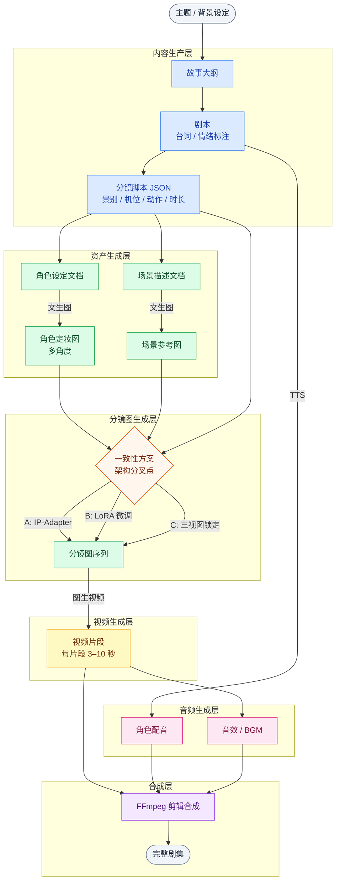
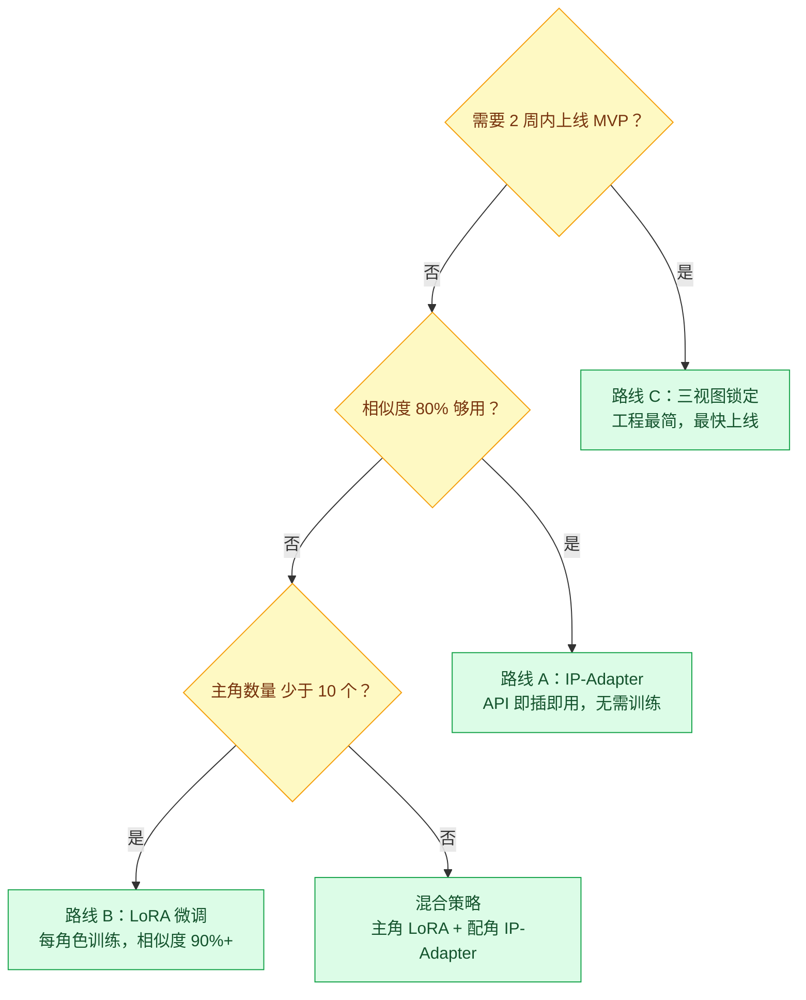
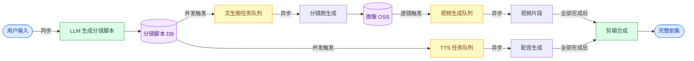

# AI 漫剧自研平台 · 技术全景与选型手册

> **文档职责**：覆盖 AI 漫剧自研平台从剧本到成片的完整技术栈，包含各模块能力边界、核心难点与 API→本地部署迁移路径
> **适用场景**：选型决策、技术路线规划、各模块 API 接入、本地部署替换评估
> **目标读者**：平台开发者 / 架构师，具备 API 集成经验，正在构建 AI 漫剧自研平台
> **维护规范**：新增或替换模型时同步更新对应模块的方案对比表；价格变动直接修改表格；核心难点有新解法时在对应小节注明日期

---

## 一、全流程架构

每个模块是一个**独立可替换单元**，初期用 API 跑通流程，后期按 ROI 逐模块替换为本地部署。



### 模块边界速览

| 模块 | 输入 | 输出 | 替换维度 |
|------|------|------|---------|
| 内容生产 | 主题 / 背景 | 分镜脚本（JSON） | LLM 提供商 |
| 角色 / 场景资产 | 设定文档 | 定妆图、参考图（PNG） | 文生图模型 |
| 分镜图生成 | 脚本 + 参考图 | 分镜图序列 | **一致性方案（最关键）** |
| 视频生成 | 分镜图 | 视频片段（.mp4） | 视频模型 |
| 语音合成 | 台词文本 | 角色配音（.wav） | TTS 模型 |
| 音效 / BGM | 场景描述 | 音频文件 | 音效工具 |
| 剪辑合成 | 全部素材 | 完整剧集 | FFmpeg / 云剪辑 |

---

## 二、核心难点总览

> 先建立全局认知，三个难点贯穿整个平台设计，后续各节会深入展开。

### 难点一：角色一致性（最核心，影响整个架构）

AI 文生图模型默认每次生成全新内容，无"记忆"。一集 5 分钟漫剧约 60 个镜头，要让同一角色在所有镜头中保持外貌一致，需要专门的一致性技术方案。**这个决策会锁定整个图像生成模块的架构，必须最先确定。**

三条路线，选一条，不要混用：

| 路线 | 原理 | 相似度 | 工程复杂度 | 适合时机 |
|------|------|--------|-----------|---------|
| **A: IP-Adapter / 全能参考** | 推理时注入参考图特征 | 70–80% | 低 | MVP 快速上线 |
| **B: LoRA 微调** | 针对角色训练专属权重 | 90%+ | 高（每角色训练）| 质量驱动阶段 |
| **C: 三视图锁定** | 三视图作为强约束输入 | 75–85% | 极低 | 最快上线，即梦/LibTV 方案 |

### 难点二：视频生成管道（最复杂的工程问题）

视频生成不是单次 API 调用，而是一套**异步任务系统**。一集 60 个镜头 = 60 个并发异步任务，每个任务需 1–5 分钟。需要专门设计：任务队列、状态轮询、失败重试、进度推送、成本熔断。

### 难点三：质量 × 成本的权衡

一集 5 分钟漫剧的成本区间很大，选型不同差距超过 5 倍：

| 方案定位 | 成本估算 / 集 | 核心差异 |
|---------|-------------|---------|
| 极低成本 MVP | ¥25–35 | DeepSeek + Wanx + Kling |
| 质量均衡 | ¥60–100 | Claude + FLUX + Kling |
| 效果优先 | ¥120–200 | Claude + FLUX + Seedance / Veo 3 |

---

## 三、各模块深度解析

---

### 3.1 内容生产层（LLM）

#### 职责

故事大纲 → 剧本（含台词 / 情绪标注）→ **结构化分镜脚本（JSON）**

分镜脚本是整个流程的"源数据"，其格式质量直接影响下游所有模块。

#### 核心难点

**1. 结构化输出稳定性**

LLM 生成的分镜脚本必须是合法 JSON，但 LLM 会偶发格式错误（多余逗号、中文引号、截断）。必须强制启用 Structured Output 功能，并添加解析失败后的重试逻辑。

- OpenAI：`response_format: {"type": "json_schema", "json_schema": {...}}`
- Anthropic：Tool Use 模式强制 JSON 输出
- 其他模型：Prompt 内注入严格 JSON 示例 + 正则校验 + 失败重试

**2. 长剧情一致性**

跨集的角色名、外貌设定、世界观细节容易漂移。解决方案：维护一份"角色圣经"JSON（角色名/外貌关键词/性格），每次 LLM 调用都通过 System Prompt 携带。

**3. 分镜脚本质量**

LLM 不懂镜头语言，需要精心设计 Prompt，明确要求每个镜头输出：景别 / 机位 / 角色情绪 / 肢体动作 / 与上一镜头的衔接方式。

**建议的分镜脚本 JSON 格式：**

```json
{
  "shot_id": "ep01_s01_003",
  "duration": 5,
  "shot_type": "中景",
  "camera_angle": "平视",
  "characters": [
    {"name": "凌霄", "emotion": "愤怒", "action": "转身离去，衣摆飘动"}
  ],
  "scene": "咖啡厅室内，傍晚暖光，背景模糊",
  "dialogue": "你根本不明白。",
  "transition": "切"
}
```

#### 方案对比

| 模型 | 推荐场景 | 价格 | OpenAI 兼容 | 本地替换 |
|------|---------|------|------------|---------|
| **Claude Sonnet 4.6** 🏆 | 创意写作最强，角色对话、分镜脚本生成质量最优 | $3 / $15 per M tokens | ❌ 原生 SDK | ❌ 无等效开源 |
| **DeepSeek V3** 💰 | 中文剧本批量生产，性价比首选 | ¥0.27 / M tokens | ✅ | ✅ Ollama（需 80GB+ VRAM）|
| **Qwen3-235B** 🏆💰 国内 | 中文综合最优，有免费额度 | ¥0.8 / M tokens | ✅ | ✅ 开源，需高端 GPU |
| **GPT-4o** | 多模态（可读参考图生成脚本）| $2.5 / $10 per M tokens | ✅ | ❌ |
| **Gemini 2.5 Pro** | 超长上下文（2M token），整季剧本处理 | $1.25 / $10 per M tokens | ❌ | ❌ |
| **DeepSeek R1**（推理）| 复杂世界观构建、逻辑验证 | ¥1.0 / M tokens | ✅ | ✅ 开源 |
| **Qwen3-30B-A3B** 💰 | 轻量批量任务，极低成本 | ¥0.2 / M tokens | ✅ | ✅ |

> **架构建议**：用 OpenAI 兼容接口统一封装所有 LLM 调用。DeepSeek / Qwen / 豆包均支持此格式，切换只需改 `base_url` + `model`，业务代码不动。Claude 用原生 SDK，单独封装。

#### API → 本地迁移路径

```
早期：Claude Sonnet 4.6 API（质量优先，验证 Prompt 模板效果）
     ↓ Prompt 模板稳定后，评估是否需要降成本
中期：DeepSeek V3 API（性价比，中文剧本）
     ↓ 月调用量超 5000 万 tokens 时评估本地部署成本
后期：本地 DeepSeek V3（Ollama，需 2×A100 或同等 GPU）
     注意：LLM 本地部署门槛最高，量不够大时 API 反而更划算
```

---

### 3.2 文生图层（角色资产 + 场景资产 + 分镜图）

#### 职责

- **角色资产**：根据角色设定文档生成定妆图（正 / 侧 / 背面），作为整剧的视觉基准
- **场景资产**：生成各场景参考图
- **分镜图**：结合分镜脚本 + 参考图，生成每个镜头的高质量图像（最终送入视频生成）

#### 哪些资产需要多视图？

不是所有资产都需要三视图，按出镜频率和重要性决定：

| 资产类型 | 所需视图 | 原因 |
|---------|---------|------|
| 主角 | 正面 + 3/4 侧面 + 侧面 + 背面 | 各种构图都会用到，基准要全 |
| 配角（戏份多）| 正面 + 3/4 侧面 | 基本够用 |
| 配角（戏份少）| 正面一张 | 够了 |
| 场景 | 1 张建立镜头（establishing shot）| 确立光线 / 色调 / 布局基准 |
| 标志性道具（武器 / 特定物品）| 1–2 张 | 反复出现需保持外形一致 |
| 普通背景道具 | 不单独生成 | 在场景描述 Prompt 里写文字即可 |

#### 如何生成外貌一致的多视图资产

这是资产生成阶段的核心问题：如何让同一个角色的正面图、侧面图、背面图外貌一致。

**方法一：单次调用多视图（优先尝试）**

在一次调用里让模型生成角色的多个角度，天然保证视角间外貌一致，然后裁切保存各视角：

```
Prompt：
"character design sheet, same female character,
front view | 3/4 view | side view | back view,
[外貌关键词：发色/发型/服装/体型],
consistent appearance across all views,
white background, anime style"
```

GPT-Image-2 和 Wanx2.1 对"character sheet"格式理解较好，优先用这两个模型做资产生成。

**方法二：以首图为参考迭代生成（备用）**

先生成正面图，再以正面图为参考输入生成其他视角。适用于方法一质量不满意时：

```python
# 第一步：生成正面定妆图（无参考）
front_view = image_api.generate(
    prompt="[style] female character, front view, [外貌关键词]"
)

# 第二步：以正面图为参考，生成侧面（IP-Adapter 注入）
side_view = image_api.generate(
    prompt="[style] same character, side view, [外貌关键词]",
    reference_image=front_view.url,
    reference_weight=0.7
)
```

生成完成后，将所有视角 URL 存入角色资产库，后续分镜生成统一从这里取用。

#### 核心难点

**1. 画风一致性**

漫剧要求全剧所有镜头保持统一画风（线条风格 / 配色方案 / 阴影画法）。解决方案：维护一份全局 Style Prompt 模板，所有图像生成调用都强制注入。

**2. 漫画文字渲染**

在图像内嵌入中文对话气泡是漫剧的高频需求，但大多数文生图模型对中文字符渲染较差。GPT-Image-2 目前表现最好，其他模型通常需要后期在合成层叠加字幕。

**3. 构图精准度**

分镜脚本要求特定景别（特写 / 中景 / 远景），模型不一定严格遵从。需要在 Prompt 中强化景别关键词：`extreme close-up`（特写）、`medium shot`（中景）、`wide shot`（远景）。

#### 方案对比

| 模型 | 漫画 / 动漫风 | 中文理解 | 文字渲染 | 价格 | 本地替换 |
|------|------------|---------|---------|------|---------|
| **FLUX 1.1 Pro Ultra** 🏆 | ⭐⭐⭐⭐⭐ | 一般 | ❌ | $0.04–0.06 / 张 | ✅ FLUX 开源 |
| **Wanx2.1** 🏆 国内 | ⭐⭐⭐⭐⭐ 国风动漫 | ⭐⭐⭐⭐⭐ | ❌ | ¥0.14 / 张 | ❌ |
| **GPT-Image-2** 🔥 | ⭐⭐⭐⭐ | ⭐⭐⭐ | ✅ 近完美 | $8 / $30 per M tokens | ❌ |
| **Imagen 3** 🏆 | ⭐⭐⭐⭐⭐ | 一般 | ❌ | $0.04 / 张 | ❌ |
| **HunyuanImage 2.1** | ⭐⭐⭐⭐ | ⭐⭐⭐⭐ | ❌ | 腾讯云按量 | ✅ HunyuanDiT 开源 |
| **MiniMax Image-01** 💰 | ⭐⭐⭐ | ⭐⭐⭐ | ❌ | $0.01 / 张 | ❌ |

**本地部署方案：**

| 工具 | 说明 | 显存要求 | LoRA 支持 |
|------|------|---------|---------|
| **FLUX + ComfyUI** 🏆 | 最成熟的本地工作流，LoRA 生态最丰富 | 12–24GB VRAM | ✅ 最优 |
| **SD 3.5 + ComfyUI** | IP-Adapter 支持完善 | 8GB+ VRAM | ✅ |
| **Stable Diffusion WebUI** | 插件最多，IP-Adapter / ControlNet 支持好 | 6GB+ VRAM | ✅ |

> **架构建议**：设计 `ImageGenerator` 接口，`FluxAdapter` / `WanxAdapter` / `LocalComfyUIAdapter` 分别实现。初期用 API 确定风格和 Prompt 模板，迁移本地只换 Adapter，业务层不动。

#### API → 本地迁移路径

```
早期：Wanx2.1 API（国内漫画风首选）
     或 FLUX API via fal.ai（国际 / 高质量）
     ↓ 确定目标画风，积累 Prompt 模板后
中期：评估是否需要 LoRA 训练（角色一致性要求高则必须）
     → 用 Replicate / fal.ai 云端训练 LoRA，成本 $1–3 / 次
     ↓ 月生成量 > 5 万张时
后期：本地 FLUX + ComfyUI（RTX 4090 × 1–4 张，视并发量）
```

---

### 3.3 分镜一致性（平台架构核心决策）

> **这是 AI 漫剧平台最核心的技术挑战，也是架构分叉点。** 选哪条路线，整个图像模块的设计就锁定了，不要中途切换。

#### 两阶段一致性问题（必须分开理解）

一致性不是一个问题，是两个独立的问题，分别在不同阶段解决：

```
阶段一（3.2 节）：资产生成一致性
  → "如何生成一套各角度外貌一致的角色参考图"
  → 解法：单次多视图生成 / 以首图为参考迭代生成
  → 这是一次性工作，每个角色只做一次

阶段二（本节）：分镜引用一致性
  → "如何让后续 60 个镜头里的角色，都和资产阶段的脸一样"
  → 解法：三条路线（见下文）
  → 这影响每一次分镜图生成调用
```

直接调用文生图模型而不传入参考图，无法解决阶段二的问题——模型没有"记忆"，每次都会生成不同的脸。

#### 三条技术路线详解

**路线 A：IP-Adapter / 全能参考**

推理时将角色参考图特征注入生成过程，每次分镜图生成都"看着"这张脸来画。无需训练，即插即用。

| 实现方式 | 相似度 | 成本 | API 状态 |
|---------|--------|------|---------|
| MiniMax 主体参考（`subject_reference` 参数）| ~80% | $0.01 / 张 | ✅ |
| fal.ai FLUX + IP-Adapter | ~75% | $0.05 / 张 | ✅ |
| ComfyUI + IP-Adapter（本地）| ~75–85% | GPU 成本 | ✅ |

**实际 API 调用（分镜图生成时）：**

```python
# MiniMax：通过 subject_reference 参数注入角色参考图
def generate_panel_minimax(shot, character_assets):
    return requests.post("https://api.minimax.chat/v1/image_generation", json={
        "model": "image-01",
        "prompt": f"{GLOBAL_STYLE_TEMPLATE} {shot.shot_type}, {shot.camera_angle}, "
                  f"场景: {shot.scene}, 角色动作: {shot.action}, 情绪: {shot.emotion}",
        "subject_reference": [
            {"image": character_assets.front_view_url}   # 角色资产库里的参考图 URL
        ]
    })

# fal.ai FLUX + IP-Adapter：通过 ip_adapter_image 参数注入
def generate_panel_flux(shot, character_assets):
    return fal_client.run("fal-ai/flux-dev/image-to-image", arguments={
        "prompt": f"{GLOBAL_STYLE_TEMPLATE} {shot.description}",
        "ip_adapter_image_url": character_assets.front_view_url,
        "ip_adapter_scale": 0.7    # 越高越像参考图，但会限制构图自由度
    })
```

适合：快速上线，可接受 70–80% 相似度，无需角色训练。

---

**路线 B：LoRA 微调**

用 20–50 张角色参考图训练专属模型权重，该模型只"认识"这个角色。训练是一次性工作，训练完后每次调用自动保持一致。

| 工具 | 训练成本 | 相似度 | 本地替换 |
|------|---------|--------|---------|
| Replicate（云端）| ~$0.5–2 / 次 | 90%+ | ✅ Kohya 开源 |
| fal.ai 训练 | ~$1–3 / 次 | 90%+ | ✅ SimpleTuner 开源 |
| 本地 Kohya 🔓 | GPU 成本 | 90%+ | — 本身即开源 |

**实际调用（训练 + 生成）：**

```python
# 第一步：训练角色 LoRA（只做一次）
training = replicate.run(
    "ostris/flux-dev-lora-trainer",
    input={
        "input_images": character_reference_zip_url,  # 20–50 张角色图打包
        "trigger_word": "LINGHAO_CHAR",               # 自定义触发词，唯一即可
        "steps": 1000
    }
)
lora_weights_url = training.output   # 保存这个 URL，后续所有调用都用它

# 第二步：生成分镜图时加载 LoRA（每次分镜调用都这样）
def generate_panel_lora(shot):
    return replicate.run(
        "black-forest-labs/flux-dev-lora",
        input={
            "prompt": f"LINGHAO_CHAR, {GLOBAL_STYLE_TEMPLATE}, {shot.description}",
            "hf_lora": lora_weights_url,
            "lora_scale": 0.85
        }
    )
```

适合：主角数量可控（≤10 个），追求极致一致性，长期系列制作。

---

**路线 C：平台级三视图锁定**

将角色三视图 + 详细文字外貌描述同时作为参考输入，依赖模型理解能力自动保持一致。工程最简单，但相似度上限低于 A 和 B。

**实际 API 调用：**

```python
def generate_panel_3view(shot, character_assets):
    # 把三视图拼成一张图（或多图传入），配合详细外貌描述
    prompt = f"""
    {GLOBAL_STYLE_TEMPLATE}
    {shot.shot_type}, {shot.camera_angle}
    场景: {shot.scene}
    角色外貌（严格遵循）: {character_assets.appearance_description}
    当前动作: {shot.action}, 情绪: {shot.emotion}
    参考图中角色的外貌，保持相同发型/服装/体型/面部特征
    """
    return image_api.generate(
        prompt=prompt,
        reference_images=[character_assets.front_url, character_assets.side_url]
    )
```

适合：MVP 快速上线，即梦 / LibTV / 有戏 AI 均采用此方案。工程实现最简单，但一致性依赖底层模型理解能力，上限相对较低。

---

#### 选型决策



---

### 3.4 视频生成层

#### 职责

将分镜图（静态图）转为有动感的视频片段（通常 3–10 秒 / 片），再由剪辑层拼接成完整剧集。

#### 核心难点

**1. 全异步，必须设计任务管理系统**

所有视频生成 API 都是提交任务 → 轮询状态的异步模式，每个片段需要 1–5 分钟。一集 60 个镜头意味着 60 个并发异步任务。没有任务队列和状态管理，整个生成流程无法可靠运行。

**2. 视频内角色一致性**

即使分镜图角色一致，视频模型也可能在 5 秒内让角色面部发生漂移。**主体参考（Subject Reference）功能**是关键参数，不是所有模型都支持，选型时必须确认。

**3. 首尾帧控制**

指定第一帧和最后一帧，AI 自动补全中间的动态过程，用于控制镜头运动轨迹（推拉摇移）。漫剧中大量用于场景转换和角色动作起止。

**4. 良品率**

生成结果不稳定，可能出现角色扭曲、运动失真、面部崩坏。Seedance 2.0 宣称良品率 90%+，其他模型约 70–80%。需要在流程中设计审核节点（人工 or 自动评分）。

#### 方案对比

| 模型 | 首尾帧 | 主体参考 | 音画同步 | 价格 | API 状态 | 本地替换 |
|------|--------|---------|---------|------|---------|---------|
| **Kling 3.0** 🏆 首选 | ✅ 最成熟 | ✅ | ❌ | ¥0.35 / 5秒 | ✅ 即时可用 | ❌ |
| **Wan2.5** | ✅ | ❌ | ✅ | ¥0.3–0.6 / 5秒 | ✅ | ✅ 已开源 |
| **Seedance 2.0** 🏆 效果 | ✅ | ✅ | ✅ | ¥0.4–0.8 / 5秒 | ⚠️ 需企业资质 | ❌ |
| **HappyHorse-1.0** 🔥 | ✅ | ✅ | ✅ | ~$0.03–0.06 / 秒 | 🔜 即将开放 | 🔜 即将开源 |
| **Veo 3** 🏆 国际 | ✅ | ✅ | ✅ | $0.05 / 秒 | ✅ Vertex AI | ❌ |
| **HunyuanVideo I2V** 🔓 | ✅ | ✅ | ❌ | 腾讯云按量 | ✅ | ✅ 130B 开源 |
| **Hailuo S2V（海螺）** | ❌ | ✅ | ❌ | ¥0.3–0.5 / 5秒 | ✅ | ❌ |
| **Runway Gen-4** | ✅ | ❌ | ❌ | $0.05 / 秒 | ✅ | ❌ |
| **Sora 2** | ✅ | ✅ | ❌ | $0.03–0.08 / 秒 | 🔜 2026 下半年 | ❌ |

#### 异步任务轮询（必须实现的模式）

```python
async def generate_video_clip(shot: Shot) -> str:
    # 提交任务
    task = await client.post("/v1/videos/image2video", json={
        "model": "kling-v1-5",
        "image": shot.first_frame_url,
        "image_tail": shot.last_frame_url,
        "duration": shot.duration,
        "mode": "pro"
    })
    task_id = task["task_id"]

    # 轮询（指数退避，避免频繁请求）
    for attempt in range(20):
        await asyncio.sleep(min(8 * (1.2 ** attempt), 60))
        status = await client.get(f"/v1/videos/{task_id}")
        if status["status"] == "completed":
            return status["result"]["video_url"]
        if status["status"] == "failed":
            raise VideoGenerationError(status["error"])

    raise TimeoutError(f"Task {task_id} timed out")
```

**任务队列推荐**：Celery + Redis（Python）或 BullMQ（Node.js），支持并发控制、失败重试、优先级调度。

#### API → 本地迁移路径

```
早期：Kling 3.0 API（首尾帧最成熟，即时可用，首选）
     ↓ 月生成量 > 1000 个片段时评估成本
中期：Wan2.5 API（若需要音画同步，或评估本地迁移路线）
     ↓ 需要私有化或成本进一步降低时
后期：Wan2.5 本地部署（已开源，门槛相对低）
     或 HunyuanVideo I2V（130B 开源，需多卡集群，门槛高）
     注意：视频生成是本地化门槛最高的模块，最后迁移
```

---

### 3.5 语音合成层

#### 职责

将分镜脚本中的台词文本转为角色配音（.wav），需要每个角色声音独特，并支持情绪控制与声音克隆。

#### 核心难点

**1. 多角色声音管理**

每个角色对应一个固定 `voice_id`，需维护"角色名 → voice_id"映射表，确保整剧声音一致。声音克隆后的 `voice_id` 同样写入这张映射表。

**2. 情绪匹配**

分镜脚本标注了角色情绪，TTS 需要能接受情绪参数。不是所有模型都支持情绪控制，选型时确认。

**3. 时间轴对齐**

生成的配音时长未必和视频片段完全匹配，超长或过短都需要后期处理（FFmpeg 变速或静音填充）。

#### 方案对比

| 模型 | 中文质量 | 情绪控制 | 声音克隆 | 价格 | 本地替换 |
|------|---------|---------|---------|------|---------|
| **MiniMax Speech-02** 🏆💰 | ⭐⭐⭐⭐⭐ | ✅ 6 种情绪 | ✅ 6 秒克隆 | ~$0.5 / 百万字符 | ❌ |
| **CosyVoice 2** 🔓 | ⭐⭐⭐⭐⭐ 中文 | ✅ | ✅ | ¥0.1 / 千字；开源自部署免费 | ✅ 单卡 RTX 3090 可跑 |
| **Seed-TTS 2.0** | ⭐⭐⭐⭐⭐ 中文 | ✅ 多风格 | ✅ | ¥0.1 / 千字 | ❌ |
| **ElevenLabs Multilingual v2** 🏆 国际 | ⭐⭐⭐⭐ | ✅ | ✅ 10 秒克隆 | $0.18 / 千字符 | ❌ |
| **gpt-4o-mini-tts** | ⭐⭐⭐⭐ | ✅ 指令可控 | ❌ | $15 / 百万字符 | ❌ |

**推荐优先级（中文漫剧）**：MiniMax Speech-02 > CosyVoice 2 API > Seed-TTS 2.0

**配音请求示例（MiniMax）：**

```json
POST api.minimax.chat/v1/t2a_v2
{
  "model": "speech-02-hd",
  "text": "你根本不明白。",
  "voice_id": "female-shaonv",
  "speed": 0.9,
  "emotion": "sad"
}
```

**声音克隆：**

```json
POST api.minimax.chat/v1/voice_clone
{"audio_file": "base64音频（≥6秒）", "voice_name": "角色A"}
// 返回 voice_id，写入角色→voice_id 映射表
```

#### API → 本地迁移路径

```
早期：MiniMax Speech-02 API（全球最低价 + 中文最优，最佳性价比）
     ↓ 积累声音克隆资源，确认声音库后
后期：CosyVoice 2 本地部署（开源，3B 模型，RTX 3090 单卡可跑）
     迁移收益最明显，TTS 是最容易本地化的模块，优先迁移
```

---

### 3.6 音效 & BGM 层

#### 职责

为视频片段配上场景音效（脚步声 / 环境音 / 特效音）和背景音乐。

#### 核心难点

这是目前**技术最薄弱**的独立模块：
- 专业 AI 音效生成 API 数量少，质量参差
- 音效与视频的时间戳对齐完全依赖后期处理
- BGM 生成质量可用，但 AI 生成作品的版权归属目前仍存争议

**最优解**：使用 Wan2.5 做视频生成，原生音画同步一并解决音效和 BGM，省去该模块独立集成。

#### 方案对比

| 工具 | 能力 | 价格 | 说明 |
|------|------|------|------|
| **Wan2.5 内置音频** 🏆 | 视频 + 音效 + BGM 一体生成 | 包含在视频费用内 | 推荐，最省事 |
| **ElevenLabs Sound Effects** | 文字描述 → 音效 | 消耗字符配额 | 质量好，API 完善 |
| **Suno**（非官方 API）| AI BGM 生成，风格多样 | 订阅制 ~$10 / 月 | 官方 API 限量开放 |
| **本地音效库** 🔓 | 固定音效资源 | 免费 | Freesound / ZapSplat |

> **架构建议**：如选 Wan2.5 做视频，音效问题顺带解决。否则优先用本地音效库 + ElevenLabs SFX，BGM 用预置素材库，这个模块无需过早投入。

---

### 3.7 剪辑合成层

#### 职责

将视频片段 + 配音 + 音效 + BGM 合并为完整剧集，处理字幕 / 转场 / 音量混合。

#### 核心难点

1. **音视频时长对齐**：配音时长和视频片段时长未必完全匹配，需要变速或静音填充处理
2. **字幕时间轴**：台词字幕的时间轴要和配音精确同步，样式要全剧统一
3. **转场风格**：镜头间转场方式（切 / 淡入淡出 / 叠化）要符合漫剧风格，全剧保持一致

#### 推荐方案

| 工具 | 适用场景 | 成本 |
|------|---------|------|
| **FFmpeg（自研）** 🏆 | 完全可控，自研平台首选 | 开源免费 |
| **MoviePy**（Python 封装）| 代码集成简单，快速原型 | 开源免费 |
| **剪映 API** | 快速集成，字幕 / 特效丰富 | 商业授权 |

**FFmpeg 核心合成命令：**

```bash
# 按顺序拼接视频片段（需先生成 clips.txt 文件列表）
ffmpeg -f concat -safe 0 -i clips.txt -c copy merged.mp4

# 混合音轨：视频原声 + 配音（全音量）+ BGM（30% 音量）
ffmpeg -i video.mp4 -i voiceover.wav -i bgm.mp3 \
  -filter_complex \
  "[1:a]volume=1.0[v];[2:a]volume=0.3[b];[v][b]amix=inputs=2[audio]" \
  -map 0:v -map "[audio]" -c:v copy output.mp4
```

> **架构建议**：FFmpeg 是开源的，合成层从一开始就是"本地"的，无需迁移。重点投入字幕生成和时间轴对齐的自动化。

---

## 四、平台工程层

> 把 7 个模块串成可靠的生产管道，是平台开发的核心工程工作。

### 4.1 流程编排设计



### 4.2 工程关键点

| 关注点 | 方案 |
|--------|------|
| 任务队列 | Celery + Redis（Python）/ BullMQ（Node.js）|
| 状态机 | 每个片段维护状态：`pending → processing → completed / failed` |
| 并发控制 | 视频 API 有并发上限，用信号量控制同时进行的请求数 |
| 进度推送 | WebSocket 将生成进度实时推送前端 |
| 成本熔断 | 每集设置最高成本上限，超出自动暂停并告警 |
| 失败重试 | 视频生成失败率约 10–20%，必须实现自动重试（建议最多 3 次）|

### 4.3 单集成本估算（5 分钟 · 约 60 个镜头）

| 模块 | 极低成本方案 | 效果优先方案 |
|------|------------|------------|
| LLM 分镜脚本 | DeepSeek V3 · ¥0.01 | Claude Sonnet 4.6 · ¥0.3 |
| 文生图（60 张）| Wanx2.1 · ¥8.4 | FLUX Ultra · ¥18 |
| 视频生成（300 秒）| Kling 3.0 · ¥21 | Seedance 2.0 · ¥48 |
| TTS 配音 | MiniMax · ¥0.05 | MiniMax · ¥0.05 |
| 音效 / BGM | Wan2.5 内置 · ¥0 | ElevenLabs SFX · ¥2 |
| **合计** | **≈ ¥30** | **≈ ¥68** |

---

## 五、竞品平台分析

> 参考功能设计方向，或 MVP 上线前让运营团队先体验。

| 平台 | 所属 | 核心优势 | 自研参考价值 | API | 价格 |
|------|------|---------|------------|-----|------|
| **即梦 AI** 🔥 | 字节跳动 | 全流程体验最流畅，Seedance 2.0，首尾帧，对口型 | 产品交互设计参考 | ❌ 仅网页 | 69–499 元 / 月 |
| **可灵 AI** | 快手 | MAU 1200 万，商业最成熟，**同时开放 API** | 首尾帧 API 设计参考 | ✅ | 66–399 元 / 月 |
| **LibTV** 🔥 | LiblibAI | 无限画布，全流程，积分消耗比即梦低 92% | 工作流 UX 设计参考 | ✅ Agent 接口 | 499 元 / 年起 |
| **有戏 AI** | 风平智能 | 5 万字超长剧本，¥0.1 / 秒视频 | 成本定价参考 | ❌ 内测 | ¥0.1 / 秒 |
| **纳米漫剧** | 360 集团 | 工业级，单集 30–60 分钟完成 | B 端能力参考 | ❌ B 端定制 | 企业定制 |
| **Runway** | Runway | 电影感首选，Multi-Shot App | 国际竞品功能参考 | ✅ | $15–144 / 月 |

**自研平台的核心竞争力**：竞品平台模型固定、一致性方案内置、成本不可控。自研的价值在于：模型自由替换、成本可优化、功能可定制、数据可积累。

---

## 六、推荐方案与迁移路径

### 6.1 按场景选型：四套完整组合

> 根据当前阶段和目标直接选一套，不需要从零设计选型。

#### 方案一：💰 极低成本 · 国内 API 优先（快速验证 MVP）

```
LLM:     DeepSeek V3              ¥0.27 / M tokens
文生图:   通义万相 Wanx2.1         ¥0.14 / 张
一致性:   路线 C — 平台级三视图锁定  工程实现，无额外费用
视频:     可灵 Kling 3.0           ¥0.35 / 5秒（首尾帧支持最成熟）
配音:     MiniMax Speech-02        全球最低价
音效:     ElevenLabs SFX           按量
合成:     FFmpeg                   开源免费

预计单集成本：¥25–35
```

#### 方案二：⭐ 效果优先 · 工作室级

```
LLM:     Claude Sonnet 4.6        $3 / $15 per M tokens
文生图:   FLUX 1.1 Pro Ultra       $0.05 / 张（画质天花板）
一致性:   路线 B + A 混合
          → 主角：LoRA 微调（Replicate 训练，$1–3 / 次，相似度 90%+）
          → 配角：IP-Adapter（MiniMax 主体参考，相似度 80%）
视频:     Seedance 2.0             音画同步，良品率 90%+（需企业资质）
          或 Kling 3.0             API 即时可用，无需资质
配音:     MiniMax Speech-02        声音克隆 + 情绪控制
音效:     Wan2.5 内置              随视频生成，无需额外集成
合成:     FFmpeg + 自研字幕系统

预计单集成本：¥60–100
```

#### 方案三：🌍 国际化 · 海外市场

```
LLM:     Claude Sonnet 4.6 / GPT-4o
文生图:   GPT-Image-2（文字渲染强，漫画气泡）+ FLUX（高画质分镜）
一致性:   路线 A — IP-Adapter（fal.ai）
视频:     Runway Gen-4 / Veo 3
配音:     ElevenLabs Multilingual v2（30 语言，情感自然）
音效:     ElevenLabs Sound Effects
合成:     FFmpeg

预计单集成本：$15–30
```

#### 方案四：🔓 开源自部署 · 长期降本

```
LLM:     DeepSeek V3 / R1 本地部署（Ollama）或 API
文生图:   FLUX 本地（ComfyUI，12–24GB VRAM）
一致性:   IP-Adapter 本地 + LoRA 本地训练（Kohya）
视频:     HunyuanVideo I2V（腾讯开源，需多卡集群）
          或 HappyHorse（即将开源）
配音:     CosyVoice 2（开源，RTX 3090 单卡可跑）
音效:     本地音效库 / ElevenLabs API
合成:     FFmpeg

边际成本：接近零（主要是电费和硬件折旧）
前提：需要 GPU 服务器，初期硬件投入较大
```

---

### 6.2 按时间演进：三阶段迁移路径

### 阶段一：MVP 验证（0–3 个月）

```
目标：跑通全流程，验证产品方向

LLM:      DeepSeek V3 API           ¥0.27 / M tokens
文生图:    通义万相 Wanx2.1          ¥0.14 / 张
一致性:    路线 C — 平台级三视图锁定   无额外费用
视频:      可灵 Kling 3.0 API        ¥0.35 / 5秒
配音:      MiniMax Speech-02         全球最低价
音效:      Wan2.5 内置 or 本地音效库   几乎零成本
合成:      FFmpeg                    开源免费

预计单集成本：¥25–35
```

### 阶段二：质量提升（3–6 个月）

```
目标：提升角色一致性，构建用户心智

LLM:      Claude Sonnet 4.6          剧本和分镜脚本质量显著提升
文生图:    FLUX 1.1 Pro Ultra         画质升级
一致性:    路线 A + B 混合
           → 主角：Replicate / fal.ai 训练 LoRA（$1–3 / 次，90%+ 相似度）
           → 配角：IP-Adapter（MiniMax 主体参考，80%）
视频:      Kling 3.0 or Seedance 2.0（申请企业资质）
配音:      MiniMax Speech-02          积累声音克隆角色库
合成:      FFmpeg + 自研字幕系统

预计单集成本：¥60–100
```

### 阶段三：本地化降本（6 个月后）

```
目标：降低边际成本，构建竞争壁垒

迁移优先级（按 ROI 高低排序）：

1. TTS → CosyVoice 2 本地部署
   难度：低 | 硬件：RTX 3090 单卡 | 降本幅度：大（TTS 调用量通常很高）

2. 文生图 → 本地 FLUX + ComfyUI
   难度：中 | 硬件：RTX 4090 × 1–4 | 前提：LoRA 训练流程已稳定

3. 视频 → 本地 HunyuanVideo I2V 或 Wan2.5
   难度：高 | 硬件：A100 多卡集群 | 最后迁移，门槛最高

4. LLM → 本地 DeepSeek V3
   注意：月调用量不够大时，API 反而比买 GPU 更划算

最终架构：
LLM:    DeepSeek V3 API（量不到时）或 本地 Ollama
文生图:  本地 FLUX + ComfyUI（含自训 LoRA）
视频:    本地 HunyuanVideo I2V 或 API（视成本）
配音:    CosyVoice 2 本地
合成:    FFmpeg（本就是本地）
```

---

## 七、API 接入速查

### 7.1 各厂商 Base URL 与鉴权

| 厂商 | Base URL | Auth Header | 控制台 |
|------|----------|------------|--------|
| OpenAI | `api.openai.com/v1` | `Authorization: Bearer sk-xxx` | platform.openai.com |
| Anthropic | `api.anthropic.com/v1` | `x-api-key: sk-ant-xxx` | console.anthropic.com |
| Google AI Studio | `generativelanguage.googleapis.com` | `?key=AIzaSy-xxx` | aistudio.google.com |
| Google Vertex AI | `us-central1-aiplatform.googleapis.com` | `Bearer {gcloud token}` | console.cloud.google.com |
| DeepSeek | `api.deepseek.com/v1` | `Authorization: Bearer xxx` | platform.deepseek.com |
| 阿里云百炼 | `dashscope.aliyuncs.com` | `Authorization: Bearer xxx` | dashscope.console.aliyun.com |
| 字节 / 火山引擎 | `ark.cn-beijing.volces.com/api/v3` | `Authorization: Bearer xxx` | console.volcengine.com/ark |
| 腾讯混元 | `hunyuan.tencentcloudapi.com` | TC3-HMAC-SHA256 签名 | console.cloud.tencent.com |
| MiniMax | `api.minimax.chat/v1` | `Authorization: Bearer xxx` | platform.minimaxi.com |
| ElevenLabs | `api.elevenlabs.io/v1` | `xi-api-key: xxx` | elevenlabs.io/app |
| 可灵 | `api.klingai.com/v1` | `Authorization: Bearer xxx` | klingai.com/developer |
| Runway | `api.runwayml.com/v1` | `Authorization: Bearer xxx` | app.runwayml.com |
| fal.ai（多模型代理）| `fal.run` | `Authorization: Key xxx` | fal.ai/dashboard/keys |

### 7.2 Kling 首尾帧请求示例

```json
POST api.klingai.com/v1/videos/image2video
{
  "model": "kling-v1-5",
  "image": "https://首帧图片URL",
  "image_tail": "https://尾帧图片URL",
  "duration": 5,
  "mode": "pro"
}
```

### 7.3 MiniMax 主体参考（角色一致性）请求示例

```json
POST api.minimax.chat/v1/video_generation
{
  "model": "video-01",
  "prompt": "角色走入咖啡厅，环顾四周，表情凝重",
  "subject_reference": [{"image": "https://角色定妆图URL"}]
}
```

### 7.4 图像模块可插拔接口设计参考

```
ImageGenerator Interface
  ├── FluxAdapter          → API: fal.ai     / 本地: ComfyUI
  ├── WanxAdapter          → API: DashScope  / 本地: ❌
  ├── HunyuanAdapter       → API: 腾讯云     / 本地: HunyuanDiT 开源
  └── LocalComfyUIAdapter  → 本地直连，替换上述任一 API Adapter

# 迁移本地：只换 Adapter 实现，业务层代码不动
```

---

*📅 最后更新：2026-04-26 ｜ 以各平台官方文档为准*
