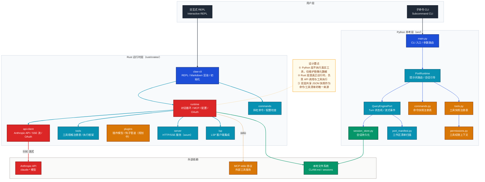
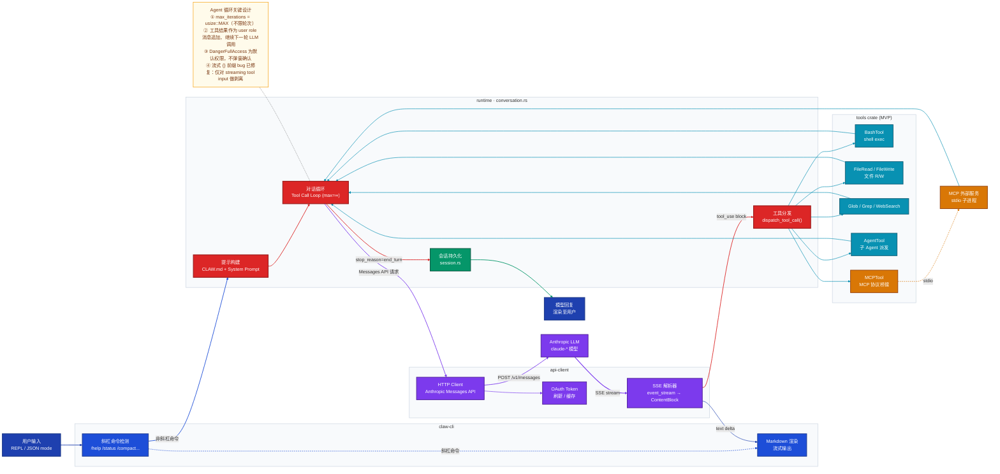
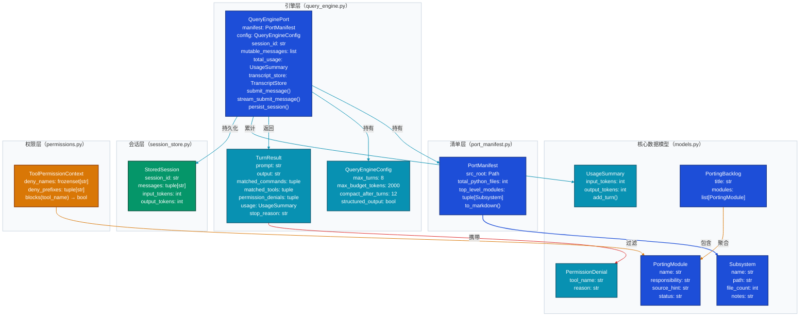

# claw-code 技术分析文档

---

## 一、项目定位

**claw-code** 是对 Claude Code（原代号 Claw Code）TypeScript 版本的干净室（clean-room）双语言重写项目，以 **Python 参考层 + Rust 运行时层** 的双轨架构，完整复刻原系统的 Agent Harness（智能体挂载框架）——即工具调度、对话状态管理、MCP 协议集成与 CLI 交互界面，核心目标是在不复制任何专有源码的前提下，研究并重现原系统的架构模式与运行时行为。

---

## 二、整体架构

### 2.1 架构风格

项目采用 **分层 + 双实现（Python/Rust）** 的混合架构：

| 维度 | 说明 |
|------|------|
| **架构风格** | 分层架构（CLI → Runtime → API/Tools/MCP） |
| **主语言** | Python 3.x（参考/清单层）+ Rust 2021（运行时层） |
| **构建工具** | Python 直接运行模块；Rust 使用 Cargo workspace |
| **对外接口** | CLI（交互式 REPL + 子命令）|
| **核心依赖** | Anthropic API（SSE 流式）、MCP stdio 协议 |

### 2.2 系统架构图

下图展示整体系统的双轨分层架构，重点关注 Python 参考层与 Rust 运行时层之间的职责边界，以及 Rust 运行时与 Anthropic API、工具系统的集成关系。



**设计要点：**

- Python 层是「镜像清单」而非「真实运行时」，其命令和工具均从 `reference_data/*.json` 快照加载，执行调用返回的是模拟消息而非真实操作。
- Rust 层是生产级运行时，`runtime` crate 的 `conversation.rs` 实现了真正的 Anthropic API 调用、工具循环与 MCP 客户端。
- 两层共享相同的「接口契约」（命令名/工具名），允许 Python 层做 parity audit（奇偶性审计）而不需要复制 Rust 代码。

### 2.3 核心模块职责

| 模块 | 所在层 | 核心职责 |
|------|--------|---------|
| `main.py` | Python | CLI 入口，argparse 子命令路由 |
| `PortRuntime` | Python | 提示词 token 匹配路由、会话引导、Turn 循环 |
| `QueryEnginePort` | Python | Turn 状态机、预算追踪、SSE 事件模拟、会话持久化 |
| `commands.py` / `tools.py` | Python | 从 JSON 快照加载命令/工具元数据注册表 |
| `port_manifest.py` | Python | 扫描 `src/` Python 文件，生成工作区清单 |
| `permissions.py` | Python | 按名称/前缀阻断工具访问的权限上下文 |
| `session_store.py` | Python | 将 `StoredSession` 持久化到本地文件 |
| `claw-cli` | Rust | 交互式 REPL、Markdown 渲染、`/init` 流程 |
| `runtime` | Rust | 对话循环、会话状态、MCP orchestration、OAuth、配置、提示构建 |
| `api-client` | Rust | Anthropic HTTP 客户端、SSE 解析、OAuth token 管理 |
| `tools` | Rust | MVP 工具规格注册表（shell/file/search/web/todo/skill/agent 等） |
| `commands` | Rust | 斜杠命令注册表（/help, /status, /compact, /model 等） |
| `plugins` | Rust | 插件模型与钩子管道（架构已搭建，运行时行为待实现） |
| `server` | Rust | axum HTTP/SSE 服务器（远端触发/JSON mode） |
| `lsp` | Rust | LSP 客户端集成（代码感知工具支持） |

---

## 三、核心执行链路

### 3.1 Python CLI 调用流（manifest/routing 层）

```mermaid
flowchart LR
    classDef userStyle     fill:#1e40af,stroke:#1e3a8a,stroke-width:2.5px,color:#fff
    classDef routeStyle    fill:#4f46e5,stroke:#3730a3,stroke-width:2px,color:#fff
    classDef svcStyle      fill:#0891b2,stroke:#155e75,stroke-width:2px,color:#fff
    classDef coreStyle     fill:#dc2626,stroke:#991b1b,stroke-width:2.5px,color:#fff
    classDef storeStyle    fill:#059669,stroke:#064e3b,stroke-width:2px,color:#fff
    classDef noteStyle     fill:#fffbeb,stroke:#f59e0b,stroke-width:1.5px,color:#78350f
    classDef layerStyle    fill:#f8fafc,stroke:#cbd5e0,stroke-width:1.5px

    USER["用户输入<br>CLI Prompt"]:::userStyle

    subgraph Entrypoint["入口层"]
        PARSE["argparse<br>子命令解析"]:::routeStyle
        MANIFEST["build_port_manifest()<br>扫描 src/ Python 文件"]:::svcStyle
    end
    class Entrypoint layerStyle

    subgraph Routing["路由层（PortRuntime）"]
        direction LR
        TOKENIZE["提示词 Tokenize<br>分词 / 归一化"]:::routeStyle
        SCORE_CMD["命令评分<br>遍历 PORTED_COMMANDS"]:::routeStyle
        SCORE_TOOL["工具评分<br>遍历 PORTED_TOOLS"]:::routeStyle
        MERGE["合并排序<br>按 score 降序"]:::routeStyle
        PERM_CHECK["权限推断<br>BashTool → denial"]:::coreStyle
    end
    class Routing layerStyle

    subgraph TurnEngine["Turn 引擎（QueryEnginePort）"]
        direction LR
        BUDGET["预算检查<br>max_turns / max_budget_tokens"]:::coreStyle
        SUBMIT["submit_message()<br>生成摘要输出"]:::svcStyle
        STREAM["stream_submit_message()<br>发出 SSE 事件序列"]:::svcStyle
        COMPACT["compact_messages_if_needed()<br>滑动窗口压缩历史"]:::routeStyle
    end
    class TurnEngine layerStyle

    subgraph Persist["持久化层"]
        TRANSCRIPT["TranscriptStore<br>临时追加日志"]:::storeStyle
        SESSION["save_session()<br>写入 StoredSession JSON"]:::storeStyle
    end
    class Persist layerStyle

    RESP["Turn 结果<br>TurnResult + 会话路径"]:::userStyle

    USER --> PARSE
    PARSE --> MANIFEST
    MANIFEST --> TOKENIZE
    TOKENIZE --> SCORE_CMD
    TOKENIZE --> SCORE_TOOL
    SCORE_CMD --> MERGE
    SCORE_TOOL --> MERGE
    MERGE --> PERM_CHECK
    PERM_CHECK --> BUDGET
    BUDGET -->|"未超限"| SUBMIT
    BUDGET -->|"超限"| RESP
    SUBMIT --> STREAM
    SUBMIT --> COMPACT
    COMPACT --> TRANSCRIPT
    TRANSCRIPT --> SESSION
    SESSION --> RESP

    NOTE["关键路径说明<br>① tokenize 用 set 去重，评分为 token 命中数<br>② BashTool 因破坏性操作被强制 denial<br>③ 超出 max_turns 时直接短路返回，不执行命令/工具<br>④ 历史以滑动窗口 compact，避免无限增长"]:::noteStyle
    NOTE -.- SUBMIT

    %% 边索引：0-16，共 17 条
    linkStyle 0 stroke:#1e40af,stroke-width:2px
    linkStyle 1,2 stroke:#4f46e5,stroke-width:2px
    linkStyle 3,4 stroke:#4f46e5,stroke-width:1.5px
    linkStyle 5,6 stroke:#0891b2,stroke-width:1.5px
    linkStyle 7 stroke:#4f46e5,stroke-width:2px
    linkStyle 8 stroke:#dc2626,stroke-width:2px
    linkStyle 9 stroke:#059669,stroke-width:2px
    linkStyle 10 stroke:#dc2626,stroke-width:1.5px,stroke-dasharray:4 3
    linkStyle 11,12 stroke:#0891b2,stroke-width:2px
    linkStyle 13,14 stroke:#059669,stroke-width:2px
    linkStyle 15,16 stroke:#059669,stroke-width:2px
```

下图展示从 `python3 -m src.main bootstrap <prompt>` 到会话持久化的完整端到端调用流，重点关注提示词路由（PortRuntime）与 Turn 状态机（QueryEnginePort）两个核心环节。



**流程要点：**

- **路由算法（PortRuntime._score）**：将提示词按空格/`-`/`/` 切分为 token set，对 `PORTED_COMMANDS` 和 `PORTED_TOOLS` 中每个模块的 `name`、`source_hint`、`responsibility` 三个字段做 substring 匹配，累计命中数为 score；优先各取命令/工具榜首，再补全到 limit。
- **Turn 状态机**：`QueryEnginePort.submit_message` 在每次调用前检查 `len(mutable_messages) >= max_turns`，超限直接返回 `max_turns_reached`；预算以词数估算，超出则返回 `max_budget_reached`。
- **流式事件协议**：`stream_submit_message` 依次 yield `message_start → command_match → tool_match → permission_denial → message_delta → message_stop`，与 Anthropic SSE 事件命名对齐，便于后续替换真实 API。

### 3.2 Rust 运行时调用流（真实 Agent 执行链路）

下图展示 Rust `claw-cli` 从用户输入到 LLM 响应、工具执行再到下一轮循环的完整 Agent 调用链路，重点关注 `runtime/conversation.rs` 中的工具调用循环。



**流程要点：**

- **对话循环（Tool Call Loop）**：`conversation.rs` 实现「LLM 推理 → 工具调用 → 工具结果注入 → 再次 LLM 推理」的标准 Agent 循环，`max_iterations = usize::MAX` 不设上限。
- **流式处理**：SSE `text_delta` 事件实时渲染至终端，`tool_use` block 触发工具分发，两条路径并行处理同一 SSE 流。
- **MCP 桥接**：`MCPTool` 通过 stdio 子进程与外部 MCP 服务通信，工具结果转换为标准 `tool_result` 消息再注入对话。

---

## 四、关键组件设计

### 4.1 数据模型图

下图展示 Python 层核心数据类型及其依赖关系，重点关注 `PortManifest`、`QueryEnginePort`、`StoredSession` 三个核心实体之间的组合关系。



---

## 五、关键设计决策

### 5.1 为什么拆分 Python 参考层和 Rust 运行时层？

**不是** 因为 Python 能力不够，**而是** 出于两个强制性约束：

1. **法律风险隔离**：项目起点是对已曝光的 TypeScript 源码的研究。Python 层作为「干净室记录层」，用于跟踪哪些接口/命令/工具已被镜像，但不持有任何可运行的原始逻辑。Rust 从零编写，不依赖任何 TS 源码结构。
2. **生产可行性**：Rust 提供内存安全、零成本抽象与更好的 SSE 流处理性能，是构建与 Anthropic API 深度集成的 CLI 工具的更合适选择。

### 5.2 为什么 Python 层用 JSON 快照而不是动态枚举？

`commands_snapshot.json` 和 `tools_snapshot.json` 是从原始 TypeScript 源的接口表面（function signatures、export names）手工提取的**静态元数据**，而不是运行时动态发现。

这样设计的原因：
- **可审计性**：快照是一份明确的「已镜像功能清单」，可以进行 parity audit（`python3 -m src.main parity-audit`）。
- **解耦**：Python 层不需要实际运行工具，只需维护元数据，避免引入真实依赖。
- **版本锁定**：快照固定了被分析的 TypeScript 版本的接口表面，不受原始系统更新影响。

### 5.3 为什么 PortRuntime 的路由用 token 集合匹配而非语义向量？

简单 token 匹配（`set` 交集计数）有意选择不用嵌入模型，因为：
- **零依赖**：Python 参考层的设计目标是「轻量可运行的清单工具」，不引入 ML 依赖。
- **可预测性**：token 匹配的结果是确定性的，便于测试和 parity 对比。
- **范围匹配**：工具/命令名称本身就是高度特化的关键词（如 `BashTool`、`GrepTool`），直接名称匹配在实际测试中准确率已足够。

### 5.4 为什么对话循环 max_iterations = usize::MAX（不限上限）？

原始 Claude Code TypeScript 实现同样不限制 Agent 循环轮次，限制来自 API token 预算而非代码层面的硬性上限。Rust 端移除 `max_iterations` 硬限制，与原始行为保持一致，避免在长任务中提前截断。

### 5.5 为什么 DangerFullAccess 是默认权限模式？

原始系统对高级用户（开发者）默认信任本地 shell 执行。Python parity 审计层发现原始 TS CLI 同样以宽松权限运行。Rust 端复现这一行为，并在 `init.rs` 生成的 `.claw.json` 中写入 `dontAsk`，以减少交互摩擦——这是明确的「开发者工具」设计取向，而非疏忽。

---

## 六、FAQ

### Q1：这个项目是 Claude Code 的源码泄露版本吗？

不是。本项目是**干净室重写**（clean-room reimplementation）。Python 层是从零编写的工具链，用于跟踪原始 TypeScript 接口表面的镜像进度；Rust 层是从零编写的运行时，目标是复现原系统的架构模式与运行时行为。项目明确声明不拥有原始 Claw Code 源码，也不与原始作者有任何关联。

### Q2：Python 层的工具执行是真实的吗？

不是。`execute_tool()` 和 `execute_command()` 返回的是模拟消息（`f"Mirrored tool '{module.name}' from {module.source_hint} would handle payload {payload!r}."`），真正的工具执行只发生在 Rust `tools` crate 中。Python 层的定位是「清单追踪 + 路由研究」，而非生产执行。

### Q3：命令和工具的元数据从哪里来？

从 `src/reference_data/commands_snapshot.json` 和 `src/reference_data/tools_snapshot.json` 两个 JSON 文件加载，这两个文件是通过研究原始 TypeScript export 表面手工整理的静态快照，不依赖任何运行时发现机制。

### Q4：PortRuntime 的提示词路由精度如何？

路由精度取决于提示词中是否包含与命令/工具名称相关的关键词。例如输入 `"bash hello world"` 会命中 `BashTool`（`score=1`）。由于采用简单 token 交集计数，泛化性有限，但对于 CLI 命令分发场景（用户通常明确指定工具名）效果足够。

### Q5：`compact_messages_if_needed` 如何防止内存无限增长？

当 `mutable_messages` 长度超过 `compact_after_turns`（默认 12）时，保留最后 12 条消息并丢弃更早的记录。`TranscriptStore` 采用相同策略压缩追加日志。这是一种简单的滑动窗口策略，对应原始 TS 系统中的 `/compact` 命令行为。

### Q6：Rust 层如何处理 Anthropic SSE 流式响应？

`api-client` crate 的 `sse.rs` 将 HTTP chunked 响应解析为 Server-Sent Events，并将 `content_block_delta` 事件翻译为 `ContentBlock` 枚举。`claw-cli/src/main.rs` 消费事件流，将 `text_delta` 实时渲染至终端，将 `tool_use` block 提取并传递给 `runtime` 的工具分发器。

### Q7：MCP（Model Context Protocol）是如何集成的？

`runtime` crate 在 `mcp.rs` / `mcp_client.rs` / `mcp_stdio.rs` 中实现了 MCP stdio 传输层，通过启动子进程并与其 stdin/stdout 通信来桥接外部 MCP 服务。`MCPTool` 将工具调用翻译为 MCP 协议消息，并将结果包装为 Anthropic `tool_result` 消息注入对话。

### Q8：parity-audit 子命令的工作原理是什么？

`parity_audit.py` 将 Python `src/` 工作区的文件表面与本地可选的 TypeScript 存档（路径 `archive/claw_code_ts_snapshot/src/`，`.gitignore` 中排除）进行比对，输出「已镜像 / 未镜像 / 部分镜像」的覆盖率报告。如果存档不存在，则跳过比对并仅输出 Python 工作区摘要。

### Q9：为什么 Rust 层的 hooks 只有配置解析，没有运行时执行？

根据 `PARITY.md` 的分析，原始 TS 系统的 `PreToolUse` / `PostToolUse` hook 机制需要在工具执行的前后注入拦截逻辑，与工具调用循环深度耦合。Rust 端目前的 `conversation.rs` 工具循环尚未实现 hook 拦截点，hook 配置虽然可以从 `.claw.json` 解析，但调用时机的挂载逻辑尚未实现——这是 PARITY.md 标记的已知差距之一。

### Q10：session_store 的持久化格式是什么？

`StoredSession` 是一个 Python `dataclass`，持久化为 JSON 文件。格式包括 `session_id`（UUID hex）、`messages`（消息列表）、`input_tokens` 和 `output_tokens`（累计用量）。文件路径由 `save_session()` 决定，加载通过 `load_session(session_id)` 按 ID 查找。

### Q11：为什么 QueryEngineConfig 的 max_budget_tokens 默认只有 2000？

Python 层并不真正调用 LLM，`UsageSummary.add_turn` 用词数（`len(str.split())`）粗估 token 数量。2000 是一个研究性阈值，足以在 parity audit 和路由测试中触发预算截止逻辑，验证 `stop_reason='max_budget_reached'` 分支正常工作。在 Rust 真实运行时中，预算控制由 Anthropic API 的 `max_tokens` 参数承担。

### Q12：Rust 层的插件系统现状如何？

`plugins` crate 已搭建插件模型和钩子管道的骨架（`Plugin` trait、`HookPipeline`），但与 TypeScript 原版相比差距最大：没有插件 loader、没有 marketplace 安装/启用/禁用流程、没有 `/plugin` 或 `/reload-plugins` 命令，插件提供的工具/命令/MCP 扩展路径也未实现。PARITY.md 将其标记为 **missing**（缺失级别）。

### Q13：compat-harness crate 的作用是什么？

`compat-harness` 是一个兼容层，为上游编辑器集成（如 VS Code 扩展）提供与原始 TypeScript CLI 相兼容的接口适配。它充当 Rust 运行时与编辑器协议之间的翻译桥梁，使得 Rust 版本可以在不修改编辑器插件的情况下被集成。

### Q14：项目如何进行验证和测试？

- **Python 层**：`tests/` 目录使用 `unittest` 进行单元测试，覆盖清单生成、路由评分、Turn 状态机等逻辑，通过 `python3 -m unittest discover -s tests -v` 运行。
- **Rust 层**：通过 `cargo test --workspace` 运行，同时配合 `cargo fmt` 和 `cargo clippy --workspace --all-targets -- -D warnings` 做格式与 lint 检查。
- **集成验证**：通过 `python3 -m src.main parity-audit` 做功能表面覆盖率对比，通过手动 QA 和真实 API 路径验证 Rust 运行时的实际行为。

### Q15：为什么选择 axum 构建 HTTP/SSE 服务器？

`server` crate 使用 axum 框架，理由是 axum 基于 tokio 异步运行时，与 Rust 生态的 SSE 流式处理模式天然契合，且 Anthropic API 的 SSE 响应格式可以直接复用 `api-client` 中的 SSE 解析逻辑，减少重复实现。HTTP/SSE server 模式也是支持 JSON prompt mode 和远端触发（RemoteTrigger）的必要基础设施。

---

## 七、部署与运行

### Python 层

```bash
# 渲染工作区摘要
python3 -m src.main summary

# 查看命令/工具清单
python3 -m src.main commands --limit 10
python3 -m src.main tools --limit 10

# 路由测试
python3 -m src.main route "search files with grep"

# 完整会话引导
python3 -m src.main bootstrap "find all TODO comments"

# 运行测试
python3 -m unittest discover -s tests -v
```

### Rust 层

```bash
cd rust

# 构建 release 版本
cargo build --release

# 代码质量检查
cargo fmt
cargo clippy --workspace --all-targets -- -D warnings
cargo test --workspace
```
