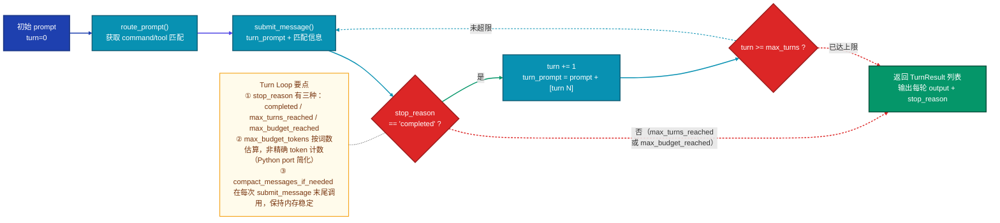
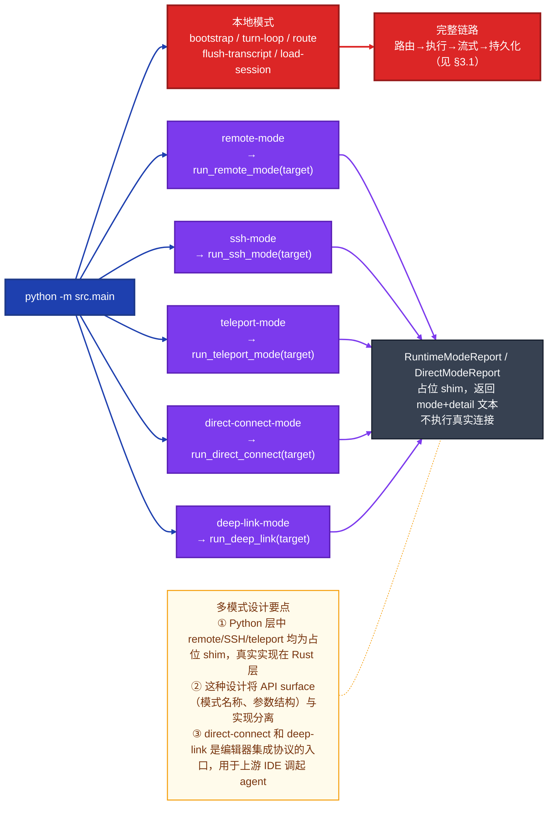
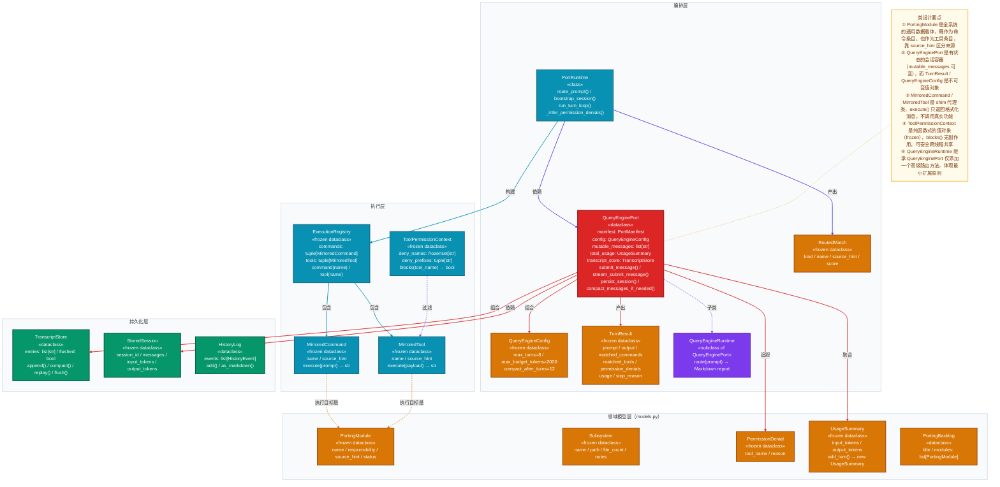
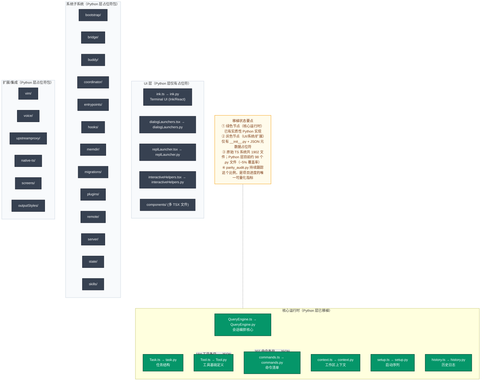

# Claw Code 技术分析文档

> 文档版本：2026-04-03　|　分析对象：`e:/github_project/claw-code`

---

## 目录

1. [项目定位](#1-项目定位)
2. [整体架构](#2-整体架构)
3. [核心执行链路](#3-核心执行链路)
4. [关键设计决策](#4-关键设计决策)
5. [FAQ](#5-faq)

---

## 1. 项目定位

**claw-code** 是对 Anthropic Claude Code（AI 编码助手）TypeScript 源码的**清洁室（clean-room）重写实验项目**，目标是在不复制原始专有代码的前提下，通过 Python（快速验证层）和 Rust（高性能生产层）两条并行轨道，复现原始系统的 harness 架构、工具编排机制与 Agent 运行时模式，同时作为开源 harness 工程研究的参考实现。

---

## 2. 整体架构

### 2.1 架构风格

| 维度 | Python 层（`src/`） | Rust 层（`rust/`） |
|------|-------------------|-------------------|
| **风格** | 扁平模块 + 数据驱动（快速验证） | Cargo Workspace 多 crate（生产级） |
| **组织原则** | 引用数据（JSON 快照）驱动 + 精简运行时 | 关注点分离：每个 crate 单一职责 |
| **运行模式** | CLI 工具，单进程 | 异步多任务（Tokio），支持 HTTP/SSE server |
| **扩展机制** | 命令/工具快照 + 权限上下文 | Plugin hook pipeline + LSP/MCP 协议栈 |

**技术栈总览**：

| 层 | 技术 |
|----|------|
| Python 主语言 | Python 3.10+，标准库（`dataclasses`、`pathlib`、`functools.lru_cache`、`argparse`） |
| Rust 主语言 | Rust 2021 edition，Tokio（异步运行时），Axum（HTTP server），reqwest（HTTP client），serde/serde_json，rustyline（REPL），syntect（高亮），pulldown-cmark（Markdown） |
| 数据持久化 | JSON 文件（`.port_sessions/`），无外部数据库依赖 |
| 协议支持 | HTTP/SSE（Axum server crate），LSP（lsp-types），MCP |

---

### 2.2 整体系统架构图

下图展示 claw-code 的双轨架构全貌，重点关注 Python 验证层与 Rust 生产层各自的层次组织，以及共享的参考数据层（JSON Snapshot）如何充当两轨的"锚点"。

```mermaid
flowchart TB
    classDef clientStyle   fill:#1f2937,stroke:#111827,stroke-width:2px,color:#f9fafb
    classDef entryStyle    fill:#1d4ed8,stroke:#1e3a8a,stroke-width:2.5px,color:#fff
    classDef pyStyle       fill:#0891b2,stroke:#155e75,stroke-width:2px,color:#fff
    classDef rustStyle     fill:#7c3aed,stroke:#5b21b6,stroke-width:2px,color:#fff
    classDef dataStyle     fill:#059669,stroke:#064e3b,stroke-width:2px,color:#fff
    classDef refStyle      fill:#d97706,stroke:#92400e,stroke-width:2px,color:#fff
    classDef noteStyle     fill:#fffbeb,stroke:#f59e0b,stroke-width:1.5px,color:#78350f
    classDef layerStyle    fill:#f8fafc,stroke:#cbd5e0,stroke-width:1.5px

    subgraph USER["用户入口层"]
        direction LR
        CLI_PY["Python CLI<br>python -m src.main"]:::clientStyle
        CLI_RS["Rust CLI<br>claw (binary)"]:::clientStyle
        HTTP["HTTP / SSE Client<br>via axum server"]:::clientStyle
    end
    class USER layerStyle

    subgraph PY["Python 验证层（src/）"]
        direction TB
        MAIN["main.py<br>CLI 入口 / 子命令路由"]:::entryStyle
        RUNTIME["runtime.py<br>PortRuntime<br>路由 + 会话编排"]:::pyStyle
        QE["query_engine.py<br>QueryEnginePort<br>会话管理 / Turn Loop"]:::pyStyle
        CMDS["commands.py<br>命令快照加载 / 索引"]:::pyStyle
        TOOLS["tools.py<br>工具快照加载 / 过滤"]:::pyStyle
        EXEC["execution_registry.py<br>MirroredCommand/Tool"]:::pyStyle
        PERM["permissions.py<br>ToolPermissionContext"]:::pyStyle
        SESS["session_store.py<br>会话持久化 JSON"]:::pyStyle
        SETUP["setup.py<br>工作区启动 / Prefetch"]:::pyStyle
        AUDIT["parity_audit.py<br>TS 归档 parity 对比"]:::pyStyle
    end
    class PY layerStyle

    subgraph RUST["Rust 生产层（rust/crates/）"]
        direction TB
        CLAW_CLI["claw-cli<br>交互式 REPL / Markdown 渲染"]:::rustStyle
        API_C["api<br>API Client + 流式响应<br>reqwest / OAuth"]:::rustStyle
        RT_C["runtime<br>Session 状态 / MCP / Config<br>sha2 / walkdir / tokio"]:::rustStyle
        TOOLS_C["tools<br>Tool 清单 + 执行框架"]:::rustStyle
        CMDS_C["commands<br>Slash 命令 / Skills 发现"]:::rustStyle
        PLUGINS_C["plugins<br>Plugin 模型 / Hook Pipeline"]:::rustStyle
        SERVER_C["server<br>HTTP/SSE (axum)"]:::rustStyle
        LSP_C["lsp<br>LSP Client 集成"]:::rustStyle
        COMPAT["compat-harness<br>上游编辑器兼容层"]:::rustStyle
    end
    class RUST layerStyle

    subgraph REF["参考数据层（src/reference_data/）"]
        direction LR
        SNAP_CMD["commands_snapshot.json<br>207 命令条目"]:::refStyle
        SNAP_TOOL["tools_snapshot.json<br>184 工具条目"]:::refStyle
        SNAP_SYS["subsystems/*.json<br>各子系统结构元数据"]:::refStyle
        SNAP_SURF["archive_surface_snapshot.json<br>原始 TS 归档统计"]:::refStyle
    end
    class REF layerStyle

    subgraph STORE["持久化层"]
        SESSION[(".port_sessions/<id>.json<br>StoredSession")]:::dataStyle
    end
    class STORE layerStyle

    CLI_PY --> MAIN
    CLI_RS --> CLAW_CLI
    HTTP --> SERVER_C
    MAIN --> RUNTIME
    MAIN --> QE
    RUNTIME --> CMDS
    RUNTIME --> TOOLS
    RUNTIME --> EXEC
    RUNTIME --> PERM
    QE --> SESS
    SESS --> SESSION
    CMDS --> SNAP_CMD
    TOOLS --> SNAP_TOOL
    AUDIT --> SNAP_SURF
    CLAW_CLI --> API_C
    CLAW_CLI --> RT_C
    CLAW_CLI --> TOOLS_C
    CLAW_CLI --> CMDS_C
    CLAW_CLI --> PLUGINS_C
    SERVER_C --> RT_C
    RT_C --> LSP_C
    RT_C --> PLUGINS_C

    NOTE["架构要点<br>① Python 层是轻量验证层：用 JSON 快照驱动，不含真实 LLM 调用<br>② Rust 层是生产目标：Tokio 异步，axum HTTP/SSE，reqwest 流式 API<br>③ 参考数据层（JSON Snapshot）是两轨共用锚点：保存对原始 TS 归档的静态镜像<br>④ parity_audit.py 持续衡量 Python 层与 1902 个原始 TS 文件的覆盖差距"]:::noteStyle
    NOTE -.- REF

    %% 边索引：0-21，共 22 条
    linkStyle 0 stroke:#374151,stroke-width:2px
    linkStyle 1 stroke:#7c3aed,stroke-width:2px
    linkStyle 2 stroke:#7c3aed,stroke-width:2px
    linkStyle 3 stroke:#1d4ed8,stroke-width:2px
    linkStyle 4 stroke:#1d4ed8,stroke-width:2px
    linkStyle 5 stroke:#0891b2,stroke-width:2px
    linkStyle 6 stroke:#0891b2,stroke-width:2px
    linkStyle 7 stroke:#0891b2,stroke-width:2px
    linkStyle 8 stroke:#0891b2,stroke-width:2px
    linkStyle 9 stroke:#059669,stroke-width:2px
    linkStyle 10 stroke:#059669,stroke-width:2px
    linkStyle 11 stroke:#d97706,stroke-width:2px
    linkStyle 12 stroke:#d97706,stroke-width:2px
    linkStyle 13 stroke:#d97706,stroke-width:1.5px,stroke-dasharray:4 3
    linkStyle 14 stroke:#7c3aed,stroke-width:2px
    linkStyle 15 stroke:#7c3aed,stroke-width:2px
    linkStyle 16 stroke:#7c3aed,stroke-width:2px
    linkStyle 17 stroke:#7c3aed,stroke-width:2px
    linkStyle 18 stroke:#7c3aed,stroke-width:2px
    linkStyle 19 stroke:#7c3aed,stroke-width:2px
    linkStyle 20 stroke:#7c3aed,stroke-width:2px
    linkStyle 21 stroke:#7c3aed,stroke-width:2px
```

**架构设计要点**：

- **双轨并行**：Python 层（快速验证，无真实 LLM）与 Rust 层（生产目标，真实异步 API）共存，以 JSON 快照作为共同锚点，分别承担不同阶段的开发目标。
- **数据驱动验证**：Python 层的命令/工具"执行"实际上是对 JSON 快照的查询与模拟调用，而非真实调用，使得整个层不依赖外部服务即可运行。
- **Rust workspace 单一职责**：每个 crate 只负责一个关注点，`claw-cli` 是集成点，`api`、`runtime`、`tools`、`plugins`、`server`、`lsp` 各自独立。

---

### 2.3 功能模块职责图

下图展示 Python 层核心模块之间的职责划分与协作关系，重点关注哪些模块"提供数据"，哪些模块"编排执行"，哪些模块"持久化状态"。

```mermaid
flowchart TB
    classDef entryStyle  fill:#1d4ed8,stroke:#1e3a8a,stroke-width:2.5px,color:#fff
    classDef orchStyle   fill:#dc2626,stroke:#991b1b,stroke-width:2.5px,color:#fff
    classDef dataStyle   fill:#d97706,stroke:#92400e,stroke-width:2px,color:#fff
    classDef execStyle   fill:#0891b2,stroke:#155e75,stroke-width:2px,color:#fff
    classDef storeStyle  fill:#059669,stroke:#064e3b,stroke-width:2px,color:#fff
    classDef infraStyle  fill:#374151,stroke:#111827,stroke-width:2px,color:#f9fafb
    classDef noteStyle   fill:#fffbeb,stroke:#f59e0b,stroke-width:1.5px,color:#78350f
    classDef layerStyle  fill:#f8fafc,stroke:#cbd5e0,stroke-width:1.5px

    subgraph ENTRY["入口层"]
        MAIN["main.py<br>CLI 入口 / argparse 子命令"]:::entryStyle
    end
    class ENTRY layerStyle

    subgraph ORCH["编排层"]
        direction LR
        RUNTIME["PortRuntime<br>runtime.py<br>路由 + 会话组装"]:::orchStyle
        QE["QueryEnginePort<br>query_engine.py<br>Turn Loop / 流式事件"]:::orchStyle
    end
    class ORCH layerStyle

    subgraph DATA["数据供给层"]
        direction LR
        CMD_MOD["commands.py<br>207 条命令快照<br>lru_cache 缓存"]:::dataStyle
        TOOL_MOD["tools.py<br>184 条工具快照<br>simple_mode / MCP 过滤"]:::dataStyle
        CTX["context.py<br>PortContext<br>文件树统计"]:::dataStyle
        SETUP["setup.py<br>WorkspaceSetup / SetupReport<br>Prefetch + DeferredInit"]:::dataStyle
        MANIFEST["port_manifest.py<br>PortManifest<br>src/ 文件扫描"]:::dataStyle
    end
    class DATA layerStyle

    subgraph EXEC["执行层"]
        direction LR
        EXEC_REG["execution_registry.py<br>ExecutionRegistry<br>MirroredCommand/Tool"]:::execStyle
        PERM["permissions.py<br>ToolPermissionContext<br>deny_names / deny_prefixes"]:::execStyle
        CMD_GRAPH["command_graph.py<br>CommandGraph<br>builtin/plugin/skill 分组"]:::execStyle
        TOOL_POOL["tool_pool.py<br>ToolPool<br>工具集装配"]:::execStyle
    end
    class EXEC layerStyle

    subgraph STORE["持久化层"]
        direction LR
        SESS_STORE["session_store.py<br>StoredSession<br>.port_sessions/*.json"]:::storeStyle
        TRANSCRIPT["transcript.py<br>TranscriptStore<br>内存 + compact"]:::storeStyle
        HISTORY["history.py<br>HistoryLog<br>调试事件链"]:::storeStyle
    end
    class STORE layerStyle

    subgraph INFRA["基础设施层"]
        direction LR
        SYSINT["system_init.py<br>启动状态报告"]:::infraStyle
        PREFETCH["prefetch.py<br>MDM / Keychain / 项目扫描"]:::infraStyle
        DEFERRED["deferred_init.py<br>trust-gated 延迟初始化"]:::infraStyle
        BOOTSTRAP["bootstrap_graph.py<br>BootstrapGraph 启动阶段"]:::infraStyle
        AUDIT["parity_audit.py<br>TS 归档覆盖率对比"]:::infraStyle
        REMOTE["remote_runtime.py<br>remote/ssh/teleport 模式"]:::infraStyle
        DIRECT["direct_modes.py<br>direct-connect/deep-link 模式"]:::infraStyle
    end
    class INFRA layerStyle

    MAIN --> RUNTIME
    MAIN --> QE
    RUNTIME --> CMD_MOD
    RUNTIME --> TOOL_MOD
    RUNTIME --> CTX
    RUNTIME --> SETUP
    RUNTIME --> EXEC_REG
    RUNTIME --> PERM
    QE --> SESS_STORE
    QE --> TRANSCRIPT
    QE --> HISTORY
    EXEC_REG --> CMD_MOD
    EXEC_REG --> TOOL_MOD
    TOOL_POOL --> TOOL_MOD
    TOOL_POOL --> PERM
    CMD_GRAPH --> CMD_MOD
    SETUP --> PREFETCH
    SETUP --> DEFERRED
    MAIN --> AUDIT
    MAIN --> BOOTSTRAP
    MAIN --> REMOTE
    MAIN --> DIRECT
    MAIN --> MANIFEST

    NOTE["模块协作要点<br>① 编排层（PortRuntime + QueryEnginePort）是全局状态中枢，所有子命令均汇聚于此<br>② 数据供给层无副作用：均通过 lru_cache 缓存 JSON 快照读取，可重入<br>③ 执行层负责权限检查与执行分发，MirroredCommand/Tool 是 Shim 而非真实实现<br>④ 持久化层三件套：session（跨次对话）+ transcript（当次 turn）+ history（调试链路）"]:::noteStyle
    NOTE -.- ORCH

    %% 边索引：0-22，共 23 条
    linkStyle 0,1 stroke:#1d4ed8,stroke-width:2.5px
    linkStyle 2,3,4,5,6,7 stroke:#dc2626,stroke-width:2px
    linkStyle 8,9,10 stroke:#dc2626,stroke-width:2px
    linkStyle 11,12 stroke:#0891b2,stroke-width:2px
    linkStyle 13,14 stroke:#0891b2,stroke-width:2px
    linkStyle 15,16 stroke:#d97706,stroke-width:2px
    linkStyle 17,18,19,20,21,22 stroke:#374151,stroke-width:1.5px
```

---

## 3. 核心执行链路

### 3.1 链路选取：`bootstrap` 命令完整调用流

`bootstrap` 命令是最典型的核心功能，它将所有关键模块串联成一条完整的 Agent 会话启动流程：接收 prompt → 上下文构建 → 路由匹配 → 权限校验 → 执行分发 → 流式事件 → 会话持久化。

下图展示从 CLI 用户输入到最终 Markdown 会话报告输出的完整端到端调用链，重点关注 `PortRuntime.bootstrap_session()` 内部的各阶段串联，以及 `QueryEnginePort` 的 Turn Loop 与持久化协作。

```mermaid
flowchart LR
    classDef userStyle    fill:#1e40af,stroke:#1e3a8a,stroke-width:2.5px,color:#fff
    classDef entryStyle   fill:#1d4ed8,stroke:#1e3a8a,stroke-width:2px,color:#fff
    classDef orchStyle    fill:#dc2626,stroke:#991b1b,stroke-width:2.5px,color:#fff
    classDef setupStyle   fill:#374151,stroke:#111827,stroke-width:2px,color:#f9fafb
    classDef routeStyle   fill:#4f46e5,stroke:#3730a3,stroke-width:2px,color:#fff
    classDef execStyle    fill:#0891b2,stroke:#155e75,stroke-width:2px,color:#fff
    classDef streamStyle  fill:#d97706,stroke:#92400e,stroke-width:2px,color:#fff
    classDef storeStyle   fill:#059669,stroke:#064e3b,stroke-width:2px,color:#fff
    classDef noteStyle    fill:#fffbeb,stroke:#f59e0b,stroke-width:1.5px,color:#78350f
    classDef layerStyle   fill:#f8fafc,stroke:#cbd5e0,stroke-width:1.5px

    INPUT["用户输入 prompt<br>CLI: python -m src.main bootstrap <prompt>"]:::userStyle

    subgraph PARSE["1. 解析层"]
        direction LR
        ARGP["argparse<br>main.py build_parser()"]:::entryStyle
        BOOT_CMD["bootstrap 子命令<br>→ PortRuntime().bootstrap_session(prompt)"]:::entryStyle
    end
    class PARSE layerStyle

    subgraph INIT["2. 环境初始化层"]
        direction LR
        CTX_B["build_port_context()<br>扫描 src/ tests/ assets/<br>检测 archive 可用性"]:::setupStyle
        SETUP_B["run_setup(trusted=True)<br>MDM prefetch + keychain prefetch<br>project scan + deferred_init"]:::setupStyle
        SYS_I["build_system_init_message()<br>生成系统级启动摘要"]:::setupStyle
        HIST_I["HistoryLog()<br>初始化调试事件链"]:::setupStyle
    end
    class INIT layerStyle

    subgraph ROUTE["3. 路由匹配层"]
        direction LR
        ENGINE_I["QueryEnginePort.from_workspace()<br>加载 PortManifest"]:::routeStyle
        ROUTE_P["PortRuntime.route_prompt(prompt)<br>token 分词 → 对命令/工具快照评分<br>按 kind 平衡选取 top-N 匹配"]:::routeStyle
    end
    class ROUTE layerStyle

    subgraph EXEC["4. 执行层"]
        direction LR
        PERM_C["_infer_permission_denials()<br>bash 工具拦截"]:::execStyle
        REG_B["build_execution_registry()<br>MirroredCommand + MirroredTool"]:::execStyle
        CMD_E["command.execute(prompt)<br>返回 shim 执行消息"]:::execStyle
        TOOL_E["tool.execute(prompt)<br>返回 shim 执行消息"]:::execStyle
    end
    class EXEC layerStyle

    subgraph STREAM["5. 流式事件层"]
        direction LR
        STREAM_E["stream_submit_message()<br>yield: message_start<br>yield: command_match / tool_match<br>yield: permission_denial<br>yield: message_delta<br>yield: message_stop"]:::streamStyle
    end
    class STREAM layerStyle

    subgraph TURN["6. Turn 提交层"]
        direction LR
        SUBMIT["submit_message()<br>检查 max_turns / max_budget<br>格式化输出 / 更新 UsageSummary<br>compact_messages_if_needed"]:::orchStyle
    end
    class TURN layerStyle

    subgraph PERSIST["7. 持久化层"]
        direction LR
        FLUSH["flush_transcript()<br>TranscriptStore.flushed=True"]:::storeStyle
        SAVE["save_session()<br>写 .port_sessions/<session_id>.json"]:::storeStyle
    end
    class PERSIST layerStyle

    OUTPUT["RuntimeSession.as_markdown()<br>输出完整 Markdown 会话报告"]:::userStyle

    INPUT --> ARGP
    ARGP --> BOOT_CMD
    BOOT_CMD --> CTX_B
    BOOT_CMD --> SETUP_B
    BOOT_CMD --> SYS_I
    BOOT_CMD --> HIST_I
    CTX_B --> ENGINE_I
    SETUP_B --> ENGINE_I
    ENGINE_I --> ROUTE_P
    ROUTE_P --> PERM_C
    ROUTE_P --> REG_B
    PERM_C --> CMD_E
    REG_B --> CMD_E
    PERM_C --> TOOL_E
    REG_B --> TOOL_E
    CMD_E --> STREAM_E
    TOOL_E --> STREAM_E
    STREAM_E --> SUBMIT
    SUBMIT --> FLUSH
    FLUSH --> SAVE
    SAVE --> OUTPUT

    NOTE["链路关键路径<br>① run_setup 在每次 bootstrap 调用时执行 prefetch（轻量模拟，非真实网络）<br>② route_prompt 用 token 集合交集评分，不依赖 LLM，O(n·|tokens|) 复杂度<br>③ stream_submit_message 与 submit_message 串行调用，先 yield 事件再提交状态<br>④ compact_messages_if_needed 在 turn > compact_after_turns(12) 时裁剪历史，防止内存无限增长<br>⑤ persist_session 在每次 bootstrap_session 结束时自动触发，幂等可重入"]:::noteStyle
    NOTE -.- SUBMIT

    %% 边索引：0-20，共 21 条
    linkStyle 0 stroke:#1e40af,stroke-width:2px
    linkStyle 1 stroke:#1d4ed8,stroke-width:2px
    linkStyle 2,3,4,5 stroke:#374151,stroke-width:2px
    linkStyle 6,7 stroke:#374151,stroke-width:1.5px
    linkStyle 8 stroke:#4f46e5,stroke-width:2px
    linkStyle 9,10 stroke:#4f46e5,stroke-width:2px
    linkStyle 11,12 stroke:#0891b2,stroke-width:2px
    linkStyle 13,14 stroke:#0891b2,stroke-width:2px
    linkStyle 15,16 stroke:#d97706,stroke-width:2px
    linkStyle 17 stroke:#d97706,stroke-width:2.5px
    linkStyle 18 stroke:#dc2626,stroke-width:2px
    linkStyle 19 stroke:#059669,stroke-width:2px
    linkStyle 20 stroke:#059669,stroke-width:2.5px
```

**链路要点**：

- **无真实 LLM 调用**：Python 层的 `submit_message` 输出是对 prompt 和匹配信息的格式化摘要，而非真实 AI 回复——这是刻意的设计决策，使得链路可在无网络/无密钥环境下完整运行。
- **流式与同步双通道**：`stream_submit_message` 先以生成器方式 yield 各阶段事件，`submit_message` 在其内部被调用，保证事件流与状态更新的一致性。
- **路由评分无 LLM 依赖**：`route_prompt` 用 token 集合交集评分（每命中 1 个 token +1 分），O(n·|tokens|) 复杂度，可在毫秒内完成对全量 207+184 条目的扫描。

---

### 3.2 Turn Loop 多轮会话流程

下图展示 `run_turn_loop` 命令的多轮交互流程（状态机视角），重点关注 `stop_reason` 如何驱动循环终止逻辑。

---

### 3.3 多入口 / 多运行模式对比

claw-code 支持 7 种运行模式。下图对比各入口的处理路径差异，重点关注 local 模式（完整链路）与 remote/SSH/teleport/direct/deep-link 模式（占位 shim）的分支结构。

---

## 4. 关键设计决策

### 4.1 为什么用 JSON 快照驱动，而不是直接实现命令/工具？

**背景**：原始 TypeScript 源码有 1902 个文件、207 个命令、184 个工具。完整重写需要数月工作量。

**决策**：将命令/工具的元数据（名称、职责、来源路径）固化为 JSON 快照（`commands_snapshot.json`、`tools_snapshot.json`），Python 层通过 `load_command_snapshot()` + `lru_cache` 在首次访问时一次性加载，后续调用均为缓存读取，执行时返回格式化的 shim 消息而非真实功能。

**为什么**：
1. **快速建立 API surface**：可以在不实现任何工具的情况下，让整个路由、权限、会话系统正常运转，验证系统骨架。
2. **渐进式替换**：JSON 中的 `status` 字段（`mirrored` / `planned`）和 `parity_audit.py` 共同构成了一个持续跟踪进度的机制，不需要"大爆炸"式重写。
3. **清洁室合规**：不复制原始 TypeScript 逻辑，只保留元数据描述，降低法律风险。

---

### 4.2 为什么 Python 与 Rust 并行开发，而不是选一个？

**背景**：作者面临时间压力（4 AM 紧急 port），同时也想要一个高性能的最终实现。

**决策**：Python 层在数小时内完成基础骨架，用于快速验证架构设计；Rust 层随后跟进，以 Tokio + Axum + reqwest 实现真实的异步 API 调用、流式响应和 HTTP/SSE server。

**为什么**：
1. **时间成本 vs 质量**：Python 的开发速度比 Rust 快 3-5 倍，适合快速验证接口设计和架构决策正确性，Rust 负责最终产品质量。
2. **风险隔离**：Python 层可以在不破坏 Rust 层进度的情况下进行架构实验；两层可以独立测试。
3. **学习路径**：先用 Python 理解原始 TS 系统的模式，再用 Rust 精确实现，避免在 Rust 中踩架构坑。

---

### 4.3 为什么用 Trust-gated Deferred Init？

**决策**：`deferred_init.py` 中的 `run_deferred_init(trusted: bool)` 将 plugin 初始化、skill 加载、MCP prefetch、session hooks 全部置于 `trusted` 标志门控之后；`run_setup()` 默认 `trusted=True`，但接口保留了完整的 `False` 路径。

**为什么**：
1. **安全边界**：这是从原始 Claude Code 继承来的安全模式——未授信的工作区（如第一次打开的陌生项目）不应立即加载外部插件和钩子，防止恶意工程目录利用 plugin 机制执行代码。
2. **启动性能**：deferred 意味着 plugin/MCP 初始化不在主进程启动关键路径上，只有通过 trust gate 后才发生，减少 cold start 延迟。
3. **可测试性**：`trusted=False` 路径使得测试可以绕过所有外部依赖，保持 unit test 的确定性。

---

### 4.4 为什么 PortRuntime 的路由用 token 交集评分，而不是语义搜索？

**决策**：`route_prompt` 将 prompt 按空格/斜杠/连字符分词，对 name + source_hint + responsibility 三个字段做 token 命中计数，每命中 1 个 token 得 1 分。

**为什么**：
1. **无 LLM 依赖**：Python 层是验证层，不应依赖外部 API；token 匹配在毫秒内完成，无网络延迟。
2. **复现原始行为**：原始 Claude Code 的命令路由本质上也是基于用户输入的关键词匹配（`/bash`、`/add-dir` 等斜杠命令），语义匹配并非核心路径，精确词汇匹配已足够。
3. **可解释性**：每个匹配结果携带 `score` 分数，调试时可以直接看到 "为什么选了这个命令"，语义模型的黑盒决策更难排查。

---

### 4.5 为什么 Rust crate 的架构选 `unsafe_code = "forbid"`？

**决策**：Rust workspace 的 `Cargo.toml` 全局设置 `unsafe_code = "forbid"`，整个代码库拒绝所有 `unsafe` 块。

**为什么**：
1. **内存安全是核心卖点**：README 明确宣称 Rust port 目标是"faster, memory-safe harness runtime"，如果允许 unsafe，内存安全保证就会打折扣。
2. **agent harness 的特殊性**：harness 层会接收来自外部工具调用的数据并传递给 LLM API，内存漏洞可能导致数据泄露。
3. **工程纪律**：禁止 unsafe 迫使开发者使用安全抽象（如 `Arc<Mutex<T>>`），避免在快速迭代中引入潜在的 UB。

---

### 4.6 为什么 TranscriptStore 和 SessionStore 分离？

**决策**：`TranscriptStore`（内存中的当次 turn 消息列表）与 `StoredSession`（写入磁盘的 JSON 文件）是两个独立的数据结构，通过 `persist_session() → flush_transcript() → save_session()` 三步串联。

**为什么**：
1. **写时一致性**：只有调用 `persist_session` 时才发生磁盘写入，避免每条 turn 消息都触发 I/O，减少写放大。
2. **可回放性**：`TranscriptStore.replay()` 返回内存中的完整消息序列，可用于重建会话状态，而不依赖磁盘文件是否存在。
3. **compact 分离**：内存中的 `compact`（保留最后 N 条）和磁盘上的 `StoredSession`（完整历史）策略不同，分离结构允许各自独立调整策略。

---

## 5. 关键组件类层级图

下图展示 Python 层核心类/数据类的层级关系与职责边界，重点关注 `QueryEnginePort` 与 `PortRuntime` 如何通过组合而非继承的方式协作，以及 `PortingModule` 如何作为全系统的数据载体。

---

## 6. 原始 TypeScript 归档结构（参考对比）

下图展示原始 TypeScript 系统（1902 文件）的子系统全景，供理解 claw-code 移植目标时参考。重点关注哪些子系统在 Python 层已有对应模块，哪些仅有 `__init__.py` 占位符。

---

## 7. FAQ

### Q1：claw-code 是一个可用的 AI 编码助手吗？

**不完全是。** 当前 Python 层（`src/`）是**验证层**，命令和工具都是 shim（桩代码），`submit_message` 不会真正调用任何 LLM API，它只是对匹配信息的格式化输出。实际的 AI 调用能力在 Rust 层（`rust/crates/api`）中，通过 `reqwest` 调用 Claude API 并支持流式响应。因此，Python 层更像是一个**架构验证沙盒**，Rust 层才是真正的产品目标。

---

### Q2：JSON 快照（commands_snapshot.json / tools_snapshot.json）是从哪里来的？

这些快照是对**原始 TypeScript 源码文件系统结构的静态镜像**。作者在接触到原始 TypeScript 代码后，扫描了 `commands/` 和 `tools/` 目录树，将每个 `.tsx`/`.ts` 文件的路径提取为一条条目（`name` = 文件名，`source_hint` = 相对路径，`responsibility` = 模板化描述）。这种方式做到了"保留接口 surface 信息但不复制具体实现逻辑"，在法律上属于对原始系统的结构描述而非代码复制。`parity_audit.py` 则负责对比当前 Python 工作区与这份快照的覆盖差距。

---

### Q3：PortRuntime 与 QueryEnginePort 的职责边界是什么？

| 对象 | 职责 |
|------|------|
| `PortRuntime` | **无状态**的编排器，负责路由（`route_prompt`）、会话组装（`bootstrap_session`）和 Turn Loop 控制（`run_turn_loop`）；它本身不持有任何会话状态 |
| `QueryEnginePort` | **有状态**的会话容器，持有 `mutable_messages`、`total_usage`、`transcript_store` 等可变字段；负责单次 turn 的提交、流式事件生成和持久化 |

两者的关系是：`PortRuntime` 在编排时**创建并调用** `QueryEnginePort`，就像 Controller 调用 Service 一样，但 `PortRuntime` 自己不持有 `QueryEnginePort` 的引用（每次 `bootstrap_session` 都新建一个 engine 实例）。

---

### Q4：为什么 `load_command_snapshot()` 和 `load_tool_snapshot()` 使用 `@lru_cache(maxsize=1)`？

这是一个**进程级单例**模式的轻量实现。JSON 快照文件在进程生命周期内不会改变，使用 `lru_cache(maxsize=1)` 确保：
1. **一次 I/O**：整个进程只读一次磁盘，后续调用直接返回内存中的 `tuple[PortingModule, ...]`。
2. **不可变返回**：返回 `tuple` 而非 `list`，调用方无法意外修改缓存内容。
3. **线程安全**：Python 的 `lru_cache` 内部有锁，即使在多线程场景下（Rust 层的 tokio 多线程不涉及此，但 Python 端如有多线程也安全）不会产生竞争。

选择 `lru_cache` 而非类级别的模块变量，是因为函数级缓存更容易在测试中通过 `load_command_snapshot.cache_clear()` 重置，保持测试隔离。

---

### Q5：Rust 层的 `unsafe_code = "forbid"` 在工程实践中意味着什么？

这意味着整个 Rust workspace 中**任何** `unsafe { ... }` 块都会编译报错。在工程上带来三个约束：
1. **不能直接调用 FFI**：所有外部 C 库交互必须通过已有的安全 wrapper crate（如 `openssl-sys` 已有 `openssl` 的安全抽象），不能自己写 `extern "C"` unsafe 块。
2. **不能绕过借用检查器**：所有并发共享状态必须用 `Arc<Mutex<T>>` 或 `Arc<RwLock<T>>`，不能用裸指针。
3. **`tokio` 的使用不受影响**：`tokio` 的公共 API 是完全安全的，async/await + Tokio runtime 是这个项目的主要并发模型，完全兼容 `forbid(unsafe_code)`。

---

### Q6：`compact_messages_if_needed()` 的触发时机与效果是什么？

在每次 `submit_message()` 调用结束时被调用，当 `mutable_messages` 长度超过 `compact_after_turns`（默认 12）时，只保留**最后 12 条**，丢弃更早的消息。同步对 `transcript_store` 执行相同操作。

**设计意图**：防止长对话场景下内存无限增长。这与 Claude API 的上下文窗口管理有相似逻辑——当上下文超出某个阈值时，需要进行"压缩"（compaction）。Python 层用简单的尾部截断实现这一机制，而真实系统会调用 LLM 生成摘要替代被截断的历史（Rust 层的 runtime crate 负责实现更完整的压缩策略）。

---

### Q7：`parity_audit.py` 如何衡量移植进度？

`run_parity_audit()` 通过比较以下五个维度，生成 `ParityAuditResult`：

| 指标 | 含义 |
|------|------|
| `root_file_coverage` | src/ 根级文件（如 QueryEngine.py）命中 / 原始 18 个根级 TS 文件 |
| `directory_coverage` | src/ 顶级目录（如 plugins/）命中 / 原始 28 个目录 |
| `total_file_ratio` | 当前 Python 文件数 / 原始 1902 个 TS-like 文件数 |
| `command_entry_ratio` | commands_snapshot.json 条目数 / 原始 207 条 |
| `tool_entry_ratio` | tools_snapshot.json 条目数 / 原始 184 条 |

当且仅当本地有原始 TS 归档（`archive/claw_code_ts_snapshot/src` 存在）时，后两项才能进行精确比对；否则仅报告"archive unavailable"。这个机制的价值在于它是**客观的、可量化的进度指标**，不依赖主观判断。

---

### Q8：Rust 层的 axum server crate 与 Python 层的关系是什么？

两者**完全独立**，不存在调用关系。Rust `server` crate 用 Axum 实现了一个 HTTP/SSE server，直接依赖 `runtime` crate（Rust 实现）处理请求，返回 SSE 流式响应。Python 层没有 HTTP server，只有 CLI 入口。

这种分离源于双轨设计哲学：Python 层验证架构骨架，Rust 层实现生产特性（HTTP 服务、真实 LLM API 调用、LSP 集成）。未来 Python 层计划退场，Rust 层成为唯一运行时。

---

### Q9：`ToolPermissionContext` 为什么用 `frozenset` 存储 deny_names？

`frozenset` 的 `__contains__` 操作是 O(1) 平均复杂度（哈希查找），相比 `list` 的 O(n) 线性扫描，在工具数量较多时有显著优势。更重要的是，`frozenset` 是不可变的哈希类型，可以作为 `frozen=True` dataclass 的字段（`dataclass(frozen=True)` 要求所有字段都是 hashable），确保 `ToolPermissionContext` 自身也是 hashable 且线程安全的，可以安全地在缓存 key 或集合中使用。

`deny_prefixes` 用 `tuple[str, ...]` 而非 `frozenset`，是因为前缀匹配（`startswith`）天然是线性的，无法通过哈希加速，且前缀数量通常很少（单位数），list/tuple 效率相当，但 tuple 满足 frozen dataclass 的 hashable 要求。

---

### Q10：`stream_submit_message()` 与 `submit_message()` 为什么串行而不是并行？

`stream_submit_message()` 是一个**同步生成器**（`yield`），内部在 yield 完所有事件头之后调用 `self.submit_message()`，再 yield 最终的 `message_delta` 和 `message_stop`。这种设计确保：
1. **状态一致性**：`submit_message` 会修改 `mutable_messages`、`total_usage` 等状态，必须在所有事件 yield 完成后的确定时机执行，避免状态中途被修改。
2. **背压天然实现**：调用方每次 `next()` 生成器时才推进，如果调用方处理事件慢，生成器自动暂停，无需额外的背压机制。
3. **简化实现**：在 Python 验证层中，真实的异步流式处理（如 SSE chunked streaming）由 Rust/axum 层负责；Python 层用同步生成器模拟事件序列，不引入 `asyncio` 复杂性，保持代码简洁可读。

---

### Q11：Bootstrap Graph 的 7 个阶段对应原始 Claude Code 的什么机制？

`build_bootstrap_graph()` 返回的 7 个阶段是对原始 TypeScript `main.tsx` 启动序列的**结构映射**：

| 阶段 | 对应机制 |
|------|---------|
| `top-level prefetch side effects` | Node.js 模块顶层的副作用（keychain 预读、MDM 检查） |
| `warning handler and environment guards` | `process.on('unhandledRejection')` + 环境变量检查 |
| `CLI parser and pre-action trust gate` | commander/yargs 解析 + 首次信任确认对话框 |
| `setup() + commands/agents parallel load` | `Promise.all([setup(), loadCommands(), loadAgents()])` |
| `deferred init after trust` | trust 确认后才初始化 plugin 系统和 MCP |
| `mode routing` | 根据 CLI flag 分支到 local/remote/ssh/teleport/direct/deep-link 模式 |
| `query engine submit loop` | REPL 主循环：用户输入 → QueryEngine.submit → 渲染输出 → 等待下一个输入 |

这 7 个阶段是整个 harness 设计的骨架，Python 层和 Rust 层都在向这个骨架靠拢。

---

### Q12：为什么会有 `QueryEngineRuntime`（QueryEngine.py）和 `QueryEnginePort`（query_engine.py）两个相似的类？

这是**移植过程中产生的分层**，两者职责清晰分离：

- `QueryEnginePort`（`query_engine.py`）是核心实现：有状态的会话容器，管理 turn loop、usage 统计、transcript 和 session 持久化。它是**数据+行为**的聚合体，直接对应原始 TypeScript 的 `QueryEngine.ts`。

- `QueryEngineRuntime`（`QueryEngine.py`）是薄包装层：继承 `QueryEnginePort`，仅添加 `route()` 方法，该方法委托给 `PortRuntime` 并格式化结果为 Markdown。它的存在是为了提供**更高级的路由报告接口**，供直接查看路由结果时使用，不污染核心 `QueryEnginePort` 的实现。

这种"核心类 + 门面包装类"的模式在移植工程中很常见：核心类保持纯粹，包装类提供调试/报告便利，两者通过继承关联但各自独立演化。

---

### Q13：claw-code 如何保证移植的"清洁室"属性？

"清洁室"（clean-room）重写在法律上要求**没有直接接触过原始代码的人来实现**，或者重新设计者只能依据功能规格而非源代码。claw-code 采用了以下策略：

1. **JSON 快照而非代码**：命令/工具的实现细节不保留，只保留文件路径（作为 `source_hint`）和功能描述（`responsibility` 用模板化文字，非原始注释/文档）。
2. **架构重设计**：Python 层采用扁平模块 + dataclass 驱动，与原始 TypeScript 的 React/Ink UI 架构完全不同；Rust 层的 crate 划分也是全新设计，非 TS 代码的机械翻译。
3. **功能等价而非代码等价**：`parity_audit.py` 只跟踪文件/条目数量覆盖率，不进行代码逻辑对比；验收标准是"能处理相同的用户操作"，而非"代码结构相同"。
4. **行为验证而非逻辑复制**：`tests/` 目录中的测试验证 Python 层的行为是否符合预期接口，而非验证实现是否与原始 TS 代码一致。

这些策略共同使得该项目在功能上向原始系统靠拢，但在实现上保持独立性。
