# Dify 1.13.0 技术架构深度分析

> 版本：1.13.0 | 分析日期：2026-03-22 | 代码库：`/api`（Python）+ `/web`（TypeScript）

---

## 文档导读
以下是文档的核心内容概览：

---

**项目定位**：Dify 是面向企业和开发者的开源 LLM 应用开发平台，通过可视化工作流编排和 RAG 知识库，将"从 Prompt 到生产级 AI 应用"的工程复杂度降至最低。

**文档结构（9章 + 附录）：**

1. **项目定位** — 一句话定义
2. **整体架构** — 技术栈表格 + **DDD 四层边界图 + 领域模型聚合图**（新增）+ 系统架构图
3. **核心概念关系图** — 租户、应用类型、知识库、模型体系、工具体系、工作流体系的关系层级
4. **关键组件结构** — 后端三层依赖图 + 工作流图引擎内部 5 层结构图
5. **功能模块协作关系** — 前后端 + 外部系统 + Celery 层的协作图
6. **核心执行链路（5张图）**：
   - 工作流推理完整请求流（Celery 异步 + SSE 流式）
   - RAG 文档索引全链路（解析→分块→索引→检索）
   - 前端工作流编辑器交互流（ReactFlow + Zustand + SSE）
   - Agent CoT ReAct 执行循环
   - 四种 API 入口对比（Console/ServiceAPI/WebApp/MCP）
   - 插件系统扩展机制（进程隔离 + RPC）
7. **关键设计决策（6项）** — 重点分析"为什么这样设计"
8. **部署架构图** — Docker Compose 服务拓扑
9. **FAQ 14题** — 覆盖基本原理、设计决策、实际应用、性能优化四类

## 目录

1. [项目定位](#1-项目定位)
2. [整体架构](#2-整体架构)
   - 2.1 架构风格
   - 2.2 技术栈
   - **2.3 DDD 分层边界与领域模型** ← 新增
   - 2.4 整体系统架构图
3. [核心概念关系图](#3-核心概念关系图)
4. [关键组件结构](#4-关键组件结构)
5. [功能模块协作关系](#5-功能模块协作关系)
6. [核心执行链路](#6-核心执行链路)
7. [关键设计决策](#7-关键设计决策)
8. [部署架构](#8-部署架构)
9. [FAQ（12题+）](#9-faq)

---

## 1. 项目定位

**Dify 是一个面向企业和开发者的开源 LLM 应用开发平台**，通过可视化工作流编排、RAG 知识库、Agent 智能体和多模型统一接入，将"从 Prompt 到生产级 AI 应用"的工程复杂度降至最低，使非专业工程师也能快速构建、测试和部署生产可用的 LLM 应用。

---

## 2. 整体架构

### 2.1 架构风格

Dify 采用**分层架构 + DDD 领域驱动设计**的混合风格：

- **后端**：经典三层（Controller → Service → Core/Domain），领域逻辑高度内聚于 `core/` 目录
- **前端**：Next.js App Router + 组件化，状态通过 Zustand 管理
- **部署**：单体部署（一个 Docker Compose），但内部通过 Celery 实现异步解耦

### 2.2 技术栈

| 层次 | 技术选型 |
|------|---------|
| **后端框架** | Python Flask + Flask-RESTx（OpenAPI 自动生成） |
| **ORM** | SQLAlchemy + Flask-Migrate（Alembic 迁移） |
| **异步任务** | Celery + Redis（Broker & 结果后端） |
| **数据库** | PostgreSQL（主数据库）|
| **向量数据库** | 支持 pgvector / Weaviate / Pinecone / Qdrant / Milvus 等 15+ 种 |
| **缓存** | Redis |
| **对象存储** | 本地 / S3 / OSS / Azure Blob 等 |
| **前端框架** | Next.js 14 (App Router) + TypeScript |
| **UI 库** | Tailwind CSS + Radix UI |
| **流程图引擎** | ReactFlow |
| **状态管理** | Zustand 「轻量级、基于 React Hook 的状态管理库」 |
| **包管理** | `uv`（后端）/ `pnpm`（前端） |
| **可观测性** | OpenTelemetry「全维度数据采集器」 + Sentry「异常告警 + 诊断平台」 |

### 2.3 DDD 分层边界与领域模型

Dify 后端采用**四层 DDD 架构**。下图从左至右依次展示接口层、应用层、领域层、基础设施层的职责边界，以及**唯一合法的依赖方向（自左向右，禁止反向）**。阅读时重点关注领域层（`core/`）内部的四个子域划分，以及各层之间通过什么机制跨层通信（返回值 / 事件 / 依赖倒置）。

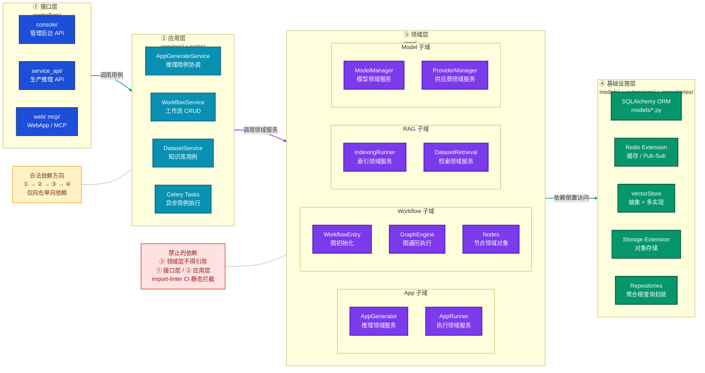

> **图后要点**
> - **为什么领域层（`core/`）不依赖应用层（`services/`）**：领域逻辑是稳定的业务核心，应用层逻辑随用例变化而变化；若领域层引用应用层，任何用例变更都可能破坏领域对象，违反"稳定依赖原则"。`import-linter` 在 CI 阶段静态强制此约束，人工审查无法替代。
> - **为什么基础设施层通过"依赖倒置"而非直接引用访问**：领域层定义抽象接口（如 `VectorBase`），基础设施层提供具体实现（pgvector / Weaviate）；领域代码只依赖接口，切换向量库时无需修改任何领域逻辑，符合 DDD 的"领域模型不受技术实现污染"原则。
> - **为什么 Celery Tasks 归入应用层而非领域层**：Celery 任务是"异步执行的用例"——它协调调用多个领域服务完成一个业务目标（如文档索引），本身不含业务规则；放入应用层与同步的 Service 类对齐，两者可共用相同的领域服务调用。

---

下图展示 Dify 四个核心子域的**聚合根与实体关系**，是领域模型的静态快照。阅读时重点关注各聚合根（加粗边框）的边界——跨聚合只允许通过 ID 引用，不允许直接对象引用，这是 DDD 保持聚合完整性和并发安全的核心规则。

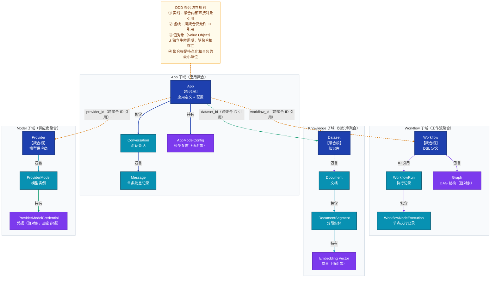

> **图后要点**
> - **为什么跨聚合只允许 ID 引用而不能直接持有对象**：跨聚合持有对象会导致两个聚合的生命周期和事务边界耦合——删除一个聚合时必须考虑另一个聚合的引用，且无法独立锁定；ID 引用将加载责任交给调用方，聚合之间完全解耦。
> - **为什么 ProviderModelCredential（凭据）被设计为值对象而非实体**：凭据没有独立的业务身份，它的意义完全依附于所属的 ProviderModel；凭据的"更新"在业务上等价于"替换整个值对象"而不是修改某个实体的状态，值对象语义更贴切，且便于整体加密存储。
> - **为什么 Graph（DAG 结构）是 Workflow 聚合内的值对象而非独立实体**：Graph 是工作流定义的结构化描述（JSON），它随 Workflow 的版本发布而整体替换，不存在"只更新图的某一部分"的业务场景；作为值对象，它与 Workflow 共用事务边界，简化了持久化逻辑。

---

### 2.4 整体系统架构图

下图展示 Dify 的六层纵向结构，从上到下依次是：客户端 → 接入层（多协议入口）→ 服务层 → 核心领域层 → 异步任务层 → 基础设施层。阅读时重点关注**核心领域层内部的子系统划分**（App Engine / Workflow Engine / RAG / Model Runtime 四个引擎），以及**异步路径**（实线 vs 虚线）与**同步路径**的区别。

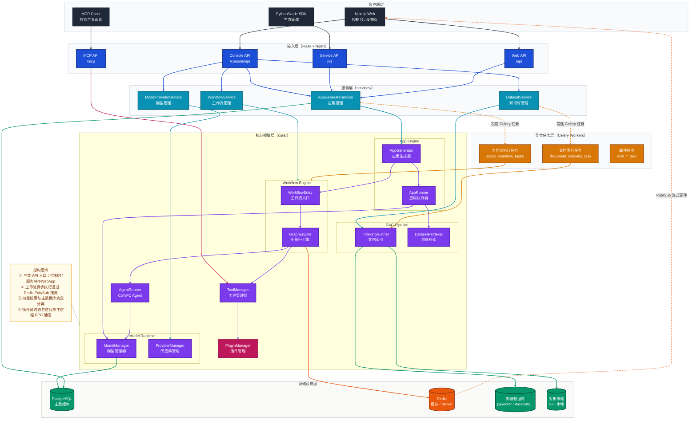

> **图后要点**
> - **为什么接入层有四个入口而非统一一个**：Console、Service API、WebApp、MCP 的认证方式、权限范围和数据版本（草稿/发布版）各不相同，合并会导致鉴权逻辑爆炸式复杂，拆分后每条路径职责单一，易于独立演进。
> - **为什么 Celery Worker 层独立于 API 进程**：LLM 推理和文档索引可能耗时数分钟，若在 API 进程同步执行会耗尽连接池；Worker 独立部署后可按任务类型横向扩容，互不影响。
> - **为什么向量数据库与 PostgreSQL 分开存储**：向量 ANN 检索需要专用的近似算法（HNSW/IVF），关系型数据库无法高效完成，分离也使得向量库可以按需替换（pgvector → Milvus）而不影响业务数据。

---

## 3. 核心概念关系图

下图以**租户（Tenant）为根节点**，展示 Dify 内所有核心领域概念的归属与关联关系。阅读路径：先看租户向下拥有哪些资源（应用/知识库/模型/工具），再沿各分支深入了解每个体系内部的组成关系——例如知识库如何逐层细化为文档→分段→向量，工作流如何由 DSL 定义、节点执行、变量池串联。

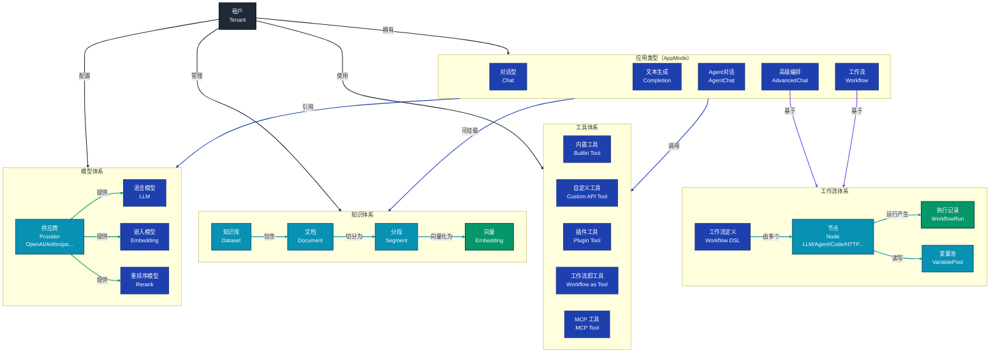

> **图后要点**
> - **为什么 AdvancedChat 和 Workflow 都基于同一个 Workflow System**：两者底层共用图执行引擎，差异仅在于是否持续对话上下文——AdvancedChat 在工作流外层套了消息历史管理，Workflow 则是无状态的单次执行，共用引擎避免了重复实现。
> - **为什么工具体系中存在「工作流即工具」**：这是 Dify 实现「乐高积木」式复用的核心机制——一个已发布的工作流可以被另一个工作流或 Agent 当作黑盒工具调用，使复杂能力可以分层封装而不必每次重新编排。
> - **为什么知识库以 Segment（分段）为最小检索单元而非 Document**：文档往往数万字，向量检索精度依赖于文本粒度；分段后每块约 500~1000 tokens，语义更集中，检索相关性显著提升。

---

## 4. 关键组件结构

### 4.1 后端核心组件依赖图

下图展示后端**三层架构（控制层 → 服务层 → 核心领域层）**中各组件的具体构成及层间依赖方向。阅读时自上而下追踪一次请求的流转：从 Controller 解析入参，经 Service 协调业务，进入 `core/app` 或 `core/workflow` 执行，最终通过 `core/model_runtime` 调用 LLM。特别关注 `AppQueueManager` 和 `TaskPipeline`——它们是同步 HTTP 响应与异步 LLM 流式输出的桥接点。

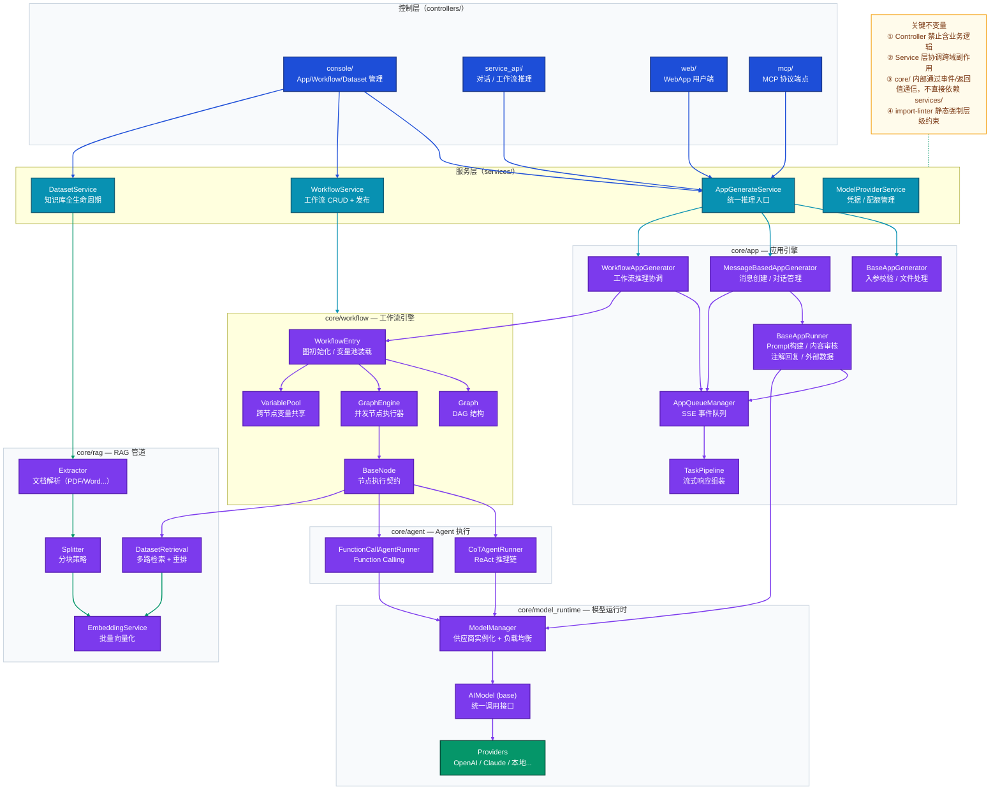

> **图后要点**
> - **为什么 Controller 层严禁包含业务逻辑**：控制层的唯一职责是 HTTP 协议适配（解析入参、序列化响应、捕获 HTTP 级别错误），业务逻辑下沉到 Service 层后，可以被 Celery 任务、CLI 命令、测试用例等多种调用方复用，而不是只能通过 HTTP 触发。
> - **为什么 `core/` 内部不直接依赖 `services/`**：`core/` 是纯粹的领域层，如果它反向依赖服务层，会形成循环依赖并破坏可测试性；领域层通过返回值和事件向上通信，副作用（数据库写入、任务派发）由 Service 层在调用后处理。
> - **为什么 `AppQueueManager` 使用 Redis Pub/Sub 而非直接内存队列**：工作流实际执行在 Celery Worker 进程，而 HTTP 响应在 API 进程，两者跨进程通信只能依赖外部中间件；Redis Pub/Sub 是最轻量的选择，且天然支持多 Worker 实例。

### 4.2 工作流图引擎内部结构

下图聚焦于 `core/workflow/graph_engine/` 内部的**五层垂直分层**，从上层编排到底层领域模型，展示各层的职责和调用方向。阅读时重点关注两条非显而易见的设计：① `GraphEngine` 同时管理「命令处理」和「事件发布」两条并行通道；② 中间件层（Layers）以插件方式挂载，不侵入核心执行循环。

```mermaid
flowchart TB
    classDef orchStyle   fill:#dc2626,stroke:#991b1b,stroke-width:2.5px,color:#fff
    classDef cmdStyle    fill:#d97706,stroke:#92400e,stroke-width:2px,color:#fff
    classDef evtStyle    fill:#4f46e5,stroke:#3730a3,stroke-width:2px,color:#fff
    classDef layerIStyle fill:#0891b2,stroke:#155e75,stroke-width:2px,color:#fff
    classDef domainStyle fill:#059669,stroke:#064e3b,stroke-width:2px,color:#fff
    classDef noteStyle   fill:#fffbeb,stroke:#f59e0b,stroke-width:1.5px,color:#78350f
    classDef layerStyle  fill:#f8fafc,stroke:#cbd5e0,stroke-width:1.5px

    subgraph ORCH["编排层（Orchestration）"]
        direction TB
        GE_MAIN["GraphEngine<br>主执行循环"]:::orchStyle
        WORKER["Worker<br>节点执行运行时"]:::orchStyle
    end
    class ORCH layerStyle

    subgraph CMD["命令处理层（Command Processing）"]
        direction TB
        CMD_PROC["CommandProcessor<br>Stop / Pause / Resume"]:::cmdStyle
        IN_MEM["InMemoryChannel<br>单进程控制"]:::cmdStyle
        REDIS_CH["RedisChannel<br>跨进程控制"]:::cmdStyle
    end
    class CMD layerStyle

    subgraph EVT["事件管理层（Event Management）"]
        direction TB
        EVT_MGR["EventManager<br>事件路由与广播"]:::evtStyle
        GRAPH_EVT["GraphRunStarted/Completed<br>图生命周期事件"]:::evtStyle
        NODE_EVT["NodeRunStarted/Succeeded/Failed<br>节点生命周期事件"]:::evtStyle
    end
    class EVT layerStyle

    subgraph LAYER_SYS["中间件层（Layers）"]
        direction LR
        DEBUG_LAYER["DebugLoggingLayer<br>执行日志"]:::layerIStyle
        LIMIT_LAYER["ExecutionLimitsLayer<br>节点数/超时限制"]:::layerIStyle
        OBS_LAYER["ObservabilityLayer<br>OTel 追踪"]:::layerIStyle
    end
    class LAYER_SYS layerStyle

    subgraph DOMAIN["领域层（Domain）"]
        direction TB
        GRAPH_OBJ["Graph<br>DAG 结构定义"]:::domainStyle
        RUNTIME_STATE["GraphRuntimeState<br>运行时状态"]:::domainStyle
        VAR_POOL2["VariablePool<br>变量命名空间"]:::domainStyle
        NODE_IMPL["Node Implementations<br>LLM/Agent/Code/HTTP/..."]:::domainStyle
    end
    class DOMAIN layerStyle

    GE_MAIN -->|"委托执行"| WORKER
    GE_MAIN -->|"监听命令"| CMD_PROC
    CMD_PROC --> IN_MEM
    CMD_PROC --> REDIS_CH
    GE_MAIN -->|"发布事件"| EVT_MGR
    EVT_MGR --> GRAPH_EVT
    EVT_MGR --> NODE_EVT
    GE_MAIN -->|"调用钩子"| DEBUG_LAYER
    GE_MAIN -->|"调用钩子"| LIMIT_LAYER
    GE_MAIN -->|"调用钩子"| OBS_LAYER
    WORKER -->|"遍历"| GRAPH_OBJ
    WORKER -->|"读写"| RUNTIME_STATE
    WORKER -->|"执行"| NODE_IMPL
    NODE_IMPL -->|"存取变量"| VAR_POOL2

    NOTE2["内部分层约束（import-linter 强制）<br>orchestration → command_processing<br>→ event_management → graph_traversal → domain<br>下层绝不引用上层"]:::noteStyle
    NOTE2 -.- DOMAIN

    %% 边索引：0-13，共 14 条
    linkStyle 0 stroke:#dc2626,stroke-width:2px
    linkStyle 1 stroke:#d97706,stroke-width:1.5px
    linkStyle 2,3 stroke:#d97706,stroke-width:1.5px
    linkStyle 4 stroke:#4f46e5,stroke-width:2px
    linkStyle 5,6 stroke:#4f46e5,stroke-width:1.5px
    linkStyle 7,8,9 stroke:#0891b2,stroke-width:1.5px
    linkStyle 10,11,12 stroke:#059669,stroke-width:2px
    linkStyle 13 stroke:#059669,stroke-width:2px
```

> **图后要点**
> - **为什么命令处理（Command Processing）和事件管理（Event Management）是两个独立层**：命令是「外部发入」（Stop/Pause/Resume），事件是「内部发出」（NodeRunStarted），职责方向完全相反；分层后两者互不干扰，命令处理失败不会影响事件广播，也便于单独测试。
> - **为什么提供 InMemoryChannel 和 RedisChannel 两种命令通道**：单元测试和简单场景下 InMemory 足够且零依赖；生产环境跨进程控制（如 Web 页面点击「停止」发送到 Worker 进程中运行的工作流）必须依赖 Redis；双实现通过接口隔离，调用方无需感知底层差异。
> - **为什么中间件层（Layers）采用钩子而非继承**：工作流引擎需要同时支持调试日志、执行限制、OTel 追踪等多个横切关注点，若用继承则形成多重继承地狱；钩子式中间件可以任意组合、独立开关，且不修改 GraphEngine 的核心逻辑。

---

## 5. 功能模块协作关系

下图从**水平视角**展示前端、后端、Celery 异步层、外部系统四个区域的模块如何协作。阅读路径：先看前端四个功能模块各自对接后端哪个引擎（左→中），再追踪后端引擎调用外部系统的路径（中→右），最后关注底部的 Celery 异步通道——它承载了所有耗时操作的解耦。

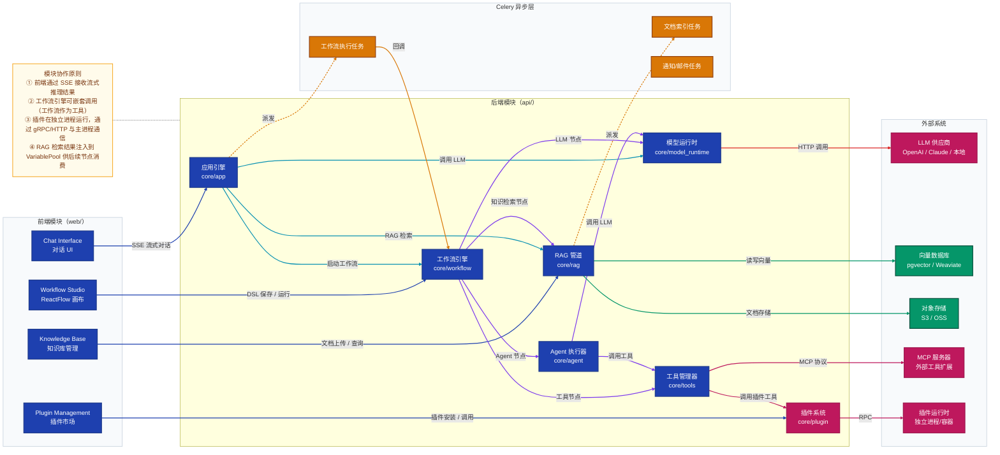

> **图后要点**
> - **为什么 Workflow Studio 同时连接 `core/workflow` 和 `core/app`**：保存草稿走 WorkflowService（纯 CRUD），而「运行」走 AppGenerateService（推理链路），两者职责不同，前者是元数据管理，后者是运行时执行，不应合并。
> - **为什么插件运行时（Plugin Runtime）是独立进程而非模块**：插件代码由第三方编写，质量不可控；独立进程提供操作系统级隔离，插件崩溃、内存泄漏、CPU 占满均不会波及主进程（详见 §6.6）。

---

## 6. 核心执行链路

### 6.1 后端：工作流推理完整请求流

下图追踪一次工作流推理请求的**完整生命周期**，从 API 客户端发起 HTTP 请求，到 SSE 流式响应返回，中间跨越 API 进程、Celery Worker 进程、LLM Provider 三个执行边界。阅读时重点关注**两条并行路径**：① 同步路径（API 进程订阅事件队列后立即返回 SSE 迭代器）；② 异步路径（Celery Worker 执行工作流并向 Redis 发布事件），两条路径通过 `AppQueueManager` 汇合。典型场景：用户通过 Service API 触发一个带 RAG 检索和 LLM 节点的工作流执行。

```mermaid
flowchart LR
    classDef userStyle     fill:#1e40af,stroke:#1e3a8a,stroke-width:2.5px,color:#fff
    classDef ctrlStyle     fill:#4f46e5,stroke:#3730a3,stroke-width:2px,color:#fff
    classDef svcStyle      fill:#0891b2,stroke:#155e75,stroke-width:2px,color:#fff
    classDef coreStyle     fill:#7c3aed,stroke:#5b21b6,stroke-width:2.5px,color:#fff
    classDef llmStyle      fill:#dc2626,stroke:#991b1b,stroke-width:2.5px,color:#fff
    classDef storeStyle    fill:#059669,stroke:#064e3b,stroke-width:2px,color:#fff
    classDef asyncStyle    fill:#d97706,stroke:#92400e,stroke-width:2px,color:#fff
    classDef noteStyle     fill:#fffbeb,stroke:#f59e0b,stroke-width:1.5px,color:#78350f
    classDef layerStyle    fill:#f8fafc,stroke:#cbd5e0,stroke-width:1.5px

    CLIENT2["API 客户端<br>POST /v1/workflows/run"]:::userStyle

    subgraph CTRL_LAYER["接入层"]
        WFCTRL["WorkflowRunController<br>鉴权 / 限流 / 参数校验"]:::ctrlStyle
    end
    class CTRL_LAYER layerStyle

    subgraph SVC_LAYER["服务层"]
        AGS["AppGenerateService.generate()<br>① 检查配额 ② 创建 WorkflowRun 记录<br>③ 投递 Celery 任务（异步）<br>④ 返回 SSE 流迭代器"]:::svcStyle
    end
    class SVC_LAYER layerStyle

    subgraph CELERY_LAYER["Celery Worker（异步执行）"]
        WF_TASK2["workflow_based_app_execution_task<br>① 实例化 WorkflowAppGenerator<br>② 订阅 AppQueueManager"]:::asyncStyle
    end
    class CELERY_LAYER layerStyle

    subgraph CORE_LAYER["核心引擎层"]
        direction TB
        WFG["WorkflowAppGenerator<br>① 加载 Workflow DSL<br>② 构建 Graph 对象<br>③ 初始化 VariablePool<br>④ 创建 WorkflowEntry"]:::coreStyle
        WFE["WorkflowEntry<br>① 装载系统变量<br>② 绑定中间件 Layer<br>③ 启动 GraphEngine"]:::coreStyle
        GE2["GraphEngine<br>① 拓扑排序节点<br>② 并发执行就绪节点<br>③ 事件驱动推进"]:::coreStyle
    end
    class CORE_LAYER layerStyle

    subgraph NODE_EXEC["节点执行（示例：LLM节点 → 知识检索节点）"]
        direction TB
        RAG_NODE["KnowledgeRetrievalNode<br>① 读取查询变量<br>② 调用 DatasetRetrieval<br>③ 向量检索 + Rerank<br>④ 写回 VariablePool"]:::svcStyle
        LLM_NODE["LLMNode<br>① 读取上下文变量<br>② 构建 Prompt<br>③ 调用 ModelManager<br>④ 流式接收 tokens"]:::coreStyle
        LLM_CALL["LLM Provider<br>OpenAI / Claude..."]:::llmStyle
    end
    class NODE_EXEC layerStyle

    subgraph STREAM_LAYER["流式响应层"]
        QUEUE2["AppQueueManager<br>事件队列（Redis Pub/Sub）"]:::asyncStyle
        TASK_PIPE2["TaskPipeline<br>① 消费队列事件<br>② 组装 SSE chunk<br>③ 持久化最终结果"]:::svcStyle
        RESPONSE["SSE 流式响应<br>data: {event, data}"]:::userStyle
    end
    class STREAM_LAYER layerStyle

    subgraph STORE_LAYER["持久化层"]
        PG2[("PostgreSQL<br>WorkflowRun / NodeExecution")]:::storeStyle
        VDB2[("向量数据库<br>Segment Embeddings")]:::storeStyle
    end
    class STORE_LAYER layerStyle

    CLIENT2 --> WFCTRL
    WFCTRL --> AGS
    AGS -->|"异步投递"| WF_TASK2
    AGS -->|"同步返回"| QUEUE2
    WF_TASK2 --> WFG
    WFG --> WFE
    WFE --> GE2
    GE2 -->|"执行节点"| RAG_NODE
    RAG_NODE -->|"查询向量库"| VDB2
    RAG_NODE -->|"结果写入"| LLM_NODE
    LLM_NODE -->|"HTTP Stream"| LLM_CALL
    LLM_CALL -->|"token chunks"| LLM_NODE
    LLM_NODE -->|"发布事件"| QUEUE2
    RAG_NODE -->|"发布事件"| QUEUE2
    GE2 -->|"图完成事件"| QUEUE2
    QUEUE2 --> TASK_PIPE2
    TASK_PIPE2 -->|"写入执行记录"| PG2
    TASK_PIPE2 --> RESPONSE
    CLIENT2 -->|"SSE 长连接监听"| RESPONSE

    NOTE4["关键设计：任务先投递再订阅<br>① API 进程投递 Celery 任务后立即返回 SSE 迭代器<br>② Worker 进程通过 Redis Pub/Sub 发布事件<br>③ API 进程消费 Pub/Sub 组装 SSE 推送给客户端<br>④ 存在竞态：API 先订阅再让 Worker 开始（200ms 定时器保底）"]:::noteStyle
    NOTE4 -.- QUEUE2

    %% 边索引：0-18，共 19 条
    linkStyle 0 stroke:#1e40af,stroke-width:2px
    linkStyle 1 stroke:#4f46e5,stroke-width:2px
    linkStyle 2 stroke:#d97706,stroke-width:2px,stroke-dasharray:4 3
    linkStyle 3 stroke:#0891b2,stroke-width:2px
    linkStyle 4,5,6 stroke:#7c3aed,stroke-width:2px
    linkStyle 7 stroke:#7c3aed,stroke-width:2px
    linkStyle 8 stroke:#059669,stroke-width:2px
    linkStyle 9 stroke:#059669,stroke-width:1.5px
    linkStyle 10 stroke:#dc2626,stroke-width:2px
    linkStyle 11 stroke:#dc2626,stroke-width:2.5px
    linkStyle 12,13,14 stroke:#d97706,stroke-width:2px
    linkStyle 15 stroke:#d97706,stroke-width:2px
    linkStyle 16 stroke:#059669,stroke-width:2px
    linkStyle 17 stroke:#1e40af,stroke-width:2.5px
    linkStyle 18 stroke:#1e40af,stroke-width:1.5px,stroke-dasharray:4 3
```

> **图后要点**
> - **为什么 API 进程先订阅再触发 Celery 任务**：Redis Pub/Sub 无消息持久化，若 Worker 先发布、API 后订阅，早期事件将永久丢失；反序操作保证 API 侧已就绪再允许 Worker 开始发布。
> - **为什么引入 200ms 定时器作为保底**：存在客户端建立 SSE 连接后迟迟不订阅（如网络慢）的极端情况，定时器确保任务在 200ms 后无条件启动，避免因客户端问题导致任务永远不执行。
> - **为什么 WorkflowEntry 负责装载系统变量而非 GraphEngine**：系统变量（如 `sys.user_id`、`sys.app_id`）是执行上下文的一部分，在图开始执行前就必须注入变量池；GraphEngine 只负责图遍历和节点调度，不应感知应用层上下文，职责边界由此划定。

### 6.2 RAG 文档索引链路

下图覆盖 RAG 知识库的**两个阶段**：左侧「索引阶段」（文档上传到向量落库）和右侧「查询阶段」（用户提问到结果排序），两阶段共用 Embedding 模型和向量数据库。阅读时重点关注分块层的三种策略（固定/父子/QA）如何影响索引结构，以及查询时两路检索（向量 + 关键词）如何通过 RRF 融合。

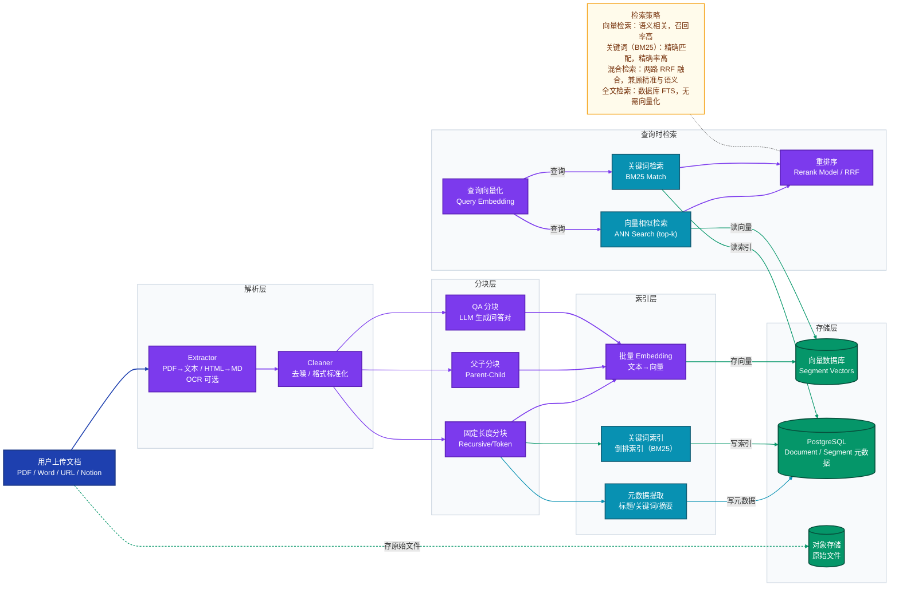

> **图后要点**
> - **为什么 QA 分块需要 LLM 参与**：QA 分块将原始文本转化为问答对，用「问题」做索引键——用户提问与「问题」的语义匹配度远高于与原始段落的匹配度，但代价是索引阶段需要额外 LLM 调用，适合问答类知识库场景。
> - **为什么索引阶段将原始文件单独存入对象存储**：向量库和 PostgreSQL 只存摘要信息（向量和元数据），原始文件过大不适合存入；对象存储负责大文件，且支持后续重新索引（如更换分块策略时无需用户重新上传）。
> - **为什么 Rerank 放在检索最末端而非过滤器**：Rerank 模型（CrossEncoder）计算精度高但速度慢，不适合对全量候选做排序；让向量/关键词检索先粗筛 top-k（通常 20~50），再由 Rerank 精排前 k 个，兼顾效果和性能。

### 6.3 前端：工作流编辑器交互流

下图描述开发者在工作流编辑器中**从编辑到运行**的完整前端交互路径，展示 ReactFlow 画布、Zustand 状态层、自定义 Hooks、API 服务层四层的分工与数据流转方向。阅读时重点关注**两条并行流**：编辑保存流（左→下→后端 Draft 存储）和运行观测流（触发→SSE 推流→状态回填→画布渲染）。

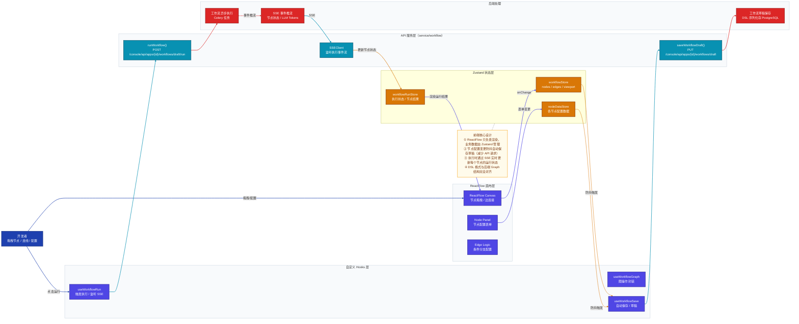

> **图后要点**
> - **为什么 ReactFlow 只负责渲染而不持有数据**：ReactFlow 的 `nodes` / `edges` 状态若同时承担业务数据会导致组件与业务强耦合，难以跨组件共享；Zustand 作为全局状态中心，使画布渲染、节点面板配置、运行结果三者可以独立订阅同一数据源，互不干扰。
> - **为什么编辑变更采用防抖自动保存而非手动保存按钮**：用户在频繁拖拽节点时每次变更都触发 API 会造成大量请求；防抖（通常 300ms~1s）将连续操作合并为一次保存，既保证数据不丢失，又避免服务端压力。
> - **为什么 SSE 事件回填到 `workflowRunStore` 而不直接更新 ReactFlow 节点**：将执行状态（进行中/成功/失败）集中在独立 Store，使画布层只是「订阅并渲染」而非「混合管理」，职责清晰，也便于在非画布场景（如历史记录页面）复用相同的执行状态数据。

### 6.4 Agent 执行链路（CoT ReAct 模式）

下图展示 **CoT（Chain of Thought）Agent** 的 ReAct 执行循环，核心是 Thought → Action → Observation 的迭代，循环直到 LLM 输出 Final Answer 或触发终止条件。阅读时重点关注**循环体内部**（左侧 subgraph）与**工具池**（右侧 subgraph）的分工：Agent 循环负责决策和状态管理，工具池负责实际能力执行，两者通过统一的 `ToolExecution` 接口解耦。

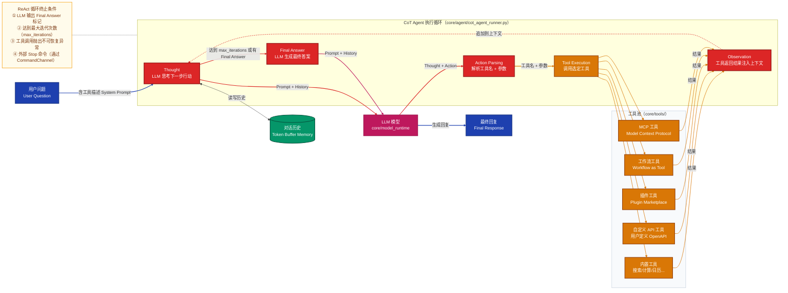

> **图后要点**
> - **为什么 CoT 和 Function Calling 是两种并行实现（`cot_agent_runner.py` + `fc_agent_runner.py`）**：CoT（ReAct 文本推理）适用于不原生支持 Function Calling 的模型（如部分开源模型），FC 则利用 OpenAI 等模型的原生结构化输出能力，精度更高；Dify 同时支持两种，确保不同模型都能运行 Agent 模式。
> - **为什么工具描述要注入 System Prompt**：LLM 需要在生成 Thought 时就知道有哪些工具可用（名称、参数描述），这些描述越精确，Action 的准确率越高；Dify 在每轮对话开始前将当前可用工具的 Schema 渲染到 System Prompt 中。
> - **为什么对话历史使用 Token Buffer Memory 而非完整历史**：LLM 的 context window 有限，过长历史会导致 prompt 溢出；Token Buffer Memory 按 token 数滑动窗口截断，保留最近的对话，同时严格控制总 token 用量。

### 6.5 多协议入口对比

下图横向对比 Dify 的四种 API 入口，展示各入口在**认证方式、权限范围、适用场景**上的差异，以及四者最终汇聚到同一个 `AppGenerateService` 的收敛点。阅读时重点关注各入口节点内的三行特征（认证方式 / 功能范围 / 版本状态），快速建立"不同调用方对应不同入口"的直觉。

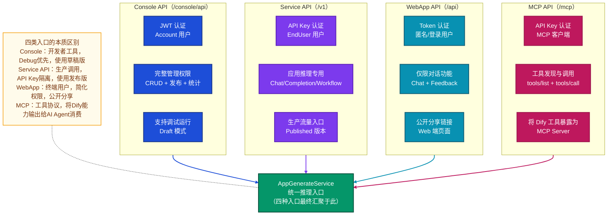

> **图后要点**
> - **为什么四个入口最终汇聚到同一个 `AppGenerateService`**：推理逻辑（配额检查、速率限制、工作流调度、SSE 组装）与调用来源无关，统一入口避免重复实现，并保证所有入口享有相同的业务一致性保证。
> - **为什么 MCP 入口接到工具层而非应用层**：MCP 协议的语义是「工具发现与调用」（`tools/list` + `tools/call`），Dify 在此角色是 MCP Server，对外暴露工具能力，而非 MCP Client 调用外部工具，两者方向相反，入口连接点不同。

### 6.6 插件系统扩展机制

下图展示插件从**主进程调用到独立进程执行**的完整 RPC 路径，以及插件反向回调主进程能力（BackwardsInvocation）的双向通信机制。阅读时重点关注 RPC 层的位置——它是主进程与插件运行时之间唯一的通信边界，所有数据传递都必须经过序列化/反序列化，这正是实现进程隔离的关键。

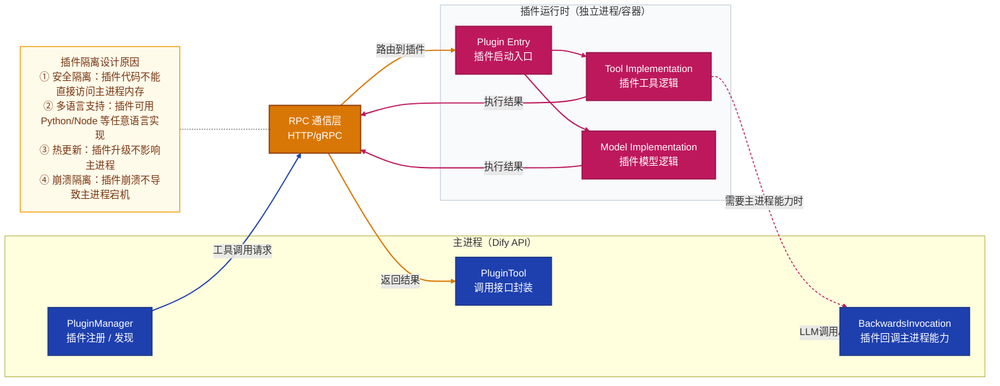

> **图后要点**
> - **为什么 BackwardsInvocation（插件回调主进程）需要单独设计**：插件在执行过程中可能需要主进程的能力（如调用 LLM、访问知识库、读取上传文件），若直接调用主进程内存会破坏隔离；BackwardsInvocation 将这些能力封装为显式 RPC 接口，插件只能调用被授权的能力，主进程保持对权限边界的完整控制。
> - **为什么插件工具和插件模型都在同一个 Plugin Runtime 进程中**：复用单一运行时降低了部署和管理复杂度，同一插件包可以同时提供工具和模型两种扩展类型，而不需要维护两套独立进程。

---

## 7. 关键设计决策

### 7.1 为什么用 Celery + Redis 而不是在主进程中同步执行工作流？

**问题背景**：工作流执行可能耗时数秒乃至数分钟，HTTP 请求不能长时间阻塞。

**决策分析**：
- **方案 A（同步执行）**：Worker 线程或协程直接执行，但 Flask 在 Gunicorn 下线程数有限，长时间执行会耗尽连接池，且无法跨进程扩展。
- **方案 B（Celery 异步）**：API 进程只负责创建任务记录和返回 SSE 迭代器，Worker 进程独立执行工作流，通过 Redis Pub/Sub 将事件回传给 API 进程。

**选择 B 的原因**：
1. **水平扩展**：Worker 可以独立于 API 进程横向扩容
2. **隔离性**：长时间 LLM 调用不阻塞 HTTP 接入层
3. **可重试**：Celery 内建失败重试机制
4. **可观测**：任务状态持久化到 Redis，随时可查询

**代价与补偿**：引入了 API 进程与 Worker 进程之间的发布-订阅竞态问题（Worker 可能在 API 订阅 Redis 频道之前就开始发布事件）。代码中用 200ms 定时器作为保底，确保即使客户端未及时订阅，任务也会启动。

---

### 7.2 为什么 Model Runtime 设计成三层（工厂 → 供应商 → 模型）？

**问题背景**：需要支持 50+ 个模型供应商、6 种模型类型，且前端无需修改即可展示新供应商的配置表单。

**决策**：采用「配置驱动」架构：
- 供应商和模型的凭据表单规则（字段名、类型、是否必填）在后端 YAML 中定义
- 前端通过 API 获取 Schema，动态渲染表单
- 新增供应商只需添加后端代码，无需触碰前端

**为什么不用纯接口注入**：YAML 配置使得非工程师（如技术文档作者）可以定义新供应商的配置规则，降低了扩展成本。

---

### 7.3 为什么工作流引擎内部用 import-linter 强制分层？

**问题背景**：工作流引擎是整个系统最复杂的子系统，有 10+ 个内部模块，历史上曾出现循环依赖导致难以维护的情况。

**决策**：引入 `.importlinter` 配置文件，通过 CI 静态检查强制确保模块依赖方向：
```
graph_engine → graph_events → graph → nodes → node_events → entities
```

**为什么不依赖代码审查**：人工审查容易遗漏间接依赖，而 import-linter 在 CI 阶段自动拦截，将架构约束编码为可执行的规则。

---

### 7.4 为什么 RAG 支持多种向量数据库而不绑定一种？

**问题背景**：不同企业有不同的基础设施偏好（有的已有 Milvus，有的偏好全托管的 Pinecone）。

**决策**：抽象 `VectorBase` 接口，每种向量数据库实现相同的 `add` / `search` / `delete` 方法，上层 RAG 代码只依赖接口。

**代价**：接口是最小公分母，部分向量库的高级特性（如 Weaviate 的图查询）无法通过统一接口使用。

---

### 7.5 为什么选择 Server-Sent Events（SSE）而不是 WebSocket？

**问题背景**：LLM 推理结果需要逐 token 流式传输给客户端。

**决策分析**：
- **WebSocket**：双向通信，但需要状态管理，与 HTTP 负载均衡器（Nginx）集成较复杂
- **SSE**：单向服务器推送，基于标准 HTTP，天然兼容 Nginx/CDN，客户端自动重连

**选择 SSE 的原因**：LLM 流式输出是典型的单向服务器推送场景，客户端不需要在流传输过程中发送消息，SSE 的简单性远胜于 WebSocket 带来的复杂性。

---

### 7.6 为什么用 VariablePool 而不是直接在节点间传递数据？

**问题背景**：工作流图中节点可并发执行，需要一个安全的跨节点数据共享机制。

**决策**：VariablePool 提供命名空间隔离的变量存储：每个节点通过 `[node_id, output_key]` 路径读写，避免命名冲突，支持并发安全访问。

**为什么不用全局字典**：全局字典无法防止不同节点的同名输出覆盖彼此，而命名空间设计天然隔离，且便于调试时定位某个变量来自哪个节点。

---

## 8. 部署架构

下图展示 Dify 基于 Docker Compose 的**生产部署拓扑**，从上到下分为反向代理层、应用层（可水平扩展）、数据层（有状态）三层。阅读时重点关注**哪些服务可以横向扩展**（无状态的 API 进程和 Celery Worker）、**哪些不能**（PostgreSQL 和 Redis 需要主从或集群方案单独规划），以及 Sandbox 和 Plugin Daemon 两个安全隔离组件的位置。

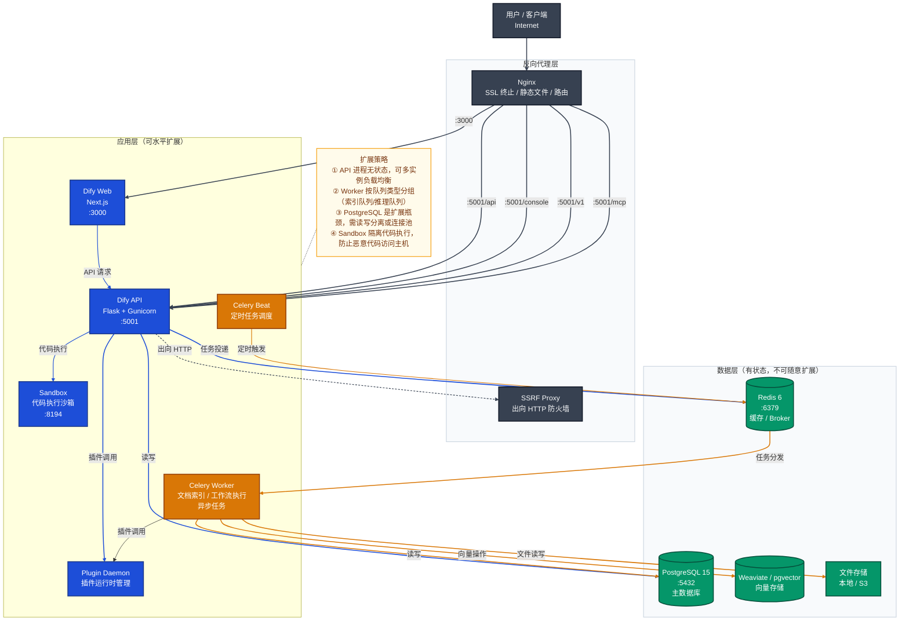

> **图后要点**
> - **为什么 SSRF Proxy 是必需组件而非可选**：工作流的 HTTP 请求节点和外部数据工具允许用户配置任意 URL，若不加防护，攻击者可以配置内网地址（如 `http://169.254.169.254/`）实施 SSRF 攻击访问云服务元数据；SSRF Proxy 作为出向 HTTP 流量的统一出口，在此做 IP/域名白名单过滤。
> - **为什么 Celery Beat 要单独部署而非合并到 Worker**：Beat 是定时任务调度器，全局只能有一个实例；若和 Worker 合并部署，多 Worker 实例会导致 Beat 多实例并发调度，同一任务被重复触发；单独部署确保调度的唯一性。
> - **为什么 Sandbox 监听独立端口（:8194）而非嵌入 API 进程**：代码执行节点运行用户提供的 Python/JavaScript 代码，恶意代码可能 fork 子进程、访问文件系统或网络；Sandbox 以独立进程 + seccomp 系统调用过滤提供沙箱环境，即使代码逃逸也只能危害 Sandbox 进程而非主进程。

---

## 9. FAQ

### 基本原理

---

#### Q1：Dify 的「工作流」和「Agent 对话」有什么本质区别？什么场景下选哪种？

**答**：两者的本质区别在于**控制流的确定性**：

| 维度 | 工作流（Workflow） | Agent 对话（AgentChat） |
|------|-------------------|------------------------|
| **控制流** | 开发者预先编排的有向无环图，路径确定 | LLM 在运行时动态决定下一步行动（ReAct 循环） |
| **可预测性** | 高，每次执行路径相同（分支由条件决定） | 低，LLM 每次可能选择不同工具和步骤 |
| **可调试性** | 强，可看到每个节点的输入输出 | 弱，推理过程在 LLM 内部 |
| **适用场景** | 数据处理管道、文档分析、标准化业务流程 | 开放性问答、需要自主决策的复杂任务 |

**选择原则**：如果流程步骤固定且可枚举，用工作流；如果任务需要 LLM 自主判断执行顺序，用 Agent。

---

#### Q2：Dify 的 RAG 知识库支持哪些检索模式？各自原理是什么？

**答**：支持四种检索模式：

1. **向量检索（Semantic Search）**：将查询和文档都转为向量，计算余弦相似度，召回语义相似内容。适合语义理解，但可能漏掉精确关键词匹配。

2. **全文检索（Full-text Search）**：使用 PostgreSQL 的全文检索能力（tsvector/tsquery），基于词频和倒排索引。适合精确词汇匹配，不理解语义。

3. **混合检索（Hybrid Search）**：同时执行向量检索和全文检索，通过 **RRF（Reciprocal Rank Fusion）** 算法融合两路排名，取长补短。

4. **经济模式（Economy）**：仅使用关键词索引，不调用 Embedding 模型，成本最低，但效果较差。

混合检索是最推荐的模式，RRF 公式为：`score = Σ 1/(k + rank_i)`，其中 k=60 是平滑系数。

---

#### Q3：Dify 支持哪些模型类型？如何扩展新的模型供应商？

**答**：支持 6 种模型类型：

- **LLM**：文本生成/对话（最常用）
- **Text Embedding**：文本向量化（用于 RAG 知识库）
- **Rerank**：对检索结果重排序（提升 RAG 精确度）
- **Speech-to-Text**：语音识别
- **Text-to-Speech**：文本转语音
- **Moderation**：内容审核

**扩展新供应商**：
1. 在 `api/core/model_runtime/model_providers/` 下创建新目录
2. 编写供应商类（继承 `ModelProvider`）和 YAML 配置（定义凭据字段）
3. 为每种支持的模型类型实现对应的模型类
4. 前端无需任何修改，配置表单自动从后端 Schema 渲染

---

#### Q4：Dify 的多租户隔离是如何实现的？

**答**：Dify 的租户隔离采用**共享数据库 + 行级隔离**策略：

1. **数据库层**：所有表都有 `tenant_id` 字段，每个查询必须携带 `tenant_id` 条件（后端代码通过 `AlwaysEqualCondition` 确保）
2. **API 层**：登录用户的 JWT Token 中包含 `tenant_id`，控制器解析后传递到 Service 层
3. **模型凭据**：每个租户的 API Key 单独加密存储，互不可见
4. **向量数据库**：知识库数据通过 `dataset_id`（归属于 `tenant_id`）在向量数据库中隔离

这种设计的优点是运维简单（单数据库），缺点是高权限的 DBA 理论上能看到所有租户数据。

---

### 设计决策

---

#### Q5：为什么工作流引擎使用事件驱动而不是直接的函数调用链？

**答**：事件驱动架构在工作流引擎中解决了三个核心问题：

1. **并发执行**：图中无依赖关系的节点可以并行执行。若用同步函数链，并行执行需要显式的线程管理；事件驱动下，节点完成后发出事件，GraphEngine 监听到就绪节点自动触发执行。

2. **实时可观测**：前端需要实时看到每个节点的执行状态（进行中/成功/失败）。事件驱动下，NodeRunStartedEvent / NodeRunSucceededEvent 等事件自然形成观测点，无需在节点代码中手动埋点。

3. **外部控制**：用户可以随时暂停或停止正在运行的工作流。CommandChannel 模式下，外部控制信号通过事件机制安全注入，GraphEngine 在节点边界检查命令并响应。

---

#### Q6：AppQueueManager 和 SSE 之间是怎么配合的？为什么有竞态风险？

**答**：两者通过 Redis Pub/Sub 解耦：

1. **Celery Worker** 执行工作流，产生事件后调用 `AppQueueManager.publish()` → 写入 Redis 频道
2. **API 进程** 通过 `AppQueueManager.listen()` 订阅 Redis 频道 → 消费事件组装 SSE → 推送给客户端

**竞态风险**：Redis Pub/Sub 是"即时送达"语义（无持久化），若 Worker 在 API 进程订阅前就开始发布，早期事件会丢失。

**解决方案**：代码中采用了双重保障：
- API 进程在返回 SSE 迭代器之前设置订阅，然后才触发 Celery 任务
- 引入 200ms 定时器作为保底：即使客户端迟到，任务也会在 200ms 后启动

---

#### Q7：工作流 DSL 是什么格式？前后端如何保持一致？

**答**：工作流 DSL 是一个 JSON 结构（存储于 PostgreSQL 的 `workflow.graph` 字段），格式为：

```json
{
  "nodes": [
    {
      "id": "start",
      "type": "start",
      "data": { "variables": [...] }
    },
    {
      "id": "llm_1",
      "type": "llm",
      "data": { "model": {...}, "prompt_template": [...] }
    }
  ],
  "edges": [
    {
      "id": "edge_1",
      "source": "start",
      "target": "llm_1"
    }
  ]
}
```

**一致性保障**：
- 前端 ReactFlow 的 nodes/edges 直接映射到此 DSL，前端编辑后序列化提交
- 后端 `Graph` 类解析 DSL 构建执行图
- 类型定义在前端 `types.ts` 和后端 Pydantic 模型中各自维护，通过端到端测试验证兼容性

---

#### Q8：Model Runtime 的负载均衡是如何工作的？

**答**：`model_load_balancing_service.py` 实现了针对同一模型的多个 API Key 的轮询负载均衡：

1. 用户可以为同一模型（如 GPT-4）配置多个 API Key（备用 Key）
2. `ModelLoadBalancingService` 维护每个 Key 的可用状态（正常/冷却中）
3. 调用时轮询选择可用 Key，若某 Key 触发限流（429）则标记为冷却，自动切换到下一个
4. 冷却期过后 Key 重新恢复可用

这种设计允许企业通过配置多个 API Key 突破单 Key 的 RPM 限制，无需修改代码。

---

### 实际应用

---

#### Q9：如何在 Dify 工作流中实现"工作流嵌套调用"？有什么限制？

**答**：Dify 通过「工作流即工具（Workflow as Tool）」实现嵌套：

1. 将一个已发布的工作流配置为工具，可在另一个工作流的 **Tool 节点**中调用
2. 或在 Agent 中将工作流作为可用工具

**核心实现**：`WorkflowEntry` 在初始化时检查 `call_depth`，超过 `WORKFLOW_CALL_MAX_DEPTH`（默认 5）即抛出异常，防止无限递归。

**限制**：
- 最大嵌套深度：`WORKFLOW_CALL_MAX_DEPTH` 配置项控制（默认 5 层）
- 被调用的工作流必须是已发布版本（Draft 不可作为工具使用）
- 跨租户调用不被支持

---

#### Q10：Dify 的 Human Input（人工审核）节点是如何工作的？

**答**：Human Input 节点允许工作流在执行到某步骤时暂停，等待人工审核后继续：

1. 工作流执行到 Human Input 节点时，`GraphEngine` 发出 `PauseCommand` 并持久化当前状态（节点输出、变量池）到 Redis/PostgreSQL
2. 系统向指定人员发送通知（邮件/Webhook）
3. 人工审核员通过控制台或 API 提交决策
4. 后端恢复工作流执行，将人工输入注入变量池，继续后续节点

**超时处理**：`human_input_timeout_tasks.py` 中有定时任务，若超时未审核，自动以默认值继续或中止工作流。

---

#### Q11：如何通过 Service API 实现流式对话？客户端需要处理哪些事件类型？

**答**：Service API 流式接口为 `POST /v1/chat-messages`（设置 `stream: true`），返回 Server-Sent Events：

主要事件类型：

| 事件 | 含义 |
|------|------|
| `message` | LLM 输出的 token 片段 |
| `message_file` | LLM 输出的文件（如生成的图片） |
| `agent_message` | Agent 模式下的思考过程 |
| `agent_thought` | Agent 的 Thought/Action/Observation |
| `message_end` | 对话完成，包含 usage 统计 |
| `error` | 错误信息 |
| `workflow_started` | 工作流开始执行 |
| `node_started` / `node_finished` | 节点执行状态 |

客户端示例（Python）：
```python
import httpx

with httpx.stream("POST", "https://api.dify.ai/v1/chat-messages",
                  json={"query": "你好", "stream": True},
                  headers={"Authorization": "Bearer your-api-key"}) as r:
    for line in r.iter_lines():
        if line.startswith("data:"):
            event = json.loads(line[5:])
            print(event)
```

---

### 性能优化

---

#### Q12：文档索引耗时较长，如何优化 RAG 知识库的索引速度？

**答**：索引瓶颈通常在以下环节，对应优化策略：

| 瓶颈 | 原因 | 优化方法 |
|------|------|---------|
| **Embedding 调用延迟** | 每个文档分段都需调用 Embedding API | 批量调用（Dify 内部已实现批处理），选择更快的本地 Embedding 模型（如 BGE） |
| **Celery Worker 数量** | 单 Worker 串行处理 | 增加 Worker 实例，配置 `CELERY_WORKER_AMOUNT` |
| **文档解析** | PDF OCR 耗时 | 对扫描件开启异步 OCR，或预先将 PDF 转为 Markdown |
| **向量写入** | 向量库写入阻塞 | 选择写入性能好的向量库（如 pgvector 对小规模最优） |
| **分段数量** | 分段过细导致段数过多 | 调大分段长度（max_tokens），减少总段数 |

**关键配置**：
```bash
# 增加并行索引任务数
CELERY_WORKER_AMOUNT=4
# 增大 Embedding 批处理大小
EMBEDDING_BATCH_SIZE=32
```

---

#### Q13：工作流执行性能瓶颈在哪里？如何诊断和优化？

**答**：工作流性能瓶颈分三类：

**1. LLM 推理延迟（最主要）**
- 诊断：查看 NodeExecution 记录中每个 LLM 节点的 `elapsed_time`
- 优化：使用更快的模型（如 GPT-4o-mini 替代 GPT-4），启用流式输出减少感知延迟

**2. 串行节点可并行化**
- 诊断：检查工作流 DAG，找出无依赖关系但串行连接的节点
- 优化：将独立节点改为并行分支（GraphEngine 自动并发执行无依赖节点）

**3. 重复 RAG 检索**
- 诊断：同一 Workflow Run 中多次查询相同知识库相同问题
- 优化：在工作流中引入「缓存变量」，将首次检索结果存入变量池供后续节点复用

**可观测工具**：Dify 通过 OpenTelemetry 输出追踪数据，可接入 Jaeger / Grafana 查看每个节点的完整耗时链路。

---

#### Q14：Dify 在高并发场景下如何保证稳定性？

**答**：高并发稳定性从几个维度设计：

**限流机制**：
- `RateLimit` 类（`core/app/features/rate_limiting/`）基于 Redis 实现滑动窗口限流
- 按 App 维度控制并发请求数，超限返回 429

**配额管理**：
- 每个租户的 LLM 调用次数/Token 数有配额限制
- `QuotaType` 枚举定义不同配额类型，`billing_service` 检查并扣减

**资源隔离**：
- Celery 按任务类型分队列（`dataset`/`mail`/`app_generate`），避免低优先级任务（文档索引）阻塞高优先级任务（用户对话）
- 代码执行节点通过 Sandbox 隔离，防止恶意代码影响主进程

**数据库连接管理**：
- SQLAlchemy 连接池配置（`pool_size` / `max_overflow`）
- Worker 和 API 进程各自维护独立连接池
- 长事务（如文档索引）在 Worker 中执行，不占用 API 进程连接

**优雅降级**：
- 向量数据库不可用时，可降级为关键词检索（全文检索）
- 单个节点失败时，工作流记录错误并终止，不影响其他并发执行的工作流

---

## 附录：关键文件索引

| 功能 | 关键文件路径 |
|------|------------|
| Flask 应用创建 | `api/app_factory.py` |
| 工作流引擎入口 | `api/core/workflow/workflow_entry.py` |
| 图引擎执行器 | `api/core/workflow/graph_engine/` |
| 应用推理统一入口 | `api/services/app_generate_service.py` |
| RAG 检索核心 | `api/core/rag/retrieval/dataset_retrieval.py` |
| 模型管理器 | `api/core/model_manager.py` |
| Agent 执行（CoT） | `api/core/agent/cot_agent_runner.py` |
| Agent 执行（FC） | `api/core/agent/fc_agent_runner.py` |
| Celery 异步任务 | `api/tasks/` |
| 工作流前端画布 | `web/app/components/workflow/index.tsx` |
| 前端工作流类型定义 | `web/app/components/workflow/types.ts` |
| 文档索引任务 | `api/tasks/document_indexing_task.py` |
| 插件系统 | `api/core/plugin/` |
| Docker 部署 | `docker/docker-compose.yaml` |
