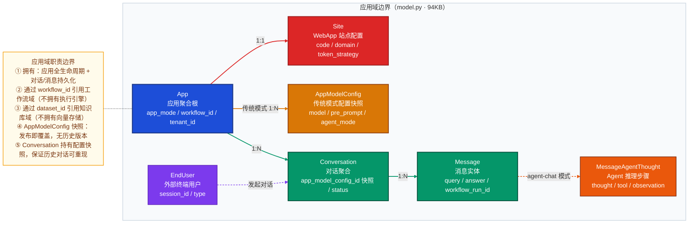
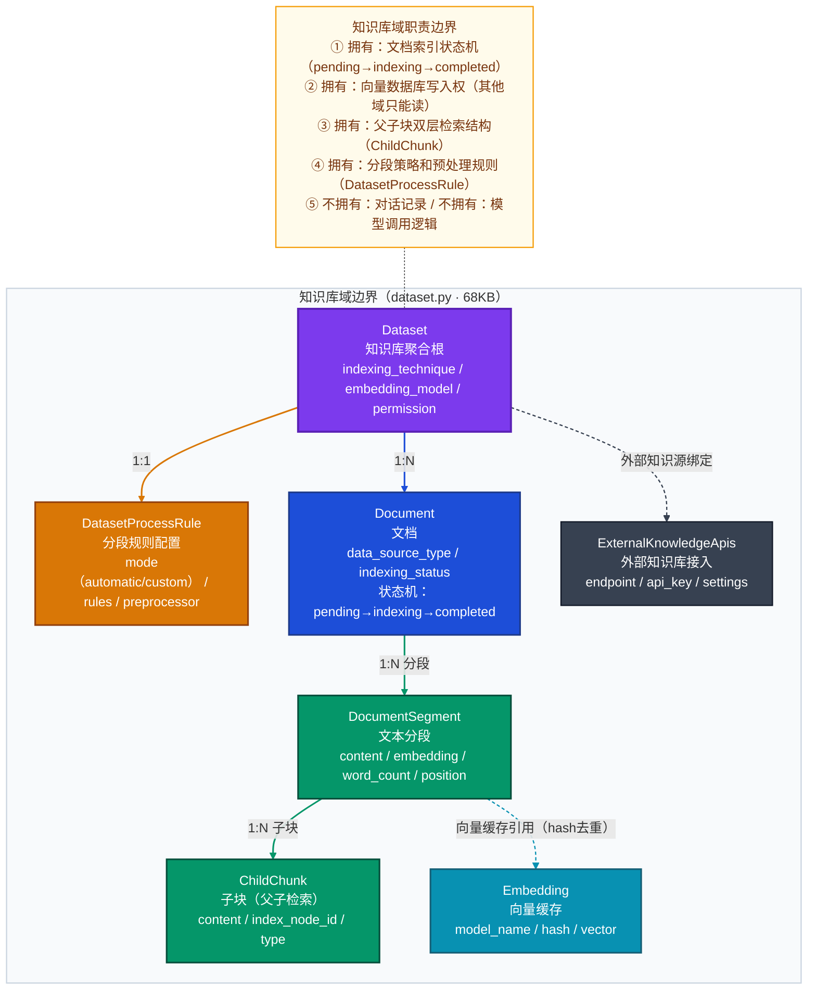
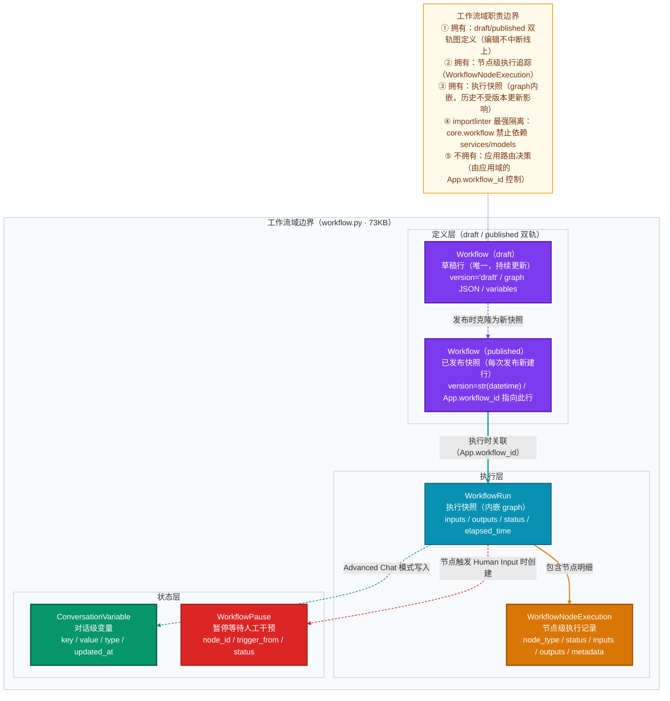
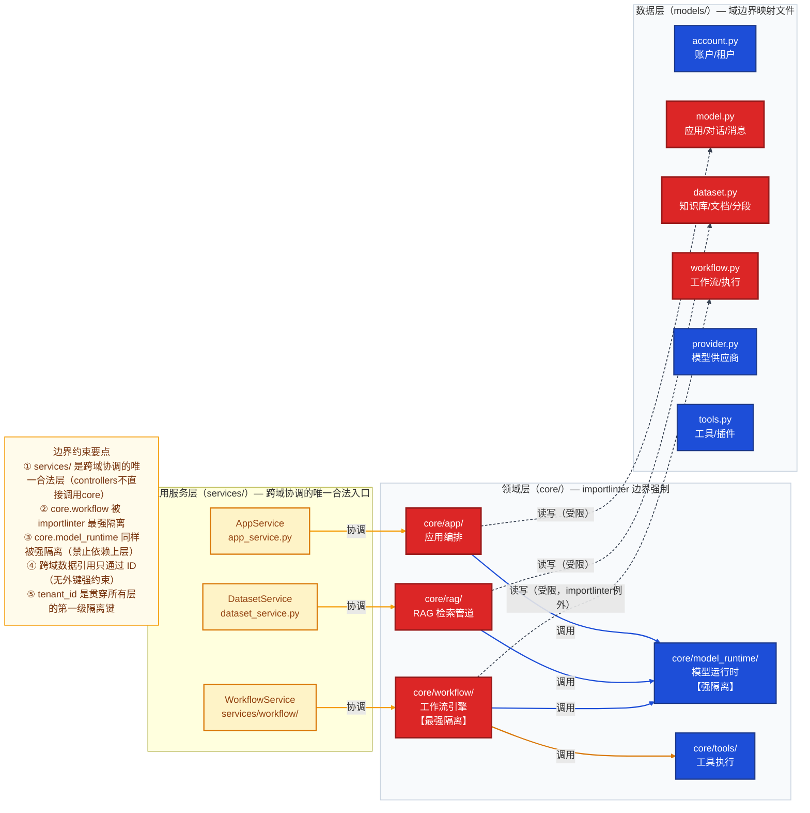

# Dify DDD 子域划分

> 本文档回答三个核心问题：**子域是基于什么划分的？** **每个子域的职责和边界是什么？** **子域之间如何协作和隔离？**
>
> 架构文档中已有三层视图：**DDD 四层边界图**（代码架构）、**聚合根关系图**（领域模型）、**系统架构图**（组件部署）。本文聚焦于"业务域划分"这一战略设计层面，是理解整个系统设计意图的起点。

---

## 一、子域划分的依据

### 1.1 划分原则

Dify 的子域划分遵循 DDD（领域驱动设计）战略设计的五个核心维度：

| 划分维度 | 判断标准 | Dify 中的体现 |
|----------|---------|-------------|
| **业务价值** | 该能力是否直接对应用户的核心使用场景？ | 应用域/工作流域/知识库域直接对应产品核心功能 |
| **数据主权** | 该子域是否独占其数据的写入权？跨域只能通过 ID 引用 | `tenant_id` 为第一级隔离键，跨域无外键强约束 |
| **代码隔离** | `importlinter` 是否在模块层面强制了边界？ | `core.workflow` 和 `core.model_runtime` 有最强隔离约束 |
| **独立变化率** | 内部变更是否不会影响其他子域？ | 知识库域的分段策略变更不影响工作流执行引擎 |
| **差异化程度** | 该能力是产品竞争壁垒，还是通用基础设施？ | RAG 多路检索是差异化能力（核心域），账户管理是通用能力（支撑域） |

### 1.2 从代码结构识别边界

Dify 将"领域边界"物化到了三个层次的代码结构中：

```
api/
├── models/                    ← 数据边界：每个文件对应一个子域
│   ├── account.py  (16KB)     ← 账户/租户域
│   ├── model.py    (94KB)     ← 应用域（含对话/消息）
│   ├── dataset.py  (68KB)     ← 知识库域
│   ├── workflow.py (73KB)     ← 工作流域
│   ├── provider.py (15KB)     ← 模型供应商域
│   ├── tools.py    (21KB)     ← 工具/插件域
│   └── trigger.py  (21KB)    ← 触发器域
│
├── core/                      ← 领域逻辑边界：importlinter 强制约束
│   ├── app/                   ← 应用编排（协调各域）
│   ├── workflow/              ← 工作流引擎（最强隔离：禁止依赖 models/services）
│   ├── rag/                   ← RAG 检索管道
│   ├── model_runtime/         ← 模型运行时（强隔离：禁止依赖上层）
│   └── tools/                 ← 工具执行层
│
└── services/                  ← 应用服务边界：协调跨域操作的唯一合法层
    ├── app_service.py
    ├── dataset_service.py
    ├── workflow/
    └── ...
```

### 1.3 importlinter：边界的代码级保障

`api/.importlinter` 文件不只是约定，它是可执行的边界验证。关键约束：

- **`core.workflow` 禁止依赖**：`models`、`services`、`controllers`、`configs` 等基础设施层（70+ 条例外均有明确注释）
- **`core.model_runtime` 禁止依赖**：所有上层业务模块，只暴露抽象接口
- **`core.workflow.graph_engine.domain` 禁止依赖**：同级别的 worker_management、command_channels 等（内部分层隔离）

这保证了工作流引擎和模型运行时是纯粹的领域逻辑，可独立测试、可提取为独立服务。

---

## 二、Dify 数据域全景地图

基于实际代码的 Dify 数据域划分，建议按依赖顺序逐步分析：

| 分析顺序 | 领域 | 核心问题 | 对应 models/ 文件 |
|---|---|---|---|
| ① | **账户/租户域**（Account & Tenant） | 租户隔离如何在数据层实现？多用户多租户的权限体系如何设计？ | `account.py` |
| ② | **应用域**（App & Config） | 应用配置如何存储？对话和消息如何与应用绑定？ | `model.py` |
| ③ | **知识库域**（Knowledge/RAG） | 文档分段和向量的持久化边界在哪？索引状态机如何工作？ | `dataset.py` |
| ④ | **工作流域**（Workflow & Execution） | draft/published 双轨如何支撑不中断发布？工作流执行快照如何设计？ | `workflow.py` |
| ⑤ | **模型供应商域**（Model Provider） | 多供应商配置与加密凭据如何隔离？系统配额 vs 用户自定义如何共存？ | `provider.py` |
| ⑥ | **工具/插件域**（Tool & Plugin） | 内置工具、自定义工具、插件工具在数据层有何不同？ | `tools.py`, `oauth.py`, `source.py` |
| ⑦ | **触发器域**（Trigger） | 工作流触发器如何订阅外部事件？Webhook 配置如何存储？ | `trigger.py` |
| ⑧ | **异步任务域**（Task） | Celery 任务和任务集的持久化如何设计？ | `task.py` |
| ⑨ | **人工输入域**（Human Input） | 工作流暂停时的人工输入表单和投递如何管理？ | `human_input.py` |
| ⑩ | **Web 扩展域**（Web） | 保存消息、置顶对话等用户个性化配置如何存储？ | `web.py` |
| ⑪ | **API 扩展域**（API Based Extension） | API 扩展配置如何存储？ | `api_based_extension.py` |

---

## 三、子域分类与全景图

### 子域分类标注

#### 核心域（Core Domain）— 竞争差异化能力
- **应用域**（App & Config）— 产品核心功能
- **知识库域**（Knowledge/RAG）— 差异化核心能力
- **工作流域**（Workflow & Execution）— 核心编排能力

#### 支撑域（Supporting Domain）— 核心能力的基础支撑
- **账户/租户域**（Account & Tenant）— 基础设施
- **模型供应商域**（Model Provider）— 核心支撑
- **工具/插件域**（Tool & Plugin）— 能力扩展

#### 边缘域（Generic Domain）— 通用基础设施
- **触发器域**（Trigger）
- **异步任务域**（Task）
- **人工输入域**（Human Input）
- **Web 扩展域**（Web）
- **API 扩展域**（API Based Extension）

### 全景架构图

```mermaid
flowchart TB
    %% ── 配色：按 DDD 子域类型区分 ──────────────────────────────────
    classDef coreStyle      fill:#dc2626,stroke:#991b1b,stroke-width:2.5px,color:#fff
    classDef supportStyle   fill:#1d4ed8,stroke:#1e3a8a,stroke-width:2px,color:#fff
    classDef genericStyle   fill:#374151,stroke:#111827,stroke-width:1.5px,color:#fff
    classDef infraStyle     fill:#059669,stroke:#064e3b,stroke-width:2px,color:#fff
    classDef noteStyle      fill:#fffbeb,stroke:#f59e0b,stroke-width:1.5px,color:#78350f
    classDef layerStyle     fill:#f8fafc,stroke:#cbd5e0,stroke-width:1.5px
    classDef infraLayerStyle fill:#f0fdf4,stroke:#86efac,stroke-width:1.5px

    %% ── 核心域 ───────────────────────────────────────────────────
    subgraph CORE["核心域（Core Domain）— 竞争差异化能力"]
        direction LR
        APP["应用域<br>App & Config<br>model.py · 94KB"]:::coreStyle
        RAG["知识库域<br>Knowledge / RAG<br>dataset.py · 68KB"]:::coreStyle
        WF["工作流域<br>Workflow & Execution<br>workflow.py · 73KB"]:::coreStyle
    end
    class CORE layerStyle

    %% ── 支撑域 ───────────────────────────────────────────────────
    subgraph SUPPORT["支撑域（Supporting Domain）— 核心能力的基础支撑"]
        direction LR
        ACCT["账户/租户域<br>Account & Tenant<br>account.py · 16KB"]:::supportStyle
        MODEL["模型供应商域<br>Model Provider<br>provider.py · 15KB"]:::supportStyle
        TOOL["工具/插件域<br>Tool & Plugin<br>tools.py · 21KB"]:::supportStyle
    end
    class SUPPORT layerStyle

    %% ── 边缘域 ───────────────────────────────────────────────────
    subgraph GENERIC["边缘域（Generic Domain）— 通用基础设施"]
        direction LR
        TRIG["触发器域<br>Trigger<br>trigger.py · 21KB"]:::genericStyle
        TASK["异步任务域<br>Task<br>task.py · 2KB"]:::genericStyle
        HI["人工输入域<br>Human Input<br>human_input.py · 7KB"]:::genericStyle
        WEB["Web 扩展域<br>Web Extension<br>web.py · 2KB"]:::genericStyle
        API_EXT["API 扩展域<br>API Extension<br>api_based_extension.py · 1KB"]:::genericStyle
    end
    class GENERIC layerStyle

    %% ── 基础设施 ─────────────────────────────────────────────────
    subgraph INFRA["基础设施（所有域共享）"]
        direction LR
        PG[("PostgreSQL<br>主数据库")]:::infraStyle
        REDIS[("Redis<br>缓存 + Celery Broker")]:::infraStyle
        VECTOR[("向量数据库<br>Weaviate / Qdrant / Milvus")]:::infraStyle
    end
    class INFRA infraLayerStyle

    %% ── 核心依赖关系 ─────────────────────────────────────────────
    ACCT -->|"tenant_id 注入"| APP
    ACCT -->|"tenant_id 注入"| RAG
    ACCT -->|"tenant_id 注入"| WF
    MODEL -->|"LLM / Embedding"| APP
    MODEL -->|"Embedding 向量化"| RAG
    MODEL -->|"LLM 推理"| WF
    TOOL -->|"工具执行"| WF
    TOOL -->|"数据源工具"| APP
    APP -->|"workflow_id 引用"| WF
    APP -->|"dataset_id 引用"| RAG
    TRIG -->|"事件触发"| WF
    HI -->|"人工干预"| WF
    TASK -.->|"异步索引"| RAG
    WEB -.->|"个性化扩展"| APP
    API_EXT -.->|"API 扩展"| APP
    INFRA -.->|"持久化"| CORE

    %% ── 注记 ─────────────────────────────────────────────────────
    NOTE["子域划分依据<br>① 业务价值：是否对应用户核心使用场景<br>② 数据主权：该域是否独占数据写入权<br>③ 代码隔离：importlinter 是否强制模块边界<br>④ 变化独立性：内部变更是否不影响其他域<br>⑤ 差异化程度：核心域=竞争壁垒，边缘域=可替换组件"]:::noteStyle
    NOTE -.- CORE

    %% 边索引：0-15，共 16 条
    linkStyle 0,1,2   stroke:#374151,stroke-width:1.5px,stroke-dasharray:4 3
    linkStyle 3,4,5   stroke:#1d4ed8,stroke-width:2px
    linkStyle 6,7     stroke:#d97706,stroke-width:2px
    linkStyle 8,9     stroke:#dc2626,stroke-width:2.5px
    linkStyle 10,11   stroke:#7c3aed,stroke-width:1.5px
    linkStyle 12,13,14 stroke:#374151,stroke-width:1px,stroke-dasharray:2 2
    linkStyle 15      stroke:#059669,stroke-width:1.5px,stroke-dasharray:4 3
```



---

## 四、各子域职责与边界详解

### 4.1 核心域

#### 应用域（App & Config）

**职责**：Dify 的产品核心，管理所有 AI 应用的生命周期（创建/配置/发布/删除）、用户对话交互和配置版本管理。

| 维度 | 说明 |
|------|------|
| **核心实体** | App、AppModelConfig、Conversation、Message、Site、EndUser、MessageAgentThought |
| **数据主权** | 应用创建/删除、对话存储、消息持久化、站点配置、EndUser 管理 |
| **读取其他域** | 通过 `workflow_id` 引用工作流域；通过 `dataset_id` 引用知识库域 |
| **技术边界** | `models/model.py`（94KB）、`core/app/`、`services/app_service.py` |
| **不拥有** | 工作流执行引擎（工作流域）、向量存储逻辑（知识库域）、模型调用（模型供应商域） |



---

#### 知识库域（Knowledge / RAG）

**职责**：管理知识库的完整生命周期，包括文档的摄取、分段、向量化和多路检索，是 Dify RAG 能力的核心边界。知识库域独占向量数据库的写入权。

| 维度 | 说明 |
|------|------|
| **核心实体** | Dataset、DatasetProcessRule、Document、DocumentSegment、ChildChunk、Embedding |
| **数据主权** | 知识库创建、文档上传处理、分段索引、向量写入（向量 DB 写入权唯一属于此域） |
| **索引状态机** | `pending → indexing → completed / error`，通过 Celery 异步驱动 |
| **技术边界** | `models/dataset.py`（68KB）、`core/rag/`、`services/dataset_service.py` |
| **不拥有** | 对话记录（应用域）、模型调用（通过模型供应商域获取 Embedding 能力） |



---

#### 工作流域（Workflow & Execution）

**职责**：管理可视化工作流的定义（图结构 JSON）和执行（状态机），支持 draft/published 双轨并行、节点级追踪，是系统中**代码隔离最强**的子域。

| 维度 | 说明 |
|------|------|
| **核心实体** | Workflow（draft/published 双行）、WorkflowRun、WorkflowNodeExecutionModel、ConversationVariable、WorkflowPause |
| **数据主权** | 工作流图定义、执行快照（内嵌 graph）、节点执行记录 |
| **最强隔离** | `importlinter` 禁止 `core.workflow` 依赖 `models/services/controllers`（例外均有注释） |
| **技术边界** | `models/workflow.py`（73KB）、`core/workflow/`（最复杂的核心模块） |
| **不拥有** | 应用路由（应用域决定走哪个工作流版本）、对话记录（应用域） |



---

### 4.2 支撑域

#### 账户/租户域（Account & Tenant）

**职责**：多租户基础设施，实现用户身份管理、租户隔离、角色权限控制。`tenant_id` 是全系统数据隔离的第一级键，贯穿所有子域的每一张表。

| 维度 | 说明 |
|------|------|
| **核心实体** | Account（账户）、Tenant（租户）、TenantAccountJoin（角色关联）、AccountIntegrate（OAuth集成）、InvitationCode |
| **关键设计** | `tenant_id` 作为全系统数据隔离基础键；角色体系（owner/admin/normal/dataset_operator）在此域定义 |
| **技术边界** | `models/account.py`（16KB）、`services/auth/`、`services/account_service.py` |
| **不拥有** | 任何业务数据（应用/知识库/工作流），只提供身份和权限的基础设施 |

#### 模型供应商域（Model Provider）

**职责**：统一管理多供应商 AI 模型的配置、凭据加密、系统配额与用户自定义配额共存，是 LLM 能力的统一接入层。

| 维度 | 说明 |
|------|------|
| **核心实体** | Provider、ProviderModel、ProviderModelSetting、LoadBalancingConfig |
| **关键设计** | 系统配额（内置）vs 用户自定义配额双轨；凭据加密存储；`core.model_runtime` 强隔离（禁止依赖上层） |
| **技术边界** | `models/provider.py`（15KB）、`core/model_runtime/`（强隔离）、`core/model_manager.py` |
| **不拥有** | 具体的应用调用逻辑，只暴露统一的模型调用抽象接口 |

#### 工具/插件域（Tool & Plugin）

**职责**：管理内置工具、API 自定义工具、Workflow 工具和插件工具的注册与配置，通过统一执行接口向工作流域提供工具能力。

| 维度 | 说明 |
|------|------|
| **核心实体** | `tools.py`（工具提供者/工具文件）、`oauth.py`（数据源 OAuth 授权）、`source.py`（数据源绑定） |
| **关键设计** | 工具类型多样（内置/自定义/API工具/工作流工具/Plugin），共享统一执行接口 `core/tools/tool_engine` |
| **技术边界** | `models/tools.py`（21KB）、`core/tools/`、`core/plugin/` |
| **不拥有** | 工作流执行上下文，只提供工具能力，由工作流域决定何时调用 |

---

### 4.3 边缘域

| 子域 | 职责 | 核心实体/模型 | 依赖方向 | 可替换性 |
|------|------|-------------|---------|---------|
| **触发器域** | 工作流自动化触发（Webhook、定时任务、事件订阅） | `trigger.py`（21KB）<br>WorkflowTrigger、TriggerWebhook | 触发 → 工作流域 | 高（可替换为第三方触发平台） |
| **异步任务域** | Celery 任务持久化，支持长时间文档索引任务 | `task.py`（2KB）<br>CeleryTask | 支撑 → 知识库域 | 高（可替换为其他任务队列） |
| **人工输入域** | 工作流暂停时的人工输入表单管理和投递 | `human_input.py`（7KB）<br>WorkflowHumanInputForm | 干预 → 工作流域 | 中（与工作流暂停机制耦合） |
| **Web 扩展域** | WebApp 用户个性化配置（保存消息、置顶对话等） | `web.py`（2KB）<br>SavedMessage、PinnedConversation | 扩展 → 应用域 | 高（纯个性化配置，可独立部署） |
| **API 扩展域** | 外部 API 扩展配置，允许通过 API 扩展应用能力 | `api_based_extension.py`（1KB） | 扩展 → 应用域 | 高（纯配置存储） |

---

## 五、子域间依赖与边界约束总览



---

## 六、关键设计决策解析

### 6.1 为什么工作流域有最强的代码隔离？

`.importlinter` 明确声明 `core.workflow` 禁止依赖 `configs/controllers/extensions/models/services`，这出于三个原因：

- **可测试性**：工作流图引擎可在不启动数据库/Redis 的情况下进行纯粹的单元测试
- **可提取性**：隔离良好的模块可以更容易地拆分为独立微服务（计算密集型）
- **逻辑纯粹性**：确保工作流节点的执行逻辑不因基础设施细节泄漏而变复杂

> **实际情况**：70+ 条 `ignore_imports` 例外说明强隔离是在持续演化的目标，而非已完成状态——这是现实工程中理想与现实的平衡。

### 6.2 draft/published 双轨设计意图

工作流域中 `Workflow` 表同时存在两种行：
- `version = 'draft'`：唯一草稿行，实时更新，应用开发中使用
- `version = str(datetime)`：每次发布时克隆的快照行，`App.workflow_id` 指向此行

**效果**：**编辑不中断线上运行**——已运行的 `WorkflowRun` 内嵌 `graph` 快照，不受后续版本更新影响；历史执行记录永远可重现。

### 6.3 为什么对话和消息属于应用域而非独立域？

- `Conversation` 和 `Message` 的生命周期与 `App` 强绑定（删除 App 级联删除）
- `Conversation.app_model_config_id` 是应用配置的快照引用，业务上属于"应用的执行记录"
- 工作流执行通过 `Message.workflow_run_id` 指针间接关联，消息不属于工作流域

### 6.4 跨域数据引用策略

| 引用模式 | 示例 | 说明 |
|---------|------|------|
| **ID 引用（推荐）** | `App.workflow_id` → Workflow | 跨域通过 ID 引用，无外键约束，保持域间松耦合 |
| **快照引用** | `WorkflowRun.graph`（内嵌完整 graph JSON） | 执行时快照，保证历史可重现，不受后续变更影响 |
| **配置快照引用** | `Conversation.app_model_config_id` | 对话创建时记录当时的配置版本，保证历史对话语义一致 |

---

## 七、补充说明

1. **对话和消息属于应用域**：对话（Conversation）和消息（Message）模型实际在 `model.py` 中，属于**应用域**的一部分
2. **工具/插件域包含多个文件**：工具相关模型分布在 `tools.py`（工具定义）、`oauth.py`（数据源 OAuth）、`source.py`（数据源绑定）三个文件中
3. **清晰的 DDD 分类**：按照核心域、支撑域、边缘域进行分类，边缘域包括触发器、异步任务、人工输入、Web 扩展、API 扩展
4. **依赖关系清晰**：从 ① 到 ⑪ 按依赖关系排序，前序域是后序域的基础
5. **importlinter 是边界的代码级保障**：`api/.importlinter` 文件中的约束是子域边界的强制执行机制，不只是约定
