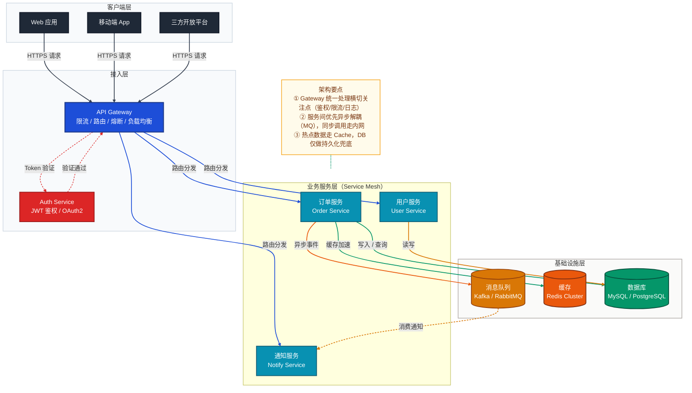
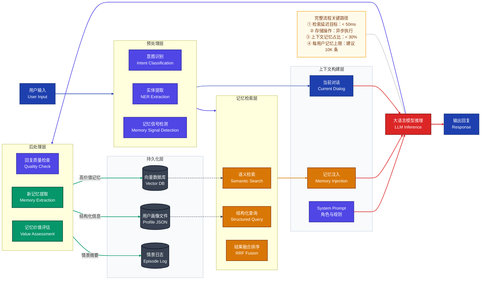
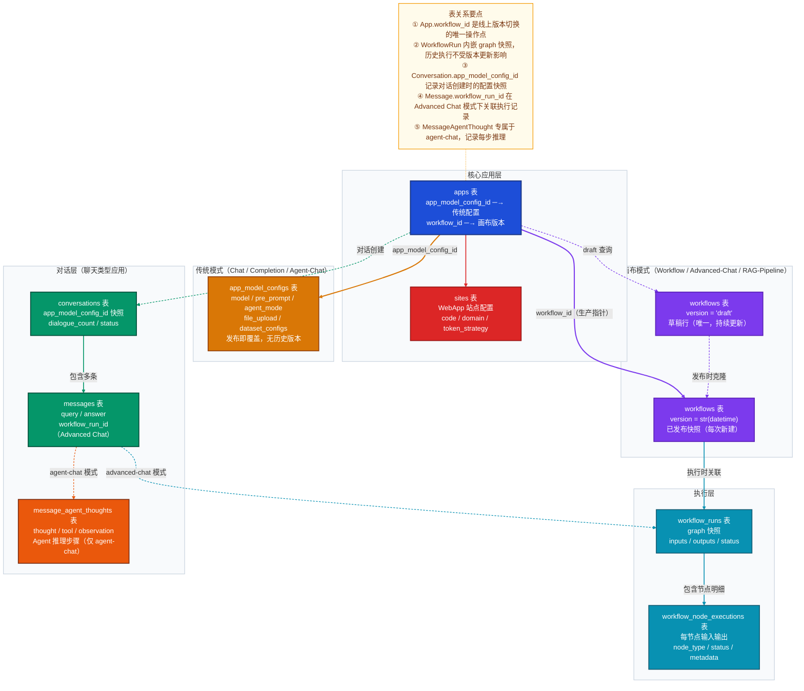
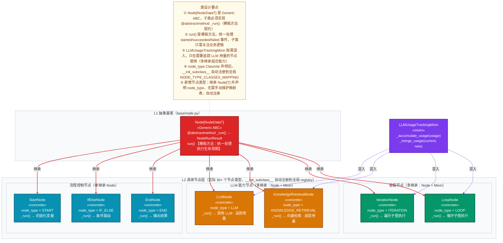
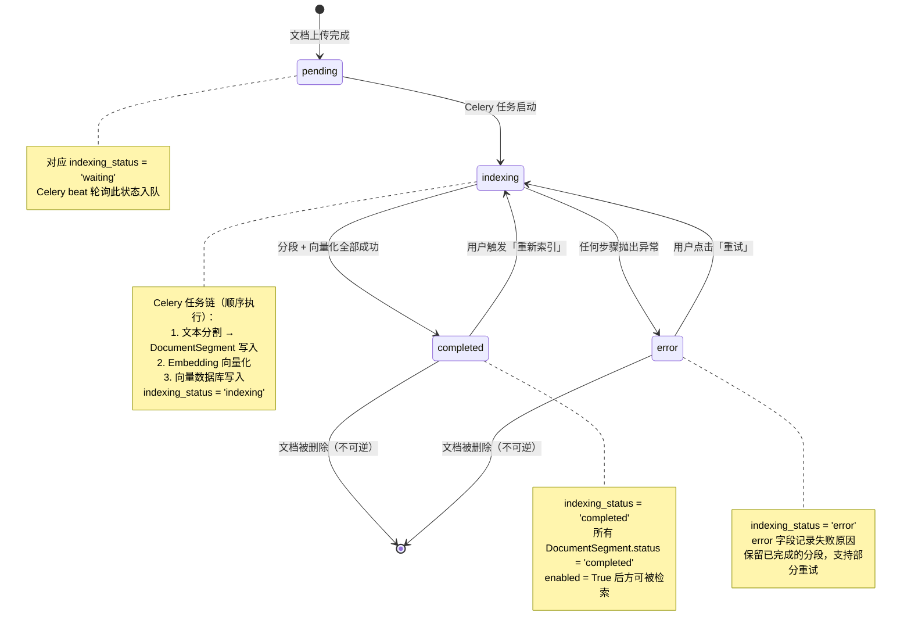
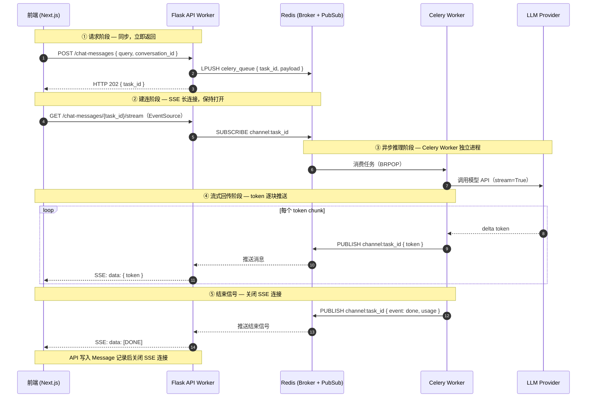

# Mermaid 作图风格完整指南

> 整合六种图表类型的区别说明、完整原图参考与最佳实践速查。

---

## 一、六种图表的区别与选择

### 对比表

六种图表**本质上不同**，各有明确的使用场景，不能互换。

| # | 图表类型 | Mermaid 语法 | 回答的核心问题 | 节点代表 | 箭头代表 | 典型触发场景 |
|---|---------|-------------|-------------|---------|---------|------------|
| ① | **系统架构图** | `flowchart TB` | 系统由哪些组件构成？如何部署和连接？ | 服务 / 组件 | 调用 / 部署关系 | 初识项目、架构评审 |
| ② | **端到端流程图** | `flowchart LR` | 一个请求如何在系统中同步流转？ | 处理步骤 | 数据流转顺序 | 核心业务链路梳理 |
| ③ | **数据模型关系图** | `flowchart TB` | 数据如何持久化？表与表如何关联？ | 数据库表（含核心字段） | 外键引用（实线）/ 逻辑关联（虚线） | 数据库设计、跨域引用分析 |
| ④ | **类层级关系图** | `flowchart TB` | 代码如何组织？抽象层次和设计模式是什么？ | 类 / 接口 / 抽象基类 | 继承（实线）/ 实现（虚线）/ 组合 | 扩展点分析、设计模式梳理 |
| ⑤ | **状态机图** | `stateDiagram-v2` | 对象生命周期内状态如何转换？触发条件是什么？ | 状态 / 转换事件 | 触发条件与方向（带标签） | 核心实体生命周期、异步任务状态 |
| ⑥ | **时序图** | `sequenceDiagram` | 跨组件/进程的消息如何流转？谁在等谁？ | 参与者 / 消息 | 同步调用（实线）/ 异步回调（虚线） | Celery 异步链路、SSE 流式响应 |

### 架构关系
**架构图是上位**。架构图描述系统骨架，其他五种图从不同维度描述骨架上的细节：

```
系统架构图（全局骨架）
    ├── 端到端流程图      ← 骨架上的同步业务路径（请求怎么走）
    ├── 时序图            ← 骨架上的异步/跨进程交互（消息怎么传、谁在等谁）
    ├── 数据模型关系图    ← 某个域的持久化结构（数据怎么存）
    ├── 类层级关系图      ← 某个模块的代码对象设计（代码怎么组织）
    └── 状态机图          ← 某个聚合根的生命周期（状态怎么变）
```

### 选用判断

```
需要理解"系统长什么样"         → 系统架构图
需要理解"请求怎么走"（同步）   → 端到端流程图
需要理解"消息怎么传"（异步）   → 时序图
需要理解"数据怎么存"           → 数据模型关系图
需要理解"代码怎么组织"         → 类层级关系图
需要理解"状态怎么变"           → 状态机图
```

### 组合使用

做完整项目分析时，六图配合使用，逐层深入：

```
第一步：架构图      →  建立系统全局认知（组件构成、层级职责、技术选型）
    ↓
第二步：流程图      →  深入同步业务路径（数据如何在架构中流转）
    ↓
第三步：时序图      →  理解异步交互机制（跨进程消息顺序、SSE 流式链路）
    ↓
第四步：数据模型图  →  理解数据存储边界（表结构、外键约束、版本快照设计）
    ↓
第五步：类层级图    →  理解代码对象设计（抽象层次、继承树、设计模式意图）
    ↓
第六步：状态机图    →  理解核心实体生命周期（状态枚举、转换触发条件、不可逆路径）
```

**一个系统对应一张架构图，但可以有多张其他图**（按业务域/模块拆分，各自独立梳理）。

---

## 二、架构设计图（系统集成）

### 2.1 适用场景

用于回答：这个项目有哪些服务？各层职责是什么？数据存在哪？如何部署？

首次接触一个项目需要理解系统整体构成时，或进行架构设计/评审时使用。

### 2.2 完整参考原图

> 展示客户端 → API 网关 → 服务网格 → 数据层的标准分层微服务架构



---

## 三、端到端流程图（业务流程梳理）

### 3.1 适用场景

用于回答：一个用户操作从发起到完成，经过了哪些步骤？数据如何被加工和传递？

梳理核心业务功能的完整处理链路、排查请求路径的性能瓶颈、向新成员讲解业务流程时使用。

### 3.2 完整参考原图

> 展示用户输入 → 预处理 → 记忆检索 → 上下文构建 → LLM 推理 → 后处理 → 持久化的完整 AI 对话记忆流程



---

## 四、数据模型关系图（表关系）

### 4.1 适用场景

用于回答：这个业务域有哪些数据库表？表与表之间是外键强约束还是逻辑关联？哪些字段是跨表的关键指针？

理解核心业务的数据持久化结构、分析版本快照设计、梳理多租户/多模式数据隔离边界时使用。

**与 ER 图的区别**：ER 图强调字段类型和规范化，数据模型关系图强调**业务语义和跨表关系的设计意图**，适合团队沟通而非数据库文档。

### 4.2 完整参考原图

> 展示 Dify 应用管理域：核心应用层 → 传统模式 / 画布模式 → 执行层 → 对话层的完整表关系



---

## 五、类层级关系图（代码对象设计）

### 5.1 适用场景

用于回答：这个模块 / 子域的代码是如何组织的？哪些是抽象接口，哪些是具体实现？继承和组合关系如何体现设计意图？

**与数据模型关系图的核心区别**：数据模型图以「表」为节点，关注持久化约束；类层级关系图以「类/接口」为节点，关注代码的**设计意图和扩展机制**，适合理解框架骨架和设计模式，而非数据库文档。

**三个视角及其适用目标**：

| 视角 | 核心轴 | Dify 中的适用目标 |
|------|--------|-----------------|
| **A. 抽象层级视角** | 从 ABC/接口 → 能力类型分支 → 具体实现 | `core/model_runtime/`、`core/workflow/nodes/`、`core/tools/` |
| **B. 聚合建模视角** | 以聚合根为中心 → 实体 → 值对象 | 分析某个子域的领域对象职责（补充数据模型图的业务语义层） |
| **C. 分层依赖视角** | 按 DDD 四层分组 → 类跨层依赖关系 | 验证某个功能模块是否符合 Clean Architecture 约束 |

### 5.2 完整参考原图

> 展示 `core/workflow/nodes/` 工作流节点类型体系（视角 A：抽象层级视角）：Generic ABC 抽象基类层 → 按职责分组的具体节点层，同时展示 Mixin 组合模式。实际共 30+ 个节点类型，图中仅选取 7 个代表性节点，通过分组标注传达完整规模。



---

## 六、状态机图（实体生命周期）

### 6.1 适用场景

用于回答：核心实体在生命周期内有哪些状态？什么事件触发状态转换？哪些转换是不可逆的？

描述聚合根的状态机，特别适合异步任务状态（Celery 任务链）、工作流执行状态、文档索引状态等"状态驱动"的核心业务逻辑。

**与流程图的核心区别**：流程图描述"处理步骤的顺序"，状态机图描述"对象所处的状态及状态切换的触发条件"——前者强调动作，后者强调状态。

### 6.2 完整参考原图

> 展示 Dify 文档索引状态机：从文档上传完成，经 Celery 异步索引，到最终 completed 或 error，以及重试和重新索引路径



### 6.3 作图规范

| 要素 | 规范 |
|------|------|
| **初始 / 终止** | 用 `[*]` 标记初始状态（入口）和终止状态（对象被销毁） |
| **状态命名** | 使用代码中的枚举值原文（如 `pending`、`indexing`），与源码保持严格一致 |
| **转换标签** | 箭头标签说明触发事件或业务条件，用中文描述语义（如"用户点击「重试」"） |
| **不可逆转换** | 在转换标签后补注 `（不可逆）`，代表状态切换后无法回退 |
| **`note` 辅助块** | 每个关键状态附 `note right of 状态名` 块，说明：① 对应的代码枚举值；② 该状态下的关键技术实现；③ 相关联表字段变化 |
| **并发状态** | 用 `--` 分隔符表示并行复合状态（如节点执行与整体工作流并发） |
| **聚焦原则** | 一张图只描述一个聚合根的状态机；若多个实体状态有联动，用文字说明跨图关联而非合并 |

---

## 七、时序图（跨进程异步交互）

### 7.1 适用场景

用于回答：跨组件/跨进程的消息如何流转？谁主动调用谁？哪些是异步回调？消息的顺序约束是什么？

特别适用于 Celery 任务链、SSE 流式响应、Redis 发布订阅、WebHook 回调等**跨进程异步场景**。这类场景用流程图只能看到一条路径，跨进程的等待关系和消息回调完全不可见。

### 7.2 完整参考原图

> 展示 Dify SSE 对话响应完整异步时序：前端请求 → Flask 任务入队 → Celery 调用 LLM → token 流式回推 → SSE 推送前端



### 7.3 作图规范

| 要素 | 规范 |
|------|------|
| **参与者命名** | 格式 `participant 英文ID as 中文名（技术标识）`，英文 ID 简短，括号内补充技术细节（如 `Redis (Broker + PubSub)`） |
| **`autonumber`** | 所有时序图必须开启 `autonumber`，便于在文字描述中引用"步骤 N" |
| **同步调用** | 用 `->>` 实线箭头，表示调用方等待返回（同步阻塞） |
| **异步消息 / 回调** | 用 `-->>` 虚线箭头，表示非阻塞推送或回调（调用方不等待） |
| **`Note over` 阶段标注** | 在每个逻辑阶段开始前插入 `Note over 参与者A,参与者B: ① 阶段名 — 关键约束`，用 `①②③` 序号对应 `autonumber` 区间，让读者在跟踪具体消息时始终知道当前所处阶段 |
| **`Note over` 单参与者注记** | 在关键步骤后用 `Note over 单参与者: 说明` 补充该步骤的性能指标、设计约束或实现细节（如"写入 Message 记录后关闭 SSE 连接"） |
| **`loop` 循环块** | 用 `loop 条件描述` 包裹重复消息，标注循环的触发条件（如"每个 token chunk"） |
| **`alt` 分支块** | 用 `alt 条件` / `else 条件` 表示互斥路径（如正常响应 vs 超时 vs 模型报错） |
| **`opt` 可选块** | 用 `opt 条件` 包裹非必须执行的消息段（如"仅在开启 tracing 时"） |
| **聚焦原则** | 一张图聚焦一条完整的异步链路，控制在 5～8 个参与者以内；链路过长时拆为"请求阶段图 + 推理阶段图"分别展示 |

---

## 八、最佳实践速查

| 设计原则 | 说明 |
|----------|------|
| **配色与样式定义** | 通过 `classDef` 预定义各阶段节点的颜色和边框样式，按业务职责区分：输入/输出用深蓝（`#1e40af`），处理/路由用靛蓝（`#4f46e5`），检索用琥珀（`#d97706`），核心推理用红色（`#dc2626`），存储写入用绿色（`#059669`），数据库用深灰（`#374151`）；注记节点用低饱和暖色（`#fffbeb`） |
| **流程方向选择** | 线性主流程用 `LR`（从左到右），强调分层纵向关系时用 `TB`；子图内使用 `direction LR` 保持内部水平排列，增强可读性 |
| **分层 subgraph** | 使用 `subgraph` 将同阶段节点归组，体现流程的阶段划分；每个子图对应一个处理职责（如预处理、检索、推理等）；`class SubgraphName layerStyle` 统一背景色区分层级 |
| **起止节点突出** | 流程的起始节点（用户输入）和终止节点（输出回复）使用最高对比度颜色（`#1e40af`深蓝），与中间处理节点形成视觉区分，一眼识别流程边界 |
| **连接线区分** | `-->` 表示主流程同步调用 / 外键强约束引用；`-.->` 表示异步调用、可选路径或逻辑关联（运行时关系，无 FK 约束）；`==>` 表示关键/强制路径；连接线标签简明描述数据内容或操作语义（如 `"高价值记忆"`、`"workflow_id（生产指针）"`） |
| **`linkStyle` 索引精准计数** | `linkStyle N` 按边的**声明顺序**从 0 开始编号，索引越界会触发渲染崩溃。两条规避守则：① **展开 `&`**：`A & B --> C` 会展开为多条独立边，凡使用 `linkStyle` 的图一律拆成独立行 `A --> C` / `B --> C`；② **注释标注边总数**：在连接线声明结束后、`linkStyle` 之前插入 `%% 边索引：0-N，共 X 条` 注释强制核对 |
| **节点形状语义** | `["text"]` 矩形表示处理节点/服务/数据库表；`[("text")]` 圆柱体表示持久化存储（DB、向量库、文件等）；形状与颜色双重编码，直观区分计算与存储职责 |
| **节点换行** | 节点文本内换行须使用 `<br>` 标签（如 `["组件名<br>副标题"]`）；首行写中文业务名，`<br>` 后补英文技术名或核心字段，兼顾业务可读性与技术精确性 |
| **辅助 NOTE 注记** | 对关键路径的性能指标、约束条件或设计决策，通过 `NOTE` 节点附加说明；使用 `NOTE -.- 核心节点` 悬浮注记模式，与主流程连接线视觉隔离；数据模型关系图中用 `①②③④⑤` 序号逐条说明跨表关系的设计意图 |
| **中英双语** | 节点文本和连接线标签适当中英双语（如 `"语义检索<br>Semantic Search"`），兼顾业务可读性与技术国际化 |
| **表关系图专用：节点内容** | 数据模型图的节点首行写**表名**，`<br>` 后列出 2-4 个**核心字段或外键字段**，末行可附加一句关键业务约束说明（如 `"发布即覆盖，无历史版本"`） |
| **表关系图专用：subgraph 分组** | 按**业务领域**（而非处理阶段）分组：将同一领域的表归入同一 subgraph（如核心层、执行层、对话层）；同一 subgraph 内关系密切的表用 `direction LR` 横排，跨 subgraph 用纵向主流向 `TB` |
| **表关系图专用：箭头颜色含义** | 用 `linkStyle` 为不同业务线的关联边着色：同一业务主线用同一颜色（如工作流相关边统一用紫色 `#7c3aed`，对话相关边用绿色 `#059669`），颜色区分帮助读者快速跟踪某条业务线的完整关系链 |
| **类层级图专用：节点内容** | 类层级图的节点首行写**类名**，第二行写 `«stereotype»`（`«abstract»` / `«concrete»` / `«interface»`），第三行列出 **1-2 个最能体现设计意图的关键方法签名**（可简化参数），末行可用一句话说明扩展点；不罗列全部字段和方法，只展示设计骨架 |
| **类层级图专用：分层分组** | 按**抽象层次**（而非业务阶段）分组：`subgraph L1` 放抽象基类/接口，`subgraph L2` 放能力类型分支层，`subgraph L3` 放具体实现层；同一 subgraph 内横向排列（`direction LR`），跨层纵向主流 `TB`，整体呈现"从顶层契约到底层实现"的层次结构 |
| **类层级图专用：配色语义** | 抽象基类/ABC 用红色（`#dc2626`），表示"必须被实现的契约"；能力类型分支层（中间抽象）用琥珀（`#d97706`），表示"能力类型的锚点"；具体实现类用青蓝（`#0891b2`），表示"实际执行者"；接口/Protocol 用紫色（`#7c3aed`） |
| **类层级图专用：关系箭头** | 继承（extends）用实线 `-->` 加标签 `"继承"` 或 `"继承·实现"`；接口实现用虚线 `-.->` 加标签 `"实现"`；组合用实线加标签 `"组合"`，聚合用虚线加标签 `"聚合"`；方向统一从父类指向子类（TB 方向，抽象在上，具体在下），与数据模型图"主表到从表"的方向习惯保持一致 |
| **状态机图专用：状态命名** | 状态名必须与源码枚举值完全一致（如 `indexing`、`running`、`succeeded`），禁止使用中文状态名或自创别名，确保图与代码可交叉核验 |
| **状态机图专用：`note` 块** | 每个关键状态用 `note right of 状态名` 附注块说明：① 对应代码字段赋值；② 该状态下的后台行为（如 Celery 任务链步骤）；③ 相关联表字段变化；内容精简在 3 行以内 |
| **状态机图专用：不可逆标注** | 凡状态切换后无法回退的转换（通常为删除、归档、终止类操作），在转换箭头标签末尾加 `（不可逆）`，让读者一眼识别系统中的单向门 |
| **状态机图专用：聚焦单一聚合根** | 一张状态机图只描述一个聚合根（如 `Document` 或 `WorkflowRun`）；若两个实体状态有联动，在图外用文字说明跨图触发关系，不合并进同一张图 |
| **时序图专用：`Note over` 阶段标题** | 在每个逻辑阶段的第一条消息前插入 `Note over 起始参与者,结束参与者: ① 阶段名 — 关键约束`，序号与 `autonumber` 编号区间对应，帮助读者在追踪细节消息时始终知道当前所在阶段 |
| **时序图专用：`Note over` 步骤注记** | 关键消息之后用 `Note over 单参与者: 说明` 补充该步骤的性能目标、幂等性保证或设计约束；注记应精简在 1 行内，不做冗长解释 |
| **时序图专用：同步 vs 异步箭头** | `->>` 实线表示调用方等待响应（同步阻塞）；`-->>` 虚线表示非阻塞推送或回调（异步）；两种箭头在同一张图中必须语义一致，不可混用 |
| **时序图专用：`autonumber` 必开** | 所有时序图必须在 `sequenceDiagram` 下方第一行写 `autonumber`，步骤编号用于文字描述中精确引用（如"步骤 3 处 API 立即返回 202"） |
| **时序图专用：控制块语义** | `loop 条件` 包裹重复消息（如"每个 token chunk"）；`alt 条件` / `else` 包裹互斥路径（正常响应 vs 超时 vs 错误）；`opt 条件` 包裹非必须段（如"仅开启 tracing 时"）；控制块不宜嵌套超过两层 |

---
