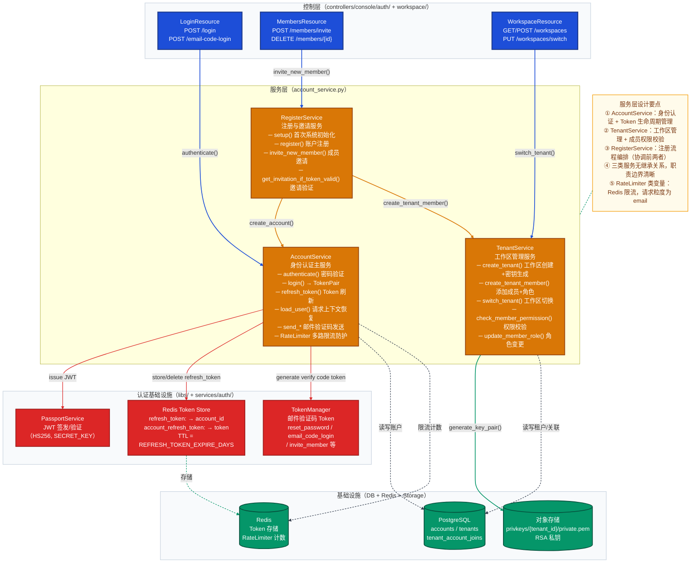
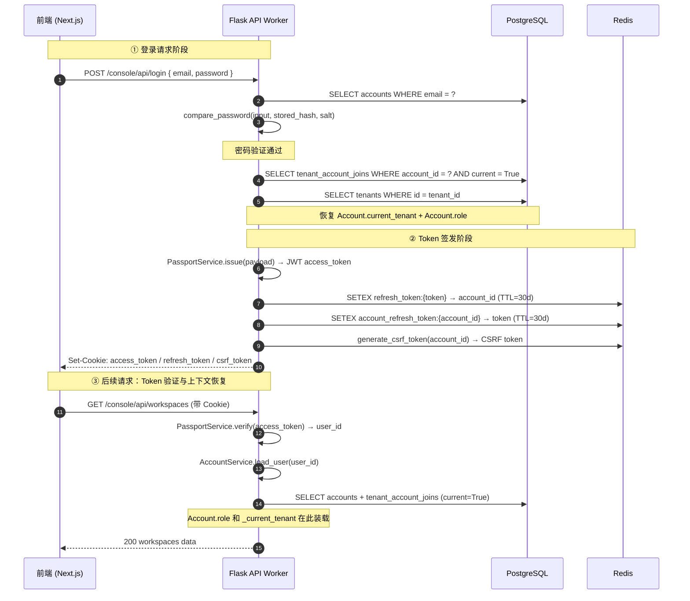
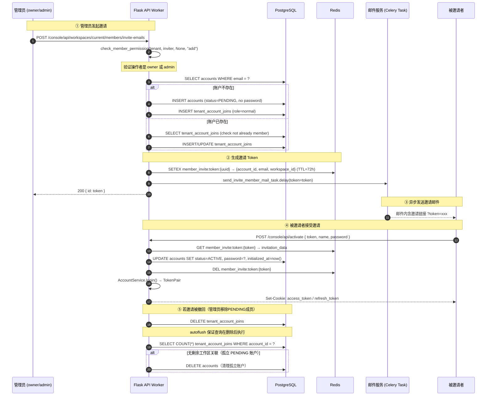
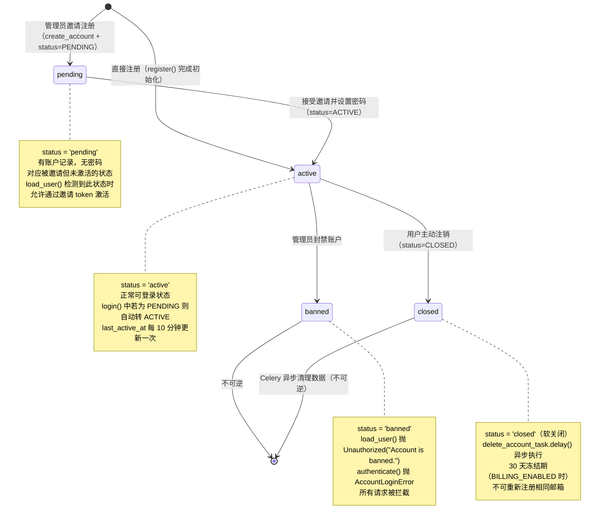
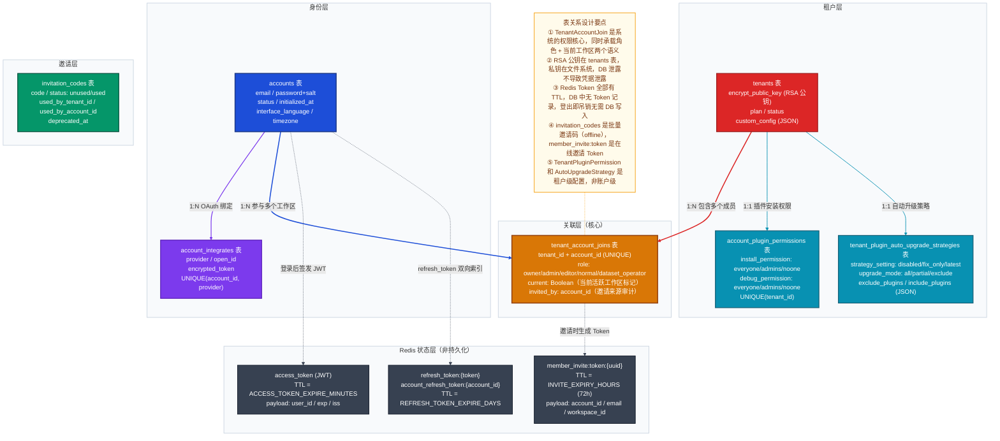
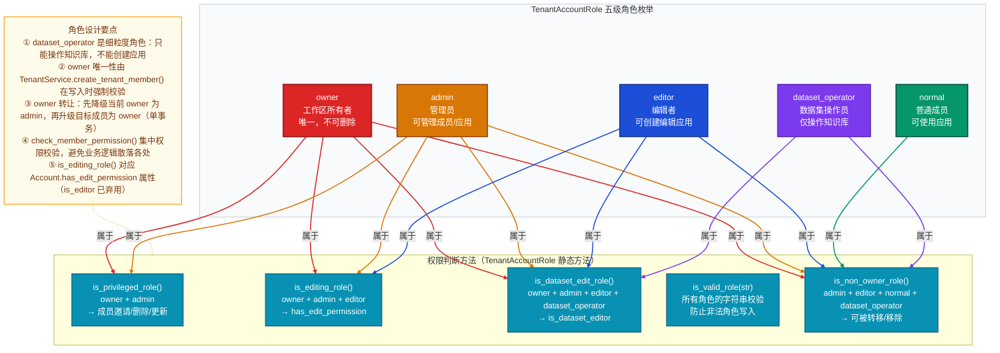
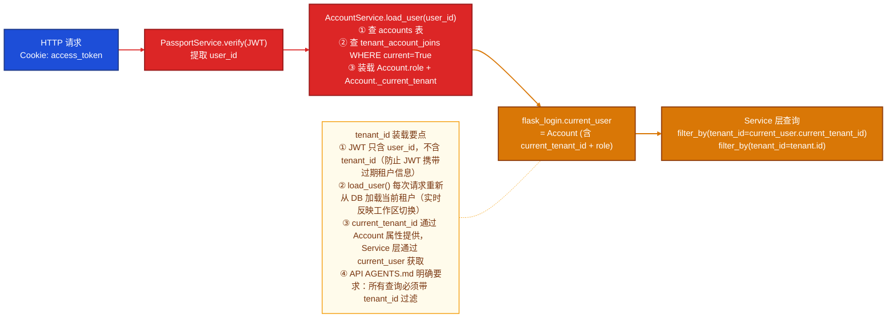

# Dify 账户/租户域深度解析

> **子域变量**
> - 子域名称：账户/租户域（Account & Tenant）
> - DDD 类型：支撑域
> - 主模型文件：`api/models/account.py`（412 行）
> - 核心领域模块：`api/services/auth/`
> - 核心服务文件：`api/services/account_service.py`（1587 行）
> - 专项聚焦：`tenant_id` 隔离机制、多角色权限体系、Token 双轨认证（JWT + Redis Refresh Token）

---

## 一、子域定位

**账户/租户域是 Dify 全系统数据隔离的基础设施层**。它不拥有任何业务数据，只负责解决三个核心问题：

1. **身份认证**：用户是谁（Email/密码/OAuth 三种认证方式）
2. **租户归属**：用户属于哪个工作区（Workspace = Tenant）
3. **权限控制**：用户在工作区内的操作权限（5 级角色体系）

在全局子域图中，此域处于**支撑域（Supporting Domain）**位置。它为核心域（应用域/知识库域/工作流域）提供最基础的 `tenant_id`，是所有业务数据的第一级隔离键。

### 数据主权

| 独占写入 | 说明 |
|---------|------|
| `accounts` 表 | 账户创建、状态变更、密码修改 |
| `tenants` 表 | 工作区创建、密钥对生成、自定义配置 |
| `tenant_account_joins` 表 | 成员关系、角色分配、当前工作区切换 |
| `account_integrates` 表 | OAuth 绑定/解绑 |
| Redis 中的认证 Token | access_token、refresh_token、邀请码、验证码 |

**其他域不可直接写入** `accounts` 或 `tenants` 表，只能通过 `account_service.py` 中的服务方法间接操作。

### 边界约束

`api/.importlinter` 中账户/租户域**没有特殊的 importlinter 隔离规则**（区别于 `core.workflow` 和 `core.model_runtime`），这符合支撑域的定位——它是被其他域依赖的基础设施，而非需要强隔离的核心引擎。其他域通过 `tenant_id` 字段与此域进行**逻辑关联（无外键约束）**，实现跨域数据隔离。

---

## 二、数据模型

### 2.1 表清单

| 表名 | 对应模型类 | 一句话职责 |
|-----|-----------|----------|
| `accounts` | `Account` | 用户账户（身份主体），存储认证凭据与个人偏好 |
| `tenants` | `Tenant` | 工作区（数据隔离主体），存储 RSA 公钥与租户配置 |
| `tenant_account_joins` | `TenantAccountJoin` | 账户-工作区多对多关联表，同时承载角色与当前活跃状态 |
| `account_integrates` | `AccountIntegrate` | OAuth 第三方身份绑定（GitHub / Google 等） |
| `invitation_codes` | `InvitationCode` | 邀请码管理，控制注册入口 |
| `account_plugin_permissions` | `TenantPluginPermission` | 租户级插件安装/调试权限策略 |
| `tenant_plugin_auto_upgrade_strategies` | `TenantPluginAutoUpgradeStrategy` | 租户插件自动升级策略（disabled/fix_only/latest） |

### 2.2 核心表字段分析

#### `accounts` 表（聚合根）

下图聚焦 `Account` 的核心字段语义：

```
accounts 表核心字段
├── id (UUID)                     ← 跨全系统引用的稳定身份键
├── email (String 255, idx)       ← 登录主键，系统唯一，支持大小写兼容查询
├── password + password_salt      ← bcrypt 思路：salt 随机生成，密码先 hash 再 base64 编码
├── status (String 16)            ← 状态机驱动：pending/uninitialized/active/banned/closed
├── initialized_at                ← 区分"是否完成初始设置"的时间戳节点
├── last_login_at + last_login_ip ← 安全审计字段
├── last_active_at                ← 活跃度追踪，10 分钟节流更新（避免写放大）
├── interface_language + timezone ← 用户偏好，随语言自动推断时区
└── [运行时字段，不持久化]
    ├── role: TenantAccountRole   ← 当前工作区中的角色（从 TenantAccountJoin 加载）
    └── _current_tenant: Tenant   ← 当前活跃工作区（登录后从 Redis/DB 恢复上下文）
```

`role` 和 `_current_tenant` 是**运行时注入字段**（Python dataclass `field(default=None, init=False)`），不映射到数据库列，在 `load_user()` 中动态装载。

#### `tenants` 表

```
tenants 表核心字段
├── id (UUID)                       ← 全系统数据隔离的第一级键（所有业务表都有 tenant_id 字段）
├── name (String 255)               ← 工作区名称，创建时默认为 "{account.name}'s Workspace"
├── encrypt_public_key (LongText)   ← RSA-2048 公钥，用于加密模型凭据；私钥存文件系统
├── plan (String 255)               ← 计费计划（basic/professional 等），默认 basic
├── status (String 255)             ← normal/archive，用于软删除工作区
└── custom_config (LongText JSON)   ← 租户级自定义配置（如 SSO 设置），按需序列化
```

`encrypt_public_key` 是此表最关键的安全字段：租户创建时即调用 `generate_key_pair(tenant_id)` 生成 RSA-2048 密钥对，**公钥存入数据库、私钥写入对象存储**（路径 `privkeys/{tenant_id}/private.pem`）。模型供应商域的凭据加密和解密都依赖这对密钥。

#### `tenant_account_joins` 表

```
tenant_account_joins 表核心字段
├── tenant_id + account_id (UUID)   ← 联合唯一索引（UNIQUE + 双独立索引）
├── role (String 16)                ← 角色枚举：owner/admin/editor/normal/dataset_operator
├── current (Boolean)               ← 标记"当前活跃工作区"，是上下文切换的持久化状态
└── invited_by (UUID, nullable)     ← 邀请来源的 account_id，用于审计
```

`current` 字段解决的问题：一个账户可以加入多个工作区，登录后需要记住"上次在哪个工作区"。`load_user()` 优先加载 `current=True` 的记录，切换工作区时更新此字段。

### 2.3 关键设计决策

**决策一：角色存在关联表而非账户表**

> 场景描述：用户 A 可能在工作区 X 中是 owner，在工作区 Y 中是 normal，且未来可能加入更多工作区。
>
> 选择方案：角色字段 `role` 存放在 `TenantAccountJoin` 中，而非 `Account` 表。
>
> 设计理由：角色是"账户与工作区关系"的属性，不是账户本身的属性。单一账户在不同工作区可以有不同角色。
>
> 代价与权衡：每次请求需要额外 JOIN `TenantAccountJoin` 来获取当前角色。框架层通过 `Account.current_tenant.setter` 和 `set_tenant_id()` 在请求入口一次性装载角色，避免重复查询。

**决策二：RSA 公私钥拆分存储（DB + 文件系统）**

> 场景描述：模型供应商配置的 API Key 需要加密存储，且解密操作频繁。
>
> 选择方案：RSA 公钥存 `tenants.encrypt_public_key`（便于加密时快速获取），私钥存文件系统 `privkeys/{tenant_id}/private.pem`（与业务数据库隔离）。
>
> 设计理由：将私钥与主数据库分离，即使数据库被拖库，攻击者也无法直接获取私钥来解密凭据。同时实现了混合加密（RSA 加密 AES 密钥，AES 加密实际数据），兼顾安全与性能。
>
> 代价与权衡：文件系统和数据库需要同步，租户创建失败时需要清理孤立私钥文件。每次解密都需要读取文件系统，增加 I/O 开销。

### 2.4 跨域引用

| 引用方向 | 字段 | 引用类型 | 说明 |
|---------|------|---------|------|
| 其他域 → 账户域 | `tenant_id` (所有业务表) | 逻辑关联（无 FK） | 所有业务表通过 `tenant_id` 归属到工作区 |
| 其他域 → 账户域 | `created_by_account_id` | 逻辑关联（无 FK） | 应用、知识库等创建时记录操作者 |
| 账户域 → 模型域 | 无直接引用 | — | 账户域不感知具体的业务对象 |

账户/租户域是**被引用者**，不主动引用任何业务域，保持了支撑域的纯粹性。

---

## 三、代码架构

账户/租户域的服务层集中在 `api/services/account_service.py`，按职责拆分为三个类：

以下图展示三个服务类的职责分工与协作关系，重点关注类之间的调用链和每层对外暴露的核心能力。



**设计要点：**

1. `AccountService` 持有多个 `RateLimiter` **类变量**（非实例变量），实现了无需显式实例化即可复用限流器的单例效果，减少 Redis 连接开销。
2. `RegisterService` 是**流程编排器**，本身不直接操作数据库，只协调 `AccountService` 和 `TenantService`，体现了单一职责原则。
3. Token 管理分两层：`PassportService` 负责 JWT 签发（短周期，无状态），`Redis Token Store` 负责 refresh_token（长周期，有状态，可吊销），两者共同构成可吊销的认证体系。

---

## 四、典型业务场景

### 场景一：邮件密码登录并恢复工作区上下文

此流程展示从 HTTP 请求到 Token 签发的完整链路，以及工作区上下文如何在每次请求中恢复。



**设计要点：**

1. **步骤 4-5**：`load_user()` 通过 `TenantAccountJoin.current=True` 恢复上下文——若不存在，则回退到最早加入的工作区并自动设为 `current=True`，保证登录后始终有活跃工作区。
2. **步骤 8-10**：Token 采用**双向映射存储**：`refresh_token:{token} → account_id` 用于验证，`account_refresh_token:{account_id} → token` 用于登出时主动吊销（无需遍历）。
3. **步骤 11**：每次请求都在 `load_user()` 中重新 JOIN 查询角色，确保权限变更实时生效（无角色缓存），代价是每次请求多一次 DB 查询。

---

### 场景二：邀请成员加入工作区

此流程展示跨账户的异步邀请链路，以及 `PENDING` 状态账户的特殊清理机制。



**设计要点：**

1. **步骤 4**：`PENDING` 状态是专为"已创建但未激活"的被邀请账户设计的状态——账户存在但无密码，允许重新发送邀请邮件。
2. **步骤 7**：邀请 Token 存 Redis（TTL=72 小时），不存数据库，避免污染账户表。Token 到期即失效，无需额外清理逻辑。
3. **步骤 12-14**：当管理员移除 `PENDING` 成员时，系统自动检查并清理孤立账户（`remaining_joins == 0`）——这是边界守护逻辑，防止数据库中积累大量永远无法登录的僵尸账户。

---

## 五、核心实体状态机

`Account.status` 是此域唯一的状态驱动字段，驱动登录校验和数据清理行为。



**设计要点：**

- `UNINITIALIZED` 枚举值存在于代码中（`AccountStatus.UNINITIALIZED`），但在当前版本的 `register()` 和 `activate()` 流程中未被实际使用，是历史遗留枚举，可能用于企业版或未来功能。
- `CLOSED → [*]` 是两阶段删除：先设状态为 `CLOSED`，再通过 Celery 异步任务清理关联数据，防止在线请求期间的脏读。
- `BANNED` 是**不可逆**的管理操作，源码中无 `banned → active` 的恢复路径（企业版可能通过后台操作恢复）。

---

## 六、数据模型关系图

下图展示账户/租户域的完整表关系，重点关注多对多关联设计和运行时状态字段的语义。



---

## 七、角色权限体系图

`TenantAccountRole` 是账户/租户域对外暴露的核心权限抽象，下图展示角色的能力范围与权限判断方法的对应关系。



---

## 八、跨域协作边界

### 上游（依赖此域的域）

| 依赖方式 | 字段/接口 | 使用场景 |
|---------|---------|---------|
| `tenant_id` 注入 | `tenants.id` | 所有业务表（apps、datasets、workflows 等）的第一级隔离键 |
| `account_id` 审计 | `accounts.id` | 记录资源创建者（`created_by`）和操作者 |
| `TenantAccountRole` 权限校验 | `Account.is_admin_or_owner` 等属性 | 应用域、知识库域的资源访问控制 |
| `Tenant.encrypt_public_key` | RSA 公钥 | 模型供应商域加密 API Key 凭据 |

### 下游（此域依赖的能力）

| 依赖对象 | 用途 |
|---------|------|
| `Redis` | refresh_token 存储、RateLimiter 计数、邀请 Token 暂存 |
| `PostgreSQL` | 账户/租户数据持久化 |
| `对象存储（storage）` | RSA 私钥文件持久化 |
| `Celery（异步任务）` | 邮件发送（注册/邀请/密码重置）、账户删除（delete_account_task） |
| `BillingService`（可选） | 企业版 Billing 状态查询（邮箱冻结检查） |

### 不拥有（明确的边界外能力）

- **不拥有** 任何业务实体（应用、知识库、工作流、模型配置等）
- **不拥有** 应用级访问控制（API Key 鉴权属于 `services/auth/api_key_auth_service.py`，是独立模块）
- **不拥有** 模型凭据的加解密业务逻辑（只提供公钥，解密由模型供应商域执行）
- **不拥有** 操作日志（访问日志由应用域的 `AppLog` 等记录）
- **不拥有** SSO/SAML 集成（企业版功能，不在本域数据模型中）

---

## 九、专项聚焦：tenant_id 隔离机制

`tenant_id` 是 Dify 多租户隔离的**唯一数据边界**，理解其工作原理是理解整个系统安全边界的关键。

### 9.1 隔离的实现方式

Dify **没有使用 PostgreSQL Schema 隔离或独立数据库隔离**，而是采用**行级 tenant_id 过滤**的共享数据库模式：

```
所有业务表结构：
├── id (UUID, PK)
├── tenant_id (UUID, NOT NULL)    ← 隔离键，每张表必有
├── ... 业务字段 ...
```

隔离的执行点在 **Service 层查询**：每次查询都必须携带 `tenant_id` 条件，如：

```python
# 正确：显式带 tenant_id 过滤
db.session.query(App).filter_by(tenant_id=current_user.current_tenant_id).all()

# 危险：遗漏 tenant_id（API AGENTS.md 明确要求 "always scope queries by tenant_id"）
db.session.query(App).filter_by(id=app_id).first()
```

### 9.2 隔离在请求链路中的装载位置



**设计要点：**

1. JWT Payload 中**故意不包含 `tenant_id`**，只含 `user_id`。这是因为用户可以切换工作区，若将 `tenant_id` 编码进 JWT，则切换工作区后旧 Token 携带错误租户信息，需要强制重新登录。当前设计允许工作区切换后立即生效，无需刷新 Token。
2. `load_user()` 在每个请求中重新查询数据库获取当前工作区——虽然增加了数据库压力，但确保了权限变更（如被移除工作区）**实时生效**，无需等待 Token 过期。
3. 唯一一处"特权"绕过：`api_key_auth_service.py` 中的 API Key 鉴权通过 `DataSourceApiKeyAuthBinding.tenant_id` 直接绑定工作区，绕过 `flask_login`，用于服务端到服务端的调用场景。

---

*分析基于 Dify 1.13.0 源码，模型文件：`api/models/account.py`（412 行），服务文件：`api/services/account_service.py`（1587 行）。*
