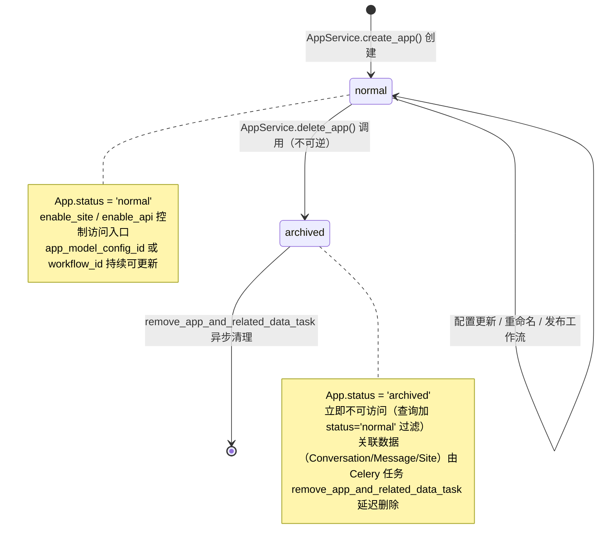
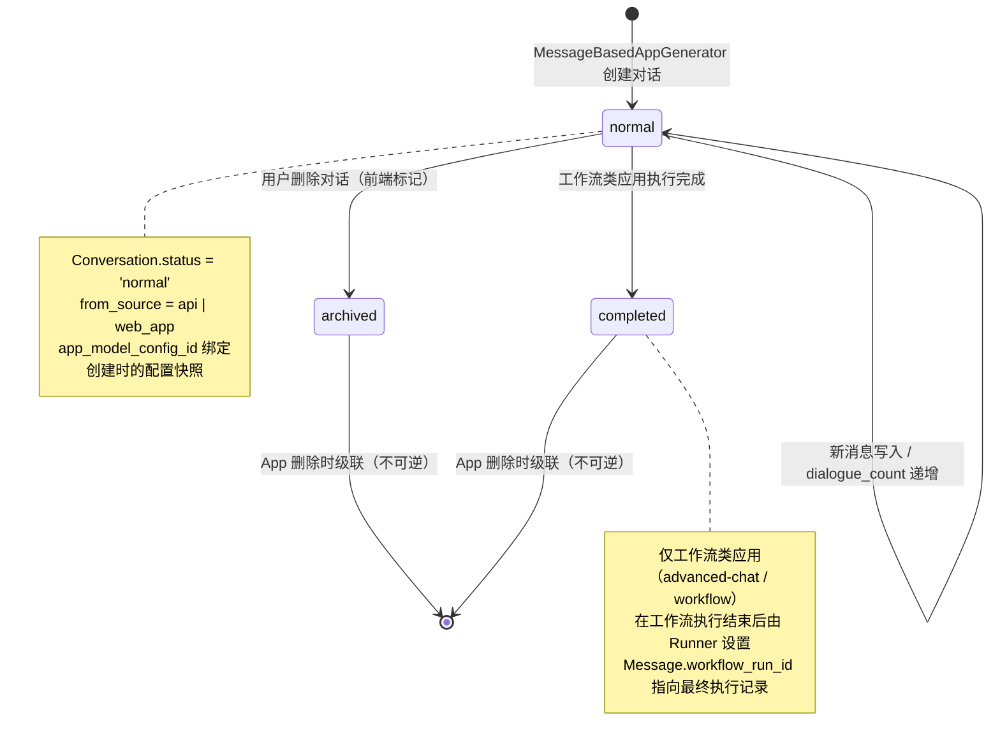
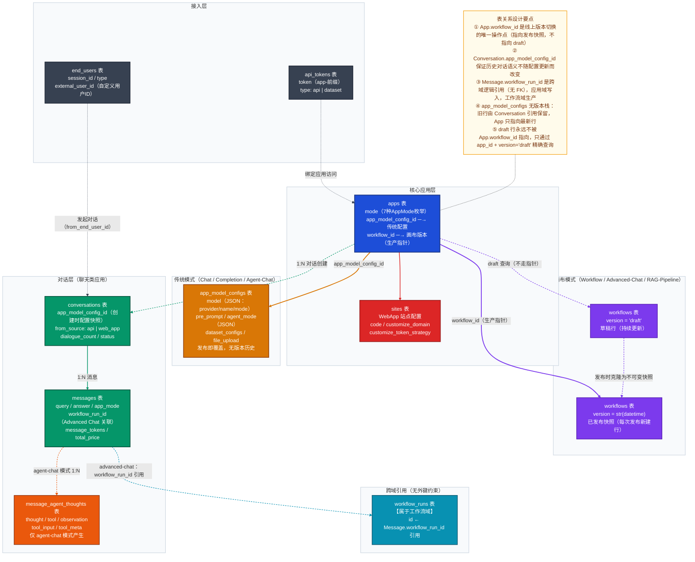
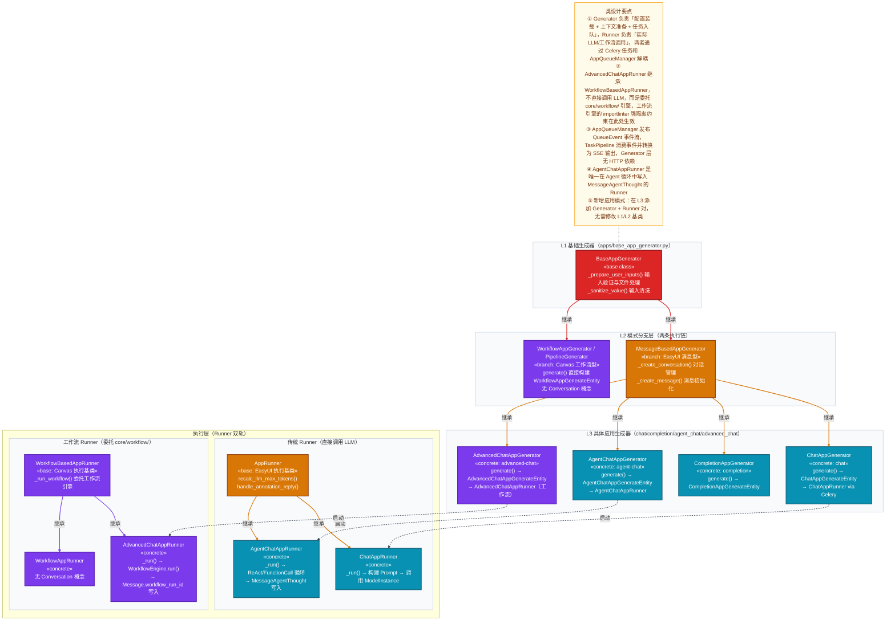
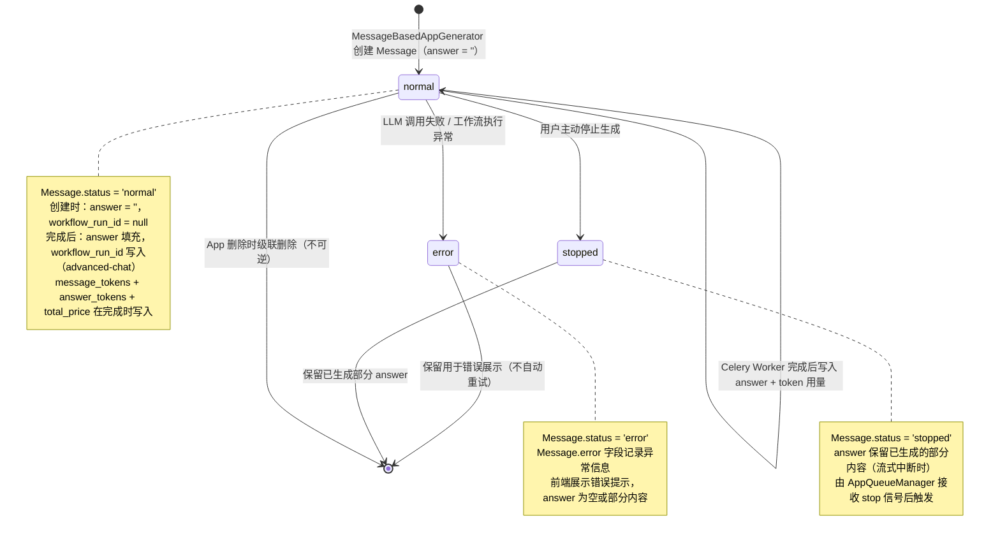
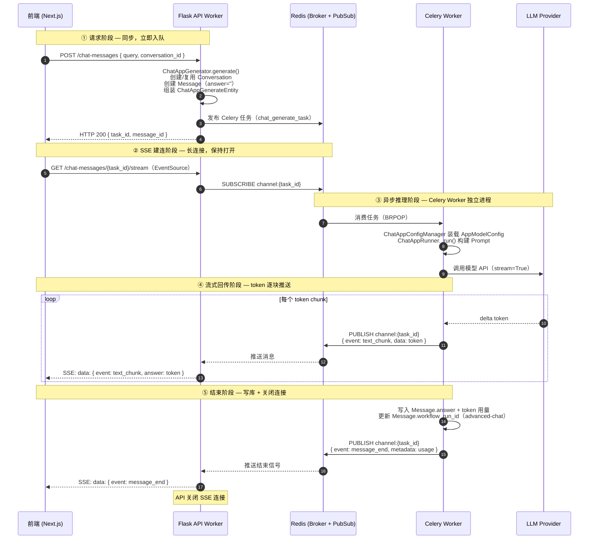
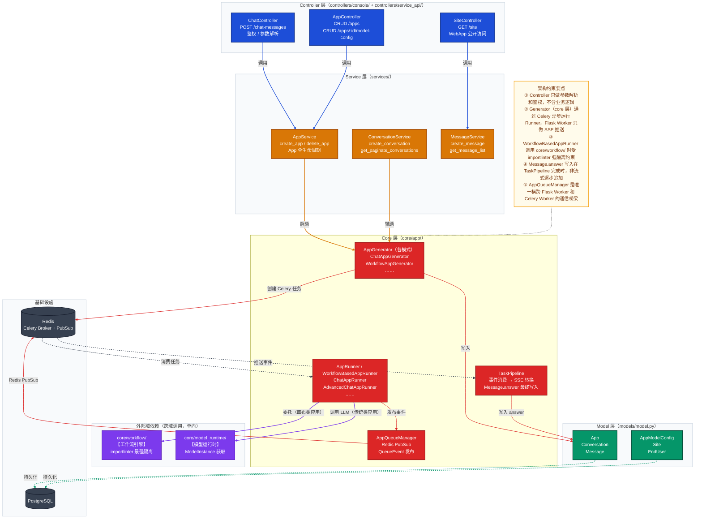

# Dify 应用域深度解析

> **子域变量**
> - 子域名称：应用域（App & Config）
> - DDD 类型：核心域
> - 主模型文件：`api/models/model.py`（2201 行）
> - 核心领域模块：`api/core/app/`
> - 核心服务文件：`api/services/app_service.py`（439 行）
> - 专项聚焦：传统模式（EasyUI）vs 画布模式（Canvas）双轨配置架构、AppModelConfig 发布即覆盖快照机制、七种应用模式的运行时分发

---

## 一、子域定位

**应用域是 Dify 的产品核心，管理所有 AI 应用从创建到运行的完整生命周期。** 它是用户与 Dify 平台交互的主入口，承载了"构建 AI 应用"这一核心产品价值。

在全局子域图中，此域处于**核心域（Core Domain）**位置，直接对应产品最核心的使用场景：创建应用、配置模型、发起对话、查看执行结果。

### 数据主权

| 独占写入 | 说明 |
|---------|------|
| `apps` 表 | 应用创建、状态变更、模式设置、workflow_id 切换 |
| `app_model_configs` 表 | 传统模式配置快照的创建与覆盖 |
| `conversations` 表 | 对话创建、状态管理、对话摘要更新 |
| `messages` 表 | 消息写入、答案更新、workflow_run_id 关联 |
| `message_agent_thoughts` 表 | Agent 推理步骤持久化 |
| `sites` 表 | WebApp 站点配置创建与更新 |
| `end_users` 表 | 外部用户注册与 session 管理 |

**其他域不可直接写入上述表**，知识库域通过 `dataset_id` 读取，工作流域通过 `workflow_run_id` 写入执行结果后由应用域关联。

### 边界约束

`api/.importlinter` 中应用域没有像 `core.workflow` 那样的强隔离约束，但 `core/app/` 内部通过严格的分层结构实现隔离：

- `core/app/` 不直接依赖 `services/`（服务层是协调层，单向调用核心层）
- `core/app/apps/` 中每种应用模式的 Runner 通过 `AppQueueManager` 与消息队列解耦，支持流式响应
- 工作流类型应用（`advanced-chat`/`workflow`/`rag-pipeline`）的 Runner 委托给 `core/workflow/` 执行，不直接操作工作流内部状态

---

## 二、数据模型

### 2.1 表清单

| 表名 | 对应模型类 | 一句话职责 |
|-----|-----------|----------|
| `apps` | `App` | 应用聚合根，存储模式、状态及双轨配置指针 |
| `app_model_configs` | `AppModelConfig` | 传统模式的配置快照（模型/Prompt/Agent策略），发布即覆盖 |
| `conversations` | `Conversation` | 对话会话聚合，绑定配置快照、用户来源与状态 |
| `messages` | `Message` | 消息实体，存储 query/answer 及费用、关联工作流执行 |
| `message_agent_thoughts` | `MessageAgentThought` | Agent 模式的逐步推理记录（thought/tool/observation） |
| `message_files` | `MessageFile` | 消息附件（图片/文件），支持本地上传和远程 URL |
| `message_feedbacks` | `MessageFeedback` | 用户/管理员对消息的点赞/踩反馈 |
| `message_annotations` | `MessageAnnotation` | 消息标注（Q&A对），用于标注回复 |
| `app_annotation_settings` | `AppAnnotationSetting` | 标注回复功能配置，绑定 Embedding 模型 |
| `sites` | `Site` | WebApp 对外发布的站点配置（域名/主题/访问策略） |
| `end_users` | `EndUser` | 通过 WebApp 或 API 访问的外部终端用户 |
| `api_tokens` | `ApiToken` | 应用的 API 访问凭证（`app-` 前缀） |
| `upload_files` | `UploadFile` | 用户上传文件的元数据（存储路径/类型/大小） |
| `tags` | `Tag` | 应用/知识库的分类标签 |
| `tag_bindings` | `TagBinding` | 标签与应用的多对多关联 |
| `app_mcp_servers` | `AppMCPServer` | 应用绑定的 MCP Server 配置（1.13.0 新增） |
| `dataset_retriever_resources` | `DatasetRetrieverResource` | 消息级别的知识库检索来源快照（用于引用溯源） |

### 2.2 核心表字段分析

#### `apps` 表（聚合根）

```
apps 表核心字段
├── id (UUID)                          ← 全系统引用的稳定应用标识
├── tenant_id (UUID)                   ← 租户隔离键，所有查询必须带此条件
├── mode (String 255)                  ← 应用模式枚举（7种），决定运行时分发路径
│   └── completion / workflow / chat / advanced-chat / agent-chat / channel / rag-pipeline
├── app_model_config_id (UUID, null)   ← 传统模式：指向当前生效的 AppModelConfig
├── workflow_id (UUID, null)           ← 画布模式：指向已发布的 Workflow 快照（生产版本）
├── enable_site / enable_api (bool)    ← 控制 WebApp 和 API 两种访问入口的开关
├── status (String 255)               ← 应用状态（normal/archived）
├── tracing (LongText, JSON)          ← 追踪配置（LangFuse/LangSmith 等），存储加密 token
└── max_active_requests (int, null)   ← 并发请求上限，null 表示不限制
```

`app_model_config_id` 和 `workflow_id` 是两个互斥的配置指针，分别对应传统模式和画布模式。传统模式中，发布配置直接覆盖 `app_model_config_id`（无版本历史）；画布模式中，`workflow_id` 指向一个不可变的 Workflow 快照行，编辑不影响线上。

#### `app_model_configs` 表（传统模式配置快照）

```
app_model_configs 表核心字段
├── id (UUID)                          ← 每次 save/publish 都可能创建新行
├── app_id (UUID)                      ← 反向关联 apps 表
├── model (LongText, JSON)             ← 模型配置：{ provider, name, mode, completion_params }
├── pre_prompt (LongText)              ← 系统提示词（System Prompt）
├── agent_mode (LongText, JSON)        ← Agent 配置：{ enabled, strategy, tools, prompt }
│   └── strategy: function_call | react
├── dataset_configs (LongText, JSON)   ← 知识库检索配置：{ retrieval_model, score_threshold }
├── prompt_type (String 255)           ← 提示词类型：simple | advanced
├── chat_prompt_config (LongText, JSON)← advanced 模式的对话 Prompt 模板
├── file_upload (LongText, JSON)       ← 文件上传配置：{ image.enabled, number_limits }
└── sensitive_word_avoidance (LongText)← 敏感词过滤配置
```

`AppModelConfig` 的所有复合字段（model/agent_mode/dataset_configs 等）均以 **LongText 存储 JSON 字符串**，通过 `@property` 提供 `_dict` 后缀的反序列化访问器。这是一种"宽表JSON"存储策略，代价是无法对内部字段建索引，但换来了极大的配置灵活性——新增配置项无需变更数据库 Schema。

#### `conversations` 表

```
conversations 表核心字段
├── id (UUID)                          ← 对话唯一标识
├── app_id (UUID)                      ← 所属应用（无外键，逻辑关联）
├── app_model_config_id (UUID, null)   ← 对话创建时的配置快照 ID（传统模式）
├── override_model_configs (LongText)  ← 调试模式下的配置覆盖（非 null 表示调试中）
├── mode (String 255)                  ← 冗余存储当前 AppMode（避免 JOIN）
├── from_source (String 255)           ← 来源：api | web_app
├── from_end_user_id (UUID, null)      ← EndUser 外部用户（WebApp/API 访问）
├── from_account_id (UUID, null)       ← Account 内部用户（调试/管理员访问）
├── dialogue_count (int)               ← 累计消息轮数（Q&A 对）
└── status (String 255)               ← 对话状态：normal | completed | archived
```

`app_model_config_id` 在对话创建时记录当时的配置版本，即使后续配置更新，历史对话仍能重现当时的模型和提示词语义。`override_model_configs` 非 null 时表示此对话处于调试模式（`in_debug_mode` 属性为 True）。

#### `messages` 表

```
messages 表核心字段
├── id (UUID, uuidv7)                  ← 支持时间排序的 UUIDv7
├── app_id / conversation_id           ← 双级关联（app_id 冗余，支持不经 conv 的直接查询）
├── query (LongText)                   ← 用户输入
├── answer (LongText)                  ← 模型回复
├── workflow_run_id (UUID, null)       ← advanced-chat 模式：关联工作流执行记录
├── message_tokens / answer_tokens     ← Token 用量追踪（与 total_price 一同用于计费）
├── agent_based (bool)                 ← 是否经过 Agent 推理（有 MessageAgentThought）
├── app_mode (String 255)             ← 冗余消息创建时的应用模式（避免反查 App）
└── status (String 255)               ← 消息状态：normal | error | stopped
```

`workflow_run_id` 是应用域与工作流域之间最关键的跨域关联字段——它是一个无外键约束的逻辑引用，工作流执行完成后由应用域写入 Message，实现两个聚合的关联。

### 2.3 关键设计决策

**决策一：传统模式配置发布即覆盖（无历史版本）**

> **场景描述**：用户在 Chat 应用中修改系统提示词后点击"保存"，需要新配置立即生效。
>
> **选择方案**：`App.app_model_config_id` 直接指向最新的 `AppModelConfig` 行，发布时创建新行并更新此指针（旧行留存但无路由指向）。`Conversation.app_model_config_id` 则记录对话创建时的快照 ID，与应用当前配置解耦。
>
> **设计理由**：传统模式（Chat/Completion/Agent）配置变更是轻量操作，不需要复杂的版本管理——用户预期新配置立即对新对话生效。通过在 Conversation 级别保存快照引用，历史对话的重现语义得到保障，而无需引入版本表。
>
> **代价与权衡**：`app_model_configs` 表随着每次保存可能积累大量僵尸行（不再被 `apps` 指向但被 `conversations` 引用）。生产中需要通过对话保留期来控制表规模，或定期清理无 Conversation 引用的孤立行。

**决策二：七种应用模式共用一张 `apps` 表，通过 `mode` 字段分叉**

> **场景描述**：Dify 支持 Completion/Chat/AgentChat/AdvancedChat/Workflow/RagPipeline/Channel 七种截然不同的应用形态，它们有不同的配置结构、不同的执行引擎。
>
> **选择方案**：所有模式共用 `apps` 表，`mode` 字段区分类型；配置层面以 `app_model_config_id`（传统模式）和 `workflow_id`（画布模式）两个可空指针覆盖全部场景；运行时通过 `mode` 路由到不同的 Generator/Runner 实现。
>
> **设计理由**：单表设计避免了跨表查询的 JOIN 成本，`tenant_id + mode` 复合索引支持高效的模式过滤查询。应用元信息（名称/图标/标签/站点配置）对所有模式相同，集中存储减少冗余。
>
> **代价与权衡**：随着模式增加，`apps` 表中 nullable 字段增多（如仅 channel 模式使用的字段），且 `mode` 的字符串判断散落在代码多处，需要通过 `AppMode` 枚举类集中管理，防止魔法字符串泛滥。

### 2.4 跨域引用

| 字段 | 引用方向 | 约束类型 | 说明 |
|------|---------|---------|------|
| `App.tenant_id` | → 账户/租户域 | 逻辑关联（无 FK） | 数据隔离第一级键 |
| `App.workflow_id` | → 工作流域 `workflows.id` | 逻辑关联（无 FK） | 指向已发布的 Workflow 快照 |
| `App.created_by` | → 账户/租户域 `accounts.id` | 逻辑关联（无 FK） | 创建者审计 |
| `Message.workflow_run_id` | → 工作流域 `workflow_runs.id` | 逻辑关联（无 FK） | Advanced Chat 执行关联 |
| `Conversation.app_model_config_id` | → 应用域自身 | 内部关联 | 配置快照引用 |
| `AppAnnotationSetting` | → 模型供应商域 | 通过 `collection_binding_id` 关联 | Embedding 模型绑定 |

---

## 三、代码架构（core/app/ 模块）

### 3.1 双轨配置体系

`core/app/app_config/entities.py` 定义了配置的抽象层级：

```
AppConfig（基础配置，所有模式共享）
├── EasyUIBasedAppConfig（传统 UI 模式）
│   ├── model: ModelConfigEntity         ← 模型选择
│   ├── prompt_template: PromptTemplateEntity ← 提示词模板
│   ├── dataset: DatasetEntity           ← 知识库检索配置
│   └── agent: AgentEntity（可选）        ← Agent 策略配置
│
└── WorkflowUIBasedAppConfig（画布模式）
    ├── workflow_id: str                 ← 关联已发布工作流 ID
    └── variables: list[VariableEntity]  ← 工作流输入变量声明
```

对应 `apps` 表中的 `app_model_config_id`（EasyUI）和 `workflow_id`（WorkflowUI）两个指针。

### 3.2 运行时类层级：Generator → Runner

```
BaseAppGenerator（基础生成器：准备配置、验证输入、启动任务）
├── MessageBasedAppGenerator（消息型应用：管理 Conversation/Message 的创建）
│   ├── ChatAppGenerator          ← chat 模式
│   ├── CompletionAppGenerator    ← completion 模式
│   ├── AgentChatAppGenerator     ← agent-chat 模式
│   └── AdvancedChatAppGenerator  ← advanced-chat 模式（委托工作流执行）
├── WorkflowAppGenerator          ← workflow 模式（无对话概念）
└── PipelineGenerator             ← rag-pipeline 模式

AppRunner（传统模式执行基类：LLM调用、Prompt构建、注解回复）
├── ChatAppRunner                 ← chat 的 LLM 推理
├── CompletionAppRunner           ← completion 的 LLM 推理
└── AgentChatAppRunner            ← Agent 的 ReAct/FunctionCall 循环

WorkflowBasedAppRunner（工作流类应用执行基类：委托 core/workflow/ 引擎）
├── AdvancedChatAppRunner         ← advanced-chat 的工作流执行
├── WorkflowAppRunner             ← workflow 的工作流执行
└── PipelineRunner                ← rag-pipeline 的工作流执行
```

### 3.3 关键扩展点

**新增应用模式**需要实现：
1. 在 `AppMode` 枚举中新增模式值
2. 实现对应的 `AppConfig` 子类（在 `app_config/entities.py` 中）
3. 实现 `AppConfigManager` 子类（负责从 DB 组装配置对象）
4. 实现 `AppGenerator` 子类（入口：输入验证 → 启动推理任务）
5. 实现 `AppRunner` 或 `WorkflowBasedAppRunner` 子类（实际执行逻辑）
6. 在 `AppQueueManager` 或路由层注册新模式的分发逻辑

**流式响应机制**：所有 Generator 通过 `AppQueueManager` 发布推理事件，`task_pipeline` 模块消费队列并将事件转换为 SSE 数据流推送给前端，Generator 与 Runner 完全解耦于 HTTP 层。

---

## 四、典型业务场景

### 场景一：Chat 模式发起对话（SSE 流式响应）

这是应用域最高频的核心路径，体现了 Generator → Runner → QueueManager → TaskPipeline 四层分工。

**调用链路**：`POST /chat-messages` → `ChatController` → `ChatAppGenerator.generate()` → `ChatAppRunner._run()` → `AppQueueManager.publish()` → `TaskPipeline.process()`

**关键步骤**：
1. **Controller 层**：解析请求、鉴权（JWT/API Token）、查找 App 和 Conversation
2. **ChatAppGenerator**：
   - 调用 `ChatAppConfigManager` 从 `AppModelConfig` 组装运行时配置对象
   - 若无 Conversation，创建新 `Conversation` 行（写入 `app_model_config_id`）
   - 创建 `Message` 行（初始空 answer）
   - 创建 `AppQueueManager`，启动 Celery 任务异步执行 Runner
3. **ChatAppRunner**（Celery Worker 中）：
   - 构建 Prompt（系统提示词 + 历史对话 + 当前 Query）
   - 调用 `ModelManager.get_model_instance()` 获取模型实例（来自模型供应商域）
   - 调用 LLM，逐 token 向 `AppQueueManager` 发布 `QueueLLMChunkEvent`
   - 完成后发布 `QueueMessageEndEvent`（含 Token 用量）
4. **TaskPipeline**（Flask Worker 中）：
   - 消费队列事件，将 chunk 转换为 SSE `data:` 格式
   - 收到 `QueueMessageEndEvent` 后更新 `Message.answer`、`message_tokens` 等字段

**异步介入点**：ChatAppRunner 在 Celery Worker 进程中运行，与 Flask API Worker 通过 Redis PubSub 通信。`Message.answer` 在任务完成时写入（非流式逐步写入）。

### 场景二：传统模式配置发布（AppModelConfig 快照机制）

**调用链路**：`POST /apps/{id}/model-config` → `AppModelConfigResource` → `AppModelConfigService.update_app_model_config()` → DB 写入

**关键步骤**：
1. Controller 收到配置 JSON，调用 `AppModelConfigService`
2. 创建新的 `AppModelConfig` 行（`INSERT`），写入全部配置字段
3. 更新 `App.app_model_config_id` 指向新行（`UPDATE`）
4. 新对话创建时，将当前 `App.app_model_config_id` 复制到 `Conversation.app_model_config_id`

**无 Celery 异步**：配置保存是同步操作，无需后台任务。

---

## 五、核心实体状态机

### App 状态机（应用生命周期）

`App.status` 字段枚举值：`normal` | `archived`（软删除通过 Celery 任务异步清理关联数据）



### Conversation 状态机

`Conversation.status` 字段枚举值：`normal` | `completed` | `archived`



---

## 六、跨域协作边界

### 上游依赖

| 依赖方向 | 通过字段 | 说明 |
|---------|---------|------|
| ← 账户/租户域 | `App.tenant_id` | 数据隔离基础键，所有查询的第一过滤条件 |
| ← 账户/租户域 | `Account.current_tenant_id` | 请求上下文中注入，验证操作权限 |
| ← 模型供应商域 | `ModelManager.get_model_instance()` | 运行时获取加密凭据解密后的模型实例 |
| ← 知识库域 | `dataset_id` 列表（存于 `AppModelConfig.dataset_configs`） | 检索时通过 `core/rag/` 管道触发向量检索 |
| ← 工具/插件域 | `AppModelConfig.agent_mode.tools` | Agent 模式中声明工具列表，运行时通过 ToolManager 加载 |

### 下游暴露

| 暴露方向 | 通过字段 | 说明 |
|---------|---------|------|
| → 工作流域 | `App.workflow_id` | 指定工作流域执行哪个发布版本 |
| → 工作流域 | `Message.workflow_run_id` | 工作流执行完成后回写，关联执行记录 |
| → Web 扩展域 | `App.id` | SavedMessage/PinnedConversation 通过 app_id 扩展用户个性化 |
| → API 扩展域 | `App.id` | ApiBasedExtension 通过 app_id 配置 API 扩展能力 |

### 不拥有

- **工作流执行引擎**：画布模式应用不拥有节点执行逻辑，委托给 `core/workflow/`
- **向量存储**：RAG 检索只发起请求，向量数据库的写入权完全属于知识库域
- **模型调用凭据**：模型实例的获取和凭据解密由模型供应商域负责，应用域只消费 `ModelInstance`
- **插件注册与管理**：工具/插件的安装和能力注册由工具/插件域管理，应用域只声明使用意图

---

## 七、子域模块架构图

以下五张图从不同维度还原应用域的完整设计。

---

### 图一：数据模型关系图

> 本图聚焦应用域的持久化边界：传统模式（EasyUI）和画布模式（Canvas）的双轨表关系、对话/消息层的关联方式、以及关键的跨域逻辑引用点。



**图后要点**：
1. `App.workflow_id` 只在 `AppService.publish_workflow()` 时更新，是画布类应用"零停机发布"的核心机制——编辑 draft 不影响线上
2. `app_model_configs` 的旧行通过 `Conversation.app_model_config_id` 保持引用，因此清理需要判断是否仍有活跃对话引用
3. `Message.workflow_run_id` 写入时机是 Runner 完成时，前端通过轮询或 SSE 感知

---

### 图二：类层级关系图

> 本图聚焦 `core/app/` 的代码组织骨架：从输入处理到 LLM 调用的双轨抽象层（EasyUI 传统链路 vs WorkflowBased 画布链路），以及配置装载的抽象层次。



**图后要点**：
1. `AdvancedChatAppGenerator` 继承 `MessageBasedAppGenerator`（有 Conversation），但其 Runner 继承 `WorkflowBasedAppRunner`——体现了"对话 UI 但画布执行"的混合设计
2. `AppRunner` 基类提供了 Annotation Reply（标注回复短路）和 Moderation（内容审核）两个横切能力，被所有传统模式 Runner 复用
3. `AppQueueManager` 是 Generator 与 TaskPipeline 之间的核心解耦点，支持流式中断（用户停止生成时发布 `QueueStopEvent`）

---

### 图三：状态机图（Message 生命周期）

> 本图聚焦 `Message` 聚合根的生命周期，这是应用域最高频写入和读取的状态实体，其 `status` 和 `workflow_run_id` 字段的变化时机是理解流式推理链路的关键。



---

### 图四：SSE 流式对话时序图

> 本图聚焦 Chat 模式的完整 SSE 流式链路，展示 Flask API Worker 与 Celery Worker 之间通过 Redis PubSub 的异步协调机制，以及 Message 的写入时机。



**图后要点**：
1. `Message` 的 `answer` 字段在 Celery 任务完成时**整体写入**（非逐 token 追加），前端流式展示是通过 SSE 事件流实现的，数据库不保存中间状态
2. 步骤 4（HTTP 200）立即返回 `message_id`，前端可在步骤 5 前先建立 SSE 连接，无需等待 SSE 建连成功
3. 步骤 8 中 Celery Worker 通过 `AppQueueManager` 发布事件，Flask Worker 通过 `TaskPipeline` 订阅消费并转换为 SSE 格式——两个进程之间只通过 Redis 消息耦合

---

### 图五：子域模块架构图（controller → service → core → model）

> 本图聚焦应用域内 controller → service → core → model 的调用层次，以及应用域对外（工作流域、模型供应商域）的依赖边界。



**图后要点**：
1. `Generator` 位于 `core/` 层而非 `services/` 层，这是 Dify 的特殊选择——核心编排逻辑不下沉到 service 的原因是 Generator 强依赖 `core/app/app_config/` 的配置装载能力，需要同层访问
2. Celery Worker 和 Flask API Worker 共享 `models/` 层（SQLAlchemy 模型），但通过各自独立的数据库 Session 操作，`Message.answer` 由 Worker 写入后 API Worker 无需感知（前端通过 SSE 接收完成事件）
3. `core/workflow/` 的 importlinter 强隔离约束在 `WorkflowBasedAppRunner` 的调用边界处生效——`AppRunner` 不能直接操作工作流内部的 `WorkflowRun` 对象，只能通过工作流域的公开入口调用

---

## 附：AppMode 七种模式速查

| 模式值 | 中文名 | 配置轨道 | Generator | Runner | 有 Conversation？ |
|-------|--------|---------|-----------|--------|-----------------|
| `completion` | 文本生成 | EasyUI | CompletionAppGenerator | CompletionAppRunner | 否 |
| `chat` | 对话助手 | EasyUI | ChatAppGenerator | ChatAppRunner | 是 |
| `agent-chat` | Agent 对话 | EasyUI | AgentChatAppGenerator | AgentChatAppRunner | 是 |
| `advanced-chat` | 对话流程 | Canvas | AdvancedChatAppGenerator | AdvancedChatAppRunner（WorkflowBased） | 是 |
| `workflow` | 工作流 | Canvas | WorkflowAppGenerator | WorkflowAppRunner（WorkflowBased） | 否 |
| `rag-pipeline` | RAG 管道 | Canvas | PipelineGenerator | PipelineRunner（WorkflowBased） | 否 |
| `channel` | 渠道 | Canvas | — | — | 否（仅路由） |
