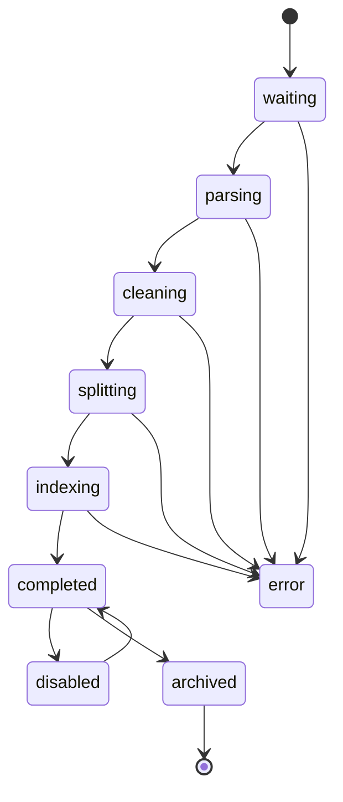
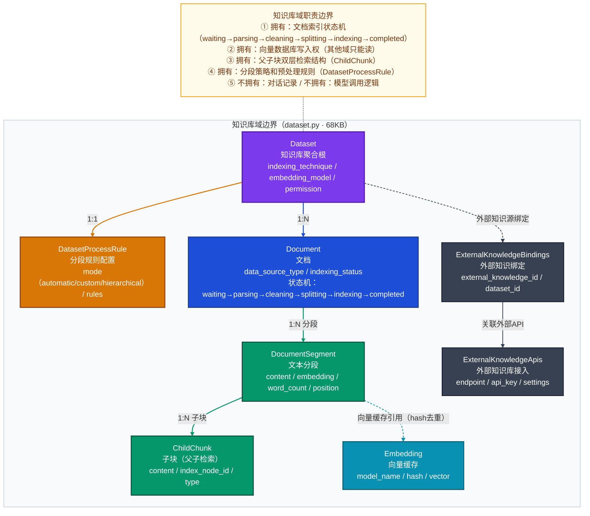
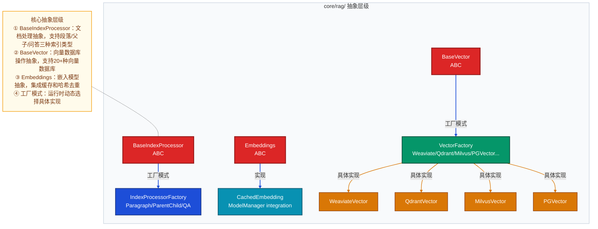
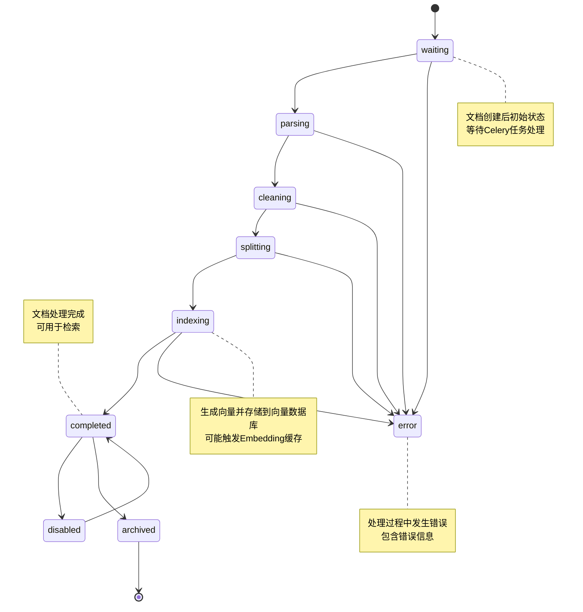
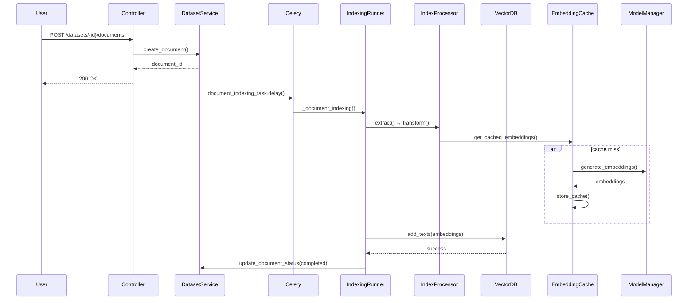

# Dify 知识库域（Knowledge / RAG）深度解析

> 使用方式：修改下方「子域变量」区块，其余内容不变，整体发送即可。
> 同一份提示词可分析 Dify 的全部 11 个子域。

---

## 子域变量

```
子域名称：知识库域（Knowledge / RAG）
DDD 类型：核心域
主模型文件：api/models/dataset.py
核心领域模块：api/core/rag/
核心服务文件：api/services/dataset_service.py
专项聚焦（可选）：索引状态机 / draft-published 双轨 / 凭据加密
```

### 子域速查表

| # | 子域名称 | DDD 类型 | 主模型文件 | 核心领域模块 | 典型专项聚焦 |
|---|---------|---------|-----------|------------|------------|
| ③ | 知识库域 | 核心域 | `dataset.py` | `core/rag/` | 索引状态机、父子块检索、向量 DB 边界 |

---

## 分析任务

深度分析 Dify 1.13.0「知识库域（Knowledge / RAG）」，从数据模型、代码架构、业务流程三个维度完整还原设计意图。

**源文件读取顺序**：先逐类读取主模型文件（不跳过任何 Model 类），再读核心领域模块理解抽象结构，最后读服务层理解字段的实际使用语义。

---

## 分析维度

### 一、子域定位

- **在全局子域图中的位置**：知识库域是 Dify 的**核心域**之一，直接对应产品的差异化竞争能力——RAG（检索增强生成）功能。作为核心域，它承载了文档摄取、处理、向量化和多路检索的完整生命周期管理。

- **数据主权**：该域独占以下数据的写入权：
  - **向量数据库写入权**：唯一拥有向量数据库写入权限的域，其他域只能通过检索接口读取
  - **文档处理状态机**：Document 表的 indexing_status 字段及其相关时间戳字段只能由该域更新
  - **分段和子块数据**：DocumentSegment 和 ChildChunk 表的完整生命周期管理
  - **向量缓存**：Embedding 表的哈希去重和缓存管理

- **边界约束**：
  - **importlinter 隔离规则**：`core/rag/` 模块被 importlinter 适度隔离，主要依赖基础库和模型运行时，但不直接依赖上层业务模块
  - **与其他子域的协作方式**：
    - **ID 引用**：应用域通过 `dataset_id` 引用知识库，无外键强约束
    - **快照引用**：检索结果包含完整的段落内容，保证历史查询结果一致性
    - **上游注入**：通过 `tenant_id` 接受账户/租户域的隔离注入
    - **下游暴露**：向应用域和工作流域暴露统一的检索接口

### 二、数据模型

#### 表清单：所有表名 + 一句话职责

| 表名 | 职责 |
|------|------|
| `datasets` | 知识库聚合根，管理知识库元数据和配置 |
| `dataset_process_rules` | 文档处理规则配置，定义分段策略和预处理规则 |
| `documents` | 文档实体，跟踪文档完整处理生命周期和状态机 |
| `document_segments` | 文本分段，存储实际用于检索的内容片段 |
| `child_chunks` | 子块实体，支持父子块层次化检索结构 |
| `embeddings` | 向量缓存，基于哈希去重避免重复计算 |
| `dataset_keyword_tables` | 关键词索引表，支持混合检索 |
| `app_dataset_joins` | 应用与知识库关联表，多对多关系 |
| `dataset_queries` | 查询日志，记录用户检索行为 |
| `external_knowledge_apis` | 外部知识 API 配置 |
| `external_knowledge_bindings` | 外部知识绑定关系 |
| `dataset_permissions` | 知识库权限控制 |
| `dataset_metadatas` | 文档元数据定义 |
| `dataset_metadata_bindings` | 元数据与文档绑定 |

#### 核心表（3-5 张）的字段分析

**1. Dataset 表（知识库聚合根）**
- `indexing_technique`：索引技术选择（high_quality/economy），决定是否使用向量检索
- `embedding_model` + `embedding_model_provider`：指定嵌入模型，体现模型供应商域的协作
- `retrieval_model`：JSON 字段存储检索配置（top_k、score_threshold、reranking等）
- `permission`：知识库访问权限控制（only_me/all_team_members/partial_members）
- `provider`：支持 vendor（内部）和 external（外部）两种知识源类型

**2. Document 表（文档状态机）**
- `indexing_status`：核心状态字段，驱动完整的处理状态机（waiting→parsing→cleaning→splitting→indexing→completed/error）
- 时间戳字段群：`processing_started_at`、`parsing_completed_at`、`cleaning_completed_at`、`splitting_completed_at`、`completed_at`，提供精确的处理阶段追踪
- `data_source_info`：JSON 字段存储数据源详细信息（文件ID、Notion页面、网站URL等）
- `doc_metadata`：文档级元数据，支持过滤和分类

**3. DocumentSegment 表（检索单元）**
- `content`：实际检索内容，经过处理后的文本片段
- `index_node_id`：向量数据库中的节点ID，建立与向量存储的映射
- `keywords`：关键词列表，支持关键词检索
- `hit_count`：检索命中计数，用于热度分析和优化

**4. Embedding 表（向量缓存）**
- `hash`：内容哈希值，实现去重的关键
- `model_name` + `provider_name`：模型标识，确保不同模型的嵌入不会混淆
- `embedding`：序列化的向量数据，使用 pickle 存储

#### 2 个关键设计决策

**场景描述 → 选择方案 → 设计理由 → 代价与权衡**

1. **文档处理状态机设计**
   - **场景描述**：需要支持长时间运行的文档处理任务，同时提供精确的状态反馈和错误恢复能力
   - **选择方案**：细粒度状态机（waiting→parsing→cleaning→splitting→indexing→completed）配合精确时间戳
   - **设计理由**：提供用户友好的进度显示，支持阶段级错误诊断和恢复，便于监控和调试
   - **代价与权衡**：增加了数据库字段复杂度，但提升了用户体验和系统可观测性

2. **向量缓存与哈希去重**
   - **场景描述**：嵌入计算成本高，相同内容可能被多次处理
   - **选择方案**：基于内容哈希的向量缓存，unique constraint 确保去重
   - **设计理由**：显著降低计算成本，提高处理速度，减少 API 调用费用
   - **代价与权衡**：需要额外的存储空间和哈希计算开销，但总体收益远大于成本

#### 跨域引用

- **引用其他域**：
  - `tenant_id`：引用账户/租户域，实现多租户隔离
  - `created_by`：引用 Account 表，记录创建者信息
  
- **跨域逻辑关联（无外键约束）**：
  - `App.dataset_id`：应用域通过 ID 引用知识库，无外键约束保持松耦合
  - `WorkflowRun.dataset_id`：工作流域引用知识库进行检索

### 三、代码架构（core/ 模块）

#### 抽象层级

知识库域采用经典的三层抽象架构：

```
ABC / 接口层
├── BaseIndexProcessor (文档处理抽象)
├── BaseVector (向量数据库操作抽象)  
└── Embeddings (嵌入模型抽象)

能力类型分支层
├── IndexProcessorFactory → [Paragraph/ParentChild/QA]
├── VectorFactory → [Weaviate/Qdrant/Milvus/PGVector/...]
└── CachedEmbedding → ModelManager integration

具体实现层
├── WeaviateVector, QdrantVector, MilvusVector, ...
├── ParagraphIndexProcessor, ParentChildIndexProcessor, QAIndexProcessor
└── Various text splitters and cleaners
```

#### 关键扩展点

**新增向量数据库支持**需要实现：
1. 继承 `BaseVector` 抽象类
2. 实现所有抽象方法（create, add_texts, search_by_vector, delete_by_ids 等）
3. 在 `vector_factory.py` 中注册新的向量类型
4. 遵守向量数据库连接和凭据管理的统一约束

**新增文档处理策略**需要实现：
1. 继承 `BaseIndexProcessor` 抽象类  
2. 实现 extract() 和 transform() 方法
3. 在 `index_processor_factory.py` 中注册新的处理器类型
4. 遵守文档模型和元数据处理的统一规范

#### 专项聚焦：索引状态机深入展开

索引状态机是知识库域的核心设计，体现在 `Document` 模型中：

- **状态流转**：`waiting` → `parsing` → `cleaning` → `splitting` → `indexing` → `completed/error`
- **不可逆转换**：一旦进入 `completed` 或 `error` 状态，不能回退到处理状态
- **Celery 介入点**：状态机由 `document_indexing_task` Celery 任务驱动，每个阶段完成后更新状态
- **关联字段变化**：
  - 进入 `parsing`：设置 `processing_started_at`
  - 完成 `parsing`：设置 `parsing_completed_at`，填充 `word_count`
  - 完成 `splitting`：设置 `splitting_completed_at`  
  - 完成 `indexing`：设置 `completed_at`，更新 `indexing_status='completed'`

### 四、典型业务场景

#### 场景1：上传文档并索引（最典型场景）

**经过的层**：
- **controller** → `api/controllers/web/dataset.py`：接收上传请求
- **service** → `api/services/dataset_service.py`：创建 Document 记录，触发 Celery 任务
- **core** → `api/core/indexing_runner.py`：执行文档处理流水线
- **model** → `api/models/dataset.py`：Document 状态更新和段落存储

**数据写入阶段**：
1. **初始创建**：Document 记录创建，`indexing_status='waiting'`
2. **解析阶段**：提取文本内容，更新 `word_count`，`parsing_completed_at`
3. **清洗阶段**：应用预处理规则（去停用词、清理URL等）
4. **分段阶段**：根据规则切分文本，创建 DocumentSegment 记录
5. **索引阶段**：生成嵌入向量，存储到向量数据库，更新 `completed_at`

**异步介入点**：
- **Celery 任务**：`document_indexing_task.delay()` 在服务层触发
- **向量计算**：可能调用外部模型 API，也是潜在的异步点
- **向量存储**：向量数据库写入操作

#### 场景2：父子块层次化检索

**特殊处理**：
- 当 `DatasetProcessRule.mode='hierarchical'` 时启用
- 创建父段落（DocumentSegment）和子块（ChildChunk）
- 检索时先匹配父段落，再在相关父段落内检索子块
- 提供更精细的上下文控制和检索精度

### 五、核心实体状态机

#### Document 聚合根生命周期



- **不可逆转换**：`completed` → `archived` 是单向的，归档后不能恢复
- **Celery 介入点**：所有处理状态（parsing/cleaning/splitting/indexing）都由 Celery 任务驱动
- **关联字段变化**：
  - `indexing_status`：反映当前状态
  - 各阶段时间戳字段：记录处理进度
  - `error` 字段：存储错误信息（仅在 error 状态）

### 六、跨域协作边界

#### 上游
- **账户/租户域**：通过 `tenant_id` 字段接受租户隔离注入，所有表都包含此字段
- **模型供应商域**：通过 `embedding_model` 和 `embedding_model_provider` 字段接受模型配置注入

#### 下游
- **应用域**：暴露 `dataset_id` 引用，应用通过此 ID 调用检索接口
- **工作流域**：工作流节点可通过知识库检索工具访问知识库内容
- **检索接口**：提供统一的 `dataset_retrieval.py` 接口供上层调用

#### 不拥有
- **对话记录**：属于应用域，知识库只负责提供检索结果
- **模型调用逻辑**：通过模型供应商域获取嵌入能力，不直接管理模型
- **用户界面**：UI 层完全由 Web 前端和应用控制器处理
- **权限验证**：虽然有 permission 字段，但具体的权限检查由服务层协调

### 七、运行时调度链路

知识库域向上层暴露统一的检索运行时能力：

#### 统一入口
- **类名**：`DatasetRetrieval`
- **调用签名**：`retrieve(query, dataset_id, retrieval_model_config)`

#### 调度层次
1. **检索配置解析层**：解析 `retrieval_model` JSON 配置，确定检索策略
2. **向量数据库适配层**：通过 `VectorFactory` 获取具体的向量数据库实例
3. **混合检索层**：结合向量检索和关键词检索（如果启用）
4. **重排序层**：应用重排序模型（如果配置）
5. **结果格式化层**：将原始检索结果转换为标准格式

#### 凭据处理
- **凭据解密**：向量数据库凭据在 `VectorFactory` 中解密
- **凭据传入**：解密后的凭据传入具体的向量数据库实现类

#### 故障处理
- **重试机制**：向量数据库操作失败时有内置重试逻辑
- **降级机制**：如果向量检索失败，可以降级到纯关键词检索（如果配置）
- **错误转换**：底层向量数据库异常转换为统一的业务异常

---

## 质量标准

- 每个结论关联到具体字段名、类名或代码路径：
  - `Document.indexing_status` 字段驱动状态机
  - `BaseIndexProcessor` 抽象类定义文档处理接口
  - `document_indexing_task` Celery 任务驱动异步处理
  - `VectorFactory` 实现向量数据库动态选择

- 设计决策解释"为什么这样设计，而非其他方案"：
  - 细粒度状态机 vs 简单状态：选择细粒度以提供更好的用户体验和可观测性
  - 向量缓存 vs 每次重新计算：选择缓存以降低成本和提高性能
  - 工厂模式 vs 直接实例化：选择工厂模式以支持运行时动态配置

---

## 格式规范

### 数据模型关系图



**关注焦点**：知识库域的数据模型完整性，展示从知识库配置到文档处理再到向量存储的完整数据流。

**设计要点**：
1. Document 状态机字段群提供了精确的处理阶段追踪能力
2. Embedding 表的 unique constraint 实现了高效的向量缓存和去重
3. ExternalKnowledge 绑定机制支持混合内外部知识源

### 类层级关系图



**关注焦点**：核心抽象层的设计，展示如何通过抽象和工厂模式支持多种实现。

**设计要点**：
1. 三层抽象架构（ABC → Factory → Implementation）提供了良好的扩展性
2. 工厂模式使得运行时可以动态选择不同的向量数据库和处理策略
3. 所有具体实现都遵循统一的接口契约，保证了系统的一致性

### 状态机图



**关注焦点**：Document 实体的完整生命周期，展示异步处理的复杂状态流转。

**设计要点**：
1. 细粒度状态设计提供了精确的进度反馈和错误定位能力
2. 错误状态可以从任何处理阶段进入，保证了系统的健壮性
3. completed 状态支持 disabled/archive 操作，提供了灵活的文档管理能力

### 端到端流程图



**关注焦点**：文档上传到索引完成的完整异步处理流程。

**设计要点**：
1. Celery 任务实现了真正的异步处理，避免阻塞用户请求
2. Embedding 缓存机制显著降低了重复计算成本
3. 各组件职责清晰分离，便于维护和扩展