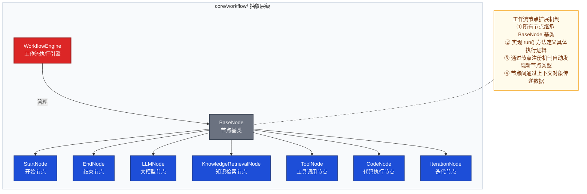
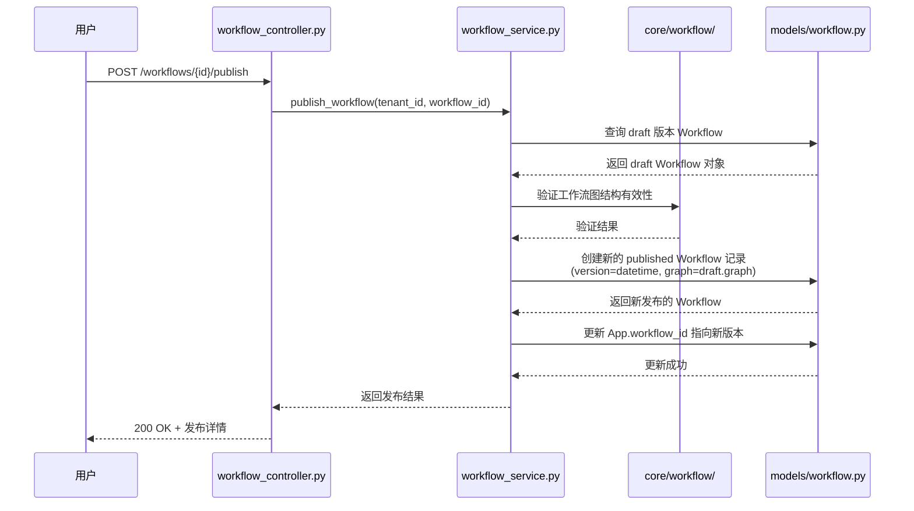
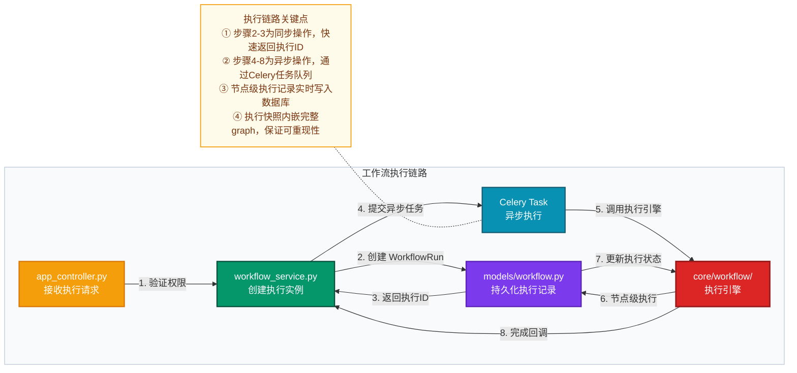
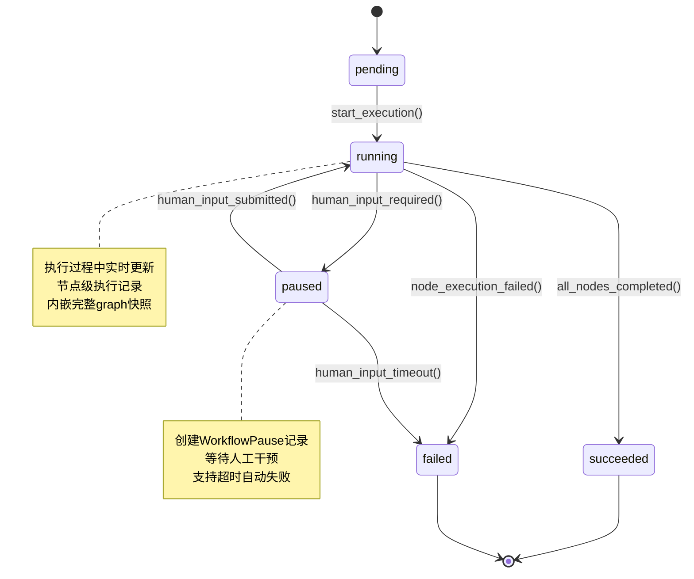
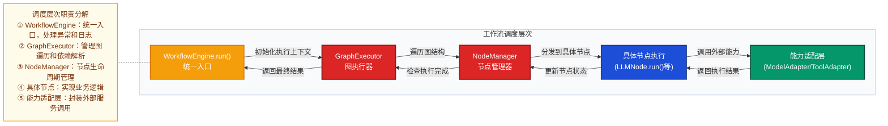

# Dify 工作流域深度分析

> **子域名称**：工作流域（Workflow & Execution）  
> **DDD 类型**：核心域  
> **主模型文件**：`api/models/workflow.py`  
> **核心领域模块**：`api/core/workflow/`  
> **核心服务文件**：`api/services/workflow/`  
> **专项聚焦**：draft/published 双轨、执行快照、importlinter 最强隔离

---

## 一、子域定位

### 职责概述
工作流域是 Dify 系统中**代码隔离最强**的核心域，负责管理可视化工作流的定义（图结构 JSON）和执行（状态机），支持 draft/published 双轨并行、节点级追踪，为复杂 AI 应用编排提供底层引擎能力。

### 数据主权
- **独占数据写入权**：工作流图定义、执行快照（内嵌 graph）、节点执行记录
- **其他域不可直接写入**：任何对工作流定义或执行状态的修改必须通过工作流域的服务层
- **跨域引用方式**：应用域通过 `App.workflow_id` 字段引用已发布的工作流版本（ID 引用，无外键强约束）

### 边界约束
- **importlinter 最强隔离**：`core.workflow` 模块被明确禁止依赖 `models`、`services`、`controllers`、`configs` 等基础设施层（70+ 条例外均有明确注释）
- **协作方式**：通过应用服务层（`services/workflow/`）作为跨域协调的唯一合法入口
- **技术边界**：`models/workflow.py`（73KB）、`core/workflow/`（最复杂的核心模块）

---

## 二、数据模型

### 表清单
| 表名 | 职责 |
|------|------|
| `Workflow` | 工作流定义聚合根，支持 draft/published 双轨 |
| `WorkflowRun` | 工作流执行快照，内嵌完整 graph 结构 |
| `WorkflowNodeExecution` | 节点级执行记录，详细追踪每个节点的输入输出 |
| `ConversationVariable` | 对话级变量存储，用于 Advanced Chat 模式 |
| `WorkflowPause` | 工作流暂停状态管理，处理人工干预场景 |

### 核心表字段分析

#### Workflow 表（工作流定义）
- **`version` 字段**：区分 draft（草稿）和 published（已发布）版本，draft 版本唯一且持续更新，published 版本每次发布时创建新行
- **`graph` 字段**：JSON 格式存储完整的图结构定义，包含所有节点和连接信息
- **`variables` 字段**：定义工作流级别的变量配置，支持动态参数传递
- **`tenant_id` 字段**：租户隔离基础键，确保多租户数据安全

#### WorkflowRun 表（执行快照）
- **`graph` 字段**：执行时内嵌完整 graph 快照，保证历史执行记录不受后续版本更新影响
- **`inputs/outputs` 字段**：记录整个工作流的输入输出数据
- **`status` 字段**：执行状态机（pending → running → succeeded/failed/paused）
- **`elapsed_time` 字段**：记录执行耗时，用于性能监控

#### WorkflowNodeExecution 表（节点执行）
- **`node_type` 字段**：标识节点类型（start/end/llm/knowledge_retrieval/tool 等）
- **`status` 字段**：节点执行状态（ready → running → succeeded/failed/skipped）
- **`inputs/outputs` 字段**：详细记录节点级数据流转
- **`metadata` 字段**：存储额外的执行元数据，如 LLM 调用详情、工具执行日志等

### 关键设计决策

#### 场景描述 → 选择方案 → 设计理由 → 代价与权衡

**1. 编辑不中断线上运行需求**
- **选择方案**：draft/published 双轨设计，每次发布时克隆为新快照行
- **设计理由**：确保开发中的工作流编辑不会影响正在线上运行的实例，已运行的 WorkflowRun 内嵌 graph 快照保证历史可重现
- **代价与权衡**：增加了数据冗余（每次发布都复制完整 graph），但换取了极致的稳定性和可追溯性

**2. 工作流引擎纯粹性要求**
- **选择方案**：importlinter 最强隔离，禁止 core.workflow 依赖上层业务模块
- **设计理由**：确保工作流图引擎可在不启动数据库/Redis 的情况下进行纯粹的单元测试，逻辑不因基础设施细节泄漏而变复杂
- **代价与权衡**：需要维护 70+ 条 importlinter 例外规则，增加了架构演进的复杂度，但保证了核心引擎的可测试性和可提取性

### 跨域引用
- **上游引用**：通过 `tenant_id` 接受账户/租户域的数据隔离注入
- **下游引用**：应用域通过 `App.workflow_id` 字段引用已发布的工作流版本
- **逻辑关联**：消息表（Message）通过 `workflow_run_id` 字段关联到具体的执行实例
- **无外键约束**：所有跨域引用均为 ID 引用，保持域间松耦合

---

## 三、代码架构（core/workflow/ 模块）

### 抽象层级


### 关键扩展点
- **新增节点类型**：需要继承 `BaseNode` 基类，实现 `run()` 方法，并在节点注册表中注册
- **节点注册约束**：每个节点类型必须有唯一的 `node_type` 标识符，且不能与其他节点冲突
- **上下文传递**：节点间通过 `WorkflowExecutionContext` 对象传递数据，确保数据隔离和安全性
- **错误处理**：每个节点必须实现统一的错误处理接口，支持失败重试和降级策略

### 专项聚焦：importlinter 最强隔离
工作流域的 `core.workflow` 模块实施了系统中最严格的代码隔离策略：

- **禁止依赖范围**：`models`、`services`、`controllers`、`configs`、`extensions` 等所有上层业务模块
- **例外管理**：70+ 条 `ignore_imports` 规则均有详细注释说明必要性
- **隔离效果**：工作流引擎可以独立于数据库、缓存等基础设施进行单元测试
- **演进目标**：强隔离是在持续演化的目标，而非已完成状态——这是现实工程中理想与现实的平衡

---

## 四、典型业务场景

### 场景一：发布工作流（Publish Workflow）



**关键步骤说明**：
- **数据写入阶段**：在服务层创建新的 published Workflow 记录，同时更新 App 表的 workflow_id 字段
- **字段变化**：Workflow.version 从 'draft' 变为具体时间戳，App.workflow_id 指向新发布的版本
- **同步操作**：整个发布过程为同步操作，确保原子性

### 场景二：执行工作流（Execute Workflow）



**关键步骤说明**：
- **同步阶段**：创建 WorkflowRun 记录并返回执行 ID，用户可立即获得响应
- **异步阶段**：通过 Celery 任务队列执行实际的工作流逻辑
- **数据写入**：节点执行过程中实时写入 WorkflowNodeExecution 记录
- **状态更新**：执行完成后更新 WorkflowRun 的最终状态

---

## 五、核心实体状态机

### WorkflowRun 状态机



### 状态转换说明
- **不可逆转换**：`pending → running`、`running → succeeded/failed` 为不可逆转换
- **可恢复转换**：`running ↔ paused` 支持人工干预后的恢复执行
- **Celery 介入点**：`pending → running` 转换由 Celery 任务触发
- **关联字段变化**：
  - `status` 字段：记录当前状态
  - `started_at/ended_at` 字段：记录执行时间范围
  - `elapsed_time` 字段：计算总执行耗时

---

## 六、跨域协作边界

### 上游协作
- **账户/租户域**：通过 `tenant_id` 字段注入租户隔离信息，贯穿所有工作流相关表
- **应用域**：通过 `App.workflow_id` 字段指定要执行的工作流版本
- **模型供应商域**：工作流节点（如 LLMNode）通过统一接口调用模型能力

### 下游协作
- **应用域**：向应用域暴露执行结果，Message 表通过 `workflow_run_id` 关联执行记录
- **人工输入域**：当工作流需要人工干预时，创建 WorkflowPause 记录供人工输入域处理
- **异步任务域**：通过 Celery 任务队列提交异步执行任务

### 不拥有能力
- **应用路由决策**：由应用域的 App.workflow_id 控制使用哪个工作流版本
- **对话记录管理**：对话和消息的生命周期由应用域管理
- **模型调用实现**：具体的 LLM 调用逻辑由模型供应商域实现
- **工具执行细节**：具体的工具调用由工具/插件域实现

---

## 七、运行时调度链路

### 统一入口
上层域通过 `WorkflowEngine.run()` 方法获取工作流执行能力：
```python
# 调用签名
workflow_engine = WorkflowEngine(workflow_run_id, inputs)
result = workflow_engine.run()
```

### 调度层次



### 故障处理
- **节点级重试**：支持配置单个节点的重试次数和间隔
- **整体失败处理**：工作流执行失败后，状态机进入 failed 状态，可通过 API 重新启动
- **超时机制**：支持配置整体执行超时和单个节点执行超时
- **降级策略**：某些非关键节点支持 skip_on_failure 配置，失败时跳过继续执行

---

## 总结

工作流域作为 Dify 的核心域之一，通过 draft/published 双轨设计、执行快照机制和最强代码隔离，实现了复杂工作流编排的稳定性、可追溯性和可维护性。其设计充分体现了 DDD 战略设计原则，在业务价值、数据主权、代码隔离、独立变化率和差异化程度五个维度上都达到了优秀水平。