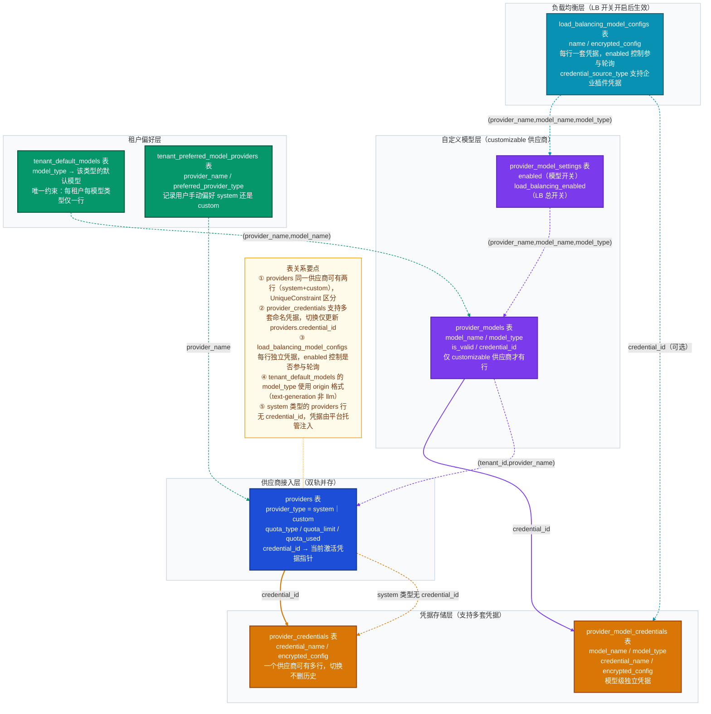
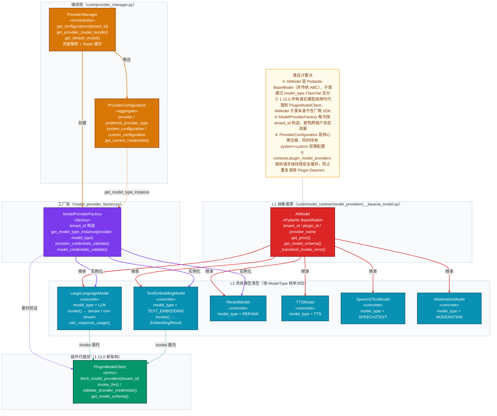
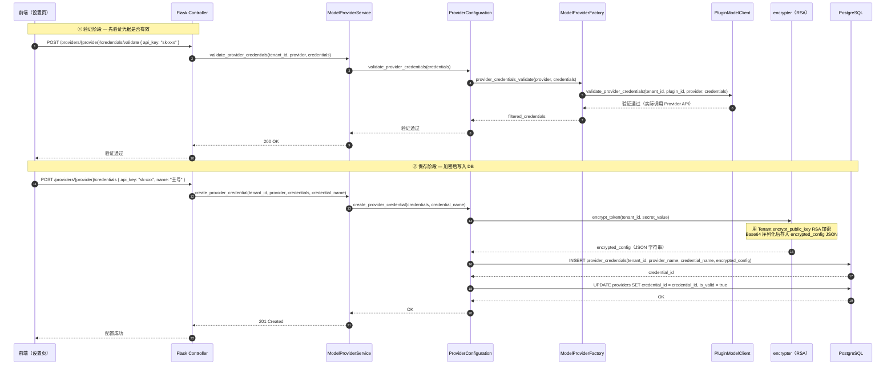
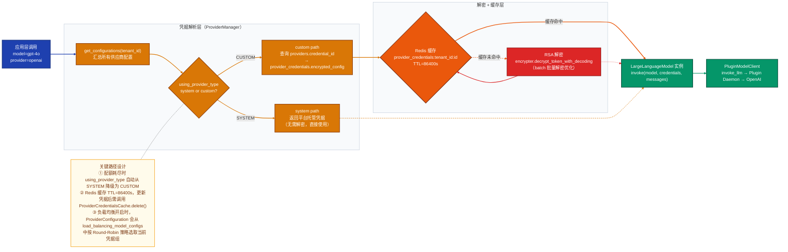
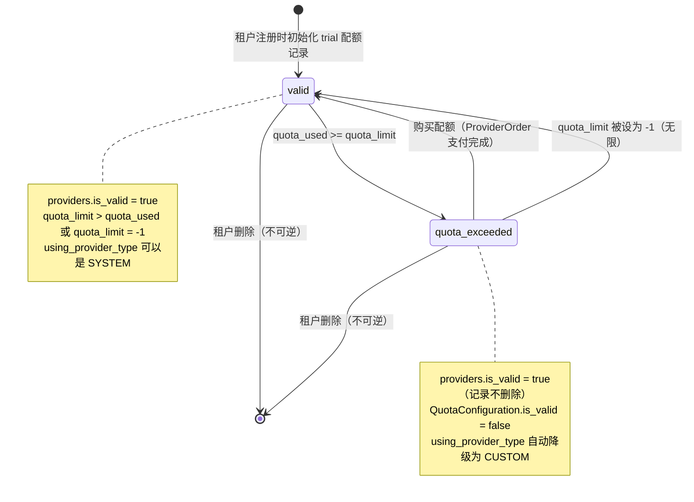

# Dify 1.13.0 模型供应商域深度解析

> **子域信息**  
> 名称：模型供应商域（Model Provider）  
> DDD 类型：支撑域  
> 主模型文件：`api/models/provider.py`  
> 核心领域模块：`api/core/model_runtime/`、`api/core/provider_manager.py`  
> 核心服务文件：`api/services/model_provider_service.py`  
> 专项聚焦：系统配额 vs 用户自定义双轨切换、凭据 RSA 加密与 Redis 缓存、插件化供应商注册（1.13.0 新架构）、负载均衡多凭据轮询

---

## 一、子域定位

### 在全局子域图中的位置

模型供应商域是 Dify 的**核心支撑域**，负责管理所有 LLM 及周边模型（Embedding、Rerank、TTS 等）的接入凭据、配额状态与运行时调度。它不参与业务逻辑，但**每个会消费模型的核心域（应用域、工作流域、知识库域）都必须通过本域解析凭据才能发起模型调用**。

**一句话职责**：本域独占"谁可以用哪个模型、用哪套凭据、还剩多少配额"的写入权，并向上层域暴露运行时可调用的 `AIModel` 实例与解密后的凭据字典。

### 数据主权

| 独占写入的数据 | 对应表 |
|---|---|
| 供应商接入凭据（加密存储） | `providers`、`provider_credentials` |
| 自定义模型凭据 | `provider_models`、`provider_model_credentials` |
| 租户默认模型偏好 | `tenant_default_models`、`tenant_preferred_model_providers` |
| 模型级启用状态与负载均衡配置 | `provider_model_settings`、`load_balancing_model_configs` |
| 系统配额消耗量 | `providers.quota_used` |

其他域**不能**直接写入上述表；应用域、工作流域通过 ID 引用 `provider_name + model_name` 组合，在运行时由本域解析为实际可调用实例。

### 边界约束

- **importlinter**：`core/model_runtime/` 内部对外无强制隔离规则，但通过 Plugin Daemon 代理所有真实模型调用，内部不直接持有任何厂商 SDK 依赖。
- 与其他域的协作方式：
  - **应用域 / 工作流域** → ID 引用（`provider_name + model_name`），运行时传入 `tenant_id` 由本域负责解析
  - **账户/租户域** → 读取 `Tenant.encrypt_public_key` 完成凭据加密；外键弱绑定（无 FK 约束，逻辑关联）

---

## 二、数据模型

### 表清单

| # | 表名 | 一句话职责 |
|---|------|-----------|
| 1 | `providers` | 供应商接入记录，区分 system/custom 类型，含配额字段 |
| 2 | `provider_credentials` | 供应商级命名凭据集（支持多套凭据，通过 `credential_id` 指向当前使用） |
| 3 | `provider_models` | 自定义模型记录（customizable 供应商才有，如私有部署的 Ollama） |
| 4 | `provider_model_credentials` | 模型级命名凭据集（per-model 独立凭据） |
| 5 | `tenant_default_models` | 租户各模型类型的默认模型选择 |
| 6 | `tenant_preferred_model_providers` | 租户对每个供应商是否偏好 system/custom 的记录 |
| 7 | `provider_model_settings` | 模型级启用开关 + 负载均衡总开关 |
| 8 | `load_balancing_model_configs` | 单模型多凭据负载均衡配置（每行一套凭据） |
| 9 | `provider_orders` | 托管配额购买订单（SaaS 版专用，记录支付状态） |

### 核心表字段分析

#### `providers` 表（供应商接入主记录）

```
providers
├── tenant_id               # 租户隔离键
├── provider_name           # 供应商标识（1.13.0 后支持 plugin_id/name 格式）
├── provider_type           # 枚举：system（托管）/ custom（自定义）
├── is_valid                # 该记录是否有效（配额耗尽则置 false）
├── credential_id           # 指向 provider_credentials.id（当前激活凭据）
├── quota_type              # 枚举：paid / free / trial（system 类型专用）
├── quota_limit             # 配额上限（-1 表示无限）
└── quota_used              # 已消耗配额
```

**设计意图**：`providers` 一行同时承载两种完全不同的语义——当 `provider_type=system` 时，它是一条**配额记录**（`quota_type+quota_limit+quota_used` 才有意义）；当 `provider_type=custom` 时，它是一条**凭据绑定记录**（`credential_id` 指向用户上传的 API Key）。UniqueConstraint(`tenant_id, provider_name, provider_type, quota_type`) 确保同一租户同一供应商同一类型同一配额只有一行，但 system 和 custom 可以共存。

#### `provider_credentials` 表（供应商级命名凭据）

```
provider_credentials
├── tenant_id
├── provider_name
├── credential_name         # 用户可读名称（如 "我的OpenAI主号"）
└── encrypted_config        # RSA + Base64 加密后的凭据 JSON 字符串
```

**设计意图**：1.13.0 引入多凭据支持。`providers.credential_id` 是"当前激活指针"，`provider_credentials` 可以存储多行同一供应商的不同凭据，用户可以随时切换。`encrypted_config` 存储 JSON 序列化后再逐字段 RSA 加密的凭据（只有 `secret_input` 类型的字段被加密，`text_input` 明文存储）。

#### `load_balancing_model_configs` 表（负载均衡多凭据）

```
load_balancing_model_configs
├── tenant_id / provider_name / model_name / model_type   # 精确定位到某个模型
├── name                    # 凭据组名称
├── encrypted_config        # 加密凭据（与 provider_credentials 格式相同）
├── credential_id           # 可选：指向已有的 provider_model_credentials
├── credential_source_type  # 凭据来源类型（enterprise 插件管理）
└── enabled                 # 本组凭据是否参与轮询
```

**设计意图**：每一行代表一套独立的 API 配置（可以是不同 endpoint 或不同 API Key），`ProviderModelSetting.load_balancing_enabled=true` 时启用，系统在调用时从所有 `enabled=true` 的行中轮询。

### 2 个关键设计决策

**决策一：凭据与供应商记录分离存储**

- **场景描述**：用户配置 OpenAI 供应商时需要保存 API Key 等敏感凭据
- **选择方案**：`providers` 只存元信息（类型、配额），凭据单独存在 `provider_credentials`，通过 `credential_id` 外键关联
- **设计理由**：支持"多凭据"场景——同一供应商可以有多套 API Key（如主号/备号），用户可以在不删除历史记录的情况下切换激活凭据；同时也支持负载均衡场景中的凭据池管理
- **代价与权衡**：查询凭据需要两步（先查 `providers.credential_id`，再查 `provider_credentials`），通过 `Provider.credential` 的 `@cached_property` 和 Redis 缓存（`ProviderCredentialsCache`，TTL=86400s）缓解性能问题

**决策二：供应商声明通过 Plugin Daemon 动态获取，不再内置**

- **场景描述**：1.13.0 之前供应商 YAML 声明文件内置在代码库，新增供应商需要发版；1.13.0 重构为插件化架构
- **选择方案**：`ModelProviderFactory.get_providers()` 通过 `PluginModelClient.fetch_model_providers(tenant_id)` 从 Plugin Daemon 获取，每次请求时动态加载，Model Schema 用 Redis 缓存（`PLUGIN_MODEL_SCHEMA_CACHE_TTL`）
- **设计理由**：供应商能力（支持的模型列表、参数规格、Price Config）由插件独立声明和发布，平台无需随供应商更新发版；租户可以安装自定义插件支持私有供应商
- **代价与权衡**：每次 `get_configurations()` 需调用 Plugin Daemon 的 gRPC 接口，引入跨进程延迟；通过 `contexts.plugin_model_providers` 的请求级内存缓存（线程安全 Lock）缓解

### 跨域引用

| 引用方向 | 字段 | 说明 |
|---|---|---|
| 引用账户/租户域 | `tenant_id`（全部表） | 租户隔离，无 FK 约束 |
| 引用账户/租户域 | `Tenant.encrypt_public_key`（逻辑） | 加密凭据时读取租户公钥，运行时 JOIN |
| 被应用域引用 | `provider_name + model_name` | 应用配置中记录模型标识符，运行时由本域解析 |
| 被工作流域引用 | `provider_name + model_name`（LLM 节点参数） | 工作流执行快照中保留模型配置 |

---

## 三、代码架构（core/ 模块）

### 图一：数据模型关系图

> 以下图展示从「供应商注册记录」到「凭据存储」再到「模型配置」的完整表关系链路，重点标注 system/custom 双轨结构与凭据多版本设计。图后说明 3 个非显而易见的设计要点。



**设计要点**：
1. `providers` 表中 system 类型的行没有 `credential_id`，其凭据由平台通过 `ext_hosting_provider.hosting_configuration` 注入，运行时不经过 DB 查询
2. `load_balancing_model_configs.credential_source_type` 支持企业版插件托管凭据（`PluginCredentialType`），使凭据管理可从平台侧统一调度
3. `tenant_default_models.model_type` 字段存储的是 origin 格式（如 `text-generation`、`embeddings`），而非 `ModelType` 枚举值（`llm`、`text-embedding`），需要 `ModelType.to_origin_model_type()` 转换，是一个隐性约定

---

### 图二：类层级关系图

> 以下图展示从抽象 `AIModel` 到具体模型类型，再到 `ModelProviderFactory` 工厂与 `ProviderManager` 编排器的代码对象设计。重点还原 1.13.0 插件化架构下的调用委托关系。



**设计要点**：
1. `AIModel` 不是传统意义的 ABC（`abstractmethod`），而是 Pydantic `BaseModel`——具体子类通过 `model_type: ModelType = ModelType.LLM` 这样的 ClassVar 区分类型，`ModelProviderFactory.get_model_type_instance()` 的 `if-elif` 链是唯一的"注册表"
2. 1.13.0 所有实际推理都通过 `PluginModelClient`（gRPC 代理）转发到 Plugin Daemon 进程，`LargeLanguageModel.invoke()` 本身只负责回调触发和流式结果组装，不持有任何 HTTP Client
3. `ProviderConfiguration.get_current_credentials()` 实现了 system/custom 双轨优先级切换：若 `using_provider_type=SYSTEM`，返回平台托管凭据；否则返回用户自定义凭据（已解密）

---

## 四、典型业务场景

### 场景一：用户首次配置 OpenAI 供应商凭据

**经过的层**：`controller → ModelProviderService → ProviderConfiguration → ProviderManager → encrypter → DB`



**关键设计点**：
- 步骤 4-6：验证和保存分两步发起，验证时凭据**不持久化**，只通过 Plugin Daemon 真实调用目标厂商的 API 验证可用性
- 步骤 12-13：只有 `secret_input` 类型的字段（如 `api_key`）会被 RSA 加密，`text_input` 字段（如 `api_base`）明文存储在 JSON 中
- 无 Celery 异步介入：凭据配置是同步操作，不涉及 Celery

---

### 场景二：应用发起 LLM 调用时的凭据解析与双轨切换

**经过的层**：`core/app → ProviderManager → ProviderConfiguration → encrypter → Redis → PluginModelClient → LLM Provider`



**关键设计点**：
- `ProviderManager.get_configurations()` 在每次调用时全量构建所有供应商配置，但通过请求级 `contexts.plugin_model_providers` 内存缓存避免重复调用 Plugin Daemon
- `_get_and_decrypt_credentials()` 使用 `ProviderManager.decoding_rsa_key` 实例变量复用 RSA Key 对象，避免在一次请求中多次供应商的凭据解密时重复加载私钥

---

## 五、核心实体状态机

模型供应商域**没有传统意义上的状态机聚合根**——供应商记录的生命周期非常简单：存在（`is_valid=true`）或无效（`is_valid=false`）。以下展示**系统配额**的"有效性"状态机，这是本域最接近状态驱动的设计。



**说明**：
- `is_valid=false` 不代表"配额耗尽"，而是代表该条 `providers` 记录已被逻辑删除或无效（如用户手动撤销系统配额）
- 配额耗尽由 `QuotaConfiguration.is_valid = (quota_limit > quota_used or quota_limit == -1)` 在**运行时计算**，并不写回 `providers.is_valid`
- Celery **不介入**配额扣减，配额消耗是在模型调用完成后同步写入 `providers.quota_used`

---

## 六、专项聚焦深度展开

### 6.1 凭据加密机制

Dify 的凭据加密采用**租户级 RSA 非对称加密**，设计如下：

```
加密流程：
  1. 创建租户时生成 RSA 密钥对，公钥存于 Tenant.encrypt_public_key（明文）
  2. 用户提交凭据 → CredentialFormSchema 区分 secret_input / text_input
  3. 只有 secret_input 字段被加密：rsa.encrypt(token, public_key) → Base64
  4. 所有字段（含明文字段）序列化为 JSON → encrypted_config 列

解密流程：
  1. 调用 rsa.get_decrypt_decoding(tenant_id) 获取私钥（私钥存于安全存储）
  2. 批量解密 secret_input 字段（batch_decrypt_token 优化）
  3. 解密结果写入 Redis（key=provider_credentials:tenant_id:{id}，TTL=86400s）
  4. 后续请求直接读 Redis，不重复 RSA 解密
```

**代价**：更新凭据时必须手动调用 `ProviderCredentialsCache.delete()` 使缓存失效（见 `ProviderConfiguration` 的 CRUD 方法），否则 24 小时内仍会使用旧凭据。

### 6.2 系统配额 vs 用户自定义的双轨切换逻辑

`ProviderManager.get_configurations()` 中的切换决策（`api/core/provider_manager.py` 约 195-216 行）：

```python
# 优先级决策伪代码
if preferred_provider_type == SYSTEM:
    if not system_enabled or not has_valid_quota:
        using_provider_type = CUSTOM  # 自动降级
else:  # preferred = CUSTOM
    if not custom_configured:
        if system_enabled and has_valid_quota:
            using_provider_type = SYSTEM  # 无 custom 配置时自动升级使用系统配额
```

系统配额内部还有优先级：`PAID > FREE > TRIAL`（`_choice_current_using_quota_type()` 方法），确保付费配额优先消耗。

### 6.3 负载均衡多凭据轮询

1. 特性开关：`FeatureService.get_features(tenant_id).model_load_balancing_enabled`（读取 Redis 缓存，TTL=120s）
2. 前提：`ProviderModelSetting.load_balancing_enabled = true`（per-model 开关）
3. 执行时：从 `load_balancing_model_configs` 中取所有 `enabled=true` 的行，按 Round-Robin 选取当前行的凭据组
4. 凭据来源：可以是 `encrypted_config`（直接存储）或 `credential_id → provider_model_credentials`（引用已有凭据），由 `credential_source_type` 区分

---

## 七、跨域协作边界

### 上游（本域接受哪些注入）

| 注入来源 | 字段 | 说明 |
|---|---|---|
| 账户/租户域 | `tenant_id` | 所有查询的隔离键 |
| 账户/租户域 | `Tenant.encrypt_public_key` | 凭据加密时读取 |
| Plugin Daemon（外部服务） | `PluginModelProviderEntity` | 供应商声明（模型列表、参数规格、价格配置） |

### 下游（本域向哪些域暴露什么）

| 暴露对象 | 消费域 | 接口/ID 引用 |
|---|---|---|
| `AIModel` 实例（`LargeLanguageModel` 等） | 应用域、工作流域、知识库域 | `ProviderManager.get_provider_model_bundle()` |
| 解密后的凭据字典 | 应用域（AppRunner）、工作流域（LLM 节点） | `ProviderConfiguration.get_current_credentials()` |
| 可用模型列表 | 前端（模型选择器）、工作流域（节点配置） | `ProviderConfigurations.get_models()` |
| 默认模型 | 应用域（首次创建应用） | `ProviderManager.get_default_model()` |

### 不拥有（本域边界内不负责的能力）

- **不负责**：模型调用的业务编排（prompt 构建、上下文管理、工具调用逻辑）
- **不负责**：调用结果的持久化（Message 写入属于应用域）
- **不负责**：Plugin Daemon 内部的真实 HTTP 调用实现（代理到外部进程）
- **不负责**：模型 Token 消耗的业务统计（Message Token 计数属于计量域）
- **不负责**：凭据轮转（无自动 Key Rotation，依赖用户手动更新）

---

---

## 七、运行时调度全链路（ModelManager）

> 前六节回答了"数据怎么存、代码怎么组织"，但没有回答"一次实际的 LLM 调用是如何被端到端调度的"。本节补充从上层业务域发起调用到 Plugin Daemon 返回结果的完整运行时链路，重点还原三层调度对象（`ModelManager → ModelInstance → LBModelManager`）的职责边界与凭据解析时机。

### 7.1 三层调度对象职责

| 层次 | 类 | 文件 | 核心职责 |
|------|---|------|---------|
| L1 | `ModelManager` | `core/model_manager.py` | 统一入口：按 `tenant_id + provider + model_type + model` 解析出可用的 `ModelInstance`；若 `provider` 为空则查 `tenant_default_models` 自动补全 |
| L2 | `ModelInstance` | `core/model_manager.py` | 单次调用上下文：持有解密后凭据、`AIModel` 子类实例、`LBModelManager`（可选）；暴露 `invoke_llm / invoke_text_embedding / invoke_rerank` 等类型安全方法 |
| L3 | `LBModelManager` | `core/model_manager.py` | 负载均衡调度器：基于 Redis INCR 实现跨进程 Round-Robin；维护 Cooldown 状态屏蔽不可用凭据组 |

### 7.2 完整运行时调度图

> 下图展示从应用域/工作流域发起一次 LLM 调用，到 Plugin Daemon 返回结果的全链路。重点标注凭据解析时机（构造 `ModelInstance` 时一次性完成）和负载均衡的 Round-Robin + Cooldown 循环结构。

```mermaid
flowchart LR
    classDef callerStyle  fill:#1e40af,stroke:#1e3a8a,stroke-width:2.5px,color:#fff
    classDef mmStyle      fill:#d97706,stroke:#92400e,stroke-width:2px,color:#fff
    classDef miStyle      fill:#7c3aed,stroke:#5b21b6,stroke-width:2px,color:#fff
    classDef lbStyle      fill:#0891b2,stroke:#155e75,stroke-width:2px,color:#fff
    classDef pluginStyle  fill:#059669,stroke:#064e3b,stroke-width:2px,color:#fff
    classDef cacheStyle   fill:#ea580c,stroke:#7c2d12,stroke-width:2px,color:#fff
    classDef noteStyle    fill:#fffbeb,stroke:#f59e0b,stroke-width:1.5px,color:#78350f
    classDef layerStyle   fill:#f8fafc,stroke:#cbd5e0,stroke-width:1.5px

    CALLER["应用域 / 工作流域<br>model_manager.get_model_instance(<br>  tenant_id, provider, model_type, model<br>)"]:::callerStyle

    subgraph MM["L1：ModelManager（统一入口）"]
        direction TB
        RESOLVE{"provider 为空?"}:::mmStyle
        DEFAULT["get_default_model_instance()<br>→ 查 tenant_default_models<br>→ 自动补全 provider + model"]:::mmStyle
        BUNDLE["get_provider_model_bundle(<br>  tenant_id, provider, model_type<br>)<br>→ ProviderConfiguration + AIModel 实例"]:::mmStyle
    end
    class MM layerStyle

    subgraph MI["L2：ModelInstance（单次调用上下文，构造时一次性解析凭据）"]
        direction TB
        CRED_FETCH["_fetch_credentials_from_bundle()<br>→ configuration.get_current_credentials()<br>→ 系统凭据 or 解密后自定义凭据<br>凭据仅在此处读取一次，后续不再查 DB"]:::miStyle
        LB_INIT["_get_load_balancing_manager()<br>→ 若 load_balancing_enabled=true<br>→ 构造 LBModelManager"]:::miStyle
        INVOKE["invoke_llm() / invoke_text_embedding()<br>→ _round_robin_invoke(function, **kwargs)"]:::miStyle
    end
    class MI layerStyle

    subgraph LB["L3：LBModelManager（Round-Robin + Cooldown）"]
        direction TB
        FETCH_NEXT["fetch_next()<br>Redis INCR model_lb_index:{tenant}:{provider}:{type}:{model}<br>取模 → 得到当前凭据组下标"]:::lbStyle
        COOLDOWN_CHK{"in_cooldown(config)?<br>key: model_lb_index:cooldown:...:{config_id}"}:::lbStyle
        USE_CRED["使用该凭据组调用<br>function(..., credentials=lb_config.credentials)"]:::lbStyle
        ON_RATE["InvokeRateLimitError<br>cooldown(config, expire=60s)"]:::lbStyle
        ON_AUTH["InvokeAuthorizationError / ConnectionError<br>cooldown(config, expire=10s)"]:::lbStyle
        ALL_COOL["所有凭据组均在 Cooldown<br>fetch_next() 返回 None<br>→ 抛出最后一个异常"]:::lbStyle
    end
    class LB layerStyle

    PLUGIN["PluginModelClient<br>invoke_llm → gRPC → Plugin Daemon<br>→ OpenAI / Anthropic / ..."]:::pluginStyle

    CALLER -->|"指定 provider+model"| RESOLVE
    RESOLVE -->|"是"| DEFAULT
    RESOLVE -->|"否"| BUNDLE
    DEFAULT --> BUNDLE
    BUNDLE --> CRED_FETCH
    CRED_FETCH --> LB_INIT
    LB_INIT --> INVOKE
    INVOKE -->|"无 LB"| PLUGIN
    INVOKE -->|"有 LB"| FETCH_NEXT
    FETCH_NEXT --> COOLDOWN_CHK
    COOLDOWN_CHK -->|"冷却中，跳过"| FETCH_NEXT
    COOLDOWN_CHK -->|"可用"| USE_CRED
    USE_CRED --> PLUGIN
    USE_CRED -->|"限流"| ON_RATE
    USE_CRED -->|"鉴权/连接失败"| ON_AUTH
    ON_RATE -->|"重试下一组"| FETCH_NEXT
    ON_AUTH -->|"重试下一组"| FETCH_NEXT
    COOLDOWN_CHK -->|"全部冷却"| ALL_COOL

    NOTE["调度链路要点<br>① 凭据只在构造 ModelInstance 时解析一次（含 RSA 解密 + Redis 缓存命中检查）<br>② LB Round-Robin 使用 Redis INCR（原子自增），天然支持多 Worker 进程间共享轮询状态<br>③ RateLimit 触发 60s Cooldown，AuthError / ConnectionError 触发 10s Cooldown<br>④ 全部凭据组均冷却时直接抛出最后一次异常，不做无限重试<br>⑤ LBModelManager 支持 __inherit__ 特殊名称，继承供应商级凭据作为 LB 节点之一"]:::noteStyle
    NOTE -.- INVOKE

    %% 边索引：0-18，共 19 条
    linkStyle 0  stroke:#1e40af,stroke-width:2px
    linkStyle 1  stroke:#d97706,stroke-width:1.5px,stroke-dasharray:4 3
    linkStyle 2  stroke:#d97706,stroke-width:2px
    linkStyle 3  stroke:#d97706,stroke-width:1.5px,stroke-dasharray:4 3
    linkStyle 4  stroke:#7c3aed,stroke-width:2px
    linkStyle 5  stroke:#7c3aed,stroke-width:2px
    linkStyle 6  stroke:#7c3aed,stroke-width:2px
    linkStyle 7  stroke:#059669,stroke-width:2.5px
    linkStyle 8  stroke:#0891b2,stroke-width:2px
    linkStyle 9  stroke:#0891b2,stroke-width:2px
    linkStyle 10 stroke:#0891b2,stroke-width:1.5px,stroke-dasharray:4 3
    linkStyle 11 stroke:#0891b2,stroke-width:2px
    linkStyle 12 stroke:#059669,stroke-width:2.5px
    linkStyle 13 stroke:#dc2626,stroke-width:2px
    linkStyle 14 stroke:#dc2626,stroke-width:2px
    linkStyle 15 stroke:#dc2626,stroke-width:1.5px,stroke-dasharray:4 3
    linkStyle 16 stroke:#dc2626,stroke-width:1.5px,stroke-dasharray:4 3
    linkStyle 17 stroke:#ea580c,stroke-width:2px
    linkStyle 18 stroke:#f59e0b,stroke-width:1px,stroke-dasharray:2 2
```



### 7.3 凭据解析时机详解

`ModelInstance` 构造函数在**创建时立即**完成以下三步，后续调用不再触碰 DB 或 RSA：

```
ModelInstance.__init__(provider_model_bundle, model)
  │
  ├─ step1: _fetch_credentials_from_bundle()
  │         └─ configuration.get_current_credentials(model_type, model)
  │               ├─ [system path]  直接返回 hosting_configuration.credentials（内存，无 DB）
  │               └─ [custom path]  custom_configuration.provider.credentials
  │                                  └─ 已在 ProviderManager.get_configurations() 时解密并缓存
  │
  ├─ step2: _get_load_balancing_manager()
  │         └─ 检查 model_settings.load_balancing_configs 是否非空
  │            ├─ 非空 → 构造 LBModelManager（每个凭据组也已解密）
  │            └─ 空   → self.load_balancing_manager = None
  │
  └─ self.credentials = 解密后的主凭据（LB 模式下作为 __inherit__ 节点）
```

**关键设计**：凭据解密发生在 `ProviderManager.get_configurations()` 中（请求级调用），而非在每次 `invoke_llm()` 时。这意味着**同一请求内**多次模型调用（如 Agent 多步推理）不会重复 RSA 解密，Redis 缓存的 `provider_credentials:tenant_id:{id}` 在 24 小时内持续命中。

### 7.4 负载均衡 Round-Robin 算法细节

`LBModelManager.fetch_next()` 实现了**无状态进程安全**的轮询：

```
Redis INCR  key: model_lb_index:{tenant}:{provider}:{model_type}:{model}
          → 返回自增后的整数 current_index
          → real_index = (current_index - 1) % len(configs)
          → 取 configs[real_index]

Cooldown检查  key: model_lb_index:cooldown:{...}:{config_id}
            → redis.exists(key) → True 则跳过
            → 若所有 config 均在 Cooldown → return None
```

| 错误类型 | Cooldown 时长 | 设计意图 |
|---|---|---|
| `InvokeRateLimitError` | 60 秒 | 限流通常是短暂的，60s 后尝试恢复 |
| `InvokeAuthorizationError` | 10 秒 | 可能是临时凭据失效，给一个短暂隔离窗口 |
| `InvokeConnectionError` | 10 秒 | 网络抖动，快速切到其他节点 |
| 其他异常 | 无 Cooldown | 直接向上抛出，不继续轮询 |

**`__inherit__` 特殊节点**：`LBModelManager` 构造时，若某凭据组的 `name == "__inherit__"`，则直接使用供应商级 `managed_credentials`（即 `custom_configuration.provider.credentials`）作为该节点的凭据。这允许"使用供应商主凭据 + N 套额外凭据"组成一个 LB 池，无需重复录入凭据。

---

## 附录：快速定位关键代码

| 功能 | 文件路径 |
|---|---|
| 数据模型（所有 9 张表） | `api/models/provider.py` |
| RSA 凭据加解密 | `api/core/helper/encrypter.py` |
| 凭据 Redis 缓存 | `api/core/helper/model_provider_cache.py` |
| 供应商配置编排（核心） | `api/core/provider_manager.py` |
| 供应商配置聚合根 | `api/core/entities/provider_configuration.py` |
| 供应商运行时实体 | `api/core/entities/provider_entities.py` |
| 模型类型抽象基类 | `api/core/model_runtime/model_providers/__base/ai_model.py` |
| LLM 调用入口 | `api/core/model_runtime/model_providers/__base/large_language_model.py` |
| 供应商工厂（插件化） | `api/core/model_runtime/model_providers/model_provider_factory.py` |
| 供应商声明实体 | `api/core/model_runtime/entities/provider_entities.py` |
| 模型实体（含价格配置） | `api/core/model_runtime/entities/model_entities.py` |
| 服务层（CRUD 入口） | `api/services/model_provider_service.py` |
| **运行时调度统一入口** | **`api/core/model_manager.py`（ModelManager / ModelInstance / LBModelManager）** |
