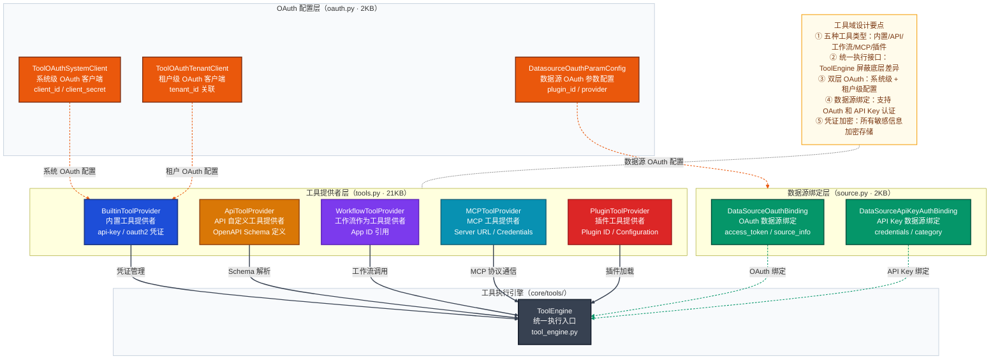
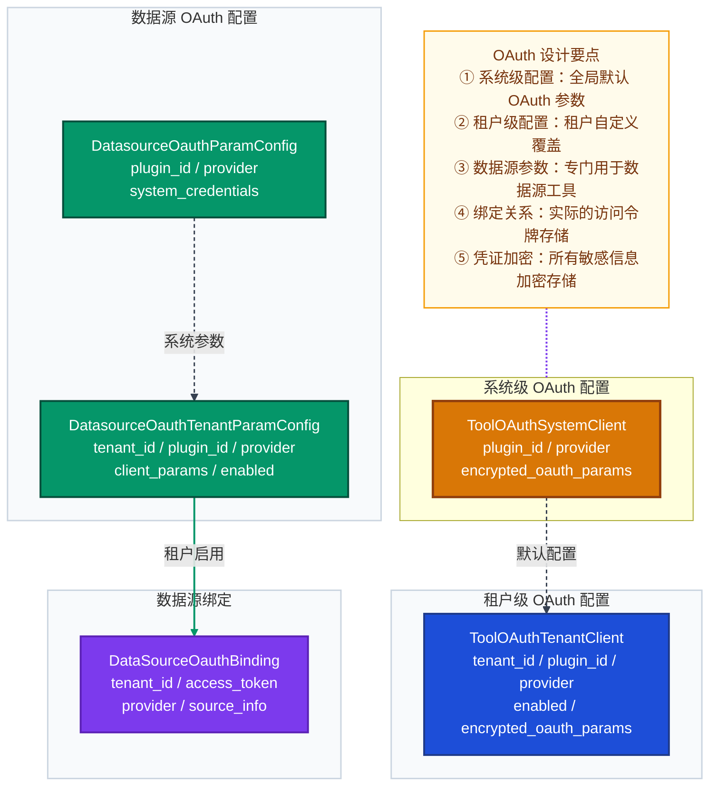
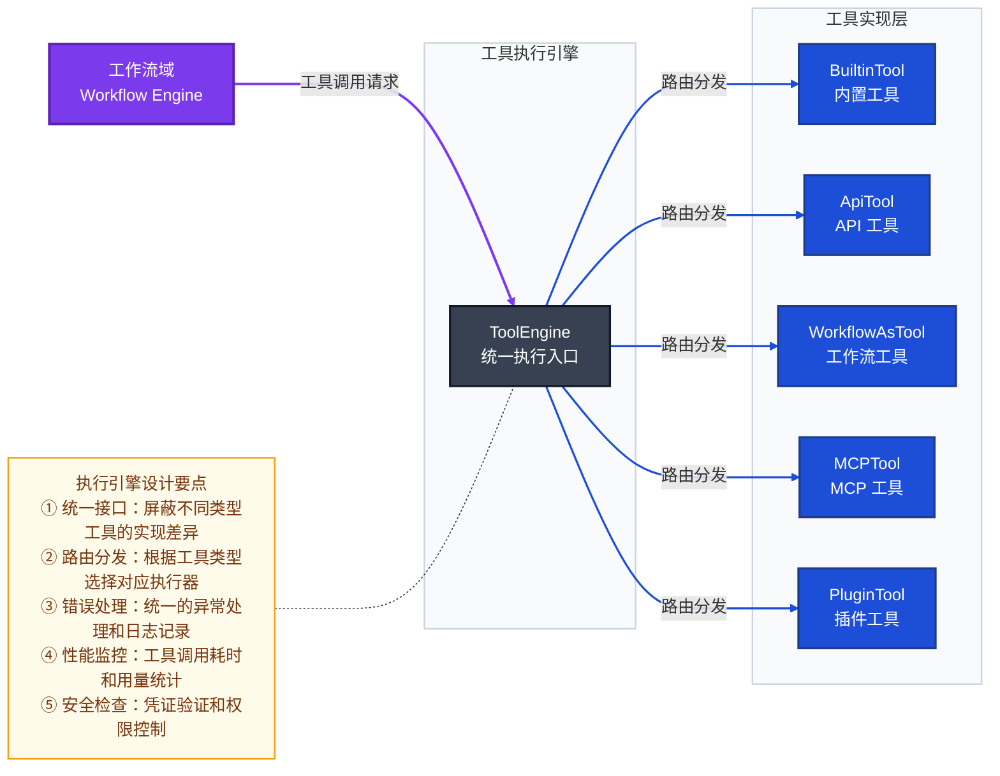

# 工具/插件域深度解析

> 本文档回答三个核心问题：**工具/插件域的职责边界是什么？** **不同类型的工具如何统一管理？** **OAuth 和数据源绑定机制如何工作？**
>
> 工具/插件域作为 Dify 的**支撑域**（Supporting Domain），为工作流域和应用域提供统一的工具执行能力，是系统扩展性的关键基础设施。

---

## 一、工具/插件域概述

### 1.1 域分类与定位

在 Dify 的 DDD 架构中，工具/插件域被明确归类为**支撑域**（Supporting Domain）：

- **核心域**（Core Domain）：应用域、知识库域、工作流域 — 竞争差异化能力
- **支撑域**（Supporting Domain）：账户/租户域、模型供应商域、**工具/插件域** — 核心能力的基础支撑  
- **边缘域**（Generic Domain）：触发器域、异步任务域等 — 通用基础设施

工具/插件域的核心价值在于：
- **能力扩展**：通过统一接口支持多种工具类型，实现系统功能的灵活扩展
- **统一执行**：为工作流域提供标准化的工具调用接口，屏蔽底层实现差异
- **安全隔离**：通过 OAuth 和凭证管理机制，确保第三方工具的安全访问

### 1.2 技术边界

工具/插件域的技术边界体现在三个层面：

```
api/
├── models/                    ← 数据边界
│   ├── tools.py    (21KB)     ← 工具提供者/工具文件定义
│   ├── oauth.py    (2KB)      ← 数据源 OAuth 授权配置
│   └── source.py   (2KB)      ← 数据源绑定关系
│
├── core/                      ← 领域逻辑边界
│   └── tools/                 ← 工具执行层（统一执行引擎）
│       ├── builtin_tool/      ← 内置工具实现
│       ├── custom_tool/       ← 自定义工具实现  
│       ├── mcp_tool/          ← MCP 工具实现
│       ├── plugin_tool/       ← 插件工具实现
│       ├── workflow_as_tool/  ← 工作流作为工具实现
│       └── tool_engine.py     ← 统一执行入口
│
└── services/                  ← 应用服务边界
    └── tool_service.py        ← 跨域协调服务
```

---

## 二、工具/插件域全景架构图



---

## 三、工具类型详解

### 3.1 内置工具（Builtin Tools）

**职责**：提供系统预置的基础工具能力，如时间、代码执行、音频处理、网页抓取等。

| 维度 | 说明 |
|------|------|
| **核心实体** | `BuiltinToolProvider`、内置工具目录结构 |
| **数据主权** | 工具提供者配置、API Key/OAuth2 凭证管理 |
| **技术实现** | `core/tools/builtin_tool/` 目录下的具体工具实现 |
| **认证方式** | 支持 `api-key` 和 `oauth2` 两种凭证类型 |
| **示例工具** | 时间工具、代码执行工具、ASR/TTS 音频工具、网页抓取工具 |

内置工具的目录结构体现了良好的组织性：
```
core/tools/builtin_tool/providers/
├── time/           ← 时间相关工具
│   ├── tools/
│   │   ├── current_time.py
│   │   └── timezone_conversion.py
│   └── time.py     ← 提供者实现
├── code/           ← 代码执行工具
├── audio/          ← 音频处理工具  
└── webscraper/     ← 网页抓取工具
```

### 3.2 API 自定义工具（API Custom Tools）

**职责**：允许用户基于 OpenAPI 规范定义自定义 API 工具，扩展系统能力。

| 维度 | 说明 |
|------|------|
| **核心实体** | `ApiToolProvider` |
| **数据主权** | OpenAPI Schema 定义、工具配置、凭证管理 |
| **技术实现** | 动态解析 OpenAPI Schema，生成工具调用逻辑 |
| **关键字段** | `schema`（原始 Schema）、`tools_str`（工具列表）、`credentials_str`（凭证） |
| **安全机制** | 凭证加密存储，支持隐私政策和自定义免责声明 |

### 3.3 工作流作为工具（Workflow as Tool）

**职责**：将已发布的工作流封装为可复用的工具，实现工作流的组合调用。

| 维度 | 说明 |
|------|------|
| **核心实体** | `WorkflowToolProvider` |
| **数据主权** | 工作流引用（`app_id`）、参数配置、版本管理 |
| **技术实现** | 通过 `app_id` 引用目标工作流，执行时创建新的工作流运行实例 |
| **关键特性** | 支持参数配置、版本控制、隐私政策设置 |
| **使用场景** | 复杂业务逻辑的模块化复用，工作流嵌套调用 |

### 3.4 MCP 工具（Model Context Protocol）

**职责**：集成符合 MCP 协议的外部工具服务，支持实时双向通信。

| 维度 | 说明 |
|------|------|
| **核心实体** | `MCPToolProvider` |
| **数据主权** | MCP 服务器配置、认证凭据、工具列表缓存 |
| **技术实现** | 实现 MCP 客户端协议，支持 SSE 流式通信 |
| **关键配置** | `server_url`、`timeout`、`sse_read_timeout`、`encrypted_headers` |
| **高级特性** | 支持自定义请求头、长连接超时配置、工具动态发现 |

### 3.5 插件工具（Plugin Tools）

**职责**：通过插件机制集成第三方工具，支持动态加载和配置。

| 维度 | 说明 |
|------|------|
| **核心实体** | `PluginToolProvider`（在插件系统中实现） |
| **数据主权** | 插件标识、配置参数、权限控制 |
| **技术实现** | 插件加载机制，动态工具注册 |
| **扩展能力** | 支持热插拔、版本管理、依赖注入 |
| **安全边界** | 沙箱执行环境，权限最小化原则 |

---

## 四、OAuth 与数据源管理

### 4.1 OAuth 配置体系

工具/插件域实现了双层 OAuth 配置体系：



### 4.2 数据源绑定机制

数据源绑定支持两种认证方式：

| 认证类型 | 实体类 | 关键字段 | 使用场景 |
|----------|--------|----------|----------|
| **OAuth 绑定** | `DataSourceOauthBinding` | `access_token`、`source_info` | 需要用户授权的第三方服务（如 Google Drive、Notion） |
| **API Key 绑定** | `DataSourceApiKeyAuthBinding` | `credentials`、`category` | 使用 API Key 认证的服务（如企业内部 API） |

**关键设计特点**：
- **租户隔离**：所有绑定都包含 `tenant_id`，确保多租户数据隔离
- **状态管理**：支持 `disabled` 字段，可以临时禁用数据源绑定
- **信息扩展**：`source_info` 字段存储服务特定的元数据（如文件夹 ID、项目名称等）

---

## 五、工具执行引擎架构

### 5.1 统一执行接口

工具/插件域的核心是 `ToolEngine`，它提供了统一的工具执行接口：



### 5.2 执行流程

工具执行的完整流程包括以下步骤：

1. **工具发现**：根据工具标识（provider + tool_name）定位对应的工具提供者
2. **凭证加载**：从数据库加载加密的凭证信息，解密后用于认证
3. **参数验证**：验证输入参数是否符合工具定义的 schema
4. **执行调用**：调用具体的工具实现，传入参数和上下文
5. **结果处理**：处理工具返回结果，可能包括文件生成、变量设置等
6. **日志记录**：记录工具调用日志，包括用量统计和错误信息

---

## 六、关键设计决策解析

### 6.1 为什么需要统一的工具执行引擎？

统一的 `ToolEngine` 设计解决了以下问题：

- **降低耦合**：工作流域不需要知道具体工具的实现细节，只需要调用统一接口
- **简化扩展**：新增工具类型只需要实现对应的工具类，无需修改工作流引擎
- **统一治理**：可以在统一入口处实现日志、监控、限流、安全等横切关注点
- **保证一致性**：所有工具遵循相同的执行契约，确保行为可预测

### 6.2 双层 OAuth 配置的设计意图

系统级和租户级 OAuth 配置的双层设计实现了：

- **灵活性**：系统管理员可以配置全局默认参数，租户可以覆盖为自定义配置
- **安全性**：敏感的 OAuth 参数（如 client_secret）可以由系统统一管理
- **可维护性**：当第三方服务的 OAuth 配置发生变化时，只需要更新系统级配置
- **多租户支持**：不同租户可以使用不同的 OAuth 应用，实现完全隔离

### 6.3 工具类型多样化的必要性

五种工具类型的设计满足了不同场景的需求：

| 工具类型 | 适用场景 | 优势 |
|----------|----------|------|
| **内置工具** | 基础功能需求 | 开箱即用，无需配置，性能最优 |
| **API 工具** | 自定义 API 集成 | 灵活性高，支持任意 REST API |
| **工作流工具** | 复杂业务逻辑复用 | 可视化编排，支持复杂流程 |
| **MCP 工具** | 实时双向通信场景 | 支持流式响应，低延迟交互 |
| **插件工具** | 第三方生态集成 | 动态扩展，支持丰富插件生态 |

### 6.4 凭证加密存储的重要性

所有敏感凭证（API Key、OAuth 参数、MCP 凭据等）都采用加密存储：

- **安全合规**：符合数据安全和隐私保护的最佳实践
- **防止泄露**：即使数据库被泄露，攻击者也无法直接获取凭证
- **审计追踪**：加密存储配合访问日志，可以追踪凭证使用情况
- **密钥轮换**：支持加密密钥的定期轮换，提高安全性

---

## 七、与其他子域的协作关系

### 7.1 与工作流域的协作

工具/插件域与工作流域的协作关系最为紧密：

- **调用关系**：工作流域通过 `ToolEngine` 调用工具执行
- **数据引用**：`WorkflowToolProvider` 通过 `app_id` 引用工作流应用
- **执行上下文**：工具执行时可以访问工作流的变量和上下文
- **结果反馈**：工具执行结果可以影响工作流的后续节点执行

### 7.2 与账户/租户域的协作

- **租户隔离**：所有工具配置和数据源绑定都包含 `tenant_id`
- **权限控制**：工具的创建、修改、删除操作受租户权限控制
- **用户关联**：工具提供者记录 `user_id`，用于审计和所有权管理

### 7.3 与模型供应商域的协作

- **间接依赖**：某些工具（如代码执行工具）可能需要调用 LLM
- **用量统计**：工具调用 LLM 产生的用量会记录到模型供应商域
- **凭证共享**：部分场景下工具和模型可能共享相同的认证机制

---

## 八、总结

工具/插件域作为 Dify 的支撑域，通过以下设计实现了强大的扩展能力：

1. **统一执行模型**：五种工具类型通过统一的 `ToolEngine` 接口提供服务
2. **灵活的认证体系**：双层 OAuth 配置和多种数据源绑定机制
3. **安全的凭证管理**：所有敏感信息加密存储，支持完善的权限控制
4. **清晰的职责边界**：与工作流域、账户域等其他子域保持松耦合
5. **可扩展的架构**：插件机制支持第三方工具的动态集成

这种设计使得 Dify 能够在保持核心功能稳定性的同时，通过工具/插件域实现无限的功能扩展，满足不同用户的个性化需求。