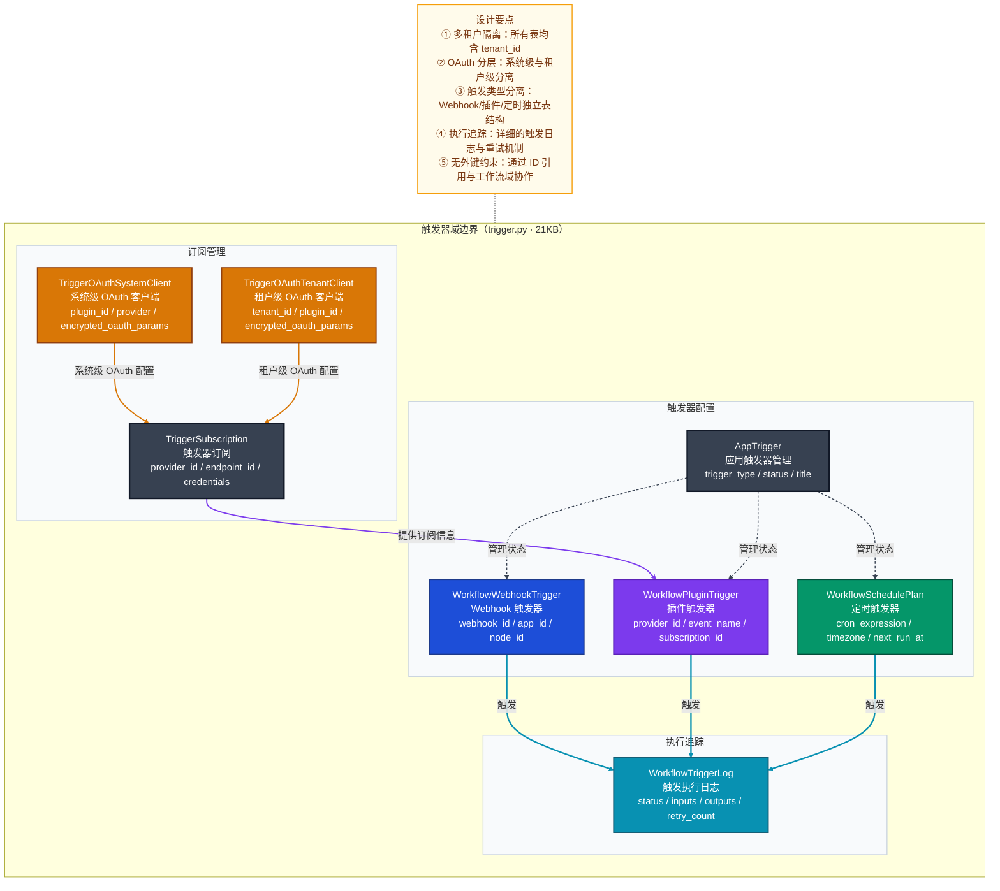
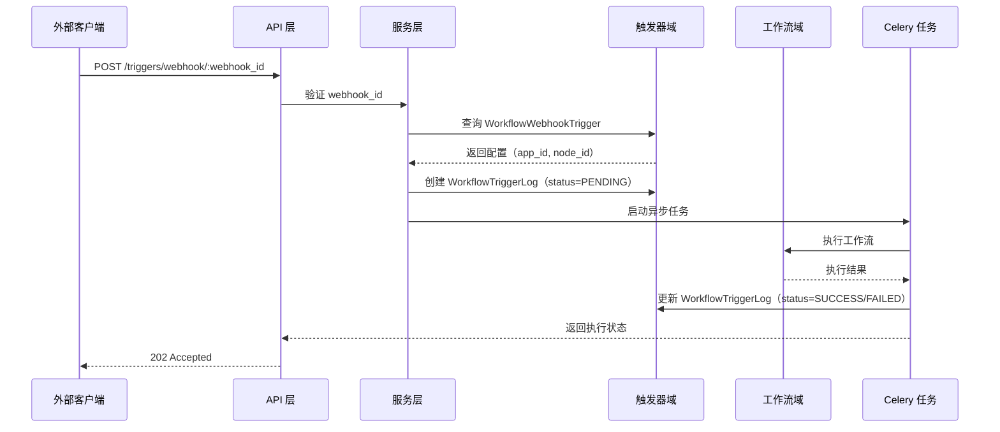
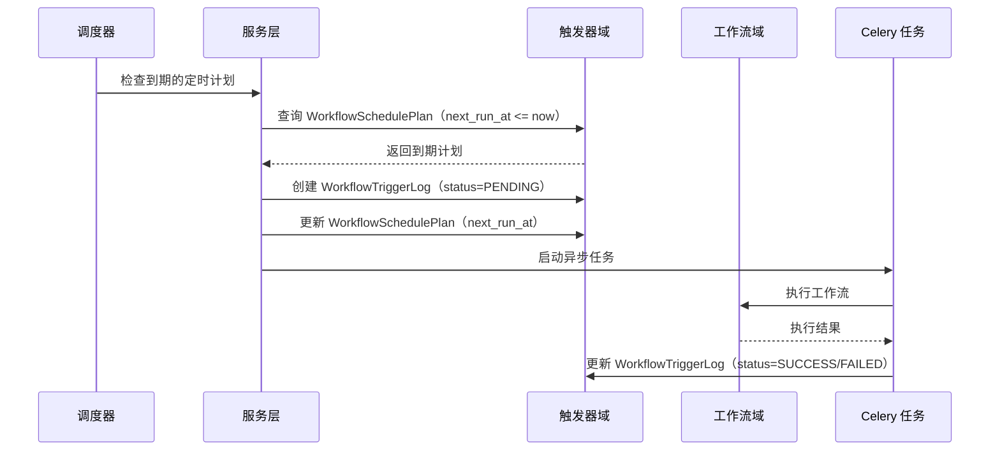
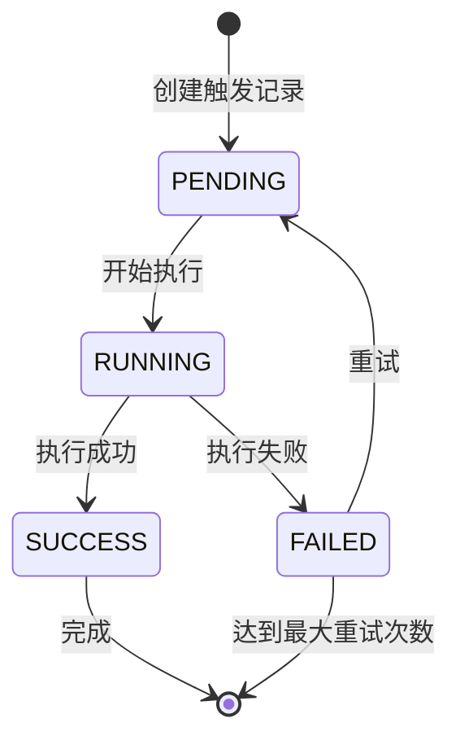
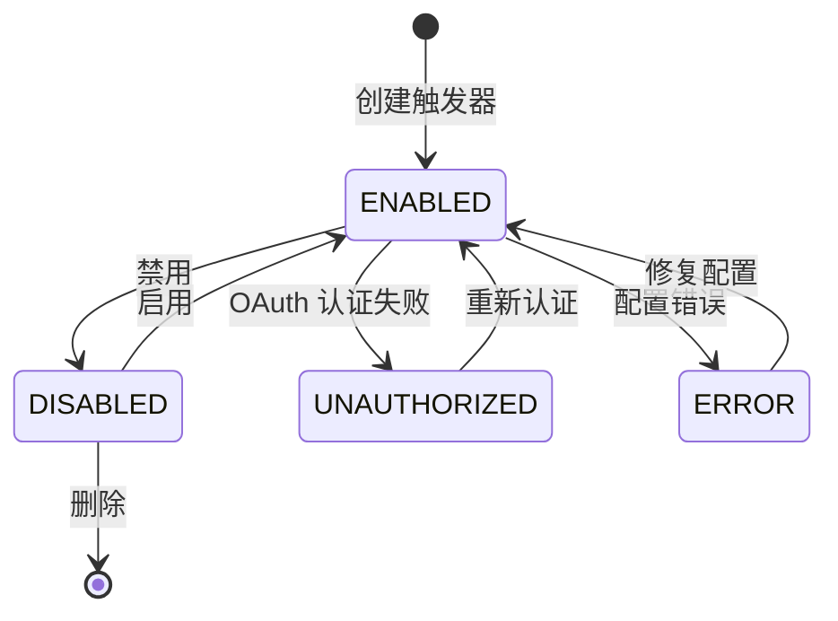

# 触发器域深度分析

> 本文档深入分析 Dify 触发器域的设计意图、数据模型、代码架构和业务流程，重点关注其作为边缘域的职责边界与跨域协作方式。

---

## 一、子域定位

### 1.1 域定位与职责

**触发器域**是 Dify 的**边缘域**（Generic Domain），负责工作流的自动化触发机制，包括：
- **Webhook 触发**：通过 HTTP 回调触发工作流
- **定时触发**：基于 cron 表达式的时间调度
- **插件触发**：订阅外部事件源的通知
- **触发执行追踪**：记录触发历史、状态和结果

### 1.2 数据主权

触发器域独占以下数据的写入权：
- 触发器订阅配置（`trigger_subscriptions`）
- OAuth 客户端参数（系统级和租户级）
- Webhook 配置（`workflow_webhook_triggers`）
- 插件触发器配置（`workflow_plugin_triggers`）
- 定时计划配置（`workflow_schedule_plans`）
- 触发执行日志（`workflow_trigger_logs`）

### 1.3 边界约束

- **代码隔离**：触发器域为纯配置存储型边缘域，无独立的 `core/` 模块
- **跨域协作**：通过 ID 引用与工作流域协作，触发 → 工作流执行
- **可替换性**：高（可替换为第三方触发平台）

---

## 二、数据模型

### 2.1 核心实体关系



### 2.2 核心表分析

| 表名 | 职责 | 关键字段 | 设计意图 |
|------|------|----------|----------|
| `trigger_subscriptions` | 管理触发器订阅和凭据 | `endpoint_id`（唯一索引）、`credentials`（JSON）、`credential_expires_at` | 支持多供应商订阅，OAuth 令牌自动过期检测 |
| `workflow_webhook_triggers` | Webhook 配置 | `webhook_id`（唯一）、`app_id`、`node_id` | 为每个工作流节点生成唯一 Webhook URL |
| `workflow_plugin_triggers` | 插件触发器配置 | `provider_id`、`event_name`、`subscription_id` | 映射外部事件到工作流节点 |
| `workflow_schedule_plans` | 定时触发配置 | `cron_expression`、`timezone`、`next_run_at` | 支持时区感知的灵活调度 |
| `workflow_trigger_logs` | 触发执行日志 | `status`、`inputs`、`outputs`、`retry_count`、`celery_task_id` | 完整的执行追踪与异步任务关联 |
| `app_triggers` | 应用触发器管理 | `trigger_type`、`status`、`title` | 统一管理应用的多种触发器状态 |

### 2.3 关键设计决策

#### 决策 1：OAuth 凭据分层管理

**场景**：触发器需要支持系统级和租户级的 OAuth 配置

**选择方案**：
- `TriggerOAuthSystemClient`：系统级 OAuth 客户端参数
- `TriggerOAuthTenantClient`：租户级 OAuth 客户端参数

**设计理由**：
- 系统级配置提供默认 OAuth 客户端
- 租户级配置允许自定义，满足不同租户的认证需求
- 分离存储提高安全性和可维护性

**代价与权衡**：增加了表结构复杂度，但提供了更灵活的认证管理

#### 决策 2：触发执行状态管理

**场景**：需要追踪触发执行的完整生命周期，包括重试机制

**选择方案**：`WorkflowTriggerLog` 表记录详细执行信息

**设计理由**：
- 完整的状态追踪（包括 `created_at`、`triggered_at`、`finished_at`）
- 支持重试计数和错误记录
- 与 Celery 任务关联，实现异步执行追踪

**代价与权衡**：存储开销增加，但提供了完整的可观测性

### 2.4 跨域引用

| 引用字段 | 目标域 | 说明 |
|---------|--------|------|
| `WorkflowTriggerLog.workflow_id` | 工作流域 | 关联触发的工作流 |
| `WorkflowTriggerLog.app_id` | 应用域 | 关联触发的应用 |
| `WorkflowWebhookTrigger.app_id` | 应用域 | 关联到具体应用 |
| `WorkflowPluginTrigger.app_id` | 应用域 | 关联到具体应用 |
| `WorkflowSchedulePlan.app_id` | 应用域 | 关联到具体应用 |
| `AppTrigger.app_id` | 应用域 | 关联到具体应用 |

---

## 三、业务流程

### 3.1 Webhook 触发流程



### 3.2 定时触发流程



---

## 四、核心实体状态机

### 4.1 触发器执行状态机



**状态说明**：
- `PENDING`：触发记录已创建，等待执行
- `RUNNING`：工作流正在执行中
- `SUCCESS`：执行成功完成
- `FAILED`：执行失败，可重试

### 4.2 应用触发器状态机



**状态说明**：
- `ENABLED`：触发器已启用
- `DISABLED`：触发器已禁用
- `UNAUTHORIZED`：OAuth 认证失败
- `ERROR`：配置错误

---

## 五、跨域协作边界

### 5.1 上游依赖

| 依赖域 | 依赖字段 | 说明 |
|--------|----------|------|
| 账户/租户域 | `tenant_id` | 多租户隔离基础键 |
| 应用域 | `app_id` | 关联到具体应用 |
| 工作流域 | `workflow_id` | 关联到具体工作流 |

### 5.2 下游影响

| 影响域 | 影响方式 | 说明 |
|--------|----------|------|
| 工作流域 | 触发执行 | 通过 `workflow_id` 触发工作流执行 |
| 应用域 | 状态管理 | 通过 `app_id` 管理应用的触发器状态 |

### 5.3 不拥有的能力

- **工作流执行逻辑**：触发器域只负责触发，不负责执行逻辑
- **应用业务逻辑**：触发器域只管理触发配置，不参与应用业务逻辑
- **数据持久化策略**：遵循系统统一的数据持久化策略

---

## 六、技术实现要点

### 6.1 Webhook URL 生成

```python
# 核心实现：生成 Webhook 端点 URL
def generate_webhook_trigger_endpoint(webhook_id: str, debug: bool = False) -> str:
    # 基于 webhook_id 生成唯一 URL
    # 支持调试模式
```

### 6.2 OAuth 凭据管理

- **分层存储**：系统级和租户级 OAuth 配置分离
- **加密存储**：`encrypted_oauth_params` 字段加密存储敏感信息
- **过期检测**：`is_credential_expired()` 方法检测 OAuth 令牌过期

### 6.3 定时调度实现

- **Cron 表达式**：支持标准 cron 表达式
- **时区支持**：`timezone` 字段支持不同时区
- **下次执行时间**：`next_run_at` 字段预计算下次执行时间

### 6.4 异步执行追踪

- **Celery 集成**：通过 `celery_task_id` 关联异步任务
- **详细日志**：记录 `inputs`、`outputs`、`elapsed_time` 等执行信息
- **重试机制**：`retry_count` 字段跟踪重试次数

---

## 七、典型使用场景

### 7.1 Webhook 触发场景

**场景**：外部系统通过 HTTP 请求触发工作流

**配置与依赖**：
- 创建 `WorkflowWebhookTrigger` 记录
- 生成唯一 `webhook_id` 和 URL
- 关联到特定应用和工作流节点

**执行流程**：
1. 外部系统发送 POST 请求到 Webhook URL
2. 系统验证 `webhook_id` 并查询配置
3. 创建 `WorkflowTriggerLog` 记录
4. 异步执行工作流
5. 更新执行状态和结果

### 7.2 定时触发场景

**场景**：按预定时间自动执行工作流

**配置与依赖**：
- 创建 `WorkflowSchedulePlan` 记录
- 设置 cron 表达式和时区
- 关联到特定应用和工作流节点

**执行流程**：
1. 调度器定期检查到期的定时计划
2. 为到期计划创建 `WorkflowTriggerLog` 记录
3. 更新 `next_run_at` 为下次执行时间
4. 异步执行工作流
5. 更新执行状态和结果

---

## 八、总结

### 8.1 设计价值

- **解耦**：触发器域与工作流域解耦，职责清晰
- **可扩展性**：支持多种触发方式（Webhook、定时、插件）
- **可观测性**：详细的执行日志和状态追踪
- **安全性**：OAuth 凭据分层管理和加密存储
- **灵活性**：支持多租户、多时区、多供应商

### 8.2 边界清晰

触发器域作为边缘域，专注于触发机制的管理和执行追踪，通过 ID 引用与工作流域协作，不干预工作流的具体执行逻辑。这种设计使得触发器域可以独立演化，也便于未来替换为第三方触发平台。

### 8.3 技术亮点

- **多类型触发支持**：Webhook、定时、插件三种触发方式
- **完整的状态管理**：从创建到执行完成的全生命周期追踪
- **OAuth 分层设计**：系统级和租户级 OAuth 配置分离
- **时区感知的定时调度**：支持全球不同时区的调度需求
- **异步执行集成**：与 Celery 无缝集成，支持长时间运行的工作流

触发器域虽然是边缘域，但其设计的完整性和灵活性为 Dify 的工作流自动化能力提供了坚实的基础。