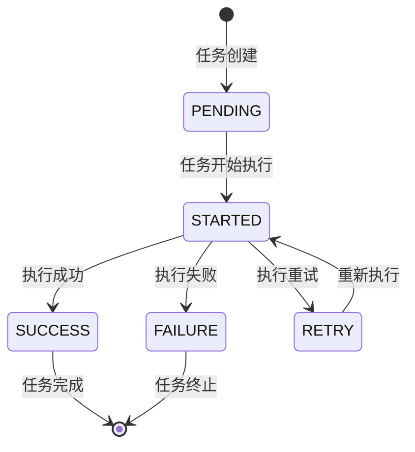
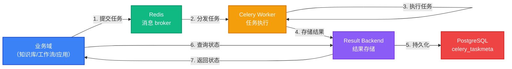

# 异步任务域（Task）深度分析

> 本文档基于 Dify 1.13.0 代码库，深入分析异步任务域的设计意图、数据模型与业务流程。

---

## 一、子域定位

### 1.1 域角色与职责

- **DDD 分类**：边缘域（Generic Domain）— 通用基础设施
- **核心职责**：提供 Celery 任务的持久化存储与状态追踪，支撑长时间运行的异步任务（如文档索引）
- **典型应用**：知识库文档索引、工作流长时间执行、模型调用等耗时操作

### 1.2 数据主权

- **独占写入权**：`celery_taskmeta` 和 `celery_tasksetmeta` 表的写入权，其他域通过 Celery 客户端提交任务，不直接写入
- **数据隔离**：任务数据按 `tenant_id` 逻辑隔离（通过任务参数传递），无数据库级强制隔离

### 1.3 边界约束

- **代码隔离**：无 importlinter 特殊约束，作为通用基础设施被其他域调用
- **协作方式**：通过 Celery 消息队列与其他域通信，结果通过 `task_id` 引用查询

---

## 二、数据模型

### 2.1 表清单

| 表名 | 职责 |
|------|------|
| `celery_taskmeta` | 存储单个 Celery 任务的执行状态与结果 |
| `celery_tasksetmeta` | 存储任务集（TaskSet）的执行结果 |

### 2.2 核心表字段分析

#### CeleryTask（celery_taskmeta）

| 字段 | 类型 | 设计意图 |
|------|------|----------|
| `task_id` | String(155), unique | Celery 任务唯一标识，用于任务状态查询与结果获取 |
| `status` | String(50), default=PENDING | 任务执行状态（PENDING/STARTED/SUCCESS/FAILURE/RETRY），驱动前端状态展示 |
| `result` | BinaryData, nullable | 任务执行结果的序列化存储，支持复杂对象返回 |
| `date_done` | DateTime | 任务完成时间戳，用于监控与统计 |
| `traceback` | LongText, nullable | 任务失败时的堆栈信息，便于问题诊断 |
| `name` | String(155), nullable | 任务名称，对应 Celery 任务函数名，便于分类统计 |
| `args`/`kwargs` | BinaryData, nullable | 任务执行参数的序列化存储，用于任务重试与调试 |
| `worker` | String(155), nullable | 执行任务的 worker 标识，用于负载均衡分析 |
| `retries` | Integer, nullable | 任务重试次数，用于监控任务稳定性 |
| `queue` | String(155), nullable | 任务所属队列，用于任务路由与优先级管理 |

#### CeleryTaskSet（celery_tasksetmeta）

| 字段 | 类型 | 设计意图 |
|------|------|----------|
| `taskset_id` | String(155), unique | 任务集唯一标识，用于追踪一组相关任务的整体状态 |
| `result` | BinaryData, nullable | 任务集执行结果的序列化存储 |
| `date_done` | DateTime | 任务集完成时间戳 |

### 2.3 关键设计决策

#### 决策一：使用标准 Celery 结果表结构

- **场景描述**：选择任务结果存储方案时，需要考虑与 Celery 的兼容性和未来扩展性
- **选择方案**：采用 Celery 标准的 `celery_taskmeta` 和 `celery_tasksetmeta` 表结构
- **设计理由**：
  - 与 Celery 原生结果后端完全兼容，无需自定义适配器
  - 支持 Celery 内置的任务状态管理和结果查询机制
  - 便于未来升级 Celery 版本，减少迁移成本
- **代价与权衡**：
  - 字段设计受限于 Celery 标准，自定义字段需要通过 `result` 字段序列化存储
  - 无法直接在数据库层面添加 `tenant_id` 等业务字段，需要通过任务参数传递

#### 决策二：BinaryData 类型存储序列化数据

- **场景描述**：任务参数和结果可能包含复杂对象，需要高效存储
- **选择方案**：使用 `BinaryData` 类型存储序列化后的 `args`、`kwargs` 和 `result`
- **设计理由**：
  - 支持任意复杂对象的序列化存储，包括嵌套结构和自定义类型
  - 存储空间紧凑，适合存储较大的任务参数和结果
  - 与 Celery 的序列化机制无缝集成
- **代价与权衡**：
  - 数据库层面无法直接查询序列化内容，需要反序列化后处理
  - 序列化/反序列化过程会带来一定的性能开销

### 2.4 跨域引用

- **从其他域引用**：
  - 知识库域：通过 `task_id` 引用文档索引任务状态
  - 工作流域：通过 `task_id` 引用长时间运行的工作流执行任务
  - 应用域：通过 `task_id` 引用模型调用等异步操作
- **向其他域暴露**：
  - 暴露 `task_id` 供其他域查询任务状态和结果
  - 不直接暴露表结构，通过 Celery 客户端 API 访问

---

## 三、代码架构

### 3.1 模块结构

```
api/
├── models/
│   └── task.py         ← 数据模型定义
└── tasks/              ← Celery 任务定义
    ├── dataset.py      ← 知识库相关任务
    ├── workflow.py     ← 工作流相关任务
    └── ...
```

### 3.2 关键组件

- **Celery 配置**：在 `api/configs/celery.py` 中配置任务队列、结果后端等
- **任务装饰器**：使用 `@celery.task()` 装饰器定义异步任务
- **任务状态管理**：通过 Celery 内置的状态管理机制跟踪任务执行状态

### 3.3 扩展点

- **新增任务**：在 `api/tasks/` 目录下创建新的任务模块，使用 `@celery.task()` 装饰器定义
- **任务队列**：可通过 `queue` 参数指定任务所属队列，实现任务分类处理
- **任务优先级**：可通过 `priority` 参数设置任务优先级，影响任务执行顺序

---

## 四、典型业务场景

### 4.1 文档索引任务

**场景描述**：用户上传文档到知识库，系统异步执行文档分段和向量化处理

**执行链路**：
1. **Controller 层**：`dataset_controller.py` 接收文档上传请求
2. **Service 层**：`dataset_service.py` 调用 `create_document()` 创建文档记录，状态设置为 `pending`
3. **Task 层**：调用 `dataset_tasks.process_document.delay()` 提交异步任务
4. **Core 层**：`core/rag/` 模块执行文档分段和向量化
5. **Model 层**：任务执行状态更新到 `celery_taskmeta`，文档状态更新到 `dataset` 表

**异步介入点**：
- 文档上传后立即返回，不阻塞用户操作
- 长时间的文档处理在后台执行
- 任务完成后通过状态回调更新文档索引状态

### 4.2 工作流长时间执行

**场景描述**：工作流包含多个耗时节点（如模型调用、工具执行），需要异步执行

**执行链路**：
1. **Controller 层**：`workflow_controller.py` 接收工作流执行请求
2. **Service 层**：`workflow_service.py` 创建 `WorkflowRun` 记录
3. **Task 层**：调用 `workflow_tasks.execute_workflow.delay()` 提交异步任务
4. **Core 层**：`core/workflow/` 模块执行工作流节点
5. **Model 层**：任务执行状态更新到 `celery_taskmeta`，工作流执行状态更新到 `workflow_run` 表

**异步介入点**：
- 工作流启动后立即返回 `run_id`，不阻塞 API 响应
- 复杂工作流在后台执行，避免 HTTP 请求超时
- 任务完成后通过状态回调更新工作流执行状态

---

## 五、核心实体状态机

### 5.1 Celery 任务状态机



### 5.2 状态转换说明

- **PENDING → STARTED**：Celery worker 开始执行任务，`status` 字段更新为 "STARTED"
- **STARTED → SUCCESS**：任务执行成功，`status` 更新为 "SUCCESS"，`date_done` 记录完成时间，`result` 存储执行结果
- **STARTED → FAILURE**：任务执行失败，`status` 更新为 "FAILURE"，`date_done` 记录完成时间，`traceback` 存储错误信息
- **STARTED → RETRY**：任务执行失败但配置了重试，`status` 更新为 "RETRY"，`retries` 计数增加
- **RETRY → STARTED**：重试机制触发，任务重新开始执行

---

## 六、跨域协作边界

### 6.1 上游依赖

- **账户/租户域**：通过任务参数传递 `tenant_id`，实现逻辑隔离
- **知识库域**：提交文档索引任务，查询任务执行状态
- **工作流域**：提交工作流执行任务，查询任务执行状态
- **应用域**：提交模型调用等异步任务，查询任务执行状态

### 6.2 下游服务

- **向所有域暴露**：任务状态查询接口，通过 `task_id` 获取任务执行状态和结果
- **不直接暴露**：任务执行逻辑和内部实现细节

### 6.3 边界清晰化

- **拥有**：任务状态的持久化存储、任务执行的状态管理
- **不拥有**：具体的业务逻辑实现（由调用域负责）、任务队列的配置管理（由基础设施负责）

---

## 七、运行时调度链路

### 7.1 任务提交与执行链路



### 7.2 调度层次说明

1. **任务提交**：业务域通过 `task.delay()` 或 `task.apply_async()` 提交任务
2. **消息分发**：Redis broker 接收任务消息并分发给可用的 worker
3. **任务执行**：Celery worker 执行任务逻辑，更新任务状态
4. **结果存储**：任务执行结果存储到 result backend
5. **结果持久化**：result backend 将结果持久化到 `celery_taskmeta` 表
6. **状态查询**：业务域通过 `AsyncResult(task_id)` 查询任务状态和结果

### 7.3 故障处理

- **任务重试**：通过 `autoretry_for` 和 `retry_kwargs` 配置自动重试机制
- **任务超时**：通过 `soft_time_limit` 和 `time_limit` 配置任务执行超时
- **失败处理**：任务失败后状态更新为 "FAILURE"，并存储错误信息到 `traceback` 字段

---

## 八、设计要点与最佳实践

### 8.1 设计要点

1. **标准兼容**：采用 Celery 标准结果表结构，确保与 Celery 生态系统的兼容性
2. **状态驱动**：通过任务状态机驱动业务流程，实现异步操作的可靠跟踪
3. **松耦合**：通过消息队列与业务域松耦合，提高系统的可扩展性和可靠性
4. **可观测性**：详细的任务状态和日志记录，便于问题诊断和性能分析

### 8.2 最佳实践

1. **任务粒度**：将大型任务拆分为多个小任务，提高并行度和容错性
2. **任务参数**：避免传递过大的参数，减少消息队列负担
3. **结果处理**：及时清理不需要的任务结果，避免数据库膨胀
4. **监控告警**：对任务执行状态和耗时进行监控，设置合理的告警阈值

### 8.3 性能优化

1. **队列配置**：根据任务类型和优先级配置不同的队列
2. **Worker 扩展**：根据任务负载动态调整 worker 数量
3. **结果存储**：考虑使用 Redis 作为结果后端，提高查询性能
4. **任务调度**：使用任务优先级和 ETA 机制优化任务执行顺序

---

## 九、总结

异步任务域作为 Dify 的通用基础设施，提供了可靠的任务队列和状态管理能力，支撑了系统中各种长时间运行的操作。通过标准的 Celery 集成和清晰的状态管理，实现了业务逻辑与异步执行的解耦，提高了系统的响应速度和可靠性。

虽然作为边缘域，异步任务域的代码量较小（仅 2KB），但其在系统中的作用至关重要，是实现高性能、高可靠性系统的关键组件。通过合理的任务设计和监控，可以充分发挥异步任务域的能力，为用户提供更好的使用体验。