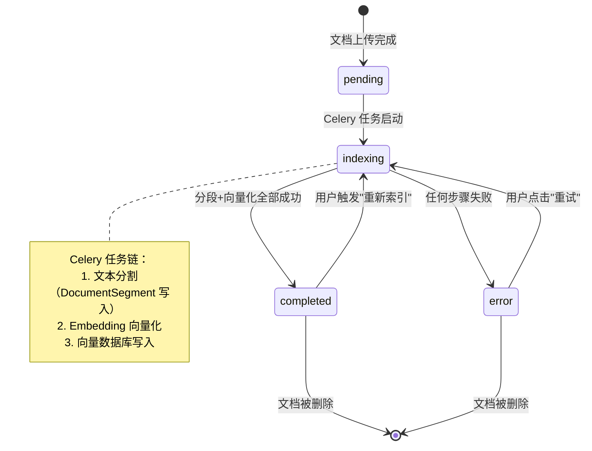
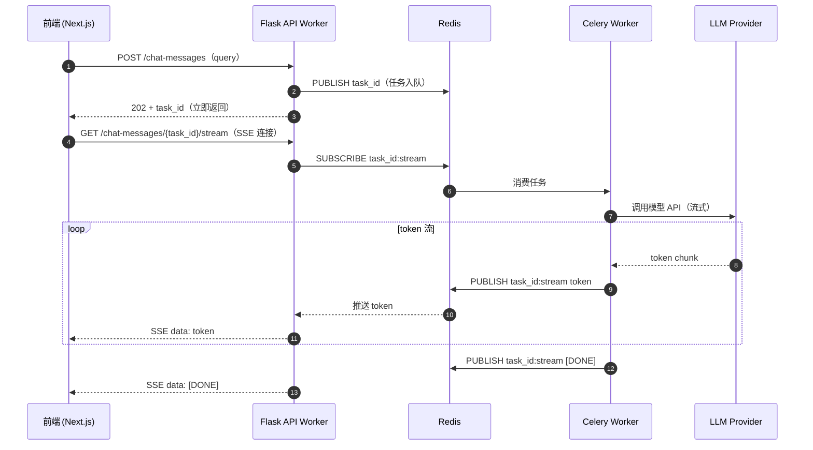

# Dify 项目深度分析参考规范

> **文档定位**：本文档是分析 Dify 项目的**方法论总纲**，定义分析框架、图表规范、文档清单与进度。所有子文档的编写均以此为依据。
>
> **核心问题**：深入理解一个工程项目，需要回答五类问题——**为什么这样设计（WHY）、系统是什么（WHAT）、如何运行（HOW）、有哪些约束（CONSTRAINTS）、如何演化（GROWTH）**。

---

## 一、分析框架总览（五阶段）

```
阶段 1：问题域认知（WHY）
    回答：这个系统解决什么问题？业务边界如何划分？设计意图是什么？
    ✅ 产品定位与核心价值主张（Dify 是什么）
    ✅ DDD 子域划分与战略设计

阶段 2：系统结构（WHAT）
    回答：系统由哪些组件构成？代码如何组织？数据如何持久化？
    ✅ 系统架构图（组件部署关系）
    ✅ 数据模型关系图（持久化结构）
    ✅ 类层级关系图（代码对象设计）

阶段 3：动态行为（HOW）
    回答：一个请求如何在系统中流转？状态如何转换？异步任务如何执行？
    ✅ 端到端流程图（同步主路径）
    ✅ 状态机图（系统内部状态转换）
    ✅ 时序图（异步/跨进程交互）

阶段 4：横切关注点（CONSTRAINTS）
    回答：多租户如何隔离？错误如何传播？可观测性如何实现？
    ✅ 多租户隔离的实现机制
    ✅ 错误体系与异常传播
    ✅ 可观测性集成点

阶段 5：演化与扩展（GROWTH）
    回答：如何新增功能？如何不破坏兼容性？边界约束如何保障？
    ✅ 扩展点地图（如何新增节点/供应商/工具）
    ✅ 数据库迁移策略（Alembic 版本管理）
    ✅ 向后兼容性约束
```

---

## 二、图表类型规范（六种）

> 详细作图规范已迁入 `.trae/skills/mermaid-analysis-visualizer`，优先通过该 skill 调用对应的 Mermaid references，而不是继续依赖旧版文件名。

### 六种图表速查

| # | 图表类型 | Mermaid 语法 | 方向 | 回答的核心问题 | 节点代表 |
|---|---------|-------------|------|--------------|---------|
| ① | **系统架构图** | `flowchart TB` | 从上到下 | 系统由哪些组件构成？如何部署和连接？ | 服务 / 组件 |
| ② | **端到端流程图** | `flowchart LR` | 从左到右 | 一个请求如何在系统中流转？ | 处理步骤 |
| ③ | **数据模型关系图** | `flowchart TB` | 从上到下 | 数据如何组织？表与表如何关联？ | 数据库表（含核心字段） |
| ④ | **类层级关系图** | `flowchart TB` | 从上到下 | 代码如何组织？抽象层次和设计模式是什么？ | 类 / 接口 / 抽象基类 |
| ⑤ | **状态机图** | `stateDiagram-v2` | — | 对象生命周期内状态如何转换？触发条件是什么？ | 状态 / 转换事件 |
| ⑥ | **时序图** | `sequenceDiagram` | — | 跨组件/进程的异步交互如何发生？消息顺序是什么？ | 参与者 / 消息 |

### 六图的架构关系

```
系统架构图（全局骨架）
    ├── 端到端流程图      ← 骨架上的同步业务路径
    ├── 时序图            ← 骨架上的异步/跨进程交互
    ├── 数据模型关系图    ← 某个域的持久化结构
    ├── 类层级关系图      ← 某个模块的代码对象设计
    └── 状态机图          ← 某个聚合根的生命周期
```

### 各图的选用判断

```
需要理解"系统长什么样"         → 系统架构图
需要理解"请求怎么走"（同步）   → 端到端流程图
需要理解"消息怎么传"（异步）   → 时序图
需要理解"数据怎么存"           → 数据模型关系图
需要理解"代码怎么组织"         → 类层级关系图
需要理解"状态怎么变"           → 状态机图
```

---

## 三、Dify 特有的分析视角

Dify 不是普通的 CRUD Web 应用，以下七个视角是理解其设计意图的关键切入点。每个视角对应一个"如果不从这个角度看，就会误解系统行为"的盲区。

---

### 视角 1：架构边界视角 — "边界是写在代码里的"

> **核心洞察**：Dify 的模块隔离不只是团队约定，而是通过 `importlinter` 在 CI 层面强制执行，违反边界会直接导致构建失败。

- `api/.importlinter` 定义了 70+ 条依赖约束，是架构意图的最权威来源
- `core.workflow` 隔离最强：禁止依赖 `models / services / controllers` 任何一层
- `core.model_runtime` 向上完全封闭：禁止依赖上层任何模块
- 跨域数据引用只允许通过 ID 传递（无数据库外键约束），`tenant_id` 是第一级隔离键

**分析建议**：阅读 `.importlinter` 文件本身，比读任何架构文档都直接——违规例外条目揭示了历史妥协点。

---

### 视角 2：双轨版本视角 — "同一张表里同时住着草稿和快照"

> **核心洞察**：Dify 用"同表多行"而非"多版本表"实现 draft/published 双轨，理解这个设计是读懂所有版本管理代码的前提。

- `Workflow` 表中 `version='draft'` 行唯一，`version=str(datetime)` 行为发布快照（可多条）
- `WorkflowRun` 内嵌完整 `graph` JSON 快照，历史执行结果永远可重现，不受后续编辑影响
- `Conversation.app_model_config_id` 快照保证历史对话的语义与当前配置解耦
- 详见：`Dify Agent&Workflow 版本管理机制深度解析.md`

**分析建议**：查询 `Workflow` 表时，永远先问"这条记录是草稿还是快照"，这是避免逻辑误判的第一步。

---

### 视角 3：状态机视角 — "系统行为藏在状态转换里"【高优先，目前最缺】

> **核心洞察**：Dify 存在多个并发运行的显式状态机，是理解系统异步行为的关键。但流程图只能描述"同步主路径"，状态跳转逻辑在图里是隐形的。

| 状态机 | 聚合根 | 关键状态路径 |
|--------|--------|------------|
| 文档索引状态机 | `Document` (`dataset.py`) | `pending → indexing → completed / error` |
| 工作流执行状态机 | `WorkflowRun` (`workflow.py`) | `running → succeeded / failed / stopped` |
| 节点执行状态机 | `WorkflowNodeExecution` | `running → succeeded / failed / retry` |
| 工作流暂停状态机 | `WorkflowPause` | `paused → resumed / timeout` |
| 对话生命周期 | `Conversation` | `normal / pinned / deleted` |

**分析建议**：为核心状态机单独绘制 `stateDiagram-v2`（Mermaid 原生支持），重点覆盖文档索引和工作流执行这两条最复杂的状态链。

---

### 视角 4：异步并发架构视角 — "你看到的 API 只是冰山一角"【高优先，Dify 核心特色】

> **核心洞察**：Dify 大量使用异步机制，同步 API 调用和 Celery 异步任务是两套并行路径，用流程图只能描述其中一条，另一条几乎不可见。

- **Celery + Redis 任务队列**：文档索引、批量处理走异步路径，与 HTTP 请求完全解耦
- **SSE 流式响应链路**：`model_runtime` → Celery worker → Redis pub/sub → Flask SSE → 前端，这是 Dify 运行时最复杂的数据流
- **事件驱动内核**：`core/workflow/graph_engine/` 内部有 command channel 和 event 机制，纯从类层级图看不出

**分析建议**：用 `sequenceDiagram` 时序图专门描述两条异步链路：
1. 文档上传 → Celery 索引任务 → 向量写入
2. 用户发起对话 → SSE 流式 token 返回

---

### 视角 5：扩展点与插件视角 — "理解注册机制，才能真正贡献代码"【中优先】

> **核心洞察**：Dify 是高度可扩展的平台，类层级图能看到继承树，但看不到"如何让系统自动发现你的新实现"——这是扩展点机制的关键。

- **工作流节点**：`__init_subclass__` 自动注册到 `NODE_TYPE_CLASSES_MAPPING`，新增节点无需修改注册表
- **模型供应商**：YAML manifest 配置驱动注册（`core/model_runtime/model_providers/`），代码与声明分离
- **工具插件**：声明式 manifest 注册（`core/tools/`），支持本地和远程两种形态
- `.importlinter` 中 70+ 条例外条目说明插件边界并非完全封闭，是历史演化的痕迹

**分析建议**：建立"扩展点地图"，回答三个具体问题：如何新增工作流节点、如何接入新模型供应商、如何开发新工具插件——这是架构理解转化为实际开发能力的关键一步。

---

### 视角 6：横切关注点视角 — "这些机制穿透所有子域，却没有自己的'家'"【中优先】

> **核心洞察**：以下机制横切所有业务域，不属于任何单一子域，因此在按域组织的文档中很容易被忽略，但它们是系统安全性和可靠性的基础。

| 横切关注点 | 关键位置 | 分析价值 |
|-----------|---------|---------|
| **多租户隔离的实现细节** | `tenant_id` 在 SQLAlchemy 查询层的强制注入方式 | 安全性基础，决定数据是否可能越界 |
| **凭据加密机制** | `provider.py` 中的加密字段与密钥管理 | 模型供应商域的核心约束 |
| **错误体系与异常层级** | `core/` 各子域的 `exception.py` 定义 | 理解错误如何从底层传播到 API 响应 |
| **可观测性集成点** | OpenTelemetry + Sentry 的埋点位置 | 已有相关文档，需纳入统一分析框架 |

**分析建议**：以"一个请求出错时，错误如何从 `model_runtime` 传播到用户侧"为主线，串联以上四个关注点。

---

### 视角 7：前后端契约视角 — "SSE 协议不是细节，是设计决策"【选配】

> **核心洞察**：Dify 的前后端之间不只是简单的 REST 调用，SSE 流式接口的协议设计直接影响了整个异步架构的形态。如果只关注后端，可跳过。

- REST API 的版本策略（`/api/v1/`）与向后兼容性约束
- SSE 流式接口的协议设计（事件类型、错误处理、断线重连）
- 前端通过 oRPC 模式消费接口的契约规范

**分析建议**：如目标是全栈理解，此视角不可省略；如只关注后端架构，了解 SSE 接口的数据格式即可，无需深入前端实现。

---

## 四、文档清单与进度

### 第 1 组：框架与规范（Foundation）

| 文档 | 内容 | 状态 |
|------|------|------|
| `1.1Dify架构分析文档_sonnet4.6.md` | 系统整体架构分析（组件、层级、技术选型） | ✅ 已完成 |
| `1.2DDD 子域划分.md` | DDD 战略设计：子域分类、边界依据、importlinter 约束 | ✅ 已完成 |
| `.trae/skills/mermaid-analysis-visualizer` | 六种图表的规范定义、配色、最佳实践 | ✅ 已迁入 skill |
| `1.3子域分析提示词.md` | 各子域分析的标准化提示词模板 | ✅ 已完成 |
| `notes.md`（本文档） | 方法论总纲、分析框架、进度追踪 | ✅ 持续维护 |

### 第 2 组：数据模型深度解析（Data Model — 静态结构）

> 分析维度：表清单、聚合根关系、跨域引用、状态字段、关键设计决策

| 文档 | 覆盖域 | 对应 models/ 文件 | 状态 |
|------|--------|-----------------|------|
| `2.1App域数据模型深度解析.md` | 应用域（App & Config） | `model.py`（94KB） | ✅ 已完成 |
| `2.2RAG知识库域数据模型深度解析.md` | 知识库域（Knowledge/RAG） | `dataset.py`（68KB） | ✅ 已完成 |
| `2.3工作流域数据模型深度解析.md` | 工作流域（Workflow & Execution） | `workflow.py`（73KB） | ✅ 已完成 |
| `2.4账户租户域数据模型深度解析.md` | 账户/租户域（Account & Tenant） | `account.py`（16KB） | ✅ 已完成 |
| `2.5模型供应商域数据模型深度解析.md` | 模型供应商域（Model Provider） | `provider.py`（15KB） | ✅ 已完成 |
| `2.6工具域数据模型深度解析.md` | 工具/插件域（Tool & Plugin） | `tools.py`（21KB） | ✅ 已完成 |
| `2.7边缘域数据模型深度解析.md` | 边缘域（触发器/任务/人工输入等） | `trigger.py` 等 | ✅ 已完成 |

### 第 3 组：动态行为分析（Dynamic Behavior — 待补充）

> 分析维度：触发源、处理步骤、状态转换、跨进程消息、异步链路

| 文档（待创建） | 内容 | 图表类型 | 优先级 |
|--------------|------|---------|--------|
| `3.1文档索引异步链路.md` | 文档上传 → Celery 索引 → 向量写入的完整异步路径 | 时序图 | 🔴 高 |
| `3.2对话SSE流式响应链路.md` | 用户发起对话 → LLM 推理 → SSE 流式返回 | 时序图 | 🔴 高 |
| `3.3工作流执行状态机.md` | WorkflowRun + WorkflowNodeExecution 的状态转换 | 状态机图 | 🔴 高 |
| `3.4文档索引状态机.md` | Document 索引状态转换（含错误重试机制） | 状态机图 | 🟡 中 |
| `3.5工作流图引擎端到端流程.md` | 工作流节点调度、事件传播、暂停/恢复机制 | 流程图 + 时序图 | 🟡 中 |

### 第 4 组：横切关注点（Cross-Cutting — 部分已有）

| 文档 | 内容 | 状态 |
|------|------|------|
| `OpenTelemetry_Sentry_完整协作指南.md` | 可观测性：追踪、错误监控、指标 | ✅ 已完成 |
| `Dify应用管理与发布机制完整解析.md` | 发布机制、版本切换、配置快照 | ✅ 已完成 |
| `4.1多租户隔离实现机制.md`（待创建） | `tenant_id` 在 SQLAlchemy 查询层的强制注入、安全边界 | ❌ 待创建 |
| `4.2凭据加密与密钥管理.md`（待创建） | 模型供应商凭据加密存储机制 | ❌ 待创建 |

### 第 5 组：演化与扩展（Extension & Growth — 部分已有）

| 文档 | 内容 | 状态 |
|------|------|------|
| `Dify Agent&Workflow 版本管理机制深度解析.md` | draft/published 双轨版本管理、执行快照不可变设计 | ✅ 已完成 |
| `Dify后端架构实战指南：core目录深度解析与新功能开发指导.md` | core/ 目录结构、新功能开发规范 | ✅ 已完成 |
| `5.1扩展点地图.md`（待创建） | 如何新增工作流节点 / 模型供应商 / 工具的完整步骤 | ❌ 待创建 |

### 参考与对比

| 文档 | 内容 | 状态 |
|------|------|------|
| `AgentScope vs Dify 深度对比分析.md` | 与竞品的架构对比分析 | ✅ 已完成 |

---

## 五、各阶段分析覆盖度评估

```
阶段 1：问题域认知（WHY）                          完成度：█████████░  90%
    ✅ 产品定位与核心价值（1.1）
    ✅ DDD 子域划分与战略设计（1.2）
    ✅ 竞品对比（AgentScope vs Dify）

阶段 2：系统结构（WHAT）                           完成度：████████░░  80%
    ✅ 系统架构图（1.1）
    ✅ 全部子域数据模型（2.1 ~ 2.7）
    ✅ 类层级关系图（各数据模型文档中含部分）
    ❌ core/ 层类层级图（扩展至全部核心模块）

阶段 3：动态行为（HOW）                            完成度：████░░░░░░  40%
    ✅ 端到端流程图（各文档中含关键路径）
    ✅ 版本管理机制流程（Agent&Workflow文档）
    ❌ 状态机图（文档索引、工作流执行）
    ❌ 时序图（SSE 流式响应、异步索引链路）

阶段 4：横切关注点（CONSTRAINTS）                  完成度：████████░░  75%
    ✅ 可观测性（OpenTelemetry + Sentry）
    ✅ 发布机制与配置快照
    ✅ importlinter 边界约束（1.2 DDD 文档）
    ❌ 多租户隔离的实现细节（SQLAlchemy 层）
    ❌ 凭据加密机制

阶段 5：演化与扩展（GROWTH）                       完成度：██████░░░░  60%
    ✅ 版本管理机制（Agent&Workflow）
    ✅ core/ 新功能开发指导（实战指南）
    ❌ 扩展点地图（新增节点/供应商/工具的完整步骤）
    ❌ 数据库迁移策略（Alembic 版本管理）
```

---

## 六、下一步建议（优先级排序）

### 高优先（解锁动态行为理解）

1. **`3.3工作流执行状态机.md`**：用 `stateDiagram-v2` 描述 `WorkflowRun` 和 `WorkflowNodeExecution` 的状态转换，这是理解 Dify 工作流引擎核心逻辑的关键
2. **`3.2对话SSE流式响应链路.md`**：用 `sequenceDiagram` 描述用户发起对话到收到流式 token 的完整跨进程路径，是 Dify 最有特色的运行时路径

### 中优先（补充完整度）

3. **`3.1文档索引异步链路.md`**：用时序图展示文档上传到向量入库的完整 Celery 异步链路
4. **`5.1扩展点地图.md`**：回答"如何在不破坏边界的前提下新增一种工作流节点"，这是把架构理解转化为开发能力的关键文档

### 低优先（补充边界与安全知识）

5. **`4.1多租户隔离实现机制.md`**：从 `account.py` 和 SQLAlchemy 查询层分析 `tenant_id` 的强制注入机制
6. **`4.2凭据加密与密钥管理.md`**：分析模型供应商凭据的加密存储设计

---

## 七、子域分析标准模板

对每个子域进行深度分析时，按以下维度展开：

```markdown
# {域名}深度解析

## 一、域总览
- 表清单（表名 / Python 类名 / 一句话职责）
- 子域类型（核心域 / 支撑域 / 边缘域）

## 二、数据模型关系图
（flowchart TB，展示表关系与外键引用）

## 三、核心实体逐表解析
- 聚合根（字段逐一分析，重点说明跨域引用和状态字段）
- 从属实体（与聚合根的关联方式）

## 四、关键业务流程
（flowchart LR，描述该域内的核心操作路径）

## 五、状态机（如有）
（stateDiagram-v2，描述核心实体的生命周期状态转换）

## 六、跨域交互
- 该域依赖哪些域（通过什么 ID 引用）
- 哪些域依赖该域（反向引用关系）

## 七、关键设计决策
- 为什么这样设计（设计意图）
- 重要的 trade-off（取舍点）
```

---

## 八、状态机图规范补充

> ✅ 已并入 `.trae/skills/mermaid-analysis-visualizer/references`

### 适用场景

描述聚合根或核心实体的**生命周期状态转换**：何时进入某个状态、触发条件是什么、哪些转换是不可逆的。

### 参考原图（Dify 文档索引状态机）



### 作图规范

| 要素 | 规范 |
|------|------|
| **初始/终止** | 用 `[*]` 标记初始状态和终止状态 |
| **状态命名** | 使用实际代码中的枚举值（如 `pending`、`indexing`），与代码保持一致 |
| **转换标签** | 箭头标签说明触发事件或条件，用中文描述业务语义 |
| **注记** | 用 `note` 块补充该状态下的关键技术实现 |
| **不可逆转换** | 在转换标签后加 `（不可逆）` 标注 |

---

## 九、时序图规范补充

> ✅ 已并入 `.trae/skills/mermaid-analysis-visualizer/references`

### 适用场景

描述**跨组件/跨进程的异步交互**：谁发消息给谁、同步还是异步、有没有回调。特别适用于 Celery 任务链、SSE 流式响应、Redis 发布订阅等场景。

### 参考原图（Dify SSE 对话响应简要时序）



### 作图规范

| 要素 | 规范 |
|------|------|
| **参与者命名** | 格式 `participant 英文ID as 中文名（技术标识）`，兼顾可读性与精确性 |
| **同步调用** | 用 `->>` 实线箭头 |
| **异步消息/回调** | 用 `-->>` 虚线箭头 |
| **循环/条件** | 用 `loop`、`alt`、`opt` 块 |
| **序号** | 开启 `autonumber`，便于文字描述时引用步骤 |
| **注记** | 在关键步骤后用 `Note over A,B: 说明` 标注性能指标或设计约束 |
