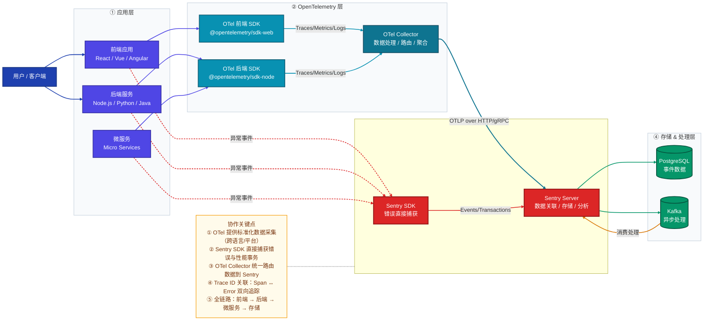
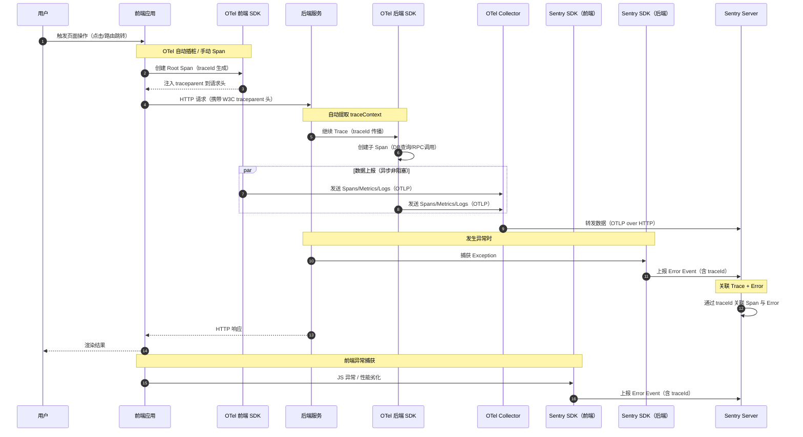

# OpenTelemetry + Sentry 完整协作指南

> 从应用代码到可观测性平台的完整数据流转、集成方案与项目实践

---

## 目录

1. [核心概念](#1-核心概念)
2. [整体架构图](#2-整体架构图)
   - [2.1 系统架构总览（静态结构视图）](#21-系统架构总览静态结构视图)
   - [2.2 端到端数据流程图（动态流程视图）](#22-端到端数据流程图动态流程视图)
3. [详细数据流](#3-详细数据流)
4. [集成模式](#4-集成模式)
5. [前端集成实现](#5-前端集成实现)
6. [后端集成实现](#6-后端集成实现)
7. [OpenTelemetry Collector 配置](#7-opentelemetry-collector-配置)
8. [Sentry 配置与关联](#8-sentry-配置与关联)
9. [项目应用实践](#9-项目应用实践)
10. [最佳实践与注意事项](#10-最佳实践与注意事项)

---

## 1. 核心概念

### OpenTelemetry（OTel）是什么？

OpenTelemetry 是一个 **开源的可观测性框架**，提供标准化的 API、SDK 和工具，用于采集：

| 信号类型 | 描述 | 典型用途 |
|---------|------|---------|
| **Traces（链路追踪）** | 跨服务的请求调用链 | 定位跨服务延迟、调用路径分析 |
| **Metrics（指标）** | 数值型时序数据 | CPU、内存、QPS、错误率监控 |
| **Logs（日志）** | 带上下文的结构化日志 | 事件记录、调试信息 |

### Sentry 是什么？

Sentry 是一个 **应用监控与错误追踪平台**，核心能力：

- **错误监控**：自动捕获异常、堆栈追踪、错误聚合
- **性能监控**：事务追踪、慢查询、前端性能指标
- **告警通知**：Slack/Email/PagerDuty 等渠道的智能告警
- **根因分析**：面包屑（Breadcrumbs）、关联 Release/Commit

### 为什么要搭配使用？

```
OpenTelemetry       →   "采什么、怎么采、格式是什么"（标准化采集）
Sentry              →   "出了什么问题、为什么出问题"（深度分析）
```

两者互补：OTel 解决数据采集的**标准化和可移植性**，Sentry 解决**错误定位和告警响应**。

---

## 2. 整体架构图

### 2.1 系统架构总览（静态结构视图）

> 回答：系统由哪些组件构成？各层职责是什么？数据如何在组件间流转？（`TB` 分层纵向视图）



### 2.2 端到端数据流程图（动态流程视图）

> 回答：一次用户操作从触发到根因定位，数据经过了哪些处理阶段？（`LR` 线性时序视图）

```mermaid
flowchart LR
    %% ── 配色定义：按职责分色 ──────────────────────────────
    classDef userStyle   fill:#1e40af,stroke:#1e3a8a,stroke-width:2.5px,color:#fff
    classDef appStyle    fill:#4f46e5,stroke:#3730a3,stroke-width:2px,color:#fff
    classDef otelStyle   fill:#0891b2,stroke:#155e75,stroke-width:2px,color:#fff
    classDef sentryStyle fill:#dc2626,stroke:#991b1b,stroke-width:2.5px,color:#fff
    classDef noteStyle   fill:#fffbeb,stroke:#f59e0b,stroke-width:1.5px,color:#78350f
    classDef layerStyle  fill:#f8fafc,stroke:#cbd5e0,stroke-width:1.5px

    %% ── 起始节点 ──────────────────────────────────────────
    A["用户操作<br>User Operation"]:::userStyle

    %% ── ① 应用层 ─────────────────────────────────────────
    subgraph Application["① 应用层"]
        direction LR
        B["前端应用<br>Frontend App"]:::appStyle
        C["后端服务<br>Backend Service"]:::appStyle
    end
    class Application layerStyle

    %% ── ② OpenTelemetry 采集层 ───────────────────────────
    subgraph OpenTelemetry["② OpenTelemetry 采集层"]
        direction LR
        D["OTel 前端 SDK<br>Frontend SDK"]:::otelStyle
        E["OTel 后端 SDK<br>Backend SDK"]:::otelStyle
        F["前端数据采集<br>Traces / Logs / Metrics"]:::otelStyle
        G["后端数据采集<br>Traces / Logs / Metrics"]:::otelStyle
        H["标准化数据格式<br>Standardized Format（OTLP）"]:::otelStyle
    end
    class OpenTelemetry layerStyle

    %% ── ③ Sentry 平台层 ──────────────────────────────────
    subgraph Sentry["③ Sentry 平台"]
        direction LR
        I["导出到 Sentry<br>Export via OTLP"]:::sentryStyle
        J["接收并关联全量数据<br>Receive & Correlate"]:::sentryStyle
        K["异常检测<br>Anomaly Detection"]:::sentryStyle
        L["告警通知<br>Alert Notification"]:::sentryStyle
        M["问题诊断<br>Issue Diagnosis"]:::sentryStyle
        N["开发者定位根因<br>Root Cause Analysis"]:::sentryStyle
    end
    class Sentry layerStyle

    %% ── 主流程数据流 ─────────────────────────────────────
    A --> B
    A --> C

    B --> D
    C --> E
    D --> F
    E --> G
    F --> H
    G --> H

    H -->|"OTLP over HTTP / gRPC"| I
    I --> J
    J --> K
    K -->|"Slack / Email / PagerDuty"| L
    K --> M
    M --> N

    %% ── 设计注记 ─────────────────────────────────────────
    NOTE["协作关键点<br>① OTel 提供标准化数据采集（跨语言 / 多平台）<br>② Sentry 专注于异常检测、告警与根因分析<br>③ traceId 贯穿全链路，实现 Span ↔ Error 关联<br>④ OTel Collector 可在中间做过滤、路由、脱敏"]:::noteStyle
    NOTE -.- Sentry

    %% 边索引：0-14，共 15 条
    linkStyle 0,1   stroke:#1e40af,stroke-width:2px
    linkStyle 2,3   stroke:#4f46e5,stroke-width:2px
    linkStyle 4,5   stroke:#0891b2,stroke-width:2px
    linkStyle 6,7   stroke:#0891b2,stroke-width:2px
    linkStyle 8     stroke:#0891b2,stroke-width:2.5px
    linkStyle 9,10  stroke:#dc2626,stroke-width:2px
    linkStyle 11    stroke:#dc2626,stroke-width:2px,stroke-dasharray:4 3
    linkStyle 12,13 stroke:#dc2626,stroke-width:2px
    linkStyle 14    stroke:#f59e0b,stroke-width:1.5px,stroke-dasharray:4 3
```



---

## 3. 详细数据流



---

## 4. 集成模式

### 模式一：纯 OTel SDK → Collector → Sentry（推荐生产环境）

```
应用 → OTel SDK → OTel Collector → Sentry（via OTLP）
```

**优点**：技术栈无锁定，可同时导出到多个后端（Jaeger / Prometheus / Sentry）  
**适用场景**：微服务架构、多语言后端、已有 OTel 基础设施

### 模式二：Sentry SDK 直接集成

```
应用 → Sentry SDK → Sentry Server
```

**优点**：配置简单，错误捕获能力最强，自动 Breadcrumbs  
**适用场景**：快速接入、前端项目、小型应用

### 模式三：双 SDK 并行（推荐全栈项目）

```
应用 → OTel SDK  → OTel Collector → Sentry（Traces/Metrics）
应用 → Sentry SDK               → Sentry（Errors/Performance）
```

**优点**：OTel 负责链路追踪，Sentry SDK 负责错误捕获，各司其职  
**适用场景**：前后端分离的全栈项目（本指南重点介绍此模式）

---

## 5. 前端集成实现

### 5.1 安装依赖

```bash
# OpenTelemetry 前端核心包
npm install \
  @opentelemetry/sdk-web \
  @opentelemetry/auto-instrumentations-web \
  @opentelemetry/exporter-trace-otlp-http \
  @opentelemetry/context-zone

# Sentry 前端 SDK
npm install @sentry/browser
# 或 React 项目
npm install @sentry/react
```

### 5.2 OpenTelemetry 前端初始化

```typescript
// src/instrumentation/otel.ts
import { WebTracerProvider } from '@opentelemetry/sdk-web';
import { getWebAutoInstrumentations } from '@opentelemetry/auto-instrumentations-web';
import { OTLPTraceExporter } from '@opentelemetry/exporter-trace-otlp-http';
import { BatchSpanProcessor } from '@opentelemetry/sdk-trace-base';
import { ZoneContextManager } from '@opentelemetry/context-zone';
import { W3CTraceContextPropagator } from '@opentelemetry/core';
import { Resource } from '@opentelemetry/resources';
import { SEMRESATTRS_SERVICE_NAME, SEMRESATTRS_SERVICE_VERSION } from '@opentelemetry/semantic-conventions';

export function initOtel() {
  const exporter = new OTLPTraceExporter({
    // 指向 OTel Collector 或 Sentry OTLP 端点
    url: process.env.VITE_OTEL_COLLECTOR_URL || 'http://localhost:4318/v1/traces',
    headers: {
      // 如直接发到 Sentry，需要带认证头
      // 'x-sentry-auth': `Sentry sentry_version=7, sentry_key=${DSN_KEY}`,
    },
  });

  const provider = new WebTracerProvider({
    resource: new Resource({
      [SEMRESATTRS_SERVICE_NAME]: 'my-frontend-app',
      [SEMRESATTRS_SERVICE_VERSION]: '1.0.0',
      'deployment.environment': process.env.NODE_ENV,
    }),
    spanProcessors: [new BatchSpanProcessor(exporter)],
  });

  // 自动插桩：XMLHttpRequest、fetch、文档加载等
  provider.register({
    contextManager: new ZoneContextManager(),
    propagator: new W3CTraceContextPropagator(), // 自动注入 traceparent 请求头
  });

  // 注册常用自动插桩
  getWebAutoInstrumentations({
    '@opentelemetry/instrumentation-fetch': {
      propagateTraceHeaderCorsUrls: [/.+/], // 跨域也传播 traceId
    },
    '@opentelemetry/instrumentation-xml-http-request': {
      propagateTraceHeaderCorsUrls: [/.+/],
    },
    '@opentelemetry/instrumentation-document-load': {},
    '@opentelemetry/instrumentation-user-interaction': {
      eventNames: ['click', 'submit'],
    },
  });

  return provider;
}
```

### 5.3 Sentry 前端初始化（与 OTel Trace 关联）

```typescript
// src/instrumentation/sentry.ts
import * as Sentry from '@sentry/browser';
import { trace } from '@opentelemetry/api';

export function initSentry() {
  Sentry.init({
    dsn: process.env.VITE_SENTRY_DSN,
    environment: process.env.NODE_ENV,
    release: process.env.VITE_APP_VERSION,

    // 性能采样率（0.0 ~ 1.0）
    tracesSampleRate: 1.0,

    // 启用 Session Replay
    replaysSessionSampleRate: 0.1,
    replaysOnErrorSampleRate: 1.0,

    integrations: [
      Sentry.browserTracingIntegration(),
      Sentry.replayIntegration(),
    ],

    // 在 beforeSend 中注入 OTel traceId，实现关联
    beforeSend(event) {
      const activeSpan = trace.getActiveSpan();
      if (activeSpan) {
        const { traceId, spanId } = activeSpan.spanContext();
        event.tags = {
          ...event.tags,
          'otel.trace_id': traceId,
          'otel.span_id': spanId,
        };
      }
      return event;
    },
  });
}
```

### 5.4 应用入口统一初始化

```typescript
// src/main.ts
import { initOtel } from './instrumentation/otel';
import { initSentry } from './instrumentation/sentry';

// 必须在应用代码之前初始化
initOtel();
initSentry();

// 然后才加载 App
import('./App'); // 动态 import 确保顺序
```

### 5.5 手动创建自定义 Span

```typescript
// src/utils/tracing.ts
import { trace, SpanStatusCode } from '@opentelemetry/api';
import * as Sentry from '@sentry/browser';

const tracer = trace.getTracer('frontend-tracer', '1.0.0');

// 追踪一次支付操作
export async function trackPayment(orderId: string) {
  return tracer.startActiveSpan('payment.process', async (span) => {
    span.setAttribute('order.id', orderId);
    span.setAttribute('user.id', getCurrentUserId());

    try {
      const result = await processPayment(orderId);
      span.setStatus({ code: SpanStatusCode.OK });
      return result;
    } catch (error) {
      // OTel 记录错误
      span.recordException(error as Error);
      span.setStatus({ code: SpanStatusCode.ERROR, message: (error as Error).message });

      // Sentry 同步捕获（带 traceId）
      Sentry.captureException(error, {
        tags: {
          'otel.trace_id': span.spanContext().traceId,
          'order.id': orderId,
        },
      });
      throw error;
    } finally {
      span.end();
    }
  });
}
```

---

## 6. 后端集成实现

### 6.1 安装依赖（Node.js / Express）

```bash
# OpenTelemetry 后端包
npm install \
  @opentelemetry/sdk-node \
  @opentelemetry/auto-instrumentations-node \
  @opentelemetry/exporter-trace-otlp-grpc \
  @opentelemetry/exporter-metrics-otlp-grpc

# Sentry 后端 SDK
npm install @sentry/node
```

### 6.2 OpenTelemetry 后端初始化

```typescript
// src/instrumentation/otel.ts  ← 必须在所有模块之前加载
import { NodeSDK } from '@opentelemetry/sdk-node';
import { getNodeAutoInstrumentations } from '@opentelemetry/auto-instrumentations-node';
import { OTLPTraceExporter } from '@opentelemetry/exporter-trace-otlp-grpc';
import { OTLPMetricExporter } from '@opentelemetry/exporter-metrics-otlp-grpc';
import { PeriodicExportingMetricReader } from '@opentelemetry/sdk-metrics';
import { Resource } from '@opentelemetry/resources';
import {
  SEMRESATTRS_SERVICE_NAME,
  SEMRESATTRS_SERVICE_VERSION,
  SEMRESATTRS_DEPLOYMENT_ENVIRONMENT,
} from '@opentelemetry/semantic-conventions';

const sdk = new NodeSDK({
  resource: new Resource({
    [SEMRESATTRS_SERVICE_NAME]: 'my-backend-service',
    [SEMRESATTRS_SERVICE_VERSION]: process.env.npm_package_version || '1.0.0',
    [SEMRESATTRS_DEPLOYMENT_ENVIRONMENT]: process.env.NODE_ENV || 'development',
  }),

  traceExporter: new OTLPTraceExporter({
    url: process.env.OTEL_EXPORTER_OTLP_ENDPOINT || 'http://localhost:4317',
  }),

  metricReader: new PeriodicExportingMetricReader({
    exporter: new OTLPMetricExporter({
      url: process.env.OTEL_EXPORTER_OTLP_ENDPOINT || 'http://localhost:4317',
    }),
    exportIntervalMillis: 10_000,
  }),

  instrumentations: [
    getNodeAutoInstrumentations({
      '@opentelemetry/instrumentation-http': { enabled: true },
      '@opentelemetry/instrumentation-express': { enabled: true },
      '@opentelemetry/instrumentation-pg': { enabled: true },      // PostgreSQL
      '@opentelemetry/instrumentation-redis': { enabled: true },   // Redis
      '@opentelemetry/instrumentation-mongoose': { enabled: true },// MongoDB
      '@opentelemetry/instrumentation-grpc': { enabled: true },    // gRPC
      '@opentelemetry/instrumentation-fs': { enabled: false },     // 文件IO（按需开启）
    }),
  ],
});

sdk.start();

// 优雅关闭
process.on('SIGTERM', () => {
  sdk.shutdown().finally(() => process.exit(0));
});
```

### 6.3 Sentry 后端初始化

```typescript
// src/instrumentation/sentry.ts
import * as Sentry from '@sentry/node';
import { nodeProfilingIntegration } from '@sentry/profiling-node';

Sentry.init({
  dsn: process.env.SENTRY_DSN,
  environment: process.env.NODE_ENV,
  release: `my-backend@${process.env.npm_package_version}`,

  tracesSampleRate: process.env.NODE_ENV === 'production' ? 0.1 : 1.0,
  profilesSampleRate: 0.1,

  integrations: [
    nodeProfilingIntegration(),
    Sentry.httpIntegration(),
    Sentry.expressIntegration(),
    Sentry.postgresIntegration(),
    Sentry.redisIntegration(),
  ],
});
```

### 6.4 Express 应用集成

```typescript
// src/app.ts
import 'dotenv/config';
// OTel 和 Sentry 必须最先初始化
import './instrumentation/otel';
import './instrumentation/sentry';

import express from 'express';
import * as Sentry from '@sentry/node';
import { trace, SpanStatusCode, context, propagation } from '@opentelemetry/api';

const app = express();

// Sentry 请求处理中间件（放在路由之前）
app.use(Sentry.requestHandler());
app.use(Sentry.tracingHandler());

app.use(express.json());

// 业务路由
app.get('/api/users/:id', async (req, res) => {
  const tracer = trace.getTracer('user-service');

  await tracer.startActiveSpan('user.getById', async (span) => {
    span.setAttribute('user.id', req.params.id);
    span.setAttribute('http.method', req.method);

    try {
      const user = await getUserFromDB(req.params.id);

      if (!user) {
        span.setStatus({ code: SpanStatusCode.ERROR, message: 'User not found' });
        return res.status(404).json({ error: 'User not found' });
      }

      span.setStatus({ code: SpanStatusCode.OK });
      res.json(user);
    } catch (error) {
      span.recordException(error as Error);
      span.setStatus({ code: SpanStatusCode.ERROR });
      Sentry.captureException(error);
      res.status(500).json({ error: 'Internal Server Error' });
    } finally {
      span.end();
    }
  });
});

// Sentry 错误处理中间件（放在路由之后）
app.use(Sentry.errorHandler());

app.listen(3000, () => console.log('Server running on port 3000'));
```

---

## 7. OpenTelemetry Collector 配置

OTel Collector 负责**接收、处理和路由**遥测数据，是生产环境的核心组件。

### 7.1 Docker 启动 Collector

```yaml
# docker-compose.yml
version: '3.8'

services:
  otel-collector:
    image: otel/opentelemetry-collector-contrib:latest
    container_name: otel-collector
    command: ["--config=/etc/otelcol/config.yaml"]
    volumes:
      - ./otel-collector-config.yaml:/etc/otelcol/config.yaml
    ports:
      - "4317:4317"   # OTLP gRPC
      - "4318:4318"   # OTLP HTTP
      - "8888:8888"   # Collector 自身 Metrics
      - "8889:8889"   # Prometheus 抓取端点
    networks:
      - observability

  sentry:
    image: sentry:latest
    # ... Sentry 自托管配置
    networks:
      - observability

networks:
  observability:
    driver: bridge
```

### 7.2 Collector 配置文件

```yaml
# otel-collector-config.yaml
receivers:
  # 接收来自应用 SDK 的数据
  otlp:
    protocols:
      grpc:
        endpoint: 0.0.0.0:4317
      http:
        endpoint: 0.0.0.0:4318
        cors:
          allowed_origins: ["*"]  # 生产环境限制域名

  # 从 Prometheus 抓取指标（可选）
  prometheus:
    config:
      scrape_configs:
        - job_name: 'otel-collector'
          scrape_interval: 10s
          static_configs:
            - targets: ['localhost:8888']

processors:
  # 批量处理，提升吞吐量
  batch:
    timeout: 1s
    send_batch_size: 1024
    send_batch_max_size: 2048

  # 内存限制，防止 OOM
  memory_limiter:
    check_interval: 1s
    limit_mib: 512
    spike_limit_mib: 128

  # 添加资源属性（统一打标签）
  resource:
    attributes:
      - key: deployment.environment
        value: production
        action: upsert

  # 敏感数据脱敏（移除 token 等字段）
  attributes:
    actions:
      - key: http.request.header.authorization
        action: delete
      - key: db.statement
        action: hash

exporters:
  # 导出到 Sentry（通过 OTLP）
  otlp/sentry:
    endpoint: "https://o<ORG_ID>.ingest.sentry.io/api/<PROJECT_ID>/envelope/"
    headers:
      "x-sentry-auth": "Sentry sentry_version=7, sentry_key=<YOUR_DSN_KEY>"

  # 同时导出到 Jaeger（可选，用于内部链路查看）
  otlp/jaeger:
    endpoint: "http://jaeger:4317"
    tls:
      insecure: true

  # 导出 Metrics 到 Prometheus（可选）
  prometheus:
    endpoint: "0.0.0.0:8889"

  # 调试输出（仅开发环境）
  debug:
    verbosity: detailed

service:
  pipelines:
    # Traces 管道
    traces:
      receivers: [otlp]
      processors: [memory_limiter, batch, resource, attributes]
      exporters: [otlp/sentry, otlp/jaeger]

    # Metrics 管道
    metrics:
      receivers: [otlp, prometheus]
      processors: [memory_limiter, batch, resource]
      exporters: [prometheus, otlp/sentry]

    # Logs 管道
    logs:
      receivers: [otlp]
      processors: [memory_limiter, batch, resource]
      exporters: [otlp/sentry]

  extensions: [health_check, pprof, zpages]

extensions:
  health_check:
    endpoint: 0.0.0.0:13133
  pprof:
    endpoint: 0.0.0.0:1777
  zpages:
    endpoint: 0.0.0.0:55679
```

---

## 8. Sentry 配置与关联

### 8.1 通过 traceId 关联 Trace 与 Error

OTel 和 Sentry 的核心协作点是 **Trace ID 的传播和关联**：

```typescript
// 后端：在错误上报时附加 OTel 的 traceId
import * as Sentry from '@sentry/node';
import { trace, context } from '@opentelemetry/api';

export function captureErrorWithTrace(error: Error, extra?: Record<string, unknown>) {
  const activeSpan = trace.getActiveSpan();
  const traceId = activeSpan?.spanContext().traceId;
  const spanId = activeSpan?.spanContext().spanId;

  Sentry.captureException(error, {
    tags: {
      'otel.trace_id': traceId,
      'otel.span_id': spanId,
    },
    extra: {
      ...extra,
      // 方便在 Sentry 界面一键跳转到 Jaeger/Zipkin
      trace_url: traceId
        ? `${process.env.JAEGER_URL}/trace/${traceId}`
        : undefined,
    },
  });
}
```

### 8.2 Sentry 告警规则配置

```javascript
// sentry.config.js（项目级配置，通常通过 Sentry 界面设置）
// 以下展示 API 方式配置

const alertRules = [
  {
    name: '错误率超阈值告警',
    conditions: [{ type: 'error_count', value: 10, interval: '1m' }],
    actions: [{ type: 'slack', channel: '#alerts-prod' }],
    frequency: 5, // 分钟
  },
  {
    name: 'P99 延迟超 2s',
    conditions: [
      { type: 'apdex', value: 0.7 },
      { type: 'latency_p99', value: 2000 }, // ms
    ],
    actions: [
      { type: 'email', targetType: 'team' },
      { type: 'pagerduty' },
    ],
  },
];
```

### 8.3 自定义 Sentry Scope 增强上下文

```typescript
// 在用户登录后设置 Sentry 用户上下文
export function setSentryUser(user: { id: string; email: string; role: string }) {
  Sentry.setUser({
    id: user.id,
    email: user.email,
    role: user.role,
  });
}

// 在关键业务操作中添加面包屑（Breadcrumbs）
export function addBreadcrumb(message: string, data?: Record<string, unknown>) {
  Sentry.addBreadcrumb({
    message,
    data,
    level: 'info',
    timestamp: Date.now() / 1000,
  });
}

// 示例：订单流程中的面包屑追踪
async function placeOrder(cart: Cart) {
  addBreadcrumb('开始下单', { itemCount: cart.items.length, total: cart.total });

  const order = await createOrder(cart);
  addBreadcrumb('订单创建成功', { orderId: order.id });

  await chargePayment(order);
  addBreadcrumb('支付成功', { orderId: order.id, amount: order.total });
}
```

---

## 9. 项目应用实践

### 9.1 目录结构建议

```
src/
├── instrumentation/           # 可观测性初始化（必须最先加载）
│   ├── index.ts               # 统一入口
│   ├── otel.ts                # OTel SDK 初始化
│   └── sentry.ts              # Sentry SDK 初始化
├── utils/
│   ├── tracing.ts             # 自定义 Span 工具函数
│   └── monitoring.ts          # Sentry 上报工具函数
└── ...业务代码

docker/
├── otel-collector-config.yaml # Collector 配置
└── docker-compose.yml         # 本地开发环境

.env.example
├── OTEL_EXPORTER_OTLP_ENDPOINT=http://localhost:4317
├── SENTRY_DSN=https://xxx@sentry.io/xxx
└── NODE_ENV=development
```

### 9.2 环境变量配置

```bash
# .env.production
# OpenTelemetry
OTEL_SERVICE_NAME=my-backend-service
OTEL_SERVICE_VERSION=1.2.0
OTEL_EXPORTER_OTLP_ENDPOINT=https://otel-collector.internal:4317
OTEL_TRACES_SAMPLER=parentbased_traceidratio
OTEL_TRACES_SAMPLER_ARG=0.1   # 生产环境 10% 采样

# Sentry
SENTRY_DSN=https://public_key@o123.ingest.sentry.io/456
SENTRY_ENVIRONMENT=production
SENTRY_RELEASE=my-backend@1.2.0
SENTRY_TRACES_SAMPLE_RATE=0.1
```

### 9.3 本地开发快速启动

```bash
# 启动本地 OTel Collector + Jaeger
docker-compose up -d otel-collector jaeger

# 验证 Collector 健康状态
curl http://localhost:13133/

# 查看 zpages 调试界面（Collector 内部状态）
open http://localhost:55679/debug/tracez

# 启动应用
npm run dev

# 查看 Jaeger 链路
open http://localhost:16686
```

### 9.4 Next.js 项目集成示例

```typescript
// instrumentation.ts（Next.js 13+ 内置支持）
export async function register() {
  if (process.env.NEXT_RUNTIME === 'nodejs') {
    // 服务端
    await import('./src/instrumentation/otel');
    await import('./src/instrumentation/sentry');
  }
  if (process.env.NEXT_RUNTIME === 'edge') {
    // Edge Runtime（Sentry 专用）
    const { init } = await import('@sentry/nextjs');
    init({ dsn: process.env.SENTRY_DSN });
  }
}

// next.config.js
const { withSentryConfig } = require('@sentry/nextjs');
module.exports = withSentryConfig(
  { /* next config */ },
  {
    org: 'my-org',
    project: 'my-nextjs-app',
    silent: true,
    widenClientFileUpload: true,
    hideSourceMaps: true,
    disableLogger: true,
  }
);
```

---

## 10. 最佳实践与注意事项

### 10.1 采样策略

| 环境 | Traces 采样率 | 说明 |
|------|-------------|------|
| 开发环境 | `1.0` (100%) | 全量采集，便于调试 |
| 测试/Staging | `0.5` (50%) | 平衡性能与可观测性 |
| 生产环境 | `0.05~0.1` | 高流量时降低开销 |
| 错误/慢请求 | `1.0` (100%) | 异常情况强制采集 |

```typescript
// 基于父 Span 的自适应采样
OTEL_TRACES_SAMPLER=parentbased_traceidratio
OTEL_TRACES_SAMPLER_ARG=0.1
```

### 10.2 性能影响控制

```typescript
// 1. 使用 BatchSpanProcessor 而非 SimpleSpanProcessor
//    BatchSpanProcessor 异步批量上报，不阻塞主线程
new BatchSpanProcessor(exporter, {
  maxQueueSize: 2048,
  maxExportBatchSize: 512,
  scheduledDelayMillis: 5000,
  exportTimeoutMillis: 30000,
});

// 2. 高并发场景下限制 Span 属性数量
span.setAttribute('key', value); // 避免在循环中大量添加属性

// 3. 使用 context propagation 而非硬编码 traceId
//    W3C TraceContext 标准：traceparent 头自动传播
```

### 10.3 安全注意事项

```yaml
# OTel Collector 配置数据脱敏
processors:
  attributes:
    actions:
      - key: http.request.header.authorization  # 清除认证头
        action: delete
      - key: http.request.header.cookie          # 清除 Cookie
        action: delete
      - key: db.statement                         # 对 SQL 语句做哈希
        action: hash
```

### 10.4 常见问题排查

| 问题 | 排查方向 |
|------|---------|
| Sentry 中看不到 Trace 数据 | 检查 OTel Collector 的 Sentry exporter 配置，验证 DSN 和 AUTH 头 |
| 前后端 traceId 不一致 | 确认 `traceparent` 头被正确传播，检查 CORS 允许自定义头 |
| Collector 内存占用过高 | 调整 `memory_limiter` 配置，降低 `send_batch_size` |
| 采样率过高导致费用增加 | 在 Collector 的 `probabilistic_sampler` 中降低采样率 |
| OTel SDK 初始化顺序问题 | 确保 `instrumentation/index.ts` 在任何业务模块之前 `import` |

### 10.5 监控大盘推荐指标

```
# 黄金信号（Four Golden Signals）
- 延迟（Latency）：P50 / P95 / P99 请求延迟
- 流量（Traffic）：每秒请求数（RPS）
- 错误率（Errors）：5xx 错误率、JS 错误率
- 饱和度（Saturation）：CPU / 内存 / 连接池使用率

# Sentry 关键指标
- Crash Free Rate（无崩溃用户比例）≥ 99.9%
- Apdex Score（用户满意度）≥ 0.9
- Error Volume（错误量）趋势
```

---

## 总结

```
用户操作
   ↓
应用层（前端 + 后端 + 微服务）
   ↓                    ↓
OTel SDK           Sentry SDK
（Traces/Metrics）  （Errors/Breadcrumbs）
   ↓                    ↓
OTel Collector ────────→ Sentry Server
（处理/路由/聚合）         ↓
                    PostgreSQL + Kafka
                         ↓
                   开发者告警 → 根因分析
```

- **OpenTelemetry** 负责「我采集了什么，格式是什么，怎么传播」
- **Sentry** 负责「出了什么问题，影响多少用户，该告警谁」
- **OTel Collector** 是中间的枢纽，负责「数据去哪里，怎么过滤，怎么路由」
- **traceId** 是贯穿全链路的纽带，让 Sentry 的 Error 和 OTel 的 Span 能双向关联
