# 中小型企业智能体平台：本地开源模型全链路指南（Qwen 示例）

> 本文覆盖：**模型选型 → 微调 → 蒸馏 → 量化 → 导出 → 推理引擎与算力选型 → 部署 → 监控 → 限流** 的完整流程，并结合 Mermaid 分层作图。  
> Mermaid 风格对齐项目规范文档：`1.2mermaid项目架构作图规范与参考.md`（架构图 `TB`、业务流程 `LR`、`classDef` 分色、`subgraph` 分层）。

---

## 一、目标读者与平台定位

| 维度 | 建议 |
|------|------|
| **企业规模** | 中小型企业（数十～数百并发、合规与数据主权要求高） |
| **部署形态** | 本地机房 / 私有云 GPU 节点，核心推理不依赖公网大模型 API |
| **智能体能力** | 工具调用（RAG、API、数据库）、多轮对话、工作流编排 |
| **开源基座** | 本文以 **Qwen** 系列为例（通义千问开源权重，Apache 2.0 等许可需以官方仓库为准） |

---

## 二、全生命周期总览（架构视角）

先建立**系统骨架**：智能体平台不是「只有一个模型文件」，而是「网关 + 编排 + 推理 + 记忆 + 可观测」的组合。

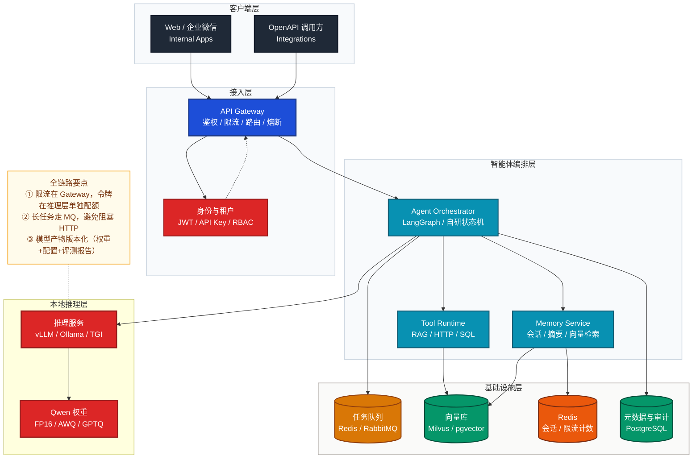

---

## 三、如何选择本地开源模型（以 Qwen 为例）

### 3.1 选型维度

| 维度 | 说明 |
|------|------|
| **参数规模** | 7B 适合单卡 24GB 内推理；14B/32B 需更大显存或多卡；72B 通常为企业级集群 |
| **上下文长度** | 长文档 RAG 选官方标称长上下文版本（如 32K/128K 变体，以模型卡为准） |
| **工具调用 / Agent** | 优先选带 **Instruct**、**Chat** 且社区验证过 tool-calling 的版本（如 Qwen2.5 系列） |
| **许可与商用** | 以 Hugging Face / ModelScope 模型卡与阿里云通义开源说明为准 |
| **生态** | 是否支持 vLLM、llama.cpp、Ollama、AWQ/GPTQ 现成权重 |

### 3.2 Qwen 家族示例对照（便于落地选型）

> 以下为**典型用途示意**，具体显存与吞吐需结合量化与引擎实测。

| 模型示例（名称以官方为准） | 典型场景 | 单机推理（示意） |
|---------------------------|----------|------------------|
| **Qwen2.5-7B-Instruct** | 部门知识库问答、简单工具调用 | 单卡 RTX 4090 24GB + AWQ 4-bit |
| **Qwen2.5-14B-Instruct** | 更复杂推理、多步 Agent | A100 40GB 或 双卡 24GB |
| **Qwen2.5-32B-Instruct** | 高质量对内 copilot | A100 80GB / 多卡 Tensor Parallel |
| **Qwen2.5-Coder-7B** | 代码生成、CI 注释 | 与 7B 类同，偏代码模板与规范 |

### 3.3 从业务到模型的决策流程（业务流程 LR）

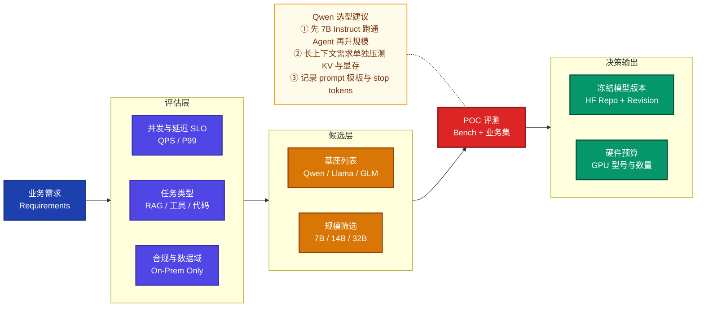

---

## 四、微调（Fine-tuning）

### 4.1 常见路线

| 方法 | 适用 | 工具示例 |
|------|------|----------|
| **LoRA / QLoRA** | 领域术语、口吻、结构化输出格式 | LLaMA-Factory、Axolotl、Unsloth |
| **全参微调** | 数据量大、强领域迁移 | DeepSpeed + Megatron 类（成本高） |
| **SFT 数据** | 指令-回答对、多轮对话、带 tool-call 轨迹的 JSON |

### 4.2 Qwen 微调实例（概念命令）

以下仅为**说明性示例**，实际参数需按显存与官方文档调整。

```bash
# 示例：使用 LLaMA-Factory 对 Qwen2.5-7B-Instruct 做 LoRA（需已安装环境与数据集）
# llamafactory-cli train examples/train_lora/qwen2_5_lora_sft.yaml
```

**产出物：**适配器权重（如 `adapter_model.safetensors`）+ `adapter_config.json`，或合并后的完整权重。

### 4.3 微调在流水线中的位置

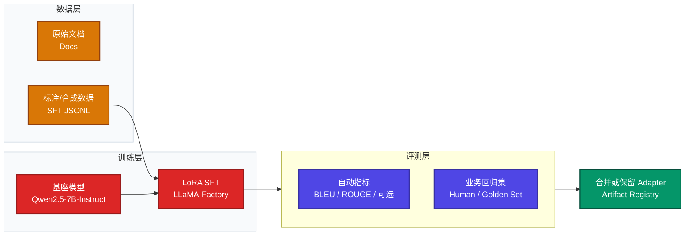

---

## 五、蒸馏（Distillation）

### 5.1 目的

用**大模型（教师）**生成数据或 logits，训练**小模型（学生）**，在可接受的质量损失下降低推理成本。

### 5.2 典型做法

| 类型 | 做法 | 适用 |
|------|------|------|
| **数据蒸馏** | 教师生成问答/推理链，再 SFT 学生 | 最常用，工程简单 |
| **Logits 蒸馏** | 对齐输出分布 | 需更多工程与算力 |

**Qwen 示例：**教师用 **Qwen2.5-32B-Instruct**（或云上更大模型）批量生成领域数据；学生选 **Qwen2.5-7B-Instruct**，在同一套评测上对比，直到满足 SLO。

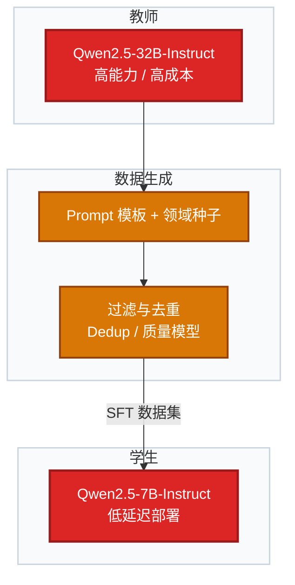

---

## 六、量化与导出

### 6.1 量化方法对照

| 方法 | 说明 | 典型工具 |
|------|------|----------|
| **GPTQ / AWQ** | 权重量化，4-bit 常用 | AutoGPTQ、AutoAWQ |
| **bitsandbytes 8/4-bit** | 加载时量化，上手快 | Transformers + bnb |
| **GGUF** | CPU/边缘友好 | llama.cpp、Ollama |
| **TensorRT-LLM** | NVIDIA GPU 极致吞吐 | 官方 Qwen 示例与构建脚本 |

### 6.2 导出形态示例

| 形态 | 用途 |
|------|------|
| **HuggingFace 目录** | `config.json`、`model.safetensors`、分片 |
| **GGUF 单文件** | Ollama、本地桌面客户端 |
| **TensorRT Engine** | 固定 shape 的生产 GPU 服务（版本与 CUDA 强绑定） |

### 6.3 量化导出流水线（LR）

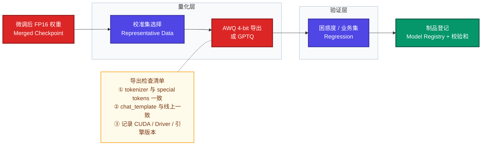

---

## 七、推理引擎选型（含实例）

### 7.1 对照表

| 引擎 | 优点 | 缺点 | 适用场景 |
|------|------|------|----------|
| **vLLM** | 高吞吐、PagedAttention、OpenAI 兼容 API | 主要 NVIDIA | **中小企业生产推荐首选** |
| **Text Generation Inference (TGI)** | HuggingFace 生态、功能全 | 运维与配置项多 | 已有 HF 流水线 |
| **Ollama** | 极简、开发友好 | 大规模集群与细粒度治理弱 | 开发机、POC、边缘 |
| **TensorRT-LLM** | 延迟与吞吐极限 | 构建与版本绑定重 | 固定模型、大并发 |
| **llama.cpp** | CPU / 无 GPU 环境 | 大模型 CPU 仍慢 | 备用、离线批处理 |

### 7.2 实际例子

**例 A：内网 Ubuntu + 单张 RTX 4090，Qwen2.5-7B-Instruct AWQ**

- 引擎：**vLLM**  
- 启动思路：`vllm serve Qwen/Qwen2.5-7B-Instruct-AWQ --quantization awq --max-model-len 8192`（具体参数以 vLLM 版本为准）  
- 智能体侧：OpenAI Base URL 指向内网 `http://vllm:8000/v1`

**例 B：研发笔记本无独显，快速联调**

- 引擎：**Ollama**  
- `ollama pull qwen2.5:7b`（名称以 Ollama 库为准）  
- 仅用于开发；生产仍建议 GPU 服务器 + vLLM

**例 C：金融客户要求固定 TensorRT 版本审计**

- 引擎：**TensorRT-LLM**  
- 在指定 CUDA 镜像内构建 engine，CI 记录哈希与性能报告

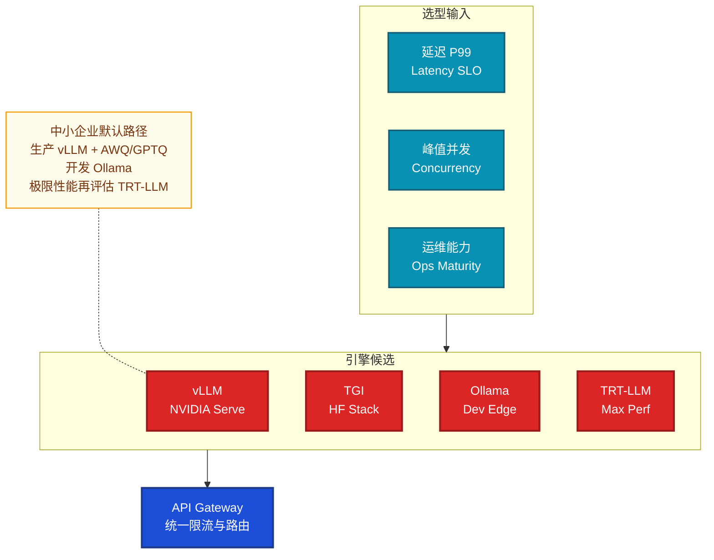

---

## 八、本地机器与云上机器选择（实例级）

### 8.1 本地（机房 / 办公室机柜）

| 配置示例 | 适用 |
|----------|------|
| **1× RTX 4090 24GB + 128GB RAM** | Qwen2.5-7B AWQ，中小并发 |
| **2× RTX 4090 + NVLink（若可用）** | 7B/14B 更高吞吐或 TP |
| **1× A100 40GB/80GB** | 14B～32B 更从容 |

**注意：**企业需考虑电力、散热、机柜、备份电源与硬盘（NVMe 存放权重与日志）。

### 8.2 公有云 GPU（私有 VPC）

| 云厂商示例 SKU | 用途 |
|----------------|------|
| **阿里云 gn7i（A10/L4 等）** | 成本与可用区灵活，适合 7B 级 |
| **AWS g5（A10G）/ p4d（A100）** | 全球区域、与现有 IAM/VPC 集成 |
| **Azure NC 系列** | 微软生态企业 |

**建议：**训练与离线评测可用抢占实例；**在线推理**尽量用按需或可预测预留，避免频繁中断。

### 8.3 算力与模型匹配示意（非承诺值）

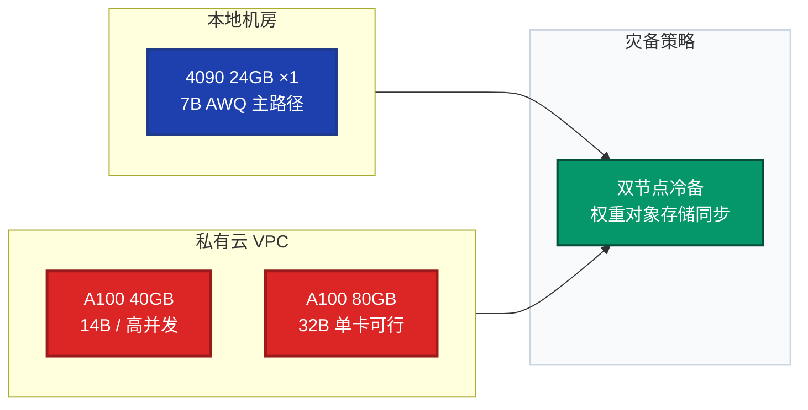

---

## 九、部署详细流程

### 9.1 阶段划分

1. **制品**：模型权重 + `tokenizer` + `generation_config` + 推理镜像版本。  
2. **配置**：`max_model_len`、`max_num_seqs`、温度与 stop tokens 与线上一致。  
3. **网络**：仅内网访问推理端口；Gateway 对外。  
4. **发布**：蓝绿或金丝雀（先切 5% 流量对比错误率与 P99）。  
5. **回滚**：保留上一版镜像与权重指针。

### 9.2 部署流水线（序列图）

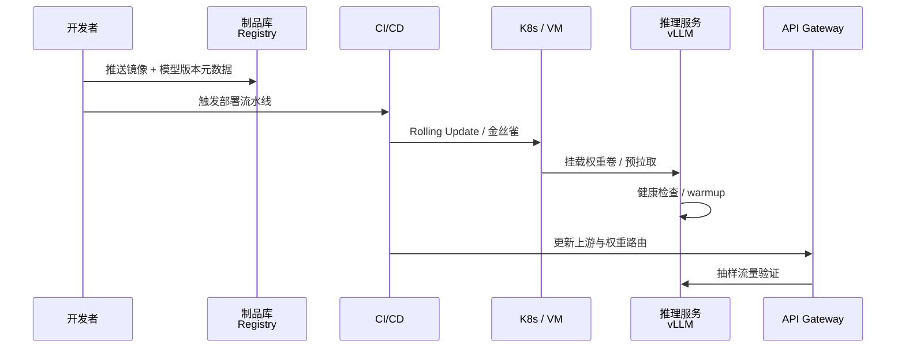

### 9.3 单机 Docker 思路（示例）

```bash
# 示例：拉取官方或自建 vLLM 镜像，挂载模型目录（路径按实际修改）
# docker run --gpus all -p 8000:8000 -v /data/models/qwen-awq:/model vllm/vllm-openai \
#   --model /model --quantization awq --host 0.0.0.0 --port 8000
```

生产环境建议：非 root、只读根文件系统、资源限制（`--gpus`、CPU、内存）、日志卷。

---

## 十、监控（Observability）

### 10.1 分层指标

| 层级 | 指标示例 |
|------|----------|
| **Gateway** | QPS、429 次数、P50/P99 延迟、按租户聚合 |
| **推理** | GPU 利用率、显存占用、排队长度、生成 tokens/s、KV cache 使用率 |
| **应用** | Agent 步数、工具失败率、RAG 检索延迟 |
| **日志与追踪** | request_id 贯通 Gateway → Orchestrator → vLLM；可选 OpenTelemetry |

### 10.2 监控架构（TB）

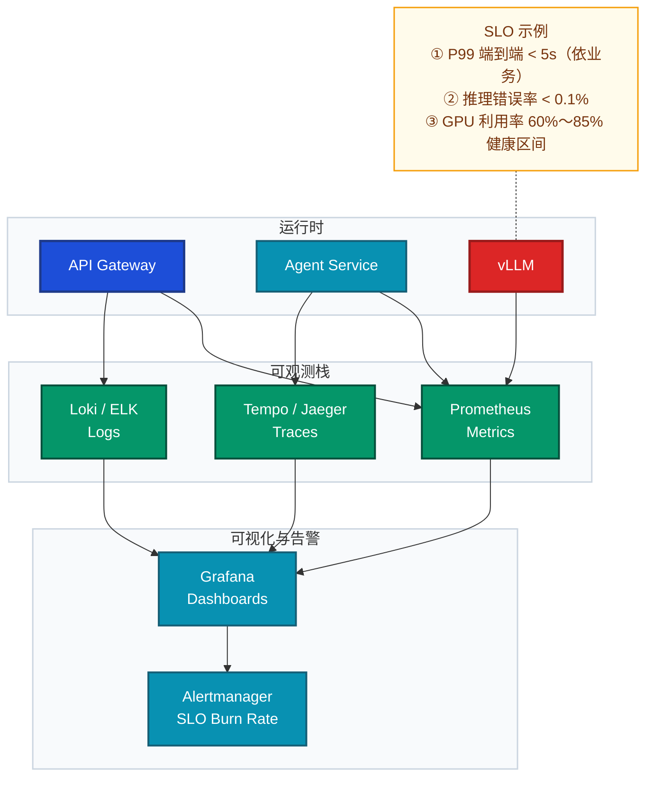

**NVIDIA 设备监控：**`dcgm-exporter` 提供 GPU 级指标，便于与 Prometheus 对接。

---

## 十一、限流（Rate Limiting）

### 11.1 限流维度

| 维度 | 说明 |
|------|------|
| **IP / API Key** | 防滥用、防误调用 |
| **租户 / 用户** | 多部门公平性 |
| **模型与路由** | 贵模型单独配额 |
| **并发连接数** | 保护 vLLM scheduler |
| **Token 预算** | 按日/月计费与封顶（需预估输出长度） |

### 11.2 算法与存储

| 算法 | 适用 |
|------|------|
| **令牌桶 / 漏桶** | 平滑突发 |
| **固定窗口 / 滑动窗口** | 简单配额 |
| **Redis + Lua** | 分布式一致计数 |
| **网关内置** | Kong、Envoy、NGINX limit_req、APISIX |

### 11.3 限流在链路中的位置（LR）

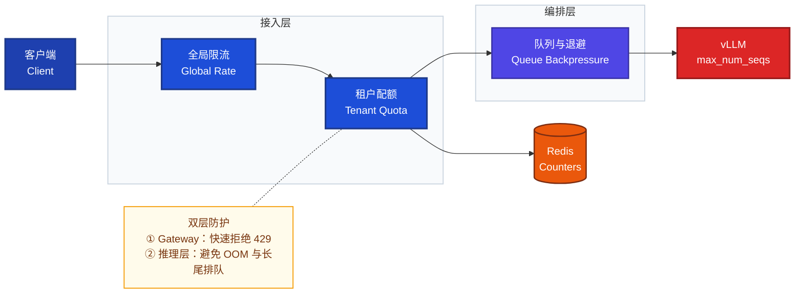

### 11.4 与智能体结合的建议

- **同步对话**：Gateway 限流 + 单次请求 token 上限。  
- **长任务**：改异步任务 ID 查询，限流「提交速率」而非「占用连接时间」。  
- **工具调用风暴**：对「每轮 Agent 最大步数」与「每用户每分钟工具调用次数」单独限制。

---

## 十二、端到端：从选型到上线（总流程 LR）

```mermaid
flowchart LR
    classDef userStyle     fill:#1e40af,stroke:#1e3a8a,stroke-width:2.5px,color:#fff
    classDef routeStyle    fill:#4f46e5,stroke:#3730a3,stroke-width:2px,color:#fff
    classDef retrieveStyle fill:#d97706,stroke:#92400e,stroke-width:2px,color:#fff
    classDef llmStyle      fill:#dc2626,stroke:#991b1b,stroke-width:2.5px,color:#fff
    classDef storeStyle    fill:#059669,stroke:#064e3b,stroke-width:2px,color:#fff
    classDef gatewayStyle  fill:#1d4ed8,stroke:#1e3a8a,stroke-width:2.5px,color:#fff
    classDef layerStyle    fill:#f8fafc,stroke:#cbd5e0,stroke-width:1.5px

    M0["模型选型<br>Qwen 7B/14B"]:::userStyle
    M1["数据与 SFT<br>LoRA"]:::retrieveStyle
    M2["可选蒸馏<br>Teacher→Student"]:::routeStyle
    M3["量化导出<br>AWQ/GPTQ"]:::llmStyle
    M4["引擎选择<br>vLLM"]:::llmStyle
    M5["算力采购<br>4090/A100"]:::routeStyle
    M6["部署发布<br>K8s/VM"]:::gatewayStyle
    M7["监控告警<br>Prom+Grafana"]:::storeStyle
    M8["限流配额<br>Gateway+Redis"]:::gatewayStyle

    M0 --> M1
    M1 --> M2
    M2 --> M3
    M3 --> M4
    M4 --> M5
    M5 --> M6
    M6 --> M7
    M7 --> M8
```

---

## 十三、附录：检查清单（上线前）

- [ ] 模型版本、tokenizer、`chat_template` 与训练/评测一致  
- [ ] 推理镜像 CUDA 与驱动在目标机验证通过  
- [ ] 压测报告：目标 QPS 下 P99 与 GPU 利用率  
- [ ] 回滚路径：上一版权重与路由可一键恢复  
- [ ] 审计日志：谁、何时、调用了哪类敏感工具  
- [ ] 密钥与 API Key 轮换流程  

---

## 参考文献与扩展阅读

- 项目内规范：`1.2mermaid项目架构作图规范与参考.md`  
- Qwen 官方开源与模型卡：以 [Hugging Face Qwen](https://huggingface.co/Qwen)、[ModelScope](https://modelscope.cn) 为准  
- vLLM、TGI、Ollama、TensorRT-LLM 官方文档（版本更新频繁，部署参数以对应版本为准）

---

*文档版本：v1.0 | 可作内部架构评审与 POC 任务书附件使用。*
