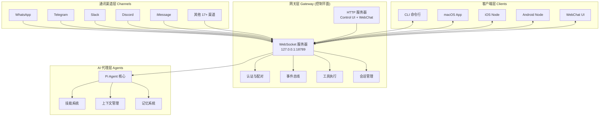
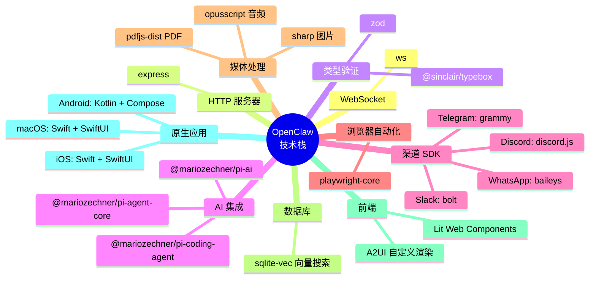
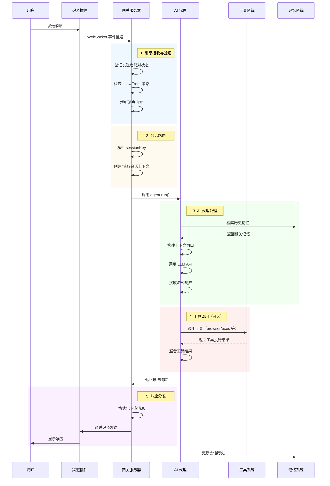
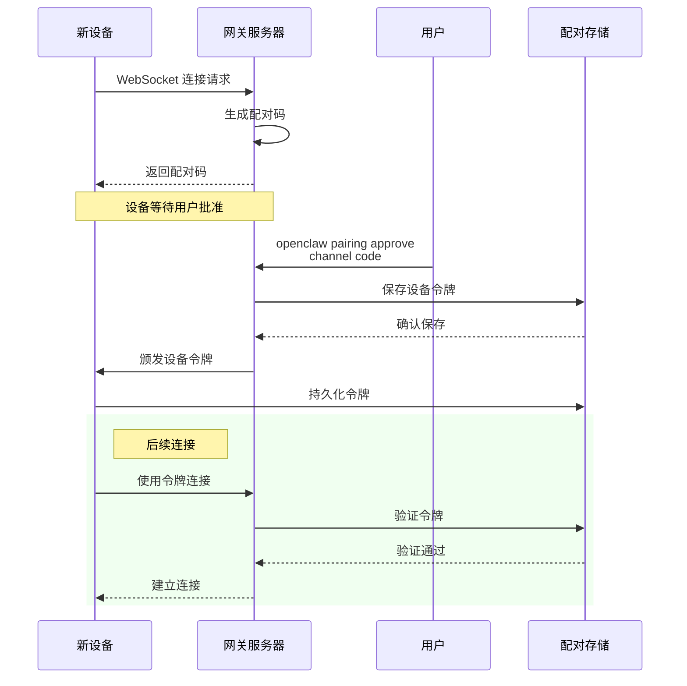
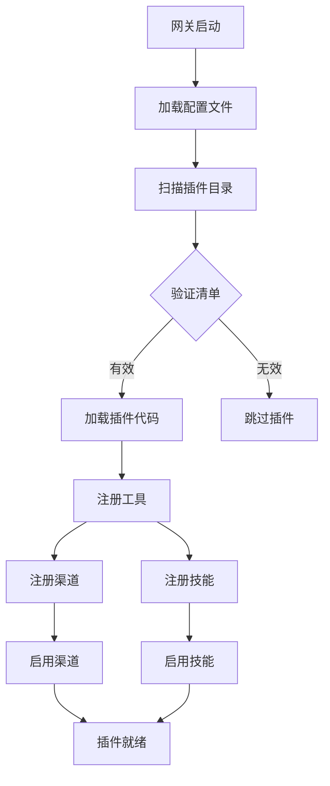
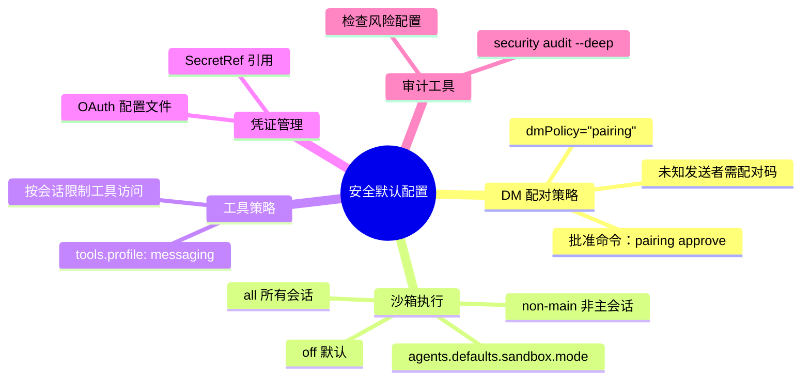
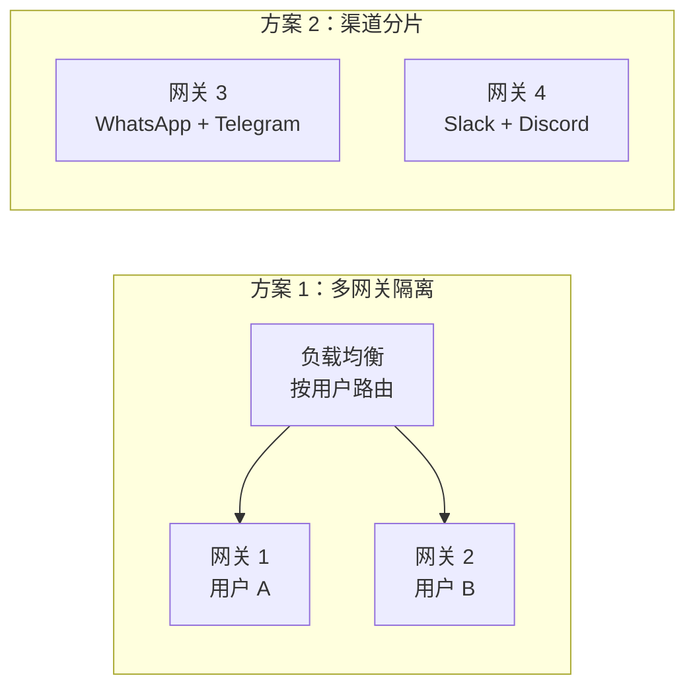

# OpenClaw 技术分析文档

## 1. 项目定位

**OpenClaw 是一个运行在用户自有设备上的个人 AI 助手平台**，通过中心化网关（Gateway）统一管理 22+ 个主流通讯渠道（WhatsApp、Telegram、Slack、Discord 等），支持多设备协同（macOS、iOS、Android），在保障隐私和数据安全的前提下，提供强大的 AI 代理能力和可扩展的插件系统。

**解决的核心问题：**
- 隐私保护：用户数据完全本地化，避免将敏感信息发送给第三方 AI 服务
- 多渠道集成：统一管理分散在不同通讯平台的对话和任务
- 设备协同：支持多设备作为"节点"参与 AI 助手工作流
- 可扩展性：通过插件系统支持自定义工具、技能和服务集成
- 低延迟体验：本地优先架构，实现快速响应和始终在线

---

## 2. 整体架构

### 2.1 架构风格

OpenClaw 采用**中心化网关（Gateway）+ 分布式节点（Nodes）**的架构模式，属于**事件驱动的分层架构**。



**图 1：OpenClaw 整体架构图**

**图前导语：** 上图展示了 OpenClaw 的四层架构体系，从下至上分别是通讯渠道层、网关层、客户端层和 AI 代理层。重点关注网关层作为控制平面的核心地位，以及各层之间的交互关系。

**架构特点：**
1. **单一网关原则**：每个主机运行一个网关实例，统一管理所有通讯渠道
2. **WebSocket 中心化**：所有客户端和节点通过 WebSocket 与网关通信
3. **事件驱动**：通过事件总线实现松耦合的组件通信
4. **插件化扩展**：核心保持精简，功能通过插件扩展

### 2.2 技术栈

#### 核心运行时
- **语言**：TypeScript（主要）+ Swift（macOS/iOS）+ Kotlin（Android）
- **运行时**：Node.js ≥ 22.12.0
- **包管理**：pnpm（推荐）、npm、bun
- **模块系统**：ES Modules

#### 关键依赖库



**图 2：OpenClaw 技术栈全景图**

**图前导语：** 该思维导图展示了 OpenClaw 使用的核心技术栈，涵盖 WebSocket 通信、HTTP 服务、AI 集成、渠道 SDK、媒体处理等关键领域。

#### 项目结构

```
openclaw/
├── src/                          # 核心源代码
│   ├── gateway/                  # WebSocket 网关服务器
│   │   ├── server.impl.ts        # 服务器实现
│   │   ├── auth.ts               # 认证逻辑
│   │   ├── events.ts             # 事件系统
│   │   ├── server-ws-runtime.ts  # WebSocket 处理
│   │   └── server/               # 子模块
│   ├── channels/                 # 通讯渠道集成
│   │   ├── registry.ts           # 渠道注册表
│   │   ├── dock.ts               # 渠道连接管理
│   │   └── plugins/              # 渠道插件
│   ├── agents/                   # AI 代理系统
│   │   ├── context.ts            # 上下文管理
│   │   ├── skills.ts             # 技能系统
│   │   ├── sandbox.ts            # 沙箱执行
│   │   └── tool-catalog.ts       # 工具目录
│   ├── cli/                      # 命令行界面
│   │   ├── program.ts            # Commander.js 程序
│   │   ├── gateway-cli.ts        # 网关 CLI
│   │   └── plugins-cli.ts        # 插件 CLI
│   ├── config/                   # 配置系统
│   │   ├── config.ts             # 配置加载
│   │   ├── schema.ts             # Zod Schema
│   │   └── io.ts                 # 文件 I/O
│   ├── tools/                    # 工具实现
│   │   ├── browser/              # 浏览器控制
│   │   ├── canvas/               # 画布操作
│   │   └── exec/                 # 命令执行
│   ├── plugin-sdk/               # 插件 SDK
│   ├── infra/                    # 基础设施
│   │   ├── net/                  # 网络工具
│   │   ├── exec-host.ts          # 执行主机
│   │   └── retry.ts              # 重试机制
│   └── ...
├── extensions/                   # 捆绑插件
│   ├── voice-call/               # 语音通话
│   ├── matrix/                   # Matrix 协议
│   └── nostr/                    # Nostr 社交
├── skills/                       # 核心技能
│   ├── github/                   # GitHub 集成
│   ├── notion/                   # Notion 集成
│   └── ...
├── apps/                         # 原生应用
│   ├── macos/                    # macOS 应用
│   ├── ios/                      # iOS 应用
│   └── android/                  # Android 应用
├── docs/                         # 文档
├── scripts/                      # 构建脚本
└── package.json                  # 项目配置
```

**图 3：项目目录结构图**

**图前导语：** 该树状图展示了 OpenClaw 的代码组织结构，核心源代码位于 `src/` 目录，按功能模块清晰划分。

### 2.3 核心模块及职责

#### 模块职责矩阵

| 模块         | 职责                                        | 关键文件                                                                                                         |
| ------------ | ------------------------------------------- | ---------------------------------------------------------------------------------------------------------------- |
| **Gateway**  | WebSocket 服务器、认证、事件分发、HTTP 服务 | [`server.impl.ts`](file:///Users/wangqiao/Downloads/github_project/openclaw-2026.3.7/src/gateway/server.impl.ts) |
| **Channels** | 22+ 通讯渠道集成、消息收发、群组管理        | [`registry.ts`](file:///Users/wangqiao/Downloads/github_project/openclaw-2026.3.7/src/channels/registry.ts)      |
| **Agents**   | AI 模型交互、上下文管理、工具调用           | [`context.ts`](file:///Users/wangqiao/Downloads/github_project/openclaw-2026.3.7/src/agents/context.ts)          |
| **Plugins**  | 插件加载、注册表、运行时                    | [`registry.js`](file:///Users/wangqiao/Downloads/github_project/openclaw-2026.3.7/src/plugins/registry.js)       |
| **Config**   | 配置加载、验证、热重载                      | [`config.ts`](file:///Users/wangqiao/Downloads/github_project/openclaw-2026.3.7/src/config/config.ts)            |
| **Tools**    | 浏览器控制、画布操作、命令执行              | [`browser/`](file:///Users/wangqiao/Downloads/github_project/openclaw-2026.3.7/src/tools/browser/)               |
| **CLI**      | 命令行界面、设备配对、诊断                  | [`program.ts`](file:///Users/wangqiao/Downloads/github_project/openclaw-2026.3.7/src/cli/program.ts)             |

---

## 3. 核心执行链路

### 3.1 消息处理流程（后端请求流）

这是 OpenClaw 最核心的功能链路：用户通过通讯渠道发送消息 → 网关接收并路由 → AI 代理处理 → 返回响应。



**图 4：消息处理时序图**

**图前导语：** 该时序图完整展示了从用户发送消息到 AI 响应的整个处理流程，包含 5 个关键阶段：消息接收与验证、会话路由、AI 代理处理、工具调用（可选）、响应分发。重点关注各组件之间的调用顺序和数据流向。

**图后要点：**
1. **配对验证前置**：所有消息在处理前必须先验证发送者的配对状态，这是安全模型的第一道防线
2. **会话隔离**：通过 `sessionKey` 实现会话隔离，确保不同对话的上下文不混淆
3. **流式处理**：LLM 响应采用流式传输，提升用户体验
4. **工具可扩展**：工具调用是可选的，通过插件机制可以无限扩展

### 3.2 设备配对流程



**图 5：设备配对时序图**

**图前导语：** 该图展示了新设备首次连接网关的配对流程，包括配对码生成、用户批准、令牌颁发和后续连接验证四个阶段。

### 3.3 插件加载流程



**图 6：插件加载流程图**

**图前导语：** 该流程图展示了网关启动时插件的加载和初始化过程，从扫描插件目录到最终注册工具、渠道、技能。

---

## 4. 关键设计决策

### 4.1 单用户信任模型（One-User Trust Model）

**决策**：OpenClaw 设计为**单用户个人助手**，而非多租户系统。

**为什么这样设计：**
1. **简化安全模型**：认证用户即视为可信操作员，避免复杂的多用户权限隔离
2. **符合产品定位**：个人 AI 助手的核心理念是"专属"，而非"共享"
3. **降低实现复杂度**：不需要实现细粒度的访问控制列表（ACL）
4. **性能优化**：单一信任边界减少了权限检查的开销

**影响与权衡：**
- ✅ 优点：实现简单、性能好、用户体验流畅
- ⚠️ 限制：不推荐在互不信任的用户间共享网关
- 💡 解决方案：需要多用户隔离时使用独立网关实例

**原文引用：**
> "OpenClaw does **not** model one gateway as a multi-tenant, adversarial user boundary." — [`SECURITY.md`](file:///Users/wangqiao/Downloads/github_project/openclaw-2026.3.7/SECURITY.md#L90-L98)

### 4.2 网关中心化架构

**决策**：所有通讯渠道由单一 Gateway 统一管理，通过 WebSocket 提供控制平面。

**为什么这样设计：**
1. **状态一致性**：单一网关确保所有渠道的会话状态、认证信息、工具策略保持一致
2. **简化客户端**：客户端只需连接一个 WebSocket，无需分别处理多个渠道的 SDK
3. **事件广播**：便于实现跨渠道的事件通知和协调（如 Presence、Health）
4. **资源复用**：AI 代理、记忆系统、工具执行等核心资源可以复用

**技术实现：**
- WebSocket 长连接（默认 127.0.0.1:18789）
- 支持 Tailscale Serve/Funnel 或 SSH 隧道远程访问
- Canvas 和 Control UI 由同一 HTTP 服务器托管

**替代方案对比：**
| 方案                   | 优点                         | 缺点                   |
| ---------------------- | ---------------------------- | ---------------------- |
| **中心化网关**（采用） | 状态一致、简化客户端、易扩展 | 单点故障、性能瓶颈     |
| 分布式微服务           | 高可用、水平扩展             | 状态同步复杂、客户端重 |
| P2P 架构               | 去中心化、抗审查             | 实现复杂度极高         |

### 4.3 插件即信任代码（Trusted Plugin Model）

**决策**：插件与核心代码享有同等信任级别，在进程内运行，而非沙箱隔离。

**为什么这样设计：**
1. **性能考虑**：进程内调用比 IPC 或沙箱执行快 1-2 个数量级
2. **开发体验**：插件开发者无需学习沙箱 API，使用标准 Node.js 即可
3. **符合信任模型**：单用户场景下，用户选择的插件本身就是可信的
4. **集成度**：插件可以直接访问网关的内部状态和工具

**安全措施：**
- 仅安装可信来源插件（npm 官方或审核过的仓库）
- 支持 `plugins.allow` 白名单机制
- 插件清单强制定义配置 Schema，便于审计
- 通过 `openclaw security audit --deep` 检查风险配置

**原文明确说明：**
> "Plugins/extensions are part of OpenClaw's trusted computing base for a gateway." — [`SECURITY.md`](file:///Users/wangqiao/Downloads/github_project/openclaw-2026.3.7/SECURITY.md#L104-L111)

### 4.4 TypeScript 优先

**决策**：核心系统使用 TypeScript 而非 Rust/Go 等编译型语言。

**为什么这样设计：**
1. **易修改性**：TypeScript 广泛知名，易于阅读和扩展
2. **快速迭代**：适合编排系统（prompts、tools、protocols）
3. **生态丰富**：大量现成库支持，特别是渠道 SDK 都有 TypeScript 版本
4. **类型安全**：TypeScript 提供足够的类型安全性，同时保持开发效率

**原文引用：**
> "TypeScript was chosen to keep OpenClaw hackable by default. It is widely known, fast to iterate in, and easy to read, modify, and extend." — [`VISION.md`](file:///Users/wangqiao/Downloads/github_project/openclaw-2026.3.7/VISION.md#L93-L98)

**性能权衡：**
- ⚠️ TypeScript 运行时性能不如 Rust/Go
- ✅ 但对于 I/O 密集型的网关应用，性能瓶颈在网络而非计算
- ✅ 通过合理的架构设计（如事件驱动、异步 I/O）可以弥补

### 4.5 安全默认配置（Secure Defaults）

**决策**：采用安全默认值，同时提供明确的高级配置选项。

**关键安全特性：**



**图 7：安全配置体系图**

**图前导语：** 该思维导图展示了 OpenClaw 的五大安全配置维度，包括 DM 配对、沙箱执行、工具策略、凭证管理和审计工具。

**为什么这样设计：**
1. **新手友好**：默认配置足够安全，新手无需深入理解即可安全使用
2. **渐进式学习**：用户可以通过文档逐步了解高级配置
3. **明确权衡**：高级配置选项明确标注风险，用户知情选择
4. **审计支持**：提供 `openclaw doctor` 和 `security audit` 工具帮助检查配置

### 4.6 技能注册表（ClawHub）

**决策**：核心仅包含少量基础技能，新技能发布到 ClawHub 社区平台。

**为什么这样设计：**
1. **保持核心精简**：避免核心代码臃肿，便于维护
2. **鼓励社区贡献**：任何人都可以发布技能，促进生态繁荣
3. **质量分层**：核心技能经过严格审核，社区技能由用户自行选择
4. **快速迭代**：社区技能可以快速迭代，无需等待核心发布周期

**技能位置：**
- 核心技能：`skills/<name>/SKILL.md`
- 工作区技能：`~/.openclaw/workspace/skills/<skill>/SKILL.md`
- 托管技能：ClawHub (clawhub.ai)

### 4.7 MCP 集成策略

**决策**：通过 `mcporter` 桥接 MCP（Model Context Protocol），而非在核心内置 MCP 运行时。

**为什么这样设计：**
1. **保持核心精简**：MCP 生态变化快，独立桥接避免核心频繁更新
2. **动态加载**：支持动态添加/更改 MCP 服务器，无需重启网关
3. **降低耦合**：MCP 的变化不影响核心稳定性
4. **社区维护**：`mcporter` 可以由社区独立维护

**原文说明：**
> "For now, we prefer this bridge model over building first-class MCP runtime into core." — [`VISION.md`](file:///Users/wangqiao/Downloads/github_project/openclaw-2026.3.7/VISION.md#L72-L83)

### 4.8 内存插件独占槽位

**决策**：同一时间只能激活一个记忆插件（`plugins.slots.memory`）。

**选项：**
- `memory-core` - 基于 SQLite 的本地记忆
- `memory-lancedb` - 基于 LanceDB 的向量记忆
- `none` - 禁用记忆功能

**为什么这样设计：**
1. **避免冲突**：多个记忆系统同时运行会导致数据不一致
2. **简化上下文管理**：AI 代理只需与一个记忆系统交互
3. **便于用户选择**：用户根据需求选择适合的后端，而非同时使用多个

---

## 5. FAQ（12 个以上）

### 5.1 基本原理类

#### Q1: OpenClaw 与 LangChain、LlamaIndex 等 AI 框架有什么区别？

**A:** OpenClaw 与这些框架的定位完全不同：

| 维度         | OpenClaw             | LangChain/LlamaIndex |
| ------------ | -------------------- | -------------------- |
| **定位**     | 个人 AI 助手平台     | AI 应用开发框架      |
| **目标用户** | 终端用户             | 开发者               |
| **核心功能** | 多渠道集成、设备协同 | Prompt 编排、RAG     |
| **部署方式** | 本地网关 + 客户端    | 库/SDK，嵌入应用     |
| **扩展机制** | 插件系统             | 代码扩展             |

**简单来说**：LangChain 是"造轮子"的工具，OpenClaw 是"开箱即用"的产品。你可以用 LangChain 开发一个 AI 应用，但 OpenClaw 本身就是一个完整的 AI 助手。

#### Q2: OpenClaw 如何保证隐私和数据安全？

**A:** OpenClaw 通过以下机制保障隐私：

1. **本地优先**：所有数据存储在本地（`~/.openclaw`），不上传第三方
2. **单用户信任模型**：认证用户即 trusted operator，无需复杂权限控制
3. **DM 配对策略**：未知发送者需配对码，防止未授权访问
4. **沙箱执行**：可选的 Docker 沙箱隔离非主会话的工具执行
5. **凭证管理**：支持 SecretRef 和 OAuth 配置文件，避免明文存储

**但需要注意**：OpenClaw 的安全模型假设主机是可信的。如果主机被攻破，安全性会受到影响。

#### Q3: OpenClaw 支持哪些 AI 模型？

**A:** OpenClaw 支持广泛的 AI 模型提供商：

**主流提供商：**
- Anthropic（Claude 系列）
- OpenAI（GPT-4、GPT-4o、Codex）
- Google（Gemini 系列）
- AWS Bedrock
- 本地模型（通过 Ollama、vLLM 等）

**配置示例：**
```json5
{
  agent: {
    model: "anthropic/claude-opus-4-6"
  },
  models: {
    providers: {
      anthropic: {
        models: [
          { id: "claude-opus-4-6", contextWindow: 200000 }
        ]
      }
    }
  }
}
```

**最佳实践**：推荐使用最新最强的模型（如 Claude Opus 4.6）以获得最佳体验。

### 5.2 设计决策类

#### Q4: 为什么选择 WebSocket 而不是 REST API 作为主要通信协议？

**A:** 选择 WebSocket 基于以下考虑：

1. **实时性要求**：AI 助手需要实时推送消息、Presence、Typing 等事件
2. **长连接优势**：避免 REST 的频繁轮询，降低延迟和服务器负载
3. **双向通信**：客户端和服务器可以主动推送消息
4. **事件驱动架构**：WebSocket 天然适合事件驱动的设计

**对比分析：**
| 协议                  | 实时性 | 延迟 | 复杂度 | 适用场景           |
| --------------------- | ------ | ---- | ------ | ------------------ |
| **WebSocket**（采用） | 高     | 低   | 中     | 实时聊天、事件推送 |
| REST API              | 低     | 中   | 低     | 请求 - 响应模式    |
| gRPC                  | 中     | 低   | 高     | 微服务间通信       |
| MQTT                  | 高     | 低   | 中     | IoT 设备通信       |

#### Q5: 为什么采用单网关架构而不是微服务架构？

**A:** 这是基于产品定位的权衡：

**单网关架构（采用）：**
- ✅ 优点：
  - 状态管理简单，无需分布式一致性
  - 部署运维成本低
  - 适合单用户场景
- ⚠️ 缺点：
  - 单点故障
  - 水平扩展困难

**微服务架构：**
- ✅ 优点：
  - 高可用
  - 水平扩展
- ⚠️ 缺点：
  - 实现复杂度高
  - 运维成本高
  - 不适合单用户场景

**决策依据**：OpenClaw 定位为个人助手，单用户场景下，单网关架构的简单性和低运维成本更重要。如需高可用，可以部署多个独立网关。

#### Q6: 为什么插件不采用沙箱隔离？

**A:** 这是性能与安全的权衡：

**进程内插件（采用）：**
- ✅ 性能：直接函数调用，无 IPC 开销
- ✅ 开发体验：标准 Node.js，无需学习沙箱 API
- ✅ 集成度：可直接访问网关内部状态
- ⚠️ 安全：插件拥有与核心代码同等权限

**沙箱插件：**
- ✅ 安全：隔离执行，限制权限
- ⚠️ 性能：IPC 通信开销大（10-100ms）
- ⚠️ 复杂度：需要实现沙箱运行时和权限系统

**决策依据**：
1. 单用户信任模型下，用户选择的插件本身是可信的
2. 性能对 AI 助手体验至关重要
3. 通过插件审核和白名单机制弥补安全风险

### 5.3 实际应用类

#### Q7: 如何快速开始使用 OpenClaw？

**A:** 推荐通过 onboarding wizard 开始：

```bash
# 1. 安装（需要 Node.js ≥ 22）
npm install -g openclaw@latest

# 2. 运行向导
openclaw onboard --install-daemon

# 3. 启动网关
openclaw gateway --port 18789 --verbose

# 4. 配置渠道（以 Telegram 为例）
# 在 @BotFather 创建 bot，获取 token
openclaw channels login telegram

# 5. 发送消息测试
openclaw message send --to @username --message "Hello from OpenClaw"

# 6. 使用 AI 代理
openclaw agent --message "Ship checklist" --thinking high
```

**详细指南**：[Getting Started](https://docs.openclaw.ai/start/getting-started)

#### Q8: 如何添加新的通讯渠道？

**A:** 通过插件机制添加：

**步骤 1：创建插件结构**
```
extensions/my-channel/
├── index.ts          # 插件入口
├── channel.ts        # 渠道实现
├── openclaw.plugin.json  # 插件清单
└── package.json
```

**步骤 2：实现渠道接口**
```typescript
import type { ChannelPlugin } from '@openclaw/plugin-sdk';

export const channelPlugin: ChannelPlugin = {
  id: 'my-channel',
  name: 'My Channel',
  async connect(config) {
    // 实现连接逻辑
  },
  async sendMessage(target, message) {
    // 实现发送逻辑
  }
};
```

**步骤 3：配置插件清单**
```json
{
  "name": "my-channel",
  "version": "1.0.0",
  "openclaw": {
    "channels": ["my-channel"]
  }
}
```

**步骤 4：启用插件**
```bash
openclaw plugins enable my-channel
```

**详细文档**：[Plugin Development](https://docs.openclaw.ai/tools/plugin)

#### Q9: 如何实现自定义工具？

**A:** 通过插件注册工具：

**示例：天气查询工具**
```typescript
import { createTool } from '@openclaw/plugin-sdk';

export const weatherTool = createTool({
  name: 'weather.get',
  description: 'Get current weather for a location',
  inputSchema: {
    type: 'object',
    properties: {
      location: { type: 'string' }
    }
  },
  async execute(params) {
    const response = await fetch(`https://api.weather.com/${params.location}`);
    const data = await response.json();
    return {
      temperature: data.temp,
      condition: data.condition
    };
  }
});
```

**在插件中注册：**
```typescript
export const plugin: Plugin = {
  tools: [weatherTool]
};
```

### 5.4 性能优化类

#### Q10: OpenClaw 的性能瓶颈在哪里？如何优化？

**A:** 主要性能瓶颈和优化策略：

**瓶颈分析：**
1. **LLM API 调用**（最大瓶颈）
   - 延迟：500ms - 5s
   - 优化：使用流式响应、上下文压缩、缓存

2. **WebSocket 消息处理**
   - 延迟：1-10ms
   - 优化：批量处理、减少序列化

3. **记忆检索**
   - 延迟：10-100ms（SQLite）
   - 优化：向量索引、缓存热点数据

4. **渠道 SDK**
   - 延迟：因渠道而异
   - 优化：连接池、重试策略

**优化实践：**
```typescript
// 1. 上下文窗口优化
import { lookupContextTokens } from './agents/context';
const contextWindow = lookupContextTokens(modelId);

// 2. 记忆检索缓存
const cache = new LRUCache({ max: 1000 });
const memories = await memorySearch(query, { cache });

// 3. WebSocket 批量发送
const batch = [];
setTimeout(() => {
  if (batch.length > 0) {
    ws.send(JSON.stringify(batch));
    batch.length = 0;
  }
}, 10);
```

#### Q11: 如何优化 Token 使用量？

**A:** Token 优化策略：

1. **上下文压缩**
   ```bash
   # 使用 compact 命令
   openclaw agent --compact
   ```

2. **会话修剪**
   - 自动修剪旧消息
   - 保留关键信息摘要

3. **模型选择**
   - 简单任务使用小模型
   - 复杂任务使用大模型

4. **Prompt 优化**
   - 精简系统提示
   - 使用 Few-shot 而非冗长说明

**配置示例：**
```json5
{
  agents: {
    defaults: {
      context: {
        maxTokens: 50000,  // 限制上下文大小
        pruneStrategy: "oldest-first"
      }
    }
  }
}
```

#### Q12: OpenClaw 支持水平扩展吗？

**A:** 当前架构不支持传统意义上的水平扩展，但可以通过以下方式扩展：

**扩展策略：**



**图 8：扩展方案示意图**

**图前导语：** 该图展示了两种扩展 OpenClaw 的方案：多网关隔离（按用户分片）和渠道分片（按渠道类型分片）。

**具体方案：**

1. **多网关隔离**（推荐）
   - 每个用户独立网关
   - 通过负载均衡路由
   - 优点：完全隔离、易于扩展
   - 缺点：资源利用率低

2. **渠道分片**
   - 不同网关处理不同渠道
   - 通过配置路由
   - 优点：资源利用率高
   - 缺点：实现复杂、状态同步困难

**未来规划**：社区正在讨论微服务化改造，但当前优先级较低。

---

## 6. 总结

### 6.1 核心优势

1. **清晰的架构**：中心化网关 + 分布式节点，职责分离明确
2. **强大的扩展性**：插件系统支持无限扩展
3. **安全优先**：默认安全配置 + 明确的信任模型
4. **开发者友好**：TypeScript 技术栈 + 完善的文档
5. **生态丰富**：22+ 通讯渠道 + 多种 AI 模型支持

### 6.2 适用场景

**推荐使用：**
- ✅ 个人专属 AI 助手
- ✅ 隐私敏感场景
- ✅ 多渠道统一管理
- ✅ 设备协同需求

**不推荐使用：**
- ❌ 多租户 SaaS 服务
- ❌ 高并发企业级应用
- ❌ 需要严格权限隔离的场景

### 6.3 学习建议

**入门路径：**
1. 阅读 [README.md](file:///Users/wangqiao/Downloads/github_project/openclaw-2026.3.7/README.md) 了解项目概况
2. 运行 `openclaw onboard` 体验 onboarding 流程
3. 阅读 [架构文档](file:///Users/wangqiao/Downloads/github_project/openclaw-2026.3.7/docs/concepts/architecture.md) 理解核心概念
4. 开发一个简单的插件实践

**进阶学习：**
1. 深入研究 [Gateway 实现](file:///Users/wangqiao/Downloads/github_project/openclaw-2026.3.7/src/gateway/server.impl.ts)
2. 理解 [安全模型](file:///Users/wangqiao/Downloads/github_project/openclaw-2026.3.7/SECURITY.md)
3. 贡献插件或技能

---

**文档版本**：1.0  
**最后更新**：2026-03-25  
**参考资源**：
- [OpenClaw 官方文档](https://docs.openclaw.ai)
- [GitHub 仓库](https://github.com/openclaw/openclaw)
- [Discord 社区](https://discord.gg/clawd)
