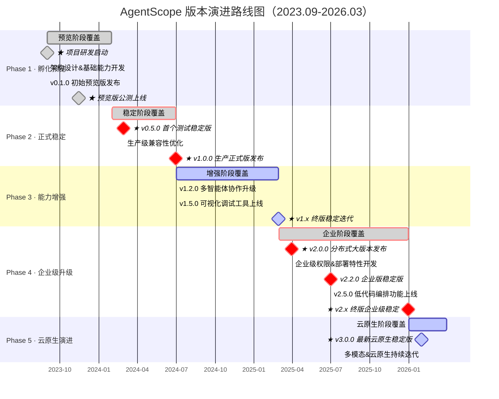

```mermaid
gantt
    title AgentScope 版本演进路线图（2023.09-2026.03）
    dateFormat  YYYY-MM-DD
    axisFormat  %Y-%m

    %% ── Phase 1：孵化预览期（done · 灰绿）─────────────────────
    section Phase 1 · 孵化预览
    预览阶段覆盖                     :done, ph1_bg,  2023-09-01, 2024-01-31
    ★ 项目研发启动                   :done, milestone, ph1_m1, 2023-09-01, 0d
    架构设计&基础能力开发            :done, ph1_t1,  2023-09-01, 2m
    v0.1.0 初始预览版发布            :done, ph1_t2,  after ph1_t1, 0d
    ★ 预览版公测上线                 :done, milestone, ph1_m2, 2023-11-15, 0d

    %% ── Phase 2：正式稳定期（crit · 红色）────────────────────
    section Phase 2 · 正式稳定
    稳定阶段覆盖                     :crit, done, ph2_bg, 2024-02-01, 2024-06-30
    ★ v0.5.0 首个测试稳定版          :crit, milestone, ph2_m1, 2024-02-28, 0d
    生产级兼容性优化                 :crit, ph2_t1, 2024-03-01, 3m
    ★ v1.0.0 生产正式版发布          :crit, milestone, ph2_m2, 2024-06-30, 0d

    %% ── Phase 3：能力增强期（active · 蓝色）────────────────────
    section Phase 3 · 能力增强
    增强阶段覆盖                     :active, ph3_bg, 2024-07-01, 2025-02-28
    v1.2.0 多智能体协作升级          :active, ph3_t1, 2024-07-01, 2m
    v1.5.0 可视化调试工具上线        :active, ph3_t2, after ph3_t1, 2m
    ★ v1.x 终版稳定迭代              :active, milestone, ph3_m1, 2025-02-28, 0d

    %% ── Phase 4：企业级升级期（crit · 深红）──────────────────────
    section Phase 4 · 企业级升级
    企业阶段覆盖                     :crit, done, ph4_bg,  2025-03-01, 2025-12-31
    ★ v2.0.0 分布式大版本发布        :crit, milestone, ph4_m1, 2025-03-31, 0d
    企业级权限&部署特性开发          :crit, ph4_t1,  2025-04-01, 3m
    v2.2.0 企业版稳定版              :crit, milestone, ph4_m2, 2025-06-30, 0d
    v2.5.0 低代码编排功能上线        :crit, ph4_t2, 2025-07-01, 3m
    ★ v2.x 终版企业级稳定            :crit, milestone, ph4_m3, 2025-12-31, 0d

    %% ── Phase 5：云原生演进期（active · 蓝灰）────────────────────
    section Phase 5 · 云原生演进
    云原生阶段覆盖                   :active, ph5_bg, 2026-01-01, 2026-03-31
    ★ v3.0.0 最新云原生稳定版        :active, milestone, ph5_m1, 2026-01-31, 0d
    多模态&云原生持续迭代            :active, ph5_t1, 2026-02-01, 2m
```