# 智能体框架选型对比指南
> 覆盖 LangChain · LangGraph · AutoGen · CrewAI · MetaGPT · Camel · AgentScope  
> 版本：v1.0 | 更新日期：2026-03-17

---

## 目录

1. [背景与概述](#1-背景与概述)
   - 1.1 [各框架重要版本时间节点](#11-各框架重要版本时间节点)
2. [框架速览对比表](#2-框架速览对比表)
3. [各框架详细分析](#3-各框架详细分析)
4. [多维度深度对比](#4-多维度深度对比)
   - 4.1 功能和特性
   - 4.2 性能和效率
   - 4.3 成本和可扩展性
   - 4.4 社区支持和生态系统
   - 4.5 安全和隐私保护
5. [场景适用性指南](#5-场景适用性指南)
6. [选型决策流程](#6-选型决策流程)
7. [FAQ 面试常见问题](#7-faq-面试常见问题)

---

## 1. 背景与概述

随着大语言模型（LLM）能力的快速跃升，单一模型调用已难以满足复杂业务场景的需求。**智能体（Agent）框架**应运而生，通过赋予 LLM 工具调用、记忆管理、多步推理与多智能体协作能力，构建出能够自主完成复杂任务的 AI 系统。

当前主流的智能体框架各具特色，覆盖不同的设计哲学与应用场景：

| 框架 | 主导方 | 发布年份 | 核心定位 |
|------|--------|----------|----------|
| **LangChain** | LangChain Inc. | 2022 | 通用 LLM 应用开发工具链 |
| **LangGraph** | LangChain Inc. | 2024 | 有状态图驱动的多智能体编排 |
| **AutoGen** | Microsoft Research | 2023 | 对话式多智能体协作框架 |
| **CrewAI** | CrewAI Inc. | 2024 | 角色导向的多智能体团队协作 |
| **MetaGPT** | DeepWisdom | 2023 | 软件公司角色仿真与 SOP 驱动 |
| **Camel** | CAMEL-AI | 2023 | 角色扮演通信与社会模拟研究 |
| **AgentScope** | Alibaba | 2024 | 工业级多智能体应用平台 |

### 智能体框架生态全景图

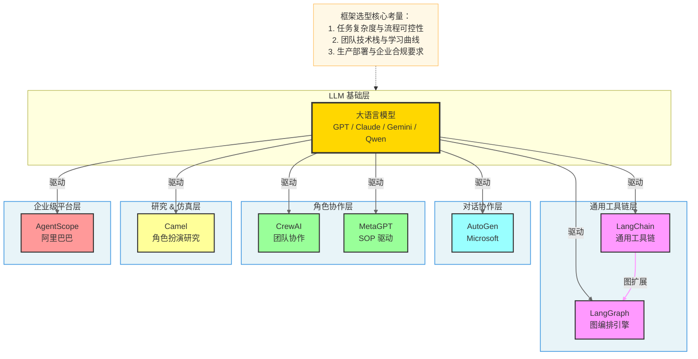

---

### 1.1 各框架重要版本时间节点

以下甘特图梳理了 7 个主流智能体框架从诞生至今的关键版本里程碑，帮助快速理解各框架的演进节奏与成熟度。

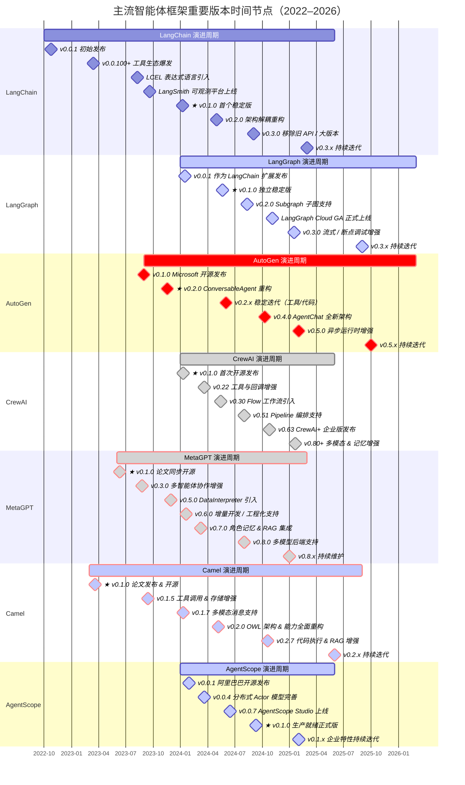

> **颜色说明**：
>
> | 框架 | 颜色方案 | 视觉效果 |
> |------|----------|----------|
> | LangChain | 默认（无关键字） | 青绿色 ◆ |
> | LangGraph | `active` | 亮蓝色 ◆ |
> | AutoGen | `crit` | 红色 ◆ |
> | CrewAI | `done` | 灰绿色 ◆ |
> | MetaGPT | `crit, done` | 深红色 ◆ |
> | Camel | `crit, active` | 橙红色 ◆ |
> | AgentScope | `active, done` | 深蓝色 ◆ |
>
> **其他说明**：
> - **★** 标注各框架首个稳定版本（架构定型 / 正式生产可用的关键节点）
> - 各版本日期以 GitHub Release / 官方公告为准，部分里程碑日期为近似值
> - `v0.x → v1.0` 代表从快速迭代期进入稳定 API 阶段的重要转折点
> - LangGraph 与 LangChain 同源，2024 年起独立演进

---

## 2. 框架速览对比表

| 维度 | LangChain | LangGraph | AutoGen | CrewAI | MetaGPT | Camel | AgentScope |
|------|-----------|-----------|---------|--------|---------|-------|------------|
| **开发语言** | Python / JS | Python | Python / .NET | Python | Python | Python | Python |
| **多智能体** | 有限支持 | 原生支持 | 核心特性 | 核心特性 | 核心特性 | 核心特性 | 核心特性 |
| **编排模式** | 链式/DAG | 有状态图 | 对话轮转 | 角色分工 | SOP流程 | 角色扮演 | 消息驱动 |
| **工具生态** | 极丰富 | 继承LC | 中等 | 中等 | 中等 | 基础 | 丰富 |
| **学习曲线** | 中 | 中高 | 低中 | 低 | 中 | 中高 | 中 |
| **生产就绪** | 高 | 高 | 中高 | 中高 | 中 | 低中 | 高 |
| **社区活跃度** | ★★★★★ | ★★★★☆ | ★★★★☆ | ★★★★☆ | ★★★☆☆ | ★★★☆☆ | ★★★☆☆ |
| **GitHub Stars** | ~100k+ | ~10k+ | ~40k+ | ~30k+ | ~45k+ | ~6k+ | ~5k+ |
| **开源协议** | MIT | MIT | MIT | MIT | MIT | Apache-2.0 | Apache-2.0 |
| **适合场景** | 通用开发 | 复杂流程 | 对话协作 | 团队任务 | 软件开发 | AI研究 | 企业生产 |

---

## 3. 各框架详细分析

### 3.1 LangChain

**定位**：LLM 应用开发的"瑞士军刀"，提供从模型调用到应用构建的完整工具链。

**核心架构**：

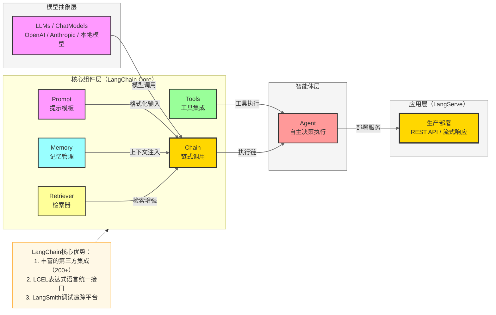

**核心特性**：
- **LCEL（LangChain Expression Language）**：声明式链构建语法，支持流式输出、批量处理、异步调用
- **丰富集成**：支持 200+ LLM、向量数据库、工具和数据源的原生集成
- **RAG 工程**：内置文档加载、分割、嵌入、检索完整管道
- **LangSmith**：配套的可观测性平台，支持追踪、评估和调试

**优势**：
- 生态最完整，社区最活跃，文档详尽
- 抽象层设计良好，切换 LLM 供应商成本低
- 与 LangGraph 无缝集成，形成完整解决方案

**劣势**：
- 版本迭代快，历史 API 兼容性较差（0.x → 1.x → 2.x 多次重构）
- 抽象层过多，复杂场景调试困难
- 单智能体场景下相对轻量框架偏重

---

### 3.2 LangGraph

**定位**：基于有向图（Graph）的状态机编排引擎，专为复杂多步骤、多智能体工作流设计。

**核心架构**：

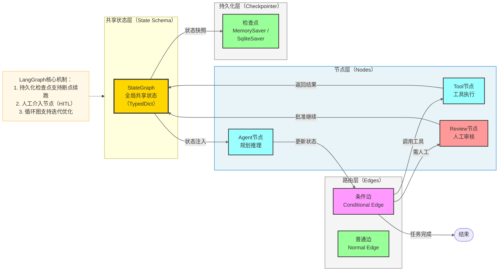

**核心特性**：
- **有状态图**：所有节点共享一个可变的状态对象，天然支持上下文传递
- **循环支持**：与 DAG 不同，LangGraph 支持图中的循环（如重试、反思迭代）
- **持久化检查点（Checkpointer）**：任意时刻保存/恢复状态，支持长时间运行任务
- **Human-in-the-Loop（HITL）**：原生支持在流程中插入人工审核节点
- **流式输出**：支持 token 级别、节点级别的细粒度流式

**优势**：
- 对复杂工作流（如 ReAct 循环、Plan-Execute）有最优雅的建模方式
- 状态持久化能力适合生产级有状态应用
- LangChain 用户几乎零迁移成本

**劣势**：
- 图概念对初学者有一定门槛
- 调试复杂图结构时可视化工具依赖 LangSmith（部分功能收费）

---

### 3.3 AutoGen（Microsoft）

**定位**：以多智能体**对话**为核心抽象，通过 Agent 间的消息传递实现复杂任务分解与协作。

**核心架构**：

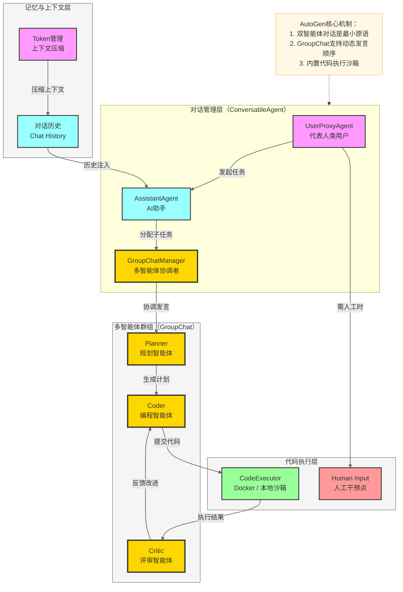

**核心特性**：
- **ConversableAgent**：所有 Agent 的基础抽象，支持自定义回复逻辑
- **GroupChat**：多智能体群聊，支持轮转、随机、自定义发言策略
- **代码执行**：内置 Docker/本地沙箱，Agent 生成代码后自动执行验证
- **AutoGen Studio**：低代码可视化界面，无需编程即可构建多智能体工作流

**优势**：
- 对话抽象自然直观，上手成本极低
- 代码生成+执行闭环是核心杀手锏，适合数据分析/编程任务
- 微软背书，与 Azure OpenAI 深度集成
- AutoGen 0.4 重构后架构更加清晰（引入 AgentChat 和 Core 层分离）

**劣势**：
- 复杂流程控制（条件路由、循环）需要额外代码
- 群聊中智能体发言顺序管理相对简单，复杂编排需要定制
- LLM 调用次数多，成本较高

---

### 3.4 CrewAI

**定位**：以**角色（Role）+ 任务（Task）+ 流程（Process）**为核心三元组，模拟真实团队协作。

**核心架构**：

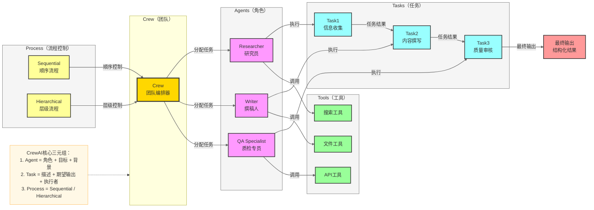

**核心特性**：
- **角色驱动设计**：每个 Agent 有明确的 `role`、`goal`、`backstory`，LLM 据此生成角色化回复
- **任务上下文传递**：前序任务的输出自动作为后续任务的上下文输入
- **两种流程模式**：Sequential（串行）和 Hierarchical（经理-员工层级）
- **Flows**：新版本支持事件驱动的工作流（类似 LangGraph 的状态机）

**优势**：
- API 设计极其简洁，5-10 行代码即可创建多智能体团队
- 角色建模自然，适合内容生成、研究报告等场景
- 活跃的社区和持续更新

**劣势**：
- 流程控制相对简单，复杂条件路由能力弱于 LangGraph
- 长流程中角色串扰（角色混乱）问题偶有出现
- 状态持久化能力弱

---

### 3.5 MetaGPT

**定位**：将软件公司的标准作业程序（SOP）编码为智能体行为，通过角色仿真完成完整软件开发流程。

**核心架构**：

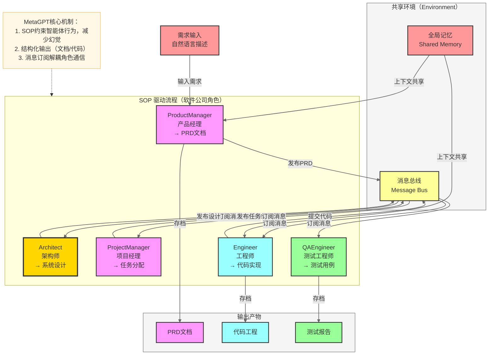

**核心特性**：
- **SOP（标准作业程序）**：将软件开发流程固化为智能体行为规范，大幅减少幻觉
- **结构化角色**：PM、架构师、工程师、QA 等角色有明确职责边界
- **消息总线**：基于发布-订阅模式，角色通过消息异步协作
- **Data Interpreter**：新增数据分析智能体，支持端到端数据科学工作流

**优势**：
- 在软件开发场景下输出质量最高，代码结构完整
- SOP 约束有效降低 LLM 幻觉率
- 学术影响力高，论文引用量大

**劣势**：
- 专注软件开发场景，通用性弱
- 配置和定制复杂，扩展到非软件场景成本高
- 资源消耗较大（一次完整任务消耗 Token 多）

---

### 3.6 Camel

**定位**：探索 LLM 自主合作的学术研究框架，通过**角色扮演对话**研究 AI 社会行为。

**核心架构**：

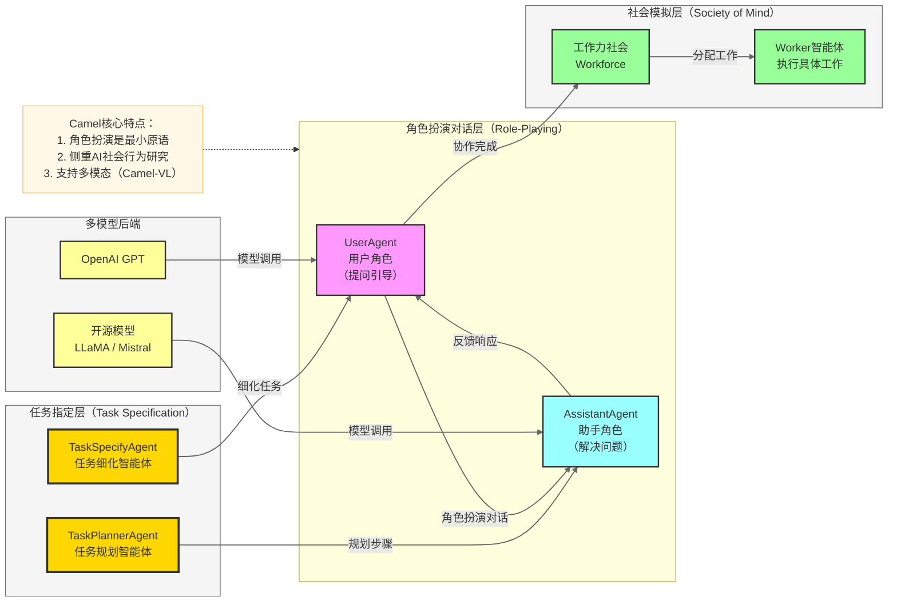

**核心特性**：
- **角色扮演通信**：两个 Agent 通过协商完成任务，探索 AI 自主交互的边界
- **Workforce（工作力）**：新版本引入多智能体任务分配和执行机制
- **多模态支持**：支持视觉-语言模型（VLM）的多模态任务
- **数据生成**：擅长生成多样化对话数据集，用于研究和训练

**优势**：
- 学术研究价值高，适合探索 LLM 协作行为
- 支持多种开源模型，不依赖商业 API
- 多模态能力较强

**劣势**：
- 生产就绪程度低，工程化封装较弱
- 社区规模相对较小
- 文档质量参差不齐

---

### 3.7 AgentScope

**定位**：阿里巴巴开源的工业级多智能体平台，强调**易用性、鲁棒性和分布式**，面向生产部署。

**核心架构**：

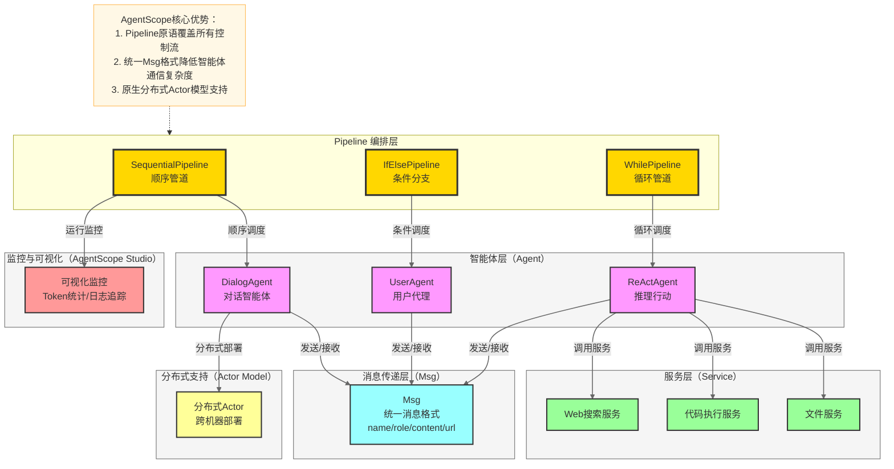

**核心特性**：
- **Pipeline 原语**：Sequential、IfElse、While、ForLoop 等管道原语覆盖所有控制流
- **统一 Msg 格式**：所有 Agent 通过标准化 `Msg` 对象通信，包含 `name/role/content/url`
- **分布式 Actor 模型**：原生支持多 Agent 跨机器分布式部署
- **AgentScope Studio**：内置 Web 可视化界面，支持运行监控和 Token 统计

**优势**：
- 工业级设计，鲁棒性强，适合生产部署
- 分布式支持是所有框架中最完善的
- 中文文档和示例丰富，中文社区支持好
- 阿里巴巴背书，持续维护有保障

**劣势**：
- 国际社区相对较小，英文资料偏少
- 生态集成不如 LangChain 丰富
- 框架相对新，成熟度需时间验证

**选 AgentScope 而非 LangChain / LangGraph 的核心理由**：

> **一句话定论**：LangChain / LangGraph 是**为开发者构建 Demo 优化的**，AgentScope 是**为工程师跑生产系统设计的**。

以下场景下 AgentScope 的优势是**压倒性的**：

- 需要数十乃至数百个 Agent **并发运行**
- 任务耗时数小时乃至数天，**不能因单点故障全盘重来**
- 团队在**中文企业环境**下工作，有合规与本地化诉求
- 不想为调试**额外搭建**一套独立监控系统

| # | 理由 | LangChain / LangGraph 的短板 | AgentScope 的优势 |
|---|------|----------------------------|-----------------|
| 1 | **分布式是一等公民** | LangGraph 并发基于单机 `asyncio`，跨机部署需自建消息队列 + 编排层，Agent 数从 10 增长到 100 时架构需重写 | 基于 **Actor 模型**，每个 Agent 天然独立进程，一行配置即可跨机器散布，规模扩展无需改架构 |
| 2 | **长任务不会因崩溃归零** | LangGraph Checkpoint 依赖手动配置 `MemorySaver`，恢复逻辑需自行管理 | Pipeline 原语**内置持久化**，任务中断后自动从检查点续跑，8 小时级任务的生死线 |
| 3 | **消息格式强规范** | Agent 间传递非结构化字符串或松散 dict，格式靠开发者自律，规模一大变"格式地狱" | 强制统一 `Msg` 结构（`name / role / content / url`），等同于给 Agent 间 API 加契约，协作错误**编译期暴露** |
| 4 | **监控开箱即用** | 可观测性依赖 LangSmith（付费 SaaS）或自建 OpenTelemetry，数据需出境 | AgentScope Studio 随框架发布，状态 / 消息流 / 耗时一屏可见，**无需额外账号，数据不出境** |
| 5 | **生产验证不是实验室作品** | LangGraph Cloud 2024 年底才 GA，生产验证时间短 | 开源前已在**阿里巴巴内部**支撑真实业务，你踩的坑大概率已被填过 |

> **反向提示**：如果场景是**单 Agent + RAG + 快速原型**，LangChain 的 200+ 生态集成和海量教程仍是更务实的选择。AgentScope 的优势在**规模与稳定性**，不在工具集丰富度。

---

## 4. 多维度深度对比

### 4.1 功能和特性

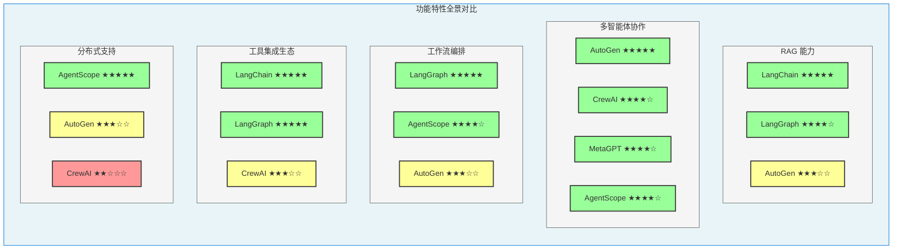

| 功能维度 | LangChain | LangGraph | AutoGen | CrewAI | MetaGPT | Camel | AgentScope |
|----------|-----------|-----------|---------|--------|---------|-------|------------|
| **RAG/检索增强** | ★★★★★ | ★★★★☆ | ★★★☆☆ | ★★★☆☆ | ★★☆☆☆ | ★★☆☆☆ | ★★★☆☆ |
| **多智能体协作** | ★★☆☆☆ | ★★★★☆ | ★★★★★ | ★★★★☆ | ★★★★☆ | ★★★★☆ | ★★★★☆ |
| **工作流编排** | ★★★☆☆ | ★★★★★ | ★★★☆☆ | ★★★☆☆ | ★★★☆☆ | ★★☆☆☆ | ★★★★☆ |
| **代码生成执行** | ★★★☆☆ | ★★★☆☆ | ★★★★★ | ★★★☆☆ | ★★★★☆ | ★★★☆☆ | ★★★★☆ |
| **工具生态丰富度** | ★★★★★ | ★★★★★ | ★★★☆☆ | ★★★☆☆ | ★★☆☆☆ | ★★★☆☆ | ★★★☆☆ |
| **人工介入（HITL）** | ★★★☆☆ | ★★★★★ | ★★★★☆ | ★★☆☆☆ | ★★☆☆☆ | ★★☆☆☆ | ★★★☆☆ |
| **状态持久化** | ★★★☆☆ | ★★★★★ | ★★★☆☆ | ★★☆☆☆ | ★★☆☆☆ | ★★☆☆☆ | ★★★★☆ |
| **分布式部署** | ★★★☆☆ | ★★★☆☆ | ★★★☆☆ | ★★☆☆☆ | ★★☆☆☆ | ★★☆☆☆ | ★★★★★ |

---

### 4.2 性能和效率

**LLM 调用次数对比（相同任务下的估算）**：

| 框架 | 调用次数（中等复杂任务） | 并发支持 | 流式响应 | 缓存机制 |
|------|------------------------|----------|----------|----------|
| LangChain | 低（1-3次） | ✅ 原生异步 | ✅ LCEL 原生 | ✅ 内置缓存 |
| LangGraph | 中（3-8次） | ✅ 原生异步 | ✅ 细粒度流式 | ✅ 检查点缓存 |
| AutoGen | 高（5-15次） | ✅ 部分支持 | ✅ 支持 | ⚠️ 有限 |
| CrewAI | 中（3-10次） | ✅ 支持 | ✅ 支持 | ⚠️ 有限 |
| MetaGPT | 高（8-20次） | ⚠️ 部分支持 | ✅ 支持 | ⚠️ 有限 |
| Camel | 中（4-10次） | ⚠️ 有限 | ✅ 支持 | ❌ 基础 |
| AgentScope | 中（3-8次） | ✅ 原生支持 | ✅ 支持 | ✅ 内置 |

**关键性能考量**：
- **Token 效率**：MetaGPT 因 SOP 约束生成大量结构化文档，Token 消耗最高；LangChain 单智能体场景最高效
- **延迟**：AutoGen 多轮对话导致整体延迟较高；LangGraph 通过并行节点执行可降低端到端延迟
- **内存占用**：所有框架的 Python 运行时内存差异不大，主要差异在于对话历史管理策略

---

### 4.3 成本和可扩展性

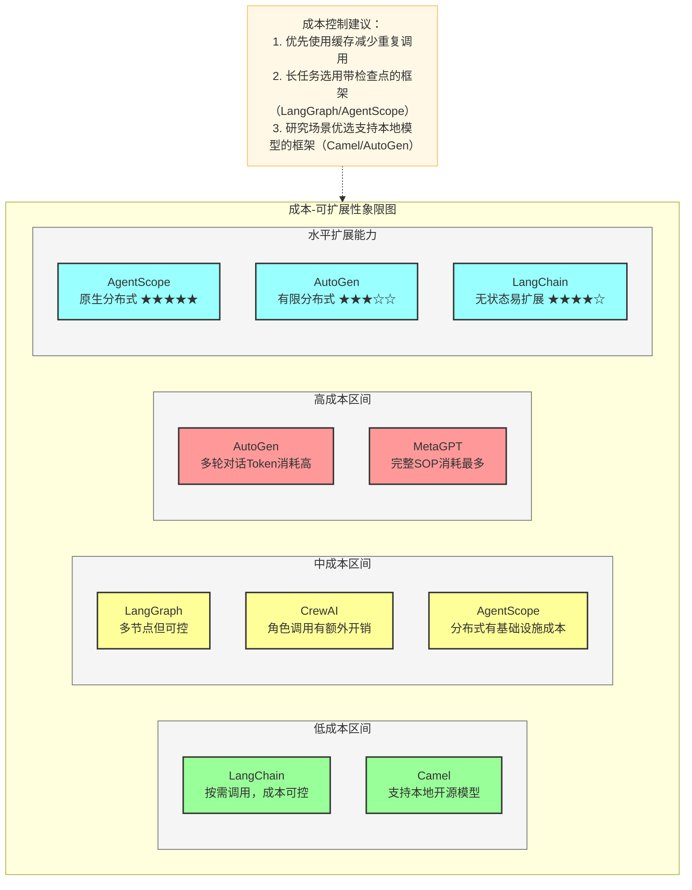

**成本优化策略对比**：

| 框架 | 缓存支持 | 本地模型支持 | Token 压缩 | 增量执行（断点续跑）|
|------|----------|-------------|------------|-------------------|
| LangChain | ✅ 内置语义缓存 | ✅ Ollama/本地 | ✅ 内置压缩链 | ❌ 需手动 |
| LangGraph | ✅ 检查点缓存 | ✅ 任意模型 | ⚠️ 需自定义 | ✅ **原生支持** |
| AutoGen | ⚠️ 部分支持 | ✅ OpenAI兼容格式 | ✅ 内置压缩 | ❌ 有限 |
| CrewAI | ⚠️ 基础缓存 | ✅ 支持 | ❌ 无 | ❌ 无 |
| MetaGPT | ✅ 增量模式 | ✅ 支持 | ❌ 无 | ✅ 增量执行 |
| Camel | ❌ 无 | ✅ 核心能力 | ❌ 无 | ❌ 无 |
| AgentScope | ✅ 内置 | ✅ 支持 | ⚠️ 有限 | ✅ 支持 |

---

### 4.4 社区支持和生态系统

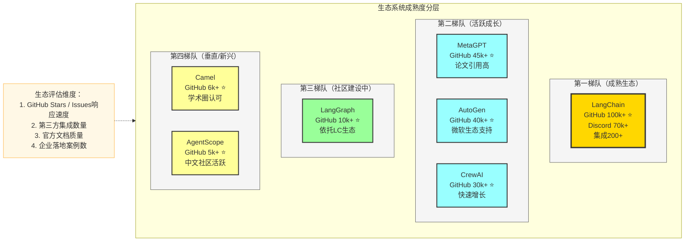

| 社区维度 | LangChain | LangGraph | AutoGen | CrewAI | MetaGPT | Camel | AgentScope |
|----------|-----------|-----------|---------|--------|---------|-------|------------|
| **GitHub Stars** | 100k+ | 10k+ | 40k+ | 30k+ | 45k+ | 6k+ | 5k+ |
| **文档质量** | ★★★★★ | ★★★★☆ | ★★★★☆ | ★★★★☆ | ★★★☆☆ | ★★★☆☆ | ★★★☆☆ |
| **Issue 响应** | ★★★★☆ | ★★★★☆ | ★★★★★ | ★★★★☆ | ★★★☆☆ | ★★★☆☆ | ★★★☆☆ |
| **第三方教程** | 极丰富 | 丰富 | 丰富 | 较多 | 中等 | 较少 | 较少 |
| **企业采用** | 极广泛 | 广泛 | 广泛 | 增长中 | 中等 | 研究为主 | 阿里内部 |
| **中文资源** | ★★★★☆ | ★★★★☆ | ★★★★☆ | ★★★☆☆ | ★★★★☆ | ★★☆☆☆ | ★★★★★ |

---

### 4.5 安全和隐私保护

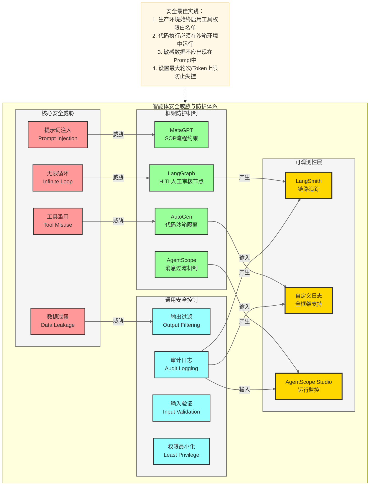

**各框架安全机制对比**：

| 安全维度 | LangChain | LangGraph | AutoGen | CrewAI | MetaGPT | Camel | AgentScope |
|----------|-----------|-----------|---------|--------|---------|-------|------------|
| **沙箱代码执行** | ⚠️ 需配置 | ⚠️ 需配置 | ✅ 内置Docker沙箱 | ⚠️ 需配置 | ⚠️ 需配置 | ❌ 无 | ✅ 支持 |
| **工具权限控制** | ⚠️ 手动实现 | ✅ 节点级控制 | ⚠️ 手动实现 | ⚠️ 手动实现 | ⚠️ 手动实现 | ❌ 基础 | ✅ 内置 |
| **输入验证** | ⚠️ 需自定义 | ⚠️ 需自定义 | ⚠️ 需自定义 | ⚠️ 需自定义 | ✅ SOP约束 | ❌ 无 | ✅ Msg校验 |
| **审计日志** | ✅ LangSmith | ✅ LangSmith | ✅ 内置日志 | ⚠️ 基础日志 | ✅ 内置日志 | ❌ 基础 | ✅ Studio |
| **数据本地化** | ✅ 本地模型 | ✅ 本地模型 | ✅ 本地模型 | ✅ 本地模型 | ✅ 本地模型 | ✅ 强力支持 | ✅ 本地模型 |
| **HITL 审核** | ⚠️ 有限 | ✅ 原生支持 | ✅ 原生支持 | ❌ 无 | ❌ 无 | ❌ 无 | ⚠️ 有限 |

---

## 5. 场景适用性指南

```mermaid
flowchart LR
    %% 样式定义
    classDef sceneStyle fill:#ffd700,stroke:#333,stroke-width:3px
    classDef bestStyle fill:#9f9,stroke:#333,stroke-width:2px
    classDef goodStyle fill:#9ff,stroke:#333,stroke-width:2px
    classDef okStyle fill:#ff9,stroke:#333,stroke-width:2px
    classDef subgraphStyle fill:#f5f5f5,stroke:#666,stroke-width:1px
    classDef clusterStyle fill:#e8f4f8,stroke:#4299e1,stroke-width:1.5px
    classDef noteStyle fill:#fff8e6,stroke:#ffb74d,stroke-width:1px

    subgraph sceneMap["场景-框架适配矩阵"]

        subgraph ragScene["RAG / 知识问答系统"]
            S1[首选：LangChain]:::bestStyle
            S1A[备选：LangGraph]:::goodStyle
        end
        class ragScene subgraphStyle

        subgraph codeScene["代码生成 / 软件开发自动化"]
            S2[首选：MetaGPT]:::bestStyle
            S2A[备选：AutoGen]:::goodStyle
        end
        class codeScene subgraphStyle

        subgraph complexScene["复杂多步骤业务流程"]
            S3[首选：LangGraph]:::bestStyle
            S3A[备选：AgentScope]:::goodStyle
        end
        class complexScene subgraphStyle

        subgraph teamScene["内容创作 / 团队协作任务"]
            S4[首选：CrewAI]:::bestStyle
            S4A[备选：AutoGen]:::goodStyle
        end
        class teamScene subgraphStyle

        subgraph enterpriseScene["企业级生产部署"]
            S5[首选：AgentScope]:::bestStyle
            S5A[备选：LangGraph]:::goodStyle
        end
        class enterpriseScene subgraphStyle

        subgraph researchScene["AI 研究 / 学术实验"]
            S6[首选：Camel]:::bestStyle
            S6A[备选：MetaGPT]:::goodStyle
        end
        class researchScene subgraphStyle

        subgraph chatScene["对话机器人 / 客服系统"]
            S7[首选：AutoGen]:::bestStyle
            S7A[备选：LangChain]:::goodStyle
        end
        class chatScene subgraphStyle

    end
    class sceneMap clusterStyle

    Note["适配矩阵说明：<br/>首选=最佳匹配，备选=可行替代<br/>实际选型还需考虑团队技术栈和已有基础设施"]:::noteStyle
    Note -.-> sceneMap
```

| 应用场景 | 推荐框架 | 理由 |
|----------|----------|------|
| **RAG 知识问答** | LangChain + LangGraph | 最丰富的向量库集成，LCEL 链式 RAG 管道成熟 |
| **智能客服/对话机器人** | AutoGen / LangChain | 对话抽象自然，多轮对话管理成熟 |
| **代码生成与软件自动化** | MetaGPT / AutoGen | MetaGPT 输出完整工程代码；AutoGen 代码执行闭环 |
| **数据分析自动化** | AutoGen / MetaGPT | 代码执行+可视化生成+自我修正能力强 |
| **内容创作（写作/报告）** | CrewAI | 研究员+撰稿人+编辑角色分工清晰 |
| **复杂业务流程自动化** | LangGraph / AgentScope | 状态机+条件路由+人工审核节点 |
| **企业级生产部署** | AgentScope / LangGraph | 分布式支持 + 监控 + 鲁棒性 |
| **AI 社会行为研究** | Camel | 角色扮演通信是核心研究工具 |
| **快速原型验证** | CrewAI / AutoGen | API 简洁，5分钟即可运行第一个多智能体 |
| **金融/医疗合规场景** | LangGraph + HITL | 强制人工审核节点，符合合规要求 |

---

## 6. 选型决策流程

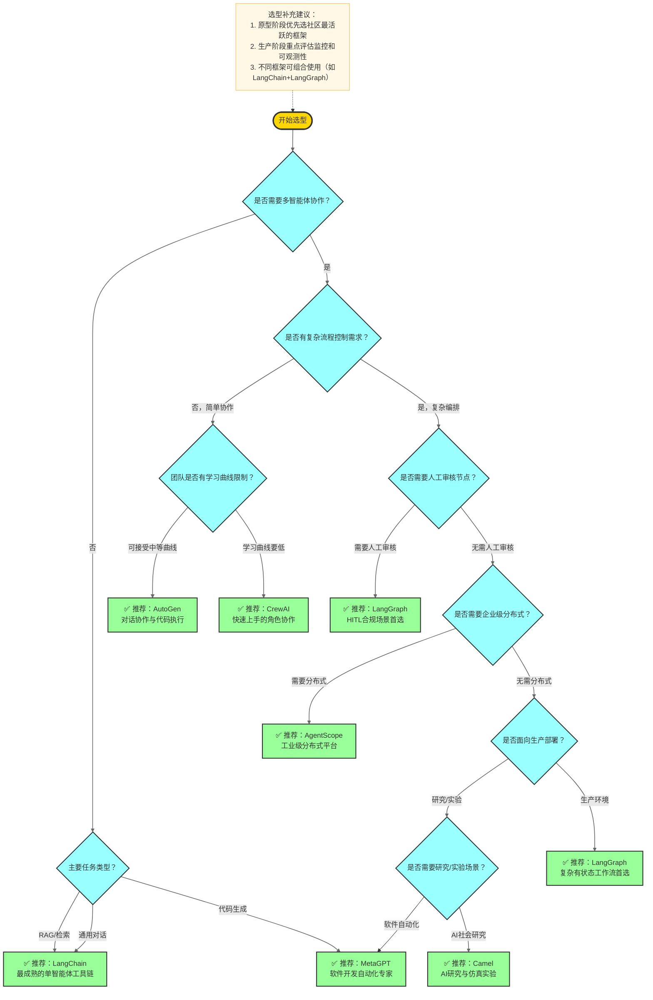

---

## 7. FAQ 面试常见问题

### 基础概念类

**Q1：LangChain 和 LangGraph 是什么关系？有什么区别？**

> **A**：LangGraph 是 LangChain 团队开发的图编排扩展，两者是**互补关系**而非替代关系。
>
> - **LangChain** 提供基础构件：LLM 调用、Prompt 模板、工具集成、链式调用（LCEL）、RAG 管道等
> - **LangGraph** 在此之上提供**图结构编排**能力：有状态节点、条件路由、循环支持、持久化检查点
>
> 简单来说：**LangChain 是"积木"，LangGraph 是"积木的架构师"**。单一管道用 LangChain 足够；需要循环、分支、多智能体协作时用 LangGraph。

---

**Q2：AutoGen 和 CrewAI 都是多智能体框架，如何选择？**

> **A**：两者的核心抽象不同：
>
> | 对比点 | AutoGen | CrewAI |
> |--------|---------|--------|
> | 核心抽象 | **对话**（消息传递）| **角色+任务**（职责分工）|
> | 上手难度 | 低 | 极低 |
> | 流程控制 | 中等 | 简单 |
> | 代码执行 | ★★★★★ | ★★★☆☆ |
> | 适合场景 | 编程/数据分析/对话 | 内容创作/研究报告 |
>
> **一句话总结**：需要代码执行和复杂对话协作选 AutoGen；需要快速搭建内容生成团队选 CrewAI。

---

**Q3：什么是 HITL（Human-in-the-Loop）？哪些框架原生支持？**

> **A**：HITL 指在智能体工作流执行过程中，在**特定节点暂停并等待人类输入/审批**后再继续执行，常见于：
> - 高风险操作前的人工确认（如发送邮件、删除数据）
> - 输出质量审核
> - 安全合规检查
>
> **原生支持程度**：
> - **LangGraph**：最完善，通过 `interrupt()` 原语在任意节点插入人工介入，配合检查点可完美恢复
> - **AutoGen**：通过 `UserProxyAgent` 的 `human_input_mode` 实现
> - 其他框架需手动实现

---

**Q4：MetaGPT 的 SOP 机制为什么能降低幻觉？**

> **A**：传统 LLM 调用是**开放式输出**，模型倾向于生成听起来合理但可能错误的内容（幻觉）。
>
> MetaGPT 的 SOP 机制通过以下方式约束输出：
> 1. **结构化输出要求**：每个角色必须产出特定格式的文档（如 PRD 必须包含"用户故事"、"验收标准"等字段）
> 2. **角色边界限制**：工程师只写代码，不做产品决策；减少角色越界导致的不一致
> 3. **前序输出作为约束**：后序角色基于前序文档工作，减少"凭空创造"
> 4. **多轮验证**：QA 工程师审核代码并生成测试用例，形成验证闭环

---

### 架构设计类

**Q5：如何设计一个健壮的多智能体系统？有哪些关键原则？**

> **A**：健壮多智能体系统的关键设计原则：
>
> 1. **单一职责原则**：每个 Agent 只做一件事，职责边界清晰
> 2. **通信协议标准化**：所有 Agent 通过统一格式消息通信（参考 AgentScope 的 `Msg` 对象）
> 3. **幂等性设计**：Agent 的执行应当是幂等的，相同输入得到相同输出
> 4. **超时与重试机制**：每个 Agent 调用设置超时上限，失败时有回退策略
> 5. **状态持久化**：使用 LangGraph 检查点或 AgentScope 的持久化机制，支持断点续跑
> 6. **可观测性**：接入追踪平台（LangSmith/自定义日志），每次 Agent 调用都有完整记录
> 7. **人工介入点**：在高风险操作前强制设置 HITL 节点

---

**Q6：在 LangGraph 中如何实现 "ReAct" 循环模式？**

> **A**：ReAct（Reason + Act）是让 Agent 交替进行"思考"和"行动"的迭代模式，LangGraph 的图结构天然适合：
>
> ```python
> from langgraph.graph import StateGraph, END
>
> # 定义状态
> class AgentState(TypedDict):
>     messages: list
>     next: str
>
> # 构建图
> graph = StateGraph(AgentState)
> graph.add_node("agent", agent_node)      # 思考节点
> graph.add_node("tools", tool_node)       # 行动节点
>
> # 条件边：Agent 决定是继续工具调用还是结束
> graph.add_conditional_edges(
>     "agent",
>     should_continue,  # 判断函数
>     {"tools": "tools", "end": END}
> )
> graph.add_edge("tools", "agent")  # 工具结果返回 Agent（形成循环）
> graph.set_entry_point("agent")
> ```
>
> 关键在于 `tools → agent` 的边形成**循环**，而 LangGraph 原生支持图中的循环（DAG 框架无法做到）。

---

**Q7：如何评估一个智能体框架的生产就绪程度？**

> **A**：从以下 6 个维度评估：
>
> | 维度 | 评估指标 |
> |------|----------|
> | **可观测性** | 是否有链路追踪？是否能追溯每次 LLM 调用的 Prompt 和输出？|
> | **错误处理** | 是否有重试机制？部分失败能否从检查点恢复？|
> | **安全性** | 工具执行是否有沙箱隔离？是否支持权限控制？|
> | **性能** | 是否支持异步并发？是否有请求缓存？|
> | **可维护性** | 代码是否有良好抽象？是否容易替换 LLM 供应商？|
> | **监控告警** | Token 消耗是否可监控？异常是否有告警？|

---

### 实战应用类

**Q8：CrewAI 的 Sequential 和 Hierarchical 流程有什么区别？分别适用什么场景？**

> **A**：
>
> **Sequential（顺序流程）**：
> - 任务按固定顺序逐个执行，前一个任务的输出自动传入下一个
> - 适合：**线性工作流**，如"收集信息 → 撰写报告 → 格式化输出"
> - 优点：简单可预测；缺点：无法并行，速度受最慢任务限制
>
> **Hierarchical（层级流程）**：
> - 有一个 Manager LLM 负责分配任务给各 Worker Agent，根据结果动态决定下一步
> - 适合：**复杂自适应任务**，如根据调研结果动态调整撰写策略
> - 优点：灵活自适应；缺点：Manager LLM 成为瓶颈，增加额外 Token 消耗

---

**Q9：LangChain / LangGraph 与向量数据库集成时有哪些最佳实践？**

> **A**：
>
> 1. **分块策略选择**：
>    - 代码文档用 `RecursiveCharacterTextSplitter`，按语法边界分割
>    - 长文档用 `SemanticChunker`，按语义相似度分割，减少上下文断裂
>
> 2. **嵌入模型选择**：
>    - 中文场景优先 `text-embedding-3-small` 或 `bge-large-zh`
>    - 需要本地化时使用 Ollama + `nomic-embed-text`
>
> 3. **检索策略优化**：
>    - 使用 `MultiQueryRetriever` 生成多个查询变体，提高召回率
>    - 使用 `ContextualCompressionRetriever` 压缩无关片段
>    - 结合 BM25 稀疏检索和向量稠密检索（混合检索）
>
> 4. **评估与迭代**：
>    - 使用 `RAGAs` 评估框架量化 Context Recall、Answer Faithfulness 等指标
>    - 接入 LangSmith 追踪每次检索的召回文档质量

---

**Q10：AgentScope 相比其他框架，在哪些场景下有明显优势？**

> **A**：AgentScope 在以下场景有独特优势：
>
> 1. **超大规模多智能体**：原生 Actor 分布式模型，支持数百个 Agent 跨机器部署，其他框架难以实现
> 2. **中文企业场景**：中文文档最完善，阿里巴巴内部大规模验证，合规性有保障
> 3. **长时间运行任务**：Pipeline 原语 + 内置持久化，天然适合需要数小时/天的复杂任务
> 4. **需要可视化监控**：AgentScope Studio 提供开箱即用的 Web 监控界面，无需额外配置
> 5. **消息格式严格的场景**：统一 `Msg` 格式强制规范，减少 Agent 间通信的格式错误

---

**Q11：如何防止多智能体系统中的"智能体失控"（Agent Loop）问题？**

> **A**：智能体失控是指 Agent 陷入无限循环或执行有害操作的风险，防护措施：
>
> 1. **设置最大迭代次数**：所有框架均支持 `max_iterations` 或 `max_rounds` 参数，强制终止
> 2. **Token 预算控制**：设置单次任务的最大 Token 消耗上限
> 3. **工具白名单**：只允许 Agent 调用预定义的安全工具集
> 4. **LangGraph 超时边**：在图中加入超时检查节点，超时后强制转向终止节点
> 5. **沙箱代码执行**：AutoGen 的 Docker 沙箱隔离，代码执行不影响宿主环境
> 6. **人工介入节点（HITL）**：在高风险操作前强制暂停等待确认
> 7. **输出内容过滤**：对 Agent 输出应用内容安全过滤器，拦截有害指令

---

**Q12：在面试中如何回答"为什么选择 LangGraph 而不是直接用 LangChain"？**

> **A**：标准回答框架：
>
> > "LangChain 适合**线性、无状态**的 LLM 调用流程，例如简单的 RAG 问答和单轮工具调用链。但当业务需要以下能力时，LangGraph 是必然选择：
> >
> > 1. **循环与迭代**：如 ReAct 模式需要 Agent 反复尝试工具调用直到成功，DAG 无法建模循环
> > 2. **持久化状态**：长时间运行任务需要在任意节点保存和恢复状态（断点续跑）
> > 3. **人工介入**：合规场景要求在危险操作前强制等待人工审核
> > 4. **多智能体协作**：多个 Agent 共享同一状态对象，通过图节点协调工作
> >
> > 实际项目中，LangChain 和 LangGraph 常常组合使用：LangChain 负责基础组件（检索、工具、模型调用），LangGraph 负责流程编排。"

---

*文档版本：v1.0 | 作者：AI 架构助手 | 最后更新：2026-03-17*
