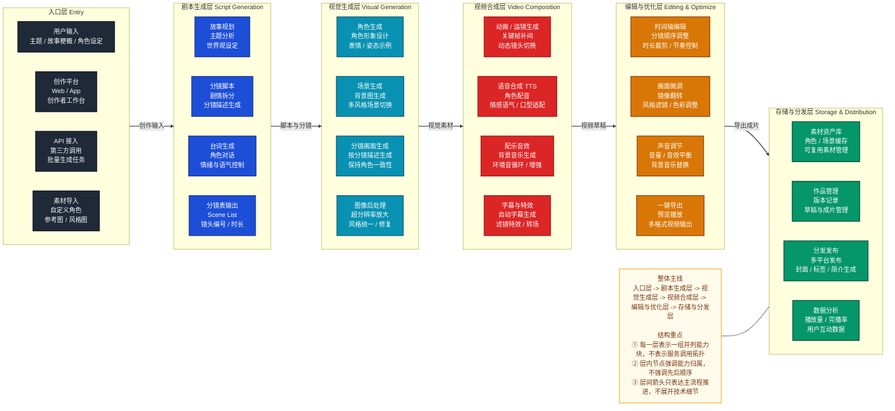

# AI 漫剧架构图 Mermaid 版

## 说明

本文件基于原图 [AI 漫剧架构图.jpg](./AI%20漫剧架构图.jpg) 改写为 Mermaid 版本。

原图的表达方式本质上是“层级结构图 + 主流程贯穿”，不是技术调用架构图。

这里保留同样的核心结构：

- 入口层
- 剧本生成层
- 视觉生成层
- 视频合成层
- 编辑与优化层
- 存储与分发层

同时保留原图的主链路：`入口层 -> 剧本生成层 -> 视觉生成层 -> 视频合成层 -> 编辑与优化层 -> 存储与分发层`

## Mermaid 图

## 图解说明

这张图回答的是：AI 漫剧系统通常按哪些能力层来组织，以及主生产链路如何自上而下推进。

建议先看纵向层级：

`入口层 -> 剧本生成层 -> 视觉生成层 -> 视频合成层 -> 编辑与优化层 -> 存储与分发层`

这是原图最核心的层级结构。

最关键的理解方式有 3 点：

- 先按“层”看，不要先按“服务调用”看。
- 每一层中的节点是并列能力块，不是严格时序步骤。
- 层与层之间的箭头只表示主流程推进，不表示完整的数据流细节。

## 没覆盖的内容

这张图主要保留了原图的“层级结构表达”，没有展开以下内容：

- 具体技术服务之间的调用关系
- 审核、风控、内容安全链路
- 模型网关、消息队列、对象存储等基础设施细节
- 单次生成任务的时序和状态迁移

如果后续需要，可以继续补两张图：

1. `技术架构图`
   - 展开服务之间的调用关系、存储和异步链路
2. `流程图`
   - 展开一次 AI 漫剧生成任务的详细处理步骤
