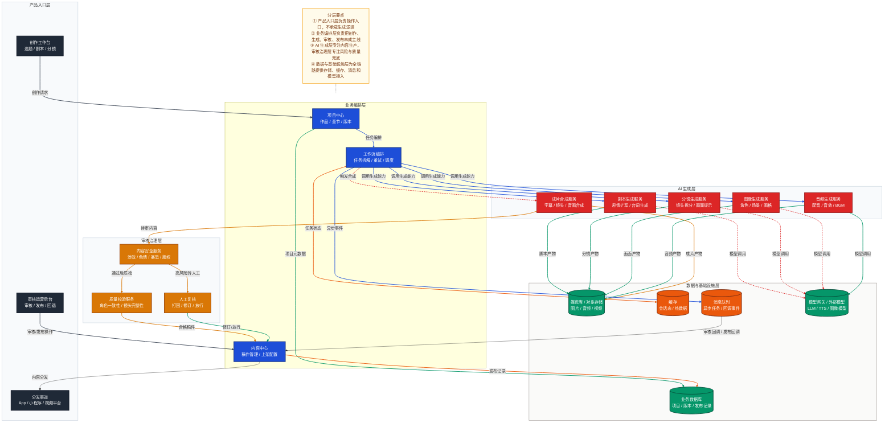
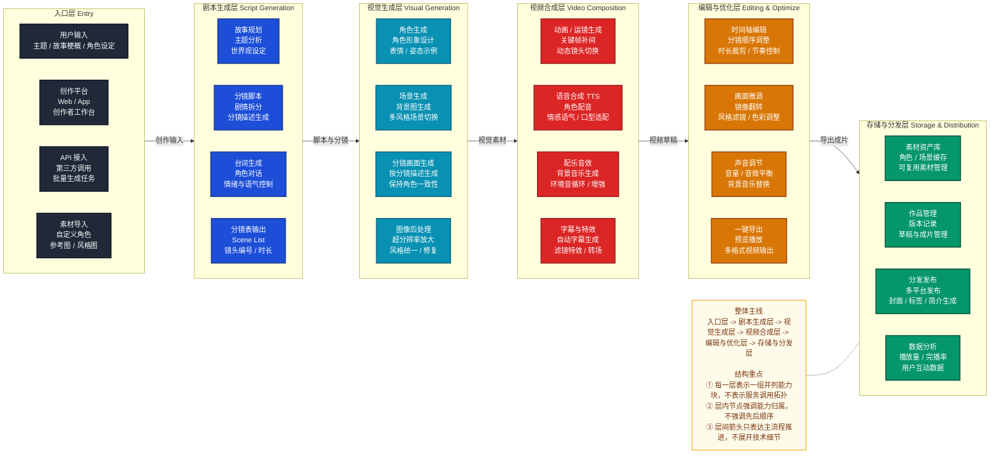
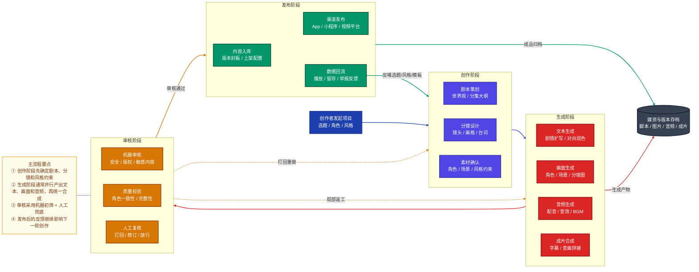
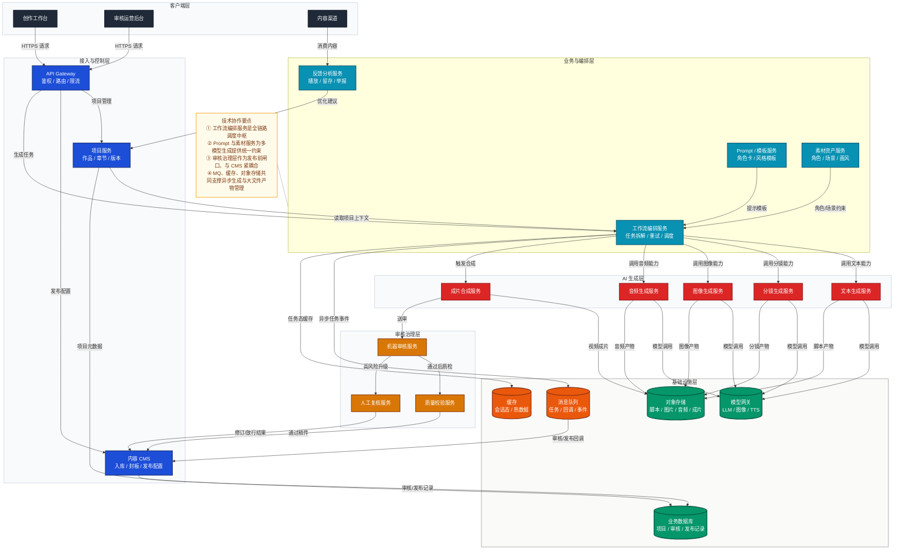
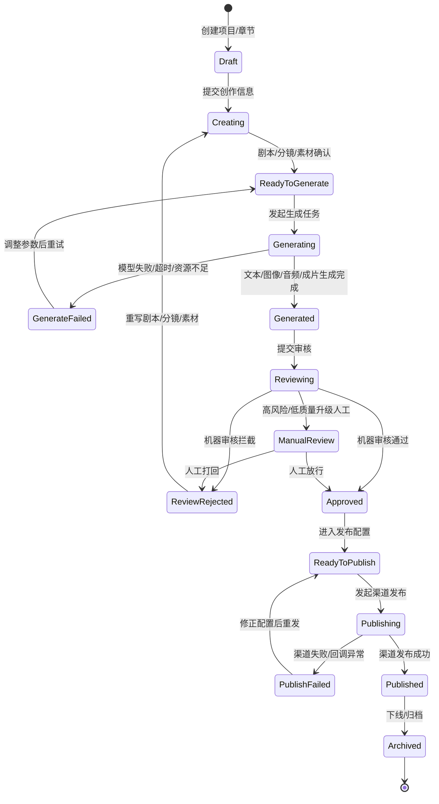

# AI 漫剧系统架构说明

## 1. 文档目标

本文档用于帮助快速理解 AI 漫剧系统在“创作、生成、审核、发布”主线上的整体结构、关键服务协作方式以及核心状态迁移。

本文档包含 5 张主图：

1. 平台分层图
2. 分层能力结构图
3. 流程图
4. 技术架构图
5. 状态图

建议阅读顺序：

1. 先看平台分层图，建立全局认知
2. 再看分层能力结构图，理解产品级分层总览
3. 再看流程图，理解主业务链路
4. 再看技术架构图，理解服务协作
5. 最后看状态图，理解生命周期和异常回路

---

## 2. 平台分层图

这张图回答：系统通常分成哪些层，每层负责什么，主线如何穿过这些层。

**阅读重点**

- 先看中间三层：业务编排层、AI 生成层、审核治理层。
- `工作流编排` 是全链路中枢。
- `审核治理层` 是发布前闸口。
- `数据与基础设施层` 为全链路提供支撑，但不承载业务决策。

---

## 3. 分层能力结构图

这张图回答：AI 漫剧系统按哪些阶段或能力域分层展开，每层里有哪些并列能力块，以及主生产链路如何从上游推进到下游。

**阅读重点**

- 先按“层”看，不要先按“服务调用”看。
- 每一层中的节点是并列能力块，不是严格时序步骤。
- 层与层之间的箭头只表示主流程推进，不表示完整的数据流细节。

这张图和平台分层图的区别是：

- 平台分层图更偏职责边界和层间协作。
- 分层能力结构图更偏产品能力总览和阶段式组织。
- AI 漫剧这类“创作层 -> 生成层 -> 合成层 -> 分发层”的表达，更适合用分层能力结构图承载。

---

## 4. 流程图

这张图回答：AI 漫剧从立项到发布，主流程怎么走。

**阅读重点**

- 主线是：创作 → 生成 → 审核 → 发布。
- 审核阶段是最大分叉点。
- 发布后的数据回流会反哺下一轮创作，不是终点。

---

## 5. 技术架构图

这张图回答：关键服务如何协作，哪些组件在关键路径上。

**阅读重点**

- `工作流编排服务` 是技术中枢。
- `Prompt / 模板服务` 和 `素材资产服务` 为生成提供统一约束。
- `CMS + 审核治理层` 共同构成发布控制面。
- `对象存储 + MQ + 缓存` 是高频基础设施组合。

---

## 6. 状态图

这张图回答：作品或章节在生产链路中会经历哪些状态，什么事件会推进或回退。

**阅读重点**

- 主线状态是：`Draft → Creating → ReadyToGenerate → Generating → Generated → Reviewing → Approved → ReadyToPublish → Publishing → Published`
- `Reviewing` 是最大分流状态。
- `GenerateFailed` 和 `PublishFailed` 是系统常见失败回路。

---

## 7. 总结

这 5 张图分别回答不同问题：

- 平台分层图：系统分几层，每层负责什么
- 分层能力结构图：系统按哪些阶段或能力域分层展开
- 流程图：创作到发布主线如何推进
- 技术架构图：关键服务如何协作
- 状态图：作品生命周期如何迁移

如果后续继续扩展，优先建议补两类图：

1. `时序图`
   适合看“一次生成任务谁先调谁”
2. `模块依赖图`
   适合看“编排模块、审核模块、CMS 模块之间的代码依赖关系”
