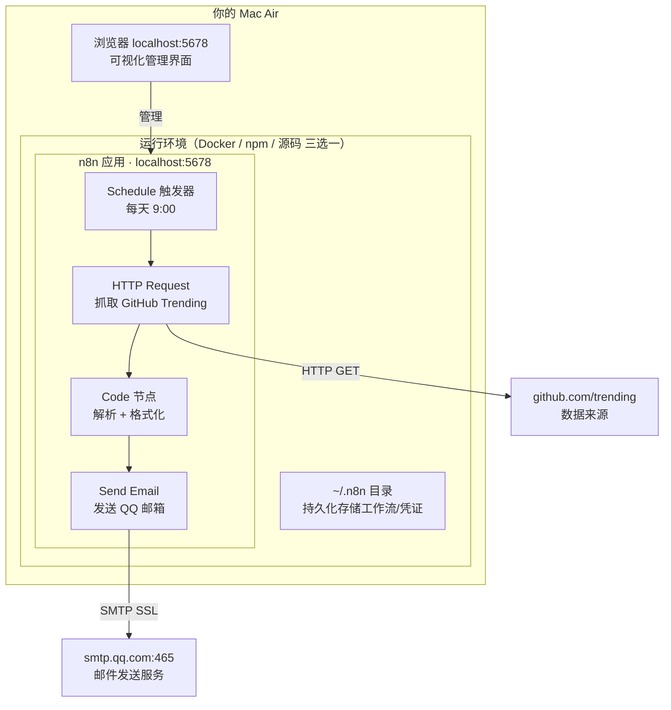
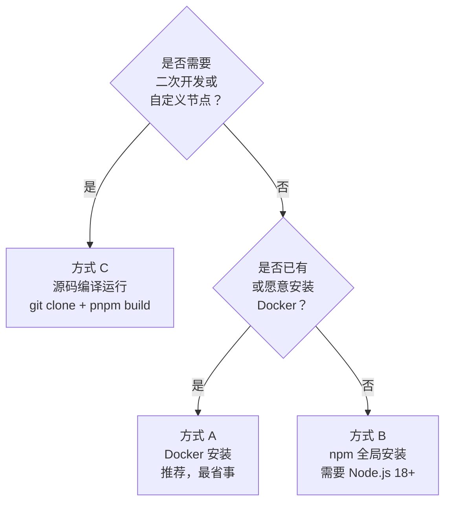
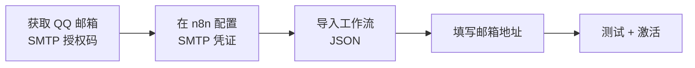
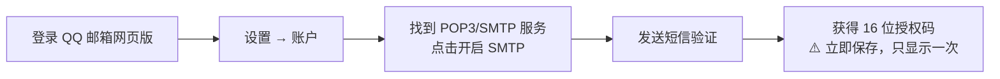
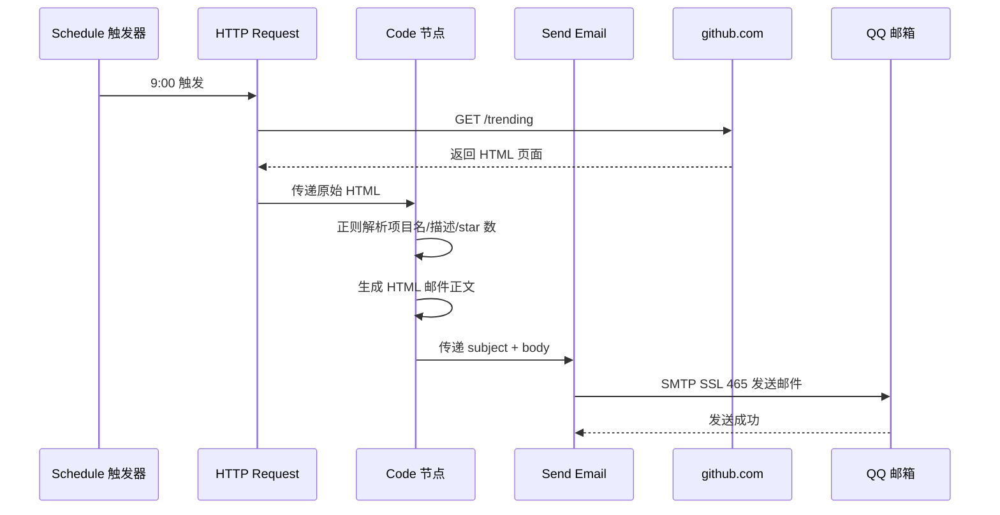

# # Mac Air 本地部署 n8n：GitHub Trending 每日推送 QQ 邮箱

## 目录

1. [心智模型：n8n 是什么](#1-心智模型n8n-是什么)
2. [安装方式选择](#2-安装方式选择)
3. [方式 A：Docker 安装（推荐）](#3-方式-a-docker-安装推荐)
4. [方式 B：npm 全局安装](#4-方式-b-npm-全局安装)
5. [方式 C：源码编译运行](#5-方式-c-源码编译运行)
6. [配置工作流：GitHub Trending 推送 QQ 邮箱](#6-配置工作流github-trending-推送-qq-邮箱)
7. [工作流数据流说明](#7-工作流数据流说明)
8. [日常维护](#8-日常维护)
9. [常见问题](#9-常见问题)

---

## 1. 心智模型：n8n 是什么

n8n 是一个开源的工作流自动化工具。你用可视化界面连接各种服务节点，设定触发条件，它就自动帮你执行任务。核心概念只有三个：**触发器**（何时开始）、**节点**（做什么）、**工作流**（把节点连起来的配方）。

源码地址：[https://github.com/n8n-io/n8n](https://github.com/n8n-io/n8n)

**本文目标架构：**



---

## 2. 安装方式选择

n8n 有三种安装方式，本质上都是同一份源码，只是运行环境不同：



|  | 方式 A：Docker | 方式 B：npm | 方式 C：源码 |
|---|---|---|---|
| 适合场景 | 只想用，不改代码 | 轻量体验，无 Docker | 二次开发，定制节点 |
| 前置依赖 | Docker Desktop | Node.js 18+ | Node.js 18+ / pnpm |
| 数据隔离 | 容器内，独立干净 | 全局环境 | 本地目录 |
| 升级方式 | `docker pull` | `npm update -g n8n` | `git pull` + 重新编译 |
| 推荐指数 | ⭐⭐⭐⭐⭐ | ⭐⭐⭐ | ⭐⭐ |

> 三种方式的工作流数据都存储在 `~/.n8n` 目录，随时可以互相切换，数据不丢失。

---

## 3. 方式 A：Docker 安装（推荐）

### 3.1 安装 Docker Desktop

前往 [https://www.docker.com/products/docker-desktop/](https://www.docker.com/products/docker-desktop/) 下载，根据芯片选择：

- Apple Silicon（M1/M2/M3）→ 选 **Apple Silicon**
- Intel 芯片 → 选 **Intel Chip**

安装后打开 Docker Desktop，顶栏鲸鱼图标变绿即运行正常。

```bash
# 验证安装
docker --version
```

### 3.2 启动 n8n

```bash
docker run -d \
  --name n8n \
  --restart unless-stopped \
  -p 5678:5678 \
  -v ~/.n8n:/home/node/.n8n \
  -e GENERIC_TIMEZONE="Asia/Shanghai" \
  -e TZ="Asia/Shanghai" \
  n8nio/n8n
```

| 参数 | 说明 |
|---|---|
| `-d` | 后台运行，不占用终端 |
| `--restart unless-stopped` | 重启 Mac 后自动恢复运行 |
| `-p 5678:5678` | 映射端口，浏览器可访问 |
| `-v ~/.n8n:/home/node/.n8n` | 数据持久化到本地，删除容器不丢数据 |
| `-e TZ="Asia/Shanghai"` | 设置时区，确保定时器准确 |

浏览器打开 [http://localhost:5678](http://localhost:5678)，注册本地账号即可使用。

---

## 4. 方式 B：npm 全局安装

不需要 Docker，适合轻量体验。前置条件：已安装 Node.js 18+（用 `node --version` 确认）。

```bash
# 安装
npm install -g n8n

# 启动
n8n start
```

启动后访问 [http://localhost:5678](http://localhost:5678)。

如需后台持久运行，配合 `pm2`：

```bash
npm install -g pm2
pm2 start n8n
pm2 save
pm2 startup   # 设置开机自启
```

---

## 5. 方式 C：源码编译运行

适合想二次开发、编写自定义节点，或研究 n8n 内部实现的场景。

### 5.1 克隆源码

```bash
git clone https://github.com/n8n-io/n8n.git
cd n8n
```

### 5.2 源码结构

n8n 是 monorepo，核心包在 `packages/` 目录下：

```
packages/
├── cli/          # 主程序入口
├── core/         # 核心引擎
├── editor-ui/    # 前端界面（Vue 3）
├── nodes-base/   # 内置节点（400+）
└── workflow/     # 工作流执行逻辑
```

### 5.3 编译并启动

```bash
# 安装 pnpm（n8n 使用 pnpm 管理 monorepo）
npm install -g pnpm

# 安装依赖
pnpm install

# 编译
pnpm build

# 启动
pnpm start
```

### 5.4 开发模式（热更新）

```bash
pnpm dev
```

修改源码后自动重新编译，适合调试和开发自定义节点。

---

## 6. 配置工作流：GitHub Trending 推送 QQ 邮箱

> 以下步骤与安装方式无关，三种方式安装完成后操作完全相同。

### 操作总览



### 6.1 获取 QQ 邮箱 SMTP 授权码



> **注意**：授权码形如 `abcdefghijklmnop`，是 n8n 里的"邮箱密码"，**不是 QQ 登录密码**。

### 6.2 在 n8n 配置 SMTP 凭证

左侧菜单 → `Credentials` → `New` → 搜索 `SMTP` → 填入：

| 字段 | 值 |
|---|---|
| Host | `smtp.qq.com` |
| Port | `465` |
| SSL | 开启 |
| User | `你的QQ号@qq.com` |
| Password | 6.1 获取的授权码 |

### 6.3 导入工作流 JSON

右上角 `+` 新建工作流 → 菜单 → `Import from JSON` → 粘贴以下内容：

```json
{
  "name": "GitHub Trending 每日推送",
  "nodes": [
    {
      "parameters": {
        "rule": { "interval": [{ "field": "hours", "hoursInterval": 24 }] },
        "triggerAtHour": 9
      },
      "name": "每天9点触发",
      "type": "n8n-nodes-base.scheduleTrigger",
      "position": [240, 300]
    },
    {
      "parameters": {
        "url": "https://github.com/trending",
        "options": {}
      },
      "name": "抓取 GitHub Trending",
      "type": "n8n-nodes-base.httpRequest",
      "position": [460, 300]
    },
    {
      "parameters": {
        "jsCode": "const html = $input.first().json.data;\nconst repos = [];\nconst regex = /<article[^>]*class=\"Box-row\"[^>]*>([\\s\\S]*?)<\\/article>/g;\nlet match;\nwhile ((match = regex.exec(html)) !== null && repos.length < 10) {\n  const block = match[1];\n  const nameMatch = block.match(/href=\"\\/([^\"]+)\"[^>]*>\\s*([\\s\\S]*?)<\\/a>/);\n  const descMatch = block.match(/<p[^>]*class=\"[^\"]*color-fg-muted[^\"]*\"[^>]*>\\s*([\\s\\S]*?)\\s*<\\/p>/);\n  const starMatch = block.match(/aria-label=\"[^\"]*stars\"[^>]*>[\\s\\S]*?([\\d,]+)\\s*<\\/a>/);\n  const langMatch = block.match(/<span[^>]*itemprop=\"programmingLanguage\"[^>]*>([^<]+)<\\/span>/);\n  const todayMatch = block.match(/([\\d,]+)\\s*stars today/);\n  if (nameMatch) {\n    repos.push({\n      name: nameMatch[1].trim(),\n      desc: descMatch ? descMatch[1].replace(/<[^>]+>/g,'').trim() : '暂无描述',\n      stars: starMatch ? starMatch[1] : '?',\n      lang: langMatch ? langMatch[1].trim() : '未知',\n      today: todayMatch ? todayMatch[1] : '?',\n      url: 'https://github.com/' + nameMatch[1].trim()\n    });\n  }\n}\nconst date = new Date().toLocaleDateString('zh-CN');\nlet html_body = `<h2>GitHub Trending 日报 · ${date}</h2><p>今日最热门的 ${repos.length} 个开源项目：</p>`;\nrepos.forEach((r, i) => {\n  html_body += `<div style=\"margin:16px 0;padding:12px;border-left:3px solid #0366d6;background:#f6f8fa\">`;\n  html_body += `<h3 style=\"margin:0 0 6px\">${i+1}. <a href=\"${r.url}\">${r.name}</a></h3>`;\n  html_body += `<p style=\"margin:4px 0;color:#586069\">${r.desc}</p>`;\n  html_body += `<p style=\"margin:4px 0;font-size:13px\">⭐ 总星数: ${r.stars} &nbsp;|&nbsp; 今日新增: +${r.today} stars &nbsp;|&nbsp; 语言: ${r.lang}</p>`;\n  html_body += `</div>`;\n});\nreturn [{ json: { subject: `GitHub Trending 日报 · ${date}`, body: html_body } }];"
      },
      "name": "解析并格式化",
      "type": "n8n-nodes-base.code",
      "position": [680, 300]
    },
    {
      "parameters": {
        "fromEmail": "你的QQ号@qq.com",
        "toEmail": "收件人@qq.com",
        "subject": "={{ $json.subject }}",
        "emailType": "html",
        "message": "={{ $json.body }}",
        "options": {}
      },
      "name": "发送邮件",
      "type": "n8n-nodes-base.emailSend",
      "position": [900, 300],
      "credentials": { "smtp": { "id": "1", "name": "QQ邮箱 SMTP" } }
    }
  ],
  "connections": {
    "每天9点触发": { "main": [[{ "node": "抓取 GitHub Trending", "type": "main", "index": 0 }]] },
    "抓取 GitHub Trending": { "main": [[{ "node": "解析并格式化", "type": "main", "index": 0 }]] },
    "解析并格式化": { "main": [[{ "node": "发送邮件", "type": "main", "index": 0 }]] }
  }
}
```

导入后点击"发送邮件"节点，将 `fromEmail` 和 `toEmail` 替换为真实 QQ 邮箱地址，并将 Credentials 选择 6.2 创建的凭证。

### 6.4 测试并激活

点击右上角 `Test workflow` 手动触发一次，确认 QQ 邮箱收到邮件后，点击 `Active` 开关激活，之后每天早上 9:00 自动运行。

---

## 7. 工作流数据流说明



---

## 8. 日常维护

### 方式 A（Docker）

```bash
docker ps                          # 查看运行状态
docker stop n8n                    # 停止
docker start n8n                   # 启动
docker logs n8n --tail 50          # 查看日志（排错用）
docker pull n8nio/n8n              # 拉取最新镜像
docker stop n8n && docker rm n8n   # 删除容器（数据不丢失）
# 删除后重新执行第 3 节的 docker run 命令即完成升级
```

### 方式 B（npm）

```bash
npm update -g n8n    # 升级到最新版
n8n start            # 启动
pm2 restart n8n      # 若用 pm2 管理，重启
pm2 logs n8n         # 查看日志
```

### 方式 C（源码）

```bash
git pull             # 拉取最新源码
pnpm install         # 更新依赖
pnpm build           # 重新编译
pnpm start           # 启动
```

---

## 9. 常见问题

**Q：关闭 Mac 后工作流还会运行吗？**
不会，n8n 运行在本地，Mac 休眠或关机时不执行。如需 24 小时运行，考虑部署到云服务器（如阿里云轻量服务器，约 ¥25/月）。

**Q：GitHub Trending 解析失败怎么办？**
GitHub 会不定期调整页面结构导致正则失效。可改用第三方 API `https://github-trending-api.waite.info/repositories`，返回标准 JSON，更稳定。

**Q：邮件发送失败提示认证错误？**
检查授权码是否正确（不是 QQ 登录密码），以及 QQ 邮箱设置里 SMTP 服务是否已开启。

**Q：三种安装方式的数据互通吗？**
工作流配置都存储在 `~/.n8n` 目录，切换安装方式后数据完全保留。

## 目录

1. [心智模型：n8n 是什么](#1-心智模型n8n-是什么)
2. [安装方式选择](#2-安装方式选择)
3. [方式 A：Docker 安装（推荐）](#3-方式-a-docker-安装推荐)
4. [方式 B：npm 全局安装](#4-方式-b-npm-全局安装)
5. [方式 C：源码编译运行](#5-方式-c-源码编译运行)
6. [配置工作流：GitHub Trending 推送 QQ 邮箱](#6-配置工作流github-trending-推送-qq-邮箱)
7. [工作流数据流说明](#7-工作流数据流说明)
8. [日常维护](#8-日常维护)
9. [常见问题](#9-常见问题)

---

## 1. 心智模型：n8n 是什么

n8n 是一个开源的工作流自动化工具。你用可视化界面连接各种服务节点，设定触发条件，它就自动帮你执行任务。核心概念只有三个：**触发器**（何时开始）、**节点**（做什么）、**工作流**（把节点连起来的配方）。

源码地址：[https://github.com/n8n-io/n8n](https://github.com/n8n-io/n8n)

**本文目标架构：**


---

## 2. 安装方式选择

n8n 有三种安装方式，本质上都是同一份源码，只是运行环境不同：


|  | 方式 A：Docker | 方式 B：npm | 方式 C：源码 |
|---|---|---|---|
| 适合场景 | 只想用，不改代码 | 轻量体验，无 Docker | 二次开发，定制节点 |
| 前置依赖 | Docker Desktop | Node.js 18+ | Node.js 18+ / pnpm |
| 数据隔离 | 容器内，独立干净 | 全局环境 | 本地目录 |
| 升级方式 | `docker pull` | `npm update -g n8n` | `git pull` + 重新编译 |
| 推荐指数 | ⭐⭐⭐⭐⭐ | ⭐⭐⭐ | ⭐⭐ |

> 三种方式的工作流数据都存储在 `~/.n8n` 目录，随时可以互相切换，数据不丢失。

---

## 3. 方式 A：Docker 安装（推荐）

### 3.1 安装 Docker Desktop

前往 [https://www.docker.com/products/docker-desktop/](https://www.docker.com/products/docker-desktop/) 下载，根据芯片选择：

- Apple Silicon（M1/M2/M3）→ 选 **Apple Silicon**
- Intel 芯片 → 选 **Intel Chip**

安装后打开 Docker Desktop，顶栏鲸鱼图标变绿即运行正常。

```bash
# 验证安装
docker --version
```

### 3.2 启动 n8n

```bash
docker run -d \
  --name n8n \
  --restart unless-stopped \
  -p 5678:5678 \
  -v ~/.n8n:/home/node/.n8n \
  -e GENERIC_TIMEZONE="Asia/Shanghai" \
  -e TZ="Asia/Shanghai" \
  n8nio/n8n
```

| 参数 | 说明 |
|---|---|
| `-d` | 后台运行，不占用终端 |
| `--restart unless-stopped` | 重启 Mac 后自动恢复运行 |
| `-p 5678:5678` | 映射端口，浏览器可访问 |
| `-v ~/.n8n:/home/node/.n8n` | 数据持久化到本地，删除容器不丢数据 |
| `-e TZ="Asia/Shanghai"` | 设置时区，确保定时器准确 |

浏览器打开 [http://localhost:5678](http://localhost:5678)，注册本地账号即可使用。

---

## 4. 方式 B：npm 全局安装

不需要 Docker，适合轻量体验。前置条件：已安装 Node.js 18+（用 `node --version` 确认）。

```bash
# 安装
npm install -g n8n

# 启动
n8n start
```

启动后访问 [http://localhost:5678](http://localhost:5678)。

如需后台持久运行，配合 `pm2`：

```bash
npm install -g pm2
pm2 start n8n
pm2 save
pm2 startup   # 设置开机自启
```

---

## 5. 方式 C：源码编译运行

适合想二次开发、编写自定义节点，或研究 n8n 内部实现的场景。

### 5.1 克隆源码

```bash
git clone https://github.com/n8n-io/n8n.git
cd n8n
```

### 5.2 源码结构

n8n 是 monorepo，核心包在 `packages/` 目录下：

```
packages/
├── cli/          # 主程序入口
├── core/         # 核心引擎
├── editor-ui/    # 前端界面（Vue 3）
├── nodes-base/   # 内置节点（400+）
└── workflow/     # 工作流执行逻辑
```

### 5.3 编译并启动

```bash
# 安装 pnpm（n8n 使用 pnpm 管理 monorepo）
npm install -g pnpm

# 安装依赖
pnpm install

# 编译
pnpm build

# 启动
pnpm start
```

### 5.4 开发模式（热更新）

```bash
pnpm dev
```

修改源码后自动重新编译，适合调试和开发自定义节点。

---

## 6. 配置工作流：GitHub Trending 推送 QQ 邮箱

> 以下步骤与安装方式无关，三种方式安装完成后操作完全相同。

### 操作总览


### 6.1 获取 QQ 邮箱 SMTP 授权码


> **注意**：授权码形如 `abcdefghijklmnop`，是 n8n 里的"邮箱密码"，**不是 QQ 登录密码**。

### 6.2 在 n8n 配置 SMTP 凭证

左侧菜单 → `Credentials` → `New` → 搜索 `SMTP` → 填入：

| 字段 | 值 |
|---|---|
| Host | `smtp.qq.com` |
| Port | `465` |
| SSL | 开启 |
| User | `你的QQ号@qq.com` |
| Password | 6.1 获取的授权码 |

### 6.3 导入工作流 JSON

右上角 `+` 新建工作流 → 菜单 → `Import from JSON` → 粘贴以下内容：

```json
{
  "name": "GitHub Trending 每日推送",
  "nodes": [
    {
      "parameters": {
        "rule": { "interval": [{ "field": "hours", "hoursInterval": 24 }] },
        "triggerAtHour": 9
      },
      "name": "每天9点触发",
      "type": "n8n-nodes-base.scheduleTrigger",
      "position": [240, 300]
    },
    {
      "parameters": {
        "url": "https://github.com/trending",
        "options": {}
      },
      "name": "抓取 GitHub Trending",
      "type": "n8n-nodes-base.httpRequest",
      "position": [460, 300]
    },
    {
      "parameters": {
        "jsCode": "const html = $input.first().json.data;\nconst repos = [];\nconst regex = /<article[^>]*class=\"Box-row\"[^>]*>([\\s\\S]*?)<\\/article>/g;\nlet match;\nwhile ((match = regex.exec(html)) !== null && repos.length < 10) {\n  const block = match[1];\n  const nameMatch = block.match(/href=\"\\/([^\"]+)\"[^>]*>\\s*([\\s\\S]*?)<\\/a>/);\n  const descMatch = block.match(/<p[^>]*class=\"[^\"]*color-fg-muted[^\"]*\"[^>]*>\\s*([\\s\\S]*?)\\s*<\\/p>/);\n  const starMatch = block.match(/aria-label=\"[^\"]*stars\"[^>]*>[\\s\\S]*?([\\d,]+)\\s*<\\/a>/);\n  const langMatch = block.match(/<span[^>]*itemprop=\"programmingLanguage\"[^>]*>([^<]+)<\\/span>/);\n  const todayMatch = block.match(/([\\d,]+)\\s*stars today/);\n  if (nameMatch) {\n    repos.push({\n      name: nameMatch[1].trim(),\n      desc: descMatch ? descMatch[1].replace(/<[^>]+>/g,'').trim() : '暂无描述',\n      stars: starMatch ? starMatch[1] : '?',\n      lang: langMatch ? langMatch[1].trim() : '未知',\n      today: todayMatch ? todayMatch[1] : '?',\n      url: 'https://github.com/' + nameMatch[1].trim()\n    });\n  }\n}\nconst date = new Date().toLocaleDateString('zh-CN');\nlet html_body = `<h2>GitHub Trending 日报 · ${date}</h2><p>今日最热门的 ${repos.length} 个开源项目：</p>`;\nrepos.forEach((r, i) => {\n  html_body += `<div style=\"margin:16px 0;padding:12px;border-left:3px solid #0366d6;background:#f6f8fa\">`;\n  html_body += `<h3 style=\"margin:0 0 6px\">${i+1}. <a href=\"${r.url}\">${r.name}</a></h3>`;\n  html_body += `<p style=\"margin:4px 0;color:#586069\">${r.desc}</p>`;\n  html_body += `<p style=\"margin:4px 0;font-size:13px\">⭐ 总星数: ${r.stars} &nbsp;|&nbsp; 今日新增: +${r.today} stars &nbsp;|&nbsp; 语言: ${r.lang}</p>`;\n  html_body += `</div>`;\n});\nreturn [{ json: { subject: `GitHub Trending 日报 · ${date}`, body: html_body } }];"
      },
      "name": "解析并格式化",
      "type": "n8n-nodes-base.code",
      "position": [680, 300]
    },
    {
      "parameters": {
        "fromEmail": "你的QQ号@qq.com",
        "toEmail": "收件人@qq.com",
        "subject": "={{ $json.subject }}",
        "emailType": "html",
        "message": "={{ $json.body }}",
        "options": {}
      },
      "name": "发送邮件",
      "type": "n8n-nodes-base.emailSend",
      "position": [900, 300],
      "credentials": { "smtp": { "id": "1", "name": "QQ邮箱 SMTP" } }
    }
  ],
  "connections": {
    "每天9点触发": { "main": [[{ "node": "抓取 GitHub Trending", "type": "main", "index": 0 }]] },
    "抓取 GitHub Trending": { "main": [[{ "node": "解析并格式化", "type": "main", "index": 0 }]] },
    "解析并格式化": { "main": [[{ "node": "发送邮件", "type": "main", "index": 0 }]] }
  }
}
```

导入后点击"发送邮件"节点，将 `fromEmail` 和 `toEmail` 替换为真实 QQ 邮箱地址，并将 Credentials 选择 6.2 创建的凭证。

### 6.4 测试并激活

点击右上角 `Test workflow` 手动触发一次，确认 QQ 邮箱收到邮件后，点击 `Active` 开关激活，之后每天早上 9:00 自动运行。

---

## 7. 工作流数据流说明


---

## 8. 日常维护

### 方式 A（Docker）

```bash
docker ps                          # 查看运行状态
docker stop n8n                    # 停止
docker start n8n                   # 启动
docker logs n8n --tail 50          # 查看日志（排错用）
docker pull n8nio/n8n              # 拉取最新镜像
docker stop n8n && docker rm n8n   # 删除容器（数据不丢失）
# 删除后重新执行第 3 节的 docker run 命令即完成升级
```

### 方式 B（npm）

```bash
npm update -g n8n    # 升级到最新版
n8n start            # 启动
pm2 restart n8n      # 若用 pm2 管理，重启
pm2 logs n8n         # 查看日志
```

### 方式 C（源码）

```bash
git pull             # 拉取最新源码
pnpm install         # 更新依赖
pnpm build           # 重新编译
pnpm start           # 启动
```

---

## 9. 常见问题

**Q：关闭 Mac 后工作流还会运行吗？**
不会，n8n 运行在本地，Mac 休眠或关机时不执行。如需 24 小时运行，考虑部署到云服务器（如阿里云轻量服务器，约 ¥25/月）。

**Q：GitHub Trending 解析失败怎么办？**
GitHub 会不定期调整页面结构导致正则失效。可改用第三方 API `https://github-trending-api.waite.info/repositories`，返回标准 JSON，更稳定。

**Q：邮件发送失败提示认证错误？**
检查授权码是否正确（不是 QQ 登录密码），以及 QQ 邮箱设置里 SMTP 服务是否已开启。

**Q：三种安装方式的数据互通吗？**
工作流配置都存储在 `~/.n8n` 目录，切换安装方式后数据完全保留。