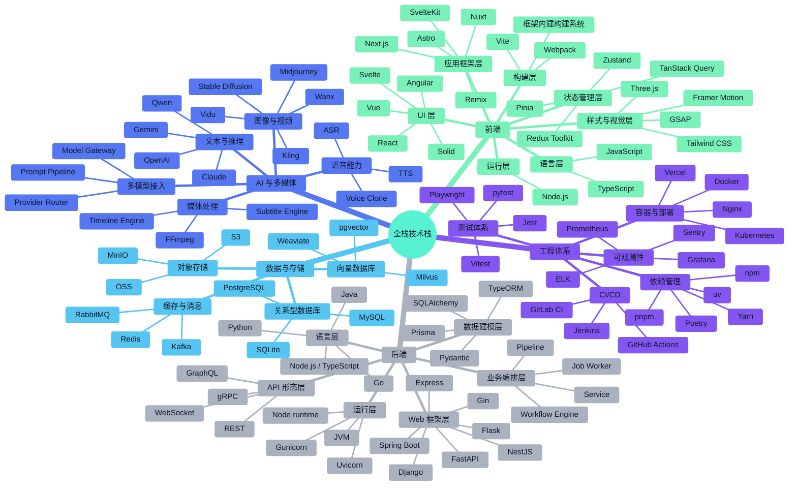

> **文档职责**：梳理主流全栈技术栈的框架家族与选型地图。
> **适用场景**：用于学习技术版图、做技术选型预研、理解不同技术的层次关系。
> **阅读目标**：快速建立“前端、后端、数据、AI、工程体系”各层主流技术的家族认知。

# 全栈框架家族与技术选型图谱

## 1. 使用说明

这份文档不是某个项目的落地方案，而是一个**主流全栈技术栈家族图谱**。  
目标是先帮助你建立“技术分层”和“技术家族”认知，再去做具体项目选型。

原则：

- 只收录主流、成熟、常见方案
- 偏大而全，但不收太末流的技术
- 每个节点只给一句简短说明

## 2. 全栈技术家族树

说明：`★` 表示当前更主流、选型时更常优先考虑的方案。

```text
全栈技术栈
├─ 前端
│  ├─ 语言层
│  │  ├─ JavaScript：前端基础语言
│  │  └─ TypeScript ★：带类型的 JavaScript，现代前端主流
│  ├─ UI 层
│  │  ├─ React ★：最主流的组件化 UI 库，适合复杂工作台
│  │  ├─ Vue ★：上手友好、官方体系完整，适合中小团队
│  │  ├─ Angular：企业级前端框架，规范完整但较重
│  │  ├─ Svelte：编译型前端方案，语法简洁
│  │  └─ Solid：强调性能与细粒度响应式
│  ├─ 应用框架层
│  │  ├─ Next.js ★：基于 React，适合中大型 Web 应用和平台
│  │  ├─ Nuxt ★：基于 Vue，适合中大型 Web 应用和内容站
│  │  ├─ Remix：基于 React，强调 Web 原生数据流
│  │  ├─ SvelteKit：基于 Svelte，适合现代前端应用
│  │  └─ Astro：偏内容站与多框架整合
│  ├─ 构建层
│  │  ├─ Vite ★：现代前端主流构建工具
│  │  ├─ Webpack：传统大型项目常见构建工具
│  │  └─ 框架内建构建系统 ★：如 Next.js / Nuxt 自带构建体系
│  ├─ 运行层
│  │  └─ Node.js ★：运行前端开发工具、SSR 服务和构建工具
│  ├─ 状态管理层
│  │  ├─ Zustand ★：轻量状态管理，适合 React 工作台
│  │  ├─ Redux Toolkit：规范化状态管理方案
│  │  ├─ TanStack Query ★：远程状态与请求缓存方案
│  │  └─ Pinia ★：Vue 生态主流状态管理方案
│  └─ 样式与视觉层
│     ├─ Tailwind CSS ★：工具类样式方案，现代前端常用
│     ├─ Framer Motion ★：React 生态常用动画库
│     ├─ Three.js ★：3D 与视觉表达能力
│     └─ GSAP：复杂动画与时间线控制库
├─ 后端
│  ├─ 语言层
│  │  ├─ Python ★：AI、脚本、数据处理和 API 场景强
│  │  ├─ Node.js / TypeScript：适合全栈统一语言栈
│  │  ├─ Go ★：高性能、高并发服务常见选择
│  │  └─ Java ★：企业级系统和大型平台常见
│  ├─ Web 框架层
│  │  ├─ FastAPI ★：Python 主流现代 API 框架
│  │  ├─ Django ★：Python 全功能 Web 框架
│  │  ├─ Flask：Python 轻量 Web 框架
│  │  ├─ NestJS ★：Node.js 企业级后端框架
│  │  ├─ Express：Node.js 经典轻量框架
│  │  ├─ Gin ★：Go 生态常见轻量 Web 框架
│  │  └─ Spring Boot ★：Java 企业级主流框架
│  ├─ 运行层
│  │  ├─ Uvicorn ★：FastAPI 常用 ASGI Server
│  │  ├─ Gunicorn：Python WSGI/ASGI 常见部署工具
│  │  ├─ Node runtime ★：运行 Node.js 服务
│  │  └─ JVM ★：运行 Java 服务
│  ├─ 数据建模层
│  │  ├─ Pydantic ★：Python 请求响应与对象建模主流方案
│  │  ├─ Prisma ★：Node.js 生态流行数据建模与 ORM 方案
│  │  ├─ SQLAlchemy ★：Python 常用 ORM
│  │  └─ TypeORM：Node.js 常见 ORM
│  ├─ 业务编排层
│  │  ├─ Service ★：最常见的业务组织方式
│  │  ├─ Pipeline ★：适合多步骤流程系统
│  │  ├─ Workflow Engine：适合复杂流程与自动化
│  │  └─ Job Worker ★：适合长任务和异步任务
│  └─ API 形态层
│     ├─ REST ★：最常见的 Web API 风格
│     ├─ GraphQL：适合复杂聚合查询
│     ├─ WebSocket ★：适合实时推送和协作
│     └─ gRPC：适合内部高性能服务调用
├─ 数据与存储
│  ├─ 关系型数据库
│  │  ├─ PostgreSQL ★：现代应用最常见主库之一
│  │  ├─ MySQL ★：经典主流关系型数据库
│  │  └─ SQLite：轻量本地数据库
│  ├─ 缓存与消息
│  │  ├─ Redis ★：缓存、队列、会话、任务常用
│  │  ├─ RabbitMQ：经典消息队列
│  │  └─ Kafka ★：高吞吐事件流平台
│  ├─ 对象存储
│  │  ├─ OSS：阿里云对象存储
│  │  ├─ S3 ★：对象存储事实标准
│  │  └─ MinIO：自建对象存储常见方案
│  └─ 向量数据库
│     ├─ Milvus ★：主流向量数据库
│     ├─ pgvector ★：基于 PostgreSQL 的向量扩展
│     └─ Weaviate：向量检索与语义搜索方案
├─ AI 与多媒体
│  ├─ 文本与推理
│  │  ├─ OpenAI ★：通用大模型与 API 平台代表
│  │  ├─ Qwen ★：中文与国产生态中常见
│  │  ├─ Claude ★：高质量通用推理模型代表
│  │  └─ Gemini ★：Google 系列多模态模型代表
│  ├─ 图像与视频
│  │  ├─ Stable Diffusion：开源图像生成代表
│  │  ├─ Midjourney：商业图像生成代表
│  │  ├─ Wanx ★：图像与视频生成能力
│  │  ├─ Kling ★：视频生成能力
│  │  └─ Vidu：视频生成能力
│  ├─ 语音能力
│  │  ├─ TTS ★：文本转语音
│  │  ├─ ASR ★：语音识别
│  │  └─ Voice Clone：声音克隆
│  ├─ 多模型接入
│  │  ├─ Provider Router ★：统一多个模型供应商
│  │  ├─ Model Gateway ★：统一认证、路由、限流
│  │  └─ Prompt Pipeline ★：统一提示词链路
│  └─ 媒体处理
│     ├─ FFmpeg ★：视频音频处理基础设施
│     ├─ Timeline Engine ★：时间线与剪辑控制
│     └─ Subtitle Engine：字幕生成与烧录
└─ 工程体系
   ├─ 依赖管理
   │  ├─ uv ★：现代 Python 依赖管理
   │  ├─ Poetry：Python 项目管理工具
   │  ├─ npm ★：Node.js 默认包管理器
   │  ├─ pnpm ★：更高效的 Node.js 包管理器
   │  └─ Yarn：Node.js 常见包管理器
   ├─ 测试体系
   │  ├─ pytest ★：Python 测试主流方案
   │  ├─ Vitest ★：现代前端测试方案
   │  ├─ Jest：经典前端测试方案
   │  └─ Playwright ★：E2E 自动化测试
   ├─ 容器与部署
   │  ├─ Docker ★：容器化标准方案
   │  ├─ Kubernetes ★：容器编排平台
   │  ├─ Vercel ★：前端托管与部署平台
   │  └─ Nginx：反向代理与静态资源分发
   ├─ CI/CD
   │  ├─ GitHub Actions ★：主流 CI/CD 平台
   │  ├─ GitLab CI：一体化 CI/CD 方案
   │  └─ Jenkins：经典 CI 平台
   └─ 可观测性
      ├─ Prometheus ★：指标采集
      ├─ Grafana ★：监控看板
      ├─ ELK：日志采集与分析
      └─ Sentry ★：异常监控
```

## 3. 全栈技术家族 Mermaid 图

这张图回答的问题是：**主流全栈技术栈通常由哪些技术家族构成。**



## 4. 分层速记

### 4.1 前端

- 语言层：写前端代码
- UI 层：写页面组件
- 应用框架层：组织整个前端应用
- 构建层：本地开发、热更新、打包构建
- 运行层：运行前端工具和服务

### 4.2 后端

- 语言层：写后端代码
- Web 框架层：提供 API 和路由
- 运行层：运行后端应用
- 数据建模层：定义请求、响应和对象结构
- 业务编排层：组织业务流程

### 4.3 数据与 AI

- 数据库：存业务数据
- 缓存与消息：提速和解耦
- 对象存储：存文件
- AI 能力层：文本、图像、视频、语音
- 媒体处理层：视频和音频处理

## 5. 适合怎么用这份图谱

- 做项目选型时，先确定每一层要解决什么问题
- 不要把“语言、框架、运行时、构建工具”混成一层比较
- 先选主干方案，再补配套方案
- 新项目优先看主流路线，不要一开始追求小众技术

## 6. 结论

如果你是从 Python 后端视角进入前端和全栈世界，这份图谱最重要的价值不是“记住所有技术名词”，而是：

- 先分清技术属于哪一层
- 再理解同层技术怎么比较
- 最后再做项目选型

这样看技术栈，就不会再把 `React / Next.js / Vite / Node.js` 混成一类了。
