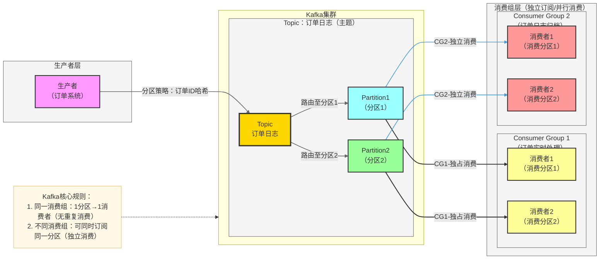

# 后端项目架构设计提示词模板

## 使用说明

> 将 `【xxx】` 中的占位内容替换为实际项目信息后使用。
> 可根据项目规模删减不需要的章节。

---

## 提示词正文

```
# 角色定义

你是一名拥有 10 年以上经验的资深后端架构师，精通分布式系统设计、微服务架构和高并发系统。
请基于我提供的项目初稿进行勘误和补全，输出一份结构清晰、层次分明的后端架构设计文档。
新增文档实现，不修改初稿

---

# 项目背景

- 项目名称：【AgentBasePlatform】
- 业务场景：【以 agentscope 作为核心框架，以 agentscope 生态圈组件为配套的多智能体平台】
- 目标用户：【中小企业、内部员工、小型开发者，预估规模 1000～5000 人】
- 预期 QPS/并发量：【如：峰值 100 QPS / 同时在线 1000】
- 数据规模预估：【如：初期 10 万级，年增长百万级】

---

# 技术栈约束

- 编程语言：【Python 3.10】
- Web 框架：【FastAPI】
- agent 框架：【agentscope】
- 数据库：【PostgreSQL（主库）+ Redis（缓存）】
- 消息队列：【RabbitMQ】
- 对象存储：【MinIO】
- 容器化：【Docker Compose】
- 其他中间件：【Celery】

---

# 输出要求

## 1. 整体架构设计
- 系统整体架构图（使用 Mermaid 绘制）
- 架构风格说明（单体 / 微服务 / 模块化单体）
- 各层职责划分（接入层、业务层、数据层、基础设施层）

## 2. 分模块架构设计
- 按业务域拆分模块，每个模块包含：
  - 模块职责说明
  - 核心接口定义（输入/输出）
  - 模块间依赖关系
  - 模块架构图（使用 Mermaid 绘制）

## 3. API 设计规范
- 接口风格：【RESTful】
- URL 命名规范
- 请求/响应统一格式
- 版本管理策略（如 /api/v1/）
- 认证方式（如 JWT）

## 4. 数据库设计
- 核心数据模型（ER 图，使用 Mermaid 绘制）
- 分库分表策略（如适用）
- 索引设计原则
- 数据迁移方案

## 5. 安全设计
- 认证与授权方案（RBAC / ABAC）
- 数据加密策略（传输层 / 存储层）
- 接口安全（限流、防重放、参数校验）
- 敏感数据处理规范

## 6. 非功能性需求
- 高可用设计（故障转移、健康检查）
- 可扩展性设计（水平扩展方案）
- 性能优化策略（缓存、异步、连接池）
- 容灾与备份策略

## 7. 通信与集成
- 服务间通信方式（同步 HTTP / 异步消息队列）
- 第三方服务集成方案
- 事件驱动设计（如适用）

## 8. 可观测性设计
- 日志规范（日志级别、结构化日志）
- 监控指标（系统指标 + 业务指标）
- 链路追踪方案
- 告警策略

## 9. 项目目录结构
- 给出完整的项目目录树
- 说明各目录/文件的职责

## 10. 实施路线图
- 分阶段实施计划（MVP → 迭代增强 → 生产就绪）
- 每阶段的核心交付物
- 里程碑与时间预估

---


## Mermaid 作图风格参考

> 在分析中使用 Mermaid 图表时，可参考以下风格规范，保持图表清晰美观。
> 这是一份风格参考而非硬性要求，根据实际图表复杂度灵活取舍。

### 风格要点

1. **配色与样式定义**：通过 `classDef` 预定义各类节点的颜色和边框样式，使不同层级或角色的组件在视觉上易于区分
2. **分层布局**：使用 `subgraph` 对节点进行逻辑分组，体现架构的层次关系（如生产者层、服务层、消费层等）
3. **连接线区分**：通过 `linkStyle` 对不同类型的连接线设置不同颜色和粗细，区分调用类型或数据流方向
4. **标签说明**：连接线上使用简明标签描述交互语义（如调用方式、数据类型等）
5. **辅助注释**：对核心规则或易混淆的概念，可通过 `Note` 节点附加说明

### 参考示例


---

# 约束条件

1. **定框架、定方向**：侧重架构决策和模块划分，避免过多实现细节
2. **结构清晰**：使用标题层级、表格、列表组织内容
3. **图文结合**：关键架构使用 Mermaid 图表达，避免纯文字描述
4. **可落地**：架构设计需考虑团队规模和技术储备，避免过度设计
5. **详细设计作为扩展**：每个模块预留"扩展设计"入口，后续可深入

---

# 输入材料

【在此粘贴你的项目设计初稿】
```
