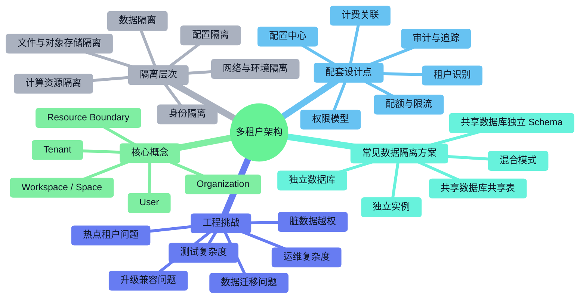

> **文档职责**：梳理多租户系统的核心概念、隔离层次、关键设计点与常见架构方案。
> **适用场景**：用于理解 SaaS 多租户架构、做多租户系统设计预研、判断隔离与成本之间的权衡。
> **阅读目标**：快速建立“多租户是什么、隔离隔在哪里、常见方案有哪些、这些方案会影响哪些工程设计”的整体认知。
> **目标读者**：需要从单体业务开发走向 SaaS 架构设计、平台设计、企业产品设计的工程师与架构设计者。

# 多租户架构设计图谱

## 1. 使用说明

这份文档不是某个具体项目的实现细节说明，而是一个**多租户架构认知图谱**。  
目标是先帮助你建立“租户隔离”这件事的完整概念，再去判断数据库、权限、配置、部署和运维应该怎么设计。

原则：

- 只讨论主流、成熟、常见的多租户架构思路
- 重点解释“隔离级别”和“工程影响”的关系
- 每个节点只给一句简短说明

## 2. 多租户架构家族树

说明：`★` 表示更常见、更值得优先掌握的设计点或方案。

```text
多租户架构
├─ 核心概念
│  ├─ Tenant ★：租户，系统中的客户或组织边界
│  ├─ User：租户内用户
│  ├─ Organization：租户内部组织结构
│  ├─ Workspace / Space：租户内业务空间划分
│  └─ Resource Boundary ★：资源归属边界，如数据、文件、配置、任务
├─ 隔离层次
│  ├─ 身份隔离 ★：账号、组织、角色、权限边界
│  ├─ 数据隔离 ★：表记录、Schema、数据库、实例隔离
│  ├─ 配置隔离 ★：租户级功能开关、模型配置、品牌配置
│  ├─ 计算资源隔离：任务队列、缓存、Worker、GPU/CPU 配额
│  ├─ 文件与对象存储隔离：Bucket、目录、命名空间隔离
│  └─ 网络与环境隔离：VPC、集群、命名空间、独立环境
├─ 常见数据隔离方案
│  ├─ 共享数据库共享表 ★：通过 tenant_id 做逻辑隔离，成本最低
│  ├─ 共享数据库独立 Schema：每个租户独立 Schema，隔离更强
│  ├─ 独立数据库 ★：每个租户独立数据库，常见于高价值客户
│  ├─ 独立实例：数据库、缓存、搜索、对象存储都独立
│  └─ 混合模式 ★：普通租户共享，高等级租户独立
├─ 配套设计点
│  ├─ 租户识别 ★：域名、子域名、Header、Token、组织上下文
│  ├─ 权限模型 ★：RBAC、ABAC、组织树、资源级授权
│  ├─ 配置中心 ★：租户级配置、套餐配置、功能开关
│  ├─ 配额与限流：存储、调用量、并发数、任务额度
│  ├─ 计费关联：套餐、增值模块、超额使用计费
│  └─ 审计与追踪：租户维度日志、操作记录、账单记录
├─ 工程挑战
│  ├─ 脏数据越权 ★：查询遗漏 tenant_id 或权限过滤
│  ├─ 热点租户问题：大客户拖垮共享资源
│  ├─ 升级兼容问题：不同租户版本与配置差异
│  ├─ 运维复杂度：共享与独立资源并存时治理困难
│  ├─ 数据迁移问题：共享模式切换到独立模式成本高
│  └─ 测试复杂度：权限、隔离、套餐组合导致测试面膨胀
└─ 常见适用路线
   ├─ 标准 SaaS ★：共享表或混合模式
   ├─ 企业级 SaaS ★：混合模式 + 更强权限与配置体系
   ├─ 政务 / 强监管：多租户较少，更多是单租户或强隔离模式
   └─ AI 平台型产品 ★：多租户 + 配额 + 模型配置 + 计费绑定
```

## 3. 多租户架构 Mermaid 图

这张图回答的问题是：**多租户系统通常隔离哪些东西，常见方案怎么选，以及这些选择会把工程体系推向哪里。**



## 4. 分层速记

这一节是对第 2 节“多租户架构家族树”的补充说明。  
第 2 节回答“多租户通常包含哪些设计维度”，第 4 节回答“这些维度具体意味着什么、怎样影响工程落地”。

### 4.1 多租户先要分清到底在隔离什么

- `租户` 不是用户账号，而是系统中的客户边界或组织边界
- `用户` 属于租户内部，通常还会挂在部门、角色、空间之下
- `资源边界` 决定数据、文件、任务、权限到底归属于哪个租户
- 多租户不只是“数据库加一个 tenant_id”，而是要在身份、数据、配置、算力、审计等多个层面一起成立

如果只在表里加了 `tenant_id`，但日志、对象存储、缓存、任务队列、权限判断没有同步隔离，那还不能算完整的多租户架构。

### 4.2 常见数据隔离方案怎么理解

- `共享数据库共享表`：成本最低、运维最轻，但最依赖严格的代码规范和权限过滤
- `共享数据库独立 Schema`：隔离比共享表强，但运维和迁移复杂度上升
- `独立数据库`：适合大客户、高价值客户、强隔离客户，但资源成本和运维成本更高
- `独立实例`：隔离最强，但通常接近单租户交付，适合少量高价值客户
- `混合模式`：把标准 SaaS 和重点客户路线放在一起，是现实项目里最常见的折中

可以把这一层理解为：你到底是更偏“规模效率”，还是更偏“隔离强度和客户控制权”。

### 4.3 多租户真正难的地方不只在数据库

- 租户识别：请求进入系统后，怎么稳定识别当前租户
- 权限模型：租户下是否还有组织、部门、角色、资源权限
- 配置中心：不同租户套餐、功能开关、品牌、模型、流程是否不同
- 配额与限流：不同租户是否有不同额度、并发和任务资源
- 审计与追踪：能否按租户维度定位问题、导出记录、做账单核对

很多系统表面上做了“租户隔离”，但真正出问题往往出在权限、配置、任务调度和对象存储这些外围系统。

### 4.4 多租户最常见的工程风险

- 查询遗漏租户过滤条件，导致越权读数据
- 后台任务没有带租户上下文，导致写错租户数据
- 缓存 key 没有带租户维度，导致数据串租
- 对象存储路径没有租户隔离，导致文件串读
- 大客户流量挤占共享资源，导致普通租户体验下降
- 共享模式发展到后期，需要迁移重点客户到独立资源，改造代价很高

所以多租户的本质不是“方便卖给很多客户”，而是“要长期维护一个共享平台还能保持边界清晰”。

### 4.5 什么时候适合多租户，什么时候不适合

- 标准化 SaaS 产品通常适合多租户，因为目标是规模化交付和统一运营
- 平台型 AI 产品也常适合多租户，因为要同时管理组织、模型、额度、计费和空间
- 面向大型企业时，往往不是纯多租户，而是混合模式
- 政务、涉密、强监管、强本地化项目，很多时候不适合共享式多租户

是否做多租户，关键不是“技术上能不能”，而是“你的客户结构、交付方式、合规要求是否支持共享平台路线”。

### 4.6 阅读这张图时的原则

- 先分清“租户”和“用户”不是同一个层次
- 先判断隔离边界，再决定数据库方案
- 不要只看数据库隔离，还要看缓存、文件、任务、日志、权限是否一起隔离
- 不要把“多租户”和“私有化部署”简单视为互斥，它们在现实里经常形成混合路线

## 5. 常见组合速记

```text
标准中小企业 SaaS
├── 目标：规模化获客与统一运营
├── 隔离策略：共享数据库共享表
├── 配套重点：tenant_id、权限过滤、配置中心、计费
└── 风险重点：串租、缓存污染、热点租户
```

```text
企业级 SaaS
├── 目标：兼顾规模化和重点客户诉求
├── 隔离策略：混合模式
├── 配套重点：组织权限、SSO、审计、独立资源切换能力
└── 风险重点：共享与独立并存导致运维复杂
```

```text
AI 平台型产品
├── 目标：组织空间 + 模型能力 + 额度计费
├── 隔离策略：多租户或混合模式
├── 配套重点：模型配置、配额、日志、账单、任务队列
└── 风险重点：算力资源争抢和租户级审计不足
```

## 6. 适合怎么用这份图谱

- 做 SaaS 方案预研时，先判断你的目标客户是否适合共享平台
- 做数据库设计时，不要只从 ORM 角度想，要先决定隔离级别
- 做权限体系时，把租户、组织、角色、空间作为一个整体来设计
- 做 AI 平台时，把模型配置、配额、计费、日志一开始就纳入租户维度

## 7. 结论

多租户架构的核心，不是“让多个客户共用一套系统”这么简单，而是：

- 先定义清楚租户边界
- 再决定隔离强度和共享范围
- 最后用权限、配置、计费、日志、任务和运维体系把这条边界真正做实

这样理解多租户，你就不会再把“表里有 tenant_id”和“系统已经具备成熟多租户能力”混成一回事了。
