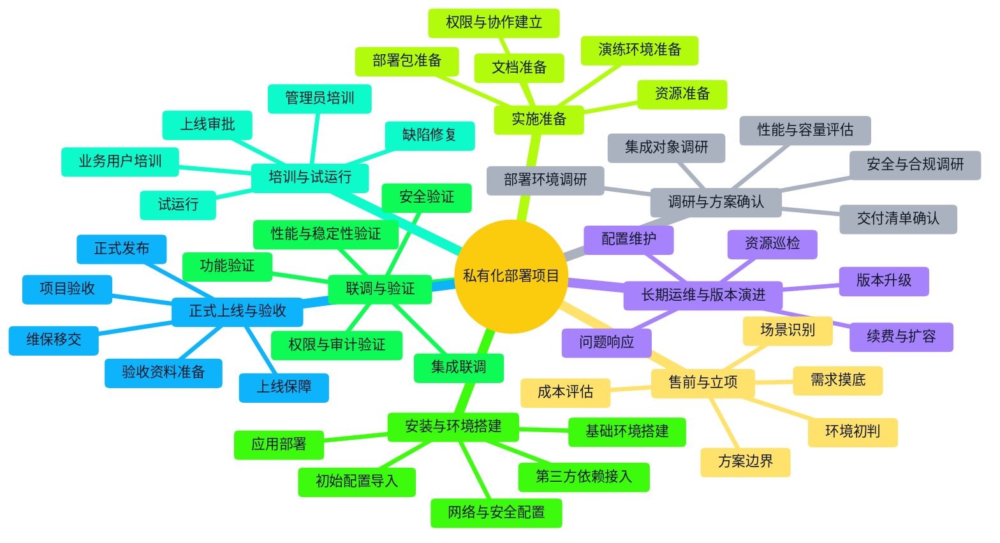

> **文档职责**：梳理私有化部署项目从售前评估到正式上线、再到长期运维的完整实施流程。
> **适用场景**：用于理解 ToB 私有化项目如何落地、判断项目实施关键环节、建立交付团队与技术团队协作认知。
> **阅读目标**：快速建立“私有化项目通常怎么推进、各阶段要做什么、常见风险在哪里、为什么这类项目和标准 SaaS 交付完全不同”的整体认知。
> **目标读者**：参与 ToB 项目、企业软件交付、AI 平台私有化落地、政企实施项目的工程师、技术负责人和方案设计者。

# 私有化部署项目实施全流程

## 1. 使用说明

这份文档不是某个客户项目的交付手册，而是一个**私有化部署项目实施认知图谱**。  
目标是先帮助你建立“私有化项目是如何推进的”整体视角，再去理解实施、研发、运维、客户 IT 之间如何协作。

原则：

- 只讨论主流、成熟、常见的私有化实施流程
- 重点解释“项目阶段”和“工程动作”的对应关系
- 每个阶段只保留关键任务与风险点

## 2. 私有化部署项目全流程树

说明：`★` 表示最关键、最容易决定项目成败的环节。

```text
私有化部署项目
├─ 0. 售前与立项
│  ├─ 场景识别 ★：客户为什么不能用标准 SaaS
│  ├─ 需求摸底 ★：业务目标、用户规模、接口需求、合规要求
│  ├─ 环境初判：云环境、本地机房、离线网、网络边界
│  ├─ 方案边界：标准产品、定制开发、集成开发各占多少
│  └─ 成本评估：实施成本、资源成本、后续运维成本
├─ 1. 调研与方案确认
│  ├─ 部署环境调研 ★：操作系统、容器环境、中间件、数据库、网络
│  ├─ 安全与合规调研 ★：账号体系、审计要求、数据出入边界
│  ├─ 集成对象调研 ★：SSO、OA、ERP、消息系统、存储系统
│  ├─ 性能与容量评估：并发量、存储量、模型算力、峰值任务
│  └─ 交付清单确认：交什么、谁负责、怎么验收
├─ 2. 实施准备
│  ├─ 资源准备 ★：服务器、网络、域名、证书、对象存储、数据库
│  ├─ 部署包准备 ★：镜像、安装包、配置模板、脚本、版本说明
│  ├─ 文档准备：部署手册、运维手册、回滚手册、排障手册
│  ├─ 权限与协作建立：客户 IT、实施、研发、运维协作机制
│  └─ 演练环境准备：测试环境、预发布环境、数据准备
├─ 3. 安装与环境搭建
│  ├─ 基础环境搭建 ★：容器、K8s、数据库、缓存、对象存储
│  ├─ 网络与安全配置 ★：域名、证书、防火墙、访问控制、白名单
│  ├─ 应用部署 ★：后端、前端、Worker、模型服务、网关服务
│  ├─ 第三方依赖接入：消息、认证、监控、日志、告警
│  └─ 初始配置导入：组织、角色、字典、模型、存储、系统参数
├─ 4. 联调与验证
│  ├─ 功能验证 ★：核心流程、关键页面、主业务链路
│  ├─ 集成联调 ★：SSO、接口、回调、文件系统、消息通道
│  ├─ 权限与审计验证：角色权限、操作记录、日志留存
│  ├─ 性能与稳定性验证：压测、并发、任务执行、容错
│  └─ 安全验证：漏洞扫描、口令策略、访问控制、审计检查
├─ 5. 培训与试运行
│  ├─ 管理员培训 ★：系统配置、用户管理、权限管理、巡检
│  ├─ 业务用户培训：核心使用流程和常见问题
│  ├─ 试运行 ★：小范围上线、真实数据验证、问题收集
│  ├─ 缺陷修复：问题分级、修复、复测、回归
│  └─ 上线审批：是否达到正式上线条件
├─ 6. 正式上线与验收
│  ├─ 正式发布 ★：版本切换、数据初始化、最终检查
│  ├─ 上线保障 ★：值守、应急响应、回滚预案
│  ├─ 验收资料准备：功能清单、测试记录、部署清单、培训记录
│  ├─ 项目验收 ★：按合同或里程碑做交付验收
│  └─ 维保移交：转交长期支持和运维阶段
└─ 7. 长期运维与版本演进
   ├─ 问题响应 ★：故障、工单、升级支持
   ├─ 版本升级 ★：补丁、功能升级、安全修复
   ├─ 配置维护：模型、字典、组织、权限、接口配置
   ├─ 资源巡检：CPU、内存、磁盘、日志、证书、备份
   └─ 续费与扩容：License、节点、存储、算力、模块扩展
```

## 3. 私有化部署 Mermaid 图

这张图回答的问题是：**一个私有化项目通常按什么阶段推进，每个阶段对应哪些关键动作。**



## 4. 分阶段速记

这一节是对第 2 节“私有化部署项目全流程树”的补充说明。  
第 2 节回答“私有化项目一般经历哪些阶段”，第 4 节回答“每个阶段在现实里到底要干什么、为什么会出问题”。

### 4.1 售前和立项阶段，核心不是报价，而是边界判断

- 客户为什么不能走标准 SaaS，是因为合规、网络隔离、组织策略，还是单纯习惯私有化
- 客户要的是“标准产品私有化”，还是“私有化 + 定制开发 + 系统集成”
- 资源环境有没有明显限制，比如必须离线、不能容器化、必须国产化、必须本地数据库
- 项目后续是谁维护，是客户自维、厂商托管，还是联合运维

私有化项目最怕的不是难部署，而是一开始就没有把边界说清，后期不断长出额外工作。

### 4.2 调研阶段，真正重要的是把客户环境看透

- 机器多少、网络怎么隔、能不能联网、能不能拉镜像
- 数据库、对象存储、消息系统是客户已有还是由项目自带
- 认证体系怎么接，是本地账号、LDAP、AD、CAS、OIDC 还是企业微信
- 日志、审计、监控、漏洞扫描有没有强制要求

很多技术问题不是代码能力问题，而是客户环境和安全要求决定了实现方式。

### 4.3 实施准备阶段，交付质量主要靠标准化产物

- 是否有稳定的部署包、镜像、版本说明和参数模板
- 是否有安装手册、回滚手册、排障手册和巡检清单
- 是否有测试环境或预发布环境做安装演练
- 是否提前拉通客户 IT、实施、研发、运维的联系人和问题响应方式

私有化项目一旦没有标准化交付物，就会高度依赖“某个熟悉环境的人”，风险很大。

### 4.4 安装和联调阶段，最耗时的常常不是应用本身

- 网络、域名、证书、白名单、防火墙常常比业务代码更耗时间
- SSO、文件系统、消息通道、回调接口往往是联调重点
- AI 平台类项目还要额外处理模型服务、GPU、推理服务、向量库和对象存储
- 权限、日志、审计、备份这些非功能项不能等到最后才补

也就是说，私有化不是“把程序跑起来”就结束，而是要把周边依赖一起打通。

### 4.5 上线与验收阶段，本质是从项目状态切到运营状态

- 试运行是为了用真实数据和真实用户把问题尽量提前暴露
- 正式上线前要明确回滚条件、责任人和应急群
- 验收不只是口头确认，通常要靠清单、记录、报告、培训资料来支撑
- 上线后项目不会结束，而是转入长期维保和版本演进阶段

很多团队把“部署完成”当作项目结束，这对私有化项目来说通常是错误判断。

### 4.6 私有化项目的常见风险

- 售前承诺超出产品边界，导致大量定制工作
- 客户环境不标准，实际部署成本远超预期
- 依赖客户第三方系统，但接口和协调资源迟迟不到位
- 没有标准化部署包和文档，交付高度依赖个别人
- 升级方案没有设计好，后续每次发版都像重新做项目
- 培训和运维移交不足，客户上线后无法独立使用或运维

私有化项目的难点，通常是“环境复杂 + 依赖多 + 协作链长”，不只是“技术更难”。

## 5. 常见角色分工速记

```text
售前 / 方案
├── 识别场景和边界
├── 输出方案与报价
└── 控制承诺范围
```

```text
实施 / 运维
├── 环境调研与安装部署
├── 联调排障与巡检
└── 培训与运维移交
```

```text
研发 / 架构
├── 提供可交付版本和标准化部署产物
├── 支持接口联调和复杂问题处理
└── 设计后续升级与扩容能力
```

## 6. 适合怎么用这份图谱

- 做私有化项目预研时，用它先拆出完整阶段，而不是直接进入部署
- 做交付团队建设时，用它判断哪些能力要标准化沉淀
- 做 AI 平台私有化时，把模型服务、算力、对象存储、日志审计一起纳入交付范围
- 做版本规划时，不只考虑首发，还要考虑后续升级是不是可重复交付

## 7. 结论

私有化部署项目的核心，不是“把系统装到客户机器上”，而是：

- 先确认边界和环境
- 再准备标准化交付物和协作机制
- 最后通过联调、培训、验收和维保，把项目真正变成客户可持续运行的系统

这样理解私有化交付，你就不会再把“私有化部署”和“复制一份 SaaS 到客户环境”混成一回事了。
