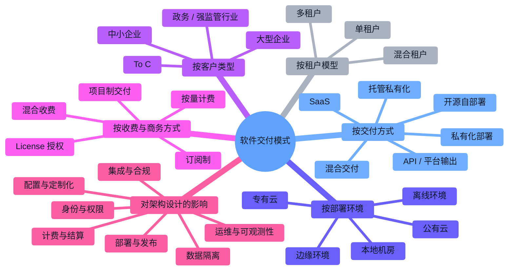

> **文档职责**：梳理主流软件交付模式、租户模型、部署环境及其对架构设计的影响。
> **适用场景**：用于建立产品交付认知、判断 SaaS 与私有化路线、做 ToB/ToC 方案预研。
> **阅读目标**：快速建立“软件怎么交付、系统怎么隔离、部署在哪里、这些选择会如何反向影响技术方案”的整体认知。
> **目标读者**：从功能开发走向产品设计、架构设计、技术选型和交付方案判断的工程师与 AI 产品开发者。

# 软件交付模式与架构影响图谱

## 1. 使用说明

这份文档不是某个项目的落地方案，而是一个**软件交付模式认知图谱**。  
目标是先帮助你分清“产品如何交付给客户”和“技术如何支撑这种交付”，再去做具体方案判断。

原则：

- 只收录主流、成熟、常见的软件交付模式
- 重点解释“交付模式”和“架构影响”的关系
- 每个节点只给一句简短说明

## 2. 软件交付模式家族树

说明：`★` 表示当前更常见、讨论频率更高、实际项目中更值得优先理解的模式。

```text
软件交付模式
├─ 按交付方式
│  ├─ SaaS ★：软件部署在服务方云上，客户按账号或订阅使用
│  ├─ 私有化部署 ★：软件部署在客户环境，适合高控制和高合规场景
│  ├─ 托管私有化：软件逻辑独立部署给客户，但仍由服务方代运维
│  ├─ 混合交付：标准功能走 SaaS，敏感模块走专属部署
│  ├─ 开源自部署：厂商提供开源版本，用户自行安装与维护
│  └─ API / 平台输出 ★：不直接交付完整业务系统，而是交付能力接口或平台能力
├─ 按租户模型
│  ├─ 多租户 ★：多个客户共享一套系统，通过逻辑隔离实现分租户
│  ├─ 单租户：一个客户一套独立系统或独立资源
│  └─ 混合租户：核心平台共享，部分高价值客户独享资源
├─ 按部署环境
│  ├─ 公有云 ★：部署在云厂商公共资源池中
│  ├─ 专有云：部署在客户专属云资源中
│  ├─ 本地机房 ★：部署在客户本地服务器或数据中心
│  ├─ 边缘环境：部署在靠近终端或现场设备的节点
│  └─ 离线环境：弱网或隔离网环境下独立运行
├─ 按客户类型
│  ├─ To C：面向个人用户，规模优先、体验优先
│  ├─ 中小企业：成本敏感，倾向标准化 SaaS
│  ├─ 大型企业 ★：强调权限、流程、集成、审计和组织管理
│  └─ 政务 / 强监管行业 ★：强调数据安全、合规和本地可控
├─ 按收费与商务方式
│  ├─ 订阅制 ★：按月/年收费，常见于 SaaS
│  ├─ 按量计费 ★：按调用量、存储量、算力量收费
│  ├─ License 授权：按版本、节点数或席位授权
│  ├─ 项目制交付：按需求定制和实施收费
│  └─ 混合收费：订阅费 + 增值模块 + 实施服务
└─ 对架构设计的影响
   ├─ 身份与权限 ★：账号体系、组织体系、RBAC/ABAC
   ├─ 数据隔离 ★：库表隔离、Schema 隔离、实例隔离
   ├─ 配置与定制化 ★：租户级配置、功能开关、白标能力
   ├─ 部署与发布 ★：统一发布、分批发布、客户独立版本
   ├─ 运维与可观测性 ★：日志、监控、告警、巡检、审计
   ├─ 计费与结算：订阅、用量、套餐、欠费控制
   └─ 集成与合规：SSO、审计、数据驻留、第三方系统对接
```

## 3. 软件交付模式 Mermaid 图

这张图回答的问题是：**软件通常以哪些方式交付给客户，以及这些方式会把架构往哪些方向推。**



## 4. 分层速记

这一节是对第 2 节“软件交付模式家族树”的补充说明。  
第 2 节回答“有哪些主流交付模式”，第 4 节回答“这些模式分别意味着什么、常见在哪里、会怎样影响架构设计”。

### 4.1 按交付方式理解软件怎么到客户手里

- `SaaS`：服务方统一部署和运维，客户通过浏览器、App 或 API 使用
- `私有化部署`：软件部署到客户自己的云或机房，客户对环境和数据有更强控制权
- `托管私有化`：部署环境相对独立，但日常运维仍由服务方负责
- `混合交付`：标准模块统一运营，敏感模块独立交付，是很多 ToB 产品常见折中方案
- `开源自部署`：通过开源版本获客，用户自行落地或二次开发
- `API / 平台输出`：把能力封装成接口、SDK 或平台，不直接交付整套业务系统

可以把这一层理解为：先回答“软件交给谁来运行、谁来维护、谁来承担环境控制权”。

### 4.2 按租户模型理解系统怎么隔离客户

- `多租户`：多个客户共享应用实例或共享主系统，靠租户 ID、权限、配置做逻辑隔离
- `单租户`：每个客户有自己独立的应用实例、数据库或资源池
- `混合租户`：普通客户走共享架构，重点客户走独立资源或独立实例

租户模型决定的不是页面长什么样，而是系统如何做隔离、扩容、升级和故障控制。

### 4.3 按部署环境理解系统跑在哪里

- `公有云`：扩缩容快、资源弹性强，适合 SaaS 和快速迭代产品
- `专有云`：强调资源隔离和企业控制权，常见于大型企业场景
- `本地机房`：强调本地可控、数据不出域，常见于政企和强监管行业
- `边缘环境`：强调低延迟、现场处理、设备附近部署
- `离线环境`：强调在隔离网、无公网或弱网下稳定运行

部署环境决定的不只是“机器放哪儿”，还会影响网络、升级、日志回传和运维方式。

### 4.4 按收费与客户类型理解为什么同一套软件会走不同路线

- `To C` 常常优先追求规模化、统一运营、低边际成本，因此更偏标准化 SaaS
- `中小企业` 通常更关注上线快、成本低、无需自运维，因此也常偏标准 SaaS
- `大型企业` 往往要求组织管理、复杂权限、流程集成和审计能力
- `政务 / 强监管行业` 更强调数据安全、合规、本地部署和可控升级
- `订阅制 / 按量计费 / License / 项目制` 会直接影响产品包装、账号体系、配额体系和计费系统设计

商业模式不是“销售问题”那么简单，它会直接反向影响系统边界和技术投入方向。

### 4.5 这些选择会怎样反向影响技术架构

- 身份与权限：是否需要组织、部门、角色、空间、审计和 SSO
- 数据隔离：是做租户字段隔离，还是做独立数据库、独立实例
- 配置与定制化：是否需要租户级功能开关、品牌定制、流程配置、模型配置
- 部署与发布：是全量统一发布，还是客户独立发版、灰度、回滚
- 运维与可观测性：是否能集中监控，还是要面向每个客户环境单独运维
- 计费与结算：是否需要套餐、额度、超额、欠费冻结、账单导出
- 集成与合规：是否要对接客户 SSO、OA、ERP、知识库、审计系统

也就是说，`SaaS / 私有化 / 多租户 / 单租户` 并不是抽象概念，而是会直接决定很多底层工程方案。

### 4.6 阅读这张图时的原则

- 先分清“交付模式”和“技术栈”是两个不同维度
- 先看软件由谁部署和谁运维，再看技术怎么支撑
- 先看客户对数据、权限、合规的要求，再决定隔离级别
- 不要把 `SaaS`、`Docker`、`Kubernetes`、`私有云`、`多租户` 混成一类

## 5. 常见组合速记

```text
标准中小企业 SaaS
├── 交付方式：SaaS
├── 租户模型：多租户
├── 部署环境：公有云
├── 收费方式：订阅制 / 按量计费
└── 架构倾向：统一部署、统一监控、强配置化
```

```text
大型企业软件
├── 交付方式：SaaS 或 托管私有化
├── 租户模型：混合租户
├── 部署环境：公有云 / 专有云
├── 收费方式：订阅制 + 增值模块
└── 架构倾向：更强权限体系、审计、SSO、集成能力
```

```text
政务或强监管项目
├── 交付方式：私有化部署
├── 租户模型：单租户
├── 部署环境：本地机房 / 专有云 / 离线环境
├── 收费方式：License / 项目制
└── 架构倾向：数据隔离、可控升级、合规审计、本地运维
```

## 6. 适合怎么用这份图谱

- 做产品规划时，先判断软件准备怎么交付给客户
- 做架构设计时，先判断租户模型和部署环境，再谈技术细节
- 做 ToB 方案时，先看客户对权限、数据、审计、集成的要求
- 做选型时，不要只看框架语言，还要看交付方式会不会改变架构边界

## 7. 结论

如果你已经理解了“全栈技术栈由哪些层组成”，下一步就应该补上“软件以什么方式交付给客户”的认知。

最重要的不是死记 `SaaS / 私有化 / 多租户 / 单租户` 这些词，而是理解三件事：

- 软件到底部署在谁的环境里
- 客户数据和资源到底如何隔离
- 这些选择会怎样反向决定权限、发布、运维、计费和集成方式

这样看软件系统，你就不会再把“交付模式”“部署位置”“租户模型”“部署工具”混成一类了。
