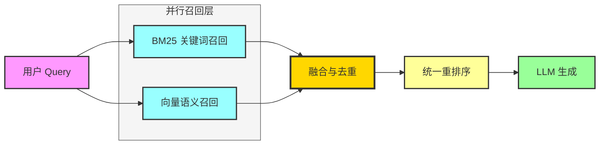
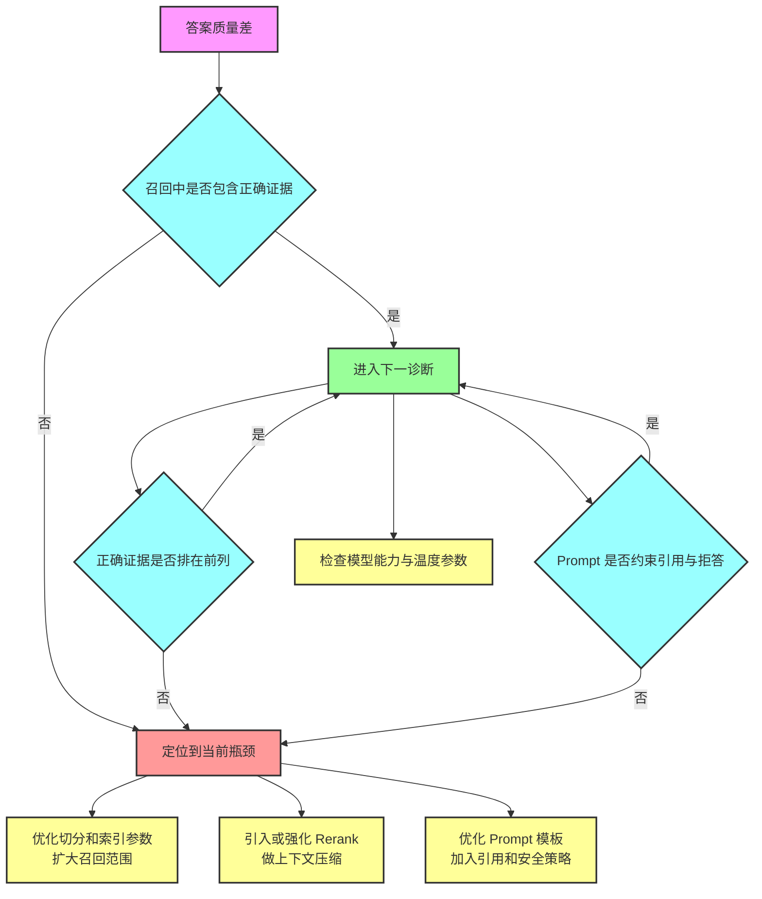
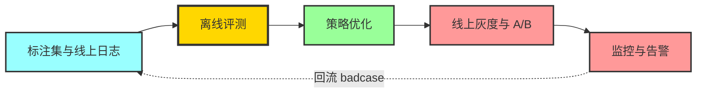
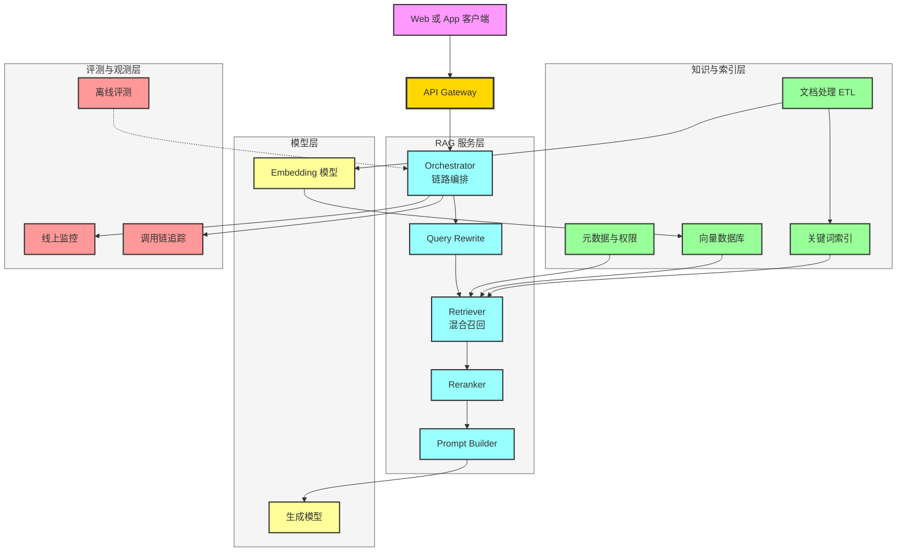

# RAG 全链路优化与面试全攻略

> 面向面试场景，系统讲解 RAG（Retrieval-Augmented Generation）核心知识、全链路优化方法（向量数据库、重排序、混合搜索）与可落地架构实践，配合 Mermaid 图帮助快速建立完整知识框架。

---

## 目录

- [一、RAG 核心概念与面试认知框架](#一rag-核心概念与面试认知框架)
- [二、RAG 标准流程与关键环节](#二rag-标准流程与关键环节)
- [三、向量数据库：原理、选型与调优](#三向量数据库原理选型与调优)
- [四、混合搜索：BM25 + 向量召回协同](#四混合搜索bm25--向量召回协同)
- [五、重排序（Rerank）：从召回相关到答案相关](#五重排序rerank从召回相关到答案相关)
- [六、RAG 全链路优化方法论（生产经验）](#六rag-全链路优化方法论生产经验)
- [七、RAG 评测与监控体系](#七rag-评测与监控体系)
- [八、经典架构方案与 Mermaid 示例](#八经典架构方案与-mermaid-示例)
- [九、RAG 面试 FAQ（高频 + 常考）](#九rag-面试-faq高频--常考)
- [十、面试回答模板（可直接复用）](#十面试回答模板可直接复用)

---

## 一、RAG 核心概念与面试认知框架

### 1.1 什么是 RAG

RAG 的核心是：**让大模型在回答时，先检索外部知识，再基于检索结果生成答案**。  
它不是“让模型记住所有知识”，而是“让模型学会在需要时查资料”。

### 1.2 RAG 解决了什么问题

| 问题 | 说明 | RAG 的作用 |
|---|---|---|
| 幻觉 | 模型会编造事实 | 用可追溯知识约束回答 |
| 知识时效性差 | 预训练数据不是实时更新 | 外部知识库可增量更新 |
| 私域知识缺失 | 训练集没有企业内部资料 | 接入企业文档、工单、FAQ |
| 可解释性差 | 直接生成难追责 | 可返回引用片段与来源 |

### 1.3 面试官最关注的四个能力

- 是否能说清 **RAG 的端到端链路**（数据到答案）。
- 是否理解 **召回、排序、生成** 的分工与瓶颈。
- 是否有 **优化经验**（不仅会调用 API）。
- 是否建立过 **评测与监控闭环**。

---

## 二、RAG 标准流程与关键环节

### 2.1 端到端流程

```mermaid
flowchart LR
    classDef userStyle fill:#f9f,stroke:#333,stroke-width:2px
    classDef ingestStyle fill:#9ff,stroke:#333,stroke-width:2px
    classDef storeStyle fill:#ffd700,stroke:#333,stroke-width:3px
    classDef retrieveStyle fill:#9f9,stroke:#333,stroke-width:2px
    classDef rerankStyle fill:#ff9,stroke:#333,stroke-width:2px
    classDef genStyle fill:#f99,stroke:#333,stroke-width:2px
    classDef evalStyle fill:#e8f4f8,stroke:#4299e1,stroke-width:1.5px
    classDef subStyle fill:#f5f5f5,stroke:#666,stroke-width:1px,rounded:10px

    U["用户问题"]:::userStyle

    subgraph offline["离线构建链路"]
        D1["文档清洗"]:::ingestStyle
        D2["切分 Chunk"]:::ingestStyle
        D3["Embedding 向量化"]:::ingestStyle
        D4["写入向量库与元数据"]:::storeStyle
    end
    class offline subStyle

    subgraph online["在线问答链路"]
        Q1["Query 改写"]:::retrieveStyle
        Q2["召回 TopK"]:::retrieveStyle
        Q3["重排序 Rerank"]:::rerankStyle
        Q4["上下文组装 Prompt"]:::genStyle
        Q5["LLM 生成答案"]:::genStyle
        Q6["返回答案与引用"]:::genStyle
    end
    class online subStyle

    M["评测与监控"]:::evalStyle

    U -->|"提问"| Q1
    Q1 -->|"检索请求"| Q2
    Q2 -->|"候选文档"| Q3
    Q3 -->|"高相关上下文"| Q4
    Q4 -->|"增强提示词"| Q5
    Q5 --> Q6

    D1 --> D2 --> D3 --> D4
    D4 -.->|"提供召回索引"| Q2
    Q6 -.->|"日志与反馈"| M
    M -.->|"优化切分和召回"| D2
    M -.->|"优化查询与排序"| Q1
```

### 2.2 每个阶段的核心目标

| 阶段 | 目标 | 常见坑 |
|---|---|---|
| 文档处理 | 保留结构化语义，减少噪声 | 直接按固定字数切分，丢失语义边界 |
| 召回 | 高召回率，别漏关键证据 | TopK 太小，召回不到关键片段 |
| 重排序 | 提升相关性，减少无关上下文 | 只依赖向量相似度，答案相关性不够 |
| 生成 | 忠实于证据，清晰作答 | Prompt 不约束引用，容易幻觉 |
| 评测 | 定位问题归因并持续优化 | 只看最终答案，不拆链路指标 |

### 2.3 为什么 RAG 常常“看起来可用，实际上不稳”

- 离线指标与线上真实问题分布不一致。
- 数据更新后未重建索引，召回质量下降。
- 没有区分“检索相关性”与“回答可用性”。
- 缺少灰度与 A/B，优化结果不可信。

---

## 三、向量数据库：原理、选型与调优

### 3.1 向量数据库核心能力

向量数据库不是“存 Embedding 的表”，而是一个检索系统，核心是：

- **ANN 索引**：在高维空间做近似最近邻搜索。
- **过滤能力**：按租户、时间、权限等元数据过滤。
- **更新能力**：增量写入、删除、重建索引。
- **吞吐与延迟**：高并发下控制 P95/P99。

### 3.2 常见 ANN 索引简述（面试高频）

| 索引 | 特点 | 适用场景 | 调参要点 |
|---|---|---|---|
| HNSW | 高召回、低延迟，内存占用较高 | 中高性能在线检索 | `M`、`efConstruction`、`efSearch` |
| IVF_FLAT | 先聚类再精排 | 海量数据，资源可控 | `nlist`、`nprobe` |
| IVF_PQ | 量化压缩，省内存 | 超大规模，成本敏感 | `pq` 码本维度、召回损失 |
| DiskANN（部分引擎） | 适合磁盘型大规模检索 | 数据超内存容量 | SSD 性能与图构建策略 |

### 3.3 向量库选型思路（答题模板）

可按这 5 个维度回答：

1. **数据规模**：百万、千万、亿级。  
2. **实时性**：分钟级更新还是天级批量。  
3. **检索延迟 SLA**：如 P95 < 150ms。  
4. **成本约束**：内存优先还是磁盘优先。  
5. **生态约束**：是否已有云服务、权限体系、备份体系。

### 3.4 生产调优经验（可直接说）

- TopK 不要盲目增大。通常先把 TopK 扩到 50~200，再交给重排序筛到 5~20。
- 元数据过滤前置，避免“全库 ANN 后再过滤”造成召回失真和延迟上升。
- 冷热分层：近期高频文档放高性能索引，历史数据放低成本层。
- 建立“索引版本号 + 回滚机制”，索引重建失败可以秒级回退。

---

## 四、混合搜索：BM25 + 向量召回协同

### 4.1 为什么必须做混合搜索

单一向量召回对以下场景经常失效：

- 专有名词、缩写、版本号（如 `v2.3.17`）。
- 精确关键词匹配（报错码、函数名、配置项）。
- 稀疏词重要但语义不明显的查询。

BM25 对关键词匹配强，向量对语义泛化强，二者互补。

### 4.2 混合召回架构

### 4.3 融合策略（面试常问）

| 策略 | 思路 | 优点 | 缺点 |
|---|---|---|---|
| 线性加权 | `score = a * bm25 + b * vector` | 简单直观 | 依赖归一化与权重调优 |
| RRF（Reciprocal Rank Fusion） | 按排名融合 | 对分数尺度不敏感 | 粒度较粗 |
| 分段策略 | 先保关键词命中，再补语义 | 对精确问答友好 | 规则维护成本高 |

> 建议：先用 RRF 快速上线，再在高价值业务上引入学习排序或策略路由。

---

## 五、重排序（Rerank）：从召回相关到答案相关

### 5.1 为什么重排序是 RAG 的关键增益点

召回阶段关注“可能相关”，而生成阶段需要“对回答最有帮助”。  
Rerank 把候选文档按“回答价值”重排，通常是性价比最高的优化点之一。

### 5.2 常见 Rerank 方式

| 方式 | 说明 | 精度 | 成本 |
|---|---|---|---|
| Cross-Encoder | Query 与 Doc 拼接后整体打分 | 高 | 较高 |
| LLM Judge 打分 | 让 LLM 评估候选证据 | 很高（可控） | 高 |
| 轻量双塔重打分 | 向量模型二次打分 | 中 | 低 |

### 5.3 典型两阶段策略

- 第一阶段：混合召回 Top100（高召回）。
- 第二阶段：Cross-Encoder 排到 Top10（高精度）。
- 第三阶段：上下文压缩与去冗余，送入生成。

### 5.4 上下文压缩经验

- 以段落为单位去重，避免同义重复信息占用窗口。
- 每个候选保留“证据句 + 简短上下文”，减少噪声。
- 对表格和代码块做结构化提取，避免原始文本过长。

---

## 六、RAG 全链路优化方法论（生产经验）

### 6.1 优化优先级（面试回答很加分）

1. **先查数据质量**：坏数据会放大后续所有问题。  
2. **再查召回覆盖**：是否召回到正确证据。  
3. **再查排序质量**：是否把最有用证据排前。  
4. **最后调 Prompt/生成**：避免过早在模型层“打补丁”。

### 6.2 全链路问题定位图

### 6.3 常见参数建议（仅作起点）

| 组件 | 参数 | 建议起点 |
|---|---|---|
| Chunk | 长度 | 300~800 tokens（按语义边界切） |
| Chunk | 重叠 | 10%~20% |
| 召回 | TopK | 50~150 |
| Rerank | TopN | 5~20 |
| 生成 | 温度 | 0.1~0.5（问答偏低） |

> 说明：最终参数必须基于业务数据集离线评测 + 线上 A/B 决定。

---

## 七、RAG 评测与监控体系

### 7.1 三层指标体系

| 层级 | 核心指标 | 作用 |
|---|---|---|
| 召回层 | Recall@K、MRR、nDCG | 评估是否召回到正确证据 |
| 答案层 | Faithfulness、Answer Relevance、准确率 | 评估回答质量与忠实度 |
| 系统层 | P95 延迟、QPS、失败率、成本 | 评估可用性与经济性 |

### 7.2 线上监控要点

- 对 Query 做意图分类看板（事实问答、步骤问答、检索失败类）。
- 建立 badcase 库，按“未召回、错排序、幻觉生成”打标签。
- 对版本变更做灰度：Embedding 模型、索引参数、Rerank 模型分别灰度。
- 监控引用率和拒答率，防止“答得多但不可信”。

### 7.3 评测闭环流程

---

## 八、经典架构方案与 Mermaid 示例

### 8.1 企业级 RAG 参考架构

### 8.2 多租户与权限控制（面试追问点）

- 检索前必须做租户过滤与文档 ACL 校验。
- 元数据中保留 `tenant_id`、`doc_level`、`source`、`timestamp` 等字段。
- 对“可见但不可引用”的文档可做策略分层（仅摘要可见）。

---

## 九、RAG 面试 FAQ（高频 + 常考）

### 9.1 基础概念类

**Q1：RAG 和微调（Fine-tuning）有什么区别？**  
A：RAG 通过外部检索注入知识，适合知识频繁变化和私域知识场景；微调是把能力写进模型参数，适合稳定任务模式学习。实践中常是二者结合：微调提升任务格式能力，RAG 保证知识时效与可追溯。

**Q2：RAG 为什么能降低幻觉？**  
A：因为答案被检索证据约束，模型不再完全依赖参数记忆。若再加“必须引用证据、无证据则拒答”的 Prompt 和后处理，幻觉会进一步下降。

**Q3：RAG 的核心瓶颈通常在哪里？**  
A：大多数场景在召回与重排序，而不是生成模型本身。常见问题是没召回到、或正确证据没排前面。

### 9.2 向量库与检索类

**Q4：向量维度越高越好吗？**  
A：不一定。维度更高可能增加表达能力，但也带来内存与延迟成本。应结合任务效果和系统约束做评测选型。

**Q5：为什么需要 ANN，不直接精确检索？**  
A：高维空间全量精确检索代价太高，ANN 通过可控精度损失换取数量级性能收益，是线上检索的常见选择。

**Q6：TopK 应该怎么定？**  
A：先保证召回覆盖，再用 Rerank 控制噪声。常见做法是召回 Top50~Top150，重排后取 Top5~Top20 给 LLM。

**Q7：索引更新怎么做才安全？**  
A：采用“双索引版本 + 灰度切流 + 可回滚”。新索引先小流量验证指标，再全量切换。

### 9.3 混合搜索与重排序类

**Q8：混合搜索一定比纯向量好吗？**  
A：在包含关键词精确匹配需求的业务里通常更稳，尤其是代码、日志、报错码、专业术语场景。纯语义召回容易漏掉关键字精确命中。

**Q9：RRF 和线性加权怎么选？**  
A：上线初期优先 RRF，鲁棒且调参成本低；当有稳定标注集时可尝试线性加权或学习排序追求更高上限。

**Q10：Cross-Encoder 为什么效果好？**  
A：因为它对 Query-Doc 做联合编码，能建模细粒度交互特征，通常比双塔相似度更贴近“是否能回答问题”。

### 9.4 工程与评测类

**Q11：如何判断是检索问题还是生成问题？**  
A：先看候选文档里是否存在正确证据。若不存在是检索问题；若存在但答案仍错，多半是排序、Prompt 或生成约束问题。

**Q12：你如何做 RAG 评测？**  
A：拆成召回、答案、系统三层指标；离线用标注集做 Recall@K、nDCG、Faithfulness，线上看延迟、失败率、引用率并持续回流 badcase。

**Q13：RAG 怎么控成本？**  
A：优先做缓存（查询缓存、检索结果缓存）、分级模型（简单问题小模型，复杂问题大模型）、上下文压缩和动态 TopK。

**Q14：RAG 如何支持多轮对话？**  
A：引入 Query Rewrite，把历史对话压缩成可检索的独立问题；同时维护会话记忆但限制回溯长度，防止噪声积累。

**Q15：如何做权限隔离？**  
A：在检索层前置 ACL 过滤，元数据中固化租户与权限标签，生成层再做二次校验，避免跨租户信息泄露。

### 9.5 深水区追问（高级岗位）

**Q16：如何处理长文档和结构化文档（表格、代码）？**  
A：分类型切分。正文按语义段落，表格按行列语义抽取，代码按函数或类切分，并保留路径、模块名等结构化元数据。

**Q17：如何减少“检索到但没用上”的现象？**  
A：提升重排序质量、做上下文压缩、在 Prompt 中强约束“先证据后结论”，并对答案进行引用一致性校验。

**Q18：如何做跨语言检索？**  
A：可用多语 Embedding 或翻译中间层。高质量方案通常是“多语向量 + 语言识别 + 同语优先召回 + 跨语补召回”。

**Q19：如何设计失败兜底策略？**  
A：当检索置信度过低时触发拒答、澄清提问或转人工；不要让模型在低证据条件下强答。

**Q20：RAG 的下一步演进方向？**  
A：从“检索增强”走向“Agentic RAG”：多步检索、工具调用、规划执行、长期记忆与自我评估闭环。

---

## 十、面试回答模板（可直接复用）

### 10.1 题目：请介绍你做过的 RAG 优化

可按 STAR 结构回答：

- **S（场景）**：我们做企业知识问答，初版命中率不稳定，幻觉率高。  
- **T（目标）**：在不显著增加成本前提下，提高答案准确率与可解释性。  
- **A（动作）**：  
  1) 文档从固定长度切分改为语义切分；  
  2) 召回改为 BM25 + 向量混合，并用 RRF 融合；  
  3) 增加 Cross-Encoder 重排序；  
  4) Prompt 增加引用约束与低置信拒答；  
  5) 建立离线评测与线上 badcase 回流。  
- **R（结果）**：召回覆盖、答案准确率和用户满意度提升，且延迟与成本可控。

### 10.2 题目：如果线上效果突然下降，你怎么排查

可按“数据 -> 召回 -> 排序 -> 生成 -> 系统”顺序回答：

1. 检查数据与索引版本是否一致。  
2. 用回放集看 Recall@K 是否下降。  
3. 检查 Rerank 模型和阈值是否变更。  
4. 验证 Prompt 模板和模型参数是否漂移。  
5. 看系统层延迟与超时是否导致截断或降级。  

---

## 附：面试前 30 分钟速记清单

- 先讲链路：文档处理 -> 召回 -> 重排序 -> 生成 -> 评测闭环。  
- 明确分工：召回看覆盖，重排看精度，生成看表达与约束。  
- 会说 trade-off：效果、延迟、成本三者平衡。  
- 会说工程化：灰度、A/B、回滚、监控、权限。  
- 会给案例数据：至少准备 1 个你亲手优化过的闭环案例。  

---

如果你希望，我可以再基于这份文档补一版“**面试官追问脚本**”（按初级/中级/高级岗位分层），并附上每题的“高分回答要点 + 常见扣分点”。
